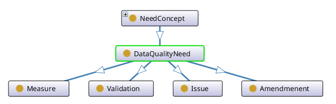
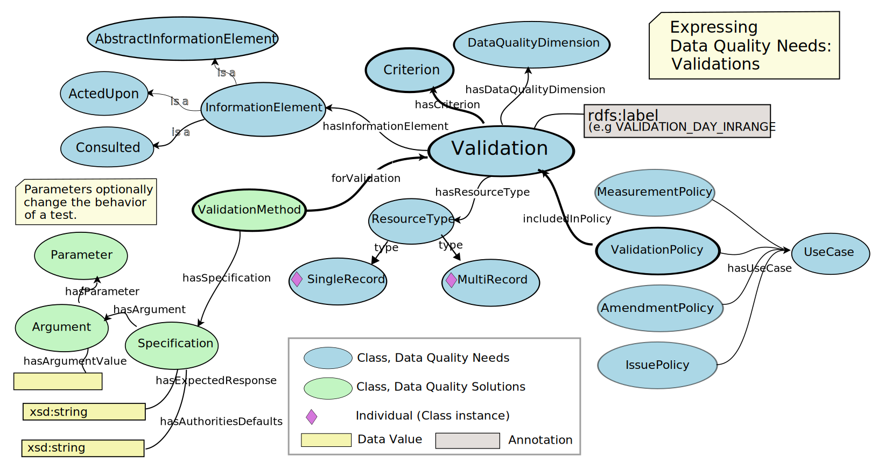
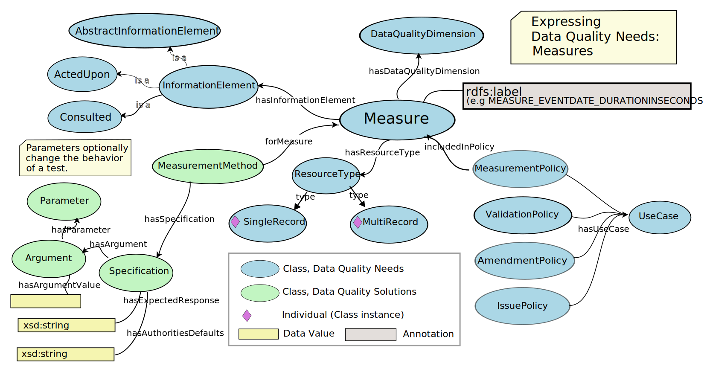
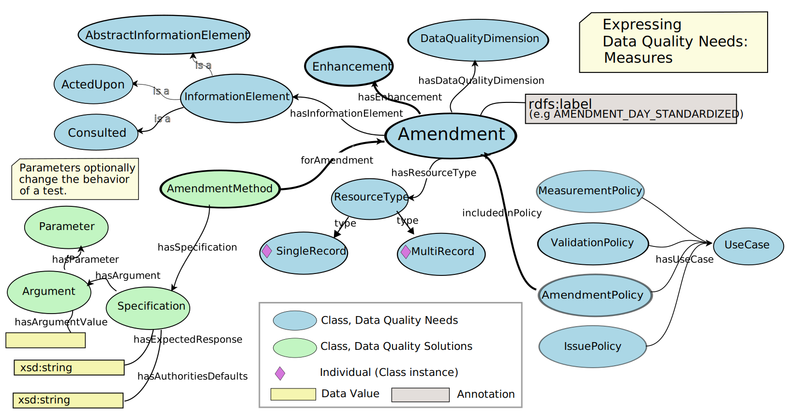
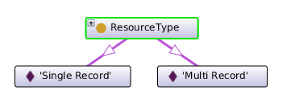
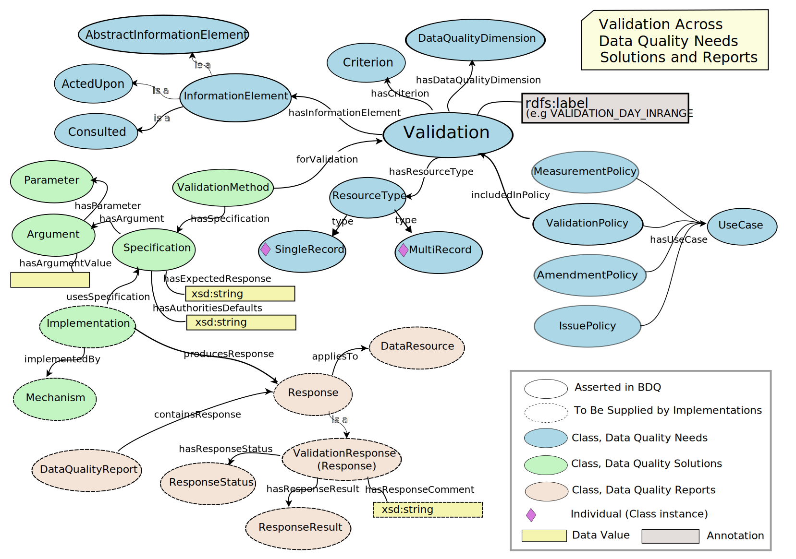
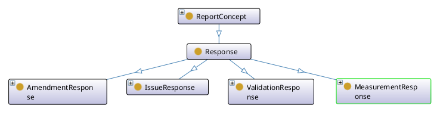

<!--- Template for header, values provided from yaml configuration --->
# {document_title}

**Title**<br>
{document_title}

**Date version issued**<br>
{ratification_date}

**Date created**<br>
{created_date}

**Part of TDWG Standard**<br>
<{standard_iri}>

<!--
**Preferred namespace abbreviation**<br>
{pref_namespace_prefix}
-->

**This version**<br>
<{current_iri}{ratification_date}>

**Latest version**<br>
<{current_iri}>

**Previous version**<br>
{previous_version_slot}

**Abstract**<br>
{abstract}

**Authors**<br>
{authors}

**Creator**<br>
{creator}

**Bibliographic citation**<br>
{creator}. {year}. {document_title}. {publisher}. <{current_iri}{ratification_date}>

**Status**<br>
{comment}

{toc}

## 1 Introduction (non-normative)

### 1.1 Purpose (non-normative)

The purpose of this document is to present the formal ontology of the Biodiversity Data Quality Fitness For Use Framework (the Framework), represented by the `bdqffdq:` vocabulary. This ontology defines the classes, properties, and relationships used to express data quality concepts in a structured and interoperable way, emphasizing that data quality is always relative to a particular purpose (`Use Case`) and the specific `Information Elements` and expectations that apply to that use.

This document combines two complementary roles. First, it provides a practical, explanatory guide to understanding the Framework concepts and how they support the structure and semantics of BDQ Tests, with context and illustrative examples for interpretation and implementation. Second, it serves as the normative companion for use of the ontology: it consolidates the normative guidance on how `bdqffdq:` terms are intended to be used together in RDF/OWL (and, where relevant, in non-RDF representations), including guidance that reflects the open world assumptions of RDF/OWL modeling.

Normative statements in this document specify expected patterns for relating key concepts such as `Use Case`, `Specification`, `Criterion`, `Data Quality Dimension`, `Enhancement`, `Mechanism`, and `Response` in consistent ways that support interoperable `Data Quality Reports` and workflows. The normative definitions of individual terms (e.g., labels, definitions, and axioms for each class or property) are provided in the `bdqffdq:` term-list document, vocabulary extension document, and the OWL ontology itself; this document focuses instead on the normative rules and explanatory rationale for using those terms together coherently.

### 1.2 Audience (non-normative)

This guide is intended for users who need a technical understanding of the Fitness For Use Framework and its ontology. It will be particularly useful for:

- Ontology engineers and information modelers incorporating the BDQ standard into semantic systems.
- Standards developers seeking to align other vocabularies with the BDQ standard.
- Implementers generating or consuming RDF data that describes BDQ Tests or their results.
- Implementers needing to understand how BDQ Tests are formally structured and classified.
- Researchers modeling `Use Cases` for biodiversity data quality assessments.
- Advanced users exploring the logical foundation behind BDQ Test design.

Readers should be familiar with ontology concepts, RDF/OWL syntax, and open world reasoning.

### 1.3 Associated Documents (non-normative)

For the list and links to all associated documents see [The Biodiversity Data Quality (BDQ) Standard](../../../index.md).

Information about the Fitness For Use Framework ontology, its usage, and its extensions can be found in the following subset of BDQ resources:

- **Fitness For Use Framework Ontology: Concepts and Use** - Provides a visual and narrative introduction to the concepts and application of the ontology along with normative guidance *(this document)*.
- [**Fitness For Use Framework Ontology List of Terms**](../../list/bdqffdq/index.md) - The term list document, which enumerates and describes the vocabulary terms.
- [**Fitness For Use Framework Ontology Vocabulary Extension**](../../extension/bdqffdq/index.md) - Defines additional axioms extending the core vocabulary.
- [**Biodiversity Data Quality Fitness For Use Framework (Ontology)**](../../../vocabulary/bdqffdq.owl) - The ontology, which provides the formal RDF/OWL representation of the vocabulary.

### 1.4 Status of the Content of this Document (normative)

Sections may be either normative (defines what is required to comply with the standard) or non-normative (supports understanding but is not binding) and are marked as such. 

Any sentence or phrase beginning with "For example" or "e.g.", whether in a normative section or a non-normative section, is non-normative.

Figures are non-normative.

### 1.5 RFC 2119 key words (normative)

The key words "MUST", "MUST NOT", "REQUIRED", "SHALL", "SHALL NOT", "SHOULD", "SHOULD NOT", "RECOMMENDED", "MAY", and "OPTIONAL" in this document are to be interpreted as described in RFC 2119.

### 1.6 Namespace abbreviations (non-normative)

The following namespace abbreviations are used in this document:

| **Abbreviation** | **Namespace** |
| ------------ | -------------                               |
| bdqval:      | https://rs.tdwg.org/bdqval/terms/           |
| bdquc:       | https://rs.tdwg.org/bdquc/terms/            |
| bdqtest:     | https://rs.tdwg.org/bdqtest/terms/          |
| bdqcrit:     | https://rs.tdwg.org/bdqcrit/terms/          |
| bdqdim:      | https://rs.tdwg.org/bdqdim/terms/           |
| bdqffdq:     | https://rs.tdwg.org/bdqffdq/terms/          |
| dcterms:     | http://purl.org/dc/terms/                   |
| dwc:         | http://rs.tdwg.org/dwc/terms/               |
| owl:         | http://www.w3.org/2002/07/owl#              |
| rdfs:        | http://www.w3.org/2000/01/rdf-schema#       |
| skos:        | http://www.w3.org/2004/02/skos/core#        |
| prov:        | http://www.w3.org/ns/prov#                  |
| dqv:         | http://www.w3.org/ns/dqv#                   |
| ldqd:        | http://www.w3.org/2016/05/ldqd#             |
| xsd:         | http://www.w3.org/2001/XMLSchema#           |

### 1.7 Referring to Terms (normative)

In any technical treatment of the BDQ standard, a precise reference to a class or property term SHOULD be made using its qualified name (the namespace prefix followed by the term local name; e.g., `bdqffdq:InformationElement`) and the namespace IRI corresponding to the namespace prefix (e.g., `https://rs.tdwg.org/bdqffdq/terms/` for `bdqffdq:`) MUST be provided. In less formal descriptions where the technical precision is not needed, the preferred label (`skos:prefLabel`, e.g., `Information Element`) or the term local name (e.g., `InformationElement`) MAY be used. The BDQ documents use all these methods.

## 2 Framework for describing data quality (non-normative)

### 2.1 Introduction and Context (non-normative)

The `bdqffdq:` portion of the BDQ standard is a specification for a framework for describing data quality. This Fitness For Use Framework (often referred to simply as "The Framework") is based on a mathematical formulation, using set theory (Veiga, 2016), and is represented as an OWL ontology. This document describes the organization and use of the OWL ontology.  While the Fitness For Use Framework is described within a Biodiversity Data Quality context, the concepts and structure of the Framework are applicable to data quality in any domain. 

This document provides a background for understanding the `bdqtest:` Test descriptions. Each of the Tests in the `bdqtest:` namespace have been designed and described within this Framework and are framed using the terms and concepts from the Framework. The Fitness For Use Framework provides the context for each Test, and has shaped decisions made about each Test.

This document provides a concise description and normative information about the `bdqffdq:` ontology and a summary of the mathematical formalization. See the [Fitness For Use Framework Ontology List of Terms](../../list/bdqffdq/index.md) document for the list of terms in the `bdqffdq:` vocabulary. See the [Fitness For Use Framework Ontology Vocabulary Extension](../../extension/bdqffdq/index.md) for documentation on additional axioms. See the [Biodiversity Data Quality Fitness For Use Framework (Ontology)](../../../vocabulary/bdqffdq.owl) for the formal representation of the vocabulary as an OWL ontology. The mathematical formalization provides a description of inferences and reasoning that may be made with the terms in the vocabulary.

### 2.2 Description of the Fitness For Use Framework ontology (non-normative)

The Fitness For Use Framework defines data quality in relation to a specified use, emphasizing that data quality is not abstract but purpose-dependent. It provides a formal way to describe a `Use Case` (`bdqffdq:UseCase`) and the criteria for evaluating whether a dataset is fit for that purpose. By linking data quality explicitly to use, the Framework enables consistent assessment and assurance of fitness for a given purpose.

The Framework can be conceptually divided into three horizontal layers: `Data Quality Needs`, `Data Quality Solutions`, and `Data Quality Reports`. Needs describe what it means for data to have quality for some use, Solutions describe tools to evaluate quality, and Reports are produced by Solutions to describe the evaluation of quality in particular datasets. `Data Quality Solutions` (the Solutions layer) are realized by `Mechanisms` via `Implementations`.

The Framework can also be conceptually divided into four vertical themes, four sets of related concepts that carry through the Needs, Solutions, and Reports layers. These concepts are `Validation`, `Issue`, `Measure`, and `Amendment`. 

In BDQ, "Test" is used as an informal umbrella term to describe these four vertical concept families (`Validation`, `Issue`, `Measure`, `Amendment`), as they connect and involve terms in both the `Data Quality Needs` and `Data Quality Solutions` layers.  See the diagram in [BDQ Tests: An Operational Perspective](../bdqtest/index.md#51-bdq-tests-an-operational-perspective-non-normative).

**Data Quality Needs** begin with a `Use Case`, a formal description of a purpose for which data may be used. Each `Use Case` includes a set of `Policies`, which in turn relate to `Data Quality Needs`.  The `Data Quality Needs` (i.e., `Validation`, `Measure`, `Amendment`, `Issue`) specify the data quality requirement (Need), the relevant `Information Elements` (such as specific Darwin Core terms), and the `Resource Type` the requirement applies to. A 'Data Quality Need` defines the properties data must have to be considered fit for use and may include ways to improve unfit data. The Tests described in this standard are formal specifications of such `Data Quality Needs` for BDQ purposes.

**Data Quality Mechanisms** are formal descriptions of software or other tools that implement the Tests. They execute the `Specifications` defined in the Needs layer.

**Data Quality Reports** are the outputs generated when `Mechanisms` are applied to data. The Tests include formal specifications of `Responses` that are expected to appear in these Reports.

We can visualize the Framework's Needs, Solutions, and Reports layers, and then follow the Test concepts vertically through each layer (see [Figure 3](https://journals.plos.org/plosone/article?id=10.1371/journal.pone.0178731#pone-0178731-g003) in Veiga et al., 2017). Below is a diagram that brings together the horizontal Needs, Solutions, and Reports layers with the vertical Test concepts (`Validations`, `Issues`, `Measures` and `Amendments`), with `Validation`-related concepts expanded to show all related entities in the Fitness For Use Framework.


*All four Tests concepts in the Needs Solutions, and Reports levels.*

#### 2.2.1 Data Quality Control and Data Quality Assurance (non-normative)

The Framework draws a distinction between **Quality Control** and **Quality Assurance**. `Quality Control` processes seek to assess the quality of data for some purpose, then identify changes to the data or to processes around the data to improve their quality. Quality Assurance processes seek to filter some set of data to a subset that is fit for some purpose, that is, to assure that data used for some purpose are fit for that purpose.

For **Quality Assurance**, the Framework defines `Measures` that operate on `Multi Records` and return a `Response.result` of `COMPLETE` or `NOT_COMPLETE`. A `Multi Record` `Measure` may be `COMPLETE` if all aggregated instances of a related `Single Record` `Validation` are `COMPLIANT`.

For **Quality Control**, `Multi Record` `Measures` can return numeric summaries of the results of other Tests (e.g. count of `COMPLIANT` results for a `Validation`), thereby indicating how fit a dataset is for its intended purpose and how many adjustments are needed to make it fully fit.

It is important to recognize that BDQ does not standardize complete `Quality Control` or `Quality Assurance` workflows (e.g., user roles, review and remediation procedures, pipelines, thresholds, or reporting formats). Instead, BDQ standardizes the semantics of Tests and their `Responses` and provides `Measure` patterns that can be used to support `Quality Control` and `Quality Assurance` workflows in a consistent way.

#### 2.2.2 Information Elements (non-normative)

`Information Elements` are the inputs to a Test, they identify the specific data elements that are evaluated in a Test. `Information Elements` are the properties of data that are examined to determine if the data meet the quality requirements for a given `Use Case`.

The Framework has both an abstract and concrete concept of `Information Elements`. To frame Tests on Darwin Core terms in a usable way, we list specific Darwin Core terms as the concrete `Information Elements` in each Test.

#### 2.2.3 Concepts in the Framework, Test Types: Validation, Issue, Measure, Amendment (non-normative)

The Framework defines four central concepts for describing and evaluating `Data Quality Needs`: `Validation`, `Issue`, `Measure`, and `Amendment`.  



*The 4 central DataQualityNeed types in the Framework - Validation, Issue, Measure, and Amendment.*

A `Validation` assesses compliance with a need. Data have quality if they are compliant with the requirements of the `Validation` Test. A `Validation` relates `Information Elements` and `Resource Types` with a `Specification` of exactly how to assess fitness of the data under some narrow `Criteria`, and themselves are assembled into `Validation Policies`, which are linked to other `Policies` to cover a description of the `Data Quality Needs` of a `Use Case`.  Data have quality only with respect to some use, so `Validations` must be composed with `Use Cases` to be able to assess fitness for use.



*Expressing `Data Quality Needs`: Validations.*

`Issues` are the converse of `Validations`. Data lack quality if an `Issue` identifies a potential problem in the data that would require further human review to determine if the data have quality for some purpose.  Like `Validations`, `Issues` relate `Information Elements` and `Resource Types` with a `Specification` of exactly how to assess fitness of the data under some `Use Case`.  No illustration is provided here, as the `Issue` concept is very similar to the `Validation` concept, but with a different focus on identifying potential problems rather than confirming compliance.  

`Validations`, `Measures`, `Amendments`, and `Issues` all share a similar set of relationships to other classes in the Framework.  The following diagrams for `Measures` and `Amendments` highlight these similarities, with classes and relationships that differ called out with thicker line weights.

`Measures` make an aggregate summary of some specific aspect of data quality.



*Expressing Data Quality Needs: Measures.*

`Amendments` propose changes to data or processes that, if accepted, may improve the fitness of data for a specific use.



*Expressing Data Quality Needs: Amendments.*

Formally, in the `Data Quality Needs` level, the Framework starts with a `Use Case`, a framing of some use to which data may be put. `Use Cases` are related to the formal description of `Data Quality Needs` through `Policies`. `Data Quality Needs`, such as a `Validation` are related to the `Information Elements` that need to be examined, and to the `Resource Type` that is operated on.  `Methods` such as `ValidationMethod` relate the `Data Quality Needs` to `Specifications` for the evaluation of those needs.  The `Data Quality Need` specifies in general terms what properties data must have to have quality, and the related `Specification` provides a formal description of how to evaluate that aspect of quality.

Each of the Tests described in the BDQ standard has a formal specification that includes each of these elements. 

`Data Quality Needs` can relate to the data quality of single records (`bdqffdq:SingleRecord`) or of datasets (`bdqffdq:MultiRecord`).



*Representation of Single Record and Multi Record as named individual instances of the Resource class.*

### 2.3 Extending to Data Quality Mechanisms and Data Quality Reports (non-normative)

Software that implements one or more tests is a `Mechanism`. A `Mechanism` is a formal description of a software tool that implements one or more Tests.  Each of those Tests has an `Implementation` in that `Mechanism`, which is a formal description of how the `Mechanism` implements the Test.  An `Implementation` is linked via `bdqffdq:usesSpecification` to the specification of a Test.  An `Implementation` also produces `Responses` that are linked to the `Implementation` via `bdqffdq:producesResponse` and may be assembled into `Data Quality Reports`.

The property `bdqffdq:usesSpecification` draws a separation between the specification of how a Test is defined and an actual concrete implementation of that Test in software. This separation allows for multiple implementations of the same Test, and for implementations to evolve independently of the Test specifications.

A Test, conceptually, is a set of classes and properties that provide a formal description of what outputs a software implementation should produce for given inputs.  The classes are a `Specification` linked through a `Data Quality Method` (`Validation Method`, `Issue Method`, `Measure Method`, and `Amendment Method`) to a `Data Quality Need` (`Validation`, `Issue`, `Measure`, or `Amendment`).  The properties associated with the `Data Quality Need` provide a general description of what aspect of data quality the Test assesses (and what its inputs are), while the properties associated with the `Specification` provide the specific details of the expected behavior of the Test needed for a developer to implement the Test.  The `bdqtest:` vocabulary provides these specific details for each Test, independent of any particular software implementation.

On the other side of `bdqffdq:usesSpecification`, a software implementation of a Test produces `Responses`.  These are the outputs of Test execution, and provide an assessment of the fitness of some data for some use.  Thus The Fitness For Use Framework divides responsibilities between the specification of what is needed for data to have quality (`Use Cases` and Tests)  and the software implementations of those Tests with the actual assertions about data quality in `Responses` produced by those implementations.

Below is a diagram of the composition of `Validation`, `Validation Method`, and `Validation Response` illustrating the `Data Quality Needs`, `Solutions`, and `Reports` layers of the Fitness For Use Framework, identifying the responsibilities of `bdqtest:` (shown with solid lines), and implementations (shown with dashed lines).



*Validation concepts in the Needs, Solutions, and Reports levels.*

### 2.4 Responses (non-normative)

The content of this section is non-normative, related normative guidance is in section [5.1 The Response Object (normative)](../implementers/index.md#51-the-response-object-normative) of the [BDQ Implementer's Guide](../implementers/index.md).

A `Response` is a formal description of the output of a Test, including the status of the Test execution, the result of the Test, and any comments or qualifiers that provide additional information about the result.  `Responses` can be assembled into `Data Quality Reports` that summarize the results of applying one or more Tests to a dataset.  

`Responses` are typed as `Validation Response`, `Issue Response`, `Measure Response`, or `Amendment Response` depending on the type of Test that produced them.



*The 4 `Response` types in the Framework - `ValidationResponse`, `IssueResponse`, `MeasureResponse` and `AmendmentResponse`.*

`Response` objects may be represented in an RDF context as a combination of object properties and data properties on a `Response` resource.  In a non-RDF context, such as JSON or a tabular format, a `Response` might be represented as an object with properties or as a row with columns for each of the properties.  The key properties of a `Response` are `Response.status`, `Response.result`, `Response.comment`, and optionally, `Response.qualifier`.  In a non-RDF context, these may be simple fields in a structured data format, while in an RDF context, these would be represented using the appropriate properties from the `bdqffdq:` vocabulary (e.g., `bdqffdq:hasResponseStatus`, `bdqffdq:hasResponseResult`, `bdqffdq:hasResponseComment`, and `bdqffdq:hasResponseQualifier`) where the distinction between categorical values (e.g. using `bdqffdq:hasResponseResult`) and literal values (e.g. using `bdqffdq:hasResponseResultValue`) is important.

It is expected that instances of `Response` objects will involve, in RDF, a combination of object properties and data properties on a `Response`.  In an object oriented language like Java, a `Response` might be an object with properties, and in a tabular format, a `Response` might be a row with columns for each of the properties. The following table gives an overview of the expected properties of a `Response` object, and the corresponding terms in the `bdqffdq:` vocabulary.

| Shorthand Concept | bdqffdq: Term(s) | Description |
| ----------------- | ---------------- | ----------- |
| Response | bdqffdq:Response | The report from a single execution of a single Test, consisting of a Response.status, a Response.result, a Response.comment, and optionally, a Response.qualifier.| 
| Response.status | bdqffdq:ResponseStatus, bdqffdq:hasResponseStatus | A metadata element in a `Response` indicating whether a particular Test (bdqffdq:Validation, bdqffdq:Issue, bdqffdq:Measure, or bdqffdq:Amendment) was able to be performed or not. |
| Response.result | bdqffdq:ResponseResult, bdqffdq:hasResponseResult, bdqffdq:hasResponseResultValue | The element in a `Response` containing the value returned by a Test (bdqffdq:Validation, bdqffdq:Issue, bdqffdq:Measure, or bdqffdq:Amendment)|
| Response.comment | bdqffdq:hasResponseComment | A human readable interpretation of the results of the Test.|
| Response.qualifier | bdqffdq:ResponseQualifier, bdqffdq:hasResponseQualifier | Additional structured information that qualifies the `Response`, intended as an extension point for uncertainty.|

See [4.1 Structure of a Response (normative)](../../guide/bdqtest/index.md#41-structure-of-response-normative) in [BDQ Tests: Concepts and Use](../../guide/bdqtest/index.md) for further normative guidance on Responses as RDF or as data structures in non-RDF settings.

### 2.4.1 Properties of Responses (normative) 

In an RDF context, the status property of a `Response` MUST be represented using an IRI (e.g., `bdqffdq:RUN_HAS_RESULT`) as the object of `bdqffdq:hasResponseStatus`.

In an RDF context, the result property of a `Response` MUST be represented using:
- `bdqffdq:hasResponseResult` when the result is categorical and comes from the controlled set of `bdqffdq:ResponseResult` named individuals (e.g., `bdqffdq:COMPLIANT`, `bdqffdq:NOT_COMPLIANT`, `bdqffdq:COMPLETE`, `bdqffdq:NOT_COMPLETE`, `bdqffdq:POTENTIAL_ISSUE`, `bdqffdq:NOT_ISSUE`); or
- `bdqffdq:hasResponseResultValue` when the result is a literal payload (e.g., a numeric measurement, a string, or structured text such as JSON for an `Amendment` proposal). The value of `bdqffdq:hasResponseResultValue` MUST be a literal and SHOULD use an appropriate datatype (e.g., `xsd:integer`, `rdf:JSON`).

In a non-RDF structured-data context (JSON, database, CSV), where `bdqffdq:ResponseStatus` and `bdqffdq:ResponseResult` are represented as strings, controlled values MUST be used and the values MUST be the local names (e.g., `RUN_HAS_RESULT`, `COMPLIANT`), unless the result is a literal value (corresponding to use of `bdqffdq:hasResponseResultValue` in RDF), in which case the value MUST be that literal.

Labels MAY be used purely for display.

This section summarizes representation choices. Full normative constraints on the response structure of `Responses` is found in [4.1 Structure of Response (normative)](../bdqtest/index.md#41-structure-of-response-normative) of the [BDQ Tests: Concepts and Use](../bdqtest/index.md) document.

#### 2.4.1.1 Table of Representations of Response Properties (non-normative)

Summary of the expected properties of a `Response` object, and the corresponding terms in the `bdqffdq:` vocabulary, with examples of RDF and non-RDF representations.

| Context | Informal Response property | RDF predicate / field | Required representation | Example |
|---------|-----------------------------|-----------------------|-------------------------|---------|
| RDF | `Response.status` (categorical) | `bdqffdq:hasResponseStatus` | IRI of a named individual | `bdqffdq:RUN_HAS_RESULT` |
| RDF | `Response.result` (categorical) | `bdqffdq:hasResponseResult` | IRI of a named individual | `bdqffdq:COMPLIANT` |
| RDF | `Response.result` (literal) | `bdqffdq:hasResponseResultValue` | Literal (SHOULD use an appropriate datatype) | `"17"^^xsd:integer` |
| RDF | `Response.comment` (literal) | `bdqffdq:hasResponseComment` | Literal (string; MAY be language-tagged) | `"Provided value 11 is a valid dwc:day."@en` |
| Non-RDF structured data (categorical) | `Response.status` | string corresponding to `bdqffdq:ResponseStatus` | controlled value local name string | `RUN_HAS_RESULT` |
| Non-RDF structured data (categorical) | `Response.result` | string corresponding to `bdqffdq:ResponseResult` | controlled value local name string | `COMPLIANT` |
| Non-RDF structured data (literal) | `Response.result` | field corresponding to `bdqffdq:hasResponseResultValue` | literal | `17` |
| Non-RDF structured data (literal) | `Response.comment` | field corresponding to `bdqffdq:hasResponseComment` | literal (string) | `Provided value 11 is a valid dwc:day.` |

A `bdqffdq:hasResponseStatus` is always categorical, a `bdqffdq:hasResponseComment` is always literal, a `Response.result` may be either a categorical `bdqffdq:hasResponseResult` or a literal `bdqffdq:hasResponseResultValue`.  

It is precisely because of this potential for results to be represented as RDF or as non-RDF structured data that the `Named Individuals` such as `bdqffdq:COMPLIANT` used in results are given labels in all upper case with underscores to facilitate their use and recognition as string constant values in non-RDF contexts.

### 2.5 Organization of the bdqffdq: classes  (non-normative)

Following is a knowledge graph showing the is-a relationships between the classes in the Fitness For Use Framework:


*Diagram showing the relationships among the bdqffdq: classes.*

### 2.6 Example representation of a BDQ Test (non-normative)

Below is a fragment in Turtle describing VALIDATION_COUNTRY_FOUND, composed of a `Validation`, linking an `Acted Upon` `Information Element`, a `Criterion`, and the `Resource Type` `Single Record`, with the `Validation` linked to a `Validation Method`, and from there a `Specification`. Also shown is a `Validation Policy` linking this `Validation` to a `Use Case`.

```turtle
    bdqtest:69b2efdc-6269-45a4-aecb-4cb99c2ae134-2025-03-07 a bdqffdq:Validation;
      bdqffdq:hasResourceType bdqffdq:SingleRecord;
      skos:note "Non-country information such as \"high seas\" will fail this Test (high seas should use dwc:countryCode = \"XZ\" and have dwc:country empty). Getty Place Types for administrative level \"nation\" are 81010 nation, 81011 independent sovereign nation, and 81012 independent nation. Multiple values in the dwc:country field (whether to signify on a border or in a list of possibilities) will fail this Test. Locations outside of a jurisdiction covered by a country code should not have a value in the field dwc:countryCode. This Test should find any matches at the Getty \"nation\" level including internationalized names and historical representations of that nation (where boundaries are same). This Test must return NOT_COMPLIANT if there is leading or trailing whitespace or there are leading or trailing non-printing characters.";
      bdqffdq:hasDataQualityDimension bdqdim:Conformance;
      bdqffdq:hasCriterion bdqcrit:Found;
      bdqffdq:hasActedUponInformationElement <urn:uuid:30db5994-81fa-4684-ac54-cfc226209d27>;
      dcterms:issued "2025-03-07"^^xsd:date;
      dcterms:bibliographicCitation "Getty Research Institute (2017) Getty Thesaurus of Geographic Names Online. https://www.getty.edu/research/tools/vocabularies/tgn/index.html; Chapman AD and Wieczorek JR (2020) Georeferencing Best Practices. Copenhagen: GBIF Secretariat. https://doi.org/10.15468/doc-gg7h-s853";
      rdfs:comment "Does the value of dwc:country occur in the bdqval:sourceAuthority?";
      skos:historyNote "https://github.com/tdwg/bdq/issues/21";
      rdfs:label "VALIDATION_COUNTRY_FOUND";
      dcterms:isVersionOf bdqtest:69b2efdc-6269-45a4-aecb-4cb99c2ae134;
      skos:prefLabel "Validation dwc:country Found for SingleRecord" .
    
    bdqcrit:Found a bdqffdq:Criterion;
      rdfs:label "Found" . 
    
    bdqdim:Conformance a bdqffdq:DataQualityDimension;
      rdfs:label "Conformance" .
    
    <urn:uuid:30db5994-81fa-4684-ac54-cfc226209d27> a bdqffdq:ActedUpon;
      bdqffdq:composedOf dwc:country;
      rdfs:label "Information Element ActedUpon dwc:country";
      skos:prefLabel "Information Element ActedUpon dwc:country" .
    
    <urn:uuid:04cee4e0-0c83-40cc-8de2-e7391f0a97a9> a bdqffdq:ValidationMethod;
      skos:note "Example Implementations: Kurator/FilteredPush geo_ref_qc Library (Morris & Lowery 2025b)",
        "Example Implementations Source Code: https://github.com/FilteredPush/geo_ref_qc/blob/v2.0.1/src/main/java/org/filteredpush/qc/georeference/DwCGeoRefDQ.java#L158",
        "TG2 Validation SPACE CODED Test VOCABULARY Conformance Parameterized CORE";
      bdqffdq:hasSpecification <urn:uuid:051f6ad7-1a4b-4e6c-8a1d-2af76de24848>;
      skos:historyNote "Source: ALA, GBIF";
      rdfs:label "ValidationMethod: VALIDATION_COUNTRY_FOUND with Specification for: VALIDATION_COUNTRY_FOUND";
      skos:prefLabel "ValidationMethod: VALIDATION_COUNTRY_FOUND with Specification for: VALIDATION_COUNTRY_FOUND";
      bdqffdq:forValidation bdqtest:69b2efdc-6269-45a4-aecb-4cb99c2ae134-2025-03-07 .
    
    <urn:uuid:051f6ad7-1a4b-4e6c-8a1d-2af76de24848> a bdqffdq:Specification;
      skos:example "dwc:country=\"Eswatini\": Response.status=RUN_HAS_RESULT, Response.result=COMPLIANT, Response.comment=\"dwc:country is a valid country name in the bdqval:sourceAuthority\"",
        "dwc:country=\"Tasmania\": Response.status=RUN_HAS_RESULT, Response.result=NOT_COMPLIANT, Response.comment=\"Tasmania is not found at the level of national in the bdqval:sourceAuthority\"";
      bdqffdq:hasAuthoritiesDefaults "bdqval:sourceAuthority default = \"The Getty Thesaurus of Geographic Names (TGN)\" {[https://www.getty.edu/research/tools/vocabularies/tgn/index.html]}";
      rdfs:comment "EXTERNAL_PREREQUISITES_NOT_MET if the bdqval:sourceAuthority is not available; INTERNAL_PREREQUISITES_NOT_MET if dwc:country is bdqval:Empty; COMPLIANT if value of dwc:country is a place type equivalent to administrative entity of \"nation\" in the bdqval:sourceAuthority; otherwise NOT_COMPLIANT bdqval:sourceAuthority default = \"The Getty Thesaurus of Geographic Names (TGN)\" {[https://www.getty.edu/research/tools/vocabularies/tgn/index.html]}";
      bdqffdq:hasExpectedResponse "EXTERNAL_PREREQUISITES_NOT_MET if the bdqval:sourceAuthority is not available; INTERNAL_PREREQUISITES_NOT_MET if dwc:country is bdqval:Empty; COMPLIANT if value of dwc:country is a place type equivalent to administrative entity of \"nation\" in the bdqval:sourceAuthority; otherwise NOT_COMPLIANT";
      rdfs:label "Specification for: VALIDATION_COUNTRY_FOUND";
      bdqffdq:hasArgument <urn:uuid:3e00109a-13d3-416d-9a91-127c99b47473> .
    
    <urn:uuid:3e00109a-13d3-416d-9a91-127c99b47473> a bdqffdq:Argument;
      bdqffdq:hasArgumentValue "The Getty Thesaurus of Geographic Names (TGN)";
      rdfs:label "Default value for bdqval:sourceAuthority:\"The Getty Thesaurus of Geographic Names (TGN)\"";
      bdqffdq:hasParameter bdqval:sourceAuthority .
  
    bdqval:sourceAuthority a bdqffdq:Parameter .     
    
    <urn:uuid:0053ca4f-7d45-41ea-912e-c8847bb70142> a bdqffdq:ValidationPolicy;
      rdfs:label "ValidationPolicy: (49) validations  in UseCase bdquc:Spatial-Temporal_Patterns";
      bdqffdq:hasUseCase bdquc:Spatial-Temporal_Patterns;
      bdqffdq:includedInPolicy bdqtest:0493bcfb-652e-4d17-815b-b0cce0742fbe-2025-03-07,
        bdqtest:69b2efdc-6269-45a4-aecb-4cb99c2ae134-2025-03-07, bdqtest:8f1e6e58-544b-4365-a569-fb781341644e-2025-03-07,
        bdqtest:0949110d-c06b-450e-9649-7c1374d940d1-2025-03-07, bdqtest:f51e15a6-a67d-4729-9c28-3766299d2985-2025-03-07,
        bdqtest:3cff4dc4-72e9-4abe-9bf3-8a30f1618432-2025-03-06, bdqtest:0bb8297d-8f8a-42d2-80c1-558f29efe798-2025-03-07,
        bdqtest:58486cb6-1114-4a8a-ba1e-bd89cfe887e9-2025-03-07, bdqtest:6ce2b2b4-6afe-4d13-82a0-390d31ade01c-2025-03-07,
        bdqtest:3f335517-f442-4b98-b149-1e87ff16de45-2025-03-06, bdqtest:c09ecbf9-34e3-4f3e-b74a-8796af15e59f-2025-03-06,
        bdqtest:adb27d29-9f0d-4d52-b760-a77ba57a69c9-2025-03-07, bdqtest:b9c184ce-a859-410c-9d12-71a338200380-2025-03-07,
        bdqtest:f18a470b-3fe1-4aae-9c65-a6d3db6b550c-2025-03-07, bdqtest:ac2b7648-d5f9-48ca-9b07-8ad5879a2536-2025-03-07,
        bdqtest:7e0c0418-fe16-4a39-98bd-80e19d95b9d1-2025-03-07, bdqtest:b23110e7-1be7-444a-a677-cdee0cf4330c-2025-03-07,
        bdqtest:4f2bf8fd-fc5c-493f-a44c-e7b16153c803-2025-03-06, bdqtest:66269bdd-9271-4e76-b25c-7ab81eebe1d8-2025-03-07,
        bdqtest:4c09f127-737b-4686-82a0-7c8e30841590-2025-03-06, bdqtest:dc8aae4b-134f-4d75-8a71-c4186239178e-2025-03-07,
        bdqtest:239ec40e-a729-4a8e-ba69-e0bf03ac1c44-2025-03-07, bdqtest:b6ecda2a-ce36-437a-b515-3ae94948fe83-2025-03-07,
        bdqtest:7c4b9498-a8d9-4ebb-85f1-9f200c788595-2025-03-06, bdqtest:ad0c8855-de69-4843-a80c-a5387d20fbc8-2025-03-06,
        bdqtest:1bf0e210-6792-4128-b8cc-ab6828aa4871-2025-03-07, bdqtest:41267642-60ff-4116-90eb-499fee2cd83f-2025-03-06,
        bdqtest:cdaabb0d-a863-49d0-bc0f-738d771acba5-2025-03-07, bdqtest:9beb9442-d942-4f42-8b6a-fcea01ee086a-2025-03-07,
        bdqtest:853b79a2-b314-44a2-ae46-34a1e7ed85e4-2025-03-07, bdqtest:374b091a-fc90-4791-91e5-c1557c649169-2025-03-07,
        bdqtest:42408a00-bf71-4892-a399-4325e2bc1fb8-2025-03-07, bdqtest:06851339-843f-4a43-8422-4e61b9a00e75-2025-03-06,
        bdqtest:04b2c8f3-c71b-4e95-8e43-f70374c5fb92-2025-03-07, bdqtest:d708526b-6561-438e-aa1a-82cd80b06396-2025-03-07,
        bdqtest:c6adf2ea-3051-4498-97f4-4b2f8a105f57-2025-03-07, bdqtest:c971fe3f-84c1-4636-9f44-b1ec31fd63c7-2025-03-07,
        bdqtest:7af25f1e-a4e2-4ff4-b161-d1f25a5c3e47-2025-03-07, bdqtest:eb4a17f6-6bea-4cdd-93dd-d5a7e9d1eccf-2025-03-07,
        bdqtest:7d2485d5-1ba7-4f25-90cb-f4480ff1a275-2025-03-07, bdqtest:8d787cb5-73e2-4c39-9cd1-67c7361dc02e-2025-03-06,
        bdqtest:01c6dafa-0886-4b7e-9881-2c3018c98bdc-2025-03-06, bdqtest:85803c7e-2a5a-42e1-b8d3-299a44cafc46-2025-03-06,
        bdqtest:9a39d88c-7eee-46df-b32a-c109f9f81fb8-2025-03-06, bdqtest:47ff73ba-0028-4f79-9ce1-ee7008d66498-2025-03-06,
        bdqtest:3f1db29a-bfa5-40db-9fd1-fde020d81939-2025-03-07, bdqtest:4daa7986-d9b0-4dd5-ad17-2d7a771ea71a-2025-03-07,
        bdqtest:d257eb98-27cb-48e5-8d3c-ab9fca4edd11-2025-03-07, bdqtest:4eb48fdf-7299-4d63-9d08-246902e2857f-2025-03-07;
      skos:prefLabel "ValidationPolicy: (49) validations  in UseCase bdquc:Spatial-Temporal_Patterns" .
```

### 2.7 Some Other Related Standards (non-normative)

This section is non-normative and is intended only to highlight standards that can be used alongside the Fitness For Use Framework ontology and the other BDQ vocabularies to support interoperable representation, publication, and validation of BDQ Tests and their results in RDF.

#### 2.7.1 The W3C Web Annotation Data Model (non-normative)

The `bdqffdq:` OWL representation of the Fitness For Use Framework and the framing of the BDQ Tests in RDF using that ontology make Test results particularly amenable to being wrapped in `oa:Annotation` instances following the [W3C Web Annotation Data Model](https://www.w3.org/TR/annotation-model/) (Sanderson et al. 2017).

See [7.2 Annotations](../implementers/index.md#72-annotations-normative) in the [Implementers Guide](../implementers/index.md) for an example and normative guidance on how to represent Test results as Web Annotations.

#### 2.7.2 Relating BDQ Test Results with the PROV Ontology (non-normative)

[PROV-O: The PROV Ontology](https://www.w3.org/TR/prov-o/) (W3C 2013) is a W3C recommendation that provides a framework for representing provenance information in RDF. PROV-O defines a set of classes and properties for representing the entities, activities, and agents involved in the production of data and other resources, as well as the relationships between them.

A `bdqffdq:DataQualityReport` is a formal description of the results produced by a `bdqffdq:Implementation` implemented by a `bdqffdq:Mechanism` applying one or more Tests to a `bdqffdq:DataResource`.

In PROV-O, a `bdqffdq:DataQualityReport` and a `bdqffdq:DataResource` may be represented as `prov:Entity` instances. An execution of a Test implementation may be represented as a `prov:Activity`, and a `bdqffdq:Mechanism` (or an agent operating a mechanism) may be represented as a `prov:Agent`. The relationships between these entities can be represented using PROV properties such as `prov:wasGeneratedBy`, `prov:used`, and `prov:wasAssociatedWith`.

A `bdqffdq:Response` produced by a Test can be related to PROV-O through the use of `prov:wasGeneratedBy` to relate a `bdqffdq:Response` to the `prov:Activity` that produced it, and through the use of `prov:used` to relate that `prov:Activity` to the `bdqffdq:Specification` that it used. This allows the provenance of a `bdqffdq:Response` to be traced back to the particular Test specification that was executed and the software mechanism that executed it, with the ability to add additional metadata about the provenance beyond the scope of the Fitness For Use Framework ontology.

The above is intended only as a simple exploration of how some of the core concepts of the Fitness For Use Framework could be related to PROV-O.

#### 2.7.3 The W3C Data Quality Vocabulary (non-normative)

The W3C [Data Quality Vocabulary](https://www.w3.org/TR/vocab-dq/) (DQV) (Albertoni and Isaac, 2016; Albertoni and Isaac 2020) provides a metadata model for describing data quality information in RDF. DQV defines (and reuses) a set of classes and properties for representing the quality of datasets and their distributions. DQV is deliberately designed as a high-level, cross-domain interoperable vocabulary. DQV representations of metrics and dimensions can be used to report on data quality, where quality is understood to depend on the needs of the data consumer.

The W3C Data Quality Vocabulary can be used in conjunction with the `bdqffdq:` and `bdqtest:` vocabularies to provide metadata describing the quality of some `bdqffdq:DataResource` as asserted in a `bdqffdq:DataQualityReport`.

The W3C Data Quality Vocabulary defines (mostly by reuse of `ldqd:` terms) a set of data quality dimensions. The `dqv:Dimension` class is [defined](https://www.w3.org/TR/vocab-dqv/#dqv:Dimension), in part, as "Represents criteria relevant for assessing quality". This concept is similar to (skos:broader than) `bdqffdq:DataQualityDimension`. See Section [2.1 Mapping to DQV Dimension (non-normative)](../../list/bdqdim/index.md#21-mapping-to-dqv-dimension-non-normative) in the [bdqdim: term list](../../list/bdqdim/index.md) document for potential mappings.

There are at least three ways in which `bdqffdq:Responses` could be related to DQV data quality metadata representations.

Supported by the generality and flexibility of DQV and its extension of the Web Annotation Data Model, any `bdqffdq:Response` could be wrapped in an `oa:Annotation`, and that annotation subclassed as a `dqv:QualityAnnotation`.

At a high level, a `bdqffdq:DataQualityReport` containing `bdqffdq:Responses` from (specific, `bdqtest:`) `bdqffdq:MultiRecord` `bdqffdq:Measures` that reported COMPLIANT results could produce a DQV `dqv:QualityCertificate` related to a `bdqffdq:DataResource` modeled as a `dcat:Dataset` through a `dqv:QualityAnnotation` that also asserts that the `dcat:Dataset` `dcterms:conformsTo` a `dcterms:Standard` modeling a `bdqffdq:UseCase`.

At a lower level, `bdqffdq:MultiRecord` `bdqffdq:Measures` that produce numeric results could be modeled as a DQV quality metric (`dqv:Metric`). A `bdqffdq:MeasureResponse` resulting from such a `bdqffdq:MultiRecord` `bdqffdq:Measure` could be modeled as a `dqv:QualityMeasurement`.

As the definition of `dqv:Metric` includes the phrase "a value in a given unit", it is not clear whether `bdqffdq:Validation` and `bdqffdq:Issue` Tests that produce categorical results, or `bdqffdq:Amendment` Tests that propose changes to data, can be modeled as DQV `dqv:Metric`.

#### 2.7.4 Publishing dataset metadata with DCAT (non-normative)

The [Data Catalog Vocabulary (DCAT)](https://www.w3.org/TR/vocab-dcat-3/) (W3C 2024) is a W3C recommendation for describing datasets and distributions. Where `bdqffdq:DataQualityReports` are published as resources associated with datasets, DCAT can be used to describe the dataset being assessed (e.g., `dcat:Dataset`) and to relate the dataset to related distributions, documentation, and quality metadata. In combination with DQV, this can support discovery and reuse of published data quality information.

#### 2.7.5 Validating RDF graphs with SHACL (non-normative)

The [Shapes Constraint Language (SHACL)](https://www.w3.org/TR/shacl/) (W3C 2017) is a W3C recommendation for expressing constraints and validation rules over RDF graphs. SHACL can be used alongside the open-world design of the `bdqffdq:` ontology to validate that RDF data representing BDQ Tests, `bdqffdq:Responses`, and `bdqffdq:DataQualityReports` follows expected structural patterns (e.g., expected cardinalities and required relationships).

This could be useful for validating RDF data produced by `bdqffdq:Mechanisms`, and for testing conformance of RDF representations to the normative guidance in this standard.  We have not yet developed SHACL shapes for validating RDF representations of BDQ concepts, but this is a potential area for future work.

#### 2.7.6 Other TDWG vocabularies as sources of Information Elements (non-normative)

Future BDQ Tests are expected to apply to `bdqffdq:Information Elements` drawn from additional TDWG vocabularies beyond Darwin Core. In particular, terms from Latimer Core and Audiovisual Core are likely to provide `bdqffdq:Information Elements` for future Tests as the BDQ standard expands to cover additional kinds of biodiversity data and collection objects.

## 3 Use of Ontology Terms (normative) 

This guidance describes the use of the Framework Ontology (the Fitness for Use `bdqffdq:` vocabulary terms) in an RDF context. This guidance MAY be used to develop models of the Fitness For Use Framework in more constrained forms, including UML object models, information models, classes in a programming language, or database schemas.

See also the [Use of Terms (normative)](../../list/bdqffdq/index.md#2-use-of-terms-normative) in the `bdqffdq:` term-list document.

### 3.1 Use of Properties (normative) 

#### 3.1.1 Relating Classes and Properties (non-normative)

The (non-normative) diagram below illustrating `Validation` related concepts across needs, solutions, and reports areas of the framework is intended to help understand the normative statements in [3 Use of Ontology Terms (normative)](#3-use-of-ontology-terms-normative).  The diagram shows the expected relationships among `Validation`, `ValidationMethod`, and `Specification` classes, as well as their expected connections to other subclasses of `Data Quality Need`, `Data Quality Solution`, and `Data Quality Report`.  Section [3 Use of Ontology Terms (normative)](#3-use-of-ontology-terms-normative) provides normative guidance on how properties are expected to be used to relate instances of these classes in a consistent way, as expectations limiting the open world assumptions of the RDF/OWL modeling of the `bdqffdq:` vocabulary.


The use of classes and properties in the `bdqtest:` vocabulary (see [BDQ Tests as RDF](../../../dist/bdqtest.ttl)) follow the guidance provided in this section.  The `Data Quality Needs` (blue here; `Need Concept`) and Data Quality Solutions (green here; `Solutions Concept`) concepts in this diagram illustrate how this guidance is used in `bdqtest:` to relate the set of terms used to define a `Validation`.  The `Data Quality Reports` (tan here; `Report Concept`) concepts in the diagram illustrate how a `Validation Response` in a `Data Quality Report` can be related to a `Validation` and its `Specification`.  The minimal use of `rdfs:range` and other global axioms in `bdqffdq:` aligns with best practices for ontologies intended for reuse, integration, and extension.  This approach trades strict, machine-enforceable validation and inference for flexibility, extensibility, and a low barrier to adoption.  The normative guidance in this document mitigates the risk of inconsistent usage that is allowed by the open world design of `bdqffdq:`.


This section describes normative expectations for the use of object and datatype properties to related instances of `bdqffdq:` classes in their intended ways given the open world limited use of domains, ranges, and other axioms in the [Biodiversity Data Quality Fitness For Use Framework (Ontology)](../../../vocabulary/bdqffdq.owl) ontology. This guidance builds on the normative definitions of `bdqffdq:` object properties and datatype properties to describe how `bdqffdq:` terms can be composed in a useful and consistent way.

Section [3.2 Identifying the Test that produced a Response (normative)](#32-identifying-the-test-that-produced-a-response-normative) highlights the importance of using the object properties with the correct cardinality to preserve the relationship between a `Response` produced by a Test and the particular Test that produced it.

#### 3.1.2 Properties Relating to Data Quality Needs (normative)

Each description of a data quality Test SHOULD include the properties and related instances described in the following paragraphs.

Each instance of `bdqffdq:UseCase` SHOULD have one `bdqffdq:hasFitnessRequirements` datatype property enumerating the general fitness requirements of data for that use.

The `bdqffdq:hasUseCase` object property SHOULD have an individual with a type that is a subclass of `bdqffdq:Policy` as its subject. 

The `bdqffdq:hasUseCase` object property MAY have an individual from the `bdquc:` vocabulary that represents a `bdqffdq:UseCase` as its object. 

An axiom types the range of `bdqffdq:hasUseCase` as a `bdqffdq:UseCase`. 

The `bdqffdq:includedInPolicy` object property SHOULD have an individual that is a subclass of `bdqffdq:Policy` as its subject.

The `bdqffdq:includedInPolicy` object property SHOULD have an individual that is a subclass of `bdqffdq:DataQualityNeed` as its object.

The four subclasses of `bdqffdq:DataQualityNeed` are `bdqffdq:Validation`, `bdqffdq:Issue`, `bdqffdq:Measure` and `bdqffdq:Amendment`.

Each individual that is a subclass of `bdqffdq:DataQualityNeed` SHOULD have at least one `bdqffdq:includedInPolicy` relationship to an instance of a subclass of `bdqffdq:Policy`, which is in turn related to an instance of a `bdqffdq:UseCase`. 

User communities MAY provide new Use Cases and MAY compose instances that are subtypes of `bdqffdq:DataQualityNeed` with instances of `bdqffdq:Policy` subclasses and instances of `bdqffdq:UseCase` with the object properties `bdqffdq:includedInPolicy` and `bdqffdq:hasUseCase` in new ways. 

Each instance of a subclass of a `bdqffdq:DataQualityNeed` SHOULD have an `rdfs:label` in all upper case, with underscores separating components. 

The `rdfs:label` of the instance of the subclass of `bdqffdq:DataQualityNeed` SHOULD be used by humans to identify Tests.

Labels of instances of subclasses of `bdqffdq:DataQualityNeed` SHOULD follow the following naming conventions:
* Tests that have a `bdqffdq:hasResourceType` of `bdqffdq:SingleRecord` SHOULD have an `rdfs:label` in all upper case as the first word, and a representation of the `bdqffdq:AbstractInformationElement` as a single word in all upper case as the second word, in the form TESTTYPE_INFORMATIONELEMENT_EVALUATION or TESTTYPE_INFORMATIONELEMENT_ACTION_INFORMATIONELEMENT. 
* Tests that have a `bdqffdq:hasResourceType` of `bdqffdq:MultiRecord` SHOULD have "MULTIRECORD_" as the first element in their `rdfs:label`, and MAY follow the pattern MULTIRECORD_TESTTYPE_COUNT_RESULT_INFORMATIONELEMENT_EVALUATION, or MULTIRECORD_TESTTYPE_QA_INFORMATIONELEMENT_EVALUATION. 


Each instance of a subclass of `bdqffdq:DataQualityNeed` MUST have exactly one `bdqffdq:hasResourceType` object property linking it to a `bdqffdq:SingleRecord` or a `bdqffdq:MultiRecord`.

The `bdqffdq:hasCriterion` object property SHOULD have an individual with a type that is a `bdqffdq:Validation` or a `bdqffdq:Issue` as its subject.

The `bdqffdq:hasCriterion` object property MAY have an individual from the `bdqcrit:` vocabulary as its object.

An axiom types the range of `bdqffdq:hasCriterion` as a `bdqffdq:Criterion`.

The `bdqffdq:hasEnhancement` object property SHOULD have an individual with a type that is a `bdqffdq:Amendment` as its subject.

The `bdqffdq:hasEnhancement` object property MAY have an individual from the `bdqenh:` vocabulary as its object.

An axiom types the range of `bdqffdq:hasEnhancement` as a `bdqffdq:Enhancement`.

The `bdqffdq:hasDataQualityDimension` object property SHOULD have an individual with a type that is a subclass of `bdqffdq:DataQualityNeed` as its subject.

The `bdqffdq:hasDataQualityDimension` object property MAY have an individual in the `bdqdim:` vocabulary is its object. 

An axiom types the range of `bdqffdq:hasDataQualityDimension` as a `bdqffdq:DataQualityDimension`.

Each individual instance of a `bdqffdq:Validation` SHOULD have exactly one `bdqffdq:hasDataQualityDimension` property and exactly one `bdqffdq:Criterion` property.

Each individual instance of a `bdqffdq:Issue` SHOULD have exactly one `bdqffdq:hasDataQualityDimension` property and exactly one `bdqffdq:Criterion` property.

Each individual instance of a `bdqffdq:Measure` SHOULD have exactly one `bdqffdq:hasDataQualityDimension` property.

Each individual instance of a `bdqffdq:Amendment` SHOULD have exactly one `bdqffdq:hasDataQualityDimension` property and exactly one `bdqffdq:Enhancement` property.

A subproperty of the `bdqffdq:hasInformationElement` object property SHOULD have an individual that is a subclass of `bdqffdq:InformationElement` as its object.

A subproperty of the `bdqffdq:hasInformationElement` object property SHOULD have an individual that is a subclass of `bdqffdq:DataQualityNeed` as its subject.

Each instance of a subclass of `bdqffdq:DataQualityNeed` SHOULD have exactly one `bdqffdq:hasActedUponInformationElement` property linking it to a `bdqffdq:ActedUpon`. 

Each instance of `bdqffdq:ActedUpon` SHOULD have one to many `bdqffdq:composedOf` object properties linking it to specific `Information Elements`.

Each instance of a subclass of `bdqffdq:DataQualityNeed` MAY have exactly one `bdqffdq:hasConsultedInformationElement` property linking it to a `bdqffdq:Consulted`.

Each instance of `bdqffdq:Consulted` SHOULD have one to many `bdqffdq:composedOf` object properties linking it to specific `Information Elements`.

Each instance of a subclass of `bdqffdq:DataQualityNeed` MAY have a `bdqffdq:hasInformationElement` property linking it to a `bdqffdq:AbstractInformationElement`.

Each instance of `bdqffdq:AbstractInformationElement` SHOULD have `rdfs:label` and `rdfs:comment` properties describing the scope of the `Information Element` with the `rdfs:label` corresponding to the INFORMATIONELEMENT portion of the `rdfs:label` for an instance of a subclass of `bdqffdq:DataQualityNeed` following the convention described above in this section. 

##### 3.1.2.1 Properties For MultiRecord Measures (normative)

Each instance of `bdqffdq:Measure` with a `bdqffdq:hasResourceType` of `bdqffdq:MultiRecord` that aggregates the `Responses` produced by one or more other Tests (e.g., to return `COMPLETE`/`NOT_COMPLETE` for `Quality Assurance`, or to return a numeric count or other metric for `Quality Control`) SHOULD have a `bdqffdq:hasActedUponInformationElement` relationship to an instance of `bdqffdq:ActedUpon` that represents the aggregated report inputs to that `Measure`.

When a `Multi Record` `Measure` acts on aggregated `Responses` from other Tests, the associated `bdqffdq:ActedUpon` instance SHOULD include `bdqffdq:composedOf` with `bdqval:AggregatedTestResponseOutcomes` to indicate that the acted-upon data are aggregated `Response` outcomes in a `Data Quality Report`, rather than raw source-data terms.

In this usage pattern, the associated `bdqffdq:ActedUpon` instance SHOULD include one to many `bdqffdq:aggregatesResponsesFrom` object properties linking it to the instance(s) of `bdqffdq:DataQualityNeed` whose `Responses` are aggregated as inputs to that `Multi Record` `Measure`.

The `bdqffdq:aggregatesResponsesFrom` property is intended to be used in the context of `Multi Record` `Measures` that aggregate `Responses`; however, consistent with the open world design of the `bdqffdq:` ontology and the limited use of global axioms, the ontology does not constrain the subject of `bdqffdq:aggregatesResponsesFrom` to be only a `bdqffdq:Measure` or only an `bdqffdq:ActedUpon`, and this document provides the normative pattern for its intended use.

For human readability, when an `ActedUpon` instance uses `bdqffdq:aggregatesResponsesFrom`, the `rdfs:label` and `skos:prefLabel` of that `bdqffdq:ActedUpon` instance MAY include the `rdfs:label` of the `bdqffdq:DataQualityNeed` instance identified by `bdqffdq:aggregatesResponsesFrom` (e.g., `VALIDATION_COUNTRY_FOUND`) to make explicit which Test’s aggregated `Responses` are being acted upon.

##### 3.1.2.2 MultiRecord Measure Example (non-normative)

The following is an example of a `bdqffdq:Measure` with a `bdqffdq:hasResourceType` of `bdqffdq:MultiRecord` that aggregates the `Responses` produced by the `Validation` `bdqtest:69b2efdc-6269-45a4-aecb-4cb99c2ae134` (`VALIDATION_COUNTRY_FOUND`) to produce a `Quality Assurance` result for a record set. The `bdqffdq:hasActedUponInformationElement` for this `Measure` links to an `ActedUpon` instance with `bdqffdq:composedOf` including `bdqval:AggregatedTestResponseOutcomes`, indicating that the acted-upon data are aggregated `Response` outcomes in a `Data Quality Report` rather than raw source-data terms. The `ActedUpon` instance includes `bdqffdq:aggregatesResponsesFrom` linking it to the `Data Quality Need` whose `Responses` are aggregated, and the `rdfs:label` and `skos:prefLabel` of the `ActedUpon` instance include the label of that upstream `Data Quality Need` for human readability.

```
bdqtest:388e74b3-2e18-4d78-8112-3142d1177e25-2025-03-07 a bdqffdq:Measure ;
  bdqffdq:hasResourceType bdqffdq:MultiRecord ;
  skos:note "For Quality Assurance, filter record set until this measure is COMPLETE." ;
  bdqffdq:hasDataQualityDimension bdqdim:Conformance ;
  dcterms:description "Measure if all VALIDATION_COUNTRY_FOUND in a record set are COMPLIANT." ;
  bdqffdq:hasActedUponInformationElement <urn:uuid:4d7d45ed-da78-44b0-8e93-e8c0423aa4a9> ;
  dcterms:issued "2025-03-07"^^xsd:date ;
  dcterms:references <https://doi.org/10.1371/journal.pone.0178731> ;
  skos:historyNote "https://github.com/tdwg/bdq/issues/295" ;
  rdfs:label "MULTIRECORD_MEASURE_QA_COUNTRY_FOUND" ;
  dcterms:isVersionOf bdqtest:388e74b3-2e18-4d78-8112-3142d1177e25 ;
  skos:prefLabel "Measurement over MultiRecord for QualityAssurance of Validation dwc:country Found for MultiRecord" .

<urn:uuid:4d7d45ed-da78-44b0-8e93-e8c0423aa4a9> a bdqffdq:ActedUpon ;
  bdqffdq:composedOf bdqval:AggregatedTestResponseOutcomes ;
  bdqffdq:aggregatesResponsesFrom bdqtest:69b2efdc-6269-45a4-aecb-4cb99c2ae134 ;
  rdfs:label "Information Element ActedUpon bdqval:AggregatedTestResponseOutcomes for bdqtest:VALIDATION_COUNTRY_FOUND.Response" ;
  skos:prefLabel "Information Element ActedUpon bdqval:AggregatedTestResponseOutcomes for bdqtest:VALIDATION_COUNTRY_FOUND.Response" ;
  skos:note "Aggregated Response outcomes produced by VALIDATION_COUNTRY_FOUND across a MultiRecord." .
```

#### 3.1.3 Properties Relating Data Quality Needs to Data Quality Solutions (normative)

Each description of a data quality Test SHOULD include the properties and related instances given below.

The `bdqffdq:forValidation` object property SHOULD have an individual with a type that is a subclass of `bdqffdq:ValidationMethod` as its subject.

An axiom places an `owl:restriction` on the object of the `bdqffdq:forValidation` object property as a `bdqffdq:Validation`.

Each `bdqffdq:Validation` method SHOULD have exactly one `bdqffdq:forValidation` object property.

The `bdqffdq:forAmendment` object property SHOULD have an individual with a type that is a subclass of `bdqffdq:AmendmentMethod` as its subject.

An axiom places an `owl:restriction` on the object of the `bdqffdq:forAmendment` object property as a `bdqffdq:Amendment`.

Each `bdqffdq:Amendment` method SHOULD have exactly one `bdqffdq:forAmendment` object property.

The `bdqffdq:forMeasure` object property SHOULD have an individual with a type that is a subclass of `bdqffdq:MeasureMethod` as its subject.

An axiom places an `owl:restriction` on the object of the `bdqffdq:forMeasure` object property as a `bdqffdq:Measure`.

Each `bdqffdq:Measure` method SHOULD have exactly one `bdqffdq:forMeasure` object property.

The `bdqffdq:forIssue` object property SHOULD have an individual with a type that is a subclass of `bdqffdq:IssueMethod` as its subject.

An axiom places an `owl:restriction` on the object of the `bdqffdq:forIssue` object property as a `bdqffdq:Issue`.

Each `bdqffdq:Issue` method SHOULD have exactly one `bdqffdq:forIssue` object property.

#### 3.1.4 Properties Relating to Data Quality Solutions Provided in a Test Description (normative)

Each description of a data quality Test SHOULD include the following properties and related instances.

The `bdqffdq:hasSpecification` object property SHOULD have an instance of a subclass of `bdqffdq:DataQualityMethod` as its subject.

An axiom places an `owl:restriction` on the object of the `bdqffdq:hasSpecification` object property as a `bdqffdq:Specification`.

An instance of `bdqffdq:Specification` SHOULD be the object of exactly one `bdqffdq:hasSpecification` property linking it to an instance of a subclass of `bdqffdq:DataQualityMethod`, which SHOULD be the subject of exactly one subproperty of a `bdqffdq:forDataQualityNeed` property linking it to a subclass of `bdqffdq:DataQualityNeed`.

The `bdqffdq:hasArgument` object property SHOULD have a `bdqffdq:Specification` as its subject.

An axiom types the object of the `bdqffdq:hasArgument` object as a `bdqffdq:Argument`.

Each instance of `bdqffdq:Argument` SHOULD have exactly one `bdqffdq:hasArgumentValue` literal providing the value of the argument that replaces the `bdqffdq:Parameter` in the `bdqffdq:hasExpectedResponse` of the `bdqffdq:Specification`. 

Each instance of `bdqffdq:Argument` SHOULD have exactly one `bdqffdq:hasParameter` object property that denotes the parameter within the `bdqffdq:hasExpectedResponse` that is to be replaced by the value of the `bdqffdq:hasArgumentValue`. 

Each instance of `bdqffdq:Argument` SHOULD be related to exactly one instance of a `bdqffdq:Specification` with the `bdqffdq:hasArgument` object property.

Each instance of a `bdqffdq:Specification` MAY have zero to many `bdqffdq:hasArgument` object properties relating it to zero to many `bdqffdq:Argument` instances.

Each instance of a `bdqffdq:Specification` with a `bdqffdq:hasAuthoritiesDefaults` value that references at least one parameter MUST have a corresponding `bdqffdq:hasArgument` object property. The instances of `bdqffdq:Argument` related through these `bdqffdq:hasArgument` object properties SHOULD have appropriate `bdqffdq:hasArgumentValue` and `bdqffdq:hasParameter` triples to express the actual and formal parameters for the `bdqffdq:Specification` instance.

The `bdqffdq:hasParameter` object property SHOULD have a `bdqffdq:Argument` as its subject.

An axiom types the object of the `bdqffdq:hasParameter` object property as a `bdqffdq:Parameter`.

#### 3.1.5 Properties relating to data quality solutions provided by an implementation (normative)

Each data quality `Mechanism` that produces `Data Quality Reports` using the `bdqffdq:` vocabulary SHOULD include the following properties and related instances.

The `bdqffdq:usesSpecification` object property SHOULD have a `bdqffdq:Implementation` as its subject.

An axiom places an `owl:restriction` on the object of the `bdqffdq:usesSpecification` object property as a `bdqffdq:Specification`.

Each `bdqffdq:Implementation` SHOULD have one and only one `bdqffdq:usesSpecification` object property.

The `bdqffdq:implementedBy` object property SHOULD have a `bdqffdq:Implementation` as its subject.

An axiom places an `owl:restriction` on the object of the `bdqffdq:implementedBy` object property as a `bdqffdq:Mechanism`.

Each `bdqffdq:Implementation` SHOULD have a `bdqffdq:implementedBy` object property.

A `bdqffdq:Implementation` SHOULD have one and only one `bdqffdq:implementedBy` object property.

#### 3.1.6 Properties relating Data Quality Reports (normative)

Each data quality `Mechanism` that produces `Data Quality Reports` using the `bdqffdq:` vocabulary SHOULD include the following properties and related instances.

Nothing in this section is to be construed as relaxing the normative statements in the [User's Guide](../users/index.md) and [Implementer's Guide](../implementers/index.md) concerning the expression of data quality responses in forms other than RDF. Each data quality `Mechanism` MUST produce results corresponding to `bdqffdq:Responses` with `bdqffdq:hasResponseStatus`, `bdqffdq:hasResponseResult`, and `bdqffdq:hasResponseComment` as specified in those guides. 

The `bdqffdq:producesResponse` object property SHOULD have an instance of `bdqffdq:Implementation` as its subject.

The `bdqffdq:producesResponse` object property SHOULD have an instance of a subclass of `bdqffdq:Response` as its object.

Each instance of a `bdqffdq:Implementation` MAY have zero to many `bdqffdq:producesResponse` object properties.

Each instance of a `bdqffdq:Response` SHOULD be the object of exactly one `bdqffdq:producesResponse` object property. 

#### 3.2 Identifying the Test that produced a Response (normative)

Following the object properties from an instance of a `bdqffdq:Response` to an instance of a subclass of a `bdqffdq:DataQualityNeed` SHOULD identify one and only one instance of a subclass of a `bdqffdq:DataQualityNeed` for a single instance of a `bdqffdq:Response`. If this condition is not met, it is not possible to tell which Test with which `Parameter` argument values produced the `Response`.

For a `bdqffdq:ValidationResponse`, it SHOULD be possible to trace a single path to the `bdqffdq:Validation` that produced it, via one-to-one links:
- Each `bdqffdq:ValidationResponse`
  - SHOULD be the object of exactly one `bdqffdq:producesResponse` triple from an `bdqffdq:Implementation`.
- That `bdqffdq:Implementation`
  - SHOULD have exactly one `bdqffdq:usesSpecification` triple to a `bdqffdq:Specification`.
- That `bdqffdq:Specification`
  - SHOULD be the object of exactly one `bdqffdq:hasSpecification` triple from a `bdqffdq:ValidationMethod`.
- That `bdqffdq:ValidationMethod`
  - SHOULD have exactly one `bdqffdq:forValidation` triple to a `bdqffdq:Validation`.

For a `bdqffdq:IssueResponse`, it SHOULD be possible to trace a single path to the `bdqffdq:Issue` that produced it, via one-to-one links:
- Each `bdqffdq:IssueResponse`
  - SHOULD be the object of exactly one `bdqffdq:producesResponse` triple from an `bdqffdq:Implementation`.
- That `bdqffdq:Implementation`
  - SHOULD have exactly one `bdqffdq:usesSpecification` triple to a `bdqffdq:Specification`.
- That `bdqffdq:Specification`
  - SHOULD be the object of exactly one `bdqffdq:hasSpecification` triple from a `bdqffdq:IssueMethod`.
- That `bdqffdq:IssueMethod`
  - SHOULD have exactly one `bdqffdq:forIssue` triple to a `bdqffdq:Issue`.

For a `bdqffdq:MeasurementResponse`, it SHOULD be possible to trace a single path to the `bdqffdq:Measure` that produced it, via one-to-one links:
- Each `bdqffdq:MeasurementResponse`
  - SHOULD be the object of exactly one `bdqffdq:producesResponse` triple from an `bdqffdq:Implementation`.
- That `bdqffdq:Implementation`
  - SHOULD have exactly one `bdqffdq:usesSpecification` triple to a `bdqffdq:Specification`.
- That `bdqffdq:Specification`
  - SHOULD be the object of exactly one `bdqffdq:hasSpecification` triple from a `bdqffdq:MeasurementMethod`.
- That `bdqffdq:MeasurementMethod`
  - SHOULD have exactly one `bdqffdq:forMeasure` triple to a `bdqffdq:Measure`.

For a `bdqffdq:AmendmentResponse`, it SHOULD be possible to trace a single path to the `bdqffdq:Amendment` that produced it, via one-to-one links:
- Each `bdqffdq:AmendmentResponse`
  - SHOULD be the object of exactly one `bdqffdq:producesResponse` triple from an `bdqffdq:Implementation`.
- That `bdqffdq:Implementation`
  - SHOULD have exactly one `bdqffdq:usesSpecification` triple to a `bdqffdq:Specification`.
- That `bdqffdq:Specification`
  - SHOULD be the object of exactly one `bdqffdq:hasSpecification` triple from a `bdqffdq:AmendmentMethod`.
- That `bdqffdq:AmendmentMethod`
  - SHOULD have exactly one `bdqffdq:forAmendment` triple to a `bdqffdq:Amendment`.

Given a `Response`, the following query returns which Test was run with which argument values for which parameters by which mechanism to produce it. This query SHOULD only return a single row. 

<!-- skip when testing -->
```sparql
    PREFIX rdf: <http://www.w3.org/1999/02/22-rdf-syntax-ns#>
    PREFIX owl: <http://www.w3.org/2002/07/owl#>
    PREFIX rdfs: <http://www.w3.org/2000/01/rdf-schema#>
    PREFIX xsd: <http://www.w3.org/2001/XMLSchema#>
    PREFIX bdqffdq: <https://rs.tdwg.org/bdqffdq/terms/>
    SELECT ?test ?label ?description  (GROUP_CONCAT(DISTINCT ?params; separator='; ') as ?parameters) ?mechanism
    WHERE {
      ?test rdf:type bdqffdq:Validation . ?test rdfs:label ?label . ?method bdqffdq:forValidation ?test .
      ?method bdqffdq:hasSpecification ?specification . ?specification rdfs:comment ?description .
      OPTIONAL {
         ?specification bdqffdq:hasArgument ?argument . ?argument bdqffdq:hasArgumentValue ?argumentValue . ?argument bdqffdq:hasParameter ?parameter .
         BIND (CONCAT(STR(?parameter), "=" , ?argumentValue ) as ?params )
      } .
      ?implementation bdqffdq:usesSpecification ?specification . ?implementation bdqffdq:producesResponse ?assertion .
      ?implementation bdqffdq:implementedBy ?mechanism .
      FILTER (STR(?assertion) = "{id of assertion to look up}")
    }
    GROUP BY ?test ?label ?description ?mechanism
```

Where, in this query, the text {id of assertion to look up} is a placeholder to replace with the id of the instance of the `bdqffdq:Response` to look up.

### 3.3 Properties that should be one-to-one (normative)

**Validation**

- Each instance of a `bdqffdq:Validation` SHOULD be the object of one and only one `bdqffdq:forValidation` property.
- Each instance of a `bdqffdq:ValidationMethod` SHOULD be the subject of one and only one `bdqffdq:forValidation` property.
- Each instance of a `bdqffdq:Specification` SHOULD be the object of one and only one `bdqffdq:hasSpecification` property.
- Each instance of a `bdqffdq:Implementation` SHOULD be the subject of one and only one `bdqffdq:usesSpecification` property.
- Each instance of a `bdqffdq:Implementation` MAY be the subject of zero to many `bdqffdq:producesResponse` properties.
- Each instance of a `bdqffdq:ValidationResponse` SHOULD be the object of one and only one `bdqffdq:producesResponse` property.

**Issue**

- Each instance of a `bdqffdq:Issue` SHOULD be the object of one and only one `bdqffdq:forIssue` property.
- Each instance of a `bdqffdq:IssueMethod` SHOULD be the subject of one and only one `bdqffdq:forIssue` property.
- Each instance of a `bdqffdq:Specification` SHOULD be the object of one and only one `bdqffdq:hasSpecification` property.
- Each instance of a `bdqffdq:Implementation` SHOULD be the subject of one and only one bdqffdq:usesSpecification property.
- Each instance of a bdqffdq:Specification SHOULD be the object of one and only one bdqffdq:usesSpecification property.
- Each instance of a `bdqffdq:Implementation` MAY be the subject of zero to many `bdqffdq:producesResponse` properties.
- Each instance of a `bdqffdq:IssueResponse` SHOULD be the object of one and only one `bdqffdq:producesResponse` property.

**Measure**

- Each instance of a `bdqffdq:Measure` SHOULD be the object of one and only one `bdqffdq:forMeasure` property.
- Each instance of a `bdqffdq:MeasurementMethod` SHOULD be the subject of one and only one `bdqffdq:forMeasure` property.
- Each instance of a `bdqffdq:Specification` SHOULD be the object of one and only one `bdqffdq:hasSpecification` property.
- Each instance of a `bdqffdq:Implementation` SHOULD be the subject of one and only one `bdqffdq:usesSpecification` property.
- Each instance of a `bdqffdq:Specification` SHOULD be the object of one and only one `bdqffdq:usesSpecification` property.
- Each instance of a `bdqffdq:Implementation` MAY be the subject of zero to many `bdqffdq:producesResponse` properties.
- Each instance of a `bdqffdq:MeasurementResponse` SHOULD be the object of one and only one `bdqffdq:producesResponse` property.

**Amendment**

- Each instance of a `bdqffdq:Amendment` SHOULD be the object of one and only one `bdqffdq:forAmendment` property.
- Each instance of a `bdqffdq:AmendmentMethod` SHOULD be the subject of one and only one `bdqffdq:forAmendment` property.
- Each instance of a `bdqffdq:Specification` SHOULD be the object of one and only one `bdqffdq:hasSpecification` property.
- Each instance of a `bdqffdq:Implementation` SHOULD be the subject of one and only one `bdqffdq:usesSpecification` property.
- Each instance of a `bdqffdq:Specification` SHOULD be the object of one and only one `bdqffdq:usesSpecification` property.
- Each instance of a `bdqffdq:Implementation` MAY be the subject of zero to many `bdqffdq:producesResponse` properties.
- Each instance of a `bdqffdq:AmendmentResponse` SHOULD be the object of one and only one `bdqffdq:producesResponse` property.

### 3.3.1 Cardinality of bdqffdq: terms (non-normative)

The non-normative expectations expressed in this section are based on the mathematical formalization of the Fitness For Use Framework, and are intended to expand upon the normative statements above to provide additional explanatory guidance on how class instances in `bdqffdq:` are expected to be related to each other through properties, failure to follow these expectations may result in an inability to use the Framework effectively.

The expected relationships between classes in the Fitness For Use Framework can be expressed as cardinality statements. Selected cardinality statements are given here to provide additional explanatory guidance on how class instances in `bdqffdq:` are expected to be related to each other through object properties. Examples here are given for terms related to `Validations`.

A `Policy` is an associative entity relating a `Use Case` to a `Data Quality Need`.

Each `Use Case` has one-to-many `Validation Policies`.
Each `Validation Policy` is for one and only one `Use Case`.
Each `Validation Policy` has one and only one `Validation` included in the `Policy`.
Each `Validation` has one-to-many related `Validation Policies`.

Each `Validation` has one and only one `Data Quality Dimension`.
Each `Validation` has one and only one `Criterion`.
Each `Validation` has one and only one `Acted Upon` `Information Element`.
Each `Acted Upon` `Information Element` is `composedOf` one-to-many concrete `Information Element` terms.
Each `Validation` has zero or one `Consulted` `Information Elements`.
Each `Consulted` `Information Element` is `composedOf` one-to-many concrete `Information Element` terms.
Each `Validation` has one and only one `Resource Type`.

A `Data Quality Method` looks like, but is not, an associative entity relating a `Data Quality Need` to a `Specification`.

Each `Validation` has one and only one `ValidationMethod`.
Each `ValidationMethod` is for one and only one `Validation`.
Each `ValidationMethod` is for one and only one `Specification`.
Each `Specification` has one and only one related `ValidationMethod`.

Each `Specification` has one and only one `hasExpectedResponse`.
Each `Specification` has zero or one `hasAuthoritiesDefaults`.
Each `Specification` has zero-to-many `Arguments`.
Each `Argument` has one and only one `Parameter`.
Each `Argument` has one and only one `hasArgumentValue`.

An `Implementation` looks like, but is not, an associative entity relating `Specifications`, `Mechanisms`, and `Responses`.

Each `Specification` is used in zero-to-many `Implementations`.
Each `Mechanism` implements one-to-many `Implementations`.
Each `Response` is produced by one and only one `Implementation`.
Each `Implementation` uses one and only one `Specification`.
Each `Implementation` is implemented by one and only one `Mechanism`.
Each `Implementation` produces one-to-many `Responses`.

It is important that the chain of relationships from an instance of a `Response` to a `Data Quality Need` (e.g., an instance of a `bdqffdq:Validation`) be a chain of one-to-one relationships. To identify what Test with what `Parameters` made a `Response`, it must be possible to follow the chain of relationships from a `Response` to a single `Implementation` to a single `Specification` (with zero-to-many `Parameters`) to a single method to a single `Data Quality Need` (e.g., a `Validation`, with one-to-many `Information Elements`). Multiplicity should only be possible following on through `Policy` to `Use Cases` (a `Response` may pertain to multiple `Use Cases`), or when going from a `Data Quality Need` to `Responses`. It is expected that an instance of a `Validation` would produce many instances of `Validation Responses`, each of those `Validation Responses` must be able to be related to the sole `Validation` that produced it.

## 4 Fitness For Use Framework Summary of Mathematical Formalization (normative) 

This is a Summary of pp.89-108 in: Veiga, A.K. 2016. A conceptual framework on biodiversity data quality. Tese (Doutorado) [Doctoral Thesis] Escola Politécnica da Universidade de São Paulo. Departamento de Engenharia de Computação e Sistemas Digitais.156p. 

The following changes have been made to the original formulation: 

- `dcmitype:Dataset` replaced with `Multi Record`.
- `Dimension` replaced with `Data Quality Dimension`.
- `Data Quality Dimension` can apply to classes other than `Measure`, that is `Validation`, `Issue`, and `Amendment` can have `Data Quality Dimensions`.
- `Improvement Method` changed to `Amendment Method`.
- `Improvement Policy` changed to `Amendment Policy`.
- `Data Quality Improvement` changed to `Data Quality Amendment`.
- `Data Quality Assessment` changed to `Data Quality Report`.
- `Issue`, `IssuePolicy`, `IssueMethod`, and `IssueResponse` added as converse of `Validation`.
- `Dimension in Context` renamed `Measure`.
- `Criterion in Context` renamed `Validation`.
- `Enhancement in Context` renamed `Amendment` (The fundamental concept remains `Enhancement`, but the derived contextualized concept is now called `Amendment`.
- `Assertion` renamed `Response`.
- A new definition for 'Quality Assurance' as an operation reflecting current practice rather than as a set of tests.
- A new definition for 'Quality Control' as an operation reflecting current practice rather than as a set of tests.
- A new definition is provided for `Acceptable Data Quality Measure` to support the use of `bdqffdq:Measure` for both `Quality Assurance` and `Quality Control` purposes.
- The set-builder expressions for parameterized derived concepts (e.g., `VP(u)`, `MM(me)`, `I(s)`, `DQV(dr)`) are stated in terms of primitive associational relations (e.g., `rel_VP`, `rel_MM`, `rel_I`, `rel_DQV`) introduced in §4.2.1, rather than with trivially-true parameter-typing conjuncts as in Appendix A of Veiga (2016). This makes the associations the expressions name (e.g., "the `Validations` included in the `Validation Policy` for `u`") definitionally explicit; The worked examples of Appendix B of Veiga (2016) remain admissible extensional interpretations of these relations.


The Fitness For Use Framework ontology is framed with limited constraints and no `rdfs:range` axioms. Under open world principles, it could be used in ways other than the constraints framed by this mathematical formulation, but this formulation SHOULD be treated as a guide for how to phrase `Responses` using `bdqffdq:` terms, and how a set of `Responses` made with those terms SHOULD be queried.

### 4.1 Fundamental Concepts (normative)
* U = `Use Case`
* D = `Dimension` (e.g., `Completeness`)  
* IE = `Information Element` (e.g., `dwc:countryCode`)
* M = `Mechanism`
* C = `Criterion` (e.g., "in controlled vocabulary")
* E = `Enhancement` (description of a means by which data could be improved, e.g., recommend replacement value from a controlled vocabulary).
* S = `Specification` (specification of how a `Criterion` is to be evaluated, e.g., "Iterate records and calculate the proportion of records with scientific name different from null").

### 4.2 Properties (normative)
* US = Usages 
* ID = Identifier for a resource
* RT = `Resource Type` {`Single Record`, `Multi Record`}
* sr = instance of `Single Record` 
* ds = instance of `Multi Record` (dataset)
* V = Data Resource Value
* R = `Response` (result from a `Mechanism`, of `Validation`, `Issue`, `Measurement`, or `Amendment` on a Resource).

#### 4.2.1 Primitive Associational Relations (normative)

The set-builder expressions in §4.4 are parameterized by domain elements such as a `Use Case` `u`, a `Validation` `va`, or a `Data Resource` `dr`. The intended associations between such parameters and the elements they select (for example, "the `Validations` included in the `Validation Policy` for `u`") are not derivable from the type signatures of those parameters alone. They are realized in the `bdqffdq:` ontology by specific chains of object properties (for example, `UseCase ← bdqffdq:hasUseCase – Policy – bdqffdq:includedInPolicy → Validation` for `rel_VP`). The formalization therefore introduces the following primitive binary relations, each of which is realized extensionally either by Appendix B-style example stipulations or, in deployed `bdqffdq:` data, by the corresponding object-property chains in the ontology.

For policy relations `rel_VP`, `rel_ISP`, `rel_MP`, and `rel_AP`, the relation is the projection of the ontology chain through `Policy`; a single `Policy` individual mediates the association, while the relation here records its `(UseCase, DataQualityNeed)` projection.

Needs-layer associational relations:

* `rel_VP ⊆ U × VA` (`Validation Policy` association)
* `rel_ISP ⊆ U × IS` (`Issue Policy` association)
* `rel_MP ⊆ U × ME` (`Measurement Policy` association)
* `rel_AP ⊆ U × AM` (`Amendment Policy` association)
* `rel_UC ⊆ U × US` (`Use Case Coverage` association)
* `rel_VIE ⊆ U × IE` (Valuable `Information Element` association)
* `rel_IT ⊆ AM × (VA ∪ IS ∪ ME)` (`Improvement Target` association)

Solutions-layer associational relations:

* `rel_VM ⊆ VA × S` (`Validation Method` association)
* `rel_ISM ⊆ IS × S` (`Issue Method` association)
* `rel_MM ⊆ ME × S` (`Measurement Method` association)
* `rel_AMM ⊆ AM × S` (`Amendment Method` association)
* `rel_I ⊆ S × M` (`Implementation` association)
* `rel_MC ⊆ M × S` (`Mechanism Coverage` association)

Reports-layer tuple types:

* `RespV = VA × S × M × R` (`ValidationResponse` tuple type)
* `RespI = IS × S × M × R` (`IssueResponse` tuple type)
* `RespM = ME × S × M × R` (`MeasurementResponse` tuple type)
* `RespA = AM × S × M × R` (`AmendmentResponse` tuple type)

Reports-layer associational relations:

* `rel_DQV ⊆ DR × RespV`
* `rel_DQI ⊆ DR × RespI`
* `rel_DQM ⊆ DR × RespM`
* `rel_DQA ⊆ DR × RespA`

### 4.3 Notation (normative)
* X: Domain (Uppercase symbols) 
* x: instance (lowercase symbols)
* = equal to
* { } set (unordered collection of one or more elements)
* < > tuple	 (ordered grouping of elements taken together as a single instance)
* ⋃ union
* ⊂ subset of
* ⊆ subset of or equal to
* ⋀ and (logical conjunction)
* ⋁ or (logical disjunction)
* ∀ for all
* ∃ there exists
* ∈ is a member of
* 𝒫(X) powerset of X (the set of all subsets of X)

#### 4.3.1 Use of upper and lower case symbols (normative)

Section 4 follows the notation style used in Appendix A of Veiga (2016), but Appendix A uses set-theoretic symbols in a way that differs from some common mathematical practice and can be ambiguous if read literally without reference to the examples. In particular, uppercase symbols denote domains (sets of instances of a concept), while lowercase symbols denote either a single instance of that domain or, in some expressions, a selection drawn from that domain.

In the notation of Appendix A:

- `x ∈ X` means that `x` is a single instance (member) of the domain `X`.
- `x ⊂ X` was used in the source text where `x` was intended to range over multiple instances drawn from the domain `X`.

Read literally in standard set theory, `x ⊂ X` means that `x` is a subset of `X`. However, in Appendix A, some expressions written with `x ⊂ X` are clarified by the worked examples in Appendix B, which frequently treat the members of such sets as ordinary named instances rather than as subsets. For example, Appendix B gives expressions such as `vp(u1) = {cc1, ..., cc19}`, `mp(u1) = {cd1, ..., cd18}`, `mm(cd1) = {s3}`, and `i(s1) = {m2}`, which are naturally read as sets of instances, not as sets of subsets.

Accordingly, in the current formulation, Appendix B is used to interpret the intended semantics of the corresponding expressions from Appendix A.

- Where the examples and usage show that a construction is intended to be a set of instances drawn from a domain, the current formulation uses `x ∈ X`.
- Where a construction is genuinely intended to range over subsets, the current formulation uses `x ∈ 𝒫(X)`.
- The symbol `x ⊂ X` is retained only with its ordinary set-theoretic meaning, to state that one set is a subset of another.

Thus, the current formulation does **not** mechanically replace every original use of `x ⊂ X` with `x ∈ 𝒫(X)`. Instead, it distinguishes between two cases:

1. **Instance-valued selections from a domain.**  
   Where Appendix B shows that the members are intended to be instances, expressions are written with `x ∈ X`. For example, policy and method constructions such as `VP(u)`, `MP(u)`, `VM(va)`, `MM(me)`, and `I(s)` are treated as sets of instances of `VA`, `ME`, `S`, or `M`, respectively.

2. **Subset-valued constructions.**  
   Where the construction is genuinely about subsets, the current formulation uses `x ∈ 𝒫(X)`. For example, in expressions such as `QC(a, u)` and `QA(dr, u)`, the variables `a'` and `dr'` are intended to denote filtered subsets of a `Data Quality Report` or a `DataResource`.

This approach preserves the intent of the source formalization while making the distinction between instances and subsets explicit where that distinction matters. The use of powerset notation therefore supplements the original upper/lower case convention rather than replacing it: `x ∈ X` denotes an instance in the domain `X`, while `x ∈ 𝒫(X)` denotes a subset of `X`.

#### 4.3.2 Explanation of some set theoretic concepts (non-normative)

The following brief explanations are intended to help readers interpret the notation used in this discussion of the mathematical formalization of the Fitness For Use Framework.

* Braces `{ }` denote a **set**, that is, an unordered collection of one or more elements, while angle brackets `< >` denote a **tuple**, that is, an ordered grouping of elements taken together as a single instance. Thus `{a, b}` and `{b, a}` denote the same set, but `<a, b>` and `<b, a>` denote different tuples because the order of the elements is significant in a tuple.
* Uppercase symbols such as `U`, `ME`, or `DR` denote a **domain**, that is, the set of all instances of some concept, while lowercase symbols such as `u`, `me`, or `dr` denote a particular **instance**, or in some expressions a subset of instances, drawn from that domain.
* The symbol `∈` means “is a member of”. Thus, `x ∈ X` means that `x` is a single instance in the domain `X`, while `x ∈ 𝒫(X)` means that `x` is a subset drawn from the domain `X` rather than a single instance. 
* The symbol `⊂` means “is a subset of”, and is used for ordinary subset relations between sets. 
* The symbol `⊆` means “is a subset of or equal to” for example, `x ⊆ X` means that `x` is a subset of `X` or is equal to `X`.
* An expression of the form `{ x | condition }` is **set-builder notation**, meaning “the set of all `x` such that the stated condition holds”.
* Expressions such as `VIE(u)`, `QA(dr, u)`, or `QC(a, u)` should be read as named constructions that depend on the values in parentheses. For example, `VIE(u)` means the Valuable `Information Elements` for a particular `Use Case` `u`, and `QA(dr, u)` means `QualityAssurance` for a particular `DataResource` `dr` and `Use Case` `u`.
* The symbol `∀` means “for all”, and the symbol `∃` means “there exists”. For example, `∀ me ∈ MEaq(u)` means “for every `Measure` in `MEaq(u)`”, while `∃ dqm ∈ DQM(dr')` means “there exists a `MeasurementResponse` in `DQM(dr')`”.

#### 4.3.3 Use of examples in this section (normative)

The sections which follow pair a formal set theoretic expression with an example to illustrate how the formalization relates to concrete cases. The examples are not intended to be normative, but rather to help readers understand the formalization.  This may be followed by additional text examples explicitly identified as such.

```
VA = { va | va = < ie, c, d, rt >, ie ∈ IE, c ∈ C, d ∈ D ⋀ rt ∈ RT }  # Normative set theoretic expression

va1 = < ie1, c1, d1, rt1 >  # Set theoretic example, non-normative
```
* Example: "va1 is a tuple such as < dwc:countryCode, "in controlled vocabulary", Completeness, Single Record >"
* Example: "The value of dwc:basisOfRecord of single records must be in the controlled vocabulary"

### 4.4 Derived Concepts (normative)
#### 4.4.1 General (normative)

##### 4.4.1.1 Validation (normative)

A `Validation` assesses whether data comply with a `Criterion`. It is composed of an `Information Element`, a `Criterion`, a `Data Quality Dimension`, and a `Resource Type`, and yields a `Response.result` drawn from the disjoint result vocabulary `RV_va = { COMPLIANT, NOT_COMPLIANT }`

```
VA = { va | va = < ie, c, d, rt >, ie ∈ IE, c ∈ C, d ∈ D ⋀ rt ∈ RT }

va1 = < ie1, c1, d1, rt1 >
```

* Example: va1 is a `Validation` that assesses whether the `Information Element` `ie1` (e.g., `dwc:countryCode`) complies with the `Criterion` `c1` (e.g., "in controlled vocabulary") for the `Data Quality Dimension` `d1` (e.g., `Completeness`) on a resource of type `rt1` (e.g., `Single Record`).


* Example: "The value of dwc:basisOfRecord of single records must be in the controlled vocabulary"

A `Validation` is interpreted in the positive sense: it asserts the presence or absence of compliance with the `Criterion` `c` for the data identified by the `Information Element` `ie` on a resource of type `rt`, evaluated within the `Data Quality Dimension` `d`.

##### 4.4.1.2 Issue (normative)

An `Issue` has the same structural shape as a `Validation` (an `Information Element`, a `Criterion`, a `Data Quality Dimension`, and a `Resource Type`), but a distinct result vocabulary and a distinct interpretive stance.

```
IS = { is | is = < ie, c, d, rt >, ie ∈ IE, c ∈ C, d ∈ D ⋀ rt ∈ RT }

is1 = < ie1, c1, d1, rt1 >
```

* Example: "Potential issue if geographic coordinate is at 0,0"

`Issue` is modeled in the ontology using the same structural pattern as `Validation`, composed with a `Criterion`, but is interpreted in the negative or cautionary sense: an `Issue` reports the *presence* of a problem (or the possible presence of one), rather than the presence or absence of compliance.

**Issue and Validation are disjont** 

VA and IS have structurally identical definitions as sets of 4-tuples < ie, c, d, rt >, but they are disjoint, because they are intended to represent different interpretive stances toward the same underlying quality condition. Formally:

```
VA ∩ IS = ∅
```

**Disjoint result vocabularies.** A `Validation` and an `Issue` draw `Response.result` values from disjoint sets:

```
RV_va = { COMPLIANT, NOT_COMPLIANT }
RV_is = { NOT_ISSUE, IS_ISSUE, POTENTIAL_ISSUE }
RV_va ∩ RV_is = ∅
```

A `ValidationResponse` MUST NOT carry a result drawn from `RV_is`, and an `IssueResponse` MUST NOT carry a result drawn from `RV_va`.

**Polarity map.** A map φ relates Validation results to Issue results by polarity, covering all Validation result values but not all Issue result values. More formally: Let φ be a total but non-surjective function from the Validation result vocabulary to the Issue result vocabulary, relating result values by their shared orientation toward the same underlying quality condition (The non-surjectivity is the formally important property — it is what makes POTENTIAL_ISSUE unique to Issue):

```
φ : RV_va → RV_is
φ(COMPLIANT)     = NOT_ISSUE
φ(NOT_COMPLIANT) = IS_ISSUE
```

φ is total on `RV_va` but is not surjective onto `RV_is`: `POTENTIAL_ISSUE ∉ range(φ)`. `POTENTIAL_ISSUE` is formally unique to `Issue` and has no analog in `Validation`. It is intended to express that there is a potential issue with the data that requires human judgement to resolve.

**Independence of paired Tests.** Under the polarity map, `IS_ISSUE` and `NOT_COMPLIANT` are oriented as converses: a `Validation` reporting `NOT_COMPLIANT` and an `Issue` reporting `IS_ISSUE`, when evaluated against the same `Criterion` on the same data, assert the same quality problem in opposite orientations — one asserts that quality is absent, the other asserts that a problem is present. However, an `Issue` and a `Validation` that share a `Criterion` are nonetheless independent Tests, each with its own `Specification`. The Framework does not require that, for every record `q` and `Criterion` `c`:

```
result( IS on c, q ) = φ( result( VA on c, q ) )
```

In particular:

```
∃ q, ( VA on c detects q as NOT_COMPLIANT )
   ⋀ ( IS on c does not detect q as IS_ISSUE )
```

This case is expected, because an `Issue` is typically scoped to a specific named problem pattern rather than to the full `Criterion` evaluated by the paired `Validation`. The natural witness is `Response.result = POTENTIAL_ISSUE`, where the `Issue` declines to assert a definite problem and defers to human review; disagreement via `NOT_ISSUE` is also permitted by the formalization, although it is expected to be uncommon in practice.

Consumers of `Data Quality Reports` MUST NOT mechanically derive `IssueResponses` from `ValidationResponses` (or vice versa) by applying φ. Producers of `IssueResponses` SHOULD produce them only from the `Specification` of an `Issue`.

##### 4.4.1.3 Measure (normative)

A `Measure` produces an aggregate or descriptive metric for a `Data Quality Dimension`. It is composed of an `Information Element`, a `Data Quality Dimension`, and a `Resource Type` (it has no `Criterion` and no `Enhancement`).

```
ME = { me | me = < ie, d, rt >, ie ∈ IE, d ∈ D ⋀ rt ∈ RT }

me1 = < ie1, d1, rt1 >
```

* Example: "coordinate precision of single records"

A `Measure` may be interpreted either descriptively or judgmentally: it may report either *how much* of some property is present, or whether the data are fit. The `Response.result` of a `Measure` may be either categorical, drawn from `RV_me_cat = { COMPLETE, NOT_COMPLETE }` or as a numeric value.

For `x ∈ ME`, let `resultType(x)` denote the type of `Response.result` expected from execution of a `Measure` `x`.

```
resultType : ME → { categorical, numeric }
```

* resultType(me) = categorical means the Response.result for that Measure is drawn from the value set {COMPLETE, NOT_COMPLETE}
* resultType(me) = numeric means the Response.result is a literal numeric value

When resultType is applied to a DQM element (defined in [4.4.4.3 MeasurementResponse](#4443-measurementresponse-normative),  it refers to the resultType of the ME component of that element.
```
resultType : ME ⋃ DQM → { categorical, numeric }
where for dqm = < me, s, m, r >, resultType(dqm) = resultType(me)
```

##### 4.4.1.4 Amendment (normative)

An `Amendment` proposes a change to data that, if accepted, may improve fitness for use. It is composed of an `Information Element`, an `Enhancement`, a `Data Quality Dimension`, and a `Resource Type`.

```
AM = { am | am = < ie, e, d, rt >, ie ∈ IE, e ∈ E, d ∈ D ⋀ rt ∈ RT }

am1 = < ie1, e1, d1, rt1 >
```

* Example: "Recommend valid value for taxon name in single record"

An `Amendment` is interpreted as a *proposal*, not an assertion of compliance.  

#### 4.4.2 Data Quality Needs (normative)
##### 4.4.2.1 Validation Policy and Issue Policy (normative)

Policies are associative entities relating a `Use Case` to a `Data Quality Need`. A `Validation Policy` relates a `Use Case` to one or more `Validations`, and an `Issue Policy` relates a `Use Case` to one or more `Issues`.

`Validation Policy` and `Issue Policy` are defined as follows:

```
VP(u) = { va | va ∈ VA ⋀ (u, va) ∈ rel_VP }

vp(u1) = {va1, va2}
vp(u1) = {< ie1, c1, d1, rt1>, < ie2, c2, d2, rt2> }
```

And for `IssuePolicy`:

```
ISP(u) = { is | is ∈ IS ⋀ (u, is) ∈ rel_ISP }

isp(u1) = {is1, is2}
isp(u1) = {< ie1, c1, d1, rt1>, < ie2, c2, d2, rt2> }
```


##### 4.4.2.2 Measurement Policy (normative)

A `Measurement Policy` relates a `Use Case` to one or more `Measures`.

```
MP(u) = { me | me ∈ ME ⋀ (u, me) ∈ rel_MP }

mp(u1) = {me1, me2, me3, me4}
mp(u1) = {< ie1, d1, rt2 >, < ie1, d1, rt1 >, < ie2, d1, rt1 >, < ie2, d2, rt2 >}
```

##### 4.4.2.3 Amendment Policy (normative)

An `Amendment Policy` relates a `Use Case` to one or more `Amendments`.
```
AP(u) = { am | am ∈ AM ⋀ (u, am) ∈ rel_AP }

ap(u1) = {am1, am2}
ap(u1) = {< ie1, e1, d1, rt1 >, < ie2, e2, d2, rt2 >}
```

##### 4.4.2.4 Data Quality Profile (normative)

The `Data Quality Profile` for a `Use Case` `u` is the set of all `Data Quality Profiles` such that each `Data Quality Profile` is the union of a `Measurement Policy`, a `Validation Policy`, an `Issue Policy`, and an `Amendment Policy` for that `Use Case`.

```
DQP(u) = {dqp | dqp = mp(u) ⋃ vp(u) ⋃ isp(u) ⋃ ap(u), mp ∈ MP, vp ∈ VP, isp ∈ ISP, ap ∈ AP ⋀ u ∈ U}

dqp(u1) = {mp(u1), vp(u1), isp(u1), ap(u1)}
dqp(u1) = {me1, me2, me3, me4, va1, va2, is1, is2, am1, am2}
```

##### 4.4.2.5 Use Case Coverage (normative)

The Use Case Coverage for a `Use Case` `u` is the set of all Usages associated with `u`. 

``` 
UC(u) = { us | us ∈ US ⋀ (u, us) ∈ rel_UC }

uc(u1) = {us1, us2} 
```

* Example: "A Use Case for Niche Modeling covers MAXENT and GARP modeling"

The property `bdqffdq:hasFitnessRequirements` is intended to allow this concept to be expressed in plain text for a `Use Case`.


##### 4.4.2.6 Valuable Information Elements (normative)

The Valuable `Information Elements` for a `Use Case` `u` are the `Information Elements` that are associated with `u`.

```
VIE(u) = { ie | ie ∈ IE ⋀ (u, ie) ∈ rel_VIE }

vie(u1) = {ie1, ie2}
vie(u1) = {dwc:countryCode, dwc:decimalLatitude}
```

* Example: "For a `Use Case`, what `Information Elements` are valuable."
* Example: vie(u1) = {dwc:countryCode, dwc:decimalLatitude}, for `Use Case` u1, the `Information Elements` `dwc:countryCode` and `dwc:decimalLatitude` are valuable for that `Use Case`.

However, `Information Element` has several subtypes.  An `Information Element` may be an `Abstract Information Element` (such as "location"), or may be a concrete `ActedUpon` or `Consulted` `Information Element` that can be mapped to a particular term (e.g. dwc:country).  This provides for a narrower meaning of Valuable `Information Elements` as just those which are `Acted Upon`.

For `ie ∈ IE`, let `ieType(ie)` denote whether the `Information Element` `ie` is typed as `actedUpon` or `consulted` in the context of a Test.

```
ieType : IE → { ActedUpon, Consulted }
```

- `ieType(ie) = actedUpon` means that the `Information Element` `ie` is among the `Information Elements` directly evaluated or operated on by the Test.
- `ieType(ie) = consulted` means that the `Information Element` `ie` is among the `Information Elements` used as supporting context by the Test but not directly evaluated or operated on.

The Valuable `Information Elements` that are `Acted Upon` for a `Use Case` `u` are the subset of `VIE(u)` consisting only of those `Information Elements` typed as `actedUpon`.

```
VIEact(u) = {ie | ie ∈ VIE(u) ⋀ ieType(ie) = ActedUpon }

vieact(u1) = {ie1}
vieact(u1) = {dwc:countryCode}
```

* Example: `vie(u1) = {dwc:countryCode, dwc:decimalLatitude}`, for `Use Case` `u1`, the `Information Elements` `dwc:countryCode` and `dwc:decimalLatitude` are valuable for that `Use Case`.
* Example: `vieact(u1) = {dwc:countryCode}`, for `Use Case` `u1`, the `Information Element` `dwc:countryCode` is valuable and is typed as `ActedUpon`.

See the SPARQL query competency question in the supplementary materials in Section [2.4.4 Finding Information Elements Acted Upon](#244-finding-information-elements-acted-upon-non-normative) for an example of how to query for this sense of Valuable `Information Elements` that are `Acted Upon` in a `Use Case`.

##### 4.4.2.7 Acceptable Data Quality Measure (normative)

The original formulation of this was `MEaq(me) = {va | me ∈ VA ⋀ va ⊂ ME}` ` meaq(me1) = {va1, va2}` and was intended to express the idea that a `Validation` can be expressed as a `Measure` that returns `COMPLETE` or `NOT_COMPLETE`, with an example _For the `Measure` coordinate completeness in a dataset, acceptable quality is met by all records having coordinates COMPLETE._

We have redefined this concept to more clearly express how `Measures` can be used as a filter in `QualityAssurance` (using resultType(x) defined in [4.4.1.3 Measure](#44113-measure-normative)):

Let `MEaq(u)` be the set of `Measures` in the `Measurement Policy` for a `Use Case` `u` that are intended for `QualityAssurance`, that is, `Measures` whose `Response.result` is interpreted categorically as either `COMPLETE` or `NOT_COMPLETE`.  These would typically be `MultiRecord` `Measures`, but a `Resource Type` of `MultiRecord` is not a formal requirement of the concept.

```
MEaq(u) = { me | me ∈ ME ⋀ me ∈ mp(u) ⋀ u ∈ U ⋀ resultType(me) = categorical }

meaq(u1) = {me1, me2}
```

* Example: For a Use Case, acceptable quality is met by all records having all categorical (COMPLETE/NOT_COMPLETE) `Measures` reporting COMPLETE.

In this formulation, `MEaq(u)` is the set of those `Measure` instances in the `Measurement Policy` for `u` whose `Response.result` is interpreted categorically as either `COMPLETE` or `NOT_COMPLETE`.

In the initial BDQ Tests, for a `Use Case`, `MEaq(u)` is the set of `Multi Record` `Measures` that define whether a filtered record set is acceptable for `QualityAssurance`, named with the convention `MULTIRECORD_MEASURE_QA_`.

##### 4.4.2.8 Improvement Target (normative)

Let IT be the set of Improvement Targets for an `Amendment`, such that each `Improvement Target` is the union of a `Measure`, a `Validation`, and an `Issue` for which acceptance of the `Amendment` may improve fitness for use.

```
IT(am) = { x | (x ∈ ME ⋁ x ∈ VA ⋁ x ∈ IS) ⋀ (am, x) ∈ rel_IT }

it(am1) = {me1, va2, is1}
```

* Example: "Recommending coordinates based on textual locality improves the coordinate completeness of `Single Records` and may result in compliance with the `Criterion` dataset must have all records with coordinates."
* Example: `it(am1) = {me1, va2, is1}` means that acceptance of the `Amendment` `am1` may improve the `Measure` `me1`, the `Validation` `va2`, and the `Issue` `is1`.

The `ImprovementTarget` concept is intended to express that an `Amendment` may support improvement in more than one way. In particular, an `Amendment` may improve one or more `Measures` of data quality and may also help satisfy one or more `Validations`. The expression for `IT(am)` should therefore be read as identifying the set of `Data Quality Needs` that may be improved, satisfied, or brought closer to compliance through acceptance of the proposals made by a given `Amendment`.

In this notation, the use of union indicates that the `ImprovementTarget` for an `Amendment` may include elements drawn from the domains of `Measure`, `Issue`, and `Validation`. Thus, `IT(am)` identifies those `Measures`, `Issues` and `Validations` for which acceptance of the `Amendment` may improve the fitness for use of the data.

This formalization SHOULD NOT block the framing of `Amendments` that propose changes to processes or other things outside the scope of a data set.

#### 4.4.3 Data Quality Solutions (normative)
##### 4.4.3.1 Validation Method and Issue Method (normative)

`Validation Method`:  Let `VM(va)` be the set of `Specifications` for a `Validation` `va`.

```
VM(va) = { s | s ∈ S ⋀ (va, s) ∈ rel_VM }

vm(va1) = {s1, s2}
```

And `Issue Method`: Let `ISM(is)` be the set of `Specifications` for an `Issue` `is`.

```
ISM(is) = { s | s ∈ S ⋀ (is, s) ∈ rel_ISM }

ism(is1) = {s1, s2}
```

##### 4.4.3.2 Measurement Method (normative)

A `Measurement Method` is the set of `Specifications` for a `Measure` `me`.

```
MM(me) = { s | s ∈ S ⋀ (me, s) ∈ rel_MM }

mm(me1) = {s1, s2}
```

##### 4.4.3.3 Amendment Method (normative)

An `Amendment Method` is the set of `Specifications` for an `Amendment` `am`.

```
AMM(am) = { s | s ∈ S ⋀ (am, s) ∈ rel_AMM }

amm(am1) = {s1, s2}
```

##### 4.4.3.4 Implementation  (normative)

An `Implementation` of a `Specification` `s` is the set of `Mechanisms` that implement `s`.

```
I(s) = { m | m ∈ M ⋀ (s, m) ∈ rel_I }

i(s1) = {m1, m2}
```
* Example: "The software tool DwC-A Validator 2.0 implements the `Validation` va1 by implementing the `Specification` s1 and the `Validation` va2 by implementing the `Specification` s2."

##### 4.4.3.5 Mechanism Coverage (normative)

A `Mechanism` may implement one or more `Specifications`, and a `Specification` may be implemented by one or more `Mechanisms`. The `Mechanism Coverage` for a `Mechanism` `m` is the set of all `Specifications` implemented by `m`.

```
MC(m) = { s | s ∈ S ⋀ (m, s) ∈ rel_MC }

mc(m1) = {s1, s2}
```

#### 4.4.4 Data Quality Reports (normative)
##### 4.4.4.1 Data Resource (normative)

A `Data Resource` is a tuple of an identifier, a resource type, and a value. It is the subject of `Responses` in a `Data Quality Report`.

```
    DR = { dr | dr = < id, rt, v >, id ∈ ID, rt ∈ RT , (rt = sr ⋁ rt = ds) ⋀ v ∈ V }

    dr1 =< id1, rt1, v1 >
```
* Example: "dr1 is a Data Resource which represents the MultiRecord "3cc6171e-8c52-4f65-ad7a-32c74e395f29" which contains 251,744 records"
* Example: "dr1 is a Data Resource which represents the SingleRecord with identifier "urn:catalog:MCZ:Ent:1"."

##### 4.4.4.2 ValidationResponse and IssueResponse (normative)

A ValidationResponse 

```
DQV(dr) = { dqv | dqv ∈ RespV ⋀ (dr, dqv) ∈ rel_DQV }

dqv(dr1) = {< va1, s1, m1, r1 >}
```

* Example: A DQ `Validation` asserts that the `Validation` "Geodetic Datum must be supplied" is COMPLIANT for a specific species `dwc:Occurrence` and this `Validation` was performed by the software Darwin Test by checking if the field `dwc:geodeticDatum` of the record was `bdqval:NotEmpty`.

and IssueResponse: 

```
DQI(dr) = { dqi | dqi ∈ RespI ⋀ (dr, dqi) ∈ rel_DQI }

dqi(dr1) = {< is1, s1, m1, r1 >}
```

* Example: "A DQ `Issue` asserts that there is a POTENTIAL_ISSUE with the `Issue` "Data Generalizations should be empty" for a specific species `dwc:Occurrence` because the field `dwc:dataGeneralizations` of the record was not empty."

##### 4.4.4.3 MeasurementResponse (normative)

     DQM(dr) = { dqm | dqm ∈ RespM ⋀ (dr, dqm) ∈ rel_DQM }
     
     dqm(dr1) = {< me1, s1, m1, r1 >}

* Example: Coordinate numerical precision of the dataset 3cc6171e-8c52-4f65-ad7a-32c74e395f29 is 6.16 and this value was assigned by the software DwC-A Validator 2.0 which calculated the value by the average of significant digits of each record of the dataset.

##### 4.4.4.4 AmendmentResponse (normative)

     DQA(dr) = { dqa | dqa ∈ RespA ⋀ (dr, dqa) ∈ rel_DQA }

     dqa(dr1) = {< am1, s1, m1, r1 >}

* Example: An `Amendment` is proposed to replace the current value of the `dwc:scientificName` by the value "Apis" because Apis is the most similar valid name based on the Levenshtein distance in the Catalog of Life database using the software DwC-A Validator 2.0.

##### 4.4.4.5 Data Quality Report (normative)

A `Data Quality Report` is the set of `MeasurementResponse`, `ValidationResponse`, `IssueResponse`, and `AmendmentResponse` elements associated with a `DataResource`, and is the report-level basis for assessing fitness for use and for performing `QualityControl`.

```
A(dr) = DQM(dr) ⋃ DQV(dr) ⋃ DQI(dr) ⋃ DQA(dr),  where dr ∈ DR

a(dr1) = {dqm1, dqm2, dqm3, dqv1, dqi1, dqa1}
a(dr1) = {< me1, s1, m1, r1 >, < me2, s2, m2, r2 >, < me3, s3, m3, r3 >, < va1, s4, m4, r4 >, < is1, s5, m5, r5 >, < am1, s6, m6, r6 >}
```
* Example: "The Data Quality Report for the dataset 3cc6171e-8c52-4f65-ad7a-32c74e395f29 includes the `MeasurementResponse` that reports coordinate numerical precision of 6.16, the `ValidationResponse` that reports that the `Validation` "Geodetic Datum must be supplied" is COMPLIANT for a specific species `dwc:Occurrence`, the `IssueResponse` that reports that there is a POTENTIAL_ISSUE with the `Issue` "Data Generalizations should be empty" for a specific species `dwc:Occurrence`, and the `AmendmentResponse` that proposes to replace the current value of the `dwc:scientificName` by the value "Apis"."

##### 4.4.4.6 Quality Control (normative)

`QualityControl` is an operation on a `Data Quality Report` and a `Use Case` that yields the set of filtered subsets of that assessment that are relevant to identifying, summarizing, prioritizing, or proposing remediation of data quality problems for that `Use Case`.

Let `a ∈ A(dr)` be a `Data Quality Report` for a `DataResource` `dr`, and let `a'` be a filtered subset of that assessment, that is, a subset of the `MeasureResponse`, `ValidationResponse`, `IssueResponse` and `AmendmentResponse` elements in `a` selected for their relevance to `QualityControl` for a specified `Use Case` `u`.

For `x ∈ A(dr)`, let `result(x)` denote the value of `Response.result` for the report element `x`.

- `result(x)` is the outcome asserted by the `Response`. It may be categorical (for example `COMPLIANT`, `NOT_COMPLIANT`, `POTENTIAL_ISSUE`, `COMPLETE`, `NOT_COMPLETE`) or literal (for example a numeric value or a structured amendment payload).

For `x ∈ A(dr)`, let `status(x)` denote the value of `Response.status` for the report element `x`.

- `status(x)` is the execution status asserted by the `Response`, indicating whether the Test run produced a result or why it did not, or, for an `AmendmentResponse`, whether the Test resulted in a change state such as `FILLED_IN` or `AMENDED`.

Also, `resultType(x)` is the type of `Response.result` for a report element `x` when `x ∈ DQM(dr)`, as defined above in Section [4.4.1.3](#44113-measure-normative).

```
QC(a, u) = { a' | a' ⊆ a ⋀ a ∈ A(dr) ⋀ u ∈ U ⋀ ∀ x ∈ a',
   (x ∈ DQV(dr) ⋀ result(x) = NOT_COMPLIANT)
 ⋁ (x ∈ DQA(dr) ⋀ status(x) ∈ {FILLED_IN, AMENDED})
 ⋁ (x ∈ DQI(dr) ⋀ result(x) ∈ {IS_ISSUE, POTENTIAL_ISSUE})
 ⋁ (x ∈ DQM(dr) ⋀ resultType(x) = numeric)
}

qc(a1, u1) = {a1', a2'}
```

where `a` is a `Data Quality Report`, `a'` is a filtered subset of that assessment, and `x` is an element of that assessment, such as a `MeasurementResponse`, `ValidationResponse`, `IssueResponse`, or `AmendmentResponse`, selected because it supports `QualityControl` for the specified `Use Case`.

* `QualityControl` yields filtered subsets of a `Data Quality Report` that can be used to identify and prioritize data cleanup, evaluate potential amendments, and guide improvements to data management processes and systems.

Implicit in `Quality Control`, but not formally expressed mathematically here, is that the consumer of a `Data Quality Report` then acts upon it to improve the quality of the data.

`Quality Control` was originally expressed as `QC(dr) = {dqv(dr) ⋃ dqa(dr) | dqv ∈ DQV , dqa ∈ DQA ⋀ dr ∈ DR}` and `qc(dr1) = {dqv1, dqa1}` but we have redefined it as an operation in parallel to `Quality Assurance`, but which yields filtered subsets of a `Data Quality Report` rather than filtered subsets of a `DataResource`.

##### 4.4.4.7 Quality Assurance (normative)

`QualityAssurance` is an operation on a `DataResource` and a `Use Case` that yields the set of filtered `DataResource` subsets that satisfy all `Multi Record` `Measures` used for `QualityAssurance` for that `Use Case`.

Let `MEaq(u)` be the set of `Multi Record` `Measures` used for `QualityAssurance` for `Use Case` `u`, as defined above. Let `dr'` be a filtered `DataResource`, that is, a `Multi Record` subset of `dr`.

```
QA(dr, u) = { dr' | dr' ⊆ dr ⋀ dr ∈ DR ⋀ u ∈ U ⋀ ∀ me ∈ MEaq(u), ∃ dqm ∈ DQM(dr') ( dqm = < me, s, m, r > ⋀ result(dqm) = COMPLETE ) }

qa(dr1, u1) = { dr1' | dr1' ⊆ dr1 ⋀ dr1 ∈ DR ⋀ u1 ∈ U ⋀ ∀ me ∈ MEaq(u1), ∃ dqm ∈ DQM(dr1') ( dqm = < me, s, m, r > ⋀  result(dqm)= COMPLETE ) }
```

where `dr'` is a filtered `DataResource`, `me` is a `Multi Record` `Measure` used for `QualityAssurance`, `dqm(dr')` is a `MeasurementResponse` on `dr'`, and `result(dqm) = COMPLETE` means that the `Response.result` for that `Measure` on that filtered `DataResource` is `COMPLETE`.

* `QualityAssurance` yields those filtered subsets of a `Multi Record` `DataResource` for which all relevant `Multi Record` `Measures` report `COMPLETE`.

In the original formulation, `Quality Assurance` was expressed as a set of `Validations`: `QA(dr) = {dqv(dr) | dqv ∈ DQV ⋀ dr ∈ DR}` and `qa(dr1) = {dqv1, dqv2}` but we have redefined it as an operation in which `Measures` can be used as a filter.

##### 4.4.4.8 Identifying External Prerequisite Failures in Data Quality Reports (normative)

It is possible to express a conditional statement that identifies when a `Data Quality Report` includes at least one `Response` whose `Response.status` is `EXTERNAL_PREREQUISITES_NOT_MET`. This condition indicates that at least one Test on the `DataResource` could not be completed because some external prerequisite was not met, such as an unavailable external authority or service.

In the `Data Quality Report` for a `DataResource` `dr`, there exists at least one `Response` whose Response.status is EXTERNAL_PREREQUISITES_NOT_MET.

```
∃ x ∈ A(dr), status(x) = EXTERNAL_PREREQUISITES_NOT_MET
```

If this condition is met, at least one Test on `dr` could not be completed because some external prerequisite was not met, such as an unavailable external authority or service. Therefore, the process of generating the `Data Quality Report` for `dr` may need to be run again at a future time when the external resource is available.


## 5 Term index (non-normative)

{term_index}

## 6 List of Terms with axioms in the Fitness For Use Framework ontology (normative)

This list brings together definitions of terms in the Fitness For Use Framework vocabulary, listed in more detail in [Fitness For Use Framework Ontology List of Terms](../../list/bdqffdq/index.md). with the additional axioms in the [Fitness For Use Framework Ontology Vocabulary Extension](../../extension/bdqffdq/index.md). 

{term_list}
