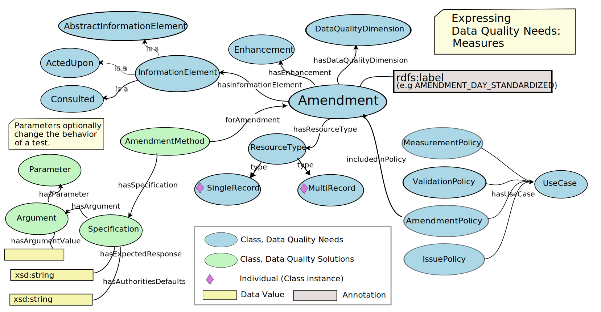

<!--- Template for header, values provided from yaml configuration --->
# {document_title}

**Title** 
{document_title}

**Date version issued** 
{ratification_date}

**Date created** 
{created_date}

**Part of TDWG Standard** 
<{standard_iri}>

<!--
**Preferred namespace abbreviation** 
{pref_namespace_prefix}
-->

**This version** 
<{current_iri}{ratification_date}>

**Latest version** 
<{current_iri}>

**Previous version** 
{previous_version_slot}

**Abstract** 
{abstract}

**Authors** 
{authors}

**Creator** 
{creator}

**Bibliographic citation** 
{creator}. {year}. {document_title}. {publisher}. <{current_iri}{ratification_date}>

**Comment** 
{comment}

{toc}

## 1. Introduction

### 1.1 Purpose

The purpose of this document is to provide a practical guide to understanding and using the BDQ Fitness for Use Framework Ontology, represented by the `bdqffdq:` vocabulary. This ontology defines a formal framework for describing data quality in the context of biodiversity data, emphasizing that quality is always relative to a particular purpose or use.

The document explains key concepts from the ontology, including `UseCase`, `InformationElement`, `Specification`, and `Criterion`, and shows how they support the structure and semantics of BDQ Tests. It provides context, illustrative examples, and guidance for interpreting the ontology as applied in real-world implementations.

### 1.2 Audience

This guide is intended for users who need a technical understanding of the BDQ conceptual framework and its ontology. It will be particularly useful for:

- Ontology engineers and information modelers incorporating the BDQ standard into semantic systems
- Standards developers aligning other biodiversity data quality frameworks with the BDQ standard
- Implementers needing to understand how BDQ Tests are formally structured and classified
- Advanced users exploring the logical foundation behind BDQ Test design.

Some familiarity with RDF/OWL ontologies is assumed.

### 1.3 Associated Documents

For the list and links to all associated documents see the [Biodiversity Data Quality (BDQ)](../../index.md) page, which lists the parts of the standard.

Information about the bdqffdq: ontology, its usage, and its extensions can be found in the following subset of BDQ resources:

- [Fitness For Use Framework Ontology Guide](../../guide/bdqffdq/index.md) Provides a visual and narrative introduction to the concepts and application of the ontology. This document.
- [Fitness For Use Framework Ontology List of Terms](../../list/bdqffdq/index.md) The term list document, which enumerates and describes the vocabulary terms.
- [Fitness for Use Ontology](../../bdqffdq/index.md) Provides normative guidance on the use of the vocabulary.
- [Fitness For Use Framework Ontology Vocabulary Extension](../../extension/bdqffdq/index.md) Defines additional axioms extending the core vocabulary.
- [Biodiversity Data Quality Fitness for Use Framework](../../../vocabulary/bdqffdq.owl) The ontology, which provides the formal RDF/OWL representation of the vocabulary.

### 1.4 Status of the content of this document

<!--- TODO: Review these normative/non-normative statements, not all sections are covered --->

Sections 1 and 3 are non-normative.

Section 2 is normative.

In Section 5, the values of following terms are normative: Term IRI, Name, Type, Superclass, Definition.

Figures are non-normative.

Any sentence or phrase beginning with "For example" or "e.g." is non-normative.

### 1.5 RFC 2119 key words

The key words "MUST", "MUST NOT", "REQUIRED", "SHALL", "SHALL NOT", "SHOULD", "SHOULD NOT", "RECOMMENDED", "MAY", and "OPTIONAL" in this document are to be interpreted as described in RFC 2119.

### 1.6 Namespace abbreviations

The following namespace abbreviations are used in this document:

| **Abbreviation** | **Namespace** |
| ------------ | -------------                               |
| bdq:         | https://rs.tdwg.org/bdq/terms/              |
| bdqtest:     | https://rs.tdwg.org/bdqtest/terms/          |
| bdqcrit:     | https://rs.tdwg.org/bdqcrit/terms/          |
| bdqdim:      | https://rs.tdwg.org/bdqdim/terms/           |
| bdqffdq:     | https://rs.tdwg.org/bdqffdq/terms           |
| dcterms:     | http://purl.org/dc/terms/                   |
| dwc:         | http://rs.tdwg.org/dwc/terms/               |
| owl:         | http://www.w3.org/2002/07/owl#              |
| rdfs:        | http://www.w3.org/2000/01/rdf-schema        |
| skos:        | http://www.w3.org/2004/02/skos/core#        |
| xsd:         | http://www.w3.org/2001/XMLSchema#           |

## 2 Use of Terms (normative)

When not represented as objects, controlled value strings MUST be used as values of bdqffdq:ResponseStatus, and bdqffdq:ResponseResult.

IRIs MUST be used as values for all individual class instances and object properties when using bdqffdq: terms.

## 3 Framework for describing data quality 

### 3.1 Introduction and Context

The bdqffdq: portion of the BDQ standard is a specification for a framework for describing data quality. This bdqffdq: framework is based on a mathematical formulation, using set theory (Veiga, 2016), and is represented as an OWL ontology. This document describes the organization and use of the OWL ontology.

This document provides a background for understanding the bdqtest: Test descriptions. Each of the Tests in the bdqtest: namespace have been designed and described within this framework and are framed using the terms and concepts from the framework. The bdqffdq: framework provides the context for each Test, and has shaped decisions made about each Test.

See the [Fitness for Use Ontology](../../bdqffdq/index.md) for a concise description and normative information about the bdqffdq: ontology and a summary of the mathematical formalization. See the [Fitness For Use Framework Ontology List of Terms](../../list/bdqffdq/index.md) document for the list of terms in the bdqffdq: vocabulary. See the [Fitness For Use Framework Ontology Vocabulary Extension](../../extension/bdqffdq/index.md) for documentation on additional axioms. See the [OWL Ontology Distribution](../../../vocabulary/bdqffdq.owl) for the formal representation of the vocabulary as an OWL ontology. The mathematical formalization provides a description of inferences and reasoning that may be made with the terms in the vocabulary.

### 3.2 Description of the bdqffdq ontology

The bdqffdq framework defines data quality in relation to a specified use, emphasizing that data quality is not abstract but purpose-dependent. It provides a formal way to describe a Use Case (bdqffdq:UseCase) and the criteria for evaluating whether a dataset is fit for that purpose. By linking data quality explicitly to use, the framework enables consistent assessment and assurance of fitness for a given purpose.

The framework can be conceptually divided into three horizontal layers: Data Quality Needs, Data Quality Solutions, and Data Quality Reports. Needs describe what it means for data to have quality for some use, Solutions describe tools to evaluate quality, and Reports are produced by Solutions to describe the evaluation of quality in particular datasets.

The framework can also be conceptually divided into four vertical themes, four sets of related concepts that carry through the Needs, Solutions, and Reports layers. These concepts are Validation, Issue, Measure, and Amendment. 

We use the informal term "Test" to describe these four vertical themes, a Test involves terms in both Needs and Solutions, and Tests produce particular reporting elements.

#### 3.2.1 Data Quality Control and Data Quality Assurance

The framework draws a distinction between Quality Control and Quality Assurance. Quality Control processes seek to assess the quality of data for some purpose, then identify changes to the data or to processes around the data to improve their quality. Quality Assurance processes seek to filter some set of data to a subset that is fit for some purpose, that is, to assure that data used for some purpose are fit for that purpose.

#### 3.2.2 Information Elements

The framework has an abstract concept of Information Elements. To frame Tests on Darwin Core terms in a usable way, we list specific Darwin Core terms as the Information Elements in each Test.

#### 3.2.3 Concepts in the framework, Test Types: Validation, Issue, Measure, Amendment

The framework defines four central concepts for describing and evaluating data quality Needs: Validation, Issue, Measure, and Amendment.

A Validation assesses compliance with a need. Data have quality if they are compliant with the requirements of the Validation Test. A Validation relates Information Elements and ResourceTypes with a specification of exactly how to assess fitness of the data under some narrow criterion, and themselves are assembled into validations policies, which are linked to other policies to cover a description of the data quality needs of a UseCase.

Issues are the converse of Validations. Data lack quality if an issue identifies a potential problem in the data that would require further human review to determine if the data have quality for some purpose.

Measures make an aggregate summary of some specific aspect of data quality.

Amendments propose changes to data or processes that, if accepted, may improve the fitness of data for a specific use.

Formally, in the Data Quality Needs level, the framework starts with a UseCase, a framing of some use to which data may be put. UseCases are related to the formal description of data quality Needs through Policies and Contexts. Contexts (ContextualizedCriterion, ContextualizedDimension, ContextualizedEnhancement, ContextualizedIssue) relate the specification of a need, such as a Validation, to the Information Elements that need to be examined, and to the ResourceType that is operated on. Each of the Tests described in this standard has a formal Specification that includes each of these elements. A UseCase includes a set of Policies, Policies relate the UseCase to Contexts, Contexts link Information Elements to Needs and to ResourceTypes, a Need specifies what properties data must have to have quality. 

Data quality Needs can relate to the data quality of single records (bdqffdq:SingleRecord) or of datasets (bdqffdq:MultiRecord).

### 3.3 Data Quality Needs, Data Quality Mechanisms, Data Quality Reports

The *bdqffdq* framework organizes data quality concepts into three core areas—**Needs**, **Mechanisms**, and **Reports**—which can be viewed as horizontal slices through the framework (Veiga et al., 2017).

**Data Quality Needs** begin with a *UseCase*, a formal description of a purpose for which data may be used. Each UseCase includes a set of *Policies*, which in turn relate to *Contexts*. Contexts (e.g., `ContextualizedCriterion`, `ContextualizedDimension`, `ContextualizedEnhancement`, `ContextualizedIssue`) specify the data quality requirement (*Need*), the relevant *Information Elements* (such as specific Darwin Core terms), and the *ResourceType* the requirement applies to. A Need defines the properties data must have to be considered fit for use and may include ways to improve unfit data. The *Tests* described in this standard are formal specifications of such Needs for BDQ purposes.

**Data Quality Mechanisms** are formal descriptions of software or other tools that implement these Tests. They execute the specifications defined in the Needs layer.

**Data Quality Reports** are the outputs generated when Mechanisms are applied to data. The Tests include formal *Specifications of Assertions* that are expected to appear in these Reports.

The framework includes an abstract concept of *Information Elements*, which are concretely represented by specific Darwin Core terms within each Test to make evaluations practical.

For **Quality Assurance**, the framework defines *Measures* that operate on *MultiRecords* and return a `Response.result` of `COMPLETE` or `NOT_COMPLETE`. A MultiRecord Measure may be `COMPLETE` if all instances of a related *SingleRecord Validation* are `COMPLIANT`.

For **Quality Control**, MultiRecord Measures can return a count of `COMPLIANT` results for validations, thereby indicating how fit a dataset is for its intended purpose and what adjustments are needed to make it fully fit.

Diagram of the composition of Validation, ValidationMethod, and ValidationAssertion illustrating the Data Quality Needs, Solutions, and Reports layers of bdqffdq, with responsibilities of bdqtest (solid lines), and implementations (dashed lines).

A useful way to think of the framework is to divide it horizontally into Needs, Solutions, and Reports layers, and then track the Test concepts vertically through each layer (see [Figure 3](https://journals.plos.org/plosone/article?id=10.1371/journal.pone.0178731#pone-0178731-g003) in Veiga et al., 2017). Below is a diagram that brings together the horizontal Needs, Solutions, and Reports layers with the vertical Test concepts (Validations, Issues, Measures and Amendments), with validation related concepts expanded to show all related entities in bdqffdq.

### 3.4 Responses

The content of this section is non-normative, related normative guidance is in section [5.1 The Response Object (normative)](../../implementers/index.md#51-the-response-object-normative) of the [BDQ Implementer's Guide](../../implementers/index.md).

Assertions are expected to assert Response objects. These will involve, in RDF, a combination of object properties and data properties.

| Concept | bdqffdq Term(s) | Description |
| ------- | ------- | ----------- |
| Response | bdqffdq:Assertion | The report from a single execution of a single Test, consisting of a bdq:Response.status, a bdq:Response.result, a bdq:Response.comment, and optionally, a bdq:Response.qualifier.| 
| Response.status | bdqffdq:ResponseStatus, bdqffdq:hasResponseStatus | A metadata element in a bdq:Response indicating whether a particular Test (bdqffdq:Validation, bdqffdq:Issue, bdqffdq:Measure, or bdqffdq:Amendment) was able to be performed or not. |
| Response.result | bdqffdq:ResponseResult, bdqffdq:hasResponseResult, bdqffdq:hasResponseResultValue | The element in a bdq:Response containing the value returned by a Test (bdqffdq:Validation, bdqffdq:Issue, bdqffdq:Measure, or bdqffdq:Amendment)|
| Response.comment | bdqffdq:hasResponseComment | A human readable interpretation of the results of the Test.|
| Response.qualifier | bdqffdq:ResponseQualifier, bdqffdq:hasResponseQualifier | Additional structured information that qualifies the bdq:Response, intended as an extension point for uncertainty.|

See the section [Structure of a Response (normative)](../../bdqtest/index.md#31-Structure-of-Response-normative) of the [BDQ Tests and Assertions](../../bdqtest/index.md) for further normative guidance on Responses as RDF or as data structures in non-RDF settings.

### 3.5 Organization of the bdqtest classes 

Following is a knowledge graph showing the is-a relationships between the classes in bdqffdq:

### 3.6 Example representation of a BDQ Test

Below is a fragment in Turtle describing VALIDATION_COUNTRY_FOUND, composed of a Validation, linking an ActedUpon Information Element, a Criterion, and the ResourceType SingleRecord, with the Validation linked to a ValidationMethod, and from there a Specification. Also shown is a ValidationPolicy linking this Validation to a UseCase. 

     <bdqtest:69b2efdc-6269-45a4-aecb-4cb99c2ae134> a <bdqffdq:Validation> ;
         rdfs:comment "Does the value of dwc:country occur in the bdq:sourceAuthority?" ;
         rdfs:label "Does the value of dwc:country occur in the bdq:sourceAuthority? Validation for SingleRecord" ;
         skos:prefLabel "VALIDATION_COUNTRY_FOUND" ;
         <bdqffdq:hasActedUponInformationElement> <urn:uuid:8a2bbe0d-7218-4861-8d70-e4f2108a6dc4> ;
         <bdqffdq:hasCriterion> <bdqcrit:Found> ;
         <bdqffdq:hasDataQualityDimension> <bdqdim:Conformance> ;
         <bdqffdq:hasResourceType> <bdqffdq:SingleRecord> .
     
     <urn:uuid:8a2bbe0d-7218-4861-8d70-e4f2108a6dc4> a <bdqffdq:ActedUpon> ;
         rdfs:label "Information Element ActedUpon dwc:country" ;
         <bdqffdq:composedOf> dwc:country ;
         <skos:prefLabel> "Information Element ActedUpon dwc:country" .
     
     <bdqcrit:Found> a <bdqffdq:Criterion> ;
         rdfs:label "Found" .

     <bdqdim:Conformance> a <bdqffdq:DataQualityDimension> ;
         rdfs:label "Conformance" .     

     <urn:uuid:04cee4e0-0c83-40cc-8de2-e7391f0a97a9> a <bdqffdq:ValidationMethod> ;
         rdfs:label "ValidationMethod: Does the value of dwc:country occur in the bdq:sourceAuthority? Validation for SingleRecord with Specification for: VALIDATION_COUNTRY_FOUND" ;
         skos:prefLabel "ValidationMethod: Does the value of dwc:country occur in the bdq:sourceAuthority? Validation for SingleRecord with Specification for: VALIDATION_COUNTRY_FOUND" ;
         <bdqffdq:forValidation> <bdqtest:69b2efdc-6269-45a4-aecb-4cb99c2ae134> ;
         <bdqffdq:hasSpecification> <urn:uuid:051f6ad7-1a4b-4e6c-8a1d-2af76de24848> .
     
     <urn:uuid:051f6ad7-1a4b-4e6c-8a1d-2af76de24848> a <bdqffdq:Specification> ;
         rdfs:comment "EXTERNAL_PREREQUISITES_NOT_MET if the bdq:sourceAuthority is not available; INTERNAL_PREREQUISITES_NOT_MET if dwc:country is bdq:Empty; COMPLIANT if value of dwc:country is a place type equivalent to administrative entity of \"nation\" in the bdq:sourceAuthority; otherwise NOT_COMPLIANT bdq:sourceAuthority default = \"The Getty Thesaurus of Geographic Names (TGN)\" {[https://www.getty.edu/research/tools/vocabularies/tgn/index.html]}" ;
         rdfs:label "Specification for: VALIDATION_COUNTRY_FOUND" ;
         <bdqffdq:hasAuthoritiesDefaults> "bdq:sourceAuthority default = \"The Getty Thesaurus of Geographic Names (TGN)\" {[https://www.getty.edu/research/tools/vocabularies/tgn/index.html]}" ;
         <bdqffdq:hasExpectedResponse> "EXTERNAL_PREREQUISITES_NOT_MET if the bdq:sourceAuthority is not available; INTERNAL_PREREQUISITES_NOT_MET if dwc:country is bdq:Empty; COMPLIANT if value of dwc:country is a place type equivalent to administrative entity of \"nation\" in the bdq:sourceAuthority; otherwise NOT_COMPLIANT" .
     
     <urn:uuid:0053ca4f-7d45-41ea-912e-c8847bb70142> a <bdqffdq:ValidationPolicy> ;
     	rdfs:label "ValidationPolicy: (65) validations  in UseCase bdq:Record-Management" ;
     	<http://www.w3.org/2004/02/skos/core#prefLabel> "ValidationPolicy: (65) validations  in UseCase bdq:Record-Management" ;
     	<bdqffdq:hasUseCase> <bdqffdq:Record-Management> ;
     	<bdqffdq:includesInPolicy> <bdqtest:01c6dafa-0886-4b7e-9881-2c3018c98bdc> , <bdqtest:0493bcfb-652e-4d17-815b-b0cce0742fbe> , <bdqtest:04b2c8f3-c71b-4e95-8e43-f70374c5fb92> , <bdqtest:06851339-843f-4a43-8422-4e61b9a00e75> , <bdqtest:0949110d-c06b-450e-9649-7c1374d940d1> , <bdqtest:0bb8297d-8f8a-42d2-80c1-558f29efe798> , <bdqtest:125b5493-052d-4a0d-a3e1-ed5bf792689e> , <bdqtest:14da5b87-8304-4b2b-911d-117e3c29e890> , <bdqtest:15f78619-811a-4c6f-997a-a4c7888ad849> , <bdqtest:17f03f1f-f74d-40c0-8071-2927cfc9487b> , <bdqtest:239ec40e-a729-4a8e-ba69-e0bf03ac1c44> , <bdqtest:2750c040-1d4a-4149-99fe-0512785f2d5f> , <bdqtest:2cd6884e-3d14-4476-94f7-1191cfff309b> , <bdqtest:3136236e-04b6-49ea-8b34-a65f25e3aba1> , <bdqtest:3667556d-d8f5-454c-922b-af8af38f613c> , <bdqtest:36ed36c9-b1a7-40b2-b5e2-0d012e772098> , <bdqtest:374b091a-fc90-4791-91e5-c1557c649169> , <bdqtest:3cff4dc4-72e9-4abe-9bf3-8a30f1618432> , <bdqtest:3f1db29a-bfa5-40db-9fd1-fde020d81939> , <bdqtest:3f335517-f442-4b98-b149-1e87ff16de45> , <bdqtest:401bf207-9a55-4dff-88a5-abcd58ad97fa> , <bdqtest:42408a00-bf71-4892-a399-4325e2bc1fb8> , <bdqtest:47ff73ba-0028-4f79-9ce1-ee7008d66498> , <bdqtest:4833a522-12eb-4fe0-b4cf-7f7a337a6048> , <bdqtest:49f1d386-5bed-43ae-bd43-deabf7df64fc> , <bdqtest:4c09f127-737b-4686-82a0-7c8e30841590> , <bdqtest:4daa7986-d9b0-4dd5-ad17-2d7a771ea71a> , <bdqtest:4eb48fdf-7299-4d63-9d08-246902e2857f> , <bdqtest:4f2bf8fd-fc5c-493f-a44c-e7b16153c803> , <bdqtest:5424e933-bee7-4125-839e-d8743ea69f93> , <bdqtest:5618f083-d55a-4ac2-92b5-b9fb227b832f> , <bdqtest:58486cb6-1114-4a8a-ba1e-bd89cfe887e9> , <bdqtest:66269bdd-9271-4e76-b25c-7ab81eebe1d8> , <bdqtest:69b2efdc-6269-45a4-aecb-4cb99c2ae134> , <bdqtest:6ce2b2b4-6afe-4d13-82a0-390d31ade01c> , <bdqtest:6eeac3ed-f691-457f-a42e-eaa9c8a71ce8> , <bdqtest:7af25f1e-a4e2-4ff4-b161-d1f25a5c3e47> , <bdqtest:7bdb13a4-8a51-4ee5-be7f-20693fdb183e> , <bdqtest:7c4b9498-a8d9-4ebb-85f1-9f200c788595> , <bdqtest:7d2485d5-1ba7-4f25-90cb-f4480ff1a275> , <bdqtest:7e0c0418-fe16-4a39-98bd-80e19d95b9d1> , <bdqtest:81cc974d-43cc-4c0f-a5e0-afa23b455aa3> , <bdqtest:853b79a2-b314-44a2-ae46-34a1e7ed85e4> , <bdqtest:85803c7e-2a5a-42e1-b8d3-299a44cafc46> , <bdqtest:88d8598b-3318-483d-9475-a5acf9887404> , <bdqtest:8d787cb5-73e2-4c39-9cd1-67c7361dc02e> , <bdqtest:8f1e6e58-544b-4365-a569-fb781341644e> , <bdqtest:9a39d88c-7eee-46df-b32a-c109f9f81fb8> , <bdqtest:9beb9442-d942-4f42-8b6a-fcea01ee086a> , <bdqtest:ac2b7648-d5f9-48ca-9b07-8ad5879a2536> , <bdqtest:ad0c8855-de69-4843-a80c-a5387d20fbc8> , <bdqtest:b6ecda2a-ce36-437a-b515-3ae94948fe83> , <bdqtest:c09ecbf9-34e3-4f3e-b74a-8796af15e59f> , <bdqtest:c486546c-e6e5-48a7-b286-eba7f5ca56c4> , <bdqtest:c6adf2ea-3051-4498-97f4-4b2f8a105f57> , <bdqtest:c971fe3f-84c1-4636-9f44-b1ec31fd63c7> , <bdqtest:cdaabb0d-a863-49d0-bc0f-738d771acba5> , <bdqtest:d257eb98-27cb-48e5-8d3c-ab9fca4edd11> , <bdqtest:d708526b-6561-438e-aa1a-82cd80b06396> , <bdqtest:dc8aae4b-134f-4d75-8a71-c4186239178e> , <bdqtest:eaad41c5-1d46-4917-a08b-4fd1d7ff5c0f> , <bdqtest:eb4a17f6-6bea-4cdd-93dd-d5a7e9d1eccf> , <bdqtest:f2ce7d55-5b1d-426a-b00e-6d4efe3058ec> , <bdqtest:f51e15a6-a67d-4729-9c28-3766299d2985> , <bdqtest:ff59f77d-71e9-4eb1-aac9-8bd05c50ff70> .

### 3.7 Cardinality of bdqffdq terms

The content of this section is non-normative, see the [Fitness for Use Ontology](../../bdqffdq/index.md) document for related normative guidance. 

The expected relationships between classes in bdqffdq can be expressed as cardinality statements. Selected cardinality statements are given here to provide additional explanatory guidance on how class instances in bdqffdq are expected to be related to each other through object properties. Examples here are given for terms related to Validations.

A Policy is an associative entity relating a UseCase to a DataQualityNeed.

Each UseCase has one to many ValidationPolicies.
Each ValidationPolicy is for one and only one UseCase.
Each ValidationPolicy has one and only one Validation included in the Policy.
Each Validation has one to many related ValidationPolicies.

Each Validation has one and only one DataQualityDimension.
Each Validation has one and only one Criterion.
Each Validation has one and only one ActedUpon InformationElement.
Each ActedUpon Information Element is composedOf one to many concrete Information Element terms.
Each Validation has zero or one Consulted Information Elements.
Each Consulted Information Element is composedOf one to many concrete Information Element terms.
Each Validation has one and only one Resource Type.

A Method looks like, but is not, an associative entity relating a DataQualityNeed to a Specification.

Each Validation has one and only one ValidationMethod.
Each ValidationMethod is for one and only one Validation.
Each ValidationMethod is for one and only one Specification.
Each Specification has one and only one related ValidationMethod.

Each Specification has one and only one hasExpectedResponse.
Each Specification has zero or one hasAuthoritiesDefaults.
Each Specification has zero to many Arguments.
Each Argument has one and only one Parameter.
Each Argument has one and only one hasArgumentValue.

An Implementations loosk like, but is not, an associative entitiy relating Specifications, Mechanisms, and Assertions.

Each Specification is used in zero to many Implementations.
Each Mechanism implements one to many Implementations.
Each Assertion is produced by one and only one Implementation.
Each Implementation uses one and only one Specification.
Each Implementation is implemented by one and only one Mechansism.
Each Implementation produces one to many Assertions.

It is important that the chain of relationships from an instance of an Assertion to a DataQualityNeed (e.g., an instance of a bdqffdq:Validation) be a chain of one to one relationships. To identify what Test with what Parameters made an Assertion, it must be possible to follow the chain of relationships from an Assertion to a single Implementation to a single Specification (with zero to many Parameters) to a single method to a single DataQualityNeed (e.g., a Validation, with one to many Information Elements). Multiplicity should only be possible following on through Policy to UseCases (an Assertion may pertain to multiple UseCases), or when going from a DataQualityNeed to Assertions. It is expected that an instance of a Validation would produce many instances of ValidationAssertions, each of those ValidationAssertions must be able to be related to the sole Validation that produced it.

## 4 Term index

{term_index}

## 5 List of Terms with axioms in the bdqffdq ontology (portions normative, see 1.4)

{term_list}
