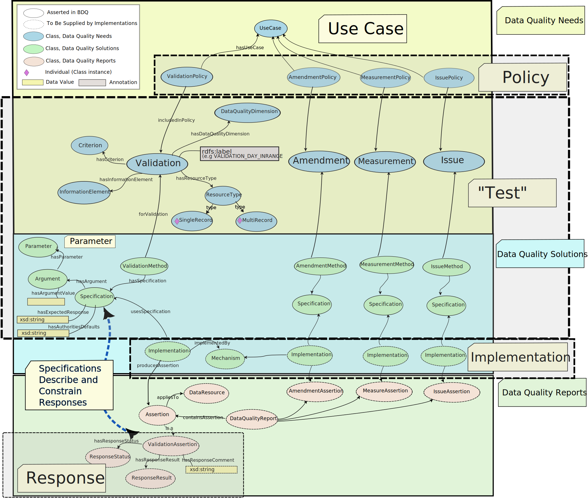

<!--- Template for header, values provided from yaml configuration --->
# {document_title}

**Title**<br>
{document_title}

**Date version issued**<br>
{ratification_date}

**Date created**<br>
{created_date}

**Part of TDWG Standard**<br>
<{standard_iri}>

<!--
**Preferred namespace abbreviation**<br>
{pref_namespace_prefix}
-->

**This version**<br>
<{current_iri}{ratification_date}>

**Latest version**<br>
<{current_iri}>

**Previous version**<br>
{previous_version_slot}

**Abstract**<br>
{abstract}

**Authors**<br>
{authors}

**Creator**<br>
{creator}

**Bibliographic citation**<br>
{creator}. {year}. {document_title}. {publisher}. <{current_iri}{ratification_date}>

**Status**<br>
{comment}

{toc}

## 1 Introduction (non-normative)

### 1.1 Purpose (non-normative)

The purpose of this document is to define and explain the BDQ Tests — the primary mechanism for evaluating the quality of biodiversity data in the BDQ standard — providing a clear and consistent specification that can be used by implementers, analysts, and quality assessors.

This document:
- Describes the structure, types, and formal characteristics of the BDQ Tests.
  - Provides normative specifications and non-normative guidance for BDQ Tests, describing how each Test is modeled using standard vocabulary terms and how conforming implementations are expected to behave.
  - Defines the Test types (`Validation`, `Issue`, `Measure`, `Amendment`), the semantics of single- versus multi-record evaluation, and how `Parameters` influence Test behavior.
  - Provides the basis for interpreting BDQ Test descriptions and guidance for producing BDQ-conformant implementations and reports.
- Describes the context of the BDQ Tests within the broader BDQ standard.
  - Explains how Tests are applied in the context of data use (`Use Cases` via `Policies`) so users can select those that match their data quality needs.
  - Explains the role of Tests within the BDQ standard and their relationship to `Use Cases`, `Policies`, and `Implementations`.
  - Explains the outputs of Tests (`Responses` and `Data Quality Reports`). 

Data quality needs evolve, but BDQ defines a community-agreed suite of Tests initially mapped to key Darwin Core terms to provide broad coverage of commonly used research data. The BDQ framework is modular and extensible: Communities may define domain-specific Tests, and future versions of the standard may incorporate new Tests as practice and consensus develop.

### 1.2 Audience (non-normative)

This document is intended for audiences who need a detailed understanding of the BDQ Tests, including:

- Data quality specialists configuring or analyzing BDQ Test outputs;
- Data providers, curators, and aggregator staff seeking to understand Test results and improve data quality;
- Software developers and data platform architects implementing BDQ Tests;
- Researchers and data managers evaluating dataset readiness for specific uses;
- Standards developers integrating BDQ Test logic into broader biodiversity data infrastructures.

While familiarity with controlled vocabularies and RDF modeling may be useful, this document is designed to be accessible to both technical and semi-technical users who want to understand, apply, or extend BDQ Tests.

### 1.3 Associated Documents (non-normative)

For the list and links to all associated documents see [The Biodiversity Data Quality (BDQ) Standard](../../../index.md).

The set of information most relevant to the Biodiversity Data Quality (BDQ) Tests can be found in the following subset of resources:

- **BDQ Tests: Concepts and Use** - Defines how each Test is modelled using standard vocabulary terms and how it should behave under various conditions *(this document)*.
- [**BDQ Tests Quick Reference Guide**](../../terms/bdqtest/index.md) - Provides a concise, easy-to-read reference about the BDQ Tests.
  - [BDQ Test Index by Use Case](../../terms/bdqtest/qrg_index_by_usecase.md)
  - [BDQ Test Index by Information Element Acted Upon](../../terms/bdqtest/qrg_index_by_ie_actedupon.md)
  - [BDQ Test Index by Information Element Class](../../terms/bdqtest/qrg_index_by_ie_class.md)
  - [BDQ Test Index by Data Quality Dimension](../../terms/bdqtest/qrg_index_by_dimension.md)
  - [BDQ Multi Record Measure Test Index](../../terms/bdqtest/qrg_multirecord_index.md)
- [**BDQ Tests List of Terms**](../../list/bdqtest/index.md) - Provides the complete normative definitions of the BDQ Tests.
- [**BDQ User's Guide**](../users/index.md) - For anyone interested in how to use the BDQ Tests in practice.
- [**BDQ Implementer's Guide**](../implementers/index.md) - For anyone interested in the technical implementation of the BDQ Tests.
- [**Tutorial: From Use Case to Test**](../../tutorial/index.md) - Worked out examples of defining new `Use Cases` and new Tests.

#### 1.3.1 Term List Distributions for the BDQ Standard (non-normative)

<!--- This same table appears in bdqtest_termlist_header. Edit here, edit there. --->
| Description | IRI | Download URL | Notes | 
| ----------- | --- | -----------  | ----- | 
| HTML file   | TBD | [BDQ Tests List of Terms](../../list/bdqtest/index.md) | Complete term list for the bdqtest: vocabulary as a web page. | 
| RDF/XML file | TBD | [Tests in RDF/XML](../../../dist/bdqtest.xml) | An RDF representation of the Tests in an RDF/XML serialization. | 
| Turtle file | TBD | [Tests in Turtle](../../../dist/bdqtest.ttl) | An RDF representation of the Tests in a Turtle serialization. | 
| JSON-LD file | TBD | [Tests in JSON/LD](../../../dist/bdqtest.json) | An RDF representation of the Tests in a JSON-LD serialization. | 
| CSV file | TBD | [Tests in CSV](../../../vocabulary/bdqtest_term_versions.csv) | CSV file listing all BDQ Tests. | 
| Single Record Test CSV file | TBD | [Single Record Tests in CSV](../../../dist/bdqtest_singlerecord_tests_current.csv) | CSV file listing just the Single Record Tests. |
| Multi Record Test CSV file | TBD | [Multi Record Tests in CSV](../../../dist/bdqtest_multirecord_tests_current.csv) | CSV file listing just the Multi Record Tests. |

### 1.4 Status of the Content of this Document (normative)

Sections may be either normative (defines what is required to comply with the standard) or non-normative (supports understanding but is not binding) and are marked as such. 

Any sentence or phrase beginning with "For example" or "e.g.", whether in a normative section or a non-normative section, is non-normative.

### 1.5 RFC 2119 key words (normative)

The key words "MUST", "MUST NOT", "REQUIRED", "SHALL", "SHALL NOT", "SHOULD", "SHOULD NOT", "RECOMMENDED", "MAY", and "OPTIONAL" in this document are to be interpreted as described in RFC 2119.

### 1.6 Namespace abbreviations (non-normative)

The following namespace abbreviations are used in this document:

| **Abbreviation** | **Namespace** |
| ------------ | -------------                               |
| ac:          | http://rs.tdwg.org/ac/terms/                |
| bdqcrit:     | https://rs.tdwg.org/bdqcrit/terms/          |
| bdqdim:      | https://rs.tdwg.org/bdqdim/terms/           |
| bdqenh:      | https://rs.tdwg.org/bdqenh/terms/           |
| bdqffdq:     | https://rs.tdwg.org/bdqffdq/terms/          |
| bdqtest:     | https://rs.tdwg.org/bdqtest/terms/          |
| bdquc:       | https://rs.tdwg.org/bdquc/terms/            |
| bdqval:      | https://rs.tdwg.org/bdqval/terms/           |
| dc:          | https://purl.org/dc/elements/1.1/           |
| dcterms:     | http://purl.org/dc/terms/                   |
| dwc:         | http://rs.tdwg.org/dwc/terms/               |
| oa:          | http://www.w3.org/ns/oa#                    |
| rdf:         | http://www.w3.org/1999/02/22-rdf-syntax-ns# |
| rdfs:        | http://www.w3.org/2000/01/rdf-schema#       |
| skos:        | http://www.w3.org/2004/02/skos/core#        |
| xsd:         | http://www.w3.org/2001/XMLSchema#           |

### 1.7 Referring to Terms (normative)

In any technical treatment of the BDQ standard, a precise reference to a class or property term SHOULD be made using its qualified name (the namespace prefix followed by the term local name; e.g., `bdqffdq:InformationElement`) and the namespace IRI corresponding to the namespace prefix (e.g., `https://rs.tdwg.org/bdqffdq/terms/` for `bdqffdq:`) MUST be provided. In less formal descriptions where the technical precision is not needed, the preferred label (`skos:prefLabel`, e.g., `Information Element`) or the term local name (e.g., `InformationElement`) MAY be used. The BDQ documents use all these methods.

## 2 A Brief Context for the BDQ Tests (non-normative)

The terminology of BDQ is based primarily on the Fitness For Use Framework (Veiga 2016, Veiga et al. 2017, Biodiversity Information Standards (TDWG) Task Group 1) expressed as an ontology, but additional vocabularies are required for a complete description of the Tests and how to use them. See [3.3 Vocabularies](../../../index.md#33-vocabularies-non-normative) in [The Biodiversity Data Quality (BDQ) Standard](../../../index.md).

BDQ Tests initially focus on values of a subset of [Darwin Core Terms](https://dwc.tdwg.org/list/) (Darwin Core Maintenance Group 2021) composed as `bdqffdq:InformationElements` as inputs (along with optional `Parameters`) to the Tests.  Tests have defined outputs expressed as `Responses` and specifications of what input values should produce what `Responses`.  Each Test is independent, to support the mixing and matching of Tests to meet particular data quality needs and not impose a particular model of Test execution on implementation frameworks. Tests may execute in parallel, on data records in sequence, as queries on datasets and on unique values. Tests are paired in that all `Amendment` Tests are matched with a corresponding `Validation` Test that assesses some aspect of data quality. An `Amendment` Test may propose improvements to term values, but the BDQ standard recommends that all proposed improvements be evaluated before application.

Some BDQ Tests also require reference to external data such as standard vocabularies of terms or names (bdqval:sourceAuthority), see [Parameterizing the Tests](#43-parameterizing-the-tests-normative).

The emphasis in BDQ is on Tests that evaluate values from a `Single Record` (`bdqffdq:SingleRecord`). Test results may also be accumulated across multiple records (`bdqffdq:MultiRecord`). Tests that accumulate information about results across multiple records are necessary for formal application of `Quality Assurance` and `Quality Control` principles.

### 2.1 The BDQ Definition of "Test" (non-normative)

This section defines the capitalized term "Test" as used in the BDQ standard and how it is constructed within the Fitness-for-Use framework. We use the capitalized term "Test" to mean something specific in the BDQ Standard. A Test is any instance of a subclass of `bdqffdq:DataQualityNeed` (e.g., `bdqffdq:Validation`) composed with an instance of a subclass of `bdqffdq:Method` (e.g., `bdqffdq:ValidationMethod`) composed with an instance of `bdqffdq:Specification`. When run by a `bdqffdq:Implementation`, each BDQ Test can produce a `bdqffdq:DataQualityReport` consisting of `bdqffdq:Responses`. See the diagram in [BDQ Tests: An Operational Perspective](#51-bdq-tests-an-operational-perspective-non-normative) below.

The scope of each BDQ Test is largely provided by the properties of a `bdqffdq:Specification`. The [Darwin Core Terms](https://dwc.tdwg.org/list/) (Darwin Core Maintenance Group 2021) used in the specification are included in the `Information Elements` (`bdqffdq:InformationElement`). The specification also includes references to external authorities (external to the Test specification, and usually also external to the Darwin Core standard, Wieczorek et al. 2012) that are required to implement the Test, for example, references to an ISO standard or a GBIF maintained controlled vocabulary. Such authoritative references are listed under `sourceAuthority` (`bdqval:sourceAuthority`) with a link to the authority and optionally, a link to a specific online resource required for the implementation of the Test.

Each BDQ Test is defined to operate on a `Single Record` or a `Multi Record`. The Framework allows `Multi Record` Tests to take data as input, for example to identify outliers within a dataset, or for `Multi Record` Tests that take the output of `Single Record` Tests as their input to provide an assessment of quality across the dataset.  No BDQ `Multi Record` Tests have been defined to take data as input (but such could be defined).  No BDQ `Single Record` Tests have been defined to use data in other records within a dataset to evaluate the quality of data in a `Single Record` (but such could be defined).  The only `Multi Record` Tests included in BDQ accumulate the outputs of other Tests.

#### 2.1.1 Conceptual map: how BDQ uses the term "Test" (non-normative)

In BDQ, a **Test** is described using the Fitness For Use Framework (`bdqffdq:`) and can be understood as a vertical concept family that connects three layers: `Data Quality Needs` (what "fit for use" means for a `Use Case`), `Data Quality Solutions` (how a Need is evaluated via a `Specification` implemented in a `Mechanism`), and `Data Quality Reports` (the resulting `Responses`). The BDQ Tests vocabulary (`bdqtest:`) provides standardized descriptors for each Test, while the Framework vocabulary (`bdqffdq:`) provides the conceptual model that relates `Use Case`, `Policy`, `Specification`, `Implementation`, and `Response`.



### 2.2 Use Cases (non-normative)

BDQ Tests are designed to be applied in the context of particular uses of data. The BDQ standard defines a set of `Use Cases` that represent common uses of biodiversity data. Each `Use Case` is associated with one or more Tests that can be used to evaluate whether data meet that need. By applying the appropriate Tests for a given `Use Case`, users can assess the fitness of their data for that particular use and identify areas for improvement.

BDQ initially defines four `Use Cases`.  Some of these use cases were based on the work of Data Quality Task Group 3 ([Data Quality Use Cases](https://www.tdwg.org/community/bdq/tg-3/)). The BDQ Tests can only relate to the concept of ‘quality’ as a consequence of their application to a specific use case.  The four use cases included in the BDQ standard were intended to cover a range of applications that were considered in common use, but they are far from comprehensive. The use cases were intended as a template or guide for those who may want to generate other use cases for their environments.  See [Section 8 Creating New Use Cases](#8-creating-new-use-cases-non-normative) and see the [Tutorial](../../tutorial/index.md) for a step-by-step example of how to define a `Use Case` and select appropriate Tests for that `Use Case`.

The initial BDQ `Use Cases` are:
* [bdquc:Alien-Species](../../list/bdquc/index.md#bdquc_Alien-Species) [(Included Tests)](../../terms/bdqtest/qrg_index_by_usecase.md#bdqucalien-species)
* [bdquc:Spatial-Temporal_Patterns](../../list/bdquc/index.md#bdquc_Spatial-Temporal_Patterns) [(Included Tests)](../../terms/bdqtest/qrg_index_by_usecase.md#bdqucspatial-temporal_patterns)
* [bdquc:Species-Distribution-Modeling-Trees](../../list/bdquc/index.md#bdquc_SDM-Trees) [(Included Tests)](../../terms/bdqtest/qrg_index_by_usecase.md#bdqucsdm-trees)
* [bdquc:Taxon-Management](../../list/bdquc/index.md#bdquc_Taxon-Management) [(Included Tests)](../../terms/bdqtest/qrg_index_by_usecase.md#bdquctaxon-management)

Under the principle that data has quality only with respect to use, each of the BDQ Tests is allocated to at least one `Use Case`.  Note that there is a many-to-many relationship here: One BDQ Test can be in multiple `Use Cases` and one `Use Case` may have many associated BDQ Tests, with `Policies` relating Tests to `Use Cases`.  See [Compliance depends on Use Case](../implementers/index.md#31-compliance-depends-on-use-case-normative) in the Implementer's Guide for further explanation.

## 3 Test Types (non-normative)

<!-- validation directly linked below for consistent post-build rendering as it is autolinked above, while issue and other types have their first appeerance and autolinking here. -->
The concept of "Test" in the context of BDQ include four distinct types: `Validation` ([bdqffdq:Validation](../../list/bdqffdq/index.md#Validation)); `Issue` (`bdqffdq:Issue`); `Amendment` (`bdqffdq:Amendment`) and `Measure` (`bdqffdq:Measure`).

A Response serves as the formal output of a Test and consists of three primary components: `Response.status`, `Response.result` and `Response.comment` See [Structure of Response (normative)](#41-structure-of-response-normative).

### 3.1 Validation Tests (normative)

Each `Validation` Test is composed of an instance of `bdqffdq:Validation` (which expresses a data quality need in the abstract) with an instance of `bdqffdq:ValidationMethod` linking it to an instance of a `bdqffdq:Specification` (which gives details of how that data quality need is to be concretely assessed).


The response of a `Validation` Test (i.e., an instance of a `bdqffdq:ValidationResponse`) MUST take one of three forms.

1. A `Response.status` of "EXTERNAL_PREREQUISITES_NOT_MET" when an external resource (e.g., a `bdqval:sourceAuthority`) is unavailable. Running the same Test on the same data at a different time may result in a different result. In this case, the Response.result MUST be empty.
2. A `Response.status` of "INTERNAL_PREREQUISITES_NOT_MET" when the values of one or more of the `Information Elements` (`bdqffdq:InformationElement`) are such that the Test cannot be meaningfully run. In this case, the Response.result MUST be empty.
3. A `Response.status` of "RUN_HAS_RESULT" when the prerequisites for running the Test have been met, and in this situation:
  - A `Response.result` of either "COMPLIANT" if the values of the `Information Elements` (`bdqffdq:InformationElement`) meet the `Criteria`, or "NOT_COMPLIANT" if they do not.

In each case, a `Response.comment` MUST be present with text explaining to consumers of the `Data Quality Report` why the Test produced this response in this case.

### 3.2 Issue Tests (normative)

Each Issue Test is composed of an instance of `bdqffdq:Issue` (which expresses a data quality need in the abstract) with an instance of `bdqffdq:IssueMethod`, which links it to an instance of a `bdqffdq:Specification` (which gives details of how that data quality need is to be concretely assessed).

`Issue` Tests are a form of warning flag where the Test is drawing attention to potential problem with the value of an `Information Element` for at least one use of the data.

We have used `Issue` Tests for a small number of cases where we wished to flag a value that might indicate a record is not fit for some purpose, but the evaluation of these cases would take human review. For example, the Test [ISSUE_ANNOTATION_NOTEMPTY](../../terms/bdqtest/index.md#ISSUE_ANNOTATION_NOTEMPTY) is informing the tester than there is at least one annotation associated with a record and this should be evaluated before using the record. Similarly for the two `Issue` Tests
where some form of transformation has occurred: [ISSUE_DATAGENERALIZATIONS_NOTEMPTY](../../terms/bdqtest/index.md#ISSUE_DATAGENERALIZATIONS_NOTEMPTY), and for the Test [ISSUE_ESTABLISHMENTMEANS_NOTEMPTY](../../terms/bdqtest/index.md#ISSUE_ESTABLISHMENTMEANS_NOTEMPTY) where the value needs to be assessed for utility and the Test [ISSUE_COORDINATES_CENTEROFCOUNTRY](../../terms/bdqtest/index.md#ISSUE_COORDINATES_CENTEROFCOUNTRY) which signals a likely high uncertainty for a georeference.

The response of an `Issue` Test (an instance of a `bdqffdq:IssueResponse`) MUST take one of three forms.

1. A `Response.status` of "EXTERNAL_PREREQUISITES_NOT_MET" when an external resource (e.g., a `bdqval:sourceAuthority`) is unavailable. Running the same Test on the same data at a different time may result in a different result. In this case, the `Response.result` MUST be empty.
2. A `Response.status` of "INTERNAL_PREREQUISITES_NOT_MET" when the values of one or more of the `Information Elements` are such that the Test cannot be meaningfully run. In this case, the `Response.result` MUST be empty.
3. A `Response.status` of "RUN_HAS_RESULT" when the prerequisites for running the Test have been met, and in this case:
  - A `Response.result`="POTENTIAL_ISSUE", a `Response.result`="NOT_ISSUE", or a `Response.result`="IS_ISSUE".

In each case, a `Response.comment` MUST be present with text explaining to consumers of the `Data Quality Report` why the Test produced this response in this case.

None of the initially defined BDQ Issue Tests return a `Response.result` of IS_ISSUE.

### 3.3 Measure Tests (normative) 

Each `Measure` Test is composed of an instance of `bdqffdq:Measure` (which expresses how to measure fitness of data for a data quality need in the abstract) with an instance of `bdqffdq:MeasurementMethod`, which links it to an instance of a `bdqffdq:Specification` (which gives details of how that data quality is to be measured).

`Measure` Tests return a `Response.result` of either a numeric value or one of the values "COMPLETE" or "NOT_COMPLETE". `Measure` Tests may directly measure properties of data. Alternatively, `Measure` Tests may measure the outputs of other Tests, for example, a `Measure` may count the number of `Response.results` from all COMPLIANT `Validation` Tests run on a `bdqffdq:SingleRecord`.

The only `Measure` defined in the initial BDQ standard that directly examines data is the Test [MEASURE_EVENTDATE_DURATIONINSECONDS](../../terms/bdqtest/index.md#MEASURE_EVENTDATE_DURATIONINSECONDS). This Test returns a `Response.result` measuring the amount of time represented by the value in `dwc:eventDate`, and can be used in Quality Assurance under specific research `Data Quality Needs` to identify `dwc:Occurrences` where the date observed or collected is known well enough for particular analytical needs (e.g., to at least one day for phenology studies, to at least one year for other purposes). The Test basically interprets the results of running the `Validation` and `Amendment` Tests and provides an indication of the length of the period of the value of `dwc:eventDate`.

Most `Single Record` `Measure` Tests defined in the BDQ standard count the number of `Validation` or `Amendment` Tests with a specified `Response.result` from a `Single Record` Test.

The response of a `Measure` Test (an instance of a `bdqffdq:MeasurementResponse`) MUST take one of three forms.

1. A `Response.status` of "EXTERNAL_PREREQUISITES_NOT_MET" when an external resource (e.g., a `bdqval:sourceAuthority`) is unavailable. Running the same Test on the same data at a different time may result in a different result. In this case, the `Response.result` MUST be empty.
2. A `Response.status` of "INTERNAL_PREREQUISITES_NOT_MET" when the values of one or more of the `Information Elements` are such that the Test cannot be meaningfully run. In this case, the `Response.result` MUST be empty.
3. A `Response.status` of "RUN_HAS_RESULT" when the prerequisites for running the Test have been met, and in this case either:
  - a `Response.result`="COMPLETE", or a `Response.result`="NOT_COMPLETE".
or
  - a `Response.result` containing a single number.

In each case, a `Response.comment` MUST be present with text explaining to consumers of the `Data Quality Report` why the Test produced this response in this case.

### 3.4 Amendment Tests (normative) 

Each `Amendment` Test is composed of an instance of `bdqffdq:Amendment` (which expresses how to improve data to fit a data quality need in the abstract) with an instance of `bdqffdq:AmendmentMethod`, which links it to an instance of a `bdqffdq:Specification` (which gives details of how proposals could be made to improve data for that need).

An `Amendment` Test MAY propose a change to one or more Darwin Core term values, or MAY propose to fill in missing values. The `Response` produced by an `Amendment` is intended to improve one or more components of the quality of the record. The `Response.result` from an `Amendment` MUST always be treated as a proposal for a change, and MUST NOT be blindly applied to a database of record when a `Data Quality Report` is used for Quality Control of an existing database of record. Consumers of `Data Quality Reports` under Quality Assurance uses MAY choose to accept all proposed `Amendments` as part of a pipeline in preparing data for an analysis. `Amendments`, under the Fitness For Use Framework, may also propose changes to procedures rather than to data values, we have not framed any in this form in the BDQ Tests at the time of first release.

The response of an `Amendment` Test (an instance of a `bdqffdq:AmendmentResponse`) MUST take one of four forms.

1. A `Response.status` of "EXTERNAL_PREREQUISITES_NOT_MET" when an external resource (e.g., `bdqval:sourceAuthority`) is unavailable. Running the same Test on the same data at a different time may result in a different result. In this case, the Response.result MUST be empty.
2. A `Response.status` of "INTERNAL_PREREQUISITES_NOT_MET" when the values of one or more of the `Information Elements` are such that the Test cannot be meaningfully run. In this case, the Response.result MUST be empty.
3. A `Response.status` of "FILLED_IN" when the prerequisites for running the Test have been met and a proposal is made to fill in a value for one or more input terms that were `Empty`, and in this situation:
  - A `Response.result` containing a list of key-value pairs of the terms for which values are to be filled in, and the proposed new values for those terms.
4. A `Response.status` of "AMENDED" when the prerequisites for running the Test have been met and a proposal is made to change a value for one or more input terms that were Empty, and in this situation:
  - A `Response.result` containing a list of key-value pairs of the terms for which new values are proposed, and the proposed new values for those terms.

In each case, a `Response.comment` MUST be present with text explaining to consumers of the `Data Quality Report` why the Test produced this response in this case.

### 3.5 Single Record and Multi Record Tests (non-normative) 

Tests may operate on a `Single Record` (e.g., one row of [Simple Darwin Core](https://dwc.tdwg.org/simple/)) or on a `Multi Record` (a dataset).

The BDQ [Fitness For Use Framework](../bdqffdq/index.md) allows for Tests of all types to operate on either (`bdqffdq:hasResourceType`) `Single Record` or `Multi Record`. In the BDQ standard, the only `Multi Record` Tests that have been defined are `Measures`. We refer to these as `Multi Record` `Measures` (instances of `bdqffdq:Measure` that are the subject of a `bdqffdq:hasResourceType` property whose object is `bdqffdq:MultiRecord`).

The focus of the BDQ Tests are the `Single Record` Tests. To allow for standard means for summarizing the results of these Tests, and for filtering data under Quality Assurance, we have also defined two sets of `Multi Record` `Measures`.

In the BDQ standard, for each `Single Record` `Validation` Test, we have defined a `Multi Record` `Measure` Test that returns a `Response.result`="COMPLETE" when all records in the `Multi Record` have a `Response.result`="COMPLIANT", and a `Response.result`="NOT_COMPLETE" when they are not. Under Quality Assurance, these `Measure` Tests are the key criterion for identifying data that have quality for a `Use Case`. Under Quality Assurance, a `Multi Record` is filtered to remove records that do not fit the `Multi Record` `Measure` Tests for completeness, such that a filtered `Multi Record` has `Response.result`="COMPLETE" for all `Multi Record` `Measure` Tests.

In the BDQ standard, for each `Single Record` `Validation` Test, we have also defined a `Multi Record` `Measure` Test that returns a `Response.result` counting the number of `Response.results` from that `Validation` Test that are COMPLIANT (or in a few cases, COMPLIANT or INTERNAL_PREREQUISITES_NOT_MET). Under Quality Control, these `Multi Record` `Measures` allow calculation of how much the quality of a dataset would be improved by accepting changes proposed by `Amendments`, and allow identification of areas in the data where quality improvement is most needed to fit the needs of some `Use Case`.

See the [Fitness For Use Framework Summary of Mathematical Formalization (normative)](../bdqffdq/index.md#4-fitness-for-use-framework-summary-of-mathematical-formalization-normative) for the formal expression of how `Measures` are intended to be used in Quality Control and Quality Assurance, and User's Guide section [2 Context for Quality, Uses and Purposes (non-normative)](../users/index.md#2-context-for-quality-uses-and-purposes-non-normative) for a further explanation.

## 4 Use of Terms (normative)

The technical (normative) details of the BDQ Test terms (those in the `bdqtest:` namespace) are found in the [BDQ Tests List of Terms](../../list/bdqtest/index.md).

The technical definitions of the `bdqtest:` terms are supported by terms in several additional namespaces in the BDQ standard, namely `bdqval:`, `bdquc`, `bdqffdq:`, `bdqdim:`, `bdqenh:`, and `bdqcrit:`. For the details and rationale, see Chapman et al. (2017).

| **Abbreviation**  | **Technical List of Terms** |
| -------- | ----------------------- |
| bdqval:     | [BDQ Controlled Vocabulary List of Terms](../../list/bdqval/index.md) |
| bdquc:     | [BDQ Use Case Controlled Vocabulary](../../list/bdquc/index.md) |
| bdqtest: | [BDQ Tests List of Terms](../../list/bdqtest/index.md) |
| bdqcrit: | [Data Quality Criterion Controlled Vocabulary List of Terms](../../list/bdqcrit/index.md) |
| bdqdim:  | [Data Quality Dimension Controlled Vocabulary List of Terms](../../list/bdqdim/index.md) |
| bdqenh:  | [Data Quality Enhancement Controlled Vocabulary List of Terms](../../list/bdqenh/index.md) |
| bdqffdq: | [Fitness For Use Framework Ontology List of Terms](../../list/bdqffdq/index.md) |

### 4.1 Structure of Response (normative)

Output from each of the Tests MUST be structured data, and MUST NOT be simple pass/fail flags. The output from a Test is a `Response`, which can form part of a `Data Quality Report` or be wrapped in an `Annotation`, and MUST include the following three components: 

1. `Response.result` is the returned result for the Test, i.e., a strictly controlled vocabulary value (consisting of "COMPLIANT" or "NOT_COMPLIANT" only) for `Validation` Tests; a strictly controlled vocabulary value ("NOT_ISSUE" or "POTENTIAL_ISSUE" only) for `Issue` Tests; a numeric value or a strictly controlled vocabulary value (consisting of exactly "COMPLETE" or "NOT_COMPLETE" for `Measure` Tests; and a data structure (e.g., a list of key value pairs) for proposed changes for `Amendment` Tests.
2. `Response.status` provides a controlled vocabulary, metadata concerning the success, failure, or problems with the Test. The Status also serves as a link to information about warning type values and where, with future development, probabilistic assertions about the likeliness of the value could be made.
3. `Response.comment` supplies human-readable text describing reasons for the Test result output.

A `Response` MUST be represented as either RDF or as a data structure.

When responses are in the form of RDF, the RDF MUST meet the following conditions: 

1. The `Response` MUST be an instance of `bdqffdq:Response` or one of its subclasses (`bdqffdq:ValidationResponse`, `bdqffdq:IssueResponse`, `bdqffdq:MeasurementResponse`, `bdqffdq:AmendmentResponse`). An instance of a subclass of `bdqffdq:Response` SHOULD be used.
2. The `Response` MUST have exactly one `bdqffdq:hasResponseStatus` object property linking it to one of the named individuals that has type `bdqffdq:ResponseStatus` (`bdqffdq:INTERNAL_PREREQUISITES_NOT_MET`, `bdqffdq:EXTERNAL_PREREQUISITES_NOT_MET`, `bdqffdq:NOT_AMENDED`, `bdqffdq:AMENDED`, `bdqffdq:FILLED_IN`, or `bdqffdq:RUN_HAS_RESULT`).
3. The `Response` MUST have a `bdqffdq:hasResponseResult` object property or `bdqffdq:hasResponseResultValue` data property, unless the object of the `bdqffdq:hasResponseStatus` indicates that none should be present.
  - If the object of the `bdqffdq:hasResponseStatus` is `bdqffdq:RUN_HAS_RESULT`, then the instance of the `Response` MUST have one and only one `bdqffdq:hasResponseResult` object property linking it to one of the named individuals that has type `bdqffdq:ResponseResult` (`bdqffdq:COMPLETE`, `bdqffdq:COMPLIANT`, `bdqffdq:IS_ISSUE`, `bdqffdq:NOT_COMPLETE`, `bdqffdq:NOT_COMPLIANT`, `bdqffdq:NOT_ISSUE`, or `bdqffdq:POTENTIAL_ISSUE`).
    - Unless the `bdqffdq:Response` is a `bdqffdq:MeasurementResponse` that returns a numeric value, in which case the `Response` MUST have one and only one `bdqffdq:hasResponseResultValue` data property linking it to a numeric value.
  - If the object of the `bdqffdq:hasResponseStatus` is one of `bdqffdq:AMENDED` or `bdqffdq:FILLED_IN`, then the instance of the `Response` MUST have one and only one `bdqffdq:hasResponseResultValue` data property linking it to structured data presenting the result of the `Amendment`. The string in the `bdqffdq:hasResponseResultValue` SHOULD be a JSON list of key:value pairs, where the keys are specific `Information Elements` (e.g., `dwc:eventDate`), and the values are the new values proposed by the `Amendment`.
  - If the object of the `bdqffdq:hasResponseStatus` is one of `bdqffdq:INTERNAL_PREREQUISITES_NOT_MET`, `bdqffdq:EXTERNAL_PREREQUISITES_NOT_MET`, `bdqffdq:NOT_AMENDED`, then no `bdqffdq:hasResponseResult` SHOULD be present.
4. The `Response` MUST have at least one `bdqffdq:hasResponseComment` data property. This `bdqffdq:hasResponseComment` must provide a human readable text explanation of why the conclusion expressed in the `Response` was reached. The `bdqffdq:hasResponseComment` MAY be repeated to provide the comment in different languages. Each `bdqffdq:hasResponseComment` SHOULD be a independent and complete explanation.
5. The `Response` MAY have a `bdqffdq:hasResponseQualifier` object property.

When the `Response` is represented as a data structure in a form other than RDF, the data structure MUST:

1. Have properties corresponding to `Response.status`, `Response.result`, and `Response.comment`. These properties SHOULD have these labels.
2. Have one `Response.status` property, containing a string constant that MUST be one of the local names of one of the named individuals in `bdqffdq:` with a type `bdqffdq:ResponseStatus` ("INTERNAL_PREREQUISITES_NOT_MET", "EXTERNAL_PREREQUISITES_NOT_MET", "NOT_AMENDED", "AMENDED", "FILLED_IN", or "RUN_HAS_RESULT"").
3. Have one `Response.result` property.
  - If the `Response.status` is "RUN_HAS_RESULT" then the value of the `Response.result` property MUST be a string constant that is one of the local names of one of the named individuals of type `bdqffdq:ResponseResult` ("COMPLETE", "COMPLIANT", "IS_ISSUE", "NOT_COMPLETE", "NOT_COMPLIANT", "NOT_ISSUE", or "POTENTIAL_ISSUE").
    - Unless the `Response` is from a `Measure` Test that returns a numeric value, in which case the value of the `Response.result` property MUST be a numeric value.
  -  If the `Response.status` is one of  "AMENDED" or "FILLED_IN" then the value of the `Response.result` property MUST be structured data presenting the result of the `Amendment`. The string in the `Response.result` SHOULD be a JSON list of key:value pairs, where the keys are specific `Information Elements` (e.g., `dwc:eventDate`), and the values are the new values proposed by the `Amendment`.
  - If the `Response.status` is one of "INTERNAL_PREREQUISITES_NOT_MET", "EXTERNAL_PREREQUISITES_NOT_MET", or "NOT_AMENDED", then the `Response.result` MUST be empty or null.
4. Have one `Response.comment` property. This `Response.comment` must provide a human readable text explanation of why the conclusion expressed in the `Response` was reached. Internationalization of content of the `Response.comment` MAY be provided, nothing in this section should be taken as a constraint on how that may be accomplished.
5. A `Response.qualifier` property may be included to provide additional information.

Nothing in this section should be taken as:

* constraining how `Data Quality Reports` are presented to consumers of those reports, so long as all three elements of `Response.result`, `Response.status`, and `Response.comment` can be accessed.
* constraining internationalization and languages of labels applied to human readable presentations of Responses from Tests.
* a requirement for a particular format or serialization of `bdqffdq:Responses`. Implementations MAY serialize `Responses` in any appropriate form for the context. When `Responses` are wrapped in `oa:Annotations` or presented as linked open data, an RDF representation SHOULD be used.
* a requirement to how `bdqffdq:Responses` are to be presented to consumers of `Data Quality Reports`. Implementations MAY present the results of Tests in any form appropriate for their consumers, so long as none of the required information is suppressed.

### 4.2 Resource Types (normative)

Tests operate on data. Data may be understood as representing a single record or multiple records. Each BDQ Test is defined to apply to one or the other, not both.  

A `Single Record` (`bdqffdq:SingleRecord`) BDQ Test:
* MAY be applied to a single [Simple Darwin Core](https://dwc.tdwg.org/simple/) record,
* MAY be applied to a single instance of a Darwin Core `dwc:Occurrence`, `dwc:Taxon`, `dwc:Event`, or other class, 
* MAY extend across one to many relations from that class instance to instances of classes of other types in a structured representation of Darwin Core data (Wieczorek et al. 2012).
  * For example, input Darwin Core data in RDF should be presented to a BDQ `Single Record` Test one `dwc:Occurrence` at a time, although the `dwc:Occurrence` could be linked to multiple other instances of other classes such as `dwc:Identifications`.
  * Handling of multiplicity of related rows in a `Single Record` is a responsibility of Test execution frameworks.
  * See the disscussion of `Single Record` in relation to the Darwin Core Data Package (Dawin Core Maintinance Group, 2026) format below.
* SHOULD NOT take multiple rows from a flat file (e.g. Simple Darwin Core) as input. 
* SHOULD NOT take multiple objects of the same core type in structured Darwin Core as input 

The BDQ Test [ISSUE_ANNOTATION_NOTEMPTY](../../terms/bdqtest/index.md#ISSUE_ANNOTATION_NOTEMPTY) similarly operates on a single Simple Darwin Core record, or a single core Darwin Core class instance, and asks whether `Annotations` exist related to that class, here this standard encourages the implementation of a standard for annotating `dwc:Occurrence` records beyond the [Darwin Core Terms](https://dwc.tdwg.org/list/) (Darwin Core Maintenance Group 2021).

BDQ `Multi Record` (`bdqffdq:MultiRecord`) Tests operate on a dataset as a whole. The initial BDQ `Multi Record` Tests in `bdqtest:` sum up results across all records for each `bdqffdq:SingleRecord` Test.

#### 4.2.1 Single Record in Darwin Core Data Package (normative)

While BDQ is independent of data encodings such as Darwin Core, we illustrate a basic principle here using the Darwin Core Data Package (DwC-DP) as an example. DwC-DP data are represented as a set of normalized, interrelated tables rather than as discrete, self-contained records. As a consequence, the concept of a “Single Record” for the purposes of Biodiversity Data Quality (BDQ) Tests does not correspond directly to a single row in any table. Instead, a **`Single Record`** in a DwC-DP context SHOULD be understood as a **derived record view**, constructed as a projection (view) over the relational structure of the data package.

##### 4.2.1.1 Definition of Single Record View (normative)

A **`Single Record`** view is defined by four elements:

1. **A focal entity instance**  
   A single row identified by its primary key in a specified table (e.g., occurrence, event, material).
2. **A traversal specification**  
   A defined set of relationships (foreign keys) that determine which related tables may be consulted to obtain additional values.
3. **A term mapping**  
   A mapping from Darwin Core terms (e.g., `dwc:country`, `dwc:eventDate`, `dwc:scientificName`) to fields in the focal table or in related tables reachable through the traversal.
4. **A multiplicity resolution strategy**  
   A deterministic rule for handling cases in which traversal yields multiple related rows for a given term.

The result of applying these elements is a **denormalized, record-shaped set of `Information Elements`** that serves as input to a BDQ Test.

##### 4.2.1.2 Interpretation for BDQ Tests (non-normative)

For a BDQ Single Record Test:

- The **unit of evaluation** is the Single Record view, not an individual row.
- The **Information Elements** are the values obtained through the term mapping applied to the focal entity and any traversed relationships.
- The DwC-DP serves as the **source graph**, while the Single Record view is a **derived representation** used solely for test execution.
- The derived Single Record view is the object of a `bdqffdq:appliesTo` property of a `bdqffdq:Response` resulting from a `Single Record` Test.

##### 4.2.1.3 Handling of Multiplicity (normative)

Multiplicity arises when a focal entity is related to more than one row in a linked table (e.g., a `dwc:Occurrence` with multiple `dwc:Identifications`).

Implementations MUST define a deterministic strategy for handling such cases. 

Example strategies include:

1. **Selection (cardinality reduction)**  
   Selecting a single related row based on a defined criterion (e.g., most recent, preferred flag, most specific, etc.).
2. **Expansion (record multiplication)**  
   Generating multiple Single Record instances, each incorporating one of the related rows, and executing the Test independently on each view.

The chosen strategy MUST be explicitly documented and consistently applied, as it directly affects Test outcomes and reproducibility.

##### 4.2.1.4 Implications and Summary (non-normative)

- A DwC-DP does not inherently define “records” suitable for BDQ `Single Record` Tests; such records are **constructed**.
- Different traversal or multiplicity strategies may yield different `Single Record` view instances from the same underlying data; therefore, **test results are only comparable when these strategies are aligned**.
- Test execution frameworks are responsible for defining and enforcing the rules that produce Single Record views.

A BDQ Single Record Test over a DwC-DP operates on a **deterministically defined, denormalized projection** of the relational data model. The correctness, reproducibility, and interpretability of test results depend on explicit definitions of focal entities, relationship traversal, term mapping, and multiplicity handling.

### 4.3 Parameterizing the Tests (normative)

Where a Test is parameterized, a `Parameter` (e.g., `bdqval:sourceAuthority`) is specified in the text of the `bdqffdq:hasExpectedResponse` data type property of the instance of the `bdqffdq:Specification` for the Test.  Such a `bdqffdq:Specification` MUST also have a `bdqffdq:hasArgument` object property linking it to an instance of a `bdqffdq:Argument`, which MUST have a `bdqffdq:hasArgumentValue` data type property carrying the default value for the `Parameter`, and this `bdqffdq:Argument` MUST have a `bdqffdq:hasParameter` object property linking it to a `bdqffdq:Parameter`. The `bdqffdq:Parameter` SHOULD be a class instance in the `bdqval:` namespace (e.g., `bdqval:sourceAuthority`).

An instance of the `bdqffdq:Specification` SHOULD have a `bdqffdq:hasAuthoritiesDefaults` data type property containing the parameters, default values, and references to resources, including API endpoints that would provide access to values in the authority.

These elements MUST be understood in concert.

Values of `bdqffdq:hasAuthoritiesDefaults` SHOULD be a text string listing `Parameters` in the form of a semicolon-delimited list of one or more of the following: 
 
- parameter default = "default value" 
- parameter default = "default value" {[resource]}
- parameter default = "default value" {[resource]} {API endpoint [resource]}

#### 4.3.1 There can be a Source Authority without a Parameter (normative)

The `bdqffdq:hasAuthoritiesDefaults` data property MAY be used without corresponding `bdqffdq:Arguments` and `bdqffdq:Parameters` when a Test is not parameterized, but a `bdqval:sourceAuthority` is mentioned within a `bdqffdq:hasExpectedResponse` for the `bdqffdq:Specification` and the `bdqffdq:hasAuthoritiesDefaults` provides details on this `sourceAuthority`. This usage allows for simpler and easier-to-read expected responses.

#### 4.3.2 Explaining Source Authorities without a Parameter (non-normative)

If there is only one source authority, it does not make sense to make the Test parameterized, but it is still important for clarity to be explicit about what that source authority is, and to provide details about it. In this case, the `bdqffdq:hasAuthoritiesDefaults` data property can be used to provide this information without the need for a parameter and argument.

For example: AMENDMENT_DCTYPE_STANDARDIZED  has the following values for Expected Response (`hasExpectedResponse`) and Source Authorities/Defaults (`hasAuthoritiesDefaults`):
* `EXTERNAL_PREREQUISITES_NOT_MET if the bdqval:sourceAuthority is not available; INTERNAL_PREREQUISITES_NOT_MET if the value of dc:type is bdqval:Empty; AMENDED the value of dc:type if it can be unambiguously interpreted as a term name in the bdqval:sourceAuthority; otherwise NOT_AMENDED`
* `bdqval:sourceAuthority = "DCMI Type Vocabulary" {[http://purl.org/dc/terms/DCMIType]} {"DCMI Type Vocabulary List of Terms" [https://www.dublincore.org/specifications/dublin-core/dcmi-type-vocabulary/2010-10-11/]}`

AMENDMENT_DCTYPE_STANDARDIZED does not take a `Parameter` for the source authority, because there is only one source authority for the DCMI Type Vocabulary.  However, it is still important to be explicit about what that source authority is, and to provide details about it.  Placing this information in (by convention) structured form in `bdqffdq:hasAuthoritiesDefaults` rather than in the `hasExpectedResponse` allows for clearer and more readable expected responses, and allows for the information about the source authority to be more easily extracted and used by implementations.


Section [2.3.2 Reading a Specification (non-normative)](../implementers/index.md#232-reading-a-specification-non-normative) of the [BDQ Implementer's Guide](../implementers/index.md) contains additional guidance for handling parameters in BDQ Test implementations.

#### 4.3.3 Parameter Examples (non-normative)

Example values for `bdqffdq:hasAuthoritiesDefaults`: 

```
     bdqval:earliestValidDate default ="1582-11-15"

     bdqval:sourceAuthority default = "GBIF Backbone Taxonomy" {[https://doi.org/10.15468/39omei]} {API endpoint [https://api.gbif.org/v1/species?datasetKey=d7dddbf4-2cf0-4f39-9b2a-bb099caae36c&amp;name=]}
```

Example RDF fragment showing use of `Arguments` and `bdqffdq:hasAuthoritiesDefaults`: 

```xml
<rdf:Description rdf:about="urn:uuid:f41be58e-2e1e-409e-a322-1de95df2ce0b">
    <rdf:type rdf:resource="https://rs.tdwg.org/bdqffdq/terms/Argument"/>
    <rdfs:label>Default value for bdqval:maximumValidDepthInMeters:"11000"</rdfs:label>
    <bdqffdq:hasArgumentValue>11000</bdqffdq:hasArgumentValue>
    <bdqffdq:hasParameter rdf:resource="https://rs.tdwg.org/bdqval/terms/maximumValidDepthInMeters"/>
</rdf:Description>

<rdf:Description rdf:about="urn:uuid:edf69c59-056d-4c8a-b1fb-647ea684eb18">
	<rdf:type rdf:resource="https://rs.tdwg.org/bdqffdq/terms/Argument"/>
	<rdfs:label>Default value for bdqval:minimumValidDepthInMeters:"0"</rdfs:label>
	<bdqffdq:hasArgumentValue>0</bdqffdq:hasArgumentValue>
	<bdqffdq:hasParameter rdf:resource="https://rs.tdwg.org/bdqval/terms/minimumValidDepthInMeters"/>
</rdf:Description>
 
<rdf:Description rdf:about="urn:uuid:cebc8ba0-ca02-4f1e-830e-ec693bc628e4">
    <rdf:type rdf:resource="https://rs.tdwg.org/bdqffdq/terms/Specification"/> 
    <rdfs:label>Specification for: VALIDATION_MAXDEPTH_INRANGE</rdfs:label>
    <dcterms:description>INTERNAL_PREREQUISITES_NOT_MET if dwc:maximumDepthInMeters is bdqval:Empty or is not interpretable as a number greater than or equal to zero; COMPLIANT if the value of dwc:maximumDepthInMeters is within the range of bdqval:minimumValidDepthInMeters to bdqval:maximumValidDepthInMeters inclusive; otherwise NOT_COMPLIANT bdqval:minimumValidDepthInMeters default="0",bdqval:maximumValidDepthInMeters default="11000"</dcterms:description>
    <skos:example>dwc:maximumDepthInMeters="1200": Response.status=RUN_HAS_RESULT, Response.result=COMPLIANT, Response.comment="dwc:maximumDepthInMeters is in range (&lt;11,000)"</skos:example>
    <skos:example>dwc:maximumDepthInMeters="99999": Response.status=RUN_HAS_RESULT, Response.result=NOT_COMPLIANT, Response.comment="dwc:maximumDepthInMeters is not in range (&gt;11,000)"</skos:example>
    <bdqffdq:hasArgument rdf:resource="urn:uuid:edf69c59-056d-4c8a-b1fb-647ea684eb18"/>
    <bdqffdq:hasArgument rdf:resource="urn:uuid:f41be58e-2e1e-409e-a322-1de95df2ce0b"/>
    <bdqffdq:hasAuthoritiesDefaults>bdqval:minimumValidDepthInMeters default="0",bdqval:maximumValidDepthInMeters default="11000"</bdqffdq:hasAuthoritiesDefaults>
    <bdqffdq:hasExpectedResponse>INTERNAL_PREREQUISITES_NOT_MET if dwc:maximumDepthInMeters is bdqval:Empty or is not interpretable as a number greater than or equal to zero; COMPLIANT if the value of dwc:maximumDepthInMeters is within the range of bdqval:minimumValidDepthInMeters to bdqval:maximumValidDepthInMeters inclusive; otherwise NOT_COMPLIANT</bdqffdq:hasExpectedResponse>
</rdf:Description>   
```

Example RDF Fragment showing the `Specification` for [VALIDATION_COUNTRYCODE_STANDARD](../../terms/bdqtest/index.md#VALIDATION_COUNTRYCODE_STANDARD), where `bdqffdq:hasAuthoritiesDefaults` is present to provide a `bdqval:sourceAuthority` for the `Specification`, but the Test is not parameterized, so no `bdqffdq:hasArgument` properties are present: 

```xml
<rdf:Description rdf:about="urn:uuid:01b96157-e4a1-4884-95d7-3bcfc5f3c047">
    <rdf:type rdf:resource="https://rs.tdwg.org/bdqffdq/terms/Specification"/>
    <rdfs:label>Specification for: VALIDATION_COUNTRYCODE_STANDARD</rdfs:label>
    <dcterms:description>EXTERNAL_PREREQUISITES_NOT_MET if the bdqval:sourceAuthority is not available; INTERNAL_PREREQUISITES_NOT_MET if the dwc:countryCode is bdqval:Empty; COMPLIANT if dwc:countryCode can be unambiguously interpreted as a valid ISO 3166-1-alpha-2 country code in the bdqval:sourceAuthority; otherwise NOT_COMPLIANT bdqval:sourceAuthority default = "ISO 3166 Country Codes" {[https://www.iso.org/iso-3166-country-codes.html]} {ISO 3166-1-alpha-2 Country Code search [https://www.iso.org/obp/ui/#search]}</dcterms:description>
    <skos:example>dwc:countryCode="GL": Response.status=RUN_HAS_RESULT, Response.result=COMPLIANT, Response.comment="dwc:countryCode is a valid ISO (ISO 3166-1-alpha-2 country codes) value"</skos:example>
    <skos:example>dwc:countryCode="GRL": Response.status=RUN_HAS_RESULT, Response.result=NOT_COMPLIANT, Response.comment="dwc:countryCode is NOT a valid ISO (ISO 3166-1-alpha-2 country codes) value"</skos:example>
    <bdqffdq:hasAuthoritiesDefaults>bdqval:sourceAuthority default = "ISO 3166 Country Codes" {[https://www.iso.org/iso-3166-country-codes.html]} {ISO 3166-1-alpha-2 Country Code search [https://www.iso.org/obp/ui/#search]}</bdqffdq:hasAuthoritiesDefaults>
    <bdqffdq:hasExpectedResponse>EXTERNAL_PREREQUISITES_NOT_MET if the bdqval:sourceAuthority is not available; INTERNAL_PREREQUISITES_NOT_MET if the dwc:countryCode is bdqval:Empty; COMPLIANT if dwc:countryCode can be unambiguously interpreted as a valid ISO 3166-1-alpha-2 country code in the bdqval:sourceAuthority; otherwise NOT_COMPLIANT</bdqffdq:hasExpectedResponse></rdf:Description>
```

## 5 Design of the Tests (normative)

BDQ Tests are designed with a clear boundary of responsibility: they take a defined set of input `Information Elements` (and optional `Parameters`) and return a structured `Response` describing the outcome. This standardization of inputs and outputs means a Test implementation can be treated as a small, self-contained component whose behavior is determined by its `Specification` and is consistent across programming languages and environments. The surrounding execution framework is responsible for obtaining and binding raw data to the required `Information Elements`, selecting which Tests to run (e.g., by `Use Case` via `Policies`), and assembling the resulting `Responses` into `Data Quality Reports`. In this way, BDQ separates the semantics of Test behavior (what is evaluated and how results are expressed) from the mechanics of test execution (how data are accessed, orchestrated, filtered, and reported).

### 5.1 BDQ Tests: An Operational Perspective (non-normative)

A Test is a defined evaluation that takes specific inputs and produces a structured output. A Test is defined using a set of `bdqffdq:` classes and properties that specify the inputs to the Test (the relevant `Information Elements` and any `Parameters`) and how those input values are to be evaluated under a `Specification` to produce a structured output (a `Response`) that can be interpreted consistently across implementations. The Test definitions are provided in the `bdqtest:` vocabulary, and the semantics of the terms used in those definitions are provided by the `bdqffdq:` vocabulary and supporting vocabularies.

This section explains how Tests are expressed in BDQ vocabularies and how they behave when executed by an implementation. A Test is not a software implementation; it is a formal definition of an evaluation that *can* be implemented in software. In the Fitness For Use Framework, each Test is an instance of a subtype of `Data Quality Need` that identifies what is being evaluated (through its required `Information Elements` and its `Resource Type`) and why it matters (through its association with one or more `Use Cases` via `Policies`). The Test is linked to a `Data Quality Method`, which in turn links to a `Specification` that describes expected behavior and expected outcomes (e.g., via `hasExpectedResponse`), and may reference `Parameters` and source authorities that further constrain or parameterize execution. When an `Implementation` runs a Test, it produces one or more `Responses` that can be assembled into `Data Quality Reports` for interpretation, filtering, and aggregation.

Conceptually, Tests can be viewed in two complementary ways: vertically, they connect the `Data Quality Needs` and `Data Quality Solutions` layers and produce outputs in the `Data Quality Reports` layer; and horizontally by type, BDQ defines four main categories of Tests—`Validation`, `Issue`, `Measure`, and `Amendment`—each of which produces corresponding kinds of `Responses`.

### 5.2 Data Quality Control, Data Quality Assurance (normative)

The BDQ standard draws a distinction between `Quality Control` and `Quality Assurance`. Quality Control (`bdqffdq:QualityControl`) processes seek to assess the quality of data for some purpose, then identify changes to the data or to processes around the data for improving the quality of the data. Quality Assurance (`bdqffdq:QualityAssurance`) processes seek to filter some set of data to a subset that is fit for some purpose, that is to assure that data used for some purpose are fit for that purpose. Implementations of the BDQ Tests MAY be used to perform `Quality Control`, `Quality Assurance`, or both. The [mathematical formalization](../bdqffdq/index.md#4-fitness-for-use-framework-summary-of-mathematical-formalization-normative) of the [Fitness for Use Ontology](../bdqffdq/index.md) provides a formal definition of Quality Control and Quality Assurance, and how Test `Responses` SHOULD be used for each.

### 5.3 When to Run Tests (normative)

The BDQ Tests are designed to be run at any point in the life cycle of biodiversity data. 
* They MAY be run at the point of initial collection or observation of organisms. 
* They MAY be run to support data transcription. 
* They MAY be run in loading data into databases of record from field or transcription sources. 
* They MAY be run in preparing data from databases of record for aggregation. 
* They MAY be run during data aggregation and the presentation of aggregated data. 
* They MAY be run in workflows for analysis of data for research purposes.

### 5.4 Results of Test Executions (normative)

The BDQ standard is agnostic about the format of presentation of results from BDQ Tests. BDQ does, however, specify that Test implementations and presentations MUST return structured data with at least Response.status, Response.result, and Response.comment. Responses MAY also contain more information in Response.qualifier.
See the [Implementer's Guide](../implementers/index.md) section on [Presentation of Results](../implementers/index.md#7-presentation-of-results-normative) for further normative and non-normative guidance about result presentation. See [Structure of a Response](../bdqtest/index.md#41-structure-of-response-normative) in the [BDQ Tests: Concepts and Use](../bdqtest/index.md) document for normative guidance on `Responses` as RDF or as data structures.

The results of the execution of implementations of the BDQ Tests MAY be presented as Data Quality reports. The Framework Ontology provides vocabulary and structure that MAY be used for such data quality reports.

The `bdqffdq:` vocabulary enables the wrapping of the results of BDQ Tests within annotations. The `bdqffdq:` vocabularies in particular are intended to support the framing of `Responses` from Tests within annotations that follow the W3C Web Annotation Data Model (Sanderson et al. 2017), and are suitable for inclusion in semantic data stores. See the [Implementer's Guide](../implementers/index.md) section on [Annotations](../implementers/index.md#72-annotations-normative) for more guidance.

### 5.5 Test Execution Environments and Workflows (non-normative)

Neither the Test descriptions nor the framework impose constraints on environments or workflows for execution. 

One possible workflow is to run:
1. A pre-amendment phase where all `Validations` plus all `Multi Record` `Measures` are executed
1. then an amendment phase where all `Amendments` are executed
1. then a post-amendment phase where all `Validations` plus all `Multi Record` `Measures` are executed again, this time on a modified copy of the input data to which all proposed changes to the data from `Amendments` have been applied.

A single validation step, with `Measures` evaluating the results of `Validations` performed on the raw input data could look like the diagram below.


_A workflow with a single validation step, with `Measures` evaluating the results of `Validations` performed on the raw input data.  Colors highlight cells that are populated in the input data, and `Response` values in a `Data Quality Report`._

Subsequent to this initial validation step, in an amendment phase, `Amendments` can be executed on the raw input data and their `Response.results` applied to modify the data (modified only locally in the test execution environment).  

Then, in a post-amendment step and these amended data can undergo a second phase of validation, with `Measures` again evaluating the results of the `Validations`, but this time not on the raw input data, but on the data as if all changes proposed by `Amendments` were accepted (i.e., a hypothetical ‘all-amendments-applied’ view).

A comparison of the results of the `Measures` in the first validation phase with those in the second validation phase can be used to evaluate the impact of the proposed changes from the `Amendments`, that is, how much could the quality of the data be improved for the specific `Use Case` by accepting the proposed changes from the `Amendments`.

One expected outcome of such a three phase (pre-amendment, amendment, post-amendment) workflow is a `Data Quality Report`, which supports both `Quality Control` and `Quality Assurance` purposes. The `Data Quality Report` can be used for `Quality Control` purposes by evaluating the number and distribution of quality issues in the data, as well the potential impact of proposed changes.  For `Quality Assurance` purposes, the `Measures` from the second validation phase can be used to filter the data for downstream use, retaining only those records that are fit for a particular purpose (the purpose specified by the `Use Case`).  


_A workflow with a pre-amendment validation+measure phase, followed by an amendment phase, followed by a post-amendment validation+measure phase._

## 6 Example RDF description of a Test (non-normative) 

A complete description of BDQ Tests can be found in the RDF representation of this vocabulary. Following the Fitness For Use Framework Ontology (`bdqffdq:`), a Test is composed of an instance of a subclass of a `bdqffdq:DataQualityNeed` (e.g., `bdqffdq:Validation`), an instance of a `bdqffdq:ActedUpon` `Information Element`, optionally an instance of a `bdqffdq:Consulted` `Information Element`, an instance of a subclass of `bdqffdq:Method` (e.g., `bdqffdq:ValidationMethod`), and an instance of a `bdqffdq:Specification`. Most of the information associated with a `bdqtest:` term is expressed in other vocabularies, in particular `bdqffdq:`. This structure and dependence on other vocabularies can be seen in the formal example description of [VALIDATION_COUNTRYCODE_STANDARD](../../terms/bdqtest/index.md#VALIDATION_COUNTRYCODE_STANDARD), below.


```xml
  <rdf:Description rdf:about="https://rs.tdwg.org/bdqtest/terms/0493bcfb-652e-4d17-815b-b0cce0742fbe-2025-03-07">
    <rdf:type rdf:resource="https://rs.tdwg.org/bdqffdq/terms/Validation"/>
    <bdqffdq:hasResourceType rdf:resource="https://rs.tdwg.org/bdqffdq/terms/SingleRecord"/>
    <skos:note>Locations outside of a jurisdiction covered by a country code may have a value in the field dwc:countryCode, the ISO user defined codes include XZ used by the UN for installations on the high seas and recommended in Darwin Core to designate the high seas. Also available in the ISO user defined codes is ZZ, used by Darwin Core and GBIF to mark unknown countries. This Test should accept both XZ and ZZ as COMPLIANT country codes. This Test must return NOT_COMPLIANT if there is leading or trailing whitespace or there are leading or trailing non-printing characters.</skos:note>
    <bdqffdq:hasDataQualityDimension rdf:resource="https://rs.tdwg.org/bdqdim/terms/Conformance"/>
    <dcterms:description>Is the value of dwc:countryCode a valid ISO 3166-1-alpha-2 country code?</dcterms:description>
    <bdqffdq:hasCriterion rdf:resource="https://rs.tdwg.org/bdqcrit/terms/Standard"/>
    <bdqffdq:hasActedUponInformationElement rdf:resource="urn:uuid:c3620a97-65d6-4f9c-8a03-32e0d240a423"/>
    <dcterms:issued rdf:datatype="http://www.w3.org/2001/XMLSchema#date">2025-03-07</dcterms:issued>
    <dcterms:references rdf:resource="https://www.iso.org/iso-3166-country-codes.html"/>
    <dcterms:references rdf:resource="https://en.wikipedia.org/wiki/ISO_3166-1_alpha-2"/>
    <dcterms:references rdf:resource="https://datahub.io/core/country-list"/>
    <dcterms:references rdf:resource="https://doi.org/10.15468/doc-gg7h-s853"/>
    <skos:historyNote>https://github.com/tdwg/bdq/issues/20</skos:historyNote>
    <rdfs:label>VALIDATION_COUNTRYCODE_STANDARD</rdfs:label>
    <dcterms:isVersionOf rdf:resource="https://rs.tdwg.org/bdqtest/terms/0493bcfb-652e-4d17-815b-b0cce0742fbe"/>
    <skos:prefLabel>Validation dwc:countryCode Standard for SingleRecord</skos:prefLabel>
  </rdf:Description>

  <rdf:Description rdf:about="https://rs.tdwg.org/bdqcrit/terms/Standard">
    <rdf:type rdf:resource="https://rs.tdwg.org/bdqffdq/terms/Criterion"/>
    <rdfs:label>Standard</rdfs:label>
  </rdf:Description>

  <rdf:Description rdf:about="https://rs.tdwg.org/bdqdim/terms/Conformance">
    <rdf:type rdf:resource="https://rs.tdwg.org/bdqffdq/terms/DataQualityDimension"/>
    <rdfs:label>Conformance</rdfs:label>
  </rdf:Description>

  <rdf:Description rdf:about="urn:uuid:c3620a97-65d6-4f9c-8a03-32e0d240a423">
    <rdf:type rdf:resource="https://rs.tdwg.org/bdqffdq/terms/ActedUpon"/>
    <bdqffdq:composedOf rdf:resource="http://rs.tdwg.org/dwc/terms/countryCode"/>
    <rdfs:label>Information Element ActedUpon dwc:countryCode</rdfs:label>
    <skos:prefLabel>Information Element ActedUpon dwc:countryCode</skos:prefLabel>
  </rdf:Description>

  <rdf:Description rdf:about="https://rs.tdwg.org/bdqffdq/terms/SingleRecord">
    <rdf:type rdf:resource="https://rs.tdwg.org/bdqffdq/terms/ResourceType"/>
    <rdfs:label>SingleRecord</rdfs:label>
  </rdf:Description>

  <rdf:Description rdf:about="urn:uuid:02f5a440-a473-42cf-a3f1-6c10334d5eb8">
    <rdf:type rdf:resource="https://rs.tdwg.org/bdqffdq/terms/ValidationMethod"/>
    <skos:note>Example Implementations: Kurator/FilteredPush geo_ref_qc Library (Morris &amp; Lowery 2025b)</skos:note>
    <skos:note>Example Implementations Source Code: https://github.com/FilteredPush/geo_ref_qc/blob/v2.0.1/src/main/java/org/filteredpush/qc/georeference/DwCGeoRefDQ.java#L99</skos:note>
    <skos:note>TG2 Validation SPACE CODED Test VOCABULARY Conformance ISO/DCMI STANDARD CORE</skos:note>
    <bdqffdq:hasSpecification rdf:resource="urn:uuid:01b96157-e4a1-4884-95d7-3bcfc5f3c047"/>
    <skos:historyNote>Source: TG2</skos:historyNote>
    <rdfs:label>ValidationMethod: VALIDATION_COUNTRYCODE_STANDARD with Specification for: VALIDATION_COUNTRYCODE_STANDARD</rdfs:label>
    <skos:prefLabel>ValidationMethod: VALIDATION_COUNTRYCODE_STANDARD with Specification for: VALIDATION_COUNTRYCODE_STANDARD</skos:prefLabel>
    <bdqffdq:forValidation rdf:resource="https://rs.tdwg.org/bdqtest/terms/0493bcfb-652e-4d17-815b-b0cce0742fbe-2025-03-07"/>
  </rdf:Description>

  <rdf:Description rdf:about="urn:uuid:01b96157-e4a1-4884-95d7-3bcfc5f3c047">
    <rdf:type rdf:resource="https://rs.tdwg.org/bdqffdq/terms/Specification"/>
    <skos:example>dwc:countryCode="GL": Response.status=RUN_HAS_RESULT, Response.result=COMPLIANT, Response.comment="dwc:countryCode is a valid ISO (ISO 3166-1-alpha-2 country codes) value"</skos:example>
    <skos:example>dwc:countryCode="GRL": Response.status=RUN_HAS_RESULT, Response.result=NOT_COMPLIANT, Response.comment="dwc:countryCode is NOT a valid ISO (ISO 3166-1-alpha-2 country codes) value"</skos:example>
    <bdqffdq:hasAuthoritiesDefaults>bdqval:sourceAuthority default = "ISO 3166 Country Codes" {[https://www.iso.org/iso-3166-country-codes.html]} {ISO 3166-1-alpha-2 Country Code search [https://www.iso.org/obp/ui/#search]}</bdqffdq:hasAuthoritiesDefaults>
    <bdqffdq:hasExpectedResponse>EXTERNAL_PREREQUISITES_NOT_MET if the bdqval:sourceAuthority is not available; INTERNAL_PREREQUISITES_NOT_MET if the dwc:countryCode is bdqval:Empty; COMPLIANT if dwc:countryCode can be unambiguously interpreted as a valid ISO 3166-1-alpha-2 country code in the bdqval:sourceAuthority; otherwise NOT_COMPLIANT</bdqffdq:hasExpectedResponse>
    <rdfs:label>Specification for: VALIDATION_COUNTRYCODE_STANDARD</rdfs:label>
    <dcterms:description>EXTERNAL_PREREQUISITES_NOT_MET if the bdqval:sourceAuthority is not available; INTERNAL_PREREQUISITES_NOT_MET if the dwc:countryCode is bdqval:Empty; COMPLIANT if dwc:countryCode can be unambiguously interpreted as a valid ISO 3166-1-alpha-2 country code in the bdqval:sourceAuthority; otherwise NOT_COMPLIANT bdqval:sourceAuthority default = "ISO 3166 Country Codes" {[https://www.iso.org/iso-3166-country-codes.html]} {ISO 3166-1-alpha-2 Country Code search [https://www.iso.org/obp/ui/#search]}</dcterms:description>
  </rdf:Description>

  <rdf:Description rdf:about="urn:uuid:0348eccf-fc7f-49b3-88b6-1d911e98cbbb">
    <rdf:type rdf:resource="https://rs.tdwg.org/bdqffdq/terms/ValidationPolicy"/>
    <bdqffdq:includedInPolicy rdf:resource="https://rs.tdwg.org/bdqtest/terms/0493bcfb-652e-4d17-815b-b0cce0742fbe-2025-03-07"/>
    <rdfs:label>ValidationPolicy: (50) validations  in UseCase bdquc:Spatial-Temporal_Patterns</rdfs:label>
    <bdqffdq:hasUseCase rdf:resource="https://rs.tdwg.org/bdquc/terms/Spatial-Temporal_Patterns"/>
    <skos:prefLabel>ValidationPolicy: (50) validations  in UseCase bdquc:Spatial-Temporal_Patterns</skos:prefLabel>
  </rdf:Description>

  <rdf:Description rdf:about="https://rs.tdwg.org/bdquc/terms/Spatial-Temporal_Patterns">
    <rdf:type rdf:resource="https://rs.tdwg.org/bdqffdq/terms/UseCase"/>
    <rdfs:label>bdquc:Spatial-Temporal_Patterns</rdfs:label>
  </rdf:Description>
```

## 7 Creating New Tests (non-normative)

The Tests in the BDQ Standard are a subset of all the possible tests that could be developed for testing biodiversity data quality, even within the `Darwin Core` environment. [2.1 Definition of Core](../../supplement/index.md#21-definition-of-core-non-normative) in the [BDQ Supplemental Information](../../supplement/index.md) provides the context as to why the current suite of Tests were chosen. Note that we used the concept of CORE as a GitHub tag to identify the subset of all tests we created that form the BDQ standard.

Users and communities are free to define, implement, and use their own Tests for their own purposes, and may propose Tests for inclusion within the BDQ Standard.

When considering development of a new Test, users are urged to first review existing Test proposals in GitHub that may be related to their intended Test. In particular, there are a number of Tests that were proposed but not included in BDQ and tagged "`Supplementary`", as well as Tests that were proposed but rejected and tagged "`DO_NOT_IMPLEMENT`".

The `Supplementary` Tests may provide a close match for a specific `Use Case`, or may provide a useful template to build from, and should be reviewed before proposing a new Test from scratch. The `DO_NOT_IMPLEMENT` Tests document proposals that were judged to be problematic; the accompanying comments describe the rationale for rejection and reviewing them can help avoid re-proposing Tests with similar issues.

Implementers are free to implement a subset of the `CORE` Tests, or `Supplementary` Tests, or new Tests when there is a particular data quality need within their domain - e.g., testing for a value of sub-genus against a taxonomic name authority or testing for a valid depth against maximum depth around the location of an observation. Note however, that an implementation of BDQ will only be compliant with the standard if all Tests for at least one `Use Case` are implemented. 

### 7.1 Elements of a New Test (non-normative)

Formally, the description of a Test is complex.  Informally, there are a few central elements that describe a Test and what it does.  

* First, a Test serves some purpose. A Test evaluates some way in which data are fit for some purpose, thus each Test starts from one or more `Use Cases`. 
* Second, a Test operates on specific inputs, specific elements of data, these are the `Information Elements`.  
* Third, a Test has some specific purpose, described in simple language.  This is the Test Description.
* Fourth, this plain language description of the Test must be expanded into specific language that allows an implementer to understand exactly what code implementing a Test should do, and what outputs it should provide for different possible input values, this is the `Expected Response`.   
* Fifth, it is important to be clear whether a Test evaluates a `Single Record` or operates over multiple records in a data set (a `Multi Record` Test).

Tests may be expected to form related clusters, for example, a `Validation` that assesses whether the value of `ac:variantLiteral` in a `Single Record` is found in as a controlled value string in the Audiovisual Core variant: List of Terms, combined with an `Amendment` that proposes changes to values of `ac:variantLiteral` to conform them to that controlled vocabulary, combined with a `Multi Record` `Measure` that counts the number of `COMPLIANT` values for the `Validation` evaluated for each record in a data set.  Under `QualityControl`, this `Measure` can evaluate how much the data set could be improved for some purpose if all the proposed changes from the `Amendment` were accepted (by running the Tests in pre-amendment, amendment, and post-amendment phases) 

See the [Tutorial](../../tutorial/index.md) for a worked out example of the definition of a new Test.

### 7.2 Proposing to add a Test to the BDQ Standard (non-normative)

To propose to add a Test to the BDQ Standard, follow the instructions provided by the BDQ Maintenance Group.

## 8 Creating New Use Cases (non-normative)

BDQ is based on `Use Cases`: An evaluation of data quality must be within the context of a `Use Case`. In the Fitness For Use Framework, `Use Cases` are needs-layer concepts. A Use Case is linked to sets of relevant Tests through `Policies` (e.g., `ValidationPolicy`, `IssuePolicy`, `MeasurementPolicy`, and `AmendmentPolicy`). Together, these `Policies` identify which Tests should be run for a given `Use Case` and, therefore, which `Responses` about data quality are expected from running that set of Tests. See the Tutorial for a worked out example of the definition of a new Use Case. See the [Tutorial](../../tutorial/index.md) for a worked out example of the definition of a new `Use Case`.

### 8.1 Elements of a New Use Case (non-normative)

A 'Use Case' has a Name, a Definition, a statement of Fitness Requirements (`bdqffdq:hasFitnessRequirements`) and a list of associated Tests. The list of Tests is expressed as four `Policies`, a `ValidationPolicy` comprised of the `Validations` related to the Use Case, an `AmendmentPolicy` listing related `Amendments`, a `MeasurementPolicy` listing related `Measures`, and an `IssuePolicy` listing any related `Issues`.

The Definition for a new Use Case should include a concise statement of the application. The Fitness Requirements should provide a succinct summary of the significant Information Elements needed for that application. It may be helpful to identify what are the primary information elements (InformationElements ActedUpon) and what informationElements may support the application (Information Elements Consulted). For example, dwc:eventDate may be required for the Use Case, but dwc:year, dwc:month and dwc:day may be required to populate an empty dwc:eventDate. It may help to focus on the VALIDATION Type Tests and then on AMENDMENT Type Tests required to support that application.

The selection of relevant Information Elements and the selection of Tests will likely be an iterative process.

### 8.2 Defining a New Use Case (non-normative)

A `Use Case` can be defined outside of the BDQ standard. Users are encouraged to define `Use Cases` for their own purposes.  

See the [Tutorial](../../tutorial/index.md) for a worked out example of the definition of a new `Use Case`.

### 8.3 Proposing to add a Use Case to the BDQ Standard (non-normative)

To propose to add a new `Use Case` to the BDQ Standard, follow the instructions provided by the BDQ Maintenance Group.


