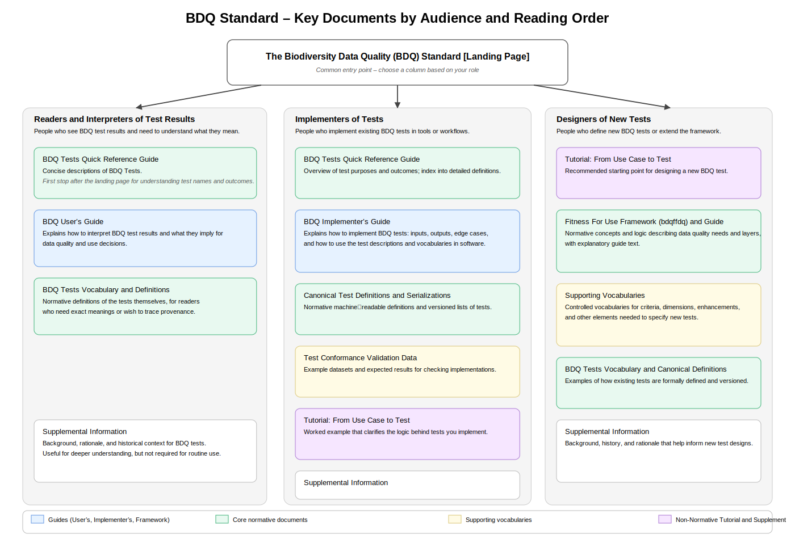

<!--- Template for header, values provided from yaml configuration --->
<!--- layout: home --->
# {document_title}
<!--- {:.lead} --->

**Title** 
{document_title}

**Category** 
Technical Specification

**Publisher** 
{publisher}

**Status** 
{comment}

**Permanent IRI (for citations and links)** 
<{standard_iri}>

**Date version issued** 
{ratification_date}

**Date created** 
{created_date}

**This version** 
<{current_iri}{ratification_date}>

**Latest version** 
<{current_iri}>

**Previous version** 
{previous_version_slot}

**Bibliographic citation** 
{creator}. {year}. {document_title}. {publisher}. <{current_iri}{ratification_date}>

**Abstract** 
{abstract}

**Authors** 
{authors}

**Creator** 
{creator}

{toc}

## 1 Introduction (non-normative)

<!-- Brief high level overview of the standard --->

Beyond data availability, data quality is probably the most significant issue for users of biodiversity data. The Biodiversity Data Quality Standard (BDQ) establishes a comprehensive, common, interoperable framework for evaluating the *quality* of biodiversity data as *fitness for a particular use*, rather than as an inherent characteristic of data. 

### 1.1 Purpose of the BDQ Standard (non-normative)

<!-- Brief purpose and value proposition statement: what is the standard, why use it --->

The Biodiversity Data Quality (BDQ) standard establishes a community-defined, modular, and extensible environment for biodiversity data quality.  It integrates a comprehensive set of Tests (`bdqtest:`) initially focused on Darwin Core (Wieczorek et al., 2012), but not restricted to it, with a formal Framework (`bdqffdq:`) and supporting vocabularies (`bdqval:`, `bdqdim:`, `bdqcrit:`, and `bdqenh:`) to define Tests, their inputs (`Information Elements`), and their structured output (`Responses`). 

At its core, BDQ focuses on the semantics of data quality.  It defines what a Test means and precisely what information a `Response` must contain. BDQ intentionally avoids prescribing both execution concerns, such as data loading or parallelization of Test execution, and human centric concerns like presentation or remediation processes.  By providing a consistent semantic layer focused on Test inputs and outputs, the standard allows for flexible application within diverse operational settings supporting both `Quality Assurance` (QA) and `Quality Control` (QC). 

The primary objective of the BDQ standard is to enhance interoperability.  By making Test results comparable and reusable across different organizations, software tools, and data pipelines, it reduces duplicated effort and ambiguity regarding "what was tested" and "what the outcome means."  Ultimately, this enables data providers, aggregators, and researchers to consistently assess *fitness for use*, prioritize quality improvements, and support transparent, repeatable scientific decisions about the use of biodiversity data.

TODO: Integrate this thought into the above: 
_The presentation and serialization of `Data Quality Reports` is intentionally flexible, so long as the required `Response` elements are available to consumers._

#### 1.1.1 Purpose of this document (non-normative)

This document serves as the central gateway and index for the Biodiversity Data Quality (BDQ) standard.  It provides a high level overview of the standard and contains links to the normative documents that formally define its specifications.  Aditionally, it directs diverse audiences to supporting resources designed to facilitate the understanding and effective implementation of BDQ within their specific communities and operational environments.

### 1.2 Audience for the BDQ Standard (non-normative)

<!--- The audience for the BDQ Standard as a whole --->

The BDQ standard is intended for:

- Practitioners and data curators assessing and improving the fitness for use of biodiversity data.
- Software developers implementing BDQ Tests and integrating Test inputs and outputs into data processing pipelines and software systems.
- Researchers evaluating dataset suitability for particular analyses and research uses of biodiversity data.
- Collection managers and data managers interpreting test results to support operational decisions and prioritization of data quality improvement efforts.
- Standards developers and knowledge engineers aligning related work with BDQ vocabularies and extension points.

For practitioners, researchers, collection managers, and data managers, the BDQ Tests (`bdqtest:`) provide a shared, community-defined set of Test definitions that can be selected and run as suites to evaluate fitness for use for particular specified uses of biodiversity data.

For developers, standards developers, and knowledge engineers, the Fitness For Use Framework (`bdqffdq:`) and supporting vocabularies (e.g., `bdqval:`, `bdqdim:`, `bdqcrit:`, and `bdqenh:`) provide the common semantic model used to define Tests, identify their inputs (`Information Elements`), and represent their outputs (`Responses`) in a consistent and interoperable way.  No background in ontologies is required to understand or apply the Tests, though familiarity with RDF/OWL will be helpful for those working directly with the ontologies or exchanging `Data Quality Reports` as RDF.

### 1.3 Contributing TDWG Interest and Task Groups (non-normative)

The Authors acknowledge the fundamental importance of the work of:

- The TDWG Data Quality Interest Group for providing a foundation and support for the underlying Task Groups.
- The TDWG Data Quality Interest Group - Task Group 1 [BDQFramework](https://tdwg.github.io/bdq/tg1/site/), which provided the Framework for the BDQ Tests.
- The TDWG Data Quality Interest Group - Task Group 3 [Data Quality Use Cases](https://www.tdwg.org/community/bdq/tg-3/) for providing recommendations on Use Cases.
- The TDWG [Annotations Interest Group](https://www.tdwg.org/community/annotations/) as to how the Test results may be reported against records.

### 1.4 Associated Documents (non-normative)

See the list of the documents that comprise the standard in [3. Parts of the Standard (non-normative)](#3-parts-of-the-standard-non-normative).

#### 1.4.2 Background Documents (non-normative)

These documents are not part of the BDQ standard.

* An AI generated high-level ‘podcast’-style summary of the BDQ standard [Audio File](https://github.com/tdwg/bdq/raw/refs/heads/master/tg2/products/BDQ_Overview_2025-07-26_8m.mp3).
* Veiga AK, et. al. (2017) [A conceptual framework for quality assessment and management of biodiversity data.](https://doi.org/10.1371/journal.pone.0178731).
* Veiga AK (2016). [A conceptual framework on biodiversity data quality.](http://www.teses.usp.br/teses/disponiveis/3/3141/tde-17032017-085248/).

### 1.5 Status of the Content of this Document (normative)

Sections may be either normative (defines what is required to comply with the standard) or non-normative (supports understanding but is not binding) and are marked as such. 

Any sentence or phrase beginning with "For example" or "e.g.", whether in a normative section or a non-normative section, is non-normative.

### 1.6 RFC 2119 key words (normative)

The key words "MUST", "MUST NOT", "REQUIRED", "SHALL", "SHALL NOT", "SHOULD", "SHOULD NOT", "RECOMMENDED", "MAY", and "OPTIONAL" are to be interpreted as described in [RFC 2119](https://www.rfc-editor.org/rfc/rfc2119.html).

### 1.7 Namespace abbreviations (non-normative)

| Abbreviation | Namespace |
|--------------|-----------|
| bdqval:         | https://rs.tdwg.org/bdqval/terms/|
| bdqtest:     | https://rs.tdwg.org/bdqtest/terms/ |
| bdqcrit:     | https://rs.tdwg.org/bdqcrit/terms/ |
| bdqdim:      | https://rs.tdwg.org/bdqdim/terms/ |
| bdqenh:      | https://rs.tdwg.org/bdqenh/terms/ |
| bdqffdq:     | https://rs.tdwg.org/bdqffdq/terms/ |
| oa:          | https://www.w3.org/TR/annotation-vocab/ |
| dwc:         | http://rs.tdwg.org/dwc/terms/ |

### 1.8 Referring to Terms (normative)

In any technical treatment of the BDQ standard, a precise reference to a class or property term SHOULD be made using its qualified name (the namespace prefix followed by the term local name; e.g., `bdqffdq:InformationElement`) and the namespace IRI corresponding to the namespace prefix (e.g., 'https://rs.tdwg.org/bdqffdq/terms' for `bdqffdq:`) MUST be provided. In less formal descriptions where the technical precision is not needed, the preferred label (skos:prefLabel, e.g., `Information Element`) or the term local name (e.g., `InformationElement`) MAY be used. You will find all of these methods of referring to BDQ-related terms throughout the BDQ documentation.

### 1.9 Notation Conventions (non-normative)

Throughout these descriptive documents, terms and phrases styled as inline code (e.g., `Validation`, `Information Element`, `Data Quality Need`) refer explicitly to classes, properties, or named individuals defined in the BDQ ontology bdqffdq: by their labels or by their term local name (e.g. `InformationElement`).  Pluralized forms (e.g., `Data Quality Reports`) refer to multiple instances of the class. 

Terms in text that are specific to the BDQ Standard are Capitalised (e.g. Test, `Use Case`), but where used generally they are in lowercase (e.g. test, use case).

When a word that is also a bdqffdq class name is not capitalized and styled as inline code, it should be interpreted as a general English phrase or concept, not as a specific ontology term.  For example, specification is general while `Specification` means `bdqffdq:Specification`, and implementation carries the general meaning while `Implementation` means `bdqffdq:Implementation`).  This convention is also used for qualified names such as `bdqffdq:InformationElement`, terms from other vocabularies, such as `dwc:countryCode`, and to denote some software artifacts such as `sci_name_qc`.

See also section [3.12 Naming Conventions (non-normative)](docs/supplement/index.md#312-naming-conventions-non-normative) in the [BDQ Supplemental Information](docs/supplement/index.md).

## 2 A Roadmap to the BDQ Standard (non-normative)

The Biodiversity Data Quality (BDQ) Standard is documented as a set of complementary resources, rather than as a single, linear specification.  These resources are designed to support different audiences and goals, such as interpreting test results, implementing BDQ Tests in software, or defining new Tests and `Use Cases`.

This section provides a reader‑focused roadmap to that document set. Its purpose is to help readers quickly identify the most appropriate entry point based on their immediate needs, without restating the purpose, principles, or detailed content of the BDQ Standard, which are described elsewhere in this document and in the normative specifications.  The table below maps common reader intentions to the primary BDQ resources that address them. It is intended solely as a navigational aid; each linked document remains the authoritative source for its respective content.

<!--
 
BDQ defines a set of vocabularies (and an ontology) that are used to define structured **Tests**. The BDQ Tests evaluate biodiversity data in the context of defined `Use Cases`, and each Test is designed to assess and report on a specific aspect of data quality (e.g., `Accuracy`, `Completeness`, `Consistency`, `Conformance`, `Likeliness`, or `Reliability`; see the `bdqdim:` vocabulary). Because BDQ specifies Tests in an implementation-agnostic way, the same Test definitions can be implemented in different programming languages and environments and applied in contexts ranging from small-scale data curation to large-scale biodiversity aggregation.

BDQ is organized as a set of complementary documents that together define *what* to test, *how* to describe Tests and their results consistently, and *how* to apply those Tests in practice. At the core are the BDQ Tests (`bdqtest:`), which specify reusable, implementable evaluations over clearly identified inputs (`Information Elements` plus optional `Parameters`) and produce structured outputs (`Responses`) that can be reported and exchanged across systems.  

The semantics and shared terminology used by the Tests are provided by the Fitness For Use Framework (`bdqffdq:`) and supporting vocabularies (`bdqval:`, `bdqdim:`, `bdqcrit:`, and `bdqenh:`). Together, these vocabularies make it possible to define each Test and interpret its Responses in a consistent way, so that results from different implementations can be treated as comparable statements about fitness for use.

BDQ supports both `Quality Assurance` (QA) and `Quality Control` (QC) by providing standardized Tests, structured Responses, and `Measure` patterns that can be composed into Test suites for particular `Use Cases` (see [2. Context for Quality, Uses and Purposes](docs/guide/users/index.md#2-context-for-quality-uses-and-purposes-non-normative) in the [BDQ User's Guide](docs/guide/users/index.md)). Running the set of Tests associated with a `Use Case` on a dataset produces an evaluation of the fitness of that dataset for that specified use, and yields results that can be compared and shared across organizations. By using a common framework and shared vocabularies to define and report Tests, BDQ makes it easier for the community to collaborate on data quality assessment, implementation, and interpretation in a consistent manner.

BDQ currently focuses on commonly used biodiversity data expressed with Darwin Core terms (Wieczorek et al. 2012), but the standard is modular and extensible: communities may define additional `Use Cases`, propose new Tests, and align other vocabularies to the BDQ model while retaining interoperable Test semantics and Responses.

Readers can approach the standard in different ways depending on their needs. The **BDQ Test Quick Reference Guide** provides a reference for the most comonly used information about the Tests. If you want to *run* BDQ and understand outputs, start with the **BDQ User’s Guide**, which explains how Tests relate to `Use Cases`, how `Quality Control` and `Quality Assurance` can be supported using suites of Tests, and how to interpret `Data Quality Reports` in real-world data curation and aggregation settings. If you want to *implement* BDQ in software, start with the **BDQ Implementer’s Guide**, which provides normative requirements for conforming implementations, including `Response` structure, handling of `Empty`, parameter behavior, and report requirements. If you want to understand the formal model behind BDQ and how Tests are defined in RDF/OWL, see the **Fitness For Use Framework Ontology** landing page and the **Fitness For Use Framework Ontology Guide**; for complete normative term definitions, consult the relevant **List of Terms** documents.  If you wish to define new `Use Cases` or Tests, the **BDQ Tutorial** provides worked examples.

-->

<table border="1" cellpadding="8" cellspacing="0" style="border-collapse: collapse; width: 100%;">
  <thead>
    <tr>
      <th style="width: 100%;" colspan="3">The Biodiversity Data Quality (BDQ) Standard [Landing Page]</th>
    </tr>
    <tr>
      <th style="width: 33%;"><strong>Readers &amp; Interpreters of Test Results</strong></th>
      <th style="width: 34%;"><strong>Implementers of Tests</strong></th>
      <th style="width: 33%;"><strong>Designers of New Tests</strong></th>
    </tr>
  </thead>
  <tbody>
    <tr>
      <td valign="top">
        <strong>Start with:</strong> 
		:green_book:
        <strong><a href="./docs/terms/bdqtest/index.md">BDQ Tests Quick Reference Guide</a></strong> 
        Concise descriptions of BDQ Tests and assertions. First stop after the landing page for understanding Test names and outcomes.</a> 
		See also: <a href="./docs/guide/users/index.md#31-test-types-non-normative">Test Types</a> and <a href="./docs/guide/users/index.md#32-test-inputs-and-outputs-non-normative">Test Inputs and Outputs</a> in the Users Guide.
      </td>
      <td valign="top">
        <strong>Start with:</strong> 
		:green_book:
        <strong><a href="./docs/terms/bdqtest/index.md">BDQ Tests Quick Reference Guide</a></strong> 
        Overview of Test purposes and outcomes; index into detailed definitions. 
		See also: <a href="./docs/guide/bdqtest/index.md#21-what-is-meant-by-test-non-normative">What is meant by "Test"</a> and <a href="./docs/guide/bdqtest/index.md#3-test-types-non-normative">Test Types</a> in BDQ Tests: Concepts and Use.</a>
      </td>
      <td valign="top">
        <strong>Start with:</strong> 
		:orange_book:
        <strong><a href="./docs/tutorial/index.md">Tutorial: From Use Case to Test</a></strong> 
        Recommended starting point for designing a new BDQ Test. 
		See also: <a href="./docs/guide/users/index.md#31-test-types-non-normative">Test Types</a> and <a href="./docs/guide/users/index.md#32-test-inputs-and-outputs-non-normative">Test Inputs and Outputs</a> in the Users Guide.
      </td>
    </tr>
    <tr>
      <td valign="top">
		:green_book:
        <strong><a href="./docs/guide/users/index.md">BDQ User’s Guide</a></strong> 
        Explains how to interpret BDQ Test results and what they imply for data quality and use decisions.
        See also <a href="./docs/guide/bdqtest/index.md#22-use-cases-non-normative">Use Cases</a> 
      </td>
      <td valign="top">
		:green_book:
        <strong><a href="./docs/guide/implementers/index.md">BDQ Implementer’s Guide</a></strong> 
        Explains how to implement BDQ Tests: inputs, outputs, edge cases, and how to use the Test descriptions and vocabularies in software.
        See also <a href="./docs/guide/bdqtest/index.md#22-use-cases-non-normative">Use Cases</a> 
      </td>
      <td valign="top">
		:green_book:
        <strong>Fitness For Use Framework (bdqffdq:) &amp; Concepts and Use</strong> 
        Normative concepts and logic describing data quality needs and layers, with an explanatory guide.
		<a href="./docs/guide/bdqffdq/index.md">Fitness For Use Framework Ontology: Concepts and Use</a> 
		bdqffdq: <a href="./docs/list/bdqffdq/list/index.md">Term List</a> 
		and serialized version: <a href="./vocabulary/bdqffdq.owl">OWL Ontology</a>.
      </td>
    </tr>
    <tr>
      <td valign="top">
		:blue_book:
        <strong>Test Vocabulary &amp; Definitions</strong> 
        Normative definitions of the Tests themselves, for readers who need exact meanings or wish to trace provenance. 
		bdqtest: <a href="./docs/list/bdqtest/list/index.md">Term List</a>.
      </td>
      <td valign="top">
		:blue_book:
        <strong>Test Vocabulary, Definitions &amp; Serializations</strong> 
        Explanations and Normative Guidance on the Tests and their Uses.
		<a href="./docs/guides/bdqtest/index.md">BDQ Tests: Concepts and Use</a>. 
        Normative machine‑readable definitions and versioned lists of Tests.
		bdqtest: <a href="./docs/list/bdqtest/list/index.md">Term List</a> 
		and serialized versions: <a href="./dist/bdqtest.xml">RDF/XML</a>, <a href="./dist/bdqtest.ttl">Turtle</a>, <a href="./dist/bdqtest.json">JSON-LD</a>.
      </td>
      <td valign="top">
		:blue_book:
        <strong>Supporting Vocabularies</strong> 
        Controlled vocabularies for criteria, dimensions, enhancements, and other elements needed to specify new Tests.</a>
		<a href="./docs/list/bdqval/index.md">bdqval: Vocabulary</a>, <a href="./docs/list/bdqcrit/index.md">bdqcrit: Vocabulary</a>, <a href="./docs/list/bdqdim/index.md">bdqdim: Vocabulary</a>, <a href="./docs/list/bdqenh/index.md">bdqenh: Vocabulary</a>.
      </td>
    </tr>
    <tr>
      <td valign="top">
		:orange_book:
        <strong><a href="./docs/tutorial/index.md">Tutorial: From Use Case to Test</a></strong> 
        Worked examples that clarifies the logic of test design.
      </td>
      <td valign="top">
		:blue_book:
        <strong>Test Conformance Validation Data</strong> 
        Example datasets and expected results for checking implementations.
		<a href="./docs/guide/implementers/TG2_test_validation_data.csv">Conformance Testing Data</a>
      </td>
      <td valign="top">
		:blue_book:
        <strong>BDQ Tests Vocabulary &amp; Canonical Definitions</strong> 
        Examples of how existing Tests are formally defined and versioned; useful patterns for new Test design. 
		bdqtest: <a href="./docs/list/bdqtest/list/index.md">Term List</a>
      </td>
    </tr>
    <tr>
      <td valign="top">
      </td>
      <td valign="top">
		:orange_book:
        <strong><a href="./docs/tutorial/index.md">Tutorial: From Use Case to Test</a></strong> 
        Worked example that clarifies the logic behind Tests you implement.
      </td>
      <td valign="top">
      </td>
    </tr>
    <tr>
      <td valign="top">
		:notebook:
        <strong><a href="./docs/supplement/index.md">Supplemental Information</a></strong> 
        Background, rationale, and historical context for BDQ Tests. Helpful but not required for routine interpretation.
      </td>
      <td valign="top">
		:notebook:
        <strong><a href="./docs/supplement/index.md">Supplemental Information</a></strong> 
        Background and rationale that clarify why Tests and implementations are structured as they are.
      </td>
      <td valign="top">
		:notebook:
        <strong><a href="./docs/supplement/index.md">Supplemental Information</a></strong> 
        Background, history, and rationale that help inform new Test designs.
      </td>
    </tr>
  </tbody>
</table>

## 3 Parts of the Standard (non-normative)

This standard is comprised of the following documents and artifacts:

**Note:** These sections in this document are marked as non-normative, however, most of the documents linked out to here contain normative content.

**Note:** See the [TDWG Standards Documentation Specification (SDS)](https://sds.tdwg.org/specification), the [TDWG Vocabulary Maintenance Specification (VMS)](https://vms.tdwg.org/specification) and the [TDWG Standards Metadata](https://tdwg.github.io/rs.tdwg.org/) document for an explanation of concepts such as landing page, distribution file, term-list, and vocabulary extension and for an explanation of the structure of TDWG resource IRIs and their uses.

### 3.1 BDQ Tests Quick Reference Guide (non-normative)

The Quick Reference Guide is a simple, informative reference and the first place to look for the most commonly used information about the Tests.

[**BDQ Tests Quick Reference Guide**](docs/terms/bdqtest/index.md)

### 3.2 Normative Guidance Documents (non-normative)

These documents provide overviews and normative guidance of the subjects they cover. The details of the individual terms are provided in the corresponding term list documents. 

- [**BDQ Tests: Concepts and Use**](docs/guide/bdqtest/index.md) - Normative guidance and overview of the Tests.
- [**Fitness For Use Framework Ontology: Concepts and Use**](docs/guide/bdqffdq/index.md) - Normative guidance and overview of the Fitness For Use Framework.

### 3.3 Guides (non-normative)

The Guides are explanatory documents targeting particular perspectives on the standard for particular audiences.

- [**BDQ User's Guide**](docs/guide/users/index.md) - The User's Guide provides guidance for interpreting Test results.
- [**BDQ Implementer's Guide**](docs/guide/implementers/index.md) - The Implementer's Guide provides normative and explanatory guidance for implementing the Tests in software.
- [**Guide to Marking and Identifying Synthetic and Modified Data**](docs/guide/synthetic/index.md) - The Guide to Marking and Identifying Synthetic and Modified Data provides normative and explanatory guidance for marking Test evaluation data as synthetic or modified.

### 3.4 Vocabularies (non-normative)
#### 3.4.1 Foundational Vocabularies (non-normative)

The Foundational Vocabularies cover the two main parts of the standard - the practical (the Tests) and the theoretical (the Framework).

- [**Fitness For Use Framework Ontology List of Terms (bdqffdq:)**](docs/list/bdqffdq/index.md) - The definitions of terms in the bdqffdq: vocabulary.
- [**Fitness For Use Framework Ontology Vocabulary Extension**](docs/extension/bdqffdq/index.md) - The axioms that extend the logic of the basic the bdqffdq: vocabulary.
- [**BDQ Tests and Assertions List of Terms (bdqtest:)**](docs/list/bdqtest/index.md) - The complete list of terms that define the BDQ Tests.

#### 3.4.2 Supporting Vocabularies (non-normative)

The Supporting Vocabularies are controlled vocabularies used in the technical definitions of the Tests.   

- [**BDQ Controlled Vocabulary List of Terms (bdqval:)**](docs/list/bdqval/index.md)
- [**Data Quality Criterion Controlled Vocabulary List of Terms (bdqcrit:)**](docs/list/bdqcrit/index.md)
- [**Data Quality Dimension Controlled Vocabulary List of Terms (bdqdim:)**](docs/list/bdqdim/index.md)
- [**Data Quality Enhancement Controlled Vocabulary List of Terms (bdqenh:)**](docs/list/bdqenh/index.md)

#### 3.4.3 Landing Page IRIs (non-normative)

Note: For each of the following documents the landing page IRI will resolve to the term list document when HTML is requested.

Note: None of these links will work until deployment of the standard, but they are included here to show the intended structure of the IRIs and to provide a complete list of the landing page, term list IRIs, and related RDF metadata documents for the standard.

- **The Biodiversity Data Quality (BDQ) Standard** - Overview of the BDQ standard. This page. 
  - [Standard IRI](https://www.tdwg.org/standards/nnnn/) redirects to [HTML](https://bdq.tdwg.org/)
  - [RDF Metadata](https://rs.tdwg.org/bdq.ttl)
- [**BDQ Tests and Assertions Vocabulary (bdqtest:)**](https://bdq.tdwg.org/bdqtest/)  
  - [Vocabulary IRI](https://rs.tdwg.org/bdqtest/) redirects to [HTML Terms List](https://bdq.tdwg.org/bdqtest/terms/)
  - [RDF Metadata](https://rs.tdwg.org/bdqtest.ttl)
  - [Term List RDF Metadata](https://rs.tdwg.org/bdqtest/terms.ttl)
- [**BDQ Fitness For Use Vocabulary (bdqffdq:)**](https://bdq.tdwg.org/bdqffdq/) 
  - [Vocabulary IRI](https://rs.tdwg.org/bdqffdq/) redirects to the [HTML Landing Page](https://bdq.tdwg.org/bdqffdq/)
  - [RDF Metadata](https://rs.tdwg.org/bdqffdq.ttl)
  - [HTML Terms List](https://bdq.tdwg.org/bdqffdq/terms/)
  - [Term List RDF Metadata](https://rs.tdwg.org/bdqffdq/terms.ttl)
  - [HTML Vocabulary Extension](https://bdq.tdwg.org/bdqffdq/extension/)
  - [Vocabulary Extension RDF Metadata](https://bdq.tdwg.org/bdqffdq/extension.ttl)
- [**BDQ Controlled Vocabulary (bdqval:)**](https://bdq.tdwg.org/bdqval/)
  - [Vocabulary IRI](https://rs.tdwg.org/bdq/) redirects to [HTML Terms List](https://bdq.tdwg.org/bdqval/terms)
  - [RDF Metadata](https://rs.tdwg.org/bdqval.ttl)
  - [Term List RDF Metadata](https://rs.tdwg.org/bdqval/terms.ttl)
- [**Data Quality Criterion Controlled Vocabulary (bdqcrit:)**](https://bdq.tdwg.org/bdqcrit/) 
  - [Vocabulary IRI](https://rs.tdwg.org/bdqcrit/) redirects to [HTML Terms List](https://bdq.tdwg.org/bdqcrit/terms)
  - [RDF Metadata](https://bdq.tdwg.org/bdqcrit.ttl)
  - [Term List RDF Metadata](https://rs.tdwg.org/bdqcrit/terms.ttl)
- [**Data Quality Dimension Controlled Vocabulary (bdqdim:)**](https://bdq.tdwg.org/bdqdim/)
  - [Vocabulary IRI](https://rs.tdwg.org/bdqdim/) redirects to [HTML Terms List](https://bdq.tdwg.org/bdqdim/terms)
  - [RDF Metadata](https://bdq.tdwg.org/bdqdim.ttl)
  - [Term List RDF Metadata](https://rs.tdwg.org/bdqdim/terms.ttl)
- [**Data Quality Enhancement Controlled Vocabulary (bdqenh:)**](https://bdq.tdwg.org/bdqenh/) 
  - [Vocabulary IRI](https://rs.tdwg.org/bdqenh/) redirects to [HTML Terms List](https://bdq.tdwg.org/bdqenh/terms)
  - [RDF Metadata](https://bdq.tdwg.org/bdqdim.ttl)
  - [Term List RDF Metadata](https://rs.tdwg.org/bdqenh/terms.ttl)

### 3.5 Additional Documents (non-normative)

#### 3.5.1 Supplemental Information (non-normative)

The non-normative Supplemental Information includes the rationale for, the history of, and the challenges met while describing the Tests.

- [**BDQ Supplemental Information**](docs/supplement/index.md)

#### 3.5.2 Tutorial (non-normative)

The non-normative Tutorial provides a worked through example of the thought process in defining a 'Use Case' and a Test that supports the `Use Case`.

- [**BDQ Tutorial**](docs/tutorial/index.md)

### 3.6 Distribution Files (non-normative)

#### 3.6.1 Tests (non-normative)

The Test definitions are provided in various serializations. Of these, the bdqtest_term_versions.csv is the canonical archive of all Tests versions, both recommended and historical. The documentation about the details of Tests for this standard are generated from this file.  CSV files listing just the current test versions are also provided,

- [**CSV List of all Tests (bdqtest_term_versions.csv)**](vocabulary/bdqtest_term_versions.csv)
- [**CSV List of (current) Single Record Tests**](dist/bdqtest_singlerecord_tests_current.csv)
- [**CSV List of (current) Multi Record Tests**](dist/bdqtest_multirecord_tests_current.csv)
- [**Tests in RDF/XML**](dist/bdqtest.xml)
- [**Tests in Turtle**](dist/bdqtest.ttl)
- [**Tests in JSON-LD**](dist/bdqtest.json)

#### 3.6.2 Test Conformance Testing Data (non-normative)

Test Confomance Testing Data are intended for implementers to use to evaluate whether Test Implementations produce the Expected Responses.

- [**Test Conformance Testing Data**](docs/guide/implementers/TG2_test_validation_data.csv)
- [**Test Conformance Testing Data for non-printing characters**](docs/guide/implementers/TG2_test_validation_data_nonprintingchars.csv)

#### 3.6.3 Fitness For Use Framework (non-normative)

The Fitness For Use Framework is provided as an OWL ontology.

- [**Biodiversity Data Quality Fitness For Use Framework (Ontology)**](vocabulary/bdqffdq.owl)

#### 3.6.4 RDF Serializations of Controlled Vocabularies (non-normative)

- [**RDF/XML serialization of the bdqval: terms**](dist/bdqval.xml)
- [**RDF/XML serialization of the bdqcrit: terms**](dist/bdqcrit.xml)
- [**RDF/XML serialization of the bdqdim: terms**](dist/bdqdim.xml)
- [**RDF/XML serialization of the bdqenh: terms**](dist/bdqenh.xml)

## 4 Implementations (non-normative)

The BDQ standard does not include implementations of Tests, but there are external implementations of the Tests that are available for use and demonstration of the standard.  These implementations are not part of the standard, but they are provided as resources for implementers and users of the standard.

### 4.1 Java Implementation (non-normative)

While **not part of the BDQ standard**, a validated Java® implementation of the Tests is provided in the [event_date_qc](https://github.com/FilteredPush/event_date_qc), [sci_name_qc](https://github.com/FilteredPush/sci_name_qc), [geo_ref_qc](https://github.com/FilteredPush/geo_ref_qc) and [rec_occur_qc](https://github.com/FilteredPush/rec_occur_qc) libraries.  Also see [bdqtestrunner](https://github.com/FilteredPush/bdqtestrunner/), which demonstrates conformance of these libraries with the provided [Test Conformance Testing Data](#362-test-conformance-testing-data-non-normative).      

### 4.2 BDQEmail (non-normative)

While **not part of the BDQ standard**, GBIF Norway has developed a tool called BDQEmail that allows users to submit records for testing and receive results via email. This tool wraps the Java implementation of the Tests with an email and large language model processing system and provides an accessible way for users to evaluate the quality of their biodiversity data using the BDQ Tests without needing to implement the Tests themselves.  The tool ([gbif-norway/bdq-multirecord-agent](https://github.com/gbif-norway/bdq-multirecord-agent)) is described at: [https://www.gbif.no/services/index.html](https://www.gbif.no/services/index.html).

## 5 Contributions and Acknowledgments (non-normative)

### 5.1 Acknowledgments (non-normative)

The Authors gratefully acknowledge all those who have commented on the GitHub issues during the development of the BDQ standard, and all those who have contributed to discussions at various workshops in São Paulo, Brazil; Canberra, Australia; Monash, Australia; Leiden, The Netherlands; Gainesville, USA; and Seattle, USA, and at Biodiversity Information Standards (TDWG) annual meetings (in Jönköping, Sweden; Santa Clara de San Carlos, Costa Rica; Ottawa, Canada; Dunedin, New Zealand; Leiden, The Netherlands; Sofia, Bulgaria; Hobart, Australia; and Ginowa, Japan; and the various virtual meetings). The Authors are also grateful for all those who responded to our email questions.

We'd also gratefully acknowledge the continued support of the Biodiversity Information Standards (TDWG) Executive over the 10 years of this project.

#### 5.1.1 Funding and Support for Meetings (non-normative)

We acknowledge the financial support of The Atlas of Living Australia and Biodiversity Information Standards (TDWG) for Lee Belbin and Arthur Chapman to attend two face-to-face meetings for the development of the BDQ standard, and the Atlas of Living Australia for support of John Wieczorek to attend meetings in Canberra Australia. The Museum of Comparative Zoology provided support for Paul Morris; VertNet, Kurator, and Rauthflor LLC provided support for John Wieczorek. The United States National Science Foundation through funding of the Kurator project, provided time for Paul Morris, Robert Morris and David Lowery for early work on the project.

The São Paulo Research Foundation (FAPESP), the Universidade de São Paulo (USP) provided facilities, and with the Global Biodiversity Information Facility and others, supported participants to attend the meeting in São Paulo, Brazil. The US National Science Foundation through iDigBio provided support for the meeting in Gainesville, Florida.

### 5.2 Contributions (non-normative)

#### 5.2.1 Authors (non-normative)

We recognize four people as authors of the standard, having contributed consistently over the last decade and having been heavily engaged in writing the BDQ Test Descriptions and the documentation for the BDQ standard.

- **Lee Belbin (Blatant Fabrications Pty Ltd)**: Convener of TDWG Data Quality Task Group 2 (Data Quality Tests and Assertions); Test descriptions; author of the BDQ standard documents; Test Conformance Testing Data.
- **Arthur D Chapman (Australian Biodiversity Information Services)**: Co-convener of the TDWG Data Quality Interest Group; Test descriptions; author of the BDQ standard documents; vocabularies. 
- **Paul J Morris (Museum of Comparative Zoology, Harvard University)**: Test descriptions; Fitness For Use Framework ontology; Java Test implementations in filteredpush packages; author of the BDQ standard documents; Test Conformance Testing Data. 
- **John Wieczorek (Rauthiflor LLC)**: Test descriptions; Test implementations; author of the BDQ standard documents; Darwin Core liaison.

#### 5.2.2 Contributors (non-normative)

There were many people who have made notable contributions at various times during the development of the BDQ standard.
 
- **Paula F. Zermoglio (Instituto de Investigaciones en Recursos Naturales, Agroecología y Desarrollo Rural (IRNAD, CONICET-UNRN), San Carlos de Bariloche)**: Convener of TDWG Data Quality Task Group 4 (Best Practices for Development of Vocabularies of Value); Test descriptions; vocabulary development.
- **Alexander Thompson (iDigBio)**: Key contributions to initial development of Test descriptions; migrated Test descriptions into Markdown tables in GitHub issues.
- **Yi-Ming Gan (Royal Belgian Institute of Natural Sciences)**: Contributed to Test evaluation; explanatory workflow diagrams; editing the documents of the BDQ standard.
- **António Mauro Saraiva (Universidade de São Paulo)**: Co-convenor of the TDWG Data Quality Interest Group; development of the Framework for Data Quality (TDWG Data Quality Task Group 1); facilitated Test development workshop.
- **Allan Koch Veiga (Universidade de São Paulo)**: Developed the Framework on Data Quality as his doctoral dissertation (Veiga 2016), Convener of the TDWG Data Quality Task Group 1 (Framework for Data Quality).
- **David Lowery (Museum of Comparative Zoology, Harvard University)**: Initial development of ontology representation of Framework on Data Quality; developer of kurator-ffdq Java class representation of the Framework.
- **Christian Gendreau (Agriculture and Agri-Food Canada)**: Initial contributions to data quality discussions; vocabulary definitions and early Test development.
- **Tim Robertson (Global Biodiversity Information Facility)**: Contributions to Test descriptions; clarification of GBIF vocabulary and API resources for the BDQ Tests.
- **Dmitry Schigel (Global Biodiversity Information Facility)**: Initial contributions to data quality discussions and vocabulary definitions; GBIF Representative to the Data Quality Interest Group in early years.
- **Robert A. Morris (late, of UMass Boston)**: Competency questions for the ontology of the Data Quality Framework; guided initial development of the ontology representation of the Framework.
- **Miles Nicholls (Atlas of Living Australia)**: Convener of TDWG Data Quality Task Group 3 (Data Quality Use Cases); Use Case analysis.
- **Emily Rose Rees (Atlas of Living Australia)**: Use Case analysis in TDWG Data Quality Task Group 3 (Data Quality Use Cases).
- **Abigail Benson (U.S. Geological Survey)**: Initial contributions to data quality discussions and vocabulary definitions.

## 6 Glossary (non-normative)

The glossary of terms used in the BDQ standard include acronyms and these terms are additional to the terms used in the BDQ and other referenced vocabularies. Note: ‘Darwin Core terms’ refer to [Darwin Core Terms](https://dwc.tdwg.org/list/) (Darwin Core Maintenance Group 2021).

TODO: @arthurchapman to combine into one table.

| Acronym | Explanation |
|---------|-------------|
| ALA         | [Atlas of Living Australia](https://ala.org.au) | 
| BDQ         | [TDWG Biodiversity Data Quality](https://github.com/tdwg/bdq) |
| BISON       | Biodiversity Information Serving Our Nation |
| CRIA        | [Centro de Referência em Informação Ambiental](https://www.cria.org.br/) |
| EPSG        | [European Petroleum Survey Group](https://epsg.org/home.html) |
| GBIF        | [Global Biodiversity Information Facility](https://gbif.org) |
| iDigBio     | [Integrated Digitized BioCollections](https://www.idigbio.org/) |
| IRI         | [Internationalized Resource Identifier](https://en.wikipedia.org/wiki/Internationalized_Resource_Identifier) |
| ISO         | [International Standards Organization](https://www.iso.org/home.html) |
| QA          | [Quality Assurance](docs/guide/bdqffdq/index.md#4447-quality-assurance-normative) See [Users Guide](docs/guide/users/index.md#2-context-for-quality-uses-and-purposes-non-normative). |
| QC          | [Quality Control](docs/guide/bdqffdq/index.md#4446-quality-control-normative) See [Users Guide](docs/guide/users/index.md#2-context-for-quality-uses-and-purposes-non-normative). |
| SDS         | [TDWG Standards Documentation Standard](https://www.tdwg.org/standards/sds/) |
| TDWG        | [Biodiversity Information Standards](https://tdwg.org) |
| TG1         | [Biodiversity Data Quality Interest Group - Task Group 1: Framework on Data Quality](https://github.com/tdwg/bdq/tree/master/tg1) |
| TG2         | [Biodiversity Data Quality Interest Group - Task Group 2: Data Quality Tests and Assertions](https://github.com/tdwg/bdq/tree/master/tg2) |
| TG3         | [Biodiversity Data Quality Interest Group - Task Group 3: Data Quality Use Cases](https://github.com/tdwg/bdq/tree/master/tg3) |
| TG4         | [Biodiversity Data Quality Interest Group - Task Group 4: Best Practices for Development of Vocabularies of Values](https://github.com/tdwg/bdq/tree/master/tg4) |

| Label | Definition | Context |
| ---- | ---- | ---- |
| Actual Parameter | The value that is provided when a function or method is called. Actual parameters are the real data that are passed to a function to replace the formal parameters. In the function f(x) = x^2, x is a formal parameter that can be replaced by the actual parameter value 4, and thus be evaluated as f(4) = 4^2 = 16. In VALIDATION_GENUS_FOUND, the formal parameter bdqval:sourceAuthority may take the actual parameter "GBIF Backbone Taxonomy". | bdqffdq: |
| COORDINATES | A general category of specific bdqval:InformationElements that represents the combination of the Darwin Core terms dwc:decimalLatitude and dwc:decimalLongitude and may include metadata terms including dwc:geodeticDatum. | bdqffdq:InformationElement |
| CRS | Coordinate Reference System - (also referred to as 'spatial reference system'). A coordinate system defined in relation to a standard reference or datum (Chapman & Wieczorek 2020). | Test |
| Dimension | Former term for what is now bdqffdq:DataQualityDimension. A particular aspect of data quality that can be measured or evaluated. Examples include accuracy, completeness, consistency, etc. | bdqdim: |
| Database of record | An information system which holds an authoritative or master record of some data. Records in a database of record are held to be correct over different values for the same records that might be found in other datasets. This is in distinction from aggregated datasets, derived research dataset, datasets for portals and other holders of non-authoritative copies of the data. | BDQ standard |
| DefaultSourceAuthority | A provided default bdqval:sourceAuthority that is used when a required bdqval:Parameter specifying a bdqval:sourceAuthority has not been provided at the time the Test is run. | bdqffdq:hasAuthoritiesDefaults |
| DefaultValue | A preselected value (e.g., year, elevation) to be used where a required bdqval:Parameter value has not been provided at the time the Test is run. | bdqffdq:hasAuthoritiesDefaults |
| geodetic coordinate reference system | A coordinate reference system based on a geodetic datum, used to describe positions on the surface of the earth (Chapman and Wieczorek 2020). | Test |
| geodetic datum | A mathematical model that uses a reference ellipsoid to describe the size and shape of the surface of the earth and adds to it the information needed for the origin and orientation of coordinate systems on that surface (Chapman and Wieczorek 2000). | Test |
| Formal Parameter | A placeholder defined in the function or method signature. It represents the input that the function expects. In the function f(x) = x^2, x is a formal parameter of the function f. In VALIDATION_GENUS_FOUND, bdqval:sourceAuthority is a formal parameter. | bdqffdq: |
| Framework | The Fitness For Use Framework, the body of work that provides a fundamental structure for the BDQ Tests. The Fitness For Use Framework is derived from (Veiga 2016) and is the outcome of the TDWG Data Quality Task Group 1: Framework on Data Quality (Veiga et al. 2017). | bdqffdq: |
| Framework Ontology | A model of the Framework (Veiga 2016, Veiga et al. 2017) as an OWL ontology, present as the bdqffdq: vocabulary in the BDQ standard. | bdqffdq: |
| GEOGRAPHY | A general category of specific bdqval:InformationElements that represents a combination of Darwin Core administrative geography terms dwc:continent, dwc:country, dwc:countryCode, dwc:stateProvince, dwc:county, dwc:municipality. | bdqffdq:InformationElement |
| Java | Java is a registered trademark of Oracle and/or its affiliates. | BDQ standard |
| NAME | A bdq GitHub label to indicate that the Test is related to Darwin Core terms in the dwc:Taxon Class. | bdqffdq:InformationElement |
| non-printing characters | ASCII 0-32 and 127 decimal. Non-printing characters or formatting marks that are not displayed when printing. These may include pilcrow, space, non-breaking space, tab character, etc. For the purposes of the Tests they are treated as bdqval:Empty. | Data |
| null | A value that is used in some databases to signify that a value is unknown or missing. It may be represented in serializations of data outside of database environments by strings such as "NULL", "Null", "null". "/n", "9999", "NA", etc. These serializations should be treated as bdqval:NotEmpty. | Data |
| OTHER | A bdq GitHub label to indicate that the Test is related to Darwin Core terms other than Classes dwc:Taxon, dwc:Location or dwc:Event. | bdqffdq:InformationElement |
| POLYNOMIAL | A general category of specific bdqval:InformationElements that represents a combination of the Darwin Core terms dwc:genericName, dwc:specificEpithet, dwc:infraspecificEpithet. See the Test [VALIDATION_POLYNOMIAL_CONSISTENT](docs/terms/bdqtest/index.md#VALIDATION_POLYNOMIAL_CONSISTENT). | bdqffdq:InformationElement |
| Roman numerals | Numbers written with the characters I, V, X, L, C, D, and M in the latin alphabet, each letter representing an integer and combined to form arbitrary integers. Roman numerals are interpreted as the equivalent integer for months (e.g., "X" as "10") in certain Tests. Roman numerals may not be unambiguously interpreted for other Darwin Core terms such as dwc:day or in text fields as they may mean unknown or something else entirely. | Data | 
| SPACE | A bdq GitHub label to indicate that the Test is related to Darwin Core terms in the dwc:Location Class. | bdqffdq:InformationElement |
| SRS | spatial reference system - see CRS (Chapman and Wieczorek 2020). | Test |
| Test | An individual consideration of a DataQualityNeed with a Method that links it to an instance of a Specification, these instances being composed of InformationElements, Arguments, and Parameters. | BDQ standard | 
| Test (technical) | A composition of an instance of a subclass of bdqffdq:DataQualityNeed (which expresses a data quality need in the abstract) with an instance of a subclass of bdqffdq:DataQualityMethod, which links it to an instance of a bdqffdq:Specification (which spells out how to concretely evaluate the need). These class instances are composed with bdqffdq:InformationElements, bdqffdq:Arguments, and bdqffdq:Parameters. For example, the Test [VALIDATION_COUNTRY_FOUND](docs/terms/bdqtest/index.md#VALIDATION_COUNTRY_FOUND).| BDQ standard | 
| TestField | Column heading in the Markdown of the Tests in the [tdwg/bdq GitHub](https://github.com/tdwg/bdq/issues) that list all the normative and informative metadata elements that describe a Data Quality Test. | Test |
| Test Type | There are four types of Tests: Validation (bdqffdq:Validation), Amendment (bdqffdq:Amendment), Issue (bdqffdq:Issue), and Measure (bdqffdq:Measure). | Test |
| TIME | A bdq GitHub label to indicate that the Test is related to Darwin Core terms in the dwc:Event Class. | bdqffdq:InformationElement |
| VERBATIM | A general category of specific bdqval:InformationElements that represents a term containing an original value. | bdqffdq:InformationElement |
| whitespace | Characters such as spaces and tabs that affect rendering of printed or displayed output, but which themselves are not printed. 1) A field that only includes whitespace is treated as bdqval:Empty. 2) In bdqffdq:Validation Tests that require the look up of a bdqval:sourceAuthority, leading and/or trailing whitespace will cause the Test to fail as no pre-processing is carried out on the data. These leading and trailing whitespaces may be stripped out in a subsequent bdqffdq:Amendment and thus pass when the bdqffdq:Validation Test is run again. | Data |
| YEARMONTHDAY | A general category of specific bdqval:InformationElements that represents a combination of the Darwin Core terms dwc:year, dwc:month, dwc:day. | bdqffdq:InformationElement |
| YEARSTARTDAYOFYEARENDDAYOFYEAR | A general category of specific bdqval:InformationElements that represents a combination of the Darwin Core terms dwc:year, dwc:startDayOfYear, dwc:endDayofYear. | bdqffdq:InformationElement |

## 7 References (non-normative)

We have used the formatting recommended by Pensoft, see https://checklist.pensoft.net/about#AuthorsGuidelines. 

<ul>
<li>ALA (2013) Data Processing. https://www.ala.org.au/blogs-news/data-processing/</li>
<li>ALA (2020) Locations - Species distributions as areas. https://support.ala.org.au/support/solutions/articles/6000234834-locations-species-distributions-as-areas</li>
<li>Belbin L, Daly J, Hirsch T, Hobern D, Salle JL (2013) A specialist’s audit of aggregated occurrence records: An ‘aggregator’s’ perspective. ZooKeys 305: 67–76. doi: 10.3897/zookeys.305.5438</li>
<li>Biodiversity Information Standards (TDWG) (2010) TDWG GUID Applicability Statement. https://github.com/tdwg/guid-as/blob/master/guid/tdwg_guid_applicability_statement.pdf</li>
<li>Biodiversity Information Standards (TDWG) (n.dat) Annotations Interest Group. https://www.tdwg.org/community/annotations/</li>
<li>Biodiversity Information Standards (TDWG) (2021) Biodiversity Information Standards (TDWG) Standards Metadata http://rs.tdwg.org/index</li>
<li>Bradner, S (1997) IETF Key words for use in RFCs to Indicate Requirement Levels (RFC 2119). https://datatracker.ietf.org/doc/html/rfc2119</li>
<li>Chapman AD (1992) Quality control and validation of environmental resource data in Quality control and validation of environmental resource data Canberra: Commonwealth Land Information Forum pp. 1-16 [also published electronically at: https://www.researchgate.net/publication/332537824]</li> 
<li>Chapman AD (1999) Quality control and validation of point-sourced environmental resource data pp. 409-418 in Lowell, K. and Jaton, A. (eds) Spatial Accuracy Assessment: Land Information Uncertainty in Natural Resources. Chelsea, Michigan: Ann Arbor Press. 455pp</li> 
<li>Chapman AD (2005) Principles and Methods of Data Cleaning Primary Species Occurrence Data. Copenhagen: GBIF Secretariat. https://www.gbif.org/document/80528</li>
<li>Chapman AD (2020) Current Best Practices for Generalizing Sensitive Species Occurrence Data. Copenhagen: GBIF Secretariat. https://doi.org/10.15468/doc-5jp4-5g10</li>
<li>Chapman AD and Wieczorek JR (2020) Georeferencing Best Practices. Copenhagen: GBIF Secretariat. https://doi.org/10.15468/doc-gg7h-s853</li>
<li>Chapman AD, Belbin L, Zermoglio PF, Wieczorek J, Morris PJ, Nicholls M, Rees ER, Veiga AK, Thompson A, Saraiva AM, James SA, Gendreau C, Benson A, Schigel D (2020) Developing Standards for Improved Data Quality and for Selecting Fit for Use Biodiversity Data. Biodiversity Information Science and Standards 4: e50889. https://doi.org/10.3897/biss.4.50889</li>
<li>Chapman AD, Hijmans R, Marino A, De Giovanni R and de Souza S (2006) Using the concept of “Outlierness” to identify suspect records in Primary Species Occurrence Data p. 39 in The Road to Productive Partnerships. The 21st Annual Meeting of the Society for the Preservation of Natural History Collections and the Natural Science Collections Alliance 2006 Annual Meeting. Program & Abstracts. Albuquerque, New Mexico 23-27.  May 2006. https://www.researchgate.net/publication/333198103_Using_the_concept_of_Outlierness_to_identify_suspect_records_in_Primary_Species_Occurrence_Data </li> 
<li>Creative Commons (n.dat.) About the Licenses. https://creativecommons.org/licenses/</li>
<li>Darwin Core and RDF/OWL Task Groups (2021) Darwin Core RDF guide. Biodiversity Information Standards (TDWG). http://rs.tdwg.org/dwc/terms/guides/rdf/2021-07-15</li>
<li>Darwin Core Maintenance Group (2021) Degree Of Establishment Controlled Vocabulary List of Terms. Biodiversity Information Standards (TDWG). http://rs.tdwg.org/dwc/doc/doe/</li>
<li>Darwin Core Maintenance Group (2021) Establishment Means Controlled Vocabulary List of Terms. Biodiversity Information Standards (TDWG). http://rs.tdwg.org/dwc/doc/em/</li>
<li>Darwin Core Maintenance Group (2021) List of Darwin Core terms. Biodiversity Information Standards (TDWG). http://rs.tdwg.org/dwc/doc/list/</li>
<li>Darwin Core Maintenance Group (2021) Pathway Controlled Vocabulary List of Terms. Biodiversity Information Standards (TDWG). https://dwc.tdwg.org/pw/</li> 
<li>Darwin Core Maintenance Group (2021) Preparations Term Definitions. Biodiversity Information Standards (TDWG). http://rs.tdwg.org/dwc/terms/preparations</li> 
<li>Darwin Core Maintenance Group (2021) Reproductive Condition List of Terms. Biodiversity Information Standards (TDWG). https://dwc.tdwg.org/list/#dwc_reproductiveCondition</li> 
<li>Darwin Core Maintenance Group (2021) Year. Biodiversity Information Standards (TDWG) http://rs.tdwg.org/dwc/terms/index.htm#year</li>
<li>Darwin Core Maintenance Group (2026) Darwin Core Data Package guide. Biodiversity Information Standards (TDWG). http://rs.tdwg.org/dwc/doc/dp/2026-04-17.</li>
<li>DataHub (2018) List of all countries with their two digit codes (ISO 3166-1). https://datahub.io/core/country-list</li>
<li>Dooley JF Jnr. (2005) An inventory and comparison of globally consistent geospatial databases and libraries. Rome: FAO. http://www.fao.org/3/a0118e/a0118e00.htm#Contents </li>
<li>Dublin Core (2012) DCMI Type Vocabulary. https://www.dublincore.org/specifications/dublin-core/dcmi-type-vocabulary/</li>
<li>Dublin Core (2020) DCMI Metadata Terms. https://www.dublincore.org/specifications/dublin-core/dcmi-terms/#modified</li>
<li>Dublin Core (2020) License Document. https://www.dublincore.org/specifications/dublin-core/dcmi-terms/terms/LicenseDocument/</li>
<li>EPSG (2024) About the EPSG Dataset. https://epsg.org/home.html</li>
<li>EPSG.io (2024) Transform coordinates. https://epsg.io/transform</li>
<li>ESRI (2020) World Administrative Divisions. https://www.arcgis.com/home/item.html?id=f0ceb8af000a4ffbae75d742538c548b</li> 
<li>Flanders Marine Institute (2023) Maritime Boundaries Geodatabase, version 12. Available online at https://www.marineregions.org/. https://doi.org/10.14284/628</li><li>Kelso NV and Patterson T (2010) Introducing Natural Earth data—Naturalearthdata.com. Geographica Technica. Special issue, 2010 pp 82–89. https://technicalgeography.org/pdf/sp_i_2010/12_introducing_natural_earth_data__naturaleart.pdf</li><li>Natural Earth (2022) Natural Earth Free vector and raster map data at 1:10m, 1:50m, and 1:110m scales. v5.1.2. https://www.naturalearthdata.com/,  https://github.com/nvkelso/natural-earth-vector/releases/tag/v5.1.2.</li><li>Natural Earth (2022) Admin 1 – States, Provinces. v5.1.1 2022-05-12. https://www.naturalearthdata.com/downloads/10m-cultural-vectors/10m-admin-1-states-provinces/</li>
<li>GADM (2018) GADM Maps and Data. http://gadm.org/about.html</li>
<li>GBIF (2015) Darwin Core Vocabulary: Sex GBIF Vocabulary. https://rs.gbif.org/vocabulary/gbif/sex.xml</li>
<li>GBIF (2015) Taxonomic Rank GBIF Vocabulary. https://rs.gbif.org/vocabulary/gbif/rank.xml</li>
<li>GBIF (2021) Darwin Core Vocabulary: Nomenclatural Type Status Vocabulary. http://rs.gbif.org/vocabulary/gbif/type_status</li> 
<li>GBIF Registry (2023) GBIF Vocabulary: Taxonomic Rank. https://registry.gbif.org/vocabulary/TaxonRank/concepts</li>
<li>GBIF Secretariat (2023) GBIF Backbone Taxonomy. Checklist dataset. https://doi.org/10.15468/39omei</li>
<li>Geomatic Solutions (2026) GeoRepository. https://epsg.org/about.html</li>
<li>Getty Research Institute (2017) Getty Thesaurus of Geographic Names Online. https://www.getty.edu/research/tools/vocabularies/tgn/index.html</li>
<li>Google Maps Platform (2020) Reverse Geocoding API. https://developers.google.com/maps/documentation/javascript/examples/geocoding-reverse</li>
<li>Groom Q, Desmet P, Reyserhove L, Adriaens T, Oldoni D, Vanderhoeven S, Baskauf SJ, Chapman A, McGeoch M, Walls R, Wieczorek J, Wilson JR.U, Zermoglio PFF, Simpson A (2019) Improving Darwin Core for research and management of alien species. Biodiversity Information Science and Standards 3: e38084. https://doi.org/10.3897/biss.3.38084</li>
<li>ISO (2019) ISO 8601-1:2019(en) Date and time — Representations for information interchange — Part 1: Basic rules. https://www.iso.org/obp/ui/</li>
<li>ISO (n.dat) 3166 code search. https://www.iso.org/obp/ui/#search</li>
<li>ISO (n.dat) 3166-1 alpha-2. https://en.wikipedia.org/wiki/ISO_3166-1_alpha-2</li>
<li>ISO (n.dat.) ISO 3166 Country Codes. https://www.iso.org/iso-3166-country-codes.html</li>
<li>Kelso NV and Patterson T (2010) Introducing Natural Earth data—Naturalearthdata.com. Geographica Technica. Special issue, 2010 pp 82–89. https://technicalgeography.org/pdf/sp_i_2010/12_introducing_natural_earth_data__naturaleart.pdf</li>
<li>Kennedy M, Morris PJ, Haley B, McDonald D (2024) MCZbase/MCZbase MCZbase version as of v2024Apr04 commit 53ec47f2 [Computer Software] https://doi.org/10.5281/zenodo.10929079</li>
<li>Leiba B (2017) IETF Key words for use in RFCs to Indicate Requirement Levels (RFC 8174). https://tools.ietf.org/html/rfc8174</li>
<li>Library of Congress (2019) Extended Date/Time Format (EDTF). https://www.loc.gov/standards/datetime/</li>
<li>Lowery D, Morris PJ (2024) kurator-org/ffdq-api: Release of ffdq-api version 2.0.2 (v2.0.2). Zenodo. https://doi.org/10.5281/zenodo.14031588</li>
<li>Lowery D, Morris PJ, Morris RA (2025) kurator-org/kurator-ffdq: Release of Kurator-FFDQ library version v3.2.0 (v3.2.0). Zenodo. https://doi.org/10.5281/zenodo.15375151</li>
<li>Maptiler (2019) EPSG.io. https://epsg.io</li>
<li>Morris P, Hanken J, Lowery D, Ludäscher B, Macklin J, McPhillips T, Wieczorek J, Zhang Q (2018) Kurator: Tools for Improving Fitness for Use of Biodiversity Data. Biodiversity Information Science and Standards 2: e26539. https://doi.org/10.3897/biss.2.26539</li>
<li>Morris PJ (2024) FilteredPush/bdqtestrunner: Release of bdqtestrunner version v1.0.0 (v1.0.0). Zenodo. https://doi.org/10.5281/zenodo.13932178</li>
<li>Morris PJ (2025) kurator-org/bdq_issue_to_csv: Version 1.2.0 release of bdq_issue_to_csv utility for creating bdqtest: term-version file (v1.2.0). Zenodo. https://doi.org/10.5281/zenodo.15375006</li>
<li>Morris PJ, Dou L (2025) FilteredPush/sci_name_qc: Release version 1.2.0 of the sci_name_qc library compliant implementation of all the BDQ Standard NAME Tests (v1.2.0). Zenodo. https://doi.org/10.5281/zenodo.15374172</li>
<li>Morris PJ (2025) FilteredPush/rec_occur_qc: Release version 1.1.0 of the rec_occur_qc library, compliant implementation of all the BDQ Standard OTHER (metadata) Tests (v1.1.0). Zenodo. https://doi.org/10.5281/zenodo.15374776</li>
<li>Morris PJ, Lowery D (2025) FilteredPush/event_date_qc: Release version 3.1.0 of the event_date_qc library, compliant implementation of all the BDQ Standard Time Tests (v3.1.0). Zenodo. https://doi.org/10.5281/zenodo.15373615</li>
<li>Morris PJ, Lowery D (2025b). FilteredPush/geo_ref_qc: Release version 2.1.1 of the geo_ref_qc library, compliant implementation of all the BDQ Standard Space Tests (v2.1.1). Zenodo. https://doi.org/10.5281/zenodo.15374533</li>
<li>Natural Earth (2009)  Land 10m. https//www.naturalearthdata.com/download/10m/physical/ne_10m_land.zip</li>
<li>Natural Earth (2009)  Minor Islands. https//www.naturalearthdata.com/download/10m/physical/ne_10m_minor_islands.zip</li>
<li>Natural Earth (2022) Admin 1 – States, provinces. v5.1.1 2022-05-12. https://www.naturalearthdata.com/downloads/10m-cultural-vectors/10m-admin-1-states-provinces/</li>
<li>Natural Earth (2022) Natural Earth Free vector and raster map data at 1:10m, 1:50m, and 1:110m scales. v5.1.2. https://www.naturalearthdata.com/,  https://github.com/nvkelso/natural-earth-vector/releases/tag/v5.1.2.</li>
<li>OBIS (2024) Ocean Biodiversity Information System (OBIS). https://obis.org</li>
<li>ProgrammableWeb (2006) GeoNames API. https://www.programmableweb.com/api/geonames</li>
<li>Rees ER, Nicholls M (2020) Suppl. material 2: Data Quality Use Case Study Result. https://biss.pensoft.net/article/download/suppl/5255738/</li>
<li>Rees T (compiler) (2024) Interim Register of Marine and Nonmarine Genera (IRMNG) VLIZ, Belgium. https://www.irmng.org</li>
<li>Sanderson R, Ciccarese P and Young B (2017) Web Annotation Data Model. https://www.w3.org/TR/annotation-model/</li>
<li>Spatial Reference (2024) What is SpatialReference.org. https://spatialreference.org</li>
<li>Veiga AK (2016). A conceptual framework on biodiversity data quality. São Paulo : Escola Politécnica, University of São Paulo. Doctoral Thesis in Sistemas Digitais. http://www.teses.usp.br/teses/disponiveis/3/3141/tde-17032017-085248/</li>
<li>Veiga AK, Saraiva AM, Chapman AD, Morris PJ, Gendreau C, Schigel D, Robertson TJ (2017) A conceptual framework for quality assessment and management of biodiversity data. PLOS ONE 12(6): e0178731. https://doi.org/10.1371/journal.pone.0178731</li>
<li>Vertnet (2022) DwC Vocabs. https://github.com/VertNet/DwCVocabs/tree/master/vocabs</li>
<li>VLIZ (2023). Marineregions.org. https://www.marineregions.org/downloads.php#marbound</li>
<li>Vocabulary Maintenance Specification Task Group (2017). Standards Documentation Standard. Biodiversity Information Standards (TDWG) http://www.tdwg.org/standards/147</li>
<li>Vocabulary Maintenance Specification Task Group (2017). Vocabulary Maintenance Standard. Biodiversity Information Standards (TDWG) http://www.tdwg.org/standards/642</li>
<li>W3C (2017) Web Annotation Data Model. https://www.w3.org/TR/annotation-model/</li>
<li>W3C (2017) Web Annotation Data Model: Annotation. https://www.w3.org/TR/annotation-vocab/#annotation</li>
<li>Waller JT (2023) Processing Country Centroids at the Global Biodiversity Information Facility. Biodiversity Information Science and Standards 7: e110728. https://doi.org/10.3897/biss.7.110728</li> 
<li>Wieczorek C and Wieczorek J (2021) Georeferencing Calculator. https://georeferencing.org/calculator/</li>
<li>Wieczorek J, Bloom D, Guralnick R, Blum S, Döring M, Giovanni R, Robertson T, Vieglais D (2012) Darwin Core: An Evolving Community-Developed Biodiversity Data Standard. PLoS ONE 7(1): e29715. https://doi.org/10.1371/journal.pone.0029715</li>
<li>Wikipedia (2020) Extreme points of Antarctica. https://en.wikipedia.org/wiki/Extreme_points_of_Antarctica</li>
<li>Wikipedia (2020) Great-circle distance. https://en.wikipedia.org/wiki/Great-circle_distance</li>
<li>Wikipedia (2020) ISO 3166-1 alpha-2. https://en.wikipedia.org/wiki/ISO_3166-1_alpha-2</li>
<li>Wikipedia (2020) ISO 8601. https://en.wikipedia.org/wiki/ISO_8601</li>
<li>Wikipedia (2020) List of elevations extremes by country. https://en.wikipedia.org/wiki/List_of_elevation_extremes_by_country_</li>
<li>Wikipedia (2024) Extreme points on Earth. https://en.wikipedia.org/wiki/Extreme_points_of_Earth</li> 
<li>Wikipedia (2024) LSID (Life Science Identifier). https://en.wikipedia.org/wiki/LSID</li>
<li>Wikipedia (2024) Uniform Resource Name (URN). https://en.wikipedia.org/wiki/Uniform_Resource_Name</li>
<li>WoRMS (2019) WoRMS - World Register of Marine Species. https://www.marinespecies.org</li> 
</ul>

