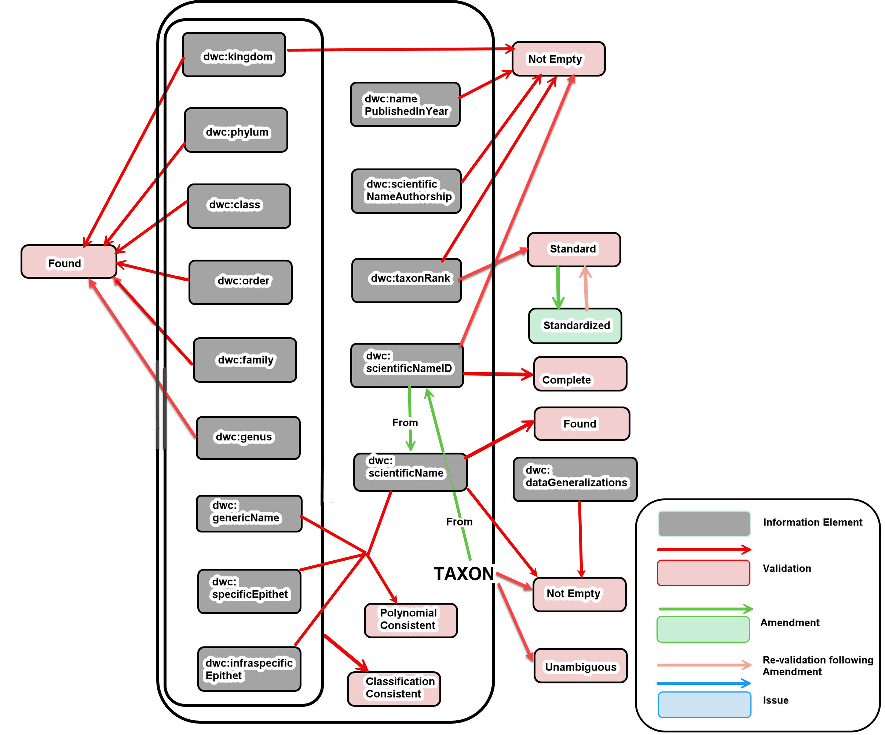
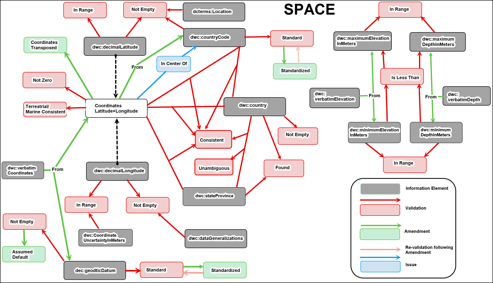
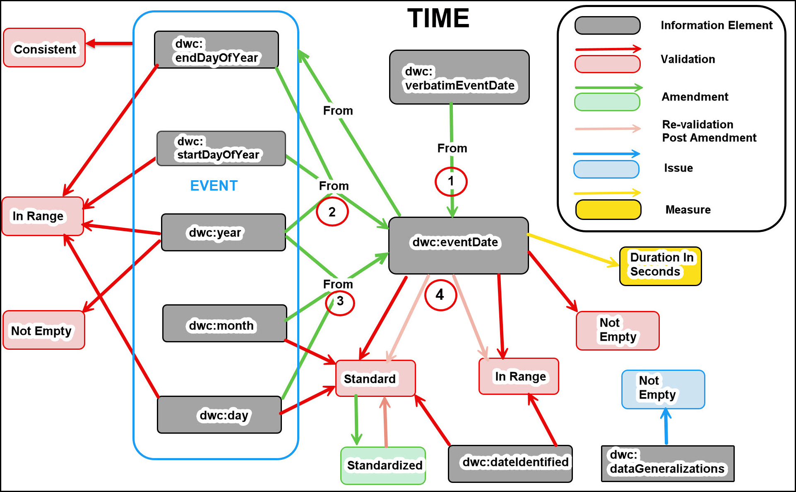
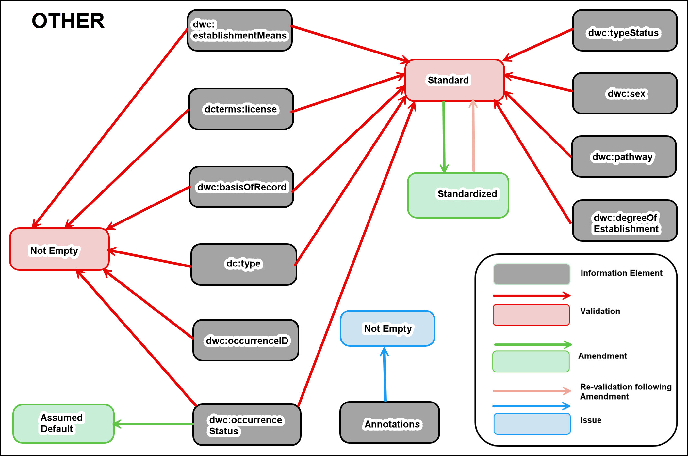

<!--- Template for header, values provided from yaml configuration --->
# {document_title}

**Title**<br>
{document_title}

**Date version issued**<br>
{ratification_date}

**Date created**<br>
{created_date}

**Part of TDWG Standard**<br>
<{standard_iri}>

<!--
**Preferred namespace abbreviation**<br>
{pref_namespace_prefix}
-->

**This version**<br>
<{current_iri}{ratification_date}>

**Latest version**<br>
<{current_iri}>

**Previous version**<br>
{previous_version_slot}

**Abstract**<br>
{abstract}

**Authors**<br>
{authors}

**Creator**<br>
{creator}

**Bibliographic citation**<br>
{creator}. {year}. {document_title}. {publisher}. <{current_iri}{ratification_date}>

**Status**<br>
{comment}

{toc}

## 1 Introduction (non-normative)

### 1.1 Purpose (non-normative)

The purpose of this document is to provide supplemental information that supports the interpretation, development, and long-term maintenance of the BDQ standard. It offers historical context, rationale, and informal guidance gathered during the development of BDQ, with the aim of helping users extend, adapt, or evaluate the Fitness For Use Framework (Veiga et al. 2017) in their own domains.

This document includes lessons learned, design considerations, Test development principles, and reflections on the structure of the BDQ standard. It serves both as a record of how the BDQ standard evolved and as a practical reference for those planning to create additional Tests or `Profiles`.

### 1.2 Audience (non-normative)

This document is intended for practitioners who wish to deepen their understanding of the BDQ standard beyond the formal specifications. It will be useful for:

- Data curators, aggregators, and publishers working to evaluate or improve data quality.
- Developers and analysts designing new Tests or adapting existing ones to domain-specific needs.
- Standards maintainers and contributors seeking insight into the design motivations and history of the BDQ standard.
- Informal guidance for those tasked with maintaining or evolving the standard over time.

### 1.3 Associated Documents (non-normative)

For the list and links to all associated documents see [The Biodiversity Data Quality (BDQ) Standard](../../index.md).

### 1.4 Status of the Content of this Document (normative)

All sections of this document except this one are non-normative.

### 1.5 Namespace abbreviations (non-normative)

The following namespace abbreviations are used in this document:

| **Abbreviation** | **Namespace** |
| ------------ | -------------                               |
| bdqffdq:     | https://rs.tdwg.org/bdqffdq/terms/          |
| bdqtest:     | https://rs.tdwg.org/bdqtest/terms/          |
| bdqval:      | https://rs.tdwg.org/bdqval/terms/           |
| bdquc:       | https://rs.tdwg.org/bdquc/terms/            |
| dc:          | https://purl.org/dc/elements/1.1/           |
| dcterms:     | http://purl.org/dc/terms/                   |
| dwc:         | http://rs.tdwg.org/dwc/terms/               |
| oa:          | http://www.w3.org/ns/oa#                    |
| owl:         | http://www.w3.org/2002/07/owl#              |
| prov:        | http://www.w3.org/ns/prov#                  |
| rdf:         | http://www.w3.org/1999/02/22-rdf-syntax-ns# |
| rdfs:        | http://www.w3.org/2000/01/rdf-schema#       |
| skos:        | http://www.w3.org/2004/02/skos/core#        |
| tdwgutility: | http://rs.tdwg.org/dwc/terms/attributes/    |
| xsd:         | http://www.w3.org/2001/XMLSchema#           |

## 2 Historical Context (non-normative)

Other than data availability, ‘Data Quality’ is probably the most significant issue for users of biodiversity data and this is especially so for the research community. An internationally agreed standard suite of Tests and resulting `Responses` can be used by all data providers, data collectors and data users to improve the quality of biodiversity data. This will facilitate more appropriate and more accurate use of biodiversity data. The BDQ Tests will not correct all issues that exist with the data but reports from the Tests will hopefully identify issues that need to be addressed by users of the data. Such issues will require the user to make decisions - i.e., data that may need to be excluded, data that may need improvement before use, and data that can be used as they are. It is always the responsibility of the user to decide what data are of suitable quality for their use.

### 2.1 Definition of CORE (non-normative)

'CORE' in the context of BDQ Tests implies that the Tests are 

- informative,
- simple to implement,
- mandatory for `Enhancements` and `Amendments`,
- have ‘power’ in that they will not likely result in 0% or 100% of all records failing or passing
- widely applicable across sub-disciplines within the biodiversity domain
- capable of elevating the significance of an issue (e.g., not having a value for `dcterms:license`), or
- aspirational in the sense of encouraging priority developments in the biodiversity informatics domain (e.g., testing for any suggested `Amendments` against a record)

These basic principles in the development of the Tests are elaborated in [3.11 Principles of Test Design (non-normative)](#311-principles-of-test-design-non-normative).

The scope of CORE was also developed from the user needs analysis of BDQ Task Group 3, (Data Quality Use Cases: Rees & Nicholls 2020). The CORE Tests largely cover data quality with regards to what organisms have occurred (`dwc:Occurrences`) where and when, and test a subset of [Darwin Core Terms](http://rs.tdwg.org/dwc/doc/list/) (Darwin Core Maintenance Group 2021) that we considered to be critical metadata about `dwc:Occurrence` records.

Additional Tests were framed, but considered out of scope for CORE data quality needs and were tagged as "Supplementary" in GitHub. These Tests may have a role in specific `Use Cases`. Implementers are free to implement a subset of the CORE Tests or Supplementary or new Tests when there is a particular data quality need within their domain - e.g., testing for a value of sub-genus against a taxonomic name authority or testing for a valid depth against maximum depth around the location of an observation. Be aware, however, that the Supplementary Tests have not gone through rigorous implementation testing. Note, also, that an implementation of BDQ will be compliant with the standard only if all Tests for at least one `Use Case` are implemented.  

Over the period of this project, many Tests were removed from CORE on the basis that they could not be currently implemented in a manner that would result in predictable results. 

Some Tests were deemed not CORE because they would currently result in the majority of data not having 'quality'. They have been given the GitHub tag "Immature/Incomplete", to denote that these Tests may have value in the future. An example of such a Test is VALIDATION_REPRODUCTIVECONDITION_NOTEMPTY, where we would expect most records to have `bdqval:Empty` for `dwc:reproductiveCondition`.

#### 2.1.1 Tests tagged as DO NOT IMPLEMENT (non-normative)

Some Tests were deemed not CORE because there was a perceived danger in their implementation, even though they appeared superficially implementable. In such cases, we applied the GitHub tag "DO NOT IMPLEMENT" to warn future implementers about the dangers. An example of such as Test is VALIDATION_GEOGRAPHY_CONSISTENT, because of the current complexities in matching terms in the geographic names hierarchy.

The following issues describing potential Tests were tagged as [DO NOT IMPLEMENT](https://github.com/tdwg/bdq/issues?q=+label%3A%22DO+NOT+IMPLEMENT%22). The discussion in each issue provides rationale management for why they were tagged as such.

| Issue | Name | Description |
| ----- | ---- | ----------- |
| [274](https://github.com/tdwg/bdq/issues/274) | VALIDATION_MODIFIED_INRANGE | Is the value of dcterms:modified entirely with the Parameter Range? |
| [141](https://github.com/tdwg/bdq/issues/141) | VALIDATION_YEAR_STANDARD | Can the value for year be interpreted as a valid year? |
| [95](https://github.com/tdwg/bdq/issues/95)   | VALIDATION_GEOGRAPHY_CONSISTENT | Is the combination of the values of the terms dwc:continent, dwc:country, dwc:countryCode, dwc:stateProvince, dwc:county, dwc:municipality consistent with the bdqval:sourceAuthority? |
| [139](https://github.com/tdwg/bdq/issues/139) | VALIDATION_GEOGRAPHY_STANDARD | Can the individual values of the terms dwc:continent, dwc:country, dwc:countryCode, dwc:stateProvince, dwc:county, dwc:municipality be unambiguously resolved from bdqval:sourceAuthority? |
| [266](https://github.com/tdwg/bdq/issues/266) | VALIDATION_WATERBODY_NOTEMPTY | Is there a value in dwc:waterbody? |
| [231](https://github.com/tdwg/bdq/issues/231) | VALIDATION_IDENTIFICATIONQUALIFIER_NOTEMPTY | Is there a value in dwc:identificationQualifier? |
| [37](https://github.com/tdwg/bdq/issues/37)   | ISSUE_DAYMONTH_SWAPPED | Is it likely that the day and month have been swapped? |
| [89](https://github.com/tdwg/bdq/issues/89)   | ISSUE_DECIMALLATITUDEDECIMALLONGITUDE_CONVERSIONFAILED | Latitude and longitude could not be converted using the default geodetic datum |
| [35](https://github.com/tdwg/bdq/issues/35)   | MEASURE_VALIDATIONTESTS_RUN | Total number of Tests of output type Validation that have been attempted to have been run against the record |
| [129](https://github.com/tdwg/bdq/issues/129) | AMENDMENT_YEAR_STANDARDIZED | Attempt to amend the year |
| [34](https://github.com/tdwg/bdq/issues/34)   | AMENDMENT_DAYMONTH_TRANSPOSED | Swap dwc:month and dwc:day if dwc:month is greater than 12 and dwc:day is less than 12. |
| [90](https://github.com/tdwg/bdq/issues/90)   | AMENDMENT_KINGDOM_STANDARDIZED | Can the value for kingdom be standardized against the Source Authority? |
| [80](https://github.com/tdwg/bdq/issues/80)   | AMENDMENT_PHYLUM_STANDARDIZED | Can the value of dwc:phylum be standardized using the Source Authority? |
| [53](https://github.com/tdwg/bdq/issues/53)   | AMENDMENT_CLASS_STANDARDIZED | Can the value of dwc:class be standardized using the Source Authority? |
| [27](https://github.com/tdwg/bdq/issues/27)   | AMENDMENT_FAMILY_STANDARDIZED | Can the value of dwc:family be standardized using the Source Authority? |
| [25](https://github.com/tdwg/bdq/issues/25)   | AMENDMENT_ORDER_STANDARDIZED | Can the value of dwc:order be standardized using the Source Authority? |
| [118](https://github.com/tdwg/bdq/issues/118) | AMENDMENT_GEOGRAPHY_STANDARDIZED | Can the value of one or more of the values dwc:continent, dwc:country, dwc:countryCode, dwc:stateProvince, dwc:county, dwc:municipality be standardized using bdqval:sourceAuthority? |
| [100](https://github.com/tdwg/bdq/issues/100) | AMENDMENT_MINDEPTHMAXDEPTH_TRANSPOSED | Attempt to transpose minimum and maximum depth if minimum depth is greater than maximum depth. |
| [44](https://github.com/tdwg/bdq/issues/44)   | AMENDMENT_MINELEVATIONMAXELEVATION_TRANSPOSED | If dwc:minimumElevationInMeters is greater than dwc:maximumElevationInMeters, can they be meaningfully swapped? |

### 2.2 Use Case Development (non-normative)

Biodiversity Data Quality Task Group 3: Data Quality Use Cases (Rees & Nicholls 2020) was established to review what `Use Cases` were prevalent within the community of those dealing with biodiversity data. This task group identified several fundamental `Use Cases`, including `bdquc:Spatial-Temporal_Patterns`, and `bdquc:Taxon-Management`. We later added `bdquc:Alien-Species`, and `bdquc:SDM-Trees` (and added and removed Record-Management and Biotic-Relationships `Use Cases`).

These are only a sample of the many possible `Use Cases` for the biological sciences, but they provide an initial set to which all the BDQ Tests have been linked. Note that the relationship between `Use Cases` and Tests is a many-to-many relationship - with most Tests being relatable to many `Use Cases` and vice versa.

Note that the evaluation of a Test can only take place within the context of a specific `Use Case`, even if that use is particularly broad or particularly narrow. For example, the Test [VALIDATION_COUNTRY_FOUND](../terms/bdqtest/index.md#VALIDATION_COUNTRY_FOUND) could assess the value of `dwc:country` against a `sourceAuthority` for a `Use Case` `bdquc:Spatial-Temporal_Patterns`, but this Test may not be applicable to a `Use Case` related to marine ecology.

See also [Creating a New Use Case](../guide/bdqtest/index.md#8-creating-new-use-cases-non-normative) in [BDQ Tests: Concepts and Use](../guide/bdqtest/index.md) and a more detailed example of the development of a new `Use Case` with  new Tests in the [Tutorial](../tutorial/index.md). 

A `Use Case` can be defined outside of the BDQ standard, and users are encouraged to define `Use Cases` for their own purposes.

#### 2.2.1 Making Use Cases and BDQ Tests match by iterative refinement (non-normative)

Most of the BDQ `Use Cases` are broad, with many BDQ Tests linked to each one. When we drafted a more specific `Use Case` (`bdquc:SDM-Trees`), it became much easier to see when a stated fitness requirement has no corresponding BDQ Test, or when the available Tests only check a more general condition than the `Use Case` requires.

The list below shows the key components of the initial phrasing of the `SDM-Trees` `Use Case`: Definition; Fitness Requirements, and the set of BDQ `Single Record` Tests we initially linked to those requirements.


Name: **SDM-Trees** 

Definition: 
* `A bdqffdq:UseCase for selecting dwc:Occurrence records suitable for predicting the spatial distribution of a limited number of Eucalypt tree species (Gill et al. 1985). This Use Case filters for occurrence records that meet criteria for a known species at a known location and date. Filtered records are combined with environmental data derived from occurrence locations to evaluate robust spatial distribution models, including Maxent (Phillips et al. 2006) and generalized linear and additive models (Guisan et al. 2002). Models will be further assessed via systematic surveys in areas with high predicted occurrence and low record density. Project outputs are: (1) recommendations for robust species distribution modeling methods for tree species, (2) a suite of environmental variables for the selected species, and (3) improved “expert distribution” envelopes derived from modeling.`

Fitness requirements: 
```
Records are fit for the use case bbdquc:SDM-Trees when they have valid:
* dwc:scientificName identified to species level.
* dwc:basisOfRecord = bdqval:notEmpty.
* dwc:occurrenceStatus = "present".
* dwc:decimalLatitude and dwc:decimalLongitude in range.
* dwc:coordinateUncertaintyInMeters < 500.
* dwc:dataGeneralizations = bdqval:empty
* dwc:year or dwc:eventDate within provided temporal limits.
```

Included Tests: 
* VALIDATION_SCIENTIFICNAME_FOUND, AMENDMENT_SCIENTIFICNAME_FROM_SCIENTIFICNAMEID, 
* VALIDATION_BASISOFRECORD_STANDARD; AMENDMENT_BASISOFRECORD_STANDARDIZED, 
* VALIDATION_OCCURRENCESTATUS_STANDARD
* VALIDATION_DECIMALLATITUDE_INRANGE
* VALIDATION_DECIMALLONGITUDE_INRANGE
* VALIDATION_COORDINATEUNCERTAINTY_INRANGE, 
* ISSUE_DATAGENERALIZATIONS_NOTEMPTY
* VALIDATION_EVENTDATE_STANDARD
* VALIDATION_YEAR_INRANGE

Upon framing this `Use Case` we made the following key observation:

(1) In these initial fitness requirements, some conditions are expressed as domain-specific thresholds or values, but we do not currently have BDQ Tests defined that evaluate those exact statements (as written): 
   * `dwc:scientificName` identified to species level,
   * `dwc:coordinateUncertaintyInMeters` < 500,
   * `dwc:occurrenceStatus` = "present",
   * `dwc:year` or `dwc:eventDate` within provided temporal limits.

Most of the included Tests evaluate for more general conditions than the specific requirements stated in the `Use Case`. For example, VALIDATION_OCCURRENCESTATUS_STANDARD checks that the value of `dwc:occurrenceStatus` is valid according to a configured source authority, but it does not check that the value is "present". Similarly, VALIDATION_COORDINATEUNCERTAINTY_INRANGE checks that the value of `dwc:coordinateUncertaintyInMeters` is within a configured numeric range, but it does not check that it is less than 500 m.

This highlights the key issue: a `Use Case` can state fitness requirements that are more specific than the currently agreed BDQ Tests can check. When that happens, we have two options: (1) define additional BDQ Tests (only when broadly useful), or (2) refine the `Use Case` fitness requirements so they are expressed in terms that existing BDQ Tests can evaluate (often by relying on configurable source authorities and configurable thresholds). The updated `bdquc:SDM-Trees` example below illustrates option (2).  The [Tutorial](../tutorial/index.md) illustrates option (1) adding new tests to meet the requirements.

We also observed that:

(2) Most of the included `Single Record` Tests check for validity of a value, when corresponding Tests exist to check for the presence of a value in the same term. 

We included, for example, VALIDATION_DECIMALLATITUDE_INRANGE and VALIDATION_DECIMALLONGITUDE_INRANGE, but not the corresponding NOTEMPTY tests VALIDATION_DECIMALLATITUDE_NOTEMPTY and VALIDATION_DECIMALLONGITUDE_NOTEMPTY.  This is entirely appropriate for `Quality Assurance` where we can set `Multi Record` `Measures` that return COMPLETE if the STANDARD and INRANGE `Validations` have a Response.result of COMPLIANT.   If, however, we wish to perform `Quality Control` and improve the fitness of a candiate data set, it will be very helpful to isolate and count which records have empty values for these critical terms, and which have out of range values (and we would include `Multi Record` `Measures` that count outcomes).  The kind and scope of data cleanup work that may be needed will differ depending on the distribution of these distinct kinds of problem in the data set.

(3) Selection of a threshold value for `dwc:coordinateUncertaintyInMeters` in relation to an analysis grid is fraught with complexities for the unwary.  See: Zermoglio et al. (2022) sections on [Coordinates and Grid Systems)[https://docs.gbif.org/georeferencing-quick-reference-guide/1.0/en/#coordinates-grid-systems) and [Table of feature types and default geographic radials](https://docs.gbif.org/georeferencing-quick-reference-guide/1.0/en/#table-default-geographic-radial) and [geographic radial](https://docs.gbif.org/georeferencing-quick-reference-guide/1.0/en/#geographic-radial).

This will be moot for this `Use Case` if we refine the `Use Case` to not include a specific threshold value for `dwc:coordinateUncertaintyInMeters`.

(4) We have not included any `Multi Record` `Measures` in this `Use Case`, so we don't have any formal support for either `Quality Control` or `Quality Assurance`. 

The initial focus is on `Quality Assurance`, so we would expect to add `Multi Record` `Measures` such as MULTIRECORD_MEASURE_QA_DECIMALLATITUDE_INRANGE.  For this filtering, we only need to check that the value of `dwc:decimalLatitude` is in range, i.e., that the VALIDATION_DECIMALLATITUDE_INRANGE Test returns COMPLIANT.

If we want to support `Quality Control` as well, we would add `Measures` such as MULTIRECORD_MEASURE_COUNT_COMPLIANT_DECIMALLATITUDE_NOTEMPTY and MULTIRECORD_MEASURE_COUNT_COMPLIANT_DECIMALLATITUDE_INRANGE, and we would want to also include counts that assess NOTEMPTY as well as INRANGE, so that we can determine how many records have empty values for `dwc:decimalLatitude` and how many have out of range values.  This would allow us to determine the kind and scope of data cleanup work that may be needed to improve the fitness of the data for this `Use Case`.

Iteration 2

Definition: 
* `A bdqffdq:UseCase for improving the quality of, and selecting dwc:Occurrence records suitable for predicting the spatial distribution of a limited number of Eucalypt tree species (Gill et al. 1985). This Use Case filters for occurrence records that meet criteria for a known species at a known location and date.  Records can be further filtered to meet the requirements of a particular distribution modeling analysis.  Filtered records can then be combined with environmental data derived from occurrence locations to evaluate robust spatial distribution models, including Maxent (Phillips et al. 2006) and generalized linear and additive models (Guisan et al. 2002). Models will be further assessed via systematic surveys in areas with high predicted occurrence and low record density. Project outputs are: (1) recommendations for robust species distribution modeling methods for tree species, (2) a suite of environmental variables for the selected species, and (3) improved “expert distribution” envelopes derived from modeling.`

Revised fitness requirements:
```
Data are fit for the use case bdquc:SDM-Trees when records have:
* A scientific name (dwc:scientificName) that can be resolved in the configured taxonomic source authority (default: GBIF Backbone Taxonomy).
* A non-empty dwc:basisOfRecord whose value is valid in the configured basisOfRecord source authority.
* A non-empty dwc:occurrenceStatus whose value is valid in the configured occurrenceStatus source authority.
* Non-empty decimal coordinates (dwc:decimalLatitude and dwc:decimalLongitude) with values that are interpretable as numbers and within valid geographic ranges.
* Coordinate uncertainty in meters (dwc:coordinateUncertaintyInMeters), when present, that is interpretable as a number and within a valid numeric range.
* A non-empty year (dwc:year) that is interpretable as an integer and is within configured temporal bounds (bdqval:earliestValidDate to bdqval:latestValidDate).
* An ISO 8601–valid event date (dwc:eventDate) when present, and (where applicable) event-date components MAY be used to fill missing dwc:year/dwc:month/dwc:day from dwc:eventDate.
* There is a valid value in dcterms:license.
```

Included SingleRecord Tests: 
* VALIDATION_SCIENTIFICNAME_NOTEMPTY, VALIDATION_SCIENTIFICNAME_FOUND, AMENDMENT_SCIENTIFICNAME_FROM_SCIENTIFICNAMEID, 
* VALIDATION_BASISOFRECORD_NOTEMPTY, VALIDATION_BASISOFRECORD_STANDARD; AMENDMENT_BASISOFRECORD_STANDARDIZED, 
* VALIDATION_OCCURRENCESTATUS_NOTEMPTY, VALIDATION_OCCURRENCESTATUS_STANDARD
* VALIDATION_DECIMALLATITUDE_NOTEMPTY, VALIDATION_DECIMALLATITUDE_INRANGE
* VALIDATION_DECIMALLONGITUDE_NOTEMPTY, VALIDATION_DECIMALLONGITUDE_INRANGE
* VALIDATION_COORDINATEUNCERTAINTY_INRANGE, 
* ISSUE_DATAGENERALIZATIONS_NOTEMPTY
* VALIDATION_EVENTDATE_NOTEMPTY, VALIDATION_EVENTDATE_STANDARD, AMENDMENT_EVENTDATE_STANDARDIZED
* VALIDATION_YEAR_NOTEMPTY, VALIDATION_YEAR_INRANGE, AMENDMENT_EVENT_FROM_EVENTDATE
* VALIDATION_LICENSE_NOTEMPTY, VALIDATION_LICENSE_STANDARD, AMENDMENT_LICENSE_STANDARDIZED

Included `Multi Record` `Measure` Tests for `Quality Control`:

* MULTIRECORD_MEASURE_COUNT_COMPLIANT_SCIENTIFICNAME_NOTEMPTY, MULTIRECORD_MEASURE_COUNT_COMPLIANT_SCIENTIFICNAME_FOUND
* MULTIRECORD_MEASURE_COUNT_COMPLIANT_BASISOFRECORD_NOTEMPTY, MULTIRECORD_MEASURE_COUNT_COMPLIANT_BASISOFRECORD_STANDARD 
* MULTIRECORD_MEASURE_COUNT_COMPLIANT_OCCURRENCESTATUS_NOTEMPTY, MULTIRECORD_MEASURE_COUNT_COMPLIANT_OCCURRENCESTATUS_STANDARD
* MULTIRECORD_MEASURE_COUNT_COMPLIANT_DECIMALLATITUDE_NOTEMPTY, MULTIRECORD_MEASURE_COUNT_COMPLIANT_DECIMALLATITUDE_INRANGE
* MULTIRECORD_MEASURE_COUNT_COMPLIANT_DECIMALLONGITUDE_NOTEMPTY, MULTIRECORD_MEASURE_COUNT_COMPLIANT_DECIMALLONGITUDE_INRANGE
* MULTIRECORD_MEASURE_COUNT_COMPLIANT_COORDINATEUNCERTAINTY_INRANGE
* MULTIRECORD_MEASURE_COUNT_COMPLIANT_EVENTDATE_NOTEMPTY, MULTIRECORD_MEASURE_COUNT_COMPLIANT_EVENTDATE_STANDARD
* MULTIRECORD_MEASURE_COUNT_COMPLIANT_YEAR_NOTEMPTY, MULTIRECORD_MEASURE_COUNT_COMPLIANT_YEAR_INRANGE
* MULTIRECORD_MEASURE_COUNT_COMPLIANT_LICENSE_NOTEMPTY, MULTIRECORD_MEASURE_COUNT_COMPLIANT_LICENSE_STANDARD

Included `Multi Record` `Measure` Tests for `Quality Assurance`:

* MULTIRECORD_MEASURE_QA_SCIENTIFICNAME_FOUND
* MULTIRECORD_MEASURE_QA_BASISOFRECORD_STANDARD
* MULTIRECORD_MEASURE_QA_OCCURRENCESTATUS_STANDARD
* MULTIRECORD_MEASURE_QA_DECIMALLATITUDE_INRANGE
* MULTIRECORD_MEASURE_QA_DECIMALLONGITUDE_INRANGE
* MULTIRECORD_MEASURE_QA_COORDINATEUNCERTAINTY_INRANGE
* MULTIRECORD_MEASURE_QA_EVENTDATE_STANDARD
* MULTIRECORD_MEASURE_QA_YEAR_INRANGE
* MULTIRECORD_MEASURE_QA_LICENSE_STANDARD

In other words, instead of requiring specific fixed values (e.g., `dwc:occurrenceStatus` must be “present” or `dwc:coordinateUncertaintyInMeters` must be < 500 m) for which we don't have defined tests, this `Use Case` iteration expresses requirements in a way that can be evaluated using the existing BDQ Tests and configuration (authoritative vocabularies, numeric ranges, and temporal bounds), leaving more specific filtering to downstream processes.

The BDQ Tests linked to this `Use Case` therefore provide a first-pass filter to create a dataset with defined, testable quality characteristics. That dataset can then be filtered further for more specific project needs (for example, a particular `dwc:occurrenceStatus` value, a tighter uncertainty threshold, or narrower dates), but those additional constraints are outside the scope of the current agreed BDQ Tests unless and until new broadly reusable Tests are defined.

The differences between the initial and revised versions of the `Use Case` definition are subtle, reflecting the inclusion of Quality Control, and are highlighted below:

> A bdqffdq:UseCase for **improving the quality of, and** selecting dwc:Occurrence records suitable for predicting the spatial distribution of a limited number of Eucalypt tree species (Gill et al. 1985). This Use Case filters for occurrence records that meet criteria for a known species at a known location and date.  **Records can be further filtered to meet the requirements of a particular distribution modeling analysis.**  Filtered records ~~are~~ **can then be** combined with environmental data derived from occurrence locations to evaluate robust spatial distribution models, including Maxent (Phillips et al. 2006) and generalized linear and additive models (Guisan et al. 2002).  Models will be further assessed via systematic surveys in areas with high predicted occurrence and low record density. Project outputs are: (1) recommendations for robust species distribution modeling methods for tree species, (2) a suite of environmental variables for the selected species, and (3) improved “expert distribution” envelopes derived from modeling.

As part of refining a `Use Case`, we have found it helpful to: (1) draft a `Use Case` definition, (2) list the Tests to be included, (3) query an RDF (Turtle) serialization of the `bdqtest"` vocabulary to extract the `Specification` text for those Tests, and then (4) use a generative AI tool to draft fitness requirements that are consistent with the included Test specifications.  Then go back and assess whether the desired set of tests for the `Use Case` are included, particularly examining which `Multi Record` `Measures` are included, and then revising the `Use Case` definition and fitness requirements.  Obviously (sometimes in retrospect), this is an iterative process.

Code for querying the Turtle serialization [bdqtest.ttl](../../dist/bdqtest.ttl) of the bdqtest vocabulary for the `Specification` descriptions of each Test included in a `Use Case` is at: https://github.com/tdwg/bdq/blob/master/tg2/_build_review/tools/bdq_usecase_test_labels_Version4.py, and the SPARQL query for asking this question is in Section [2.4.2 Describing all the Tests in a Use Case](#242-describing-all-the-tests-in-a-use-case-non-normative) below.

### 2.3 Data Quality Control and Data Quality Assurance (non-normative)

The Fitness For Use Framework (Veiga 2016, Veiga et al. 2017) draws a distinction between `Quality Control` and `Quality Assurance`. Quality Control processes seek to assess the quality of data for some purpose, then identify changes to the data or to processes around the data to improve the quality of the data. Quality Assurance processes seek to filter some set of data to a subset that is fit for some purpose (`Use Case`).

The specification of the BDQ Tests within the Framework allows the same set of Tests to apply to both Data `Quality Control` and Data `Quality Assurance`. The design of the Test Types `Validations` and `Measures` are intended to be agnostic as to whether their use is for finding problematic data (Data `Quality Control`), or for filtering out NOT_COMPLIANT records (Data `Quality Assurance`). See the [BDQ User’s Guide Section 2](../guide/users/index.md#21-quality-control-and-quality-assurance-non-normative) for further details on QA/QC. 

### 2.4 Framework Competency Questions (non-normative)

The development of the representation of the Fitness For Use Framework as an OWL ontology (`bdqffdq:`) was influenced by competency questions, shaped by the late Robert A. Morris, and originally written by David Lowery within the kurator-ffdq codebase (Lowery et al. 2025); see [kurator-ffdq competency questions](https://github.com/kurator-org/kurator-ffdq/tree/master/competencyquestions) as part of the Kurator project (Morris et al. 2018). The development of the BDQ Test descriptors (the terms used to describe our Tests) led to changes in the ontology, largely in adopting a consistent naming pattern. Changes to the specifics of competency questions followed.

Following are example competency questions that can be asked of the RDF representation of `bdqtest:`:

Given a `Use Case`, can one find `Validation` Tests and their `Specifications`?

```sparql
    PREFIX bdqffdq: <https://rs.tdwg.org/bdqffdq/terms/>
    PREFIX rdfs: <http://www.w3.org/2000/01/rdf-schema#>
    PREFIX skos: <http://www.w3.org/2004/02/skos/core#>
    
    SELECT DISTINCT ?useCase ?test ?specification
    
    WHERE {
    
        # Find Validations from the ValidationPolicy
        # for a given Use Case
    
        ?policy a bdqffdq:ValidationPolicy .
        ?policy bdqffdq:hasUseCase ?uc .
        ?policy bdqffdq:includedInPolicy ?cc .
        ?uc rdfs:label ?useCase .
    
        # Find the specification from the validation method
        # referencing the Validation
    
        ?cc skos:prefLabel ?test .
    
        ?vm a bdqffdq:ValidationMethod .
        ?vm bdqffdq:forValidation ?cc .
        ?vm bdqffdq:hasSpecification ?testSpec .
        ?testSpec bdqffdq:hasExpectedResponse ?specification .

        # Filter by a specific Use Case
    
         FILTER( ?uc = <https://rs.tdwg.org/bdquc/terms/Taxon-Management> )
    }
```

Given a `Use Case`, can one find the `Single Record` `Validations` related to that `Use Case`?  This is a question that an implementation of Tests might ask of an RDF representation of the bdqtest: vocabulary (list of Tests) in order to determine which Tests to run against each record in a dataset, given a target `Use Case` as a user selection in that implementation.

```sparql
    PREFIX rdf:     <http://www.w3.org/1999/02/22-rdf-syntax-ns#>
    PREFIX rdfs:    <http://www.w3.org/2000/01/rdf-schema#>
    PREFIX skos:    <http://www.w3.org/2004/02/skos/core#>
    PREFIX dcterms: <http://purl.org/dc/terms/>
    
    PREFIX bdqffdq: <https://rs.tdwg.org/bdqffdq/terms/>
    PREFIX bdquc:     <https://rs.tdwg.org/bdquc/terms/>
    PREFIX bdqtest: <https://rs.tdwg.org/bdqtest/terms/>
    
    # 1) Choose a Use Case (edit the VALUES line below).
    # 2) From the ValidationPolicy that relates the Use Case to Validations,
    #    identify the SingleRecord Validation Tests for that Use Case.
    
    SELECT DISTINCT
      ?useCase
      ?validation
      ?validationLabel
      ?validationPrefLabel
      ?issued
    WHERE {
      # ---- Choose the Use Case ----
      # Option A: by URI (recommended)
      VALUES ?useCase { bdquc:Spatial-Temporal_Patterns }
    
      # Option B: by label (uncomment if you prefer label-based selection)
      # VALUES ?useCaseLabel { "Spatial-Temporal Patterns" }
    
      # ---- Use Case label (optional) ----
      OPTIONAL { ?useCase rdfs:label ?useCaseLabel }
    
      # ---- Follow ValidationPolicy -> Validations ----
      ?policy a bdqffdq:ValidationPolicy ;
              bdqffdq:hasUseCase ?useCase ;
              bdqffdq:includedInPolicy ?validation .
    
      OPTIONAL { ?policy rdfs:label ?policyLabel }
    
      # ---- Restrict to Validation tests on SingleRecord ----
      ?validation a bdqffdq:Validation ;
                  bdqffdq:hasResourceType bdqffdq:SingleRecord ;
                  rdfs:label ?validationLabel .
    
      OPTIONAL { ?validation skos:prefLabel ?validationPrefLabel }
      OPTIONAL { ?validation dcterms:issued ?issued }
    }
    ORDER BY LCASE(STR(?validationLabel)) STR(?issued)
```

Or, to just get the UUID of these tests (for example to lookup relevant methods using Java annotations), asking: Given a `Use Case`, can one find the UUIDs of the `Single Record` `Validations` related to that `Use Case`?

```sparql
    PREFIX rdf:     <http://www.w3.org/1999/02/22-rdf-syntax-ns#>
    PREFIX rdfs:    <http://www.w3.org/2000/01/rdf-schema#>
    PREFIX dcterms: <http://purl.org/dc/terms/>
    
    PREFIX bdqffdq: <https://rs.tdwg.org/bdqffdq/terms/>
    PREFIX bdquc:     <https://rs.tdwg.org/bdquc/terms/>
    
    SELECT DISTINCT
        ?isVersionOf 
    WHERE {
      # ---- Choose the Use Case ----
      VALUES ?useCase { bdquc:Spatial-Temporal_Patterns }
    
      # ---- Follow ValidationPolicy -> Validations ----
      ?policy a bdqffdq:ValidationPolicy ;
              bdqffdq:hasUseCase ?useCase ;
              bdqffdq:includedInPolicy ?validation .
    
      # ---- Restrict to Validation tests on SingleRecord ----
      ?validation a bdqffdq:Validation ;
                  bdqffdq:hasResourceType bdqffdq:SingleRecord ;
                  dcterms:isVersionOf ?isVersionOf .
    }
```


Can one find a summary of Tests by `Data Quality Dimension` with specific Darwin Core Terms in `Information Elements` `Acted Upon`? 

```sparql
    PREFIX rdf: <http://www.w3.org/1999/02/22-rdf-syntax-ns#>
    PREFIX owl: <http://www.w3.org/2002/07/owl#>
    PREFIX rdfs: <http://www.w3.org/2000/01/rdf-schema#>
    PREFIX xsd: <http://www.w3.org/2001/XMLSchema#>
    PREFIX bdqffdq: <https://rs.tdwg.org/bdqffdq/terms/>
    PREFIX bdqtest: <https://rs.tdwg.org/bdqtest/terms/>
    SELECT (STR(count(?test)) as ?ct) ?dimension ?sie
    WHERE {
       ?ie bdqffdq:composedOf ?sie .
       ?test bdqffdq:hasActedUponInformationElement ?ie .
       ?test bdqffdq:hasDataQualityDimension ?dimension .
       ?test rdf:type ?testType .
       FILTER (?testType != owl:NamedIndividual)
    }
    GROUP BY ?sie ?dimension
    ORDER BY ?sie ?dimension
```

Can one find a summary of Tests by Test Type with specific Darwin Core Terms in `Information Elements` `Acted Upon`?

```sparql
    PREFIX rdf: <http://www.w3.org/1999/02/22-rdf-syntax-ns#>
    PREFIX owl: <http://www.w3.org/2002/07/owl#>
    PREFIX rdfs: <http://www.w3.org/2000/01/rdf-schema#>
    PREFIX xsd: <http://www.w3.org/2001/XMLSchema#>
    PREFIX bdqffdq: <https://rs.tdwg.org/bdqffdq/terms/>
    PREFIX bdqtest: <https://rs.tdwg.org/bdqtest/terms/>
    SELECT (STR(count(?test)) as ?ct) ?testType ?sie
    WHERE {
        ?ie bdqffdq:composedOf ?sie .
        ?test bdqffdq:hasActedUponInformationElement ?ie .
        ?test rdf:type ?testType .
        FILTER (?testType != owl:NamedIndividual)
    }
    GROUP BY ?sie ?testType
    ORDER BY ?sie ?testType
```

Given a `Specification` (as would be known when starting with a `bdqffdq:Response` and following `bdqffdq:producesResponse` to a `bdqffdq:Implementation` then `bdqffdq:usesSpecification`), which Test was run with which argument values for which `Parameters`?

```sparql
    PREFIX rdf: <http://www.w3.org/1999/02/22-rdf-syntax-ns#>
    PREFIX rdfs: <http://www.w3.org/2000/01/rdf-schema#>
    PREFIX bdqffdq: <https://rs.tdwg.org/bdqffdq/terms/>
    PREFIX dcterms: <http://purl.org/dc/terms/>
    
    SELECT ?test ?label ?description ?parameter ?argumentValue
    WHERE {
      ?method bdqffdq:hasSpecification <urn:uuid:f3e03531-7ee5-4721-aae2-f554389e0544> .
      ?method bdqffdq:forValidation ?test .
    
      ?test rdf:type bdqffdq:Validation .
      ?test rdfs:label ?label .
    
      <urn:uuid:f3e03531-7ee5-4721-aae2-f554389e0544> dcterms:description ?description .
    
      OPTIONAL {
        <urn:uuid:f3e03531-7ee5-4721-aae2-f554389e0544> bdqffdq:hasArgument ?argument .
        ?argument bdqffdq:hasParameter ?parameter .
        ?argument bdqffdq:hasArgumentValue ?argumentValue .
      }
    }
```

Given a `Response`, which Test was run with which `has Argument values` for which `Parameters` by which `Mechanism` to produce it: 

<!-- skip when testing -->
```sparql
    PREFIX rdf: <http://www.w3.org/1999/02/22-rdf-syntax-ns#>
    PREFIX owl: <http://www.w3.org/2002/07/owl#>
    PREFIX rdfs: <http://www.w3.org/2000/01/rdf-schema#>
    PREFIX xsd: <http://www.w3.org/2001/XMLSchema#>
    PREFIX bdqffdq: <https://rs.tdwg.org/bdqffdq/terms/>
    SELECT ?test ?label ?description  (GROUP_CONCAT(DISTINCT ?params; separator='; ') as ?parameters) ?mechanism
    WHERE { 
      ?test rdf:type bdqffdq:Validation . ?test rdfs:label ?label . ?method bdqffdq:forValidation ?test .
      ?method bdqffdq:hasSpecification ?specification . ?specification rdfs:comment ?description .
      OPTIONAL { 
         ?specification bdqffdq:hasArgument ?argument . ?argument bdqffdq:hasArgumentValue ?argumentValue . ?argument bdqffdq:hasParameter ?parameter .
         BIND (CONCAT(STR(?parameter), "=" , ?argumentValue ) as ?params )
      } .
      ?implementation bdqffdq:usesSpecification ?specification . ?implementation bdqffdq:producesResponse ?assertion .
      ?implementation bdqffdq:implementedBy ?mechanism .
      FILTER (STR(?assertion) = "{id of assertion to look up}")
    }
    GROUP BY ?test ?label ?description ?mechanism
```

What `Validations` and `Amendments` share `Information Elements` `Acted Upon`?

```sparql
    PREFIX rdf: <http://www.w3.org/1999/02/22-rdf-syntax-ns#>
    PREFIX owl: <http://www.w3.org/2002/07/owl#>
    PREFIX rdfs: <http://www.w3.org/2000/01/rdf-schema#>
    PREFIX xsd: <http://www.w3.org/2001/XMLSchema#>
    PREFIX bdqffdq: <https://rs.tdwg.org/bdqffdq/terms/>
    SELECT distinct ?vlabel ?term ?alabel
 	WHERE { 
       ?validation a bdqffdq:Validation . ?validation rdfs:label ?vlabel . ?validation bdqffdq:hasActedUponInformationElement ?ie .
       ?ie bdqffdq:composedOf ?term . ?iea bdqffdq:composedOf ?term . ?amendment bdqffdq:hasActedUponInformationElement ?iea .
        ?amendment a bdqffdq:Amendment . ?amendment rdfs:label ?alabel .
    }
    ORDER BY ?term
```

What `Information Elements` are `Acted Upon` by more that one `Amendment`?

```sparql
    PREFIX rdf: <http://www.w3.org/1999/02/22-rdf-syntax-ns#>
    PREFIX owl: <http://www.w3.org/2002/07/owl#>
    PREFIX rdfs: <http://www.w3.org/2000/01/rdf-schema#>
    PREFIX xsd: <http://www.w3.org/2001/XMLSchema#>
    PREFIX bdqffdq: <https://rs.tdwg.org/bdqffdq/terms/>
    
    SELECT
      ?term
      (STR(COUNT(DISTINCT ?alabel)) AS ?ctstr)
      (COUNT(DISTINCT ?alabel) AS ?ct)
    WHERE {
      ?validation a bdqffdq:Validation ;
                  rdfs:label ?vlabel ;
                  bdqffdq:hasActedUponInformationElement ?ie .
      ?ie bdqffdq:composedOf ?term .
    
      ?iea bdqffdq:composedOf ?term .
      ?amendment a bdqffdq:Amendment ;
                 rdfs:label ?alabel ;
                 bdqffdq:hasActedUponInformationElement ?iea .
    }
    GROUP BY ?term
    HAVING (COUNT(DISTINCT ?alabel) > 1)
    ORDER BY ?ct ?term
```

What `Amendments` have `Information Elements` `Acted Upon` that are `Acted Upon` by more than one `Amendment`:

```sparql
    PREFIX rdf:     <http://www.w3.org/1999/02/22-rdf-syntax-ns#>
    PREFIX owl:     <http://www.w3.org/2002/07/owl#>
    PREFIX rdfs:    <http://www.w3.org/2000/01/rdf-schema#>
    PREFIX xsd:     <http://www.w3.org/2001/XMLSchema#>
    PREFIX bdqffdq: <https://rs.tdwg.org/bdqffdq/terms/>
    
    SELECT DISTINCT ?amend ?amendName
    WHERE {
      # Identify Amendments and the terms they act upon
      ?amend a bdqffdq:Amendment ;
             rdfs:label ?amendName ;
             bdqffdq:hasActedUponInformationElement ?iec .
      ?iec bdqffdq:composedOf ?term .
    
      # Restrict to terms that are acted upon by more than one Amendment
      {
        SELECT ?term (COUNT(DISTINCT ?amendment) AS ?ct)
        WHERE {
          ?amendment a bdqffdq:Amendment ;
                     bdqffdq:hasActedUponInformationElement ?iea .
          ?iea bdqffdq:composedOf ?term .
        }
        GROUP BY ?term
        HAVING (COUNT(DISTINCT ?amendment) > 1)
      }
    }
    ORDER BY LCASE(STR(?amendName)) STR(?amend)
```

Which information elements are these: 
 
```sparql
    PREFIX rdf:     <http://www.w3.org/1999/02/22-rdf-syntax-ns#>
    PREFIX owl:     <http://www.w3.org/2002/07/owl#>
    PREFIX rdfs:    <http://www.w3.org/2000/01/rdf-schema#>
    PREFIX xsd:     <http://www.w3.org/2001/XMLSchema#>
    PREFIX bdqffdq: <https://rs.tdwg.org/bdqffdq/terms/>
 
    SELECT DISTINCT ?term (STR(?ct) as ?ctstr)
    WHERE {
      # Identify Amendments and the terms they act upon
      ?amend a bdqffdq:Amendment ;
             rdfs:label ?amendName ;
             bdqffdq:hasActedUponInformationElement ?iec .
      ?iec bdqffdq:composedOf ?term .
 
      # Restrict to terms that are acted upon by more than one Amendment
      {
        SELECT ?term (COUNT(DISTINCT ?amendment) AS ?ct)
        WHERE {
          ?amendment a bdqffdq:Amendment ;
                     bdqffdq:hasActedUponInformationElement ?iea .
          ?iea bdqffdq:composedOf ?term .
        }
        GROUP BY ?term
        HAVING (COUNT(DISTINCT ?amendment) > 1)
      }
    }
    ORDER BY LCASE(STR(?amendName)) STR(?amend)
```


#### 2.4.1 Listing Identifiers for Tests (non-normative)

The Fitness For Use Framework organizes data quality Tests as ontology individuals, each with associated human-readable labels and persistent identifiers. To support automated processing and reference, it is often necessary to retrieve a list of these `Validation` Tests with their identifiers and version-specific IRIs. The following competency question demonstrates how to query the ontology to obtain this information using SPARQL.

```sparql
    PREFIX owl: <http://www.w3.org/2002/07/owl#>
    PREFIX rdf: <http://www.w3.org/1999/02/22-rdf-syntax-ns#>
    PREFIX rdfs: <http://www.w3.org/2000/01/rdf-schema#>
    PREFIX bdqffdq: <https://rs.tdwg.org/bdqffdq/terms/>
    PREFIX dcterms: <http://purl.org/dc/terms/>
    SELECT ?label ?term_localName ?iri ?term_iri
    WHERE { 
      ?iri a bdqffdq:Validation .
      ?iri rdfs:label ?label .
      ?iri dcterms:isVersionOf ?term_iri .
      BIND (REPLACE(STR(?term_iri),"https://rs.tdwg.org/bdqtest/terms/","") as ?term_localName )
    }
```

Example results: 

| Label | Term Name | Term Version IRI | Term IRI |
| ----  | --------- | ---------------- | -------- | 
| VALIDATION_MINELEVATION_INRANGE | 0bb8297d-8f8a-42d2-80c1-558f29efe798 | <https://rs.tdwg.org/bdqtest/terms/0bb8297d-8f8a-42d2-80c1-558f29efe798-2024-09-04> | <https://rs.tdwg.org/bdqtest/terms/0bb8297d-8f8a-42d2-80c1-558f29efe798> |
| VALIDATION_MONTH_STANDARD | 01c6dafa-0886-4b7e-9881-2c3018c98bdc | <https://rs.tdwg.org/bdqtest/terms/01c6dafa-0886-4b7e-9881-2c3018c98bdc-2024-09-05> | <https://rs.tdwg.org/bdqtest/terms/01c6dafa-0886-4b7e-9881-2c3018c98bdc> |

The `Label` is intended as the identifier of a Test for humans, the `Term Name` as a machine readable identifier.

#### 2.4.2 Describing all the Tests in a Use Case (non-normative)

List all `Use Cases`, and the Tests associated with the comments on each `Data Quality Need` and its related `Specification`, formulated to run directly on triples found in bdqtest.ttl without inference.

<!-- skip when testing -->
```sparql
    PREFIX rdf:     <http://www.w3.org/1999/02/22-rdf-syntax-ns#>
    PREFIX rdfs:    <http://www.w3.org/2000/01/rdf-schema#>
    PREFIX bdqffdq: <https://rs.tdwg.org/bdqffdq/terms/>
    
    SELECT DISTINCT
      ?useCase 
      ?needType (STR(?needCommentRaw) as ?needComment)
      ?specComment
    WHERE {
      # Use Cases
      ?useCase rdf:type bdqffdq:UseCase .
      OPTIONAL { ?useCase rdfs:label ?useCaseLabel . }
    
      # Policies tie UseCases to included Needs
      ?policy bdqffdq:hasUseCase ?useCase ;
              bdqffdq:includedInPolicy ?need .
    
      # Need is a Test (using the concrete types that are subclasses of bdqffdq:DataQualityNeed, no inference required)
      ?need rdf:type ?needType .
      FILTER(?needType IN (bdqffdq:Validation, bdqffdq:Issue, bdqffdq:Measure, bdqffdq:Amendment))
    
      OPTIONAL { ?need rdfs:label ?needLabel . }
      OPTIONAL { ?need rdfs:comment ?needCommentRaw . }
    
      # Method -> Need link (explicit properties; no inference required)
      ?method bdqffdq:hasSpecification ?spec .
      {
        ?method bdqffdq:forValidation ?need .
      } UNION {
        ?method bdqffdq:forIssue ?need .
      } UNION {
        ?method bdqffdq:forMeasure ?need .
      } UNION {
        ?method bdqffdq:forAmendment ?need .
      }
    
      # Specification details (we could include the expectedResponse in the output instead, but the comment on the Specification has more details on arguments.
      OPTIONAL { ?spec bdqffdq:hasExpectedResponse ?expectedResponse . }
      OPTIONAL { ?spec rdfs:comment ?specComment . }
    }
    ORDER BY
      LCASE(STR(?useCaseLabel))
      LCASE(STR(?needLabel))
      STR(?need)
```

Or for faster execution (but won't run in protégé):

```sparql
PREFIX rdf:     <http://www.w3.org/1999/02/22-rdf-syntax-ns#>
PREFIX rdfs:    <http://www.w3.org/2000/01/rdf-schema#>
PREFIX bdqffdq: <https://rs.tdwg.org/bdqffdq/terms/>

SELECT DISTINCT
  ?useCase
  ?needType
  (STR(?needCommentRaw) AS ?needComment)
  ?specComment
WHERE {
  # Use Cases
  ?useCase rdf:type bdqffdq:UseCase .
  OPTIONAL { ?useCase rdfs:label ?useCaseLabel . }

  # Policies tie UseCases to included Needs
  ?policy bdqffdq:hasUseCase ?useCase ;
          bdqffdq:includedInPolicy ?need .

  # Need type (explicit, no inference required)
  VALUES ?needType { bdqffdq:Validation bdqffdq:Issue bdqffdq:Measure bdqffdq:Amendment }
  ?need rdf:type ?needType .

  OPTIONAL { ?need rdfs:label ?needLabel . }
  OPTIONAL { ?need rdfs:comment ?needCommentRaw . }

  # Method -> Need link (no UNION; fewer intermediate results)
  ?method (bdqffdq:forValidation|bdqffdq:forIssue|bdqffdq:forMeasure|bdqffdq:forAmendment) ?need .

  # Now bind the spec (after method is known)
  ?method bdqffdq:hasSpecification ?spec .
  OPTIONAL { ?spec rdfs:comment ?specComment . }

  # Optional, not projected; keep only if you really need it for side-effects/debugging
  # OPTIONAL { ?spec bdqffdq:hasExpectedResponse ?expectedResponse . }

  # Stable ordering keys
  BIND(LCASE(STR(COALESCE(?useCaseLabel, ?useCase))) AS ?useCaseSort)
  BIND(LCASE(STR(COALESCE(?needLabel, ?need))) AS ?needSort)
}
ORDER BY
  ?useCaseSort
  ?needSort
  STR(?need)
```

#### 2.4.3 Framework Competency Question including an oa:annotation (non-normative)

The Fitness For Use Framework represents the results of `Validation` Tests as `Responses`, which can be linked to biodiversity data records through `Annotations` following the [W3C Web Annotation Data Model](https://www.w3.org/TR/annotation-model/). This structure allows detailed provenance and context to be recorded alongside each `Response`. The following competency question demonstrates how to retrieve all `Responses` generated for a specific `dwc:Occurrence` record, including metadata such as the associated `Validation` Test, `Annotation` motivation, date of generation, and relevant `Parameters`.

<!-- skip when testing -->
```sparql
    PREFIX rdf: <http://www.w3.org/1999/02/22-rdf-syntax-ns#>
    PREFIX owl: <http://www.w3.org/2002/07/owl#>
    PREFIX oa: <http://www.w3.org/ns/oa#>
    PREFIX dcterms: <http://purl.org/dc/terms/>
    PREFIX rdfs: <http://www.w3.org/2000/01/rdf-schema#>
    PREFIX xsd: <http://www.w3.org/2001/XMLSchema#>
    PREFIX bdqffdq: <https://rs.tdwg.org/bdqffdq/terms/>
    SELECT ?responsestatus ?responseresult ?responsecomment ?test ?label ?description (GROUP_CONCAT(DISTINCT ?params; separator='; ') as ?parameters) ?mechanism ?motivation ?annotationdate 
    WHERE {
      ?test rdf:type bdqffdq:Validation . ?test rdfs:label ?label . ?method bdqffdq:forValidation ?test .
      ?method bdqffdq:hasSpecification ?specification . ?specification rdfs:comment ?description .
      OPTIONAL {
         ?specification bdqffdq:hasArgument ?argument . ?argument bdqffdq:hasArgumentValue ?argumentValue . ?argument bdqffdq:hasParameter ?parameter .
         BIND (CONCAT(STR(?parameter), "=" , ?argumentValue ) as ?params )
      } .
      ?implementation bdqffdq:usesSpecification ?specification . 
      ?implementation bdqffdq:producesResponse ?assertion .
      ?implementation bdqffdq:implementedBy ?mechanism .
      ?assertion bdqffdq:hasResponseStatus ?responsestatus .
      OPTIONAL { ?assertion bdqffdq:hasResponseResult ?responseresult . }
      ?assertion bdqffdq:hasResponseComment ?responsecomment .
      ?annotation a oa:Annotation .
      ?annotation oa:body ?assertion .
      ?annotation oa:target ?target .
      OPTIONAL { ?annotation oa:motivatedBy ?motivation . } .
      OPTIONAL { ?annotation dcterms:created ?annotationdate . } .
      FILTER (?target = <https://mczbase.mcz.harvard.edu/guid/MCZ:Mala:280832>)
    }
    GROUP BY ?responsestatus ?responseresult ?responsecomment ?test ?label ?description ?mechanism ?motivation ?annotationdate
```

Note that a `Validation` will produce a hasResponseResult only if the hasResponseStatus is bdqffdq:RUN_HAS_RESULT, so in this query, this clause is optional to include results where the status indicated a failure case.   For other test types, the result may be returned either as an object (bdqffdq:hasResponseResult) or a literal (bdqffdq:hasResponseResultValue), so to generalize this query to generalize to other test types add an additional of optional clause, remembering that also for prerequisite-not-met statuses, neither will be present.  

<!-- skip when testing -->
```sparql
      OPTIONAL { ?assertion bdqffdq:hasResponseResult ?responseresult . }
      OPTIONAL { ?assertion bdqffdq:hasResponseResultValue ?responseresultvalue . }
```

#### 2.4.4 Finding Information Elements Acted Upon (non-normative) 

Given a `Use Case`, can one find the `Information Elements` that were `Acted Upon` (that is, the Valuable `Information Elements` in a narrow sense)?

```sparql
    PREFIX bdqffdq: <https://rs.tdwg.org/bdqffdq/terms/>
    PREFIX dwc: <http://rs.tdwg.org/dwc/terms/>
    PREFIX rdfs: <http://www.w3.org/2000/01/rdf-schema#>
    PREFIX dcterms: <http://purl.org/dc/terms/>
    
    SELECT DISTINCT ?useCase ?ie
    
    WHERE {
    
       # Find Validations from the ValidationPolicy
       # for a given Use Case
    
       ?policy a bdqffdq:ValidationPolicy .
       ?policy bdqffdq:hasUseCase ?uc .
       ?policy bdqffdq:includedInPolicy ?cc .
       ?uc rdfs:label ?useCase .
    
       # Find ActedUpon InformationElements 
       # for the Validations
     
       ?cc bdqffdq:hasActedUponInformationElement ?ieClass .
       ?ieClass bdqffdq:composedOf ?ie
    
       # Filter by a specific Use Case

       FILTER( ?uc = <https://rs.tdwg.org/bdquc/terms/Spatial-Temporal_Patterns> )
    
    }
```

This competency question aligns with the mathematical formulation of a narrow sense of Valuable Information Elements (VIEact) in Section [4.4.2.6 Valuable Information Elements (normative)](../guide/bdqffdq/index.md#4426-valuable-information-elements-normative) of the mathematical forumulation in the Fitness For Use Framework Ontology: Concepts and Use guide.

```
VIEact(u) = {ie | ie ∈ VIE(u) ⋀ ieType(ie) = ActedUpon }
```

## 3 Developing the Tests (non-normative)

Originally, the [Biodiversity Information Standards (TDWG) Data Quality Task Group 2: Data Quality Tests and Assertions](https://www.tdwg.org/community/bdq/tg-2/) sought to find a fundamental CORE suite of Tests and identify any relevant software associated with testing for 'Data Quality'/'Fitness for Use'. It was quickly realized however, that any software was likely to be far less stable than defining a CORE suite of Tests and an associated Framework, so the software component was quickly dropped. We also limited the scope of the BDQ Tests to apply only to data encoded using the Darwin Core standard (Wieczorek et al. 2012). This gave us a specific target, but also imposed associated problems as noted below.

Finding out what tests were being used by a range of biodiversity data aggregators was our first step in identifying likely candidates. We identified, aggregated and described over 150 unique tests from GBIF, ALA, iDigBio, VertNet, CRIA and BISON into a consistent structure for comparison and evaluation. The Test descriptors at this time included `Information Elements` (the [Darwin Core Terms](http://rs.tdwg.org/dwc/doc/list/) (Darwin Core Maintenance Group 2021) used by the Tests), "Specification" (a technical description aimed at implementation), Darwin Core Class, Source of the Test and References. We performed a full evaluation of each candidate Test using the seven criteria noted in Section 2.1. Tests were expected to be informative by contributing to the evaluation or enhancement of data record quality. Tests had to be relatively straightforward to implement with existing tools. Tests were mandatory for any potential enhancements to record values in that a `Validation` Test was required before any `Amendment` Test. Tests required power in that they would not likely result in 0% or 100% of all record passing or failing the Test.

BDQ Tests were designed to provide an adequate coverage of basic information dimensions of Darwin Core: `dwc:Taxon` (GitHub tag "NAME"), `dwc:Event` (GitHub tag "TIME"), `dcterms:Location` (GitHub tag "SPACE"), and a category that we called "Other" (GitHub tag "OTHER") to cover Tests on what we deemed significant metadata terms such as `dc:license` (see Section 3.1). Tests also had to be widely applicable across a range of `Use Cases`.  Tests that were identified as useful in a limited context were documented and (GitHub) tagged as "Supplementary", indicating that the test could be potentially implemented in the future if a `Use Case` requiring it was justified and developed.

We originally rendered the Tests in the form that flagged a **FAIL**, for example a `dwc:eventDate` that did not conform to ISO 8601-1 date. Our reasoning was that this strategy aligned with the pattern of expression of the Tests from their sources: All reviewed tests were of the **FAIL** type. It was universal to identify **issues** with values in the record that would reduce its quality. However, the Data Quality Framework (Veiga 2016, Veiga et al. 2017) worked in the opposite direction, identifying values in a record that **PASSED** a Test, indicating increased potential for 'quality' across `Use Cases`. To align with the Framework, we renamed all BDQ Tests Types to indicate the positive assessment (e.g., COUNTRYCODE_NOTSTANDARD became COUNTRYCODE_STANDARD). This reversal of 'fail' to 'pass' was also reflected in the comparison of the Framework's `Data Quality Dimension` versus our early concept of 'Warning Type' (see Section 3.2).

Second and subsequent evaluations of the candidate BDQ Tests reduced the number to about 100 that seemed to fulfill the above criteria. Tests came and went regularly as we provided more consistent and comprehensive documentation against what we called the Test descriptors. The Tests also changed as we began to implement them. We would modify a Test specification to then find that we would not be able to implement it due to potential ambiguous responses from the Test, or that a Test response may be misleading. By far the greatest changes to the candidate Tests came about when we implemented them and ran them against the Test Conformance Testing Data (see the [BDQ Implementer's Guide](../guide/implementers/index.md#81-introduction-to-test-conformance-testing-non-normative)) (using `bdq_issue_to_csv` (Morris 2025) to extract a CSV file of conformance testing data from a working spreadsheet to execute implementations with `bdqcoretestrunner` (Morris 2024)).

At one point, we aligned the documentation for over sixty Tests that were tagged in GitHub as "Supplementary", "Immature/Incomplete" or "DO NOT IMPLEMENT". In doing so, we realized that the consistent documentation now provided a more nuanced evaluation, and we subsequently moved a number of these Tests back into the set of CORE Tests. The opposite was also true, trying to implement some Tests and run them against the Validation Test Data clearly demonstrated that some Tests did not meet the principles set forth for CORE. Where there were recognized nuances with the Tests that may not be obvious from the specification, we documented the issues in the Test Notes for these non-CORE Tests.

The team identified a fundamental problem early in the development of the Tests: Darwin Core lacked a comprehensive suite of controlled vocabularies. We could not test for quality of values when there was no vocabulary of values available.  We recognized the value of the original lack of constraints on terms in the Darwin Core standard, yet we also recognized that quality and potential improvement of data could not be assessed without controlled vocabularies in many cases.  This conclusion effectively initiated [Data Quality Task Group 4: Best Practices for Development of Vocabularies of Values](https://www.tdwg.org/community/bdq/tg-4/) to provide a framework for how these vocabularies could be developed for a priority set of Darwin Core Terms where such vocabularies would be valuable. This in turn has resulted in GBIF initiating https://github.com/gbif/vocabulary, and see also the document [GBIF Vocabularies](https://dev.gbif.org/issues/browse/GBIF-121/gbif-vocabularies-review_v01.docx).

Over the course of the development of the Tests, we encountered significant difficulties with choices of words to describe the Tests. In the original formulation of the Framework (Veiga 2016), different words were used to describe parallel concepts at the levels of Data Quality Needs, Solutions, and Reports, and the words used for fundamental concepts overlapped with those for derived concepts. We settled on `Criterion`, `Dimension`, and `Enhancement` as the words for fundamental concepts, and variations on `Validation` (`Validation`, `ValidationMethod`, `ValidationResponse`), `Issue`, `Measure`, and `Amendment` for derived concepts. It was very late in development of the Test specifications that we realized that the heart of what we were calling `Validation` mapped to the derived concept of `CriterionInContext`/`ContextualizedCriterion` in the Framework (Veiga et al. 2017), so we have renamed the Framework concepts for clarity.

Early on we also recognized that the Data Quality Framework required us to frame `Multi Record` `Measures` in order to support the formal requirements in the Fitness For Use Framework for Quality Control and Quality Assurance, which are defined as only involving `Measures`. We recognized that these would be simple, repetitive, formal statements about the results of `Validations`, so we put off defining these until very late in the process. They proved straightforward to frame and then generate from the set of adopted CORE `Single Record` Tests.

### 3.1 Test Types (non-normative)

Tests are identified by the `bdqffdq:` namespace classes of `Validation`, `Issue`, `Measure`, and `Amendment`. Each of these types of Tests can be composed with a ResourceType to apply to a single record (`bdqffdq:SingleRecord`), or to multiple records comprising a dataset (`bdqffdq:MultiRecord`). In the BDQ standard, we have described a set of `Single Record` `Validations`, `Issues`, `Measures`, and `Amendments` plus a set of `Multi Record` `Measures`. The formal statement of each of these is complex, being a composition of an instance of a subclass of a `bdqffdq:DataQualityNeed` with an instance of a subclass of a `bdqffdq:Method` with an instance of a `bdqffdq:Specification`, but we subsume this complexity with the phrases "Validation Test", "Issue Test", "Measure Test", and "Amendment Test".

#### 3.1.1 Validation (non-normative)

`Validation` Tests evaluate values in one or more [Darwin Core Terms](http://rs.tdwg.org/dwc/doc/list/) (Darwin Core Maintenance Group 2021) for fitness for a particular data quality need. In some cases, `Validation` Tests check for the presence or the lack of a value. `Validation` Tests are phrased as positive statements consistent with the Fitness For Use Framework (Veiga 2016, Veiga et al. 2017). For example, [VALIDATION_TAXONRANK_NOTEMPTY](../terms/bdqtest/index.md#VALIDATION_TAXONRANK_NOTEMPTY) will return a `Response.status`="RUN_HAS_RESULT" and `Response.result`="COMPLIANT" if a record being tested contains a value in `dwc:taxonRank`, rather being phrased in the negative (i.e., VALIDATION_TAXONRANK_EMPTY) and flagging a potential problem. Data are found to be fit for some `Use Case` if all `Validations` comprising that `Use Case` have a `Response.result`="COMPLIANT". The formal response of Validation Tests take one of three forms.

1. A `Response.status` of "EXTERNAL_PREQUISITES_NOT_MET" when an external resource (e.g., a `bdqval:sourceAuthority`) is unavailable, and running the same Test on the same data at a different time may result in a different result.
2. A `Response.status` of "INTERNAL_PREREQUISITES_NOT_MET" when the values of one or more of the `Information Elements` are such that the Test cannot be meaningfully run.
3. A `Response.status` of "RUN_HAS_RESULT" when the prerequisites for running the Test have been met, and in this situation:
  - A `Response.result` of either "COMPLIANT" if the values of the `Information Elements` meet the `Criteria`, or "NOT_COMPLIANT" when they do not.

During the development of the BDQ standard, there were significant discussions about how Tests were to be phrased. For several contributors (and all Tests implemented by agencies such as the ALA and GBIF), the most natural form seemed to be to describe `Responses` in the negative sense, identifying problems. The BDQ [Fitness For Use Framework Ontology](../guide/bdqffdq/index.md), however, focused entirely on positive statements, identifying data that have quality and are fit for purpose. Over the evolution of the description of the Tests, we conformed the language to the positive sense of the Framework in almost all cases. `Validations` are thus phrased in the Framework sense of being COMPLIANT if the data have quality with respect to the Test evaluation `Criteria`. There were, however, a set of cases that didn't fit well into this positive sense, see [3.1.2 Issues (non-normative)](#312-issues-non-normative).

#### 3.1.2 Issues (non-normative)

`Issue` Tests are a form of warning flag where the Test is drawing attention to potential problem with the value of a [Darwin Core Term](http://rs.tdwg.org/dwc/doc/list/) (Darwin Core Maintenance Group 2021) for at least one `Use Case`. As discussed above, `Validations` are phrased in the Framework sense of being COMPLIANT if the data have quality with respect to the Test evaluation `Criteria`. There were, however, a set of cases that didn't fit well into this positive sense, in particular, those where the conclusion of the Test was that the data might or might not be fit for purpose and a human would have to evaluate the results. In order to accommodate this "there might be a problem" case, we expanded the Framework to include the concept of `bdqffdq:Issue`, where `Issues` are the converse of `Validations` and are phrased in a negative sense of identifying potential problems.

`Issues` can result in a `Response.status`="RUN_HAS_RESULT" accompanied by a `Response.result`="POTENTIAL_ISSUE" or "NOT_ISSUE".

An `Issue` is the equivalent to a `Response.status`="NOT_COMPLIANT" from a `Validation` Test. A `Response.result`="NOT_ISSUE" is similar to a `Response.result`="COMPLIANT" from a `Validation` Test, but with slightly different semantics, where "COMPLIANT" means that the data are fit for some use. A `Response.result`="NOT_ISSUE" means that there was no detected reason for the data not to be fit for use. A `Response.result`="POTENTIAL_ISSUE" is the reason we incorporated `Issue`-type Tests into the BDQ standard. "POTENTIAL_ISSUE" means that the `Issue` Test revealed a concern in the data that might make it unfit for some use. Data flagged with potential issues require a human review. For example, [ISSUE_DATAGENERALIZATIONS_NOTEMPTY](../terms/bdqtest/index.md#ISSUE_DATAGENERALIZATIONS_NOTEMPTY) will return a `Response.result`="POTENTIAL_ISSUE" if `dwc:dataGeneralizations` contains a value. Any value in `dwc:dataGeneralizations` asserts changes have been made to generalize other [Darwin Core Terms](http://rs.tdwg.org/dwc/doc/list/) (Darwin Core Maintenance Group 2021) and requires a human review to determine whether the data are fit for purpose.

#### 3.1.3 Measures (non-normative)

`Measures` return a `Response.result` that is either a numeric value or "COMPLETE" or "NOT_COMPLETE".

Most `Single Record` `Measure` Tests defined in the BDQ standard count the number of `Validation` or `Amendment` Tests with a specified `Response.Result` in a `bdqffdq:SingleRecord`. `Measure` Tests can also be accumulated across multiple records (`bdqffdq:MultiRecord`). See section [3.2.2 MultiRecord Measures (non-normative)](#322-multirecord-measures-non-normative).

`bdqffdq:SingleRecord` MEASUREs within the BDQ standard are [MEASURE_VALIDATIONTESTS_COMPLIANT](../terms/bdqtest/index.md#MEASURE_VALIDATIONTESTS_COMPLIANT), [MEASURE_VALIDATIONTESTS_NOTCOMPLIANT](../terms/bdqtest/index.md#MEASURE_VALIDATIONTESTS_NOTCOMPLIANT), [MEASURE_VALIDATIONTESTS_PREREQUISITESNOTMET](../terms/bdqtest/index.md#MEASURE_VALIDATIONTESTS_PREREQUISITESNOTMET), [MEASURE_AMENDMENTS_PROPOSED](../terms/bdqtest/index.md#MEASURE_AMENDMENTS_PROPOSED) and [MEASURE_EVENTDATE_DURATIONINSECONDS](../terms/bdqtest/index.md#MEASURE_EVENTDATE_DURATIONINSECONDS). Of these, MEASURE_EVENTDATE_DURATIONINSECONDS returns a `Response.result` measuring the amount of time represented by the value in `dwc:eventDate` and is the only numeric response Test. This Test is intended to provide an estimator for the duration of an event date that can be used as a `Criterion` for Quality Assurance for some `Use Cases`. For example, a phenology use may need temporal resolution of records to within about a day, while a use involving long term patterns of spatial change may be satisfied by temporal resolution of a year or better. Rather than providing specific `Measures` for each possible duration, we chose to provide just this one generic `Measure` that could be used as a filter `Criterion` for any `Use Case`.

#### 3.1.4 Amendments (non-normative)

`Amendment` Tests may propose a change to one or more [Darwin Core Terms](http://rs.tdwg.org/dwc/doc/list/) (Darwin Core Maintenance Group 2021) values or fill in missing values. `Amendments` are intended to improve one or more components of the quality of the record. The `Response.result` from an `Amendment` is a proposal for a change that is not to be blindly applied to a database of record when a `Data Quality Report` is used for Quality Control of an existing record. Consumers of `Data Quality Reports` under Quality Assurance may choose to (blindly - not recommended, or after review) accept all proposed `Amendments` as part of a pipeline in preparing data for an analysis. We urge that `Amendments` do not overwrite existing information within a database; that existing information is preserved, as well as the potential changes.

The Framework also supports `Amendments` where the `Response.result` is a proposal to a change in procedure, such as suggesting that a constraint should be placed on a database field to restrict allowed values, or that a mapping of a dataset onto [Darwin Core Terms](http://rs.tdwg.org/dwc/doc/list/) (Darwin Core Maintenance Group 2021) has transposed a set of fields. We have not framed any such Tests of this form in the BDQ standard, nor have we considered how such `Responses` should be represented in a `Response.result`.

In the BDQ standard, we have taken a pragmatic approach to implementing `Amendments` by incorporating code in our Tests that attempts to identify likely unambiguous matches. While this is not an ideal solution, it enables `Amendments` to add potential value to Darwin Core data records.

### 3.2 MultiRecord Tests (non-normative)

When defining a Test, the Test Type (`Validation`, `Issue`, `Measure`, `Amendment`) is composed with a `Resource Type` (`bdqffdq:SingleRecord` or `bdqffdq:MultiRecord`). This determines if the Test results in `Responses` about a single record or a dataset as a whole.

#### 3.2.1 MultiRecord Validations, Issues, Amendments (non-normative)

We do not define `Multi Record` `Validations`, `Issues` or `Amendments` in BDQ, though these are allowed within the namespace `bdqffdq`. A `Multi Record` `Validation` could, for example, evaluate all instances of `dwc:occurrenceID` in a dataset and assert COMPLIANT if they are distinct. A `Multi Record` `Amendment` could, for example, evaluate all values of `dwc:decimalLatitude` and `dwc:decimalLongitude` in a dataset, assert that they are probably transposed, and that the consumer of the `Data Quality Report` should check that the two terms do not have their values transposed, and if that is the error, switch their values.

#### 3.2.2 MultiRecord Measures (non-normative)

`Multi Record` Tests examine data across multiple records - a dataset.

The BDQ `Multi Record` `Measures` all take the output of other Tests as their input, rather than data records as their input. The inputs (`Information Elements`) for these `Measures` in `bdqtest:` are the outputs of `Single Record` `Validations`. We have defined two sets of `Multi Record` `Measures` in the BDQ standard. One of these sets consists of `Measures` that return COMPLETE or NOT_COMPLETE, the other set consists of `Measures` that return numeric values. These are intended for Quality Control and Quality Assurance (sensu Veiga, et al. 2017).

For each `Single` `Record` `Validation` Test, there is defined a `Multi Record` `Measure` that returns COMPLETE when all records in the `bdqffdq:MultiRecord` have a `Response.result` of COMPLIANT, and NOT_COMPLETE when they do not. Under Quality Assurance, these `Measures` serve as the key `Criterion` for identifying data that have quality for the relevant `Use Case`. Data are found to be fit for some `Use Case` if all `Validations` comprising that `Use Case` have a `Response.result` of COMPLIANT, and if such are included, all (non-numeric) `Measures` comprising that `Use Case` have a `Response.result` of COMPLETE. A `Multi Record` dataset is fit for use for a given `Use Case` if each of the `Multi Record` Quality Assurance `Measures` on that `Multi Record` returns COMPLETE. If this is not the case, `Single Records` where the `Validations` are other than COMPLIANT should be filtered out until all of the `Multi Record` Quality Assurance `Measures` return COMPLETE.

The BDQ standard also defines `Multi Record` `Measures` that count occurrences of specific states, such as the value of `Response.result`, across the set of `Response` objects produced by running a `Single Record` `Validation` over an entire dataset. For example, a `Measure` may return the number of records with a `Response.result` of COMPLIANT for a given `Validation` Test. Aggregation of `Multi Record` `Measures` over a `Use Case` provides a numeric indicator of how fit a dataset is for that particular `Use Case`.

These count-based `Measures` simply tally how many Responses from a specific `Validation` are COMPLIANT. In the context of Quality Control, such counts help identify where and to what extent work is needed to increase the proportion of data fit for a given `Use Case`.

These `Measures` can also be used in data processing pipelines:

First, run the count-based `Measure` before any `Amendments` are applied.

Then, rerun the `Measure` after applying the `Amendments`.

By comparing the pre- and post-`Amendment` counts, one can quantify how much the proposed changes improve the quality of the data for the intended `Use Case`.

In the BDQ standard, we define these `Measures` to return counts of COMPLIANT records (see [3.2.3 Considerations for use of MultiRecord Measures (non-normative)](#323-considerations-for-use-of-multirecord-measures-non-normative) for important notes). Consumers of the data may calculate percentages or other derived statistics based on these counts. While other summary statistics are theoretically possible, the Fitness For Use Framework (`bdqffdq:`) restricts a `Measure` to return either a single numeric value or a COMPLETE/NOT_COMPLETE result.

`Multi Record` `Measures` can also operate directly on the data, that is, to use data terms as the input `Information Elements`. For example, a `Multi Record` `Measure` could be framed to measure the average number of individuals reported in `dwc:individualCount` in a dataset, or could be framed to report another statistic on that or another term. We have defined no `Measures` of this form in the BDQ standard.

#### 3.2.3 Considerations for use of MultiRecord Measures (non-normative)

Some `Validations` return `Response.status`="INTERNAL_PREREQUISITES_NOT_MET" when one or more of the input `Information Elements` contain `bdqval:Empty` values. For some `Use Cases`, `Empty` values in some fields make the data not fit for use (these are usually tested directly with VALIDATION...NOTEMPTY Tests), however, some `Validations` operate on sparse data or other cases where the data are fit for use even without values, but when values are present, they must comply with some restriction. For example, `dwc:minimumElevationInMeters` and `dwc:maximumElevationInMeters` are not expected to be populated for marine data, but are expected to be within range when values are supplied for terrestrial data. A subset of the `Multi Record` Quality Assurance `Measures` accommodate such cases by returning a `Response.result`="COMPLETE" for `Validations` that are either `Response.result`="COMPLIANT" or `Response.status`="INTERNAL_PREREQUISITES_NOT_MET". Thus, they can measure that all of the `Single Records` in a `Multi Record` either have for example, no value in `dwc:minimumElevationInMeters` or have an in-range value for `dwc:minimumElevationInMeters`.

It is possible, but less flexible, to frame `Validations` to return `Result.response`="COMPLIANT" for either `bdqval:Empty` values or `bdqval:NotEmpty` values that satisfy other `Validation` criteria. Concerns are better separated, and individual Tests are better composed to fit particular user needs, by having the `Validations` treat `Empty` data with a `Response.status`="INTERNAL_PREREQUISITES_NOT_MET", and then framing `Multi Record` Quality Assurance `Measures` as appropriate for a given `Use Case`.

### 3.3 Data Quality Dimension and "Warning Types" (non-normative)

A "Warning Type" for each BDQ Test was envisioned to provide insight into the nature of the issues associated the original 'negative-oriented' results of the Tests (see discussion under [3 Developing the Tests (non-normative)](#3-developing-the-tests-non-normative). Initially, we had a concept of 'severity', where a failed Test could be considered either a "Warning" or an "Error". We subsequently elaborated the warnings into "Warning Types" that had a value of "Ambiguous", "Amended", "Incomplete", "Inconsistent", "Invalid", "Issue", "Report" or "Unlikely". In 2023, a cross tabulation of `Data Quality Dimension` from the Framework (Veiga 2016, Veiga et al. 2017) against "Warning Type" demonstrated that they were highly correlated (see Table 1, below). Subsequently, "Warning Type" was removed as a Test descriptor.

| Data Quality Dimension/Warning Type | Ambiguous | Amended | Incomplete | Inconsistent | Invalid | Issue | Report | Unlikely | Total |
|:----------------------------------:|:---------:|:-------:|:----------:|:------------:|:-------:|:-----:|:------:|:--------:|:-----:|
| Completeness                        |           |   11    |    22      |              |         |   1   |    5   |          |  39   |
| Conformance                         |     2     |   17    |            |              |    40   |       |        |          |  59   |
| Consistency                         |           |    1    |            |       7      |         |       |        |          |   8   |
| Likeliness                          |           |         |            |              |         |       |        |     2    |   2   |
| Reliability                         |           |         |            |              |         |   1   |    2   |          |   3   |
| Resolution                          |           |         |            |              |         |   1   |    1   |          |   2   |
| Total                               |     2     |   28    |    22      |       7      |    40   |   3   |    8   |     2    | 113   |

**Table 1**: `Data Quality Dimension` vs Warning Type (as of 2023) with the number of Tests as cell values.

The following SPARQL query counts Tests by Type and `Data Quality Dimension`: 

```sparql
PREFIX rdf: <http://www.w3.org/1999/02/22-rdf-syntax-ns#>
PREFIX owl: <http://www.w3.org/2002/07/owl#>
PREFIX bdqffdq: <https://rs.tdwg.org/bdqffdq/terms/>

SELECT ?dimension ?testType ?resourceType (COUNT(?test) AS ?ct)
WHERE {
  ?test bdqffdq:hasDataQualityDimension ?dimension .
  ?test rdf:type ?testType .
  FILTER (?testType != owl:NamedIndividual) .
  OPTIONAL { ?test bdqffdq:hasResourceType ?resourceType . }
}
GROUP BY ?dimension ?testType ?resourceType
ORDER BY ?dimension ?testType ?resourceType
```

gives the following distribution of Test Types by `Dimension`, with `Multi Record` `Measures` split out:

| Data Quality Dimension | Validation | Amendment | Issue | Measure | MultiRecord Measure |
|:----------------------:|:----------:|:---------:|:-----:|:-------:|:-------------------:|
| Completeness           |      22    |     11    |   1   |    1    |         44          |
| Conformance            |      41    |     17    |   1   |         |         82          |
| Consistency            |       7    |     1     |       |         |         14          |
| Likeliness             |       2    |           |       |         |         4           |
| Reliability            |            |           |       |    2    |                     |
| Resolution             |            |           |   1   |    1    |                     |


### 3.4 Domain Scope of Tests (non-normative)

The domain scope of each Test is largely provided by the values of the properties associated with the instance of the subclass of `bdqffdq:DataQualityNeed`. The [Darwin Core Terms](http://rs.tdwg.org/dwc/doc/list/) (Darwin Core Maintenance Group 2021) evaluated by each Test are expressed as specific `bdqffdq:InformationElements`. The `bdqffdq:Specification` provides details of how to evaluate values of the `Information Elements`, but also includes references to authorities external to the Darwin Core standard that are required to implement the Test (e.g., an external references to an ISO standard). Such authoritative references are listed under "Source Authority" (`bdqval:sourceAuthority`)with a link to the authority and, where available, a link to a specific online resource such as an API required for the implementation of the Test.

BDQ Tests are agnostic about the form in which the data are stored or transported. The Test specifications all assume that data are presented to the Tests in structured form such as CSV or tab-delimited text files, with data elements identifiable as [Darwin Core Terms](http://rs.tdwg.org/dwc/doc/list/) (Darwin Core Maintenance Group 2021). Here, cells contain non-typed data values, possibly aggregated from and serialized from multiple sources such as relational databases where Boolean nulls and non-string data types may exist, but the data have been exported into a string serialization that supports neither null nor typed data.

The Tests are also agnostic about uses for Quality Assurance, where output data are filtered down to those for which (in effect) all `Validations` are COMPLIANT, or for Quality Control where the results of `Validations`, `Issues`, `Measures`, and `Amendments` can be used to improve the quality of the data.

### 3.5 Parameterizing the Tests (non-normative)

Parameterized Tests are those for which we detected a likelihood of different data quality needs within the community of core users and core needs, e.g., the existence of national requirements for spatial data to be represented with a particular geodetic datum. When we identified that, within core `Data Quality Needs`, different portions of the community have different authorities that they are required to adopt for the values of particular terms, we defined `Parameters` for the Tests. The `Parameter` values allow a particular Test to behave differently when given different `Parameter` values. This allowed the development of generic Tests that provide support for non-functional requirements that vary within the community. An example of such a Test is [AMENDMENT_GEODETICDATUM_ASSUMEDDEFAULT](../terms/bdqtest/index.md#AMENDMENT_GEODETICDATUM_ASSUMEDDEFAULT), which takes the `Parameter` `bdqval:defaultGeodeticDatum`, with a default value that fills most users’ needs (i.e., "EPSG:4326" for "WGS84"). But we recognized that some users may have requirements that for data to have quality, they must associate `dwc:decimalLatitude` and `dwc:decimalLongitude` with a different spatial reference system in `dwc:geodeticDatum`. Other Tests related to georeferences are similarly parameterized, with a similar default. Similarly, `Parameters` are specified for depth and elevation information based on global maximum values, while user communities may have data that fall entirely within some smaller geographic region and may want to impose tighter constraints on depth and elevation for their data to have quality. For example, for Quality Control, to identify records needing evaluation where the specified elevation is larger than any elevation within the region.

Where there are options available for a resource that supports the Test, it will be designated as "Parameterized" and a default provided, along with a link to an appropriate authority, if relevant. For example, the "GBIF taxonomic backbone" is suggested as a default for most of the Tests relating to taxonomic names, but the BDQ standard recognizes that other `sourceAuthorities` may be required within other communities, for example, The World Register of Marine Organisms [WORMS](https://www.marinespecies.org/) or a national taxonomic authority. When a Test has a single `sourceAuthority` `Parameter`, `bdqval:sourceAuthority` is used for that `Parameter`, but if a Test takes more than one `sourceAuthority` `Parameter`, each is given a distinct name (e.g., `bdqval:taxonIsMarine` and `bdqval:geospatialLand` are two `sourceAuthority` `Parameters` for the Test [VALIDATION_COORDINATESTERRESTRIALMARINE_CONSISTENT](../terms/bdqtest/index.md#VALIDATION_COORDINATESTERRESTRIALMARINE_CONSISTENT)).

`Parameters` within the namespace `bdqffdq:` have been modeled as falling within the realm of data quality solutions.  `Parameters` are not attributes of the data, nor are they attributes of `Data Quality Needs`.

Since a value supplied for a `Parameter` for the Test is an attribute of the `Mechanism` (of the system assessing the data quality), the specification of a Test cannot evaluate the validity of `Parameter` values as a part of the Test logic. Consequences from problems with the validity of values of `Parameters` (e.g., an incorrect IRI for a `sourceAuthority` API endpoint) may only result in `Response.status`="EXTERNAL_PREREQUISITES_NOT_MET" values, as `Parameters` are assertions about externalities to the data and may change if the same data are applied to the same Test with a different `Parameter` configuration.

`Parameters` are not intended to relax the definition of data having quality for core needs. The specifications deliberately do not include `Parameters` that would relax Tests on secondary terms for downstream research users or tighten them for upstream data capture. Tests serving the needs of users engaged in data capture or preparing data for aggregation, but not serving the needs of downstream aggregators or research users were considered, but deemed not CORE. We have similarly resisted the temptation to Parameterize Tests to meet the needs of different portions of the data life cycle.

### 3.6 Independence and Paired Tests (non-normative)

BDQ Tests are designed to be independant and modular, allowing them to be combined in arbitrary orders and combinations to meet specific `Data Quality Needs`. We do not impose any particular model of Test execution on implementation frameworks.  The specification of any interdependencies among Tests would immediately impose constraints upon Test execution frameworks. 
Implementations of Test execution frameworks may execute Tests on data records in parallel, in sequence, as queries on datasets, or operating on on distinct values.  For a subset of `Amendments`, we do, however, provide guidance on execution order to ennsure deterministic results.

BDQ `Amendment` Tests are paired with a corresponding `Validation` Test that assesses the same aspect of data quality. Not all `Validation` Tests, however, have a corresponding `Amendment` Test. An `Amendment` Test may be able to improve the quality of data with respect to that `Validation`. The Framework contains terms for expressing such formal relationships among Tests.  We have chosen not to specify these to allow users to address their data quality needs more flexibly. What we would recommend, however, is that the data evaluation process generally runs all the relevant `Validation` Tests, then any relevant `Amendment` Tests, then re-run the `Validation` Tests a second time on the records with amendments applied.

### 3.7 Vocabularies and Synonyms (non-normative)

As noted above, one conclusion early in this project was the need for controlled vocabularies, which led to an early spin-off of the [Data Quality Task Group 4: Best Practice for Development of Vocabularies of Values](https://github.com/tdwg/bdq/tree/master/tg4). Testing the 'quality' or 'fitness for use' of Darwin Core-encoded data are made more difficult due to the lack of a comprehensive suite of controlled vocabularies.

Testing Darwin Core values against a known `sourceAuthority` using a `Validation`-type Test is straightforward: A Test is either COMPLIANT or NOT COMPLIANT. The BDQ standard also includes Tests of type `Amendment`, and the mapping of input Darwin Core values to known Vocabulary values is poorly developed. If a `Validation` Test returns COMPLIANT, no `Amendment` is necessary. For example, if the input value to a Test evaluating sex is `dwc:sex`="Female", then no `Amendment` is required. If however, the input value is `dwc:sex`="f.", this can likely be interpreted as "Female"? The same is not true for `dwc:sex`="M" This value could be interpreted as "Male" or "Mixed" according to https://api.gbif.org/v1/vocabularies/Sex/concepts. GBIF currently treats this as "Male", but without a comprehensive synonymy within the vocabularies, one cannot be certain that this is the case. A key phrase within the BDQ standard that particularly relates to many of the Expected Responses of Tests is "dwc:{term} can be unambiguously interpreted as ...". In the case of `dwc:sex`="M", the determination is that the value is ambiguous and no amendment should be made.

We see an urgent need for comprehensive, internationally vetted vocabularies of values for [Darwin Core Terms](http://rs.tdwg.org/dwc/doc/list/) (Darwin Core Maintenance Group 2021) that are mapped to standard controlled values. GBIF has implemented some of the distinct values for some Darwin Core terms, for example https://api.gbif.org/v1/vocabularies/Sex/concepts/Female/hiddenLabels, but such lists are not currently comprehensive, and we see this is a severe limitation to the evaluation of 'data quality'/'fitness for use'. While there has been a survey of Darwin Core 'distinct values' for GBIF, ALA, iDigBio and VertNet, these are dated, and have not been mapped to standard values, if they exist.

### 3.8 Amendments and Annotations (non-normative)

BDQ `Amendment`-type Tests **propose** changes. It is the responsibility of the consumer of the `Data Quality Report` under Quality Control to assert when and what changes are made to records. The most consistent path is to allow consumers of `Data Quality Reports` to extract the metadata about the reasoning for a change from the `Response.comment` in an `Amendment` Test, and add that to their representation of the data.

The [Biodiversity Information Standards (TDWG) Annotations Interest Group](https://github.com/tdwg/annotations) has identified the W3C Web Annotation Data Model (W3C 2017) as a viable model for `Annotations`. The BDQ standard supports the W3C Annotation Data Model (W3C 2017) for reporting the results from Tests, including `Amendment`-type Tests. 

A `bdqffdq:Response`, with its `Response.status`, `Response.result`, and a `Response.comment` can form the body of an annotation, which can be related to an `oa:Annotation` through `oa:body`. A competency question in [2.4 Framework Competency Questions (non-normative)](#24-framework-competency-questions-non-normative) illustrates how `Responses` made by BDQ Tests that are wrapped in `oa:Annotations` could be retrieved. One Test, [ISSUE_ANNOTATION_NOTEMPTY](../terms/bdqtest/index.md#ISSUE_ANNOTATION_NOTEMPTY), specifically targets record `Annotations`.


Below is an example of a `bdqffdq:Response` forming the body of an `oa:Annotation`, with triples indicating the implementation that produced the `Response` and relating it back to a `bdqtest:Specification` (from which the metadata about the Test that was run can be identified).

```turtle
    @prefix bdqffdq: <https://rs.tdwg.org/bdqffdq/terms/> .
    @prefix oa:      <http://www.w3.org/ns/oa#> .
    @prefix dcterms: <http://purl.org/dc/terms/> .
    @prefix prov:    <http://www.w3.org/ns/prov#> .
    @prefix rdfs:    <http://www.w3.org/2000/01/rdf-schema#> .

    <https://example.org/bdq/assertion/51967574-7be9-4e38-938c-5dfec2d4d61d> a bdqffdq:ValidationResponse ;
        bdqffdq:hasResponseStatus bdqffdq:RUN_HAS_RESULT ;
        bdqffdq:hasResponseResult bdqffdq:COMPLIANT ;
        bdqffdq:hasResponseComment "Exact Match found for [Chicoreus palmarosae (Lamarck, 1822)] to [https://www.gbif.org/species/4365662] running VALIDATION_SCIENTIFICNAME_FOUND." ;
        bdqffdq:appliesTo <https://mczbase.mcz.harvard.edu/guid/MCZ:Mala:280832>

    <https://example.org/annotation/519ab16d-6c00-4a94-a3bd-5418ad391717> a oa:Annotation ;
        oa:body <https://example.org/bdq/assertion/51967574-7be9-4e38-938c-5dfec2d4d61d> ;
        oa:target <https://mczbase.mcz.harvard.edu/guid/MCZ:Mala:280832> ;
        dcterms:created "2015-01-28T12:00:00Z" ;
        oa:creator <urn:uuid:90516df7-838c-4d53-81d9-8131be6ac713> ;
        oa:motivatedBy oa:assessing .

    <urn:uuid:90516df7-838c-4d53-81d9-8131be6ac713> a bdqffdq:Mechanism ;
        a prov:SoftwareAgent ;
        rdfs:label "Kurator: Scientific Name Validator - DwCSciNameDQ:v1.1.1-SNAPSHOT" .

	<urn:uuid:f3a41284-093c-4b7e-8054-a32456a7a427> a bdqffdq:Implementation ;
        bdqffdq:implementedBy <urn:uuid:90516df7-838c-4d53-81d9-8131be6ac713> ;
        bdqffdq:producesResponse <https://example.org/bdq/assertion/51967574-7be9-4e38-938c-5dfec2d4d61d> ;
        bdqffdq:usesSpecification <urn:uuid:3c2fe7e9-186f-4ceb-8274-8bbcb4a62de4> .
```

Combined with `bdqtest:` these triples will return a result from the competency question in [2.4.3](#243-framework-competency-question-including-an-oaannotation-non-normative).

| Field | Value |
| ----- | ----- |
| `?responsestatus` | `bdqffdq:RUN_HAS_RESULT` |
| `?responseresult` | `bdqffdq:COMPLIANT` |
| `?responsecomment` | `Exact Match found for [Chicoreus palmarosae (Lamarck, 1822)] to [https://www.gbif.org/species/4365662] running VALIDATION_SCIENTIFICNAME_FOUND.` |
| `?test` | `<https://rs.tdwg.org/bdqtest/terms/3f335517-f442-4b98-b149-1e87ff16de45-2025-03-06>` |
| `?label` | `VALIDATION_SCIENTIFICNAME_FOUND` |
| `?description` | `EXTERNAL_PREREQUISITES_NOT_MET if the bdqval:sourceAuthority is not available; INTERNAL_PREREQUISITES_NOT_MET if dwc:scientificName is bdqval:Empty; COMPLIANT if there is a match of the contents of dwc:scientificName in the bdqval:sourceAuthority; otherwise NOT_COMPLIANT bdqval:sourceAuthority default = "GBIF Backbone Taxonomy" {[https://doi.org/10.15468/39omei]} {API endpoint [https://api.gbif.org/v1/species?datasetKey=d7dddbf4-2cf0-4f39-9b2a-bb099caae36c&name=]}` |
| `?parameters` | `https://rs.tdwg.org/bdqval/terms/sourceAuthority=GBIF Backbone Taxonomy` |
| `?mechanism` | `<urn:uuid:90516df7-838c-4d53-81d9-8131be6ac713>` |
| `?motivation` | `oa:assessing` |
| `?annotationdate` | `"2015-01-28T12:00:00Z"` |

### 3.9 Aspirational Aspects of Some CORE Tests (non-normative)

#### 3.9.1 Vocabularies (non-normative)

The Darwin Core Standard (Wieczorek et al. 2012) is deliberately permissive. The BDQ Tests impose additional expectations on data expressed in [Darwin Core Terms](http://rs.tdwg.org/dwc/doc/list/) (Darwin Core Maintenance Group 2021) in the interest of data quality. Some Tests assert that data must be in the form described in the normative definition of a Darwin Core term (for example, Tests of [dwc:day](https://dwc.tdwg.org/terms/#dwc:day)) that evaluate compliance with "The integer day of the month ...". Some Tests evaluate compliance with expectations imposed by non-normative notes/comments or examples in Darwin Core, often working from the phrase in the comments "Recommended best practice is to use a controlled vocabulary". In the BDQ standard we aspire for the community to adopt common controlled vocabularies to improve the quality of biodiversity data.

#### 3.9.2 Georeferencing (non-normative)

Some BDQ Tests are aspirational, promoting community best practices for expressing data in ways that support high quality. For example, several Tests reflect guidance from Georeferencing Best Practices (Chapman & Wieczorek 2020), emphasizing the importance of populating specific metadata elements required for high-quality georeferences (e.g., [VALIDATION_GEODETICDATUM_NOTEMPTY](../terms/bdqtest/index.md#VALIDATION_GEODETICDATUM_NOTEMPTY)). Similarly, the Fitness For Use Framework encourages the use of controlled vocabularies that the community is encouraged to adopt, such as EPSG codes for geodetic datums (https://epsg.org).

#### 3.9.3 Annotations (non-normative)

The authors recognized the significance to BDQ Core of an Annotation standard, one Test ([ISSUE_ANNOTATION_NOTEMPTY](../terms/bdqtest/index.md#ISSUE_ANNOTATION_NOTEMPTY)) specifically targets record Annotations even though no Biodiversity Information Standards/TDWG standard exists. We acknowledge that the [TDWG Annotations Interest Group](https://github.com/tdwg/annotations) has identified the W3C Web Annotation Data Model (W3C 2017) as the obvious way forward.  We understand that the Annotation test may be difficult to implement, but we considered this issue of such significance that we have included as aspirational it to promote the use of the W3C web annotation data model by the community. We also acknowledge that data aggregators such as the [Atlas of Living Australia](https://ala.org.au) have had an operational annotation service for many years (see https://support.ala.org.au/support/solutions/articles/6000262125-flagging-an-issue-with-a-record), but like other current implementations, this implementation is a subset of what is required to be comprehensive (e.g., it has no annotations on annotations).

#### 3.9.4 "High Seas" (non-normative)

A number of BDQ Tests assert a 'lack of quality' for records representing events on the high seas/international waters (outside national jurisdictions) where Tests will return 'NOT_COMPLIANT'. There is however, recent agreement an agreed standard for designating 'high seas' records using [Darwin Core](https://dwc.tdwg.org/). Examples of such Tests include [VALIDATION_COUNTRY_NOTEMPTY](../terms/bdqtest/index.md#VALIDATION_COUNTRY_NOTEMPTY) and [VALIDATION_COUNTRYCODE_NOTEMPTY](../terms/bdqtest/index.md#VALIDATION_COUNTRYCODE_NOTEMPTY). The authors recognize the significance of this issue to the marine community, and we have retained these Tests to promote the adoption of the current user-assigned ISO 3166-alpha-2 country code "XZ" for [dwc:countryCode](https://dwc.tdwg.org/terms/#dwc:countryCode) to express "international waters" (see https://en.wikipedia.org/wiki/ISO_3166-1_alpha-2#XZ and https://en.wikipedia.org/wiki/UN/LOCODE). The situation with populating a country value ([dwc:country](https://dwc.tdwg.org/terms/#dwc:country)) with "high seas" or "international waters" is less advanced, but we have retained the country Test as aspirational. Related BDQ Tests such as [VALIDATION_COUNTRY_FOUND](../terms/bdqtest/index.md#VALIDATION_COUNTRY_FOUND), [VALIDATION_COORDINATESTERRESTRIALMARINE_CONSISTENT](../terms/bdqtest/index.md#VALIDATION_COORDINATESTERRESTRIALMARINE_CONSISTENT) and [VALIDATION_COUNTRYCOUNTRYCODE_CONSISTENT](../terms/bdqtest/index.md#VALIDATION_COUNTRYCOUNTRYCODE_CONSISTENT) don't present as much of an issue, due to the specifications including the phrase "INTERNAL_PREREQUISITES_NOT_MET" if `dwc:countryCode` or `dwc:country` are `bdqval:Empty`, as would be currently expected for records in international waters. The specification in effect says "This Test can't be run because required information is absent". While currently acceptable, once a standard for international waters/high seas is established, the Tests will need to be revisited.

### 3.10 Tests and Test Vocabularies (non-normative)

The BDQ Tests and their associated `Responses` were the central focus of our work. To produce those outputs, we needed to describe each Test in a way that was both comprehensive and consistent. Although the Fitness For Use Framework (Veiga 2016; Veiga et al. 2017) had already developed a formal model for representing data quality concepts, along with an ontology for describing 'data quality' and 'fitness for use', our initial approach to modeling Tests was largely independent and bottom-up in nature.  We saw this as a useful strategy, as time would tell how the Framework and our Tests interacted.

As described earlier, we began by surveying the types of data quality Tests already in use by agencies and other community stakeholders. We identified gaps, then developed inclusion and exclusion `Criteria` to determine which Tests should be part of the BDQ standard. From there, we began standardizing how each included Test was described, which led to the creation of a shared set of descriptive terms.

The development of the Tests and the vocabulary proceeded in parallel and informed one another. The Tests helped shape the vocabulary, and the evolving vocabulary, in turn, refined the Tests. Ultimately, this co-development process resulted in a unified vocabulary. A table in GitHub (see [issue #152](https://github.com/tdwg/bdq/issues/152)) became the central reference for defining, evaluating, and refining the scope, structure, and semantics of both the Tests and their associated terms.

After some years of work, our vocabularies and Tests were effectively merged with the Framework ontology. A good example of this evolution was the reformulation of Tests from 'negative' (having issues) to 'positive' (having quality). Tests such as VALIDATION_COUNTRY_NOTFOUND became [VALIDATION_COUNTRY_FOUND](../terms/bdqtest/index.md#VALIDATION_COUNTRY_FOUND). The independence of development of the Tests lead to improvements and clarifications in the Framework ontology. The BDQ Test development process identified very clear needs for Tests to be able to be parameterized and for Tests to be able to identify elements of the data that might be problematic for some `Use Case`. This lead to the introduction of the concepts of `bdqffdq:Parameter` and `bdqffdq:Issue`. The names of some terms in the ontology were very opaque, and names were not entirely consistent, so elements were renamed for clarity (e.g., "ContextualizedEnhancement" became `bdqffdq:Amendment`) and to follow consistent naming patterns.

Once the vocabulary terms and their definitions had become stable, they were assigned to (or ported back into) specific namespaces (following the pattern described in [TDWG Standards Metadata](https://tdwg.github.io/rs.tdwg.org/#3rd-level-iris-denoting-term-lists) with `terms` as the value of `sss`): 

- bdqffdq: `https://rs.tdwg.org/bdqffdq/terms/` for the ontology that forms the Framework for defining data quality
- bdqdim: `https://rs.tdwg.org/bdqdim/terms/` for the `Data Quality Dimension` of the Tests
- bdqcrit: `https://rs.tdwg.org/bdqcrit/terms/` for the `Criteria` of the `Validation` and `Issue` Tests
- bdqenh: `https://rs.tdwg.org/bdqenh/terms/` for the `Enhancements` of the `Amendment` Tests
- bdqval: `https://rs.tdwg.org/bdqval/terms/` for terms used to construct specifications: `sourceAuthorities`, `Parameters`, `Information Elements`, and the concepts `bdqval:Empty` and `bdqval:NotEmpty`.

These vocabularies all fed into a formal description of the Tests as terms in the `bdqtest:`, where the Tests with their descriptions were framed using the other vocabularies.

A few terms in the vocabulary table were seen as glossary terms (e.g., "geodetic datum") as external formal definitions existed so a vocabulary entry was not required. These are presented in the [Glossary (non-normative)](../../index.md#6-glossary-non-normative) section of [The Biodiversity Data Quality (BDQ) Standard](../../index.md).

### 3.11 Principles of Test Design (non-normative)

This section provides an elaboration of the summary of the key criteria of the BDQ Tests in [2.1 Definition of CORE (non-normative)](#21-definition-of-core-non-normative).

The principles of data quality Test design emphasize simplicity, clarity, and atomicity in Test specifications. Tests should be deterministic, reversible when applicable, and avoid false precision while using realistic benchmarks. They should refrain from validating verbatim terms and be designed to produce consistent, meaningful results across different implementations and datasets.

#### 3.11.1 General concepts for specifications (non-normative)

The [**Biodiversity Data Quality Fitness For Use Framework (OWL Ontology)**](../../vocabulary/bdqffdq.owl) provides a description of the specifications for a Test, a standard interface for Test invocation, and a description of the content of Test results. Tests are thus all specified following the Framework ontology. All Tests require both a concise description of the specification and at least a pair of examples, one each for pass and fail scenarios. The specification has been designed to communicate concisely about the nature of the Tests to implementers, where any ambiguity will invalidate a Test. Each Test specification follows a standard form. A consistent concept and definition of `bdqval:Empty` is used across all Tests. Tests must reference this concept rather than Test various other concepts of empty values.

Tests should be informative when applied to data found in the wild. Each Test provides information about some aspect of the 'quality'/'fitness for use' of the data for some specified purpose. While the Tests have been developed to address a wide variety of needs, we accept that some Tests may not be applicable in some domains or contexts. A suite of Tests assembled for some `Use Case` should all be informative for that `Use Case`. Tests are widely applicable, address quality needs, and must be tied to at least one identified `Use Case`. Test development should not start with "here's a term, these are sane values it could hold", but rather with "here is an identified need for quality in the values in this term".

Given that the Tests are based on Darwin Core terms, we 'piggy-back' on the community acceptance and understanding of Darwin Core. Tests evaluate values based on the normative definition of terms, and against non-normative guidance provided with each term (the Comments and Examples), and may bring in other concepts from the real world (e.g., practical limits on elevation and depth) or vocabularies. In general, Tests are only possible for terms where the value is bounded by real world extents, or by an agreed vocabulary.

#### 3.11.2 Principles (non-normative)

**Informative**. In general, Tests have power when they are likely to yield a mix of outcomes rather than a single outcome for 0% or 100% of all records.  For example, a `Validation` Test should be expected to return neither COMPLIANT nor NOT_COMPLIANT for almost all data. Tests may, however, identify non-compliant data in a large portion of cases where we wish to highlight an important point about quality that should be, but is not currently met by the community (e.g., where `dcterms:license` is `Empty`). In other words, where a large portion of the community is not providing values for a term we consider important for data quality, or consistently providing values for a term that are inconsistent with best practices.

**Simple**. Each Test specification must be as simple as possible. The more complex a Test, the more difficult it will be to implement and to evaluate against real-world data. While the human-readable description of the Test may be open to interpretation, Test specifications were written to allow for no ambiguity. In some cases, this has meant that some specifications are lengthy, but required if implementation and interpretation are to be accurate. For example, [VALIDATION_GEOGRAPHY_STANDARD](https://github.com/tdwg/bdq/issues/139) was proposed, but abandoned after discussion and tagged as "DO NOT IMPLEMENT" because it would be too complex to capture in a clean and simple specification. Conversely, [VALIDATION_DAY_STANDARD](../terms/bdqtest/index.md#VALIDATION_DAY_STANDARD) asks one simple question: is the value of `dwc:day` an integer in the range 1 to 31 inclusive.

**Atomic**. Specification should be as atomic as possible, dealing with only a single evaluation. For example, evaluating `dwc:minimumDepthInMeters` should involve separate Tests to evaluate if a value is present, if the value is numeric, if the value is within a reasonable range, or if the `dwc:minimumDepthInMeters` is smaller (shallower) or equal to the `dwc:maximumDepthInMeters`. These should not be combined into a single Test. Tests that rely upon an interpretable value may build on a logic that evaluates as INTERNAL_PREREQUISITES_NOT_MET if no value is present or if it is not interpretable before proceeding to the central assertion and thus `Response` of the Test. Each Test should be designed to be independent of other Tests. For example, the Test [ISSUE_DAYMONTH_SWAPPED](https://github.com/tdwg/bdq/issues/37) was proposed, but abandoned and tagged as "DO NOT IMPLEMENT", in part because of the comment identifying potentially entangled causes and a lack of atomicity: "It would seem this Test assumes that there is a transposition as opposed to just an error in the month field. It is risky to assume that, and could lead to other or greater issues." [comment by Paula Zermoglio](https://github.com/tdwg/bdq/issues/37#issuecomment-357280140). Conversely, [VALIDATION_DAY_STANDARD](../terms/bdqtest/index.md#VALIDATION_DAY_STANDARD) and [VALIDATION_DAY_INRANGE](../terms/bdqtest/index.md#VALIDATION_DAY_INRANGE) are related in terms of their target, `dwc:day`, but different in terms of questions about the value of that term, each separating out a distinct element of quality.

**Deterministic**. Tests should be deterministic. When presented with the same input and the same configuration, different Test implementations and different runs of the same Test should produce the same results. Each Test that references a controlled vocabulary must do so with an explicit statement of what the `sourceAuthority` for that vocabulary is.

**Reversible**. `Amendments` that propose conversions or transformations of values should do so in a way that is reversible. For example, in [AMENDMENT_MINDEPTHMAXDEPTH_FROM_VERBATIM](../terms/bdqtest/index.md#AMENDMENT_MINDEPTHMAXDEPTH_FROM_VERBATIM) a verbatim depth of "10 feet" should be converted to 3.048 
(not 3.05) to fill in the minimum and maximum depths in meters.

**Account for uncertainty**. Except where required for reversibility, Tests must not ascribe certainty where it is unwarranted. For example, in [AMENDMENT_GEODETICDATUM_ASSUMEDDEFAULT](../terms/bdqtest/index.md#AMENDMENT_GEODETICDATUM_ASSUMEDDEFAULT), when the value "EPSG:4326" is assumed to be the `dwc:geodeticDatum`, the value of `dwc:coordinateUncertaintyInMeters` should be increased to reflect the added uncertainty, not left unchanged. Similarly, spatial buffering is explicitly REQUIRED in the specification for spatial intersections Tests (e.g., point in polygon in [AMENDMENT_COUNTRYCODE_FROM_COORDINATES](../terms/bdqtest/index.md#AMENDMENT_COUNTRYCODE_FROM_COORDINATES)) to account for coordinate and boundary inaccuracies.
In general, we decided, in the context of Darwin Core with limited ability to represent uncertainty, to favor reversibility in the Tests.

**Realistic**. If testing the value of a term that has practical range (e.g., `dwc:maximumElevationInMeters`), a real-world value should be used as a limit. For example, the height of Mount Everest, 8848m, provides an appropriate global upper limit for any elevation value.

**Compare data with data**. When testing consistency between or among terms, a value in one term that is `bdqval:NotEmpty` is not held to be inconsistent with a value in another corresponding term that is `bdqval:Empty`. For example, in the Test [VALIDATION_EVENT_CONSISTENT](../terms/bdqtest/index.md#VALIDATION_EVENT_CONSISTENT), if `dwc:eventDate` is '2016-12-04' and `dwc:day` is '4', these are consistent. The other `dwc:Event` terms can be `Empty` and the absence of values in `dwc:year` and `dwc:month` does not make the values that are present inconsistent.

**Avoid validation of verbatim terms**. Tests should not attempt to validate the content of verbatim terms that contain original data (e.g., `dwc:verbatimLocality`), though such terms may be informative for the validation or amendment of other terms. Note: the term [dwc:verbatimCoordinateSystem](https://dwc.tdwg.org/terms/#dwc:verbatimCoordinateSystem) does not fall into this category. Indeed, the recommendation for this term is to use a controlled vocabulary.

**Proven by implementation, validated with data**. We repeatedly found that an initial phrasing of the specifications of a Test did not survive implementation, and subsequent phrasings did not survive exposure to multiple Test values. Test specifications that are written without being implemented or validated against real-world data often conceal hidden assumptions, gaps in logic, or incorrect expectations about how an implementation will behave. Actually producing a Test implementation, and testing the implementation against input data values and expected response values (with cases provided by more than one person) have proved essential for Test specification development.

**Conflicts between these principles can be expected**. For example, [AMENDMENT_GEODETICDATUM_ASSUMEDDEFAULT](../terms/bdqtest/index.md#AMENDMENT_GEODETICDATUM_ASSUMEDDEFAULT) and its related `Validation` proved difficult to develop, with conflicts between simplicity and the power of the Test, and conflicts between the guidance in the non-normative Darwin Core Comments for the term and best practices. Spatial data quality requirements expect `dwc:geodeticDatum` to clearly define the reference system for `dwc:decimalLatitude` and `dwc:decimalLongitude`, ideally using an EPSG code (e.g., EPSG:4326). However, much real-world data uses ambiguous text strings such as 'WGS84', which is the label for a coordinate reference system, a geodetic datum, and an ellipsoid. These Tests are therefore aspirational, aiming to encourage the adoption of clearer, standards-based practices. A simple `Validation` could ask if `dwc:geodeticDatum` matches any EPSG code in the form Authority:Number, but the definition of `dwc:geodeticDatum` explicitly limits values to those that represent the coordinate reference system for geographic coordinates expressed by `dwc:decimalLatitude` and `dwc:decimalLongitude`, or for a datum or ellipsoid appropriate for a geographic coordinate reference system. This means that only a subset of EPSG codes have quality, adding complexity to the Test definition and implementation. The GBIF vocabulary for `dwc:geodeticDatum` doesn't currently help, as it does not assert the authority for the numeric values (with both ESRI and EPSG authorities in use by consumers of spatial data), and it does not provide a means to identify which values are appropriate for `dwc:geodeticDatum`, given the limitations of the definition to geographic coordinate reference systems. The [Georeferencing Best Practices](https://docs.gbif.org/georeferencing-best-practices/1.0/en/) guide (Chapman and Wieczorek 2020) specifies the use of "not recorded" for unknown values (under specified conditions) and there has been recent agreement on `dwc:geodeticDatum` to accept this recommendation. We have to accept the best practice guide on the specified subset of EPSG codes. Thus, each Test specification must be "as simple as possible", with tradeoffs from other principles likely increasing the complexity.

#### 3.11.3 Consistent behaviors (non-normative)

`Amendments` must be explicit about whether they propose to fill in `Empty` values, or propose changes to existing values.

Tests may be parameterized to accommodate national requirements or `Use Case` specific variations in quality needs. For example, "minimum depth in meters is greater than indicated on GEBCO chart". Defaults in different `Use Cases` will need to be accommodated. For example, 'EPSG:4326' is assumed as a `dwc:geodeticDatum` in many cases, but not all, and such cases should be addressed by parameterizing Tests to allow for different behaviors of the same Test for different data quality needs.

Leading/trailing whitespace or non-printing characters in values should cause `Validations` against controlled vocabularies to be NOT_COMPLIANT, and should be proposed to be removed by `Amendments`, and may be ignored when evaluating numeric values.

#### 3.11.4 Avoid Test interdependencies (non-normative)

Each Test should be able to run without dependencies on other Tests. Sequence of Test executions is left to workflows and Test execution environments.

`Validations` are typically paired with `Amendments`. The `Validation` assesses the quality of a term’s value, and the `Amendment` proposes a way to improve it. A common workflow runs the `Validation` first, then applies the related `Amendment`, and finally re-runs the `Validation` to assess the impact. Repeating the `Validation` afterward allows a comparison of results before and after the `Amendment`, providing a measure of the `Amendment`’s effectiveness. This VALIDATE–AMEND–VALIDATE sequence is considered best practice, and Test specifications may assume Tests will be composed in this way.

Because Darwin Core is intentionally permissive, multiple terms can share in the expression of the same concept (e.g., `dwc:eventDate`, `dwc:day`, `dwc:month`, `dwc:year`, `dwc:startDayOfYear`, `dwc:endDayOfYear`). To manage this, canonical terms (e.g., `dwc:eventDate`) need to be designated and Tests should be structured to improve those terms. For example, `dwc:eventDate` should be populated by an `Amendment` using `dwc:day`, `dwc:month`, and `dwc:year` **only if** `dwc:eventDate` is `Empty`.  The order of operations matters, and related `Amendments` must avoid overwriting existing values in canonical terms with those from other terms. `Amendments` are defined to improve canonical terms using supporting terms, assuming consumers will rely on the canonical term for the highest-quality data.

### 3.12 Naming Conventions (non-normative)

BDQ generally follows the conventions used in Darwin Core, viz-
* Class terms in `bdqffdq:` are nouns in UpperCamelCase and have a label that separates the words.
  * Example: `bdqffdq:AmendmentConcept` with its `rdfs:label` "Amendment Concept".
  * In the text of the standard we may use `bdqffdq:AmendmentConcept` or `Amendment Concept` or `Amendment Concepts` or `AmendmentConcept` to refer to a class term.
* Object property terms and Datatype property terms in `bdqffdq:` are verbs in lowerCamelCase, and have a label that separates out words, and preserves the case.
  * Example `bdqffdq:composedOf` with its `rdfs:label` "composed Of".
  * In the text of the standard we may use `bdqffdq:composedOf` or `composedOf` to refer to a property term.
* Some named individuals in `bdqffdq:` are nouns in UpperCamelCase and have a label that separates the words.
  * Example: `bdqffdq:MultiRecord` with `rdfs:label` "Multi Record".
  * In the text of the standard we may use `bdqffdq:MultiRecord` or `Multi Record` to refer to this named individual.
* Values in the `bdqval:`, `bdqdim:`, `bdqcrit:`, and `bdqenh:` controlled vocabularies are in UpperCamelCase and have matching labels and controlled values.
  * Example: `bdqval:NotEmpty` with `rdfs:label` "NotEmpty".
  * Exception, `bdqval:` terms that are `bdqffdq:Parameters` are in lowerCamelCase and have matching labels.
	* Example: `bdqval:defaultGeodeticDatum` with `rdfs:label` "defaultGeodeticDatum".

However, all UPPER CASE is used for the names of Tests and for the identifiers and labels of terms that are likely to be (and historically have been) represented as string constants or enumerations in code.  
* Most `bdqffdq:` Named Individuals have names and matching labels in all upper case characters.
  * Example: `bdqffdq:AMENDED` with its `rdfs:label` "AMENDED"
* The labels of Tests in the `bdqtest:` namespace are in all upper case characters, with words separated by underscores.
  * Example: `bdqtest:47ff73ba-0028-4f79-9ce1-ee7008d66498` has `rdfs:label` "VALIDATION_DAY_STANDARD".
  * A machine readable identifier for a test with no semantic content was a deliberate choice to support stability in the identification of tests by code implementations, as we found the labels of tests would change over time as we refined the specifications.  The `rdfs:label` is indended as the human identifier, and a `skos:preferredLabel` with spaces between words is intended to support accessibility and translations.

The labels of Tests follow a small number of patterns.

The general pattern for `Single Record` Test labels is {TESTTYPE}_{INFORMATIONELEMENT}_{EVALUATION} where the first part indicates the type of Test, the second part indicates the term or terms that is the target of the Test, and the third part is a concise description of the action or evaluation performed by the Test. 
* Example: [VALIDATION_DAY_STANDARD](../terms/bdqtest/index.md#VALIDATION_DAY_STANDARD) 
  * This is a `Validation` Test,
  * it targets the `Information Element` `dwc:day`,
  * and it evaluates whether the value of `dwc:day` is in standard form (that is an integer in the range 1 to 31 inclusive).  
  * That this is a `Single Record` Test is implicit.  
The words used for Evaluations and their definitions are listed in [Evaluations](#evaluations) below.  

These strings are guidance for labels, not a formal normative vocabulary in BDQ.

The labels of `Multi Record` tests follow a similar pattern, but prefixed by MULTIRECORD_.  

The `Multi Record` `Measures` follow a naming convention of:
* MULTIRECORD_MEASURE_COUNT_COMPLIANT_{INFORMATIONELEMENT_ACTON} for those that take the outputs of validations as their input and return a count, that it is a validation is implicit.
  * Example: MULTIRECORD_MEASURE_COUNT_COMPLIANT_DAY_STANDARD, which counts the number of records that are COMPLIANT for the Test VALIDATION_DAY_STANDARD.
  * This would generalize as MULTIRECORD_MEASURE_COUNT_{THINGCOUNTED}_{TEST_LABEL}.
* MULTIRECORD_MEASURE_QA_{CONDITION} for `Measures` that return COMPLETE/NOT_COMPLETE (and have a primary purpose for Quality Assurance.  
  * Example: MULTIRECORD_MEASURE_QA_BASISOFRECORD_STANDARD which returns COMPLETE if all records are COMPLIANT for the Test VALIDATION_BASISOFRECORD_STANDARD, and NOT_COMPLETE otherwise.

All of the `Multi Record` Tests initially defined in the BDQ Standard are `Multi Record` `Measures`, though `Multi Record` tests are not limited to `Measures` in the Framework.

### 3.13 Parts of Test Labels (non-normative)

We have followed a convention for forming the human readable Test labels. This convention reflects the Test type (i.e. subclass of `Data Quality Need`), the `Information Elements` that the Test acts upon (in most cases, the `Acted Upon` terms) and the nature of the Evaluation that is being carried out.  By convention, these elements are placed in upper case and separated by underscores in the Test label.  

For example the Test with the label "VALIDATION_COUNTRYCODE_STANDARD" validates the value of the `dwc:countryCode` against ISO country codes.  This Test label is composed from:

* Test Type: `Validation` -> VALIDATION
* The `Information Element`: `dwc:countryCode` -> COUNTRYCODE
* The Evaluation: "STANDARD".

For `Single Record` Tests, the `Single Record` is implied and type is one of `Validation`, `Issue`, `Measure` or `Amendment` (the Test types in `bdqffdq:`),  For `Multi Record` Tests, MULTIRECORD is stated in the label, along with a marker for whether a `Multi Record` `Measure` returns a numerical count (COUNT) or a COMPLETE/NOT_COMPLETE `Response.result` for Quality Assurance (QA) use.

The combination of `Information Element` and Evaluation was called the Term-Action in the GitHub issues used to develop the tests.  This combination was found useful for sorting and classifying Tests.

If the `Information Element` is a single term (e.g. `dwc:countryCode`), the information element component of the label is just the term local name placed in all upper case (e.g. COUNTRYCODE).  If the `Information Element` is composed of several terms, these may simply be concatenated for example "YEARMONTHDAY" or "COUNTRYCOUNTRYCODE".  Alternately, several terms may be labeled with an abstract description of the combined specific `Information Elements`, as an `Abstract Information Element` label, for example "POLYNOMIAL" or "CLASSIFICATION".  Labels formed from concatenated terms, and `Abstract Information Element` labels are listed below as "Labels for multiple Information Elements".

In some cases we have departed from this simple convention in labels for more complex Tests to permit easy identification of the nature of the Test:
* The evaluation LESSTHAN is framed in a different order as `{informationelement}_LESSTHAN_{informationelement}`. e.g. [VALIDATION_MINDEPTH_LESSTHAN_MAXDEPTH](../terms/bdqtest/index.md#VALIDATION_MINDEPTH_LESSTHAN_MAXDEPTH) 
* Amendments that fill in a value may be framed as e.g. `AMENDMENT_{inputinformationelement}_{evaluation}_{outputinformationelement}` e.g. [AMENDMENT_SCIENTIFICNAME_FROM_SCIENTIFICNAMEID](../terms/bdqtest/index.md#AMENDMENT_SCIENTIFICNAME_FROM_SCIENTIFICNAMEID)

These conventions for forming Test labels are **simply conventions**, and neither the Evaluations nor the Labels for multiple Information Elements are a formal controlled vocabulary with a namespace (unlike the terms in `bdqval:` and the other supporting vocabularies in BDQ).

The tables below list the terms used for the Test `Types`, the Labels for multiple `Information Elements`, and the Evaluation terms, with an example for each.

| Label  | Definition  | Example  |
|--------|-------------|----------|
| <strong><a name="test-types">Test Types</a></strong> |||  <!-- *************************************************************** -->
| AMENDMENT      | A Test Type that proposes changes to `Information Elements` based on some data quality enhancement. See `bdqffdq:Amendment`. | [AMENDMENT_GEODETICDATUM_ASSUMEDDEFAULT](../terms/bdqtest/index.md#AMENDMENT_GEODETICDATUM_ASSUMEDDEFAULT) |
| ISSUE  | A Test Type that flags a possible issue or problem with the data that may need examination by the user to determine if data have quality for their use. See `bdqffdq:Issue`.    | [ISSUE_COORDINATES_CENTEROFCOUNTRY](../terms/bdqtest/index.md#ISSUE_COORDINATES_CENTEROFCOUNTRY)   |
| MEASURE        | A Test Type that expresses how the fitness of data for some use may be measured. See `bdqffdq:Measure`          | [MEASUREMENT_AMENDMENTS_PROPOSED](../list/bdqtest/index.md#bdqtest_03049fe5-a575-404f-b564-ae63f5a1cf8b)        |
| MULTIRECORD_MEASURE_COUNT      | A Test Type of `Measure` that takes as input the outputs of other Tests (usually `Validations`) across a `Multi Record`.  For example, count across MultiRecords of a VALIDATION Test that return a Response of COMPLIANT.  Provides metrics for `Quality Control`. | [MULTIRECORD_MEASURE_COUNT_COMPLIANT_BASISOFRECORD_NOTEMPTY](../list/bdqtest/index.md#bdqtest_b60c8c58-0137-4b6a-97e9-57d8ca5cf248)     |
| MULTIRECORD_MEASURE_QA | Measurement over MultiRecords of a VALIDATION Test where every record complies with Quality Assurance requirements by being COMPLIANT         | [MULTIRECORD_MEASURE_QA_BASISOFRECORD_NOTEMPTY](../list/bdqtest/index.md#bdqtest_c8c61535-ab1a-4ec6-b4e9-f5f02541d7d8)  |
| VALIDATION     | A Test type that expresses how the fitness of data for some use may be measured. See `bdqffdq:Measure`      | [VALIDATION_BASISOFRECORD_NOTEMPTY](../list/bdqtest/index.md#bdqtest_ac2b7648-d5f9-48ca-9b07-8ad5879a2536)      |
| <strong><a name="abstract-information-element-labels">Labels for multiple Information Elements</a></strong> ||| <!-- *************************************************************** -->
| CLASSIFICATION | A general category of specific `bdqval:InformationElements` that represents a combination of Darwin Core terms from the `dwc:Taxon` class that are used to express taxonomic classification. | [VALIDATION_CLASSIFICATION_CONSISTENT](../terms/bdqtest/index.md#VALIDATION_CLASSIFICATION_CONSISTENT) |
| COORDINATES    | A general category of specific `bdqval:InformationElements` that represents the combination of the Darwin Core terms `dwc:decimalLatitude` and `dwc:decimalLongitude` and may include metadata terms including `dwc:geodeticDatum`.      | [VALIDATION_COORDINATES_NOTZERO](../list/bdqtest/index.md#bdqtest_1bf0e210-6792-4128-b8cc-ab6828aa4871)         |
| COORDINATESCOUNTRYCODE | The combination of the Darwin Core terms `dwc:decimalLatitude`, `dwc:decimalLongitude`, and `dwc:countryCode`. | [VALIDATION_COORDINATESCOUNTRYCODE_CONSISTENT](../terms/bdqtest/index.md#VALIDATION_COORDINATESCOUNTRYCODE_CONSISTENT) |
| COORDINATESSTATEPROVINCE | The combination of the Darwin Core terms `dwc:decimalLatitude`, `dwc:decimalLongitude`, and `dwc:stateProvince`. | [VALIDATION_COORDINATESSTATEPROVINCE_CONSISTENT](../terms/bdqtest/index.md#VALIDATION_COORDINATESSTATEPROVINCE_CONSISTENT) |
| COORDINATESTERRESTRIALMARINE   | A terrestrial taxon that has geographic coordinates that fall within terrestrial boundaries, or a marine taxon that has geographic coordinates that fall within marine boundaries.    | [VALIDATION_COORDINATESTERRESTRIALMARINE_CONSISTENT](../terms/bdqtest/index.md#VALIDATION_COORDINATESTERRESTRIALMARINE_CONSISTENT) |
| COUNTRYCOUNTRYCODE | The combination of the Darwin Core terms `dwc:country` and `dwc:countryCode`. | [VALIDATION_COUNTRYCOUNTRYCODE_CONSISTENT](../terms/bdqtest/index.md#VALIDATION_COUNTRYCOUNTRYCODE_CONSISTENT) |
| COUNTRYSTATEPROVINCE | The combination of the Darwin Core terms `dwc:country` and `dwc:stateProvince`. | [VALIDATION_COUNTRYSTATEPROVINCE_UNAMBIGUOUS](../terms/bdqtest/index.md#VALIDATION_COUNTRYSTATEPROVINCE_UNAMBIGUOUS) |
| EVENTTEMPORAL | A general category of specific `bdqval:InformationElements` that represents a combination of more than one of the time and date related Darwin Core terms from the `dwc:Event` class (dwc:eventDate, dwc:year, dwc:month, dwc:day, dwc:startDayOfYear, dwc:endDayOfYear, dwc:eventTime, dwc:verbatimEventDate). | [VALIDATION_EVENTTEMPORAL_NOTEMPTY](../terms/bdqtest/index.md#VALIDATION_EVENTTEMPORAL_NOTEMPTY) |
| LOCATION | A general category of specific `bdqval:InformationElements` that represents a combination of the Darwin Core terms from the `dwc:Location` class. | [VALIDATION_LOCATION_NOTEMPTU](../list/bdqtest/index.md#bdqtest_58486cb6-1114-4a8a-ba1e-bd89cfe887e9)       |
| MINELEVATIONMAXELEVATION | The combination of the Darwin Core terms `dwc:minimumElevationInMeters` and `dwc:maximumElevationInMeters`. | [AMENDMENT_MINELEVATIONMAXELEVATION_FROM_VERBATIM](../terms/bdqtest/index.md#AMENDMENT_MINELEVATIONMAXELEVATION_FROM_VERBATIM) |
| POLYNOMIAL     | A general category of specific `bdqval:InformationElements` that represents a combination of the Darwin Core terms `dwc:genericName`, `dwc:specificEpithet`, `dwc:infraspecificEpithet`. | [VALIDATION_POLYNOMIAL_CONSISTENT](../list/bdqtest/index.md#bdqtest_17f03f1f-f74d-40c0-8071-2927cfc9487b)       |
| TAXON          | A general category of specific `Information Elements` that represent a combination of Darwin Core terms from the dwc:Taxon class. | [VALIDATION_TAXON_NOTEMPTY](../terms/bdqtest/index.md#VALIDATION_TAXON_NOTEMPTY) |
| VALIDATIONTESTS | The `Information Elements` for a Test are the output `Responses` from one or more `Validation` Tests. | [MEASURE_VALIDATIONTESTS_PREREQUISITESNOTMET](../list/bdqtest/index.md#bdqtest_49a94636-a562-4e6b-803c-665c80628a3d)    |
| VERBATIM | A general category of specific `bdqval:InformationElements` that represents one or more of the Darwin Core terms `dwc:verbatimLatitude`, `dwc:verbatimLongitude`, `dwc:verbatimElevation`, `dwc:verbatimDepth`, `dwc:verbatimEventDate`. | [AMENDMENT_COORDINATES_FROM_VERBATIM](../terms/bdqtest/index.md#AMENDMENT_COORDINATES_FROM_VERBATIM) |
| YEARMONTHDAY   | A general category of specific `bdqval:InformationElements` that represents a combination of the Darwin Core terms `dwc:year`, `dwc:month`, `dwc:day`.   | [AMENDMENT_EVENTDATE_FROM_YEARMONTHDAY](../list/bdqtest/index.md#bdqtest_3892f432-ddd0-4a0a-b713-f2e2ecbd879d)  |
| YEARSTARTDAYOFYEARENDDAYOFYEAR | A general category of specific `bdqval:InformationElements` that represents a combination of the Darwin Core terms `dwc:year`, `dwc:startDayOfYear`, `dwc:endDayofYear`. | [AMENDMENT_EVENTDATE_FROM_YEARSTARTDAYOFYEARENDDAYOFYEAR](../list/bdqtest/index.md#bdqtest_eb0a44fa-241c-4d64-98df-ad4aa837307b)       |
| <strong><a name="evaluations">Evaluations</a></strong> ||| <!-- *************************************************************** -->
| ASSUMEDDEFAULT | A `bdqffdq:Amendment` that replaces a `bdqval:EMPTY` term with a predefined default `bdqval:Parameter` value. | [AMENDMENT_GEODETICDATUM_ASSUMEDDEFAULT](../terms/bdqtest/index.md#AMENDMENT_GEODETICDATUM_ASSUMEDDEFAULT) |
| CENTREOFCOUNTRY | Testing if `bdqffdq:EnformationElements` COORDINATES identify the center of the `dwc:country`, allowing for a spatial buffer.     | [ISSUE_COORDINATES_CENTEROFCOUNTRY](../terms/bdqtest/index.md#ISSUE_COORDINATES_CENTEROFCOUNTRY)   |
| COMPLETE       | Testing if the `bdqffdq:InformationElement` `dwc:scientificNameId` forms a valid and complete identifier. | [VALIDATION_SCIENTIFICNAMEID_COMPLETE](../terms/bdqtest/index.md#VALIDATION_SCIENTIFICNAMEID_COMPLETE)     |
| CONSISTENT     | Identifies consistency among values between `bdqffdq:InformationElements`.  | [VALIDATION_CLASSIFICATION_CONSISTENT](../terms/bdqtest/index.md#VALIDATION_CLASSIFICATION_CONSISTENT)     |
| DURATIONINSECONDS | The duration in seconds of the `bdqval:InformationElement dwc:eventDate`.      | [MEASURE_EVENTDATE_DURATIONINSECONDS](../list/bdqtest/index.md#bdqtest_56b6c695-adf1-418e-95d2-da04cad7be53)    |
| FOUND  | The value in a `bdqffdq:InformationElement` that matched a value in a `bdqval:sourceAuthority`.      | [VALIDATION_STATEPROVINCE_FOUND](../terms/bdqtest/index.md#VALIDATION_STATEPROVINCE_FOUND) |
| FROM   | An Output `bdqffdq:InformationElement` is being populated from a more primary Input `bdqffdq:InformationElement`. | [AMENDMENT_SCIENTIFICNAME_FROM_SCIENTIFICNAMEID](../terms/bdqtest/index.md#AMENDMENT_SCIENTIFICNAME_FROM_SCIENTIFICNAMEID) |
| INRANGE        | The value of `bdqffdq:InformationElements` that are within an acceptable range.     | [VALIDATION_MAXDEPTH_INRANGE](../terms/bdqtest/index.md#VALIDATION_MAXDEPTH_INRANGE)       |
| LESSTHAN | An Evaluation part of a Test label indicating that the value in one bdqval:InformationElement is less than the value in another bdqval:InformationElement.  Framed in a different order as {informationelement}_LESSTHAN_{informationelement}. | [VALIDATION_MINDEPTH_LESSTHAN_MAXDEPTH](../terms/bdqtest/index.md#VALIDATION_MINDEPTH_LESSTHAN_MAXDEPTH) |
| NOTEMPTY       | A `bdqffdq:InformationElement` contains a value that is `bdqval:NotEmpty`.   | [ISSUE_DATAGENERALIZATIONS_NOTEMPTY](../list/bdqtest/index.md#bdqtest_13d5a10e-188e-40fd-a22c-dbaa87b91df2)     |
| PREREQUISITESNOTMET    | A `bdqffdq:Measure` that counts the number of Tests of `Type` `bdqffdq:Validation` that did not run due to one or more prerequisites not being met (`bdqval:INTERNAL_PREREQUISITES_NOT_MET` or `bdqval:EXTERNAL_PREREQUISITES_NOT_MET`).  | [MEASURE_VALIDATIONTESTS_PREREQUISITESNOTMET](../list/bdqtest/index.md#bdqtest_49a94636-a562-4e6b-803c-665c80628a3d)    |
| PROPOSED       | A `bdqffdq:Measure` that counts the number of `bdqffdq:Amendments` where an action to modify a value in some way through a change or addition is proposed.        | [MEASURE_AMENDMENTS_PROPOSED](../list/bdqtest/index.md#bdqtest_03049fe5-a575-404f-b564-ae63f5a1cf8b)    |
| STANDARD       | A `bdqffdq:Validation` Test where a value in a `bdqffdq:InformationElement` matches a `bdqval:STANDARD` value in a `bdqval:sourceAuthority`.        | [VALIDATION_TAXONRANK_STANDARD](../terms/bdqtest/index.md#VALIDATION_TAXONRANK_STANDARD)   |
| STANDARDIZED   | A `bdqffdq:Amendment` where a `bdqval:STANDARD` value for a target `bdqffdq:InformationElement` is proposed.      | [AMENDMENT_TAXONRANK_STANDARDIZED](../terms/bdqtest/index.md#AMENDMENT_TAXONRANK_STANDARDIZED)     |
| TRANSPOSED     | A `bdqffdq:Amendment` where the sign and/or value of one or more `bdqffdq:InformationElements` were proposed to be swapped.       | [AMENDMENT_COORDINATES_TRANSPOSED](../terms/bdqtest/index.md#AMENDMENT_COORDINATES_TRANSPOSED)     |
| UNAMBIGUOUS    | A combination of `bdqffdq:InformationElements` is unambiguous in that they align to a unique result given a reference or a Source Authority (`bdqval:sourceAuthority`).      | [VALIDATION_COUNTRYSTATEPROVINCE_UNAMBIGUOUS](../list/bdqtest/index.md#bdqtest_d257eb98-27cb-48e5-8d3c-ab9fca4edd11)    |
| VERBATIM       | Refers to `bdqffdq:Amendment` Tests that attempt to extract explicit Darwin Core `bdqval:InformationElements` values from Darwin Core verbatim term `Information Elements`.     | [AMENDMENT_EVENTDATE_FROM_VERBATIM](../list/bdqtest/index.md#bdqtest_6d0a0c10-5e4a-4759-b448-88932f399812)      |

## 4 Date and Time Issues (non-normative)

The BDQ standard avoids analysis of two 'time' and 'date' issues, time zones and geographic and temporal variation in the change from Julian to Gregorian calendars.

### 4.1 Dates and Calendars (non-normative)

Different calendars have been used at different times in different places, and the transcription of an original date in one calendar into `dwc:eventDate`, where a Gregorian Calendar is assumed, may or may not have been done with the correct translation of the date. Metadata may or not be present to even identify such records.

Countries and researchers have changed from the Julian calendar to the Gregorian calendar at different times. For example, Russia adopted the Gregorian Calendar on the ISO date 1918-02-14, the British Empire in 1752-09-14, different regions in France between 1582 and 1760, with France also adopting the French Republican Calendar 1793-1805. The difference between the Gregorian and Julian calendar has typically been around 10 days, but the day that is considered the first day of the year has also changed at different times in different countries. This means that the difference between a verbatim-recorded date and the same date in the expected Gregorian calendar can be as great as 1 year and 10 days.

Given the complexity and ongoing nature of transitions between calendars, we do not advocate using the Test [VALIDATION_EVENTDATE_INRANGE](../terms/bdqtest/index.md#VALIDATION_EVENTDATE_INRANGE) for quality assurance by selecting a transition date and using it as a threshold. This Test can not assess if a date is actually within a Gregorian date interval, except in special cases where the Julian and Gregorian calendars coincide, and even that is ignoring all other possible calendars. Instead, this Test is able to evaluate a date following the ISO 8601-1 date specification is within a range specified in that context.

In general, assessing whether a date in biodiversity data was Julian or Gregorian is treated here as an intractable problem, and the problem of correctly determining the Gregorian value for `dwc:eventDate` is left in the hands of data providers who may have additional knowledge of collectors and their practices to assess how to interpret verbatim date values found in their historical records. For data consumers, this means that historical dates, even into recent times, may have systematic errors in subsets of the data where the date was Julian but has been treated as Gregorian.

### 4.2 Time (non-normative)

If a time zone is not included as a component of date and time, the date and time information is expected to be consistent throughout the `dwc:Event` terms.

Time of day is treated as out of scope for BDQ `Use Cases`. In cases where time zone data are important, dates within a `Multi Record` from multiple sources may have multiple plus or minus one day errors introduced. For example, the `event_date_qc` (Morris & Lowery 2025) implementation of [AMENDMENT_EVENT_FROM_EVENTDATE](../terms/bdqtest/index.md#AMENDMENT_EVENT_FROM_EVENTDATE) contains the commented out block of code below that is pertinent to time zone issues. It would populate `dwc:eventTime` from `dwc:eventDate`, converting a local time in `dwc:eventDate` to UTC, where other blocks in the `Amendment` should, but may not have, taken account of a local time zone in populating `dwc:day`, `dwc:month`, `dwc:year`, `dwc:startDayOfYear` and `dwc:endDayOfYear`. The terms `dwc:day`, `dwc:month`, `dwc:year`, `dwc:startDayOfYear`, `dwc:endDayOfYear` and `dwc:eventTime` should all be consistent, but there aren't unit tests in place to confirm this.

```java
    // Time could also be populated, but it isn't in scope for this issue.
    // Here is a minimal implementation,
    // which illustrates some issues in implementation (using Zulu Time or not, dealing with time in ranges...)
    if (DateUtils.isEmpty(eventTime)) {
        if (DateUtils.containsTime(eventDate)) {
                String newTime = DateUtils.extractZuluTime(eventDate);
                result.addResult("dwc:eventTime", newTime );
                result.setResultState(ResultState.FILLED_IN);
            result.addComment("Added eventTime ["+ newTime +"] from eventDate ["+eventDate+"].");
        }
    }
```


From [xkcd.com/2867](https://xkcd.com/2867/), by Randall Munroe, xkcd.com. Licensed under a [Creative Commons Attribution-NonCommercial 2.5 License](https://creativecommons.org/licenses/by-nc/2.5/)

## 5 Rationale Management Documentation (non-normative)

### 5.1 Developing BDQ Tests Using GitHub Issues (non-normative)

The Tests were developed as issues in the [tdwg/bdq](https://github.com/tdwg/bdq) GitHub repository. The reasoning was that GitHub provided a comprehensive and consistent environment in which to develop, expose, discuss and manage all aspects of the development of the BDQ standard. We used a standardized template as the first Comment on GitHub issues pages for documenting all Tests. This immediately exposed all proposed Tests to anyone following the work. GitHub then enabled anyone to comment on the Test issues, facilitating discussion. One issue documenting a Test had over 100 comments.  When there was general agreement among the Authors, the values within the template could be easily modified and documented. The comments in the issues served as a tool for rationale management as well as activity notifications, documenting why particular decisions were made about the Tests during their development. Note that the Tests as defined in GitHub issues are historical documentation, and should not be treated as the standard versions of the Tests. For that, use [BDQ Tests List of Terms](../list/bdqtest/index.md).

GitHub's API also provided ample latitude to 'scrape' and filter issues using GitHub tags (see below) to extract any subset of Tests by descriptors to CSV files that would be used in the submission and proposed maintenance of the BDQ standard. The [bdq_issue_to_csv](https://github.com/kurator-org/bdq_issue_to_csv) library (Morris 2024) uses GitHub's API to obtain a JSON representation of the GitHub issues, then parses the agreed-upon format for Markdown tables for describing issues into a CSV file (destined to become the [term-version CSV](../../vocabulary/bdqtest_term_versions.csv) file for the `bdqtest:` vocabulary).

The [kurator-ffdq](https://github.com/kurator-org/kurator-ffdq) library (Lowery et al. 2025) provides a Java representation of `bdqffdq:` classes and is used to process the term-version file into RDF representations of the Tests (e.g., bdqtest.xml). It can also query combined `bdqffdq:` and `bdqtest:` RDF, generate stub Python and Java methods for Test implementations, and execute appropriately annotated Java Test Implementations to produce `Data Quality Reports`.

### 5.2 GitHub Tags and Categorizing Issues (non-normative)

The development of each Test, with documentation of why particular decisions were made with regard to that Test, has been documented in issues in the [tdwg/bdq](https://github.com/tdwg/bdq) GitHub repository. Each Test issue was tagged with the following GitHub issue labels to assist in finding, evaluating, and asserting conclusions about each Test.

These tags are retained as the "GitHub Issue Labels" (a `skos:note` on each `Data Quality Method` instance) in the BDQ standard. Note that the definitions provided here are specific to their use for the GitHub Tags. Some terms defined here differ in their definition to those in the [Glossary in the Biodiversity Data Quality (BDQ) Standard](../../index.md#6-glossary-non-normative). The definitions in the Glossary take precedence within the Standard if there is any conflict between definitions. 

| **Tag** | **Definition** | **Comment** |
| --- | ---------- | ------- |
| Amendment | A label to indicate a Test of Type Amendment that may propose a change or addition to at least one [Darwin Core Term](https://dwc.tdwg.org/list/) (Darwin Core Maintenance Group 2021) that is intended to improve one or more components of the quality of the record. | See [bdqffdq:Amendment](../list/bdqffdq/index.md#Amendment) |
| CORE | Tests that are useful for evaluating biodiversity data quality as represented by the values of Darwin Core terms. CORE Tests address identified user needs, are widely applicable, informative, unambiguous, well defined, and straightforward to implement. The CORE Tests have become the Tests defined in the BDQ standard. | |
| DO NOT IMPLEMENT | Tests that are not CORE and not recommended to be implemented with the current level of understanding for one or more reasons: Available vocabularies are ambiguous; the Test is too complex to implement concisely; implementation is expected to lead to ambiguous or inaccurate results. | See [Section 2.1.1](#211-tests-tagged-as-do-not-implement-non-normative) |
| Immature/Incomplete | Tests where substantial work is needed to develop the Specification to the point where the Test can be reliably and usefully implemented. This may indicate work that is wholly internal to the Test specification such as developing a consistent Expected Response, or may indicate that external work is needed to develop an agreed vocabulary for values of the tested term. An immature/incomplete Test may be made CORE, Supplementary, or DO NOT IMPLEMENT when relevant criteria are satisfied. | |
| ISO/DCMI STANDARD | A reference to either an ISO (International Organization for Standardization) Standard or a DCMI (Dublin Core Metadata Initiative) Standard | |
| Issue | A label to indicate a Test of type ISSUE, where potential problems are flagged and may need examination by the user to determine if data have quality for their use. | see [bdqffdq:Issue](../list/bdqffdq/index.md#Issue) |
| Measure | A label to indicate a Test of Type Measure that performs a measurement according to some data quality dimension. | See [bdqffdq:Measure](../list/bdqffdq/index.md#Measure) |
| NAME | A label to indicate that the Test is related to Darwin Core terms in the dwc:Taxon Class. | |
| NEEDS WORK | A label that indicates that an issue (Test) requires more work before finalizing. | A label to support a workflow of contributors identifying Tests needing work, and review of issues with this tag in Task Group meetings. |
| OTHER | A label to indicate that the Test is related to Darwin Core terms other than the classes dwc:Taxon, dwc:Location or dwc:Event. | |
| Parameterized | A label for a Test that allows a bdqffdq:Parameter may be set prior to a Parameterized Test being run. Where a `bdqffdq:Parameter` value has not been provided, a default is specified within the test.| |
| SPACE | A label to indicate that the Test is related to Darwin Core terms in the dwc:Location Class. | |
| Supplementary | Tests regarded as not CORE (cf. the tag CORE) because of one or more reasons: Not widely applicable, not clearly matched to an identified data quality need, not informative concerning the 'quality' or lack of quality of the data, or likely to return a high percentage of either bdqval:NOT_COMPLIANT or bdqval:POTENTIAL_ISSUE records. A Supplementary Test MAY be implemented in a local implementation if a suitable `Use Case` exists. | A Supplementary Test may be made CORE at a later time. |
| Test | A label to indicate Test descriptions created by TG2, either CORE, Immature/Incomplete, Supplementary, or DO NOT IMPLEMENT. | Supports workflows for exporting Tests from issues to process the Markdown into CSV files for review. |
| TG1 | A label to indicate Issues pertinent to Task Group 1 ([Framework on Data Quality](https://tdwg.github.io/bdq/tg1/site)) of the Biodiversity Information Standards (TDWG) Data Quality Interest Group. | |
| TG2 | A label to indicate Issues including Tests, developed by, or pertinent to Task Group 2 ([Data Quality Tests and Assertions](https://github.com/tdwg/bdq/blob/master/tg2/README.md)) of the Biodiversity Information Standards (TDWG) Data Quality Interest Group. | |
| TG3 | A label to indicate Issues pertinent to Task Group 3 ([Data Quality Use Cases](https://github.com/tdwg/bdq/blob/master/tg3/README.md)) of the Biodiversity Information Standards (TDWG) Data Quality Interest Group. | |
| TG4 | A label to indicate Issues pertinent to Task Group 4 ([Best Practices for Development of Vocabularies of Values](https://github.com/tdwg/bdq/blob/master/tg4/README.md)) of the Biodiversity Information Standards (TDWG) Data Quality Interest Group. | |
| TIME | A label to indicate that the Test is related to Darwin Core terms in the dwc:Event class. | |
| Validation | A label to indicate a Test of Type Validation that describes a run of a Test for validity against a set of Criteria. | See [bdqffdq:Validation](../list/bdqffdq/index.md#Validation) |
| VOCABULARY | A label to indicate that a Test requires a controlled Vocabulary. | |

Supplementary Tests have been exported to a CSV list and have RDF representations have been generated with the same tools as the BDQ Tests, these files are in the [tg2/supplementary/](https://github.com/tdwg/bdq/blob/master/tg2/supplementary/) directory.

The tag 'NEEDS WORK' was repeatedly added and removed to issues and was a valuable support for the evaluation of Tests in repeated feedback loops that included: Frame the description of a Test, independently produce conformance testing data and an implementation, run the implementation against the conformance testing data, evaluate cases where the expectations in the conformance testing data differ from the Test results (which could be a defect in the implementation, in the conformance testing data, or a problem in the Test specification), discuss as a group, find consensus, make changes as needed, and repeat.

### 5.2.1 Exploring relationships among tests (non-normative)

The following diagrams of tests illustrate sets of tests that examine related `Information Elements: Acted Upon`, highlighting cases where several tests evaluate different quality properties of the same term.

These diagrams could be used to assist in constructions of assertions in the form: 

...
VALIDATION_TAXONRANK_STANDARD targetedValidation of AMENDMENT_TAXONRANK_STANDARDIZED
VALIDATION_COUNTRYCODE_STANDARD targetedValidation of AMENDMENT_COUNTRYCODE_FROM_COORDINATES
VALIDATION_BASISOFRECORD_STANDARD targetedValidation of AMENDMENT_BASISOFRECORD_STANDARDIZED
...

#### 5.2.1.1 Diagram of the NAME-oriented Tests and Information Elements Acted Upon (non-normative)



This diagram illustrates the relationships among the Tests that are oriented towards the `dwc:Taxon` class, and the `Information Elements: Acted Upon` that are targeted by those Tests. The Tests in this diagram are all related to the `dwc:Taxon` class, and include `Validation`, `Issue`, `Measure`, and `Amendment` Tests. The diagram illustrates how these Tests interact with each other and with the `Information Elements: Acted Upon`.

#### 5.2.1.2 Diagram of the SPACE-oriented Tests and Information Elements Acted Upon (non-normative)



This diagram illustrates the relationships among the Tests that are oriented towards the `dwc:Location` class, and the `Information Elements: Acted Upon` that are targeted by those Tests. The Tests in this diagram are all related to the `dwc:Location` class, and include selected `Validation`, `Issue`, and `Amendment` Tests. The diagram illustrates how these Tests interact with each other and with the `Information Elements: Acted Upon`.

#### 5.2.1.3 Diagram of the TIME-oriented Tests and Information Elements Acted Upon (non-normative)



This diagram illustrates the relationships among the Tests that are oriented towards the `dwc:Event` class, and the `Information Elements: Acted Upon` that are targeted by those Tests. The Tests in this diagram are all related to the `dwc:Event` class, and include selected `Validation`, `Issue`, `Measure`, and `Amendment` Tests. The diagram illustrates how these Tests interact with each other and with the `Information Elements: Acted Upon`.

#### 5.2.1.4 Diagram of the OTHER-oriented Tests and Information Elements Acted Upon (non-normative)



This diagram illustrates the relationships among the Tests that are oriented towards Darwin Core metadata terms, and the `Information Elements: Acted Upon` that are targeted by those Tests. The Tests in this diagram are all related to metadata terms, and include selected `Validation`, `Issue`, and `Amendment` Tests. The diagram illustrates how these Tests interact with each other and with the `Information Elements: Acted Upon`.

### 5.3 Using Markdown Tables in GitHub Issues to Develop Test descriptors (non-normative)

Each Test issue in GitHub begins with a table in Markdown format describing the Test. The terminology of the Test descriptors in this Markdown table documented below differs slightly from the terms used in the Framework, but represent all key aspects of each Test. Some descriptors such as the GUID are intended for machine consumption. Others, such as the "Description" are designed to be human-readable for consumers of biodiversity `Data Quality Reports` while descriptors such as the "Specification" ensure that implementers have no ambiguity about how the Test should behave.

**Title** [non-normative]: A standardized, human readable name of the Test based roughly on the template TG2-TESTTYPE_INFORMATIONELEMENT_EVALUATION, for example `TG2-VALIDATION_BASISOFRECORD_STANDARD`. These names were considered helpful for human-human communication and assisted with code implementation, maintenance and searches. A number of the Tests did however, only loosely conform to this template due to the difficulty of rendering them otherwise, for example `TG2-VALIDATION_MINELEVATION_LESSTHAN_MAXELEVATION`, but the titles remained obvious and therefore useful.

**GUID** [normative]: A globally unique identifier (e.g., 8f1e6e58-544b-4365-a569-fb781341644e) that allows software to uniquely identify each Test. The GUID in the Markdown table becomes the local part of the IRI for the Test (e.g., `https://rs.tdwg.org/bdqtest/terms/8f1e6e58-544b-4365-a569-fb781341644e`) when translated to RDF.

**Label** [normative]: A human-readable label identifying the Test. The labels are TESTTYPE_INFORMATIONELEMENT_EVALUATION part of the Title (e.g., [VALIDATION_COUNTRYCODE_STANDARD](../terms/bdqtest/index.md#VALIDATION_COUNTRYCODE_STANDARD)). The Label becomes the `rdfs:label` when translated into RDF.
 
**Description** [non-normative]: A brief English language description of what the Test does (e.g., "Does the value of `dwc:basisOfRecord` occur in `bdqval:sourceAuthority`?").

**Test Type** [non-normative]: Tests have been classified into four Fitness For Use Framework classes. `Validation` Tests validate values in one or more [Darwin Core Terms](http://rs.tdwg.org/dwc/doc/list/) (Darwin Core Maintenance Group 2021) (e.g., [VALIDATION_SCIENTIFICNAME_FOUND](../terms/bdqtest/index.md#VALIDATION_SCIENTIFICNAME_FOUND)). `Issue` Tests flag potential problems that require human interpretation (e.g., [ISSUE_DATAGENERALIZATIONS_NOTEMPTY](../terms/bdqtest/index.md#ISSUE_DATAGENERALIZATIONS_NOTEMPTY)). `Measure` Tests return a numeric value (e.g., [MEASURE_VALIDATIONTESTS_COMPLIANT](../terms/bdqtest/index.md#MEASURE_VALIDATIONTESTS_COMPLIANT)). `Amendment` Tests suggest an improvement that will result in a change or addition to at least one Darwin Core term (e.g., [AMENDMENT_COORDINATES_FROM_VERBATIM](../terms/bdqtest/index.md#AMENDMENT_COORDINATES_FROM_VERBATIM)).

**Darwin Core Class** [non-normative]: The Darwin Core class that contains the `Information Elements` (e.g., `dwc:Taxon`).

**Information Elements Consulted** [normative]: The [Darwin Core Terms](http://rs.tdwg.org/dwc/doc/list/) (Darwin Core Maintenance Group 2021) that the Test takes as input (e.g., `dwc:countryCode` for the Test [VALIDATION_COUNTRYCODE_STANDARD](../terms/bdqtest/index.md#VALIDATION_COUNTRYCODE_STANDARD)).

**Information Elements Acted Upon** [normative]: The [Darwin Core Terms](http://rs.tdwg.org/dwc/doc/list/) (Darwin Core Maintenance Group 2021) that are the focus of the Test (e.g., `dwc:verbatimCoordinates`, `dwc:verbatimLatitude`, `dwc:verbatimLongitude`, `dwc:verbatimCoordinateSystem`, and `dwc:verbatimSRS` for the Test [AMENDMENT_COORDINATES_FROM_VERBATIM](../terms/bdqtest/index.md#AMENDMENT_COORDINATES_FROM_VERBATIM)).

**Expected Response (Specification)** [normative]: A concise description of the logic of the Test to clarify the expectations for its implementation. The Expected Response takes the form (for a `Validation`) of: EXTERNAL_PREREQUISITES_NOT_MET if \<condition\>; INTERNAL_PREREQUESITES_NOT_MET if \<condition\>; COMPLIANT if \<condition\>; otherwise NOT_COMPLIANT. 

Example: <br>
```
EXTERNAL_PREREQUISITES_NOT_MET if the bdqval:sourceAuthority is not available; INTERNAL_PREREQUISITES_NOT_MET if dwc:basisOfRecord is EMPTY; AMENDED the value of dwc:basisOfRecord if it could be unambiguously interpreted as a value in bdqval:sourceAuthority; otherwise NOT_AMENDED
```

**Data Quality Dimension** [normative]: A Test will focus on one of the following scenarios based on the Data Quality Framework: "Completeness" (the extent to which data elements are present and sufficient); "Conformance" (conforms to a format, syntax, type, range, standard or to the own nature of the `Information Element`); "Consistency" (agreement among related `Information Elements` in the data); "Likeliness" (probability that values are real); "Resolution" (is sufficient detail present in the value/s - a measure the granularity of the data). The [Data Quality Dimension](../list/bdqdim/index.md) for this Test. Example: `Conformance`

**Term_Actions** [non-normative]: The last two components of the Label, useful in filtering Tests in CSV files. Example: `COUNTRYCODE_STANDARD`

**Parameter(s)** [normative]: `Parameters` that modify the behavior of the Test, along with default values or links to `sourceAuthorities` (see [3.5 Parameterizing the Tests (non-normative)](#35-parameterizing-the-tests-non-normative)). A `Parameter` value exists only where there are a number of alternate options for a `sourceAuthority`. For example, `bdqval:sourceAuthority default = "GBIF Backbone Taxonomy"` is parameterized as it allows for regional taxonomic authorities; whereas `bdqval:sourceAuthority is "EPSG:" [https://epsg.io]"` is not parameterized as there is a single `sourceAuthority`. Example: `bdqval:defaultGeodeticDatum`

**Source Authority** [normative]: A reference to an authority required by the Test along with a default value such as standard vocabularies of terms or names. The structure of the information in `bdqval:sourceAuthority` ideally has two components. The first component refers to the standard itself, which may include a vocabulary of accepted values. The second component will, wherever possible (and if available), refer to an API that will assist implementers of Tests. For example, `bdqval:sourceAuthority`="Normative String Identifier" {"normative resource"} {informative list of API endpoints or other resources}. The "Normative String Identifier" is critical when the `bdqval:sourceAuthority` is a `Parameter`, this would be the string that would be the `Parameter` value. In some cases, the API component will refer to a 'third party' site, which will hopefully remain in sync with the standard. For example, a GBIF vocabulary API site would ideally be synced with a Darwin Core site. When a Test uses more than one `sourceAuthority` at the same time, these are given separate names, for example, `bdqval:taxonIsMarine` and `bdqval:geospatialLand` are the two `bdqval:sourceAuthority` `Parameters` for [VALIDATION_COORDINATESTERRESTRIALMARINE_CONSISTENT](../terms/bdqtest/index.md#VALIDATION_COORDINATESTERRESTRIALMARINE_CONSISTENT).

While applying to a `Single Record`), the Test results may be accumulated across multiple records (`bdqffdq:MultiRecord`), for example reporting that 75% of the records do not have a valid value for `dwc:basisOfRecord`.

Only a subset of all [Darwin Core Terms](http://rs.tdwg.org/dwc/doc/list/) (Darwin Core Maintenance Group 2021) are referenced in the CORE (or Supplementary) Tests. Each Test focuses on a single aspect of data quality, usually a single `Dimension` of a single Darwin Core term or small set of related Darwin Core terms; the `Information Elements` that form the input data to the Tests. Example: `bdqval:sourceAuthority default = "GBIF Backbone Taxonomy" {[https://doi.org/10.15468/39omei]} {API endpoint [https://api.gbif.org/v1/species?datasetKey=d7dddbf4-2cf0-4f39-9b2a-bb099caae36c&name=]}`.

**Specification Last Updated**: The date of the most recent change to a normative part of the Test, such as to the wording of an Expected Response/Specification (e.g.,"2023-06-23").

**Examples** [non-normative]: Example of inputs and the expected output from an implementation of the Test given those outputs. ‘Pass’ and ‘Fail’ type examples are provided for clarity of each Test. All examples listed are also present in the conformance testing data suite. Example: `[dwc:phylum="Tracheophyta": Response.status=RUN_HAS_RESULT, Response.result=COMPLIANT, Response.comment="dwc:phylum has an equivalent at the rank of Phylum in the bdqval:sourceAuthority. GBIF.org uses Trachyophyta for the Phylum including ferns"]`.

**Source** [non-normative]: The origin of the concept of the Test (e.g., "The Atlas of Living Australia").

**References** [non-normative]: A list of references that will assist in a thorough understanding of the Test (e.g., `GBIF Secretariat (2019). GBIF Backbone Taxonomy. Checklist dataset (https://doi.org/10.15468/39omei)`).

**Example Implementations (Mechanisms)** [non-normative]: One or more entities that have an implementation of the Test (e.g., "Kurator/Filtered Push event_date_qc library").

**Link to Specification Source Code** [non-normative]: A link to code that implements the Test (e.g., `https://github.com/FilteredPush/ event_date_qc/blob/5f2e7b30f8a8076977b2a609e0318068db80599a/src/main/java/org/filteredpush/qc/date/DwCEventDQ.java#L169`).

**Notes** [non-normative]: Additional comments that the Authors believed necessary for an accurate understanding of the Test or issues that implementers needed to be aware of. 

Example: For [AMENDMENT_SCIENTIFICNAMEID_FROM_TAXON](../terms/bdqtest/index.md#AMENDMENT_SCIENTIFICNAMEID_FROM_TAXON), 'Return a result with no value and a Result.status of NOT_AMENDED with a Response.comment of ambiguous if the information provided does not resolve to a unique result (e.g. if homonyms exist and there is insufficient information in the provided data, for example using the lowest ranking taxa in conjunction with dwc:dwc:scientificNameAuthorship, to resolve them). When referencing a GBIF taxon by GBIF's identifier for that taxon, use the pseudo-namespace "gbif:" and the form "gbif:{integer}" as the value for dwc:scientificNameID.'

## 6 Code for BDQ Components (non-normative)

The specifications for the BDQ Tests were developed in Markdown Tables in GitHub issues (initially created by Alex Thompson by using the GitHub API from a spreadsheet of Tests developed in the BDQ TG2 Gainesville meeting). It was recognised early on that these would also need to be serialized to CSV (and later that this CSV would need to become a term-version file), so code was written (Python by Lee Belbin, and Java (`bdq_issue_to_csv` (Morris 2025))) to extract the Markdown tables to CSV lists of Tests. The descriptors in the issue Markdown tables changed over time, and the columns in the CSV also changed over time (most markedly in late 2024 while preparing the BDQ standard for submission). The `kurator-ffdq` (Lowery et al. 2025) code developed by David Lowery is capable of loading a CSV list of Test descriptors into a set of Java classes that model `bdqffdq:` and can serialize instances as RDF. This code was maintained and the configuration changed over time to accomodate changes in the Test CSV file. `Kurator-ffdq` was regularly used to produce RDF representations of the Tests. `Kurator-ffdq` is also able to generate stub Java (and Python) methods, and this functionality was used to add Tests to and maintain four FilteredPush/Kurator libraries of Test implementations.

The preparation for public review of the BDQ standard was built with the following three sets of shell scripts:

- [bdq_issue_to_csv/make_test_csv.sh](https://github.com/kurator-org/bdq_issue_to_csv/blob/v1.0.0/make_test_csv.sh)
- [bdq/tg2/\_make_review/copy_files.sh](../../../_make_review/copy_files.sh)
- [bdq/tg2/\_make_review/do_build.sh](../../../_make_review/do_build.sh)

For details on the Test Conformance Testing Data (which we historically called the Test Validation Data) see: 

- `bdqtestrunner` [README](https://github.com/FilteredPush/bdqtestrunner/blob/master/README.md)
- [bdq/tg2/core/squish_validation_data.py](../../../core/squish_validation_data.py)

For more information see the following README files: 

- `bdq_issue_to_csv` [README](https://github.com/kurator-org/bdq_issue_to_csv/blob/master/README.md)
- `kurator-ffdq` [README](https://github.com/kurator-org/kurator-ffdq/blob/master/README.md)
- `event_date_qc/generation` [README](https://github.com/FilteredPush/event_date_qc/blob/master/generation/README.md)
- `sci_name_qc/generation` [README](https://github.com/FilteredPush/sci_name_qc/blob/master/generation/README.md)
- `geo_ref_qc/generation` [README](https://github.com/FilteredPush/geo_ref_qc/blob/master/generation/README.md)
- `rec_occur_qc/generation` [README](https://github.com/FilteredPush/rec_occur_qc/blob/master/generation/README.md)
