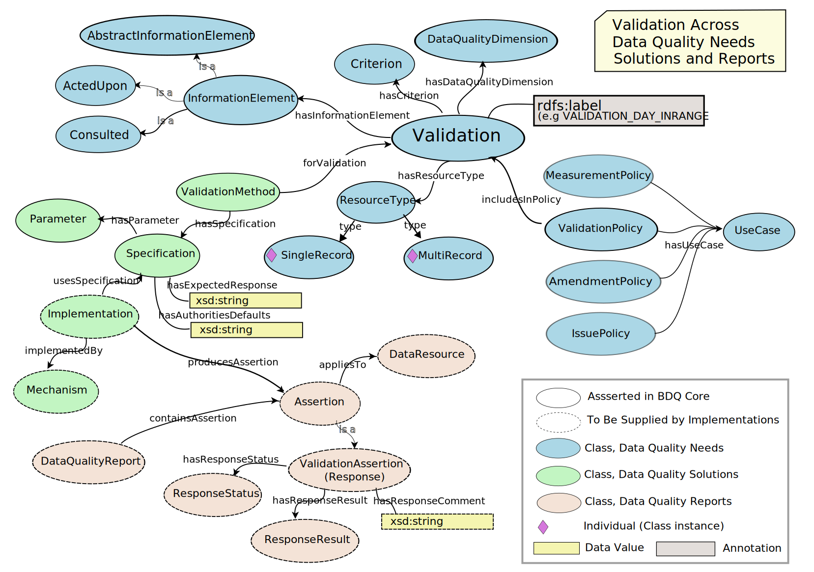

<!--- Template for header, values provided from yaml configuration --->
# {document_title}

Title
: {document_title}

Date version issued
: {ratification_date}

Date created
: {created_date}

Part of TDWG Standard
: <{standard_iri}>

Preferred namespace abbreviation
: {pref_namespace_prefix}

This version
: <{current_iri}{ratification_date}>

Latest version
: <{current_iri}>

{previous_version_slot}

Abstract
: {abstract}

Authors
: {authors}

Creator
: {creator}

Bibliographic citation
: {creator}. {year}. {document_title}. {publisher}. <{current_iri}{ratification_date}>

{comment}

### Table of Contents ###

{toc}

## 1 Introduction

The BDQ Conceptual Framework ontology formally describes the terms and relationships between them for evaluating the quality of biodiversity data. Due to the comprehensiveness of the conceptual framework, it allows different interpretations and manners of using it according to different stakeholders. The Framework also prodives a base for the bdq: and bdqcore: namespace vocabularies. 

The bdqffdq: vocabulary is a specification of a framework for describing data quality.   Each of the tests in the bdqcore: vocabulary in this standard has been designed with this framework and is framed using the terms and concepts from the framework. The framework provides the context for each test, and has shaped decisions made about each test.

The framework considers data to have quality with respect to some specified use.   It provides a means to describe a use of data (bdqffdq:UseCase), and what is needed for some data set to have quality for that use, that is for some data set to be fit for a specified purpose.  The framework explicitly links data quality to use, and allows formal description of means to assure that data are fit for some specified purpose.

This document lists terms used to describe 'data quality' / 'fitness for use' in the context of biodiversity data.  These are based on Veiga AK, Saraiva AM, Chapman AD, Morris PJ, Gendreau C, Schigel D, & Robertson TJ (2017). A conceptual framework for quality assessment and management of biodiversity data. PLOS ONE 12 (6): https://doi.org/10.1371/journal.pone.0178731>, with a few changes for increased clarity.

### 1.1 Documents about the bdqffdq: ontology.

The bdqffdq: vocabulary is an ontology, it includes: 

- A [basic vocabulary](../terms/bdqffdq/index.md)
- Additional axioms that can be found in the [vocabulary extension list](../extension/bdqffdq/index.md) 
- Normative guidance on the use of this ontology is provided in this document.
- The bdqffdq framework ontology is best technically understood as its [Owl Ontology Distribution](../vocabulary/bdqffdq.owl) 

An illustrated guide to the use of the bdqffdq ontology is provided in the [Guide to the bdqffdq: framework](../guide/bdqffdq/index.md) 

### 1.2 Namespace abbreviations

The following namespace abbreviations are used in this document:

| **Prefix**   | **Namespace**                                    | **Note** |
|--------------|--------------------------------------------------|----------|
| bdqffdq      | https://rs.tdwg.org/bdqffdq/terms                | Framework for Describing Data Quality |
| bdqcore      | https://rs.tdwg.org/bdqcore/terms                | Tests described using the bdqffdq Framework |
| bdq          | https://rs.tdwg.org/bdq/terms/                   | Supporting Vocabulary for Data Quality |
| bdqdim       | https://rs.tdwg.org/bdqdim/terms                 | Data Quality Dimension Vocabulary |
| bdqcrit      | https://rs.tdwg.org/bdqcrit/terms                | Data Quality Criteria Vocabulary | 
| bdqenh       | https://rs.tdwg.org/bdqenh/terms                 | Data Quality Enhancement Vocabulary | 
| dc           | https://purl.org/dc/elements/1.1/                | | 
| dcterms      | https://purl.org/dc/elements/1.1/                | |
| dwc          | http://rs.tdwg.org/dwc/terms/                    | Darwin Core |
| dwciri       | http://rs.tdwg.org/dwc/iri/                      | |
| oa           | https://www.w3.org/TR/annotation-vocab/          | |
| skos         | http://www.w3.org/2004/02/skos/core#             | |
| owl          | http://www.w3.org/2002/07/owl#                   | |

### 1.2 Status of the content of this document

Sections 2 and 5 are normative.

Section 3 is non-normative

Section 3.1 lists which which terms in section 4 have normative values and which non-normative.

Other sections of this document are marked as normative or non-normative.

### 1.3 RFC 2119 key words (normative)

The key words "MUST", "MUST NOT", "REQUIRED", "SHALL", "SHALL NOT", "SHOULD", "SHOULD NOT", "RECOMMENDED", "MAY", and "OPTIONAL" in this document are to be interpreted as described in RFC 2119.

### 1.4 Distributions (normative)

| Description | IRI | Download URL |
| ----------- | --- | ------------ |
| Human Readable Term List |  | [https://github.com/tdwg/bdq/blob/master/tg2/\_review/docs/terms/bdqffdq/index.md](../terms/bdqffdq/index.md) | 
| Human Readable Vocabulary Extension |  | [https://github.com/tdwg/bdq/blob/master/tg2/\_review/docs/extension/bdqffdq/index.md](../extension/bdqffdq/index.md) | 
| Owl Ontology | | [https://github.com/tdwg/bdq/blob/master/tg2/\_review/vocabulary/bdqffdq.owl](../vocabulary/bdqffdq.owl) |

### 1.5 Diagram of classes and properties (non-normative) 

The diagram below is intended to help understand the normative statements in section 2 below.

## 2 Use of Terms (normative) 

When not represented as objects, controlled value strings MUST be used as values of bdqffdq:ResponseStatus, and bdqffdq:ResponseResult.

### 2.1 Use of propertiess (normative) 

The bdqffdq:hasUseCase object property SHOULD have an individual with a type that is a subclass of bdqffdq:Policy as its subject.  
The bdqffdq:hasUseCase object property MAY have an individual from the bdq: vocabulary that representa UseCase as its object.  
An axiom types the range of bdqffdq:hasUseCase as a bdqffdq:UseCase.  

User communites MAY provide new use cases, and MAY compose instances that are subtypes of bdqffdq:DataQualityNeed with instances of bdqffdq:Policy subclasses and instances of bdqffdq:UseCase with the object properties bdqffdq:includesInPolicy and bdqffdq:hasUseCase in new ways.  

The bdqffdq:hasDataQualityDimension object property SHOULD have an individual with a type that is a subclass of bdqffdq:DataQualityNeed as its subject and an individual in the bdqdim: vocabulary is its object.  An axiom types the range of bdqffdq:hasDataQualityDimension as a bdqffdq:DataQualityDimension.

The bdqffdq:hasCriterion object property SHOULD have an individual with a type of bdqffdq:Validation as its subject and an individual in the bdqcrit: vocabulary is its object.  

Each individual instance of a bbdqffdq:Validation SHOULD have exactly one bdqffdq:hasDataQualityDimension property and exactly one bdffdq:Criterion property.

## 3 Term Index

### 3.1 Key to Vocabulary Terms

{term_key}

### 3.2 Indexes

<!--- NOTE: The mathematical forumlation of the framework is in the bdqffdq_landing-footer.md document --->
