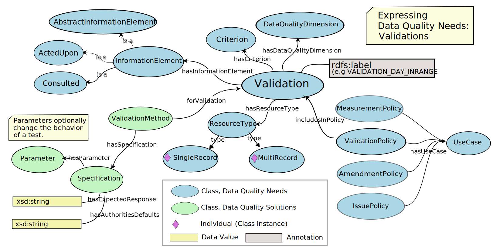
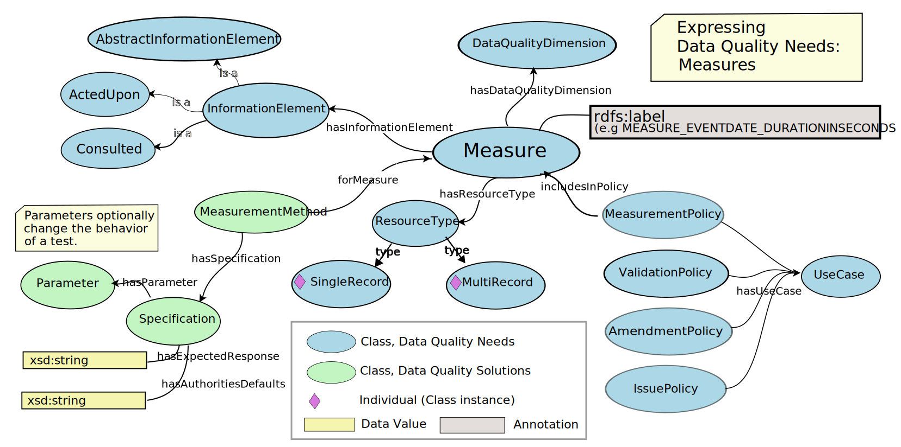
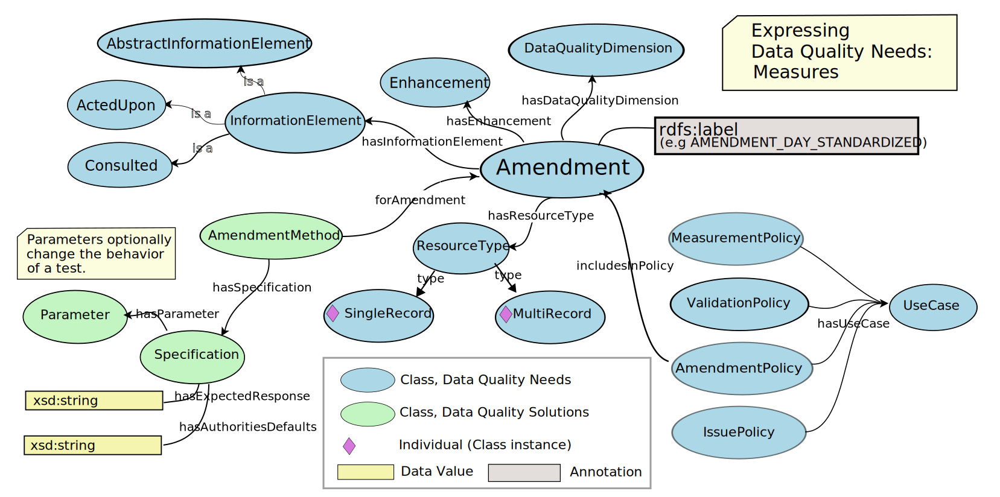
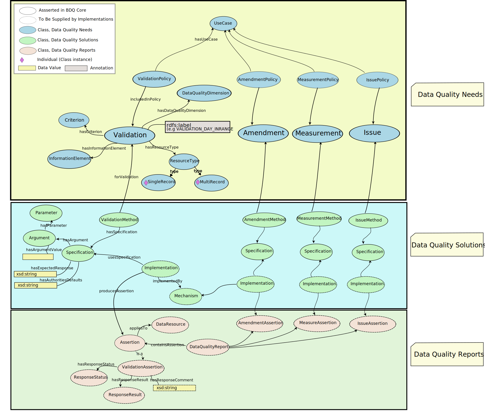

<!--- Template for header, values provided from yaml configuration --->
# {document_title}

Title
: {document_title}

Date version issued
: {ratification_date}

Date created
: {created_date}

Part of TDWG Standard
: <{standard_iri}>

{previous_version_slot}

Abstract
: {abstract}

Authors:
: {authors}

Creator
: {creator}

Bibliographic citation
: {creator}. {year}. {document_title}. {publisher}. <{current_iri}{ratification_date}>

{comment}

### Table of Contents ###

{toc}

## 1 Introduction

The bdqffdq: vocabulary is a specification of a framework for describing data quality.   Each of the tests in the bdqcore: vocabulary has been designed using this framework and is framed in the terms and concepts from the framework.  

The framework considers data to have quality with respect to some specified use.   It provides a means to describe a use of data (bdqffdq:UseCase), and what is needed for some data set to have quality for that use, that is for some data set to be fit for a specified purpose.  The framework explicitly links data quality to use, and allows formal description of means to assure that data are fit for some specified purpose.  

This document describes the use of a set of terms used to describe 'data quality' / 'fitness for use' in the context of biodiversity data.  These terms are based on Veiga AK, Saraiva AM, Chapman AD, Morris PJ, Gendreau C, Schigel D, & Robertson TJ (2017). A conceptual framework for quality assessment and management of biodiversity data. PLOS ONE 12 (6): https://doi.org/10.1371/journal.pone.0178731>, with a few changes for increased clarity.

Purpose
: This is a guide to the use of the bdqffdq: Framework vocabulary.

### 1.1 Target Audience

This document is for those needing a technical understanding of the bdqffdq: Framework vocabulary.

### 1.2 Documents about the bdqffdq: ontology

The bdqffdq: vocabulary is an ontology, it includes: 

- A [landing page](../../bdqffdq/index.md) with normative guidance on the use of this ontology.
- The [term list](../../list/bdqffdq/index.md) document listing just the vocabulary terms in the ontology.
- Additional axioms that can be found in the [vocabulary extension list](../../extension/bdqffdq/index.md) 
- The bdqffdq framework ontology is best technically understood as its [Owl Ontology Distribution](../../../vocabulary/bdqffdq.owl) 

This document provides an illustrated guide to the use of the bdqffdq ontology.

### 1.3 Status of the content of this document

Section 1 is non-normative.

Section 2 is normative.

In Section 4, the values of following terms are normative: Term IRI, Name, Type, Superclass, Definition.

Figures are non-normative.

Other sections of this document are marked as normative or non-normative.

### 1.4 Namespace abbreviations

The following namespace abbreviations are used in this document:

| **Prefix**   | **Namespace**                                    |
|--------------|--------------------------------------------------|
| bdq          | https://rs.tdwg.org/bdq/terms/                   |
| bdqcore      | https://rs.tdwg.org/bdqcore/terms                |
| bdqdim       | https://rs.tdwg.org/bdqdim/terms                 |
| bdqffdq      | https://rs.tdwg.org/bdqffdq/terms                |
| dc           | https://purl.org/dc/elements/1.1/                |
| dcterms      | https://purl.org/dc/elements/1.1/                |
| dwc          | http://rs.tdwg.org/dwc/terms/                    |
| dwciri       | http://rs.tdwg.org/dwc/iri/                      |
| oa           | https://www.w3.org/TR/annotation-vocab/          |
| skos         | http://www.w3.org/2004/02/skos/core#             |
| owl          | http://www.w3.org/2002/07/owl#                   |

## 2 Use of Terms (normative) 

The content of this section is normative.

When not represented as objects, controlled value strings MUST be used as values of bdqffdq:ResponseStatus, and bdqffdq:ResponseResult.

IRIs MUST be use for values for all individual class instances and object properties when using bdqffdq: terms.

### 2.1 RFC 2119 Key words (normative)

The key words "MUST", "MUST NOT", "REQUIRED", "SHALL", "SHALL NOT", "SHOULD", "SHOULD NOT", "RECOMMENDED", "MAY", and "OPTIONAL" in this document are to be interpreted as described in RFC 2119.

### 3 Framework for describing data quality 

#### 3.1 Introduction and Context (non-normative)

The bdqffdq: portion of BDQ Core is a specification for a framework for describing data quality.  This bdqffdq: framework is based on a mathematical formulation, using set theory (Veiga, 2016), and is represented as an owl ontology.  This document describes the organization and use of the owl ontology, and gives a summary of the mathematical formulation.

This document provides a background for understanding the bdqcore: test descriptions.  Each of the tests in the bdqcore: namespace have been designed and described within this framework and are framed using the terms and concepts from the framework.  The bdqffdq: framework provides the context for each test, and has shaped decisions made about each test.  

See the [bdqffdq: landing page](../bdqffdq/index.md) for a concise description and normative information about the bdqffdq: ontology, the [bdqffdq: Term List](../../list/bdqffdq/index.md) for the list of terms in the bdqffdq: vocabulary, the [extension term list](../../extension/bdqffdq/index.md) for documentation additional axioms, and the [owl ontology](../../../vocabulary/bdqffdq.owl) for the formal representation of the vocabulary as an owl ontology.

#### 3.2 Description of the bdqffdq ontology (non-normative) 

The bdqffdq framework describes data quality with respect to some specified use.  It provides a means to describe a use of data, and what is needed for some data set to have quality for that use.  That is, bdqffdq lets users describe how to evaluate if some data set is fit for a specified purpose.  The framework explicitly links data quality to use, and allows formal description of means to assure that data are fit for some specified purpose.  Under the framework, data do not have quality in the abstract, but only can be evaluated for quality with respect to a specified purpose.  The term that purposes and uses of data in bdqffdq is UseCase.  

The framework can be conceptually divided into three horizontal layers or slices: Data Quality Needs, Data Quality Solutions, and Data Quality Reports.  Needs describe what it means for data to have quality for some use, Solutions describe tools to evaluate quality, and Reports are produced by Solutions to describe the evaluation of quality in particular data sets. 

The framework can also be conceptually divided into four vertical themes, four sets of related concepts that carry through the Needs, Solutions, and Reports layers.  These concepts are Measures, Validations, Amendments, and Issues.   

We use the informal term "Test" to describe these four vertical themes, a test involves terms in both Needs and Solutions, and tests produce particular reporting elements.

### 3.2.1 Data Quality Control, Data Quality Assurance

The framework draws a distinction between Quality Control and Quality Assurance.  Quality Control processes seek to assess the quality of data for some purpose, then identify changes to the data or to processes around the data for improving the quality of the data. Quality Assurance processes seek to filter some set of data to a subset that is fit for some purpose, that is to assure that data used for some purpose are fit for that purpose.

### 3.2.2 Information Elements

The framework has an abstract concept of Information Elements. To frame tests on Darwin Core terms in a usable way, we list specific Darwin Core terms as the information elements in each test.

### 3.2.3 Concepts in the framework, Test Types: Measure, Validation, Amendment, Issue.

Vertical slices by concept.

<!--- Ming: Test types: Validation, Amendment, Measure, Issue, repeated in 1.5 --->

The framework defines four central concepts for describing and evaluating data quality needs: Amendments, Measures, Validations, and Issues.  

Validations assess compliance with a need.  Data have quality if they are compliant with the requirements of the validation test.  Validations relate information elements and resource types with a specification of specifically how to assess fitness of the data under some narrow criterion, and themselves are assembled into validations policies, which are linked to other policies to cover a description of the data quality needs of a UseCase.

Issues are the converse of Validations.  Data lack quality if an issue identifies a potential problem in the data that would require further human review to identify if the data have quality for some purpose.  

Measures measure some specific aspect of data quality.

Amendments propose changes to data or processes that, if accepted, may improve the fitness of data for a specific use.

Formally, in the Data Quality Needs level, the framework starts with a Use Case, a framing of some use to which data may be put.  Use cases are related to the formal description of data quality needs through policies and contexts.  Contexts (ContextualizedCriterion, ContextualizedDimension, ContextualizedEnhancement, ContextualizedIssue) relate the specification of a need, such as a Validation, to the information elements that need to be examined, and to the resource type that is operated on.  Each of the tests described in this standard has a formal specification that includes each of these elements.   A Use Case includes a set of policies, policies relate the use case to contexts, contexts link information elements to needs and to resource types, a need specify what properties data must have to have quality.   

Data quality needs can relate to the data quality of single records (bdqffdq:SingleRecord) or of data sets (bdqffdq:MultiRecord).

### 3.4 Data Quality Needs, Data Quality Mechanisms, Data Quality Reports

Needs, mechanisms, and reports can be seen as horizontal slices through the framework (following the illustrations in Viega et al., 2017).

The framework organizes data quality concepts into three areas: Needs, Mechanisms, and Reports.  Data Quality Needs identify a use to which data may be put, and frame a set of requirements that data needs to meet to be fit for that use, and means by which data not fit for that use may be improved.  The tests described in this standard are formal descriptions of data quality needs for CORE purposes.  Data Quality Mechanisms in the framework are formal descriptions of software and other mechanisms that implement tests described in the Needs area.  Data Quality Reports are the results produced by Mechanisms on some set of data.  The tests described in this standard include specifications of assertions to be made in Data Quality Reports.

The framework has an abstract concept of Information Elements. To frame tests on Darwin Core terms in a usable way, we list specific Darwin Core terms as the information elements in each test.

Formally, in the Data Quality Needs level, the framework starts with a Use Case, a framing of some use to which data may be put.  Use cases are related to the formal description of data quality needs through policies and contexts.  Contexts (ContextualizedCriterion, ContextualizedDimension, ContextualizedEnhancement, ContextualizedIssue) relate the specification of a need, such as a Validation, to the information elements that need to be examined, and to the resource type that is operated on.  Each of the tests described in this standard has a formal specification that includes each of these elements.   A Use Case includes a set of policies, policies relate the use case to contexts, contexts link information elements to needs and to resource types, a need specifies what properties data must have to have quality.   

The framework expects that Quality Assurance is provided for through specification of a set of Measures defined to operate on a MultiRecord, and which specify a Response.result of COMPLETE or NOT_COMPLETE.  A MultiRecord Measure may specify that it is COMPLETE if all instances of a SingleRecord Validation are COMPLIANT.  

For Quality Control, MultiRecord Measures may be defined to return a count of Response.result of COMPLIANT for validations, and thus can provide a measure of how fit a data set is for some purpose, and what sort of work would be required to make it fit for that purpose.   

Diagram of the composition of Validation, ValidationMethod, and ValidationAssertion illustrating the Data Quality Needs, Solutions, and Reports layers of bdqffdq, with responsibilities of bdqcore (solid lines), and implementations (dashed lines).

A useful way to think of the framework is to divide it horizontally into Needs, Solutions, and Reports layers, and then track the test concepts verticaly through each layer (see [Figure 3](https://journals.plos.org/plosone/article?id=10.1371/journal.pone.0178731#pone-0178731-g003) in Viega et al., 2017)  Below is a diagram that brings together the horizonal Needs, Solutions, and Reports layers with the vertical test concepts (Validations, Amendments, Measures, Issues), with validation related concepts expanded to show all related entities in bdqffdq.

### 3.5 Responses

The content of this section is non-normative, related normative guidance is in section 3.1 The Response Object (normative) of the implementer's guide.

Assertions are expected to assert Response objects, these will involve, in RDF, a combination of object properties and data properties.

| Concept | bdqffdq Term(s) | Description |
| ------- | ------- | ----------- |
| Response | bdqffdq:Assertion | The report from a single execution of a single test, consisting of a bdq:Response.status, a bdq:Response.result, a bdq:Response.comment, and optionally, a bdq:Response.qualifier.| 
| Response.status | bdqffdq:ResponseStatus, bdqffdq:hasResponseStatus | A metadata element in a bdq:Response indicating whether a particular test (bdqffdq:Validation, bdqffdq:Amendment, bdqffdq:Measure, or bdqffdq:Issue) was able to be performed or not.| 
| Response.result | bdqffdq:ResponseResult, bdqffdq:hasResponseResult, bdqffdq:hasResponseResultValue | The element in a bdq:Response containing the value returned by a test (bdqffdq:Validation, bdqffdq:Amendment, bdqffdq:Measure, or bdqffdq:Issue)|
| Response.comment | bdqffdq:hasResponseComment | A human readable interpretation of the results of the test.|
| Response.qualifier | bdqffdq:ResponseQualifier, bdqffdq:hasResponseQualifier | Additional structured information that qualifies the bdq:Response, intended as an extension point for uncertainty.|

See the bdqcore: landing page section on the [Structure of a Response](../../bdqcore/index.md#21-Structure-of-Response-normative) for further normative guidance on Responses as RDF or as data structures in non-RDF settings.

### 3.6 Organization of the bdqcore classes 

The content of this section is non-normative.

Class diagram 

### 3.7 Example representation of a bdqcore test

The content of this section is non-normative.

Fragment in Turtle describing VALIDATION_COUNTRY_FOUND, composed of a Validation, linking an ActedUpon InformationElement, a Criterion, and the ResourceType SingleRecord, with the Validation linked to a ValidationMethod, and from there a Specification.  Also shown is a ValidationPolicy linking this Validation to a UseCase. 

     <bdqcore:69b2efdc-6269-45a4-aecb-4cb99c2ae134> a <bdqffdq:Validation> ;
         rdfs:comment "Does the value of dwc:country occur in the bdq:sourceAuthority?" ;
         rdfs:label "Does the value of dwc:country occur in the bdq:sourceAuthority? Validation for SingleRecord" ;
         skos:prefLabel "VALIDATION_COUNTRY_FOUND" ;
         <bdqffdq:hasActedUponInformationElement> <urn:uuid:8a2bbe0d-7218-4861-8d70-e4f2108a6dc4> ;
         <bdqffdq:hasCriterion> <bdqcrit:Found> ;
         <bdqffdq:hasDataQualityDimension> <bdqdim:Conformance> ;
         <bdqffdq:hasResourceType> <bdqffdq:SingleRecord> .
     
     <urn:uuid:8a2bbe0d-7218-4861-8d70-e4f2108a6dc4> a <bdqffdq:ActedUpon> ;
         rdfs:label "Information Element ActedUpon dwc:country" ;
         <bdqffdq:composedOf> dwc:country ;
         <skos:prefLabel> "Information Element ActedUpon dwc:country" .
     
     <bdqcrit:Found> a <bdqffdq:Criterion> ;
         rdfs:label "Found" .

     <bdqdim:Conformance> a <bdqffdq:DataQualityDimension> ;
         rdfs:label "Conformance" .     

     <urn:uuid:04cee4e0-0c83-40cc-8de2-e7391f0a97a9> a <bdqffdq:ValidationMethod> ;
         rdfs:label "ValidationMethod: Does the value of dwc:country occur in the bdq:sourceAuthority? Validation for SingleRecord with Specification for: VALIDATION_COUNTRY_FOUND" ;
         skos:prefLabel "ValidationMethod: Does the value of dwc:country occur in the bdq:sourceAuthority? Validation for SingleRecord with Specification for: VALIDATION_COUNTRY_FOUND" ;
         <bdqffdq:forValidation> <bdqcore:69b2efdc-6269-45a4-aecb-4cb99c2ae134> ;
         <bdqffdq:hasSpecification> <urn:uuid:051f6ad7-1a4b-4e6c-8a1d-2af76de24848> .
     
     <urn:uuid:051f6ad7-1a4b-4e6c-8a1d-2af76de24848> a <bdqffdq:Specification> ;
         rdfs:comment "EXTERNAL_PREREQUISITES_NOT_MET if the bdq:sourceAuthority is not available; INTERNAL_PREREQUISITES_NOT_MET if dwc:country is bdq:Empty; COMPLIANT if value of dwc:country is a place type equivalent to administrative entity of \"nation\" in the bdq:sourceAuthority; otherwise NOT_COMPLIANT bdq:sourceAuthority default = \"The Getty Thesaurus of Geographic Names (TGN)\" {[https://www.getty.edu/research/tools/vocabularies/tgn/index.html]}" ;
         rdfs:label "Specification for: VALIDATION_COUNTRY_FOUND" ;
         <bdqffdq:hasAuthoritiesDefaults> "bdq:sourceAuthority default = \"The Getty Thesaurus of Geographic Names (TGN)\" {[https://www.getty.edu/research/tools/vocabularies/tgn/index.html]}" ;
         <bdqffdq:hasExpectedResponse> "EXTERNAL_PREREQUISITES_NOT_MET if the bdq:sourceAuthority is not available; INTERNAL_PREREQUISITES_NOT_MET if dwc:country is bdq:Empty; COMPLIANT if value of dwc:country is a place type equivalent to administrative entity of \"nation\" in the bdq:sourceAuthority; otherwise NOT_COMPLIANT" .
     
     <urn:uuid:0053ca4f-7d45-41ea-912e-c8847bb70142> a <bdqffdq:ValidationPolicy> ;
     	rdfs:label "ValidationPolicy: (65) validations  in UseCase bdq:Record-Management" ;
     	<http://www.w3.org/2004/02/skos/core#prefLabel> "ValidationPolicy: (65) validations  in UseCase bdq:Record-Management" ;
     	<bdqffdq:hasUseCase> <bdqffdq:Record-Management> ;
     	<bdqffdq:includesInPolicy> <bdqcore:01c6dafa-0886-4b7e-9881-2c3018c98bdc> , <bdqcore:0493bcfb-652e-4d17-815b-b0cce0742fbe> , <bdqcore:04b2c8f3-c71b-4e95-8e43-f70374c5fb92> , <bdqcore:06851339-843f-4a43-8422-4e61b9a00e75> , <bdqcore:0949110d-c06b-450e-9649-7c1374d940d1> , <bdqcore:0bb8297d-8f8a-42d2-80c1-558f29efe798> , <bdqcore:125b5493-052d-4a0d-a3e1-ed5bf792689e> , <bdqcore:14da5b87-8304-4b2b-911d-117e3c29e890> , <bdqcore:15f78619-811a-4c6f-997a-a4c7888ad849> , <bdqcore:17f03f1f-f74d-40c0-8071-2927cfc9487b> , <bdqcore:239ec40e-a729-4a8e-ba69-e0bf03ac1c44> , <bdqcore:2750c040-1d4a-4149-99fe-0512785f2d5f> , <bdqcore:2cd6884e-3d14-4476-94f7-1191cfff309b> , <bdqcore:3136236e-04b6-49ea-8b34-a65f25e3aba1> , <bdqcore:3667556d-d8f5-454c-922b-af8af38f613c> , <bdqcore:36ed36c9-b1a7-40b2-b5e2-0d012e772098> , <bdqcore:374b091a-fc90-4791-91e5-c1557c649169> , <bdqcore:3cff4dc4-72e9-4abe-9bf3-8a30f1618432> , <bdqcore:3f1db29a-bfa5-40db-9fd1-fde020d81939> , <bdqcore:3f335517-f442-4b98-b149-1e87ff16de45> , <bdqcore:401bf207-9a55-4dff-88a5-abcd58ad97fa> , <bdqcore:42408a00-bf71-4892-a399-4325e2bc1fb8> , <bdqcore:47ff73ba-0028-4f79-9ce1-ee7008d66498> , <bdqcore:4833a522-12eb-4fe0-b4cf-7f7a337a6048> , <bdqcore:49f1d386-5bed-43ae-bd43-deabf7df64fc> , <bdqcore:4c09f127-737b-4686-82a0-7c8e30841590> , <bdqcore:4daa7986-d9b0-4dd5-ad17-2d7a771ea71a> , <bdqcore:4eb48fdf-7299-4d63-9d08-246902e2857f> , <bdqcore:4f2bf8fd-fc5c-493f-a44c-e7b16153c803> , <bdqcore:5424e933-bee7-4125-839e-d8743ea69f93> , <bdqcore:5618f083-d55a-4ac2-92b5-b9fb227b832f> , <bdqcore:58486cb6-1114-4a8a-ba1e-bd89cfe887e9> , <bdqcore:66269bdd-9271-4e76-b25c-7ab81eebe1d8> , <bdqcore:69b2efdc-6269-45a4-aecb-4cb99c2ae134> , <bdqcore:6ce2b2b4-6afe-4d13-82a0-390d31ade01c> , <bdqcore:6eeac3ed-f691-457f-a42e-eaa9c8a71ce8> , <bdqcore:7af25f1e-a4e2-4ff4-b161-d1f25a5c3e47> , <bdqcore:7bdb13a4-8a51-4ee5-be7f-20693fdb183e> , <bdqcore:7c4b9498-a8d9-4ebb-85f1-9f200c788595> , <bdqcore:7d2485d5-1ba7-4f25-90cb-f4480ff1a275> , <bdqcore:7e0c0418-fe16-4a39-98bd-80e19d95b9d1> , <bdqcore:81cc974d-43cc-4c0f-a5e0-afa23b455aa3> , <bdqcore:853b79a2-b314-44a2-ae46-34a1e7ed85e4> , <bdqcore:85803c7e-2a5a-42e1-b8d3-299a44cafc46> , <bdqcore:88d8598b-3318-483d-9475-a5acf9887404> , <bdqcore:8d787cb5-73e2-4c39-9cd1-67c7361dc02e> , <bdqcore:8f1e6e58-544b-4365-a569-fb781341644e> , <bdqcore:9a39d88c-7eee-46df-b32a-c109f9f81fb8> , <bdqcore:9beb9442-d942-4f42-8b6a-fcea01ee086a> , <bdqcore:ac2b7648-d5f9-48ca-9b07-8ad5879a2536> , <bdqcore:ad0c8855-de69-4843-a80c-a5387d20fbc8> , <bdqcore:b6ecda2a-ce36-437a-b515-3ae94948fe83> , <bdqcore:c09ecbf9-34e3-4f3e-b74a-8796af15e59f> , <bdqcore:c486546c-e6e5-48a7-b286-eba7f5ca56c4> , <bdqcore:c6adf2ea-3051-4498-97f4-4b2f8a105f57> , <bdqcore:c971fe3f-84c1-4636-9f44-b1ec31fd63c7> , <bdqcore:cdaabb0d-a863-49d0-bc0f-738d771acba5> , <bdqcore:d257eb98-27cb-48e5-8d3c-ab9fca4edd11> , <bdqcore:d708526b-6561-438e-aa1a-82cd80b06396> , <bdqcore:dc8aae4b-134f-4d75-8a71-c4186239178e> , <bdqcore:eaad41c5-1d46-4917-a08b-4fd1d7ff5c0f> , <bdqcore:eb4a17f6-6bea-4cdd-93dd-d5a7e9d1eccf> , <bdqcore:f2ce7d55-5b1d-426a-b00e-6d4efe3058ec> , <bdqcore:f51e15a6-a67d-4729-9c28-3766299d2985> , <bdqcore:ff59f77d-71e9-4eb1-aac9-8bd05c50ff70> .
     
     TODO: Add diagram

### 3.8 Cardinality of bdqffdq terms (non-normative)

The content of this section is non-normative, see the [bdqffdq: landing page](../../bdqffdq/index.md) for related normative guidance. 

The expected relationships between classes in bdqffdq can be expressed as cardinality statements.  Selected cardinality statements are given here to provide additional explanatory guidance on how class instances in bdqffdq are expected to be related to each other through object properties.  Examples here are given for terms related to Validations.

Policies are associative entities relating UseCases to DataQualityNeeds

Each UseCase has one to many ValidationPolicies.
Each ValidationPolicy is for one and only one UseCase.
Each ValidationPolicy has one and only Validation included in the Policy.
Each Validation has one to many related ValidationPolicies.

Each Validation has one and only one DataQualityDimension.
Each Validation has one and only one Criterion.
Each Validation has one and only one ActedUpon InformationElement.
Each ActedUpon InformationElement is composedOf one to many concrete information element terms.
Each Validation has zero or one Consulted InformationElement
Each Consulted InformationElement is composedOf one to many concrete information element terms.
Each Validation has one and only one ResourceType.

Methods look like, but are not, associative entities relating DataQualityNeeds to Specifications.

Each Validation has one and only one ValidationMethod.
Each ValidationMethod is for one and only one Validation.
Each ValidationMethod is for one and only one Specification.
Each Specification has one and only one related ValidationMethod.

Each Specification has one and only one hasExpectedResponse.
Each Specification has zero or one hasAuthoritiesDefaults.
Each Specification has zero to many Arguments.
Each Argument has one and only one Parameter.
Each Argument has one and only one hasArgumentValue.

Implementations look like, but are not, associative entities relating Specifications, Mechanisms, and Assertions.

Each Specification is used in zero to many Implementations.
Each Mechanism implements one to many Implementations.
Each Assertion is produced by one and only one Implementation.
Each Implementation uses one and only one Specification.
Each Implementation is implemented by one and only one Mechansism.
Each Implementation produces one to many Assertions.

It is important that the chain of relationships from an instance of a bdqffdq:Assertion to a DataQualityNeed (e.g. an instance of a bdqffdq:Validation) be a chain of one to one relationships.  To identify what test with what parameters made an assertion, it must be possible to follow the chain of relationships from an assertion to a single implementation to a single specification (with zero to many parameters) to a single method to a single DataQualityNeed (e.g. a validation, with one to many information elements).  Multiplicity should only be possible following on through policy to use cases (an assertion may pertain to multiple use cases), or when going from a DataQualityNeed to assertions.  It is expected that an instance of a Validation would produce many instances of ValidationAssertions, each of those ValidationAssertions must be able to be related to the sole Validation that produced it.  

## 4 Term index

{term_index}

## 5 List of Terms with axioms in the bdqffdq ontology (portions normative, see 1.3)

{term_list}

