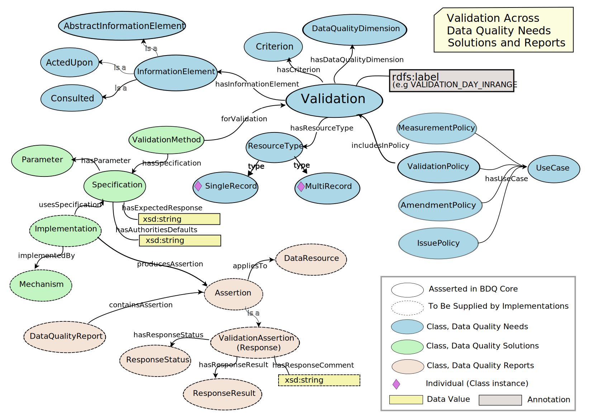

<!--- This file is generated from templates by code, DO NOT EDIT by hand --->
<!--- Template for header, values provided from yaml configuration --->
# Fittness for Use Ontology Landing Page

Title
: Fittness for Use Ontology Landing Page

Date version issued
: 2024-09-10

Date created
: 2024-09-10

Part of TDWG Standard
: <http://example.org/to_be_determined>

Preferred namespace abbreviation
: bdqffdq

This version
: <http://rs.tdwg.org/bdqffdq/2024-09-10>

Latest version
: <http://rs.tdwg.org/bdqffdq/>

{previous_version_slot}

Abstract
: This document is a reference for the (Draft) BDQ Core Standard, forming the landing page for the bdqffdq ontology, describing the ontology, its uses, its vocabulary, and its vocabulary extension.

Authors
: [Lee Belbin](https://orcid.org/0000-0001-8900-6203) ([Blatant Fabrications](https://www.wikidata.org/wiki/Q130304884)), [Arthur D. Chapman](https://orcid.org/0000-0003-1700-6962) ([Australian Biodiversity Information Services](http://www.wikidata.org/entity/Q100600913)), [Paul J. Morris](https://orcid.org/0000-0002-3673-444X) ([Museum of Comparative Zoology, Harvard University](http://www.wikidata.org/entity/Q1420782)), [John Wieczorek](https://orcid.org/0000-0003-1144-0290) ([VertNet](http://www.wikidata.org/entity/Q98382028))

Creator
: TDWG Biodiversity Data Quality Interest Group Task Group 2: Data Quality Tests and Assertions

Bibliographic citation
: TDWG Biodiversity Data Quality Interest Group Task Group 2: Data Quality Tests and Assertions. 2024. Fittness for Use Ontology Landing Page. Biodiversity Information Standards (TDWG). <http://rs.tdwg.org/bdqffdq/2024-09-10>

Draft Standard for Submission

### Table of Contents ###

- [1 Introduction](#1-introduction)
- [1.1 Documents about the bdqffdq: ontology.](#11-documents-about-the-bdqffdq-ontology)
- [1.2 Namespace abbreviations](#12-namespace-abbreviations)
- [1.2 Status of the content of this document](#12-status-of-the-content-of-this-document)
- [1.3 RFC 2119 key words (normative)](#13-rfc-2119-key-words-(normative))
- [1.4 Distributions (normative)](#14-distributions-(normative))
- [1.5 Diagram of classes and properties (non-normative)](#15-diagram-of-classes-and-properties-(non-normative)-)
- [2 Use of Terms (normative)](#2-use-of-terms-(normative)-)
- [2.1 Use of properties (normative)](#21-use-of-properties-(normative)-)
- [2.1.1 Properties relating data quality needs](#211-properties-relating-data-quality-needs)
- [2.1.2 Properties relating data quality needs to data quality solutions](#212-properties-relating-data-quality-needs-to-data-quality-solutions)
- [2.1.3 Properties relating to data quality solutions provided in a test description](#213-properties-relating-to-data-quality-solutions-provided-in-a-test-description)
- [2.1.4 Properties relating to data quality solutions provided by an implementation](#214-properties-relating-to-data-quality-solutions-provided-by-an-implementation)
- [2.1.5 Properties relating data quality reports](#215-properties-relating-data-quality-reports)
- [3 Term Index](#3-term-index)
- [3.1 Key to Vocabulary Terms](#31-key-to-vocabulary-terms)
- [3.2 Indexes](#32-indexes)
- [3.2.1 Alphabetical Index of classes](#321-alphabetical-index-of-classes)
- [3.2.2 Alphabetical Index of object properties](#322-alphabetical-index-of-object-properties)
- [3.2.3 Alphabetical Index of data properties](#323-alphabetical-index-of-data-properties)
- [3.2.4 Alphabetical Index of named individuals](#324-alphabetical-index-of-named-individuals)
- [4 Vocabulary](#4-vocabulary)
- [4.1 Class terms](#41-class-terms)
- [4.2 ObjectProperty terms](#42-objectproperty-terms)
- [4.3 DataProperty terms](#43-dataproperty-terms)
- [4.4 NamedIndividual terms](#44-namedindividual-terms)
- [5 Fitness For Use Framework Summary of Mathematical Formalization (normative)](#5-fitness-for-use-framework-summary-of-mathematical-formalization-(normative)-)

## 1 Introduction

The BDQ Conceptual Framework ontology formally describes the terms and relationships between them for evaluating the quality of biodiversity data. Due to the comprehensiveness of the conceptual framework (Veiga et al. 2017), it allows different interpretations and manners of using it according to different stakeholders. The Framework also prodives a base for the bdq: and bdqcore: namespace vocabularies.

The bdqffdq: vocabulary is a specification of a framework for describing data quality.   Each of the tests in the bdqcore: vocabulary in this standard has been designed with this framework and is framed using the terms and concepts from the framework. The framework provides the context for each test, and has shaped decisions made about each test.

The framework considers data to have quality with respect to some specified use.   It provides a means to describe a use of data (bdqffdq:UseCase), and what is needed for some data set to have quality for that use, that is for some data set to be fit for a specified purpose.  The framework explicitly links data quality to use, and allows formal description of means to assure that data are fit for some specified purpose.

This document lists terms used to describe 'data quality' / 'fitness for use' in the context of biodiversity data.  These are based on Veiga AK, Saraiva AM, Chapman AD, Morris PJ, Gendreau C, Schigel D, & Robertson TJ (2017). A conceptual framework for quality assessment and management of biodiversity data. PLOS ONE 12 (6): https://doi.org/10.1371/journal.pone.0178731>, with a few changes for increased clarity.

### 1.1 Documents about the bdqffdq: ontology.

The bdqffdq: vocabulary is an ontology, it includes: 

- A [term list](../list/bdqffdq/index.md) for the vocabulary, containing just the vocabulary terms.
- Additional axioms that can be found in the [vocabulary extension list](../extension/bdqffdq/index.md) 
- Normative guidance on the use of this ontology is provided in this landing page document.
- The bdqffdq framework ontology is best technically understood as its [Owl Ontology Distribution](../vocabulary/bdqffdq.owl) 

An illustrated guide to the use of the bdqffdq ontology is provided in the [Guide to the bdqffdq: framework](../guide/bdqffdq/index.md) 

### 1.2 Namespace abbreviations

The following namespace abbreviations are used in this document:

| **Prefix**   | **Namespace**                                    | **Note** |
|--------------|--------------------------------------------------|----------|
| bdqffdq      | https://rs.tdwg.org/bdqffdq/terms                | Framework for Describing Data Quality |
| bdqcore      | https://rs.tdwg.org/bdqcore/terms                | Tests described using the bdqffdq Framework |
| bdq          | https://rs.tdwg.org/bdq/terms/                   | Supporting Vocabulary for Data Quality |
| bdqdim       | https://rs.tdwg.org/bdqdim/terms                 | Data Quality Dimension Vocabulary |
| bdqcrit      | https://rs.tdwg.org/bdqcrit/terms                | Data Quality Criteria Vocabulary | 
| bdqenh       | https://rs.tdwg.org/bdqenh/terms                 | Data Quality Enhancement Vocabulary | 
| dc           | https://purl.org/dc/elements/1.1/                | | 
| dcterms      | https://purl.org/dc/elements/1.1/                | |
| dwc          | http://rs.tdwg.org/dwc/terms/                    | Darwin Core |
| dwciri       | http://rs.tdwg.org/dwc/iri/                      | |
| oa           | https://www.w3.org/TR/annotation-vocab/          | |
| skos         | http://www.w3.org/2004/02/skos/core#             | |
| owl          | http://www.w3.org/2002/07/owl#                   | |

### 1.2 Status of the content of this document

Sections 2 and 5 are normative.

Section 3 is non-normative

Section 3.1 lists which which terms in section 4 have normative values and which non-normative.

Other sections of this document are marked as normative or non-normative.

### 1.3 RFC 2119 key words (normative)

The key words "MUST", "MUST NOT", "REQUIRED", "SHALL", "SHALL NOT", "SHOULD", "SHOULD NOT", "RECOMMENDED", "MAY", and "OPTIONAL" in this document are to be interpreted as described in RFC 2119.

### 1.4 Distributions (normative)

| Description | IRI | Download URL |
| ----------- | --- | ------------ |
| Human Readable Term List |  | [https://github.com/tdwg/bdq/blob/master/tg2/\_review/docs/terms/bdqffdq/index.md](../list/bdqffdq/index.md) | 
| Human Readable Vocabulary Extension |  | [https://github.com/tdwg/bdq/blob/master/tg2/\_review/docs/extension/bdqffdq/index.md](../extension/bdqffdq/index.md) | 
| Owl Ontology | | [https://github.com/tdwg/bdq/blob/master/tg2/\_review/vocabulary/bdqffdq.owl](../vocabulary/bdqffdq.owl) |

### 1.5 Diagram of classes and properties (non-normative) 

The diagram below is intended to help understand the normative statements in section 2 below.

The use of classes and properties in [bdqcore:](../../dist/bdqcore.ttl) also follow the normative guidance in section 2 below.

## 2 Use of Terms (normative) 

When not represented as objects, controlled value strings MUST be used as values of bdqffdq:ResponseStatus, and bdqffdq:ResponseResult.

### 2.1 Use of properties (normative) 

This section describes normative expectations for the use of object and datatype properties to related instances of bdqffdq: classes in their intended ways given the open world limited use of domains, ranges, and other axioms in the bdqffdq Framework ontology.  This guidance builds on the normative defintions of bdqffdq: object properties and and datatype properties to describe how bdqffdq terms can be composed in a useful and consistent way.

This guidance describes the use of the bdqffdq: framework terms in an RDF context.  This guidance MAY be used to develop models of the bdqffdq data quality framework in more constrained forms including UML object models, information models, classes in a programing language, or database schemas.  

#### 2.1.1 Properties relating data quality needs

Each description of a data quality test SHOULD include the following properties and related instances.

The bdqffdq:hasUseCase object property SHOULD have an individual with a type that is a subclass of bdqffdq:Policy as its subject.  

The bdqffdq:hasUseCase object property MAY have an individual from the bdq: vocabulary that represents a UseCase as its object.  

An axiom types the range of bdqffdq:hasUseCase as a bdqffdq:UseCase.  

The bdqffdq:includedInPolicy object property SHOULD have an individual that is a subclass of bdqffdq:Policy as its subject.

The bdqffdq:includedInPolicy object property SHOULD have an individual that is a subclass of bdqffdq:DataQualityNeed as its object.

The four subclasses of bdqffdq:DataQualityNeed are bdqffdq:Validation, bdqffdq:Measure, bdqffdq:Amendment, and bdqffdq:Issue.

Each individual that is a subclass of bdqffdq:DataQualityNeed SHOULD have at least one bdqffdq:includedInPolicy relationship to an instance of a subclass of bdqffdq:Policy which is in turn related to an instance of a bdqffdq:UseCase.   

User communites MAY provide new use cases, and MAY compose instances that are subtypes of bdqffdq:DataQualityNeed with instances of bdqffdq:Policy subclasses and instances of bdqffdq:UseCase with the object properties bdqffdq:includesInPolicy and bdqffdq:hasUseCase in new ways.  

Each instance of a subclass of a bdqffdq:DataQualityNeed SHOULD have an rdfs:label in all upper case, with underscores separating components.  Tests that have a bdqffdq:hasResourceType of bdqffdq:SingleRecord SHOULD follow the convention of the subclass of bdqffdq:DataQualityNeed in all upper case as the first word, and a representation of the bdqffdq:AbstractInformationElement as a single word in all upper case as the second word, in the form TESTTYPE_INFORMATIONELEMENT_CRITERIA or TESTTYPE_INFORMATIONELEMENT_ACTION_INFORMATIONELEMENT.  Tests that have a bdqffdq:hasResourceType of bdqffdq:MultiRecord SHOULD have "MULTIRECORD_" as the first element in their rdfs:label, and MAY follow the pattern MULTIRECORD_TESTTYPE_COUNT_RESULT_INFORMATIONELEMENT_CRITERIA, or MULTIRECORD_TESTTYPE_QA_INFORMANTIONELEMENT_CRITERIA.  The rdfs:label of the instance of the subclass of bdqffdq:DataQualityNeed SHOULD be used by humans to identify tests.

Each instance of a subclass of bdqffdq:DataQualityNeed MUST have exactly one bdqffdq:hasResourceType object property linking it to a bdqffdq:SingleRecord or a bsqffdq:MultiRecord.

The bdqffdq:hasCriterion object property SHOULD have an individual with a type that is a bdqffdq:Validation or a bdqffdq:Issue as its subject.

The bdqffdq:hasCriterion object property MAY have an individual from the bdqcrit: vocabulary as its object.

An axiom types the range of bdqffdq:hasCriterion as a bdqffdq:Criterion.

The bdqffdq:hasEnhancement object property SHOULD have an individual with a type that is a bdqffdq:Amendment as its subject.

The bdqffdq:hasEnhancement object property MAY have an individual from the bdqenh: vocabulary as its object.

An axiom types the range of bdqffdq:hasEnhancement as a bdqffdq:Enhancement.

The bdqffdq:hasDataQualityDimension object property SHOULD have an individual with a type that is a subclass of bdqffdq:DataQualityNeed as its subject.

The bdqffdq:hasDataQualityDimension object property MAY have individual in the bdqdim: vocabulary is its object.  

An axiom types the range of bdqffdq:hasDataQualityDimension as a bdqffdq:DataQualityDimension.

Each individual instance of a bbdqffdq:Validation SHOULD have exactly one bdqffdq:hasDataQualityDimension property and exactly one bdffdq:Criterion property.

Each individual instance of a bbdqffdq:Issue SHOULD have exactly one bdqffdq:hasDataQualityDimension property and exactly one bdffdq:Criterion property.

Each individual instance of a bbdqffdq:Amendment SHOULD have exactly one bdqffdq:hasDataQualityDimension property and exactly one bdffdq:Enhancement property.

Each individual instance of a bbdqffdq:Measure SHOULD have exactly one bdqffdq:hasDataQualityDimension property.

A subproperty of the bdqffdq:hasInformationElement object property SHOULD have an individual that is a subclass of bdqffdq:InformationElement as its object.

A subproperty of the bdqffdq:hasInformationElement object property SHOULD have an individual that is a subclass of bdqffdq:DataQualityNeed as its subject.

Each instance of a subclass of bdqffdq:DataQualityNeed SHOULD have exactly one bdqffdq:hasActedUponInformationElement property linking it to a bdqffdq:ActedUpon. 

Each instance of bdqffdq:ActedUpon SHOULD have one to many bdqffdq:composedOf object properties linking it to specific information elements.

Each instance of a subclass of bdqffdq:DataQualityNeed MAY have exactly one bdqffdq:hasConsultedInformationElement property linking it to a bdqffdq:Consulted.

Each instance of bdqffdq:Consulted SHOULD have one to many bdqffdq:composedOf object properties linking it to specific information elements.

Each instance of a subclass of bdqffdq:DataQualityNeed MAY have a bdqffdq:hasInformationElement property linking it to a bdqffdq:AbstractInformationElement.

Each instance of bdqffdq:AbstractInformationElement SHOULD have rdfs:label and rdfs:comment properties describing the scope of the information element with the rdfs:label corresponding to the INFORMATIONELEMENT portion of the rdfs:label for an instance of a subclass of bdqffdq:DataQualityNeed following the convention described in this section.  

#### 2.1.2 Properties relating data quality needs to data quality solutions

Each description of a data quality test SHOULD include the following properties and related instances.

The bdqffdq:forValidation object property SHOULD have have an individual with a type that is a subclass of bdqffdq:ValidationMethod as its subject.

An axiom places an owl:restriction on the object of the bdqffdq:forValidation object property as a bdqffdq:Validation

Each bdqffdq:Validation method SHOULD have exactly one bdqffdq:forValidation object property.

The bdqffdq:forAmendment object property SHOULD have have an individual with a type that is a subclass of bdqffdq:AmendmentMethod as its subject.

An axiom places an owl:restriction on the object of the bdqffdq:forAmendment object property as a bdqffdq:Amendment

Each bdqffdq:Amendment method SHOULD have exactly one bdqffdq:forAmendment object property.

The bdqffdq:forMeasure object property SHOULD have have an individual with a type that is a subclass of bdqffdq:MeasureMethod as its subject.

An axiom places an owl:restriction on the object of the bdqffdq:forMeasure object property as a bdqffdq:Measure

Each bdqffdq:Measure method SHOULD have exactly one bdqffdq:forMeasure object property.

The bdqffdq:forIssue object property SHOULD have have an individual with a type that is a subclass of bdqffdq:IssueMethod as its subject.

An axiom places an owl:restriction on the object of the bdqffdq:forIssue object property as a bdqffdq:Issue

Each bdqffdq:Issue method SHOULD have exactly one bdqffdq:forIssue object property.

#### 2.1.3 Properties relating to data quality solutions provided in a test description

Each description of a data quality test SHOULD include the following properties and related instances.

The bdqffdq:hasSpecification object property SHOULD have an instance of a subclass of bdqffdq:DataQualityMethod as its subject.

An axiom places an owl:restriction on the object of the bdqffdq:hasSpecification object property as a bdqffdq:Specification.

The bdqffdq:hasArgument object property SHOULD have a bdqffdq:Specification as its subject.

An axiom types the object of the bdqffdq:hasArgument object as a bdqffdq:Argument.

An instance of bdqffdq:Argument SHOULD have exactly one bdqffdq:hasArgumentValue data property holding the value of the argument that replaces the bdqffdq:Parameter in the bdqffdq:hasExpectedResponse of the bdqffdq:Specification.  An instance of bdqffdq:Argument SHOULD have exactly one bdqffdq:hasParameter object property that denotes the parameter within the bdqffdq:hasExpectedResponse that is to be replace by the value of the bdqffdq:hasArgumentValue.  An instance of bdqffdq:Argument SHOULD be related to exactly one instance of a bdqffdq:Specification with the bdqffdq:hasArgument object property.

Each instance of a bdqffdq:Specification MAY have zero to many bdqffdq:hasArgument object properties relating it to zero to many bdqffdq:Argument instances.

Each instance of a bdqffdq:Specification with a bdqffdq:hasAuthoritiesDefaults value that references at least one parameter MUST have a corresponding bdqffdq:hasArgument object property.  The related instances bdqffdq:Argument through these bdqffdq:hasArgument object properties SHOULD have appropriate bdqffdq:hasArgumentValue and bdqffdq:hasParameter triples to express the actual and formal parameters for the bdqffdq:Specification instance.

The bdqffdq:hasParameter object property SHOULD have a bdqffdq:Argument as its subject.

An axiom types the object of the bdqffdq:hasParameter object property as a bdqffdq:Parameter.

#### 2.1.4 Properties relating to data quality solutions provided by an implementation

Each data quality mechanism that produces data quality reports using the bdqffdq vocabulary SHOULD include the following properties and related instances.

The bdqffdq:usesSpecification object property SHOULD have a bdqffdq:Implementation as its subject.

An axiom places an owl:restriction on the object of the bdqffdq:usesSpecification object property as a bdqffdq:Specification.

**Review direction and cardinality, these don't seem right** Need competency question.

Each bdqffdq:Implementation MAY have zero to many bdqffdq:usesSpecification object properties.

The bdqffdq:implementedBy object property SHOULD have a bdqffdq:Implementation as its subject.

An axiom places an owl:restriction on the object of the bdqffdq:implementedBy object property as a bdqffdq:Mechanism.

Each bdqffdq:Implementation SHOULD have a bdqffdq:implementedBy object property.

A bdqffdq:Implementation MAY have more than one bdqffdq:implementedBy object property.

#### 2.1.5 Properties relating data quality reports

Each data quality mechanism that produces data quality reports using the bdqffdq vocabulary SHOULD include the following properties and related instances.

Nothing in this section is to be construed as relaxing the normative statements in the users guide and implementers guid concering the expression of data quality responses in forms other than RDF.  Each data quality mechanism MUST produce results coresponding to bdqffdq:Assertions with bdqffdq:hasResponseStatus, bdqffdq:hasResponseResult, and bdqffdq:hasResponseComment as specfied in those guides.   

The bdqffdq:producesAssertion object property SHOULD have a bdqffdq:Implementation as its subject.

The bdqffdq:producesAssertion object property SHOULD have a bdqffdq:Assertion as its object.

## 3 Term Index

### 3.1 Key to Vocabulary Terms

| Label | Term | Definition | Example | Normative | 
| ----- | ---- | ---------- | ------- | --------- |
| Term Version IRI | rdf:about |  | https://rs.tdwg.org/bdqffdq/terms/AbstractInformationElement | normative |
| Term IRI | dcterms:isVersionOf |  | https://rs.tdwg.org/bdqffdq/terms/AbstractInformationElement | normative |
| Name | rdf:value |  | https://rs.tdwg.org/bdqffdq/terms/AbstractInformationElement | normative |
| Preferred Label | skos:prefLabel | The preferred lexical label for a resource, in a given language. | Abstract Information Element | non-normative |
| Comments | rdfs:comment |  | Information elements such as DATE and DAY are abstract, they could reference any representation of those concepts.  In contrast, dwc:eventDate and dwc:day can be linked to concrete Acted Upon or Consulted information elements. | non-normative |
| Definition | skos:definition | A statement or formal explanation of the meaning of a concept. | An InformationElement described in abstract terms and not linked with one or more concrete terms. | normative |
| Type | rdf:type |  | http://www.w3.org/2002/07/owl#Class | normative |
| SubClass Of | rdfs:subClassOf |  | https://rs.tdwg.org/bdqffdq/terms/InformationElement | normative |

### 3.2 Indexes
<!--- NOTE: The mathematical forumlation of the framework is in the bdqffdq_landing-footer.md document --->

- [Classes](#41-Class-terms)
- [Object Properties](#42-ObjectProperty-terms)
- [Data Properties](#43-DataProperty-terms)
- [Named Individuals](#44-NamedIndividual-terms)

#### 3.2.1 Alphabetical Index of classes

[AbstractInformationElement](#AbstractInformationElement)
[ActedUpon](#ActedUpon)
[Amendment](#Amendment)
[AmendmentAssertion](#AmendmentAssertion)
[AmendmentConcept](#AmendmentConcept)
[AmendmentMethod](#AmendmentMethod)
[AmendmentPolicy](#AmendmentPolicy)
[Argument](#Argument)
[Assertion](#Assertion)
[Consulted](#Consulted)
[Criterion](#Criterion)
[DataQualityDimension](#DataQualityDimension)
[DataQualityMethod](#DataQualityMethod)
[DataQualityNeed](#DataQualityNeed)
[DataQualityProfile](#DataQualityProfile)
[DataQualityReport](#DataQualityReport)
[DataResource](#DataResource)
[Enhancement](#Enhancement)
[FundamentalConcept](#FundamentalConcept)
[Implementation](#Implementation)
[ImprovementTarget](#ImprovementTarget)
[InformationElement](#InformationElement)
[Issue](#Issue)
[IssueAssertion](#IssueAssertion)
[IssueConcept](#IssueConcept)
[IssueMethod](#IssueMethod)
[IssuePolicy](#IssuePolicy)
[Measure](#Measure)
[MeasurementAssertion](#MeasurementAssertion)
[MeasurementMethod](#MeasurementMethod)
[MeasurementPolicy](#MeasurementPolicy)
[MeaurementConcept](#MeaurementConcept)
[Mechanism](#Mechanism)
[NeedConcept](#NeedConcept)
[Parameter](#Parameter)
[Policy](#Policy)
[ReportConcept](#ReportConcept)
[ResourceType](#ResourceType)
[ResponseQualifier](#ResponseQualifier)
[ResponseResult](#ResponseResult)
[ResponseStatus](#ResponseStatus)
[SolutionsConcept](#SolutionsConcept)
[Specification](#Specification)
[UseCase](#UseCase)
[Validation](#Validation)
[ValidationAssertion](#ValidationAssertion)
[ValidationConcept](#ValidationConcept)
[ValidationMethod](#ValidationMethod)
[ValidationPolicy](#ValidationPolicy)
#### 3.2.2 Alphabetical Index of object properties

[amendmentProperty](#amendmentProperty)
[appliesTo](#appliesTo)
[composedOf](#composedOf)
[containsAssertion](#containsAssertion)
[forAmendment](#forAmendment)
[forDataQualityNeed](#forDataQualityNeed)
[forIssue](#forIssue)
[forMeasure](#forMeasure)
[forValidation](#forValidation)
[hasActedUponInformationElement](#hasActedUponInformationElement)
[hasArgument](#hasArgument)
[hasConsultedInformationElement](#hasConsultedInformationElement)
[hasCriterion](#hasCriterion)
[hasDataQualityDimension](#hasDataQualityDimension)
[hasEnhancement](#hasEnhancement)
[hasInformationElement](#hasInformationElement)
[hasParameter](#hasParameter)
[hasResourceType](#hasResourceType)
[hasResponseQualifier](#hasResponseQualifier)
[hasResponseResult](#hasResponseResult)
[hasResponseStatus](#hasResponseStatus)
[hasSpecification](#hasSpecification)
[hasUseCase](#hasUseCase)
[implementedBy](#implementedBy)
[improvedBy](#improvedBy)
[includedInPolicy](#includedInPolicy)
[issueProperty](#issueProperty)
[measurementProperty](#measurementProperty)
[producesAssertion](#producesAssertion)
[reportProperty](#reportProperty)
[targetedIssue](#targetedIssue)
[targetedMeasure](#targetedMeasure)
[targetedValidation](#targetedValidation)
[usesSpecification](#usesSpecification)
[validationProperty](#validationProperty)
#### 3.2.3 Alphabetical Index of data properties

[hasArgumentValue](#hasArgumentValue)
[hasAuthoritiesDefaults](#hasAuthoritiesDefaults)
[hasExpectedResponse](#hasExpectedResponse)
[hasResponseComment](#hasResponseComment)
[hasResponseResultValue](#hasResponseResultValue)
#### 3.2.4 Alphabetical Index of named individuals

[AMENDED](#AMENDED)
[COMPLETE](#COMPLETE)
[COMPLIANT](#COMPLIANT)
[EXTERNAL_PREREQUISITES_NOT_MET](#EXTERNAL_PREREQUISITES_NOT_MET)
[FILLED_IN](#FILLED_IN)
[INTERNAL_PREREQUISITES_NOT_MET](#INTERNAL_PREREQUISITES_NOT_MET)
[IS_ISSUE](#IS_ISSUE)
[MultiRecord](#MultiRecord)
[NOT_AMENDED](#NOT_AMENDED)
[NOT_COMPLETE](#NOT_COMPLETE)
[NOT_COMPLIANT](#NOT_COMPLIANT)
[NOT_ISSUE](#NOT_ISSUE)
[POTENTIAL_ISSUE](#POTENTIAL_ISSUE)
[RUN_HAS_RESULT](#RUN_HAS_RESULT)
[SingleRecord](#SingleRecord)

## 4 Vocabulary

### 4.1 Class terms
### AbstractInformationElement

- Name: [bdqffdq:AbstractInformationElement](https://rs.tdwg.org/bdqffdq/terms/AbstractInformationElement)
- Preferred Label: Abstract Information Element
- Definition: An InformationElement described in abstract terms and not linked with one or more concrete terms.
- SubClass Of: InformationElement
- Comments: Information elements such as DATE and DAY are abstract, they could reference any representation of those concepts.  In contrast, dwc:eventDate and dwc:day can be linked to concrete Acted Upon or Consulted information elements.
- View in: [term-list](../docs/list/bdqffdq/index.md#bdqffdq:AbstractInformationElement)

********************

### ActedUpon

- Name: [bdqffdq:ActedUpon](https://rs.tdwg.org/bdqffdq/terms/ActedUpon)
- Preferred Label: Acted Upon
- Definition: An information element, expressed in concrete terms, about which a data quality need expresses assertions about the data quality in that element.
- SubClass Of: InformationElement
- Comments: An information element to which a Result applies.
- View in: [term-list](../docs/list/bdqffdq/index.md#bdqffdq:ActedUpon)

********************

### Amendment

- Name: [bdqffdq:Amendment](https://rs.tdwg.org/bdqffdq/terms/Amendment)
- Preferred Label: Amendment
- Definition: A data quality need that expresses how proposals may be made to improve the fitness for use of data.
- SubClass Of: AmendmentConcept; DataQualityNeed
- Comments: ContextualizedEnhacement in the original framework.   Describes an instance of the enhancement concept in the context of the associated information elements from some controlled vocabulary (fields ActedUpon or Consulted), and a ResourceType of SingleRecord or MultiRecord.    
Describes a proposal for enhancement of original data, which if accepted, would improve the quality of the data for some use. For example: Recommends valid value for taxon name in a single record.    
Amendments may describe proposed changes to data values, or proposed changes to processes for the production and manipulation of data, for example an Amendment on a SingleRecord may provide criteria for proposing that latitude and longitude are transposed in that record, or a similar Amendment on a MultiRecord may provide critera for proposing that all latitudes and longitudes from some data source have been transposed, and the mapping of data values to transport terms should be changed.    
An Amendment is the data quality needs concept that parallels an AmendmentMethod at the solutions level, and an AmendmentAssertion at the report level.     
AM = { am | am = < ie, e, rt >, ie ∈ IE, e ∈ E ⋀ rt ∈ RT }
- View in: [term-list](../docs/list/bdqffdq/index.md#bdqffdq:Amendment)

********************

### AmendmentAssertion

- Name: [bdqffdq:AmendmentAssertion](https://rs.tdwg.org/bdqffdq/terms/AmendmentAssertion)
- Preferred Label: Amendment Assertion
- Definition: An assertion expressing the result of an implementation evaluating an amendment supporting a particular data quality need to improve a particular data resource.
- SubClass Of: AmendmentConcept; Assertion
- Comments: The Amendment assertion type is a report level concept that describes the results of the execution of of a test that performs an AmendmentMethod following some Specification to propose changes based on some Amendment.   
An Amendment concept in bdqffdq is expected to carry a ResponseStatus result that includes a status FILLED_IN, AMENDED, as well as a ResponseResult that asserts proposed changes to values from the original data.  
DQA(dr) = {dqa | dqa = < am, s, m, r >, am ∈ AM, s ∈ S, m ∈ M , r ∈ R ⋀ dr ∈ DR}
- View in: [term-list](../docs/list/bdqffdq/index.md#bdqffdq:AmendmentAssertion)

********************

### AmendmentMethod

- Name: [bdqffdq:AmendmentMethod](https://rs.tdwg.org/bdqffdq/terms/AmendmentMethod)
- Preferred Label: Amendment Method
- Definition: A data quality solution concept that relates an Amendment to its Specifications.
- SubClass Of: AmendmentConcept; DataQualityMethod
- Comments: The AmendmentMethod in bdqffdq is a DQ Solutions level concept describing the relationship between a Specification (technical description of a test) and an Amendment (an enhancement in the context of resource type (SingleRecord or MultiRecord) and associated information elements).  
EM(am) = {s | s ⊂ S ⋀ am ∈ AM}
- View in: [term-list](../docs/list/bdqffdq/index.md#bdqffdq:AmendmentMethod)

********************

### AmendmentPolicy

- Name: [bdqffdq:AmendmentPolicy](https://rs.tdwg.org/bdqffdq/terms/AmendmentPolicy)
- Preferred Label: Amendment Policy
- Definition: A need concept that relates a UseCase to a set of supporting Amendments.
- SubClass Of: AmendmentConcept; Policy
- Comments: A Data Quality needs level concept that describes how some Amendment relates to a UseCase. This relationship defines which amendments are supported by a given UseCase.  
EP(u) = {am | am ⊂ AM ⋀ u ∈ U }
- View in: [term-list](../docs/list/bdqffdq/index.md#bdqffdq:AmendmentPolicy)

********************

### Argument

- Name: [bdqffdq:Argument](https://rs.tdwg.org/bdqffdq/terms/Argument)
- Preferred Label: Argument
- Definition: A value that, when provided to a test Specification to replace a Parameter changes the behavior of the test in a defined manner.
- SubClass Of: SolutionsConcept
- Comments: The argument is an Actual Parameter, for which a Parameter is the corresponding Formal Parameter.  An extension to the original fitness for use framework as described in Veiga et al., 2017.
- View in: [term-list](../docs/list/bdqffdq/index.md#bdqffdq:Argument)

********************

### Assertion

- Name: [bdqffdq:Assertion](https://rs.tdwg.org/bdqffdq/terms/Assertion)
- Preferred Label: Assertion
- Definition: A report concept expressing a statement about data quality assertion following some Specification produced by some implementation pertaining to some data resource.
- SubClass Of: ReportConcept
- Comments: The Assertion type in bdqffdq is the fundamental concept that makes up a data quality report. Assertion can be any one of four types (represented as subClasses), Measure, Validation, Issue, and Amendement.  The assertion concept consists of a Specification (the technical description of a performed test), a data resource (initial values of input data expressed in terms of some controlled vocabulary), the mechanism (external service, actor, or code that performs the test), and some form of result.
- View in: [term-list](../docs/list/bdqffdq/index.md#bdqffdq:Assertion)

********************

### Consulted

- Name: [bdqffdq:Consulted](https://rs.tdwg.org/bdqffdq/terms/Consulted)
- Preferred Label: Acted Upon
- Definition: An information element, expressed in concrete terms, about which a data quality need examines in order to expresses assertions about the data quality in another Information Element.
- SubClass Of: InformationElement
- Comments: An Information Element the content of which is examined to assert a result on one or more other Information Elements.
- View in: [term-list](../docs/list/bdqffdq/index.md#bdqffdq:Consulted)

********************

### Criterion

- Name: [bdqffdq:Criterion](https://rs.tdwg.org/bdqffdq/terms/Criterion)
- Preferred Label: Criterion
- Definition: Rule against which data are evaluated for conformance to quality criteria.
- SubClass Of: FundamentalConcept; NeedConcept
- Comments: General statement, for example: In a controlled vocabulary.  Composed with both Validations and Issues.
- View in: [term-list](../docs/list/bdqffdq/index.md#bdqffdq:Criterion)

********************

### DataQualityDimension

- Name: [bdqffdq:DataQualityDimension](https://rs.tdwg.org/bdqffdq/terms/DataQualityDimension)
- Preferred Label: Data Quality Dimension
- Definition: An aspect of data quality.
- SubClass Of: FundamentalConcept; NeedConcept
- Comments: Describes the aspect of data quality (accuracy, precision, completeness, etc.) that a test examines. For example, [precision] in [coordinate precision of single records].  In the original framework only related to Measures, here may be related to any DataQualityNeed.
- View in: [term-list](../docs/list/bdqffdq/index.md#bdqffdq:DataQualityDimension)

********************

### DataQualityMethod

- Name: [bdqffdq:DataQualityMethod](https://rs.tdwg.org/bdqffdq/terms/DataQualityMethod)
- Preferred Label: Data Quality Method
- Definition: A solutions concept that relates a data quality need to a Specification.
- SubClass Of: SolutionsConcept
- Comments: DataQualityMethods are associative entities that allow Specifications or data quality tests to be reused by supporting a many to many relationship between the two.
- View in: [term-list](../docs/list/bdqffdq/index.md#bdqffdq:DataQualityMethod)

********************

### DataQualityNeed

- Name: [bdqffdq:DataQualityNeed](https://rs.tdwg.org/bdqffdq/terms/DataQualityNeed)
- Preferred Label: Data Quality Need
- Definition: A data quality need concept that expresses what assertions may be made about data with respect to fitness for use.
- SubClass Of: NeedConcept
- Comments: Subtypes of DataQualityNeed are the Test Types.  Data Quality Need appoximates the informal concept of Test as used in BDQ Core.
- View in: [term-list](../docs/list/bdqffdq/index.md#bdqffdq:DataQualityNeed)

********************

### DataQualityProfile

- Name: [bdqffdq:DataQualityProfile](https://rs.tdwg.org/bdqffdq/terms/DataQualityProfile)
- Preferred Label: Data Quality Profile
- Definition: A needs concept expressing the composition of Policies to satisfy a UseCase.
- SubClass Of: NeedConcept
- Comments: Profile in bdqffdq is a data quality Needs level concept describing the UseCases that make up some data quality operation such as the behavior of a single actor or workflow producing the relevant assertions.    
DQP (u) = {dqp | dqp = mp(u) ⋃ vp(u) ⋃ ep(u), mp ∈ MP , vp ∈ VP , ep ∈ EP ⋀ u ∈ U }
- View in: [term-list](../docs/list/bdqffdq/index.md#bdqffdq:DataQualityProfile)

********************

### DataQualityReport

- Name: [bdqffdq:DataQualityReport](https://rs.tdwg.org/bdqffdq/terms/DataQualityReport)
- Preferred Label: Data Quality Report
- Definition: A report concept comprising a set of data quality assertions.
- SubClass Of: ReportConcept
- Comments: The DataQualityReport concept consists of a set of assertions (MeasureAssertions, ValidationAssertions, IssueAssertions and AmendmentAssertions) that represent the output of a workflow/actor run.  These assertions form an account of the fitness for use of a tested data set for a specified use, as produced by a Mechanism.
- View in: [term-list](../docs/list/bdqffdq/index.md#bdqffdq:DataQualityReport)

********************

### DataResource

- Name: [bdqffdq:DataResource](https://rs.tdwg.org/bdqffdq/terms/DataResource)
- Preferred Label: Data Resource
- Definition: A thing to whch a data quality assertion applies.
- SubClass Of: ReportConcept
- Comments: Describes a data resource containing terms from a controlled vocabulary such as (dwc) that can be related to information elements and represents the original values of the data operated on by an assertion test (i.e. an instance of dwc:Occurrence).  Ideally, DataResources have persistent GUIDs.  
A data resource could be the oa:target of a oa:Annotation of which an Assertion is the oa:body.  
DR = { dr | dr = < id, rt, v >, id ∈ I D, rt ∈ RT , (rt = sr ⋁ rt = ds) ⋀ v ∈ V }
- View in: [term-list](../docs/list/bdqffdq/index.md#bdqffdq:DataResource)

********************

### Enhancement

- Name: [bdqffdq:Enhancement](https://rs.tdwg.org/bdqffdq/terms/Enhancement)
- Preferred Label: Enhancement
- Definition: Description of a means by which data could be improved.
- SubClass Of: AmendmentConcept; FundamentalConcept; NeedConcept
- Comments: General statement, for example: Recommend replacement value from a controlled vocabulary.
- View in: [term-list](../docs/list/bdqffdq/index.md#bdqffdq:Enhancement)

********************

### FundamentalConcept

- Name: [bdqffdq:FundamentalConcept](https://rs.tdwg.org/bdqffdq/terms/FundamentalConcept)
- Preferred Label: Fundamental Concept
- Definition: Category of fitness for use concepts that are not derived by composition with other concepts.
- Comments: Contrast with derived concepts, which are compositions of two or more fundamental concepts.  See Veiga et al., 2017.   Derived concepts can be organized by test type into AmendmentConcept, ValidationConcept, MeasurementConcept or IssueConcept.  Derived concepts can also be organized by framework layer into NeedsConcept, SolutionsConcept, and ReportConcept.
- View in: [term-list](../docs/list/bdqffdq/index.md#bdqffdq:FundamentalConcept)

********************

### Implementation

- Name: [bdqffdq:Implementation](https://rs.tdwg.org/bdqffdq/terms/Implementation)
- Preferred Label: Implementation
- Definition: A solutions concept that describes the portion of a Mechanism that carries out the proccess described in a particular Specification.
- SubClass Of: SolutionsConcept
- Comments: The bdqffdq derived concept of an Implementation describes the relationship between a Specification (technical description of a test) and the mechanism that implements it.  
I (s) = {m | m ⊂ M ⋀ s ∈ S}
- View in: [term-list](../docs/list/bdqffdq/index.md#bdqffdq:Implementation)

********************

### ImprovementTarget

- Name: [bdqffdq:ImprovementTarget](https://rs.tdwg.org/bdqffdq/terms/ImprovementTarget)
- Preferred Label: Improvement Target
- Definition: A specific data quality need for which a specific Amendment is intended to improve.
- SubClass Of: NeedConcept
- Comments: The ImprovementTarget concept in bdqffdq describes which measures, issues, and validations are improved by some amendment. ImprovementTarget includes relationships between an Amendment and one or more Validations or Measures.  
IT(am) = {me ⋃ va | me ∈ ME, va ∈ VA ⋀ am ∈ AM}
- View in: [term-list](../docs/list/bdqffdq/index.md#bdqffdq:ImprovementTarget)

********************

### InformationElement

- Name: [bdqffdq:InformationElement](https://rs.tdwg.org/bdqffdq/terms/InformationElement)
- Preferred Label: Information Element
- Definition: A portion of data with which a Data Quality Need is concerned.
- SubClass Of: FundamentalConcept
- Comments: An information element identifies a portion of data to which a test pertains.  The information element in bdqffdq can be represented as a single or composite element that consists of one or more terms from a controlled vocabulary (fields actedUpon or consulted by an assertion test) that identifies concepts in data relevant to a UseCase.  An abstraction or a concrete term that represents relevant content (e.g., coordinates; dwc.decimalLatitude, dwc:decimalLongitude).
- View in: [term-list](../docs/list/bdqffdq/index.md#bdqffdq:InformationElement)

********************

### Issue

- Name: [bdqffdq:Issue](https://rs.tdwg.org/bdqffdq/terms/Issue)
- Preferred Label: Issue
- Definition: A data quality need that expresses how quality problems may be identified in data.
- SubClass Of: DataQualityNeed; IssueConcept
- Comments: Added to the original framework.  Inverse of Contextualized Criterion in the original framework.  Describes an instance of the issue concept in terms of the associated information elements from some controlled vocabulary (fields actedUpon or consulted), and a resource type of SingleRecord or MultiRecord.  Describes criteria by which data which lack quality for some purpose may be identified.  An issue is phrased in a negative sense, and approximates an inverse of a Validation.  An Issue identifies data that lack or may lack quality.  An Issue may flag a POTENTIAL_ISSUE that would need further review to determine if the data have quality for some purpose,  If the conditions described by an issue are identified by a test, the Problem Assertion result will be either IS_ISSUE or POTENTIAL_ISSUE, if no issue is found with the data the result will be NOT_ISSUE.  NOT_ISSUE, unlike COMPLIANT for a Validation, does not assert that data are fit for some purpose.    An Issue is the data quality needs concept that parallels a IssueMethod at the solutions level, and a IssueAssertion at the report level.     
IS = { is | is = < ie, c, rt >, ie ∈ IE, c ∈ ∁C ⋀ rt ∈ RT }
- View in: [term-list](../docs/list/bdqffdq/index.md#bdqffdq:Issue)

********************

### IssueAssertion

- Name: [bdqffdq:IssueAssertion](https://rs.tdwg.org/bdqffdq/terms/IssueAssertion)
- Preferred Label: Issue Assertion
- Definition: An assertion expressing the result of an implementation evaluating an issue for a particular data quality need in a particular data resource.
- SubClass Of: Assertion; IssueConcept
- Comments: The data quality report concept describing a the result of a test in the negative, that is identifying the potential absence of data quality.   
If a problem was found the ResponseResult is expected to carry a a value of IS_ISSUE, if a potential problem was found that needs human review the ResponseResult is expected to be of POTENTIAL_ISSUE, otherwise if the ResponseStatus is RUN_HAS_RESULT,  the ResponseResult is expected to be NOT_ISSUE.
- View in: [term-list](../docs/list/bdqffdq/index.md#bdqffdq:IssueAssertion)

********************

### IssueConcept

- Name: [bdqffdq:IssueConcept](https://rs.tdwg.org/bdqffdq/terms/IssueConcept)
- Preferred Label: Issue Concept
- Definition: A term involved in flagging problems or potential problems in assessment of data quality that would or might prevent the data from meeting expressed data quality needs.
- Comments: Issue terms are expressed in a negative sense, they identify data that do not or may not conform to quality needs.
- View in: [term-list](../docs/list/bdqffdq/index.md#bdqffdq:IssueConcept)

********************

### IssueMethod

- Name: [bdqffdq:IssueMethod](https://rs.tdwg.org/bdqffdq/terms/IssueMethod)
- Preferred Label: Issue Method
- Definition: A data quality solution concept that relates an Issue to its Specifications.
- SubClass Of: DataQualityMethod; IssueConcept
- Comments: The IssueMethod in bdqffdq is a data quality Solutions level concept describing the relationship between a Specification (technical description of a test) and an Issue (a Criterion in the context of resource type (SingleRecord or MultiRecord) and associated information elements).
- View in: [term-list](../docs/list/bdqffdq/index.md#bdqffdq:IssueMethod)

********************

### IssuePolicy

- Name: [bdqffdq:IssuePolicy](https://rs.tdwg.org/bdqffdq/terms/IssuePolicy)
- Preferred Label: Issue Policy
- Definition: A need concept that relates a UseCase to a set of supporting Issues.
- SubClass Of: IssueConcept; Policy
- Comments: The IssuePolicy in bdqffdq is a data quality Needs level concept that describes how some Issue relates to a UseCase. This relationship defines which Issues are supported by a given UseCase.
- View in: [term-list](../docs/list/bdqffdq/index.md#bdqffdq:IssuePolicy)

********************

### Measure

- Name: [bdqffdq:Measure](https://rs.tdwg.org/bdqffdq/terms/Measure)
- Preferred Label: Measure
- Definition: A data quality need that expresses how the fitness of data for some use may be measured.
- SubClass Of: DataQualityNeed; MeaurementConcept
- Comments: Contextualized Dimension in the original framework Describes an instance of the measure concept in terms of the associated information elements from some controlled vocabulary (fields ActedUpon or Consulted), and a ResourceType of SingleRecord or MultiRecord.   
Describes the criteria for measuring an aspect of data quality related to some data quality need.   May be criteria for determining that data are COMPLETE or NOT_COMPLETE, or may be criteria for asserting a numeric measurement.  COMPLETE or NOT_COMPLETE measures are fundamental to data quality control, as set of data are filtered to the subset of data that have quality for some need if all records are COMPLETE for all pertenent Measures.   
A Measure is the data quality needs concept that parallels a MeasurementMethod at the solutions level, and a MeasurementAssertion at the report level.  
ME = { me | me =< ie, d, rt >, ie ∈ IE, d ∈ D ⋀ rt ∈ RT }  
also acceptable measure  
AM(me) = {va | me ∈ C D ⋀ va ⊂ C C}
- View in: [term-list](../docs/list/bdqffdq/index.md#bdqffdq:Measure)

********************

### MeasurementAssertion

- Name: [bdqffdq:MeasurementAssertion](https://rs.tdwg.org/bdqffdq/terms/MeasurementAssertion)
- Preferred Label: Measurement Assertion
- Definition: An assertion expressing the result of an implementation measuring a particular data quality need in a particular data resource.
- SubClass Of: Assertion; MeaurementConcept
- Comments: The MeasurementAssertion is a report level concept that describes the results of the execution of of a test that performs a MeasurementMethod following some Specification to assess some data quality Measurement.   
In bdqffdq, the MeasurementAssertion is expected to carry a ResponseResult of COMPLETE or NOT_COMPLETE or a numeric measured value value (e.g. a measure of dwc:eventDate duration in seconds).  
DQM(dr) = {dqm | dqm =< me, s, m, r >, me ∈ ME, s ∈ S, m ∈ M , r ∈ R ⋀ dr ∈ DR}
- View in: [term-list](../docs/list/bdqffdq/index.md#bdqffdq:MeasurementAssertion)

********************

### MeasurementMethod

- Name: [bdqffdq:MeasurementMethod](https://rs.tdwg.org/bdqffdq/terms/MeasurementMethod)
- Preferred Label: Measurement Method
- Definition: A data quality solution concept that relates a Measure to its Specifications.
- SubClass Of: DataQualityMethod; MeaurementConcept
- Comments: The MeasurementMethod in bdqffdq is a data quality Solutions level concept describing the relationship between a Specification (technical description of a test) and a Measurement (a dimension in the context of resource type (SingleRecord or MultiRecord) and associated information elements).  
MM(me) = {s | s ⊂ S ⋀ me ∈ ME}
- View in: [term-list](../docs/list/bdqffdq/index.md#bdqffdq:MeasurementMethod)

********************

### MeasurementPolicy

- Name: [bdqffdq:MeasurementPolicy](https://rs.tdwg.org/bdqffdq/terms/MeasurementPolicy)
- Preferred Label: Measurement Policy
- Definition: A need concept that relates a UseCase to a set of supporting Measures.
- SubClass Of: MeaurementConcept; Policy
- Comments: The MeasurementPolicy in bdqffdq is a data quality Needs level concept that describes how some Measurement relates to a UseCase. This relationship defines which measures are supported by a given UseCase.  
MP(u) = {me | me ⊂ ME ⋀ u ∈ U }
- View in: [term-list](../docs/list/bdqffdq/index.md#bdqffdq:MeasurementPolicy)

********************

### Mechanism

- Name: [bdqffdq:Mechanism](https://rs.tdwg.org/bdqffdq/terms/Mechanism)
- Preferred Label: Mechanism
- Definition: An entity that can execute data quality methods.
- SubClass Of: FundamentalConcept; SolutionsConcept
- Comments: Mechanisms may produce data quality reports as products.      
The bdqffdq concept of mechanism describes the entity that performs an assertion test (code, external service, actor, etc.). Tied to a Specification via the concept of an Implementation.
- View in: [term-list](../docs/list/bdqffdq/index.md#bdqffdq:Mechanism)

********************

### NeedConcept

- Name: [bdqffdq:NeedConcept](https://rs.tdwg.org/bdqffdq/terms/NeedConcept)
- Preferred Label: Need Concept
- Definition: A concept that expresses an aspect of a data quality need.
- Comments: Category of concepts forming the Needs layer of the fitness for use framework.
- View in: [term-list](../docs/list/bdqffdq/index.md#bdqffdq:NeedConcept)

********************

### Parameter

- Name: [bdqffdq:Parameter](https://rs.tdwg.org/bdqffdq/terms/Parameter)
- Preferred Label: Parameter
- Definition: A placeholder for a value that, when provided to a test Specification changes the behavior of the test in a defined manner.
- SubClass Of: SolutionsConcept
- Comments: A Parameter is a Formal Parameter for which an Argument is an Actual Parameter that replaces it to determine the behavior of a Specification.  An extension to the original fitness for use framework as described in Veiga et al., 2017.
- View in: [term-list](../docs/list/bdqffdq/index.md#bdqffdq:Parameter)

********************

### Policy

- Name: [bdqffdq:Policy](https://rs.tdwg.org/bdqffdq/terms/Policy)
- Preferred Label: Policy
- Definition: The set of data quality Needs for a UseCase
- SubClass Of: NeedConcept
- Comments: Composition of data quality Needs into UseCases.
- View in: [term-list](../docs/list/bdqffdq/index.md#bdqffdq:Policy)

********************

### ReportConcept

- Name: [bdqffdq:ReportConcept](https://rs.tdwg.org/bdqffdq/terms/ReportConcept)
- Preferred Label: Report Concept
- Definition: A concept concerning data quality expressed in a data quality report.
- Comments: Category of concepts forming the Report layer of the fitness for use framework.
- View in: [term-list](../docs/list/bdqffdq/index.md#bdqffdq:ReportConcept)

********************

### ResourceType

- Name: [bdqffdq:ResourceType](https://rs.tdwg.org/bdqffdq/terms/ResourceType)
- Preferred Label: Resource Type
- Definition: Category of things that are data objects about which data quality assertions may be made.
- SubClass Of: FundamentalConcept
- Comments: In bdqffdq the concept of ResourceType has instances for SingleRecord or MultiRecord.
- View in: [term-list](../docs/list/bdqffdq/index.md#bdqffdq:ResourceType)

********************

### ResponseQualifier

- Name: [bdqffdq:ResponseQualifier](https://rs.tdwg.org/bdqffdq/terms/ResponseQualifier)
- Preferred Label: Response Qualifier
- Definition: A report concept to which additional assertions providing additional information beyond that of ResponseResult from the result of the execution of the Specification of a data quality need are attached.
- SubClass Of: ReportConcept
- Comments: Intended as an extension point for qualifying information about uncertainty or ambiguity.
- View in: [term-list](../docs/list/bdqffdq/index.md#bdqffdq:ResponseQualifier)

********************

### ResponseResult

- Name: [bdqffdq:ResponseResult](https://rs.tdwg.org/bdqffdq/terms/ResponseResult)
- Preferred Label: Response.result
- Definition: A report concept to which a controlled vocabulary assertions about the result of the execution of the Specification of a data quality need are attached.
- SubClass Of: ReportConcept
- Comments: For Validations, response results may be COMPLIANT, or NOT_COMPLIANT.  For Measures, response result objects may be COMPLETE or NOT_COMPLETE.  For Issues, Response results may be IS_ISSUE, POTENTIAL_ISSUE, or NOT_ISSUE.  See the bdq: vocabulary.  Measures may also use a numeric data property.  Amendments assert a string data property.  
The report ResponseResult in bdqffdq is represented as a value or a result object for MeasureAsssertions, just a result object for ValidationAssertions and values for changes propsed in AmendmentAssertions.
- View in: [term-list](../docs/list/bdqffdq/index.md#bdqffdq:ResponseResult)

********************

### ResponseStatus

- Name: [bdqffdq:ResponseStatus](https://rs.tdwg.org/bdqffdq/terms/ResponseStatus)
- Preferred Label: Response.status
- Definition: A report concept expressing controlled vocabulary values about the exit state of an execution process of a data quality Specification by an implementation.
- SubClass Of: ReportConcept
- Comments: The ResponseStatus is metadata, indicating if data should be present in a ResponseResult.   Any assertion may have the values INTERNAL_PREREQUISITES_NOT_MET of EXTERNAL_PREREQUISITES_NOT_MET, indicating that no value would be present in the accompanying ResponseResult.  Other values depend on the Assertion type.  Thes would be RUN_HAS_RESULT for a Validation, Measure, or Isssue, and, FILLED_IN, AMENDED, or NOT_AMENDED for an Amendment.  Additional metadata qualifying the assertion in a ReqponseResult, such as statements of uncertainy or ambiguity may be placed in the ResponseQualifier.
- View in: [term-list](../docs/list/bdqffdq/index.md#bdqffdq:ResponseStatus)

********************

### SolutionsConcept

- Name: [bdqffdq:SolutionsConcept](https://rs.tdwg.org/bdqffdq/terms/SolutionsConcept)
- Preferred Label: Solutions Concept
- Definition: A concept that expresses an aspect of a data quality solution.
- Comments: Category of concepts forming the Solutions layer of the fitness for use framework.  Solutions are tools that evaluate data against needs and express conclusions in data quality reports.
- View in: [term-list](../docs/list/bdqffdq/index.md#bdqffdq:SolutionsConcept)

********************

### Specification

- Name: [bdqffdq:Specification](https://rs.tdwg.org/bdqffdq/terms/Specification)
- Preferred Label: Specification
- Definition: A specific statement about how to evaluate a data quality need.
- SubClass Of: FundamentalConcept; SolutionsConcept
- Comments: A Specification is a technical desription of an assertion test.  A Specification is expected to have the following properies:  (1) Expected Response, (2) Authorities and Parameters.
- View in: [term-list](../docs/list/bdqffdq/index.md#bdqffdq:Specification)

********************

### UseCase

- Name: [bdqffdq:UseCase](https://rs.tdwg.org/bdqffdq/terms/UseCase)
- Preferred Label: Use Case
- Definition: A needs concept expressing a purpose to which data are put for which the data must have quality for the result to have meaning and reliability.
- SubClass Of: FundamentalConcept; NeedConcept
- Comments: The UseCase concept in bdqffdq describes some data quality control UseCase. The Amendment, Measurement and Validation policies that make up a UseCase define which assertions cover a given UseCase.  An example of a UseCase could be "Check for internal consistency of dates", with validation policies for checking consistency between atomic date fields and an Amendment such as "eventDate filled in from verbatim".  UseCases in bdqffdq are not the same as UseCases in the software engineering sense, but are similar bdqffdq formal statements derived from analyis of user stories.
- View in: [term-list](../docs/list/bdqffdq/index.md#bdqffdq:UseCase)

********************

### Validation

- Name: [bdqffdq:Validation](https://rs.tdwg.org/bdqffdq/terms/Validation)
- Preferred Label: Validation
- Definition: A data quality need that expreses how data may be evaluated for fitness for use.
- SubClass Of: DataQualityNeed; ValidationConcept
- Comments: ContextualizedCriterion in the original framework.  Describes the criteria for determining compliance of data to fill some data quality need.  A description of a criterion applied to an information element for some resource type.   Describes an instance of the criterion concept in terms of the associated information elements from some controlled vocabulary (fields actedUpon or consulted), and a resource type of SingleRecord or MultiRecord.    
Validations are phrased in a positive sense, they identify data which has quality for some need.  For example: The value of basisOfRecord of single records must be in the controlled vocabulary.     
A Validation is the data quality needs concept that parallels a ValidationMethod at the solutions level, and a ValidationAssertion at the report level.  ValidationAssertions may specify a result that is COMPLIANT, where the data has quality, or NOT_COMPLIANT, where the data lacks quality for some use.    
VA = { va | va = < ie, c, rt >, ie ∈ IE, c ∈ C ⋀ rt ∈ RT }
- View in: [term-list](../docs/list/bdqffdq/index.md#bdqffdq:Validation)

********************

### ValidationAssertion

- Name: [bdqffdq:ValidationAssertion](https://rs.tdwg.org/bdqffdq/terms/ValidationAssertion)
- Preferred Label: Validation Assertion
- Definition: An assertion expressing the result of an implementation validating compliance with a a particular data quality need in a particular data resource.
- SubClass Of: Assertion; ValidationConcept
- Comments: The ValidationAssertion is a report level concept that describes the results of the execution of of a test that performs a ValidationMethod following some Specification to assess the validity of some data with respect to the Criteria of some Validation.   
The ValidationAssertion concept in bdqffdq is expected to carry a a ResponseResult of COMPLIANT or NON_COMPLIANT.  
DQV(dr) = {dqv | dqv = < va, s, m, r >, va ∈ VA, s ∈ S, m ∈ M , r ∈ R ⋀ dr ∈ DR}
- View in: [term-list](../docs/list/bdqffdq/index.md#bdqffdq:ValidationAssertion)

********************

### ValidationConcept

- Name: [bdqffdq:ValidationConcept](https://rs.tdwg.org/bdqffdq/terms/ValidationConcept)
- Preferred Label: Validation Concept
- Definition: A term involved in statements about the conformance of data to expressed quality needs.
- Comments: Validation terms are expressed in a positive sense, they identify data that conform to needs.
- View in: [term-list](../docs/list/bdqffdq/index.md#bdqffdq:ValidationConcept)

********************

### ValidationMethod

- Name: [bdqffdq:ValidationMethod](https://rs.tdwg.org/bdqffdq/terms/ValidationMethod)
- Preferred Label: Validation Method
- Definition: A data quality solution concept that relates an Validation to its Specifications.
- SubClass Of: DataQualityMethod; ValidationConcept
- Comments: The ValidationMethod in bdqffdq is a data quality Solutions level concept describing the relationship between a Specification (technical description of a test) and a Validation (a Criterion in the context of resource type (SingleRecord or MultiRecord) and associated information elements).  
VM(va) = {s | s ⊂ S ⋀ va ∈ VA}
- View in: [term-list](../docs/list/bdqffdq/index.md#bdqffdq:ValidationMethod)

********************

### ValidationPolicy

- Name: [bdqffdq:ValidationPolicy](https://rs.tdwg.org/bdqffdq/terms/ValidationPolicy)
- Preferred Label: Validation Policy
- Definition: A need concept that relates a UseCase to a set of supporting Validations.
- SubClass Of: Policy; ValidationConcept
- Comments: The ValidationPolicy in bdqffdq is a data quality Needs level concept that describes how some Validation relates to a UseCase. This relationship defines which Validations are needed to identify quality in a given UseCase.  
VP (u) = {va | va ⊂ VA ⋀ u ∈ U }
- View in: [term-list](../docs/list/bdqffdq/index.md#bdqffdq:ValidationPolicy)

********************

### 4.2 ObjectProperty terms
### amendmentProperty

- Name: bdqffdq:amendmentProperty
- Preferred Label: amendment Property
- Definition: Category of object properties that apply to Amendmentts
- Comments: Sub properties of this type group object properties that apply to amendment concepts such as AmendmentPolicy (DQ Needs), AmendmentMethod (DQ Solutions) and Amendment (DQ Reports).

********************

### appliesTo

- Name: bdqffdq:appliesTo
- Preferred Label: applies To
- Definition: Describes the DataResource about which an Assertion is made.
- Comments: If an Assertion forms the oa:body of an oa:Annotation, the appliesTo DataResource would be the oa:target of the Annotation.  If Assertions are composed in DataQualityReports, the appliesTo DataResource is an item examined as part of the report.  Expectation for SingleRecord test Assertions on Darwin Core data in BDQ Core is that appliesTo would point at an Occurrence.

********************

### composedOf

- Name: bdqffdq:composedOf
- Preferred Label: composed Of
- Definition: Specific vocabulary term that comprises a non-abstract Information Element.
- Comments: Describes the properties from a controlled vocabulary that compose an InformationElement. For example, an InformationElement may be composedOf properties such as dwc:day, dwc:month and dwc:year.

********************

### containsAssertion

- Name: bdqffdq:containsAssertion
- Preferred Label: contains Assertion
- Definition: Connects a Data Quality Report with Assertions that comprise that report.
- Comments: Connects Assertions together into Data Quality Reports.  Alterntatively, Assertions can be contained in oa:Annotations, in which case this property is not used.

********************

### forAmendment

- Name: bdqffdq:forAmendment
- Preferred Label: for Amendment
- Definition: Relates an AmendmentMethod to an Amendment.
- SubClass Of: amendmentProperty; forDataQualityNeed
- Range [ owl:someValuesFrom bdqffdq:forAmendment ]
- Comments: Use to link AmendmentMethods to Amendments.  Describes the relationship between an AmendmentMethod (solutions) and an Amendment (needs).

********************

### forDataQualityNeed

- Name: bdqffdq:forDataQualityNeed
- Preferred Label: for Data Quality Need
- Definition: Category of properties that relates specific Data Quality Needs to specific Methods.
- Comments: Category of properties that link tests to their Methods.

********************

### forIssue

- Name: bdqffdq:forIssue
- Preferred Label: for Issue
- Definition: Relates an IssuetMethod to an Issue.
- SubClass Of: forDataQualityNeed; issueProperty
- Range [ owl:someValuesFrom bdqffdq:forIssue ]
- Comments: Use to link IssueMethods to Issues.  Describes the relationship between a IssueMethod (solutions) in bdqffdq and an Issue (needs).  Paralell concepts are forAmendment, forValidation, forMeasure.

********************

### forMeasure

- Name: bdqffdq:forMeasure
- Preferred Label: for Measure
- Definition: Relates an MeasurementMethod to a Measure.
- SubClass Of: forDataQualityNeed; measurementProperty
- Range [ owl:someValuesFrom bdqffdq:forMeasure ]
- Comments: Use to link MeasurementMethods (solutions) to Measures (needs).   Paralell concepts are forAmendment, forValidation, forIssue.

********************

### forValidation

- Name: bdqffdq:forValidation
- Preferred Label: for Validation
- Definition: Relates an ValidationMethod to a Validation.
- SubClass Of: forDataQualityNeed; validationProperty
- Range [ owl:someValuesFrom bdqffdq:forValidation ]
- Comments: Use to link ValidationMethods to Validations.  Describes the relationship between a ValidationMethod (solutions) and a Validation (needs).   Paralell concepts are forAmendment, forMeasure, and forIssue.

********************

### hasActedUponInformationElement

- Name: bdqffdq:hasActedUponInformationElement
- Preferred Label: has Acted Upon Information Element
- Definition: Describes the ActedUpon InformationElements assessed by a DataQualityNeed about which Assertions arising from the DataQualityNeed would apply.
- SubClass Of: hasInformationElement
- Comments: Provides a relationship between bdqffdq concepts and the information elements that are ActedUpon in a test.

********************

### hasArgument

- Name: bdqffdq:hasArgument
- Preferred Label: has Argument
- Definition: Relates a Specification to an Argument
- Range bdqffdq:Argument
- Comments: Expected to be a relationship between a Specification and an Argument, where the Argument provides a value for a Paramter (e.g. bdq:sourceAuthority), and a hasAuthoritiesDefaults for the Specification may provide a default value for the Parameter under that specification.

********************

### hasConsultedInformationElement

- Name: bdqffdq:hasConsultedInformationElement
- Preferred Label: has Consulted Information Element
- Definition: Describes the InformationElements assessed by a DataQualityNeed in order to make Assertions concerning ActedUpon InformationElements.
- SubClass Of: hasInformationElement
- Comments: Provides a relationship between bdqffdq concepts and the information elements that are Consulted, but not ActedUpon in a test.

********************

### hasCriterion

- Name: bdqffdq:hasCriterion
- Preferred Label: has Criterion
- Definition: The Criterion under which a Validation or Issue assesses for data quality.
- SubClass Of: issueProperty; validationProperty
- Range [ owl:someValuesFrom bdqffdq:hasCriterion ]
- Comments: Used to link the derived concept of a Validation to the fundamental concept of a Criterion.

********************

### hasDataQualityDimension

- Name: bdqffdq:hasDataQualityDimension
- Preferred Label: has Data Quality Dimension
- Definition: The DataQualityDimension to which a DataQualityNeed Applies.
- SubClass Of: amendmentProperty; issueProperty; measurementProperty; validationProperty
- Range [ owl:someValuesFrom bdqffdq:hasDataQualityDimension ]
- Comments: Used to link a derived concept of a DataQualityNeed (a test, that is a Measure, Validation, Amendment, or Issue) to the fundamental concept of a DataQualityDimension.  For a Measure, the dimension of data quality measured.   For a Validation or Issue, the dimension of data quality assessed.  For an Amendment, the dimension of data quality to be improved.    
Under the original formulation of the Framework, only Measures have Dimensions.

********************

### hasEnhancement

- Name: bdqffdq:hasEnhancement
- Preferred Label: has Enhancement
- Definition: The Enhancement that describes how an Amendment may propose changes to improve data quality.
- SubClass Of: amendmentProperty
- Range [ owl:someValuesFrom bdqffdq:hasEnhancement ]
- Comments: Used to link the derived property of an Amendment to the Fundamental property of an Enhancement.

********************

### hasInformationElement

- Name: bdqffdq:hasInformationElement
- Preferred Label: has Information Element
- Definition: Describes the InformationElements assessed by a DataQualityNeed.
- SubClass Of: amendmentProperty; issueProperty; measurementProperty; validationProperty
- Range bdqffdq:InformationElement
- Comments: Provides a relationship between DataQualityNeeds concepts and Information elements. For example, Validation uses this property along with hasResourceType to define a criterion in the context of related information elements.  
Subtypes hasActedUponInformationElement and hasConsultedInformationElement allow data quality needs to be related to specific information element terms in a way that allows data quality reports to distinguish for consumers which information elements a test makes assertions about (and which only informed that assertion).

********************

### hasParameter

- Name: bdqffdq:hasParameter
- Preferred Label: has Parameter
- Definition: Relates an Argument to a Parameter.
- Range bdqffdq:Parameter
- Comments: Expected to be a relationship between a Specification and a Parameter, where the Parameter defines the term for the parameter (e.g. bdq:sourceAuthority), and a hasAuthoritiesDefaults for the Specification provides a default value for the Parameter under that specification.

********************

### hasResourceType

- Name: bdqffdq:hasResourceType
- Preferred Label: has Resource Type
- Definition: Resource Type to which a DataQualityNeed applies.
- Comments: Provides additional metadata, along with the information elements, that describe the nature of the data  (SingleRecord or MultiRecord) on which the bdqffdq concept operates. For example, an Amendment with resource type of MultiRecord defines that Amendment as operating on a data set.

********************

### hasResponseQualifier

- Name: bdqffdq:hasResponseQualifier
- Preferred Label: has Response Qualifier
- Definition: ResponseQualifier object asserted by an Assertion.
- SubClass Of: reportProperty
- Comments: Optional extension point, could be used to add structured information about uncertainty.

********************

### hasResponseResult

- Name: bdqffdq:hasResponseResult
- Preferred Label: has Response Result
- Definition: ResponseResult object asserted by an Assertion.
- SubClass Of: reportProperty
- Comments: Used in the DQ Report concept to describe response result objects. For example, values could be bdqffdq:COMPLIANT or bdqffdq:NOT_COMPLIANT for ValidationAssertions.   ValidationAssertions and IssueAssertions have ResponseResults as objects.  AmendmentAssertions have ResponseResults that are data properties, so they are not expected to use this object property.  MeasurementAssertion ResponseResults may be objects or data.    
 If Response.results are not objects, use the datatype property hasResponseResultValue

********************

### hasResponseStatus

- Name: bdqffdq:hasResponseStatus
- Preferred Label: has Response Status
- Definition: ResponseStatus object asserted by an Assertion.
- SubClass Of: reportProperty
- Comments: Used in the DQ Report concept to describe response status.  For example, in the case of a ValidationAssertion ResponseStatus values could be bdqffdq:RUN_HAS_RESULT or bdqffdq:INTERNAL_PREREQUISITES_NOT_MET, or bdqffdq:EXTERNAL_PREREQISITES_NOT_MET.   Similarly, AmendmentAssertions can assert ResponesStatus objects including bdqffdq:AMENDED or bdqffdq:FILLED_IN.    
ResponseStatus is always an object, unlike ResponseResult, where either the object property hasResponseResult or the data property hasResponseResultValue may apply.

********************

### hasSpecification

- Name: bdqffdq:hasSpecification
- Preferred Label: has Specification
- Definition: Relates a Method to a Specification.
- Range [ owl:someValuesFrom bdqffdq:hasSpecification ]
- Comments: Describes the relationship between a derived bdqffdq concept that is a Method and the fundamental concept of a Specification (technical description of a test).

********************

### hasUseCase

- Name: bdqffdq:hasUseCase
- Preferred Label: has Use Case
- Definition: Relates a Policy to a UseCase.
- Range [ owl:someValuesFrom bdqffdq:hasUseCase ]
- Comments: Used by concepts in the DQ Needs category to describe the relationship between DQ Policies (ValidationPolicy, AmendmentPolicy, MeasurementPolicy) and an instance of a UseCase.

********************

### implementedBy

- Name: bdqffdq:implementedBy
- Preferred Label: implemented By
- Definition: Mechanism that provides an Implementation
- Range [ owl:someValuesFrom bdqffdq:implementedBy ]
- Comments: Describes the link between the Implementation concept in bdqffdq and a Mechanism.

********************

### improvedBy

- Name: bdqffdq:improvedBy
- Preferred Label: improved By
- Definition: ImprovementTarget that would have data quality improved by assertions resulting from an Amendment.
- Range [ owl:someValuesFrom bdqffdq:improvedBy ]
- Comments: Origially had Domain: Amendment and Range: ImprovementTarget.   Asserts that an improvement target could be improved by the Amendment.    
Object property that describes an Amenement, as part of the ImprovementTarget, that would improve data acted upon by some set of Measures or Validations.  This can be used to determine which Measures and Validations are improved upon by a given Amendment.

********************

### includedInPolicy

- Name: bdqffdq:includedInPolicy
- Preferred Label: included In Policy
- Definition: Assserts that a Data Quality Need is part of a Policy
- Comments: Relates Policies to tests (DataQualityNeeds) .

********************

### issueProperty

- Name: bdqffdq:issueProperty
- Preferred Label: issue Property
- Definition: Category of object properties that apply to Issues.
- Comments: Properties that relate Issues to IssueMethods, Criteria, and dataQualityDimensions.

********************

### measurementProperty

- Name: bdqffdq:measurementProperty
- Preferred Label: measurement Property
- Definition: Category of object properties that apply to Measures.
- Comments: Sub properties of this type group object properties that apply to measurement concepts such as MeasurementPolicy (DQ Needs), MeasurementMethod (DQ Solutions) and Measure (DQ Reports).

********************

### producesAssertion

- Name: bdqffdq:producesAssertion
- Preferred Label: produces Assertion
- Definition: Connects an entity with an assertion that the entity created.
- Comments: Connects Implementations (solutions) with the Assertions (reports) that they produce from the execution of a Specification.

********************

### reportProperty

- Name: bdqffdq:reportProperty
- Preferred Label: report Property
- Definition: Category of object properties that apply to Assertions.
- Comments: Category of properties used in reports (object properties associated with Response objects (bdqffdq:Assertions)).  See also the data properties bdqffdq:hasResponseComment and bdqffdq:hasResponseResultValue.

********************

### targetedIssue

- Name: bdqffdq:targetedIssue
- Preferred Label: targeted Issue
- Definition: Issue where the data conformance with needs may be improved by accepting proposals from an Amendment via an ImprovementTarget.
- Range [ owl:someValuesFrom bdqffdq:targetedIssue ]
- Comments: The issue targeted by some problem via the ImprovementTarget object.  Describes the relationship between an improvement target and an Issue.

********************

### targetedMeasure

- Name: bdqffdq:targetedMeasure
- Preferred Label: targeted Measure
- Definition: Measure where the data conformance with needs may be improved by accepting proposals from an Amendment via an ImprovementTarget.
- Range [ owl:someValuesFrom bdqffdq:targetedMeasure ]
- Comments: Describes the relationship between an improvement target and a Measure.

********************

### targetedValidation

- Name: bdqffdq:targetedValidation
- Preferred Label: targeted Validation
- Definition: Validation where the data conformance with needs may be improved by accepting proposals from an Amendment via an ImprovementTarget.
- SubClass Of: http://www.w3.org/2002/07/owl#topObjectProperty
- Range [ owl:someValuesFrom bdqffdq:targetedValidation ]
- Comments: Relates an improvement target to a Validation.  Describes the relationship between an improvement target and a Validation.

********************

### usesSpecification

- Name: bdqffdq:usesSpecification
- Preferred Label: uses Specification
- Definition: Specification that an Implementation implements.
- Range [ owl:someValuesFrom bdqffdq:usesSpecification ]
- Comments: Relates an Implementation to the Specification that the Implementation implements.

********************

### validationProperty

- Name: bdqffdq:validationProperty
- Preferred Label: validation Property
- Definition: Category of object properties that apply to Validations.
- Comments: Sub properties of this type group object properties that apply to validation concepts such as ValidationPolicy (DQ Needs), ValidationMethod (DQ Solutions) and Validation (DQ Reports).

********************

### 4.3 DataProperty terms
### hasAuthoritiesDefaults

- Name: bdqffdq:hasAuthoritiesDefaults
- Preferred Label: has Authorities and Defaults
- Definition: Text describing source authorities and parameters with their default values to attach to a Specification to further specify the behavior described in the expected response.
- Range xsd:string
- Comments: Details of the bdq:sourceAuthority listed in a Specification, along with Parameters that may be provided to the expected response along with their default values.

********************

### hasExpectedResponse

- Name: bdqffdq:hasExpectedResponse
- Preferred Label: has Expected Response
- Definition: Text describing the logic to be followed by an implementation of a Specification specifying the values of ResponseStatus and ResponseResults that should be produced from the evaluation of input InformationElements.
- Range xsd:string
- Comments: The description of the logic of a test Specification.  An expected response is expected to be a data property of a Specification.

********************

### hasResponseComment

- Name: bdqffdq:hasResponseComment
- Preferred Label: has Response Comment
- Definition: Free text describing the assertion made in the response and why that conclusion was reached.
- Range xsd:string
- Comments: Intended for consumption by human readers of data quality reports to understand why particular assertions were made.  Referenced in some documentation as Response.comment.

********************

### hasResponseResultValue

- Name: bdqffdq:hasResponseResultValue
- Preferred Label: has response result value
- Definition: Data property carrying the value of an Assertion when not an object.
- Comments: Applies to AmendmentAssertions.   To support bdqcore: tests, is expected to carry a key:value list where the keys are the names of ActedUpon Information Elements, and the values are the proposed new values (filling in or replacing the values of those terms in the input).  Applies to MeasureAssertions that assert a numeric value.

********************

### 4.4 NamedIndividual terms
### MultiRecord

- Name: bdqffdq:MultiRecord
- Type: bdqffdq:ResourceType
- Preferred Label: Multi Record
- Definition: A set of one or more Single Records.
- Comments: A data set.  Encoded data with a defined structure that can be described as dcmitype:Dataset.

********************

### SingleRecord

- Name: bdqffdq:SingleRecord
- Type: bdqffdq:ResourceType
- Preferred Label: Single Record
- Definition: A single entity comprised of encoded data with a defined structure that contains one instance of a core concept from the perspective of information elements assessed for a data quality need.
- Comments: A record from a dataset.  May be a a database tuple in the strict sense, that is a single row in a table, or may be rows related across several tables, or a graph of data.   A SingleRecord is Single in that it has one instance of a core concept from the perspective of information elements assessed for a UseCase.  For example, in a use case where occurences are central, a SingleRecord would represent a single occurrence, but could have multiple identifications and multiple taxa related to it in a graph or data structure.  However, in a UseCase where taxa are central, a SingleRecord would represent a single Taxon entity (and might have multiple occurrences related to it as part of the SingleRecord, so long as the graph was limited before reaching other Taxon entities).  
A SingleRecord, like a MultiRecord, is Encoded data with a defined structure that can be described as dcmitype:Dataset

********************

### COMPLETE

- Name: bdqffdq:COMPLETE
- Type: bdqffdq:ResponseResult
- Preferred Label: COMPLETE
- DifferentFrom: bdqffdq:NOT_COMPLETE
- Definition: A bdqffdq:ResponseResult of a bdqffdq:Measure which asserts that data are present and sufficiently comprehensive for use.
- Comments: These can be used to include data for Quality Assurance.  These can be asserted, for example by bdqffdq:Measures of bdqffdq:MultiRecords where all the bdqffdq:Validation bdqffdq:ResponseResult from all included records in the dataset are bdqffdq:COMPLIANT.

********************

### IS_ISSUE

- Name: bdqffdq:IS_ISSUE
- Type: bdqffdq:ResponseResult
- Preferred Label: IS_ISSUE
- DifferentFrom: bdqffdq:NOT_ISSUE
- Definition: A bdqffdq:ResponseResult of a bdqffdq:Issue that flags where the data do not have sufficient quality for a use.
- Comments: This is a parallel assertion to NOT_COMPLIANT

********************

### IS_ISSUE

- Name: bdqffdq:IS_ISSUE
- Type: bdqffdq:ResponseResult
- Preferred Label: IS_ISSUE
- DifferentFrom: bdqffdq:POTENTIAL_ISSUE
- Definition: A bdqffdq:ResponseResult of a bdqffdq:Issue that flags where the data do not have sufficient quality for a use.
- Comments: This is a parallel assertion to NOT_COMPLIANT

********************

### NOT_COMPLETE

- Name: bdqffdq:NOT_COMPLETE
- Type: bdqffdq:ResponseResult
- Preferred Label: NOT_COMPLETE
- Definition: A bdqffdq:ResponseResult of a bdqffdq:Measure which asserts that data are not present or are not sufficiently comprehensive for use.
- Comments: These can be used to exclude data for Quality Assurance.  These can be asserted, for example by bdqffdq:Measures of bdqffdq:MultiRecords where not all the bdqffdq:Validation bdqffdq:ResponseResult from all included records in the dataset are bdqffdq:COMPLIANT.

********************

### NOT_ISSUE

- Name: bdqffdq:NOT_ISSUE
- Type: bdqffdq:ResponseResult
- Preferred Label: NOT_ISSUE
- DifferentFrom: bdqffdq:POTENTIAL_ISSUE
- Definition: A bdqffdq:ResponseResult of a bdqffdq:Issue where no potential problems were detected.
- Comments: This is similar to, but has different semantics to, bdqffdq:COMPLIANT for a bdqffdq:Validation.  COMPLIANT means that the data were evaluated as having quality according to some Criterion.  NOT_ISSUE means that no issue with data quality was found under some criterion for identifying the absence of quality.

********************

### POTENTIAL_ISSUE

- Name: bdqffdq:POTENTIAL_ISSUE
- Type: bdqffdq:ResponseResult
- Preferred Label: POTENTIAL_ISSUE
- Definition: A bdqffdq:ResponseResult of a bdqffdq:Issue that flags where the data may not have sufficient quality for a use.  The user will need to evaluate if the data is fit for their particular use or not.
- Comments: See also bdqffdq:IS_ISSUE and bdqffdq:NOT_ISSUE.  POTENTIAL_ISSUE has no analog in a bdqffdq:Validation.

********************

### AMENDED

- Name: bdqffdq:AMENDED
- Type: bdqffdq:ResponseStatus
- Preferred Label: AMENDED
- DifferentFrom: bdqffdq:NOT_AMENDED
- Definition: A bdqffdq:ResponseStatus used to indicate that a bdqffdq:hasResponseResultValue from a bdqffdq:Amendment contains a proposed change.
- Comments: AMENDED implies that a change is being proposed to some existing non-empty value.  Amendments do not provide bdqffdq:hasResponseResult object properties.  Proposed changes will be in a bdqffdq:hasResponseResultValue data property.

********************

### NOT_AMENDED

- Name: bdqffdq:NOT_AMENDED
- Type: bdqffdq:ResponseStatus
- Preferred Label: NOT_AMENDED
- Definition: A bdqffdq:ResponseStatus used to indicate that a bdqffdq:Amendment proposed no change.
- Comments: No assertion will be provided in a bdqfdq:hasResponseResultValue.  Amendments do not provide bdqffdq:hasResponseResult object properties.

********************

### RUN_HAS_RESULT

- Name: bdqffdq:RUN_HAS_RESULT
- Type: bdqffdq:ResponseStatus
- Preferred Label: RUN_HAS_RESULT
- Definition: A bdqffdq:ResponseStatus used to indicate that that a result was correctly generated.
- Comments: Applies to bdqffdq:Validations, bdqfdfq:Measures, and bdqffdq:Issues, but not bdqffdq:Amendments.   For Validations and Issues, the value will be found as a bdqffdq:ResponseResult object by following bdqffdq:hasResponseResult.  For Measures, the value could be either in the data property bdqffdq:hasResponseResultValue or could be a ResponseResult object.

********************

## 5 Fitness For Use Framework Summary of Mathematical Formalization (normative) 
<!--- NOTE: The source for the mathematical forumlation of the framework is in the bdqffdq_landing-footer.md document --->

This is a Summary of pp.89-108 in: Veiga, A.K. 2016. A conceptual framework on biodiversity data quality. Tese (Doutorado) [Doctoral Thesis] Escola Politécnica da Universidade de São Paulo.  Departamento de Engenharia de Computação e Sistemas Digitais.156p. 

The following changes have been made to the original formulation: 

- dcmitype:Dataset replaced with MultiRecord.  
- Improvement Method changed to Enhancement Method.
- Improvement Policy changed to Enhancement Policy.
- Data Quality Improvement changed to Data QualityAmendment.
- Issue, IssuePolicy, IssueMethod, and IssueAssertion added as converse of Validation.
- Dimension in Context renamed Measure.
- Criterion in Context renamed Validation.
- Enhancement in Context renamed Amendment.

The bdqffdq ontology is framed with limited constraints and no rdfs:range axioms.  Under open world principles, it could be use in ways other than the constraints framed by this mathematical formulation, but this formulation SHOULD be treated as a guide for how to phrase assertions using bdqffdq: terms, and how a set of assertions made with those terms SHOULD be queried.  

## Fundamental Concepts
* U = Use Case
* D = Dimension (e.g. Completeness)  
* IE = Information Element (e.g. coordinates)
* M = Mechanism 
* C = Criterion (e.g. “in controlled vocabulary”)
* E = Enhancement (description of a means by which data could be improved e.g. recommend replacement value from a controlled vocabulary).
* S = Specification (specification of how a criterion is to be evaluated e.g. “Iterate records and calculate the proportion of records with scientific name different from null”)

## Properties
* US = Usages 
* ID = Identifier for a resource
* RT = Resource Type {SingleRecord, MultiRecord}
* sr = instance of Single Records 
* ds = instance of Dataset.
* V = Data Resource Value
* R = Assertion (result from a mechanism, of Validation, Measurement, Improvement on Resource)

## Notation
* X: Domain (Upper case symbols) 
* x: instance (lower case symbols)
* { } set
* < > tuple	
* ⋃ union
* ∁ complement
* ⋀ and (logical conjunction)
* ∈ is a member of

TODO: Update Domain/instance letters to reflect class name changes.

## Derived Concepts
### General
#### Measure
    ME = { me | me =< ie, d, rt >, ie ∈ IE, d ∈ D ⋀ rt ∈ RT }

    me1 = < ie1, d1, rt1 >

* “coordinate precision of single records”

#### Validation
     VA = { va | va = < ie, c, rt >, ie ∈ IE, c ∈ C ⋀ rt ∈ RT }   

     va1 = < ie1, c1, rt1 >

* “The value of Basis of Records of single records must be in the controlled vocabulary”

#### Amendment

    AM = { am | am = < ie, e, rt >, ie ∈ IE, e ∈ E ⋀ rt ∈ RT }

    am1 = { < ie1, e1, rt1 >}

*“Recommend valid value for taxon name in single record”

#### Issue

    IS = { is | is = < ie, c, rt >, ie ∈ IE, c ∈ ∁C ⋀ rt ∈ RT }

    is1 = { < ie1, c1, rt1 >}

* “Potential issue if geographic coordinate is at 0,0”

Note: Issue concepts would parallel Validation concepts, but are not shown further here.

### Data Quality Needs
#### Measurement Policy

    MP(u) = {me | me ⊂ ME ⋀ u ∈ U }

    mp(u1) = {me1, me2, me3, me4}
    mp(u1) = {< ie1, d1, rt2 >, < ie1, d1, rt1 >, < ie2, d1, rt1 >, < ie2, d2, rt2 >}

#### Validation Policy

    VP (u) = {va | va ⊂ VA ⋀ u ∈ U }

    vp(u1) = {va1, va2}
    vp(u1) = {< ie1, c1, rt1>, < ie2, c2, rt2> }

#### Enhancement Policy

     EP(u) = {am | am ⊂ AM ⋀ u ∈ U }

     ep(u1) = {am1, am2}

#### Data Quality Profile

      DQP (u) = {dqp | dqp = mp(u) ⋃ vp(u) ⋃ ep(u), mp ∈ MP , vp ∈ VP , ep ∈ EP ⋀ u ∈ U }

      dqp(u1) = {mp(u1), vp(u1), ep(u1)}

#### Use Case Coverage 
   
     UC(u) = { us | u ∈ U ⋀ us ⊂ US}

     uc(u1) = {us1, us2}

* “A Use Case for Niche Modeling covers MAXENT and GARP modeling”

#### Valuable Information Elements

     VIE(u) = {ie | ie ⊂ I E ⋀ u ∈ U }

* For a Use Case, what information elements are valuable.

#### Acceptable Data Quality Measure 

     MEaq(me) = {va | me ∈ C D ⋀ va ⊂ C C}

     meaq(me1) = {va1, va2}

* For the dimension in context coordinate completeness in a dataset, acceptable quality is met by all records having coordinates complete.

Note: This is a representation of the MultiRecord Measures that return COMPLETE/NOT_COMPLETE

#### Improvement Target

    IT(am) = {me ⋃ va | me ∈ ME, va ∈ VA ⋀ am ∈ AM}

    it(am1) = {me1, va2}

* Recommending coordinates based on textual locality improves the coordinate completeness of single records and may result in compliance with the criterion data set must have all records with coordinates.

### Data Quality Solutions

#### Measurement Method
    MM(me) = {s | s ⊂ S ⋀ me ∈ ME}

#### Validation Method
    VM(va) = {s | s ⊂ S ⋀ va ∈ VA}

#### Enhancement Method
    EM(am) = {s | s ⊂ S ⋀ am ∈ AM}

#### Implementation 
     I (s) = {m | m ⊂ M ⋀ s ∈ S}

     i(s1) = {m1, m2}

#### Mechanism Coverage
    MC(m) = {s | s ⊂ S ⋀ m ∈ M }

    mc(m1) = {s1, s2}

### Data Quality Reports

#### Data Resource
    DR = { dr | dr = < id, rt, v >, id ∈ I D, rt ∈ RT , (rt = sr ⋁ rt = ds) ⋀ v ∈ V }

    dr1 =< id1, rt1, v1 >

* “dr1 is a Data Resource which represents the Dataset "3cc6171e-8c52-4f65-ad7a-32c74e395f29" which contains 251,744 records” 

#### MeasurementAssertion 
     DQM(dr) = {dqm | dqm =< me, s, m, r >, me ∈ ME, s ∈ S, m ∈ M , r ∈ R ⋀ dr ∈ DR}
     
     dqm(dr1) = {< me1, s1, m1, r1 >}

* Coordinate numerical precision of the dataset 3cc6171e-8c52-4f65-ad7a-32c74e395f29 is 6.16 and this value was assigned by the software DwC-A Validator 2.0 which calculated the value by the average of significant digits of each record of the dataset.

#### ValidationAssertion 

     DQV(dr) = {dqv | dqv = < va, s, m, r >, va ∈ VA, s ∈ S, m ∈ M , r ∈ R ⋀ dr ∈ DR}

     dqv(dr1) = {< va1, s1, m1, r1 >}

* A DQ Validation asserts that the Contextualized Criterion “Geodetic Datum must be supplied” is COMPLIANT for a specific species occurrence and this validation was performed by the software Darwin Test by checking if the field Geodetic Datum of the record was not empty.

#### AmendmentAssertion
     DQA(dr) = {dqa | dqa = < am, s, m, r >, am ∈ AM, s ∈ S, m ∈ M , r ∈ R ⋀ dr ∈ DR}

     dqa(dr1) = {< am1, s1, m1, r1 >}

* An amendment is proposed to replace the current value of the scientific name by the value “Apis” because Apis is the most similar valid name based on the Levenshtein distance in the Catalog of Life database using the software DwC-A Validator 2.0.

#### Data Quality Assessment
     A(dr) = {dqm(dr) ⋃ dqv(dr) ⋃ dqa(dr) | dqm ∈ DQM, dqv ∈ DQV , dqa ∈ DQA ⋀ dr ∈ DR}

     a(dr1) = {dqm1, dqm2, dqm3, dqv1, dqa1}

#### Quality Control
     QC(dr) = {dqv(dr) ⋃ dqa(dr) | dqv ∈ DQV , dqa ∈ DQI ⋀ dr ∈ DR}

     qc(dr1) = {dqv1, dqa1}

#### Quality Assurance
     QA(dr) = {dqv(dr) | dqv ∈ DQV ⋀ dr ∈ DR}

     qa(dr1) = {dqv1, dqv2}

## Cite BDQ Core

**To cite BDQ Core in general, use the peer-reviewed article:**

Chapman AD, Belbin L, Zermoglio PF, Wieczorek J, Morris PJ, Nicholls
M, Rees ER, Veiga AK, Thompson A, Saraiva AM, James SA, Gendreau C,
Benson A, Schigel D (2020). Developing Standards for Improved Data
Quality and for Selecting Fit for Use Biodiversity Data.
Biodiversity Information Science and Standards 4: e50889.
https://doi.org/10.3897/biss.4.50889

**To cite the standard document upon which this page is built, use
the following:**

BDQ Core Maintenance Group 2024. Biodiversity Information Standards (TDWG). http://rs.tdwg.org/bdq/doc/list/

**To cite this document specifically, use the following:**

TDWG Biodiversity Data Quality Interest Group Task Group 2: Data Quality Tests and Assertions. 2024. Fittness for Use Ontology Landing Page. Biodiversity Information Standards (TDWG). <http://rs.tdwg.org/bdqffdq/2024-09-10>

**Biodiversity Information Standards (TDWG)**

This content made open by Biodiversity Information Standards (TDWG) is licensed under a [Licensed under a Creative Commons Attribution 4.0 International (CC BY) License.](http://creativecommons.org/licenses/by/4.0/)

