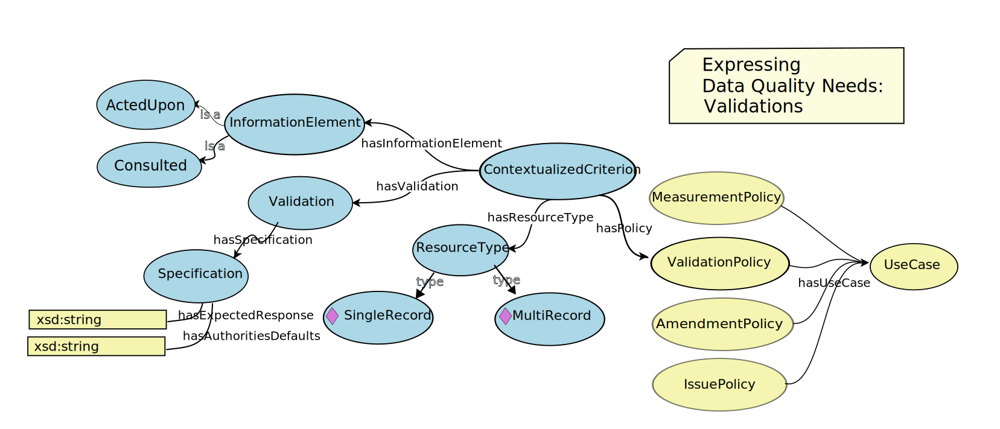

**NOTE** This is just a placeholder for the Fitness for Use Framework Ontology term list document, which will be generated by code.

# Fitness For Use Framework Ontology

**Title**: Fitness For Use Framework Ontology

**Namespace URI**: http://rs.tdwg.org/bdqffdq

**Preferred namespace abbreviation**: bdqffdq:

**Date version issued**: {ratification_date}

**Date created**: {created_date}

**Part of TDWG Standard**: http://www.tdwg.org/standards/[*******]

**This document version**: <{current_iri}{ratification_date}>

**Latest version of document**: http://rs.tdwg.org/bdq/doc/ffdq/

{previous_version_slot}

**Abstract**: The BDQ Conceptual Framework ontology formally describes the terms and relationships between them for evaluating the quality of biodiversity data. Due to the comprehensiveness of the conceptual framework, it allows different interpretations and manners of using it according to different stakeholders. The Framework also provides a base for the bdq: and bdqcore: namespace vocabularies. 

**Contributors**: Lee Belbin, Paul Morris, Arthur Chapman, John Wieczorek, Alan Koch Veiga, Paula F Zermoglio, Alex Thompson, David Lowry, Antonio M Saraiva, Yi Ming Gan, Christian Gendreau, Dmitry Schigel, Tim Robertson 

**Creator**: TDWG Biodiversity Data Quality Interest Group: Task Group 1 (Framework on Data Quality) and Task Group 2 (Data Quality Tests and Assertions)

**Bibliographic citation**: TDWG Biodiversity Data Quality Tests and Assertions Task Group Interest Group. <{current_iri}{ratification_date}>

## 1 Introduction
[!--- JRW finished first draft to here ---]
This document includes terms used to describe 'data quality' / 'fitness for use' in the context of biodiversity data, see Veiga AK, Saraiva AM, Chapman AD, Morris PJ, Gendreau C, Schigel D, & Robertson TJ (2017). A conceptual framework for quality assessment and management of biodiversity data. PLOS ONE 12 (6): https://doi.org/10.1371/journal.pone.0178731>

### 1.1 Namespace abbreviations

The following namespace abbreviations are used in this document:

| **Prefix**   | **Namespace**                                    |
|--------------|--------------------------------------------------|
| bdq          | https://rs.tdwg.org/bdq/terms/                   |
| bdqcore      | https://rs.tdwg.org/bdqcore/terms                |
| bdqdim       | https://rs.tdwg.org/bdqdim/terms                 |
| bdqffdq      | https://rs.tdwg.org/bdqffdq/terms                |
| dc           | https://purl.org/dc/elements/1.1/                |
| dcterms      | https://purl.org/dc/elements/1.1/                |
| dwc          | http://rs.tdwg.org/dwc/terms/                    |
| dwciri       | http://rs.tdwg.org/dwc/iri/                      |
| oa           | https://www.w3.org/TR/annotation-vocab/          |
| skos         | http://www.w3.org/2004/02/skos/core#             |
| owl          | http://www.w3.org/2002/07/owl#                   |

### 1.1 Framework for describing data quality (Paul) (Informative)
Included in this standard is a specification for a framework for describing data quality. Each of the tests in this standard has been designed within this framework and is framed using the terms and concepts from the framework. The framework provides the context for each test, and has shaped decisions made about each test.

The framework data quality with respect to some specified use.  It provides a means to describe a use of data, and what is needed for some data set to have quality for that use, that is for some data set to be fit for a specified purpose.  The framework explicitly links data quality to use, and allows formal description of means to assure that data are fit for some specified purpose.  

* Data Quality Control, Data Quality Assurance.

The framework draws a distinction between Quality Control and Quality Assurance.  Quality Control processes seek to assess the quality of data for some purpose, then identify changes to the data or to processes around the data for improving the quality of the data. Quality Assurance processes seek to filter some set of data to a subset that is fit for some purpose, that is to assure that data used for some purpose are fit for that purpose.

* Data Quality Needs, Data Quality Mechanisms, Data Quality Reports.

The framework organizes data quality concepts into three areas: Needs, Mechanisms, and Reports. Data Quality Needs identify a use to which data may be put, and frame a set of requirements that data needs to meet to be fit for that use, and means by which data not fit for that use may be improved.  The tests described in this standard are formal descriptions of data quality needs for CORE purposes.  Data Quality Mechanisms in the framework are formal descriptions of software and other mechanisms that implement tests described in the Needs area.  Data Quality Reports are the results produced by Mechanisms on some set of data.  The tests described in this standard include specifications of assertions to be made in Data Quality Reports.

<!--- Ming: Test types: Validation, Amendment, Measure, Issue, repeated in 1.5 --->

* Horizontal: Needs, Reports, Vertical: Test informal, describes both need and reporting.

The framework defines four central descriptors of data quality needs: Amendments, Measures, Validations, and Issues.  

Amendments propose changes to data or processes that, if accepted, may improve the fitness of data for a specific use.

Measures measure some specific aspect of data quality.

Validations assess compliance with a need.  Data have quality if they are compliant with the requirements of the validation test.  Validations relate information elements and resource types with a specification of specifically how to assess fitness of the data under some narrow criterion, and themselves are assembled into validations policies, which are linked to other policies to cover a description of the data quality needs of a UseCase.

Issues are the converse of Validations.  Data lack quality if an issue identifies a potential problem in the data that would require further human review to identify if the data have quality for some purpose.  

The framework has an abstract concept of Information Elements. To frame tests on Darwin Core terms in a usable way, we list specific Darwin Core terms as the information elements in each test.

Formally, in the Data Quality Needs level, the framework starts with a Use Case, a framing of some use to which data may be put.  Use cases are related to the formal description of data quality needs through policies and contexts.  Contexts (ContextualizedCriterion, ContextualizedDimension, ContextualizedEnhancement, ContextualizedIssue) relate the specification of a need, such as a Validation, to the information elements that need to be examined, and to the resource type that is operated on.  Each of the tests described in this standard has a formal specification that includes each of these elements.   A Use Case includes a set of policies, policies relate the use case to contexts, contexts link information elements to needs and to resource types, a need specify what properties data must have to have quality.   

Data quality needs can relate to the data quality of single records (bdqffdq:SingleRecord) or of data sets (bdqffdq:MultiRecord).

Vertical paralell classes

Full class diagram 

### 1.1 Status of the content of this document
In Section 4, the values of the `Term IRI`, `Definition` and `Controlled value` are normative. 

### 1.2 RFC 2119 key words
The key words "MUST", "MUST NOT", "REQUIRED", "SHALL", "SHALL NOT", "SHOULD", "SHOULD NOT", "RECOMMENDED", "MAY", and "OPTIONAL" in this document are to be interpreted as described in RFC 2119.

## 2 Use of Terms
Due to the requirements of bdqffdq, controlled value strings MUST be used as values of bdqffdq:dataQualityDimension.

## 3 Term index
