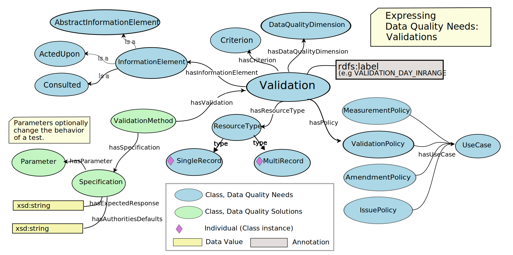
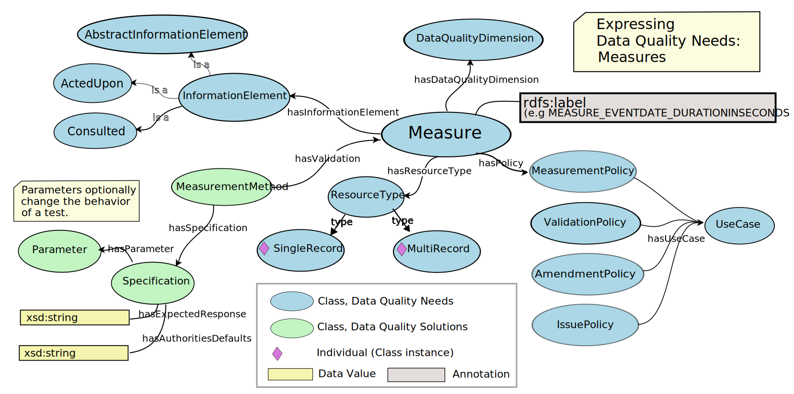
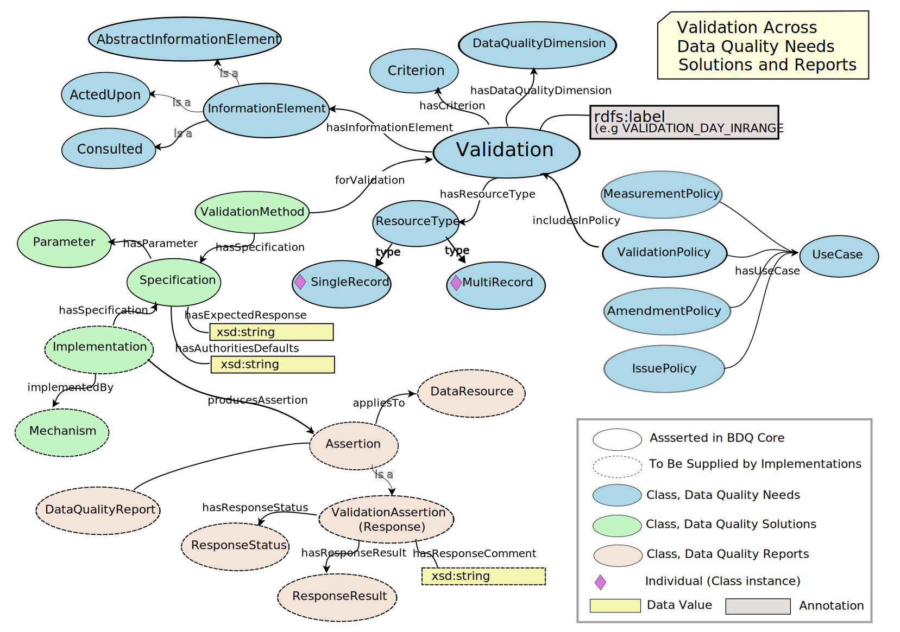
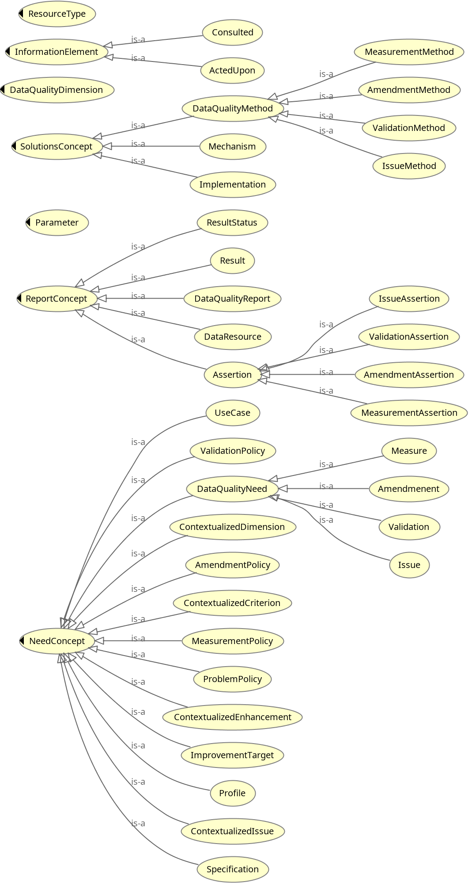

**NOTE** This is just a placeholder for the Fitness for Use Framework Ontology term list document, which will be generated by code.

# Fitness For Use Framework Ontology

**Title**: Fitness For Use Framework Ontology

**Namespace URI**: http://rs.tdwg.org/bdqffdq

**Preferred namespace abbreviation**: bdqffdq:

**Date version issued**: {ratification_date}

**Date created**: {created_date}

**Part of TDWG Standard**: http://www.tdwg.org/standards/[*******]

**This document version**: <{current_iri}{ratification_date}>

**Latest version of document**: http://rs.tdwg.org/bdq/doc/ffdq/

{previous_version_slot}

**Abstract**: The BDQ Conceptual Framework ontology formally describes the terms and relationships between them for evaluating the quality of biodiversity data. Due to the comprehensiveness of the conceptual framework, it allows different interpretations and manners of using it according to different stakeholders. The Framework also provides a base for the bdq: and bdqcore: namespace vocabularies. 

**Contributors**: Lee Belbin, Paul J. Morris, Arthur Chapman, John Wieczorek, Alan Koch Veiga, Paula F Zermoglio, Alex Thompson, David Lowry, Antonio M Saraiva, Yi Ming Gan, Christian Gendreau, Dmitry Schigel, Tim Robertson, Robert A. Morris 

**Creator**: TDWG Biodiversity Data Quality Interest Group: Task Group 1 (Framework on Data Quality) and Task Group 2 (Data Quality Tests and Assertions)

**Bibliographic citation**: TDWG Biodiversity Data Quality Tests and Assertions Task Group Interest Group. <{current_iri}{ratification_date}>

## 1 Introduction
[!--- JRW finished first draft to here ---]

The bdqffdq: vocabulary is a specification of a framework for describing data quality.   Each of the tests in this standard has been designed within this framework and is framed using the terms and concepts from the framework. The framework provides the context for each test, and has shaped decisions made about each test.

The framework considers data to have quality with respect to some specified use.   It provides a means to describe a use of data (bdqffdq:UseCase), and what is needed for some data set to have quality for that use, that is for some data set to be fit for a specified purpose.  The framework explicitly links data quality to use, and allows formal description of means to assure that data are fit for some specified purpose.  

This document includes terms used to describe 'data quality' / 'fitness for use' in the context of biodiversity data, see Veiga AK, Saraiva AM, Chapman AD, Morris PJ, Gendreau C, Schigel D, & Robertson TJ (2017). A conceptual framework for quality assessment and management of biodiversity data. PLOS ONE 12 (6): https://doi.org/10.1371/journal.pone.0178731>, with a few changes for increased clarity.

### 1.1 Namespace abbreviations

The following namespace abbreviations are used in this document:

| **Prefix**   | **Namespace**                                    |
|--------------|--------------------------------------------------|
| bdq          | https://rs.tdwg.org/bdq/terms/                   |
| bdqcore      | https://rs.tdwg.org/bdqcore/terms                |
| bdqdim       | https://rs.tdwg.org/bdqdim/terms                 |
| bdqffdq      | https://rs.tdwg.org/bdqffdq/terms                |
| dc           | https://purl.org/dc/elements/1.1/                |
| dcterms      | https://purl.org/dc/elements/1.1/                |
| dwc          | http://rs.tdwg.org/dwc/terms/                    |
| dwciri       | http://rs.tdwg.org/dwc/iri/                      |
| oa           | https://www.w3.org/TR/annotation-vocab/          |
| skos         | http://www.w3.org/2004/02/skos/core#             |
| owl          | http://www.w3.org/2002/07/owl#                   |

### 1.1 Status of the content of this document

In Section 4, the values of following terms are normative: Term IRI, Name, rdfs:label, skos:prefLabel, Type, Superclass, Definition.

In Section 4, the values of the following term are non-normative: Comment.

Figures are non-normative.

Other sections of this document are marked as normative or non-normative.

### 1.2 RFC 2119 key words (normative)

The key words "MUST", "MUST NOT", "REQUIRED", "SHALL", "SHALL NOT", "SHOULD", "SHOULD NOT", "RECOMMENDED", "MAY", and "OPTIONAL" in this document are to be interpreted as described in RFC 2119.

## 2 Use of Terms (normative) 

When not represented as objects, controlled value strings MUST be used as values of bdqffdq:ResponseStatus, and bdqffdq:ResponseResult.

TODO: needs updating.  

?? bdqffdq:hasDataQualityDimension is an object property, bdqffdq:DataQualityDimension is an object. Is this an asertion about the vocabularies for dimension, criterion, and enhancement ??

Due to the requirements of bdqffdq, controlled value strings MUST be used as values of bdqffdq:dataQualityDimension.

### 2 Framework for describing data quality 

#### 2.1 Introduction (informative)

Mathematical formulation, using set theory, and representation as an owl ontology.

#### 2.1 Description of the bdqffdq ontology (non-normative) 

This portion of BDQ Core is a specification for a framework for describing data quality. Each of the tests in the bdqcore: namespace have been  designed and described within this framework and are framed using the terms and concepts from the framework.  The bdqffdq: framework provides the context for each test, and has shaped decisions made about each test.

The framework data quality with respect to some specified use.  It provides a means to describe a use of data, and what is needed for some data set to have quality for that use, that is for some data set to be fit for a specified purpose.  The framework explicitly links data quality to use, and allows formal description of means to assure that data are fit for some specified purpose.  

Organizing terms (1)  Horizontal slices,  Needs, Solutions, Reports (2) Vertical slices Concepts: Measure, Validation, Amendment, Issue. 

Informal term "Test" involves terms in both need and reporting for a concept.

### 2.1.1 Data Quality Control, Data Quality Assurance

The framework draws a distinction between Quality Control and Quality Assurance.  Quality Control processes seek to assess the quality of data for some purpose, then identify changes to the data or to processes around the data for improving the quality of the data. Quality Assurance processes seek to filter some set of data to a subset that is fit for some purpose, that is to assure that data used for some purpose are fit for that purpose.

### 2.1.2 Concepts in the framework, Test Types: Measure, Validation, Amendment, Issue.

Vertical slices by concept.

<!--- Ming: Test types: Validation, Amendment, Measure, Issue, repeated in 1.5 --->

The framework defines four central concepts for describing and evaluating data quality needs: Amendments, Measures, Validations, and Issues.  

Validations assess compliance with a need.  Data have quality if they are compliant with the requirements of the validation test.  Validations relate information elements and resource types with a specification of specifically how to assess fitness of the data under some narrow criterion, and themselves are assembled into validations policies, which are linked to other policies to cover a description of the data quality needs of a UseCase.

Issues are the converse of Validations.  Data lack quality if an issue identifies a potential problem in the data that would require further human review to identify if the data have quality for some purpose.  

Measures measure some specific aspect of data quality.

Amendments propose changes to data or processes that, if accepted, may improve the fitness of data for a specific use.

The framework has an abstract concept of Information Elements. To frame tests on Darwin Core terms in a usable way, we list specific Darwin Core terms as the information elements in each test.

Formally, in the Data Quality Needs level, the framework starts with a Use Case, a framing of some use to which data may be put.  Use cases are related to the formal description of data quality needs through policies and contexts.  Contexts (ContextualizedCriterion, ContextualizedDimension, ContextualizedEnhancement, ContextualizedIssue) relate the specification of a need, such as a Validation, to the information elements that need to be examined, and to the resource type that is operated on.  Each of the tests described in this standard has a formal specification that includes each of these elements.   A Use Case includes a set of policies, policies relate the use case to contexts, contexts link information elements to needs and to resource types, a need specify what properties data must have to have quality.   

Data quality needs can relate to the data quality of single records (bdqffdq:SingleRecord) or of data sets (bdqffdq:MultiRecord).

### 2.3 Data Quality Needs, Data Quality Mechanisms, Data Quality Reports

Vertical slices through the framework.

The framework organizes data quality concepts into three areas: Needs, Mechanisms, and Reports.  Data Quality Needs identify a use to which data may be put, and frame a set of requirements that data needs to meet to be fit for that use, and means by which data not fit for that use may be improved.  The tests described in this standard are formal descriptions of data quality needs for CORE purposes.  Data Quality Mechanisms in the framework are formal descriptions of software and other mechanisms that implement tests described in the Needs area.  Data Quality Reports are the results produced by Mechanisms on some set of data.  The tests described in this standard include specifications of assertions to be made in Data Quality Reports.

The framework has an abstract concept of Information Elements. To frame tests on Darwin Core terms in a usable way, we list specific Darwin Core terms as the information elements in each test.

Formally, in the Data Quality Needs level, the framework starts with a Use Case, a framing of some use to which data may be put.  Use cases are related to the formal description of data quality needs through policies and contexts.  Contexts (ContextualizedCriterion, ContextualizedDimension, ContextualizedEnhancement, ContextualizedIssue) relate the specification of a need, such as a Validation, to the information elements that need to be examined, and to the resource type that is operated on.  Each of the tests described in this standard has a formal specification that includes each of these elements.   A Use Case includes a set of policies, policies relate the use case to contexts, contexts link information elements to needs and to resource types, a need specifies what properties data must have to have quality.   

The framework expects that Quality Assurance is provided for through specification of a set of Measures defined to operate on a MultiRecord, and which specify a Response.result of COMPLETE or NOT_COMPLETE.  A MultiRecord Measure may specify that it is COMPLETE if all instances of a SingleRecord Validation are COMPLIANT.  

For Quality Control, MultiRecord Measures may be defined to return a count of Response.value of COMPLIANT for validations, and thus can provide a measure of how fit a data set is for some purpose, and what sort of work would be required to make it fit for that purpose.   

Diagram of the composition of Validation, ValidationMethod, and ValidationAssertion illustrating the Data Quality Needs, Solutions, and Reports layers of bdqffdq, with responsibilities of bdqcore (solid lines), and implementations (dashed lines).

Class diagram 

### Example representation of a bdqcore test (non-normative)

Fragment in Turtle describing VALIDATION_COUNTRY_FOUND, composed of a Validation, linking an ActedUpon InformationElement, a Criterion, and the ResourceType SingleRecord, with the Validation linked to a ValidationMethod, and from there a Specification.  Also shown is a fragment of a ValidationPolicy linking this Validation to a UseCase. 

    <bdqcore:69b2efdc-6269-45a4-aecb-4cb99c2ae134> a <bdqffdq:Validation> ;
        rdfs:comment "Does the value of dwc:country occur in the bdq:sourceAuthority?" ;
        rdfs:label "Does the value of dwc:country occur in the bdq:sourceAuthority? Validation for SingleRecord" ;
        skos:prefLabel "VALIDATION_COUNTRY_FOUND" ;
        <bdqffdq:hasActedUponInformationElement> <urn:uuid:4b32157c-534e-4a74-ab03-f82a1074a8d2> ;
        <bdqffdq:hasCriterion> <urn:uuid:ce55985b-a158-4411-9cd4-94950159ba6c> ;
        <bdqffdq:hasResourceType> <bdqffdq:SingleRecord> .
    
    <urn:uuid:4b32157c-534e-4a74-ab03-f82a1074a8d2> a <bdqffdq:ActedUpon> ;
        rdfs:label "Information Element ActedUpon dwc:country" ;
        <bdqffdq:composedOf> <http://rs.tdwg.org/dwc/terms/country> ;
        skos:prefLabel "Information Element ActedUpon dwc:country" .
        
    <urn:uuid:ce55985b-a158-4411-9cd4-94950159ba6c> a <bdqffdq:Criterion> ;
        rdfs:label "Conformance: found" .
    
    <urn:uuid:04cee4e0-0c83-40cc-8de2-e7391f0a97a9> a <bdqffdq:ValidationMethod> ;
        rdfs:label "ValidationMethod: Does the value of dwc:country occur in the bdq:sourceAuthority? Validation for SingleRecord with Specification Specification for: VALIDATION_COUNTRY_FOUND" ;
        skos:prefLabel "ValidationMethod: Does the value of dwc:country occur in the bdq:sourceAuthority? Validation for SingleRecord with Specification Specification for: VALIDATION_COUNTRY_FOUND" ;
        <bdqffdq:criterionInContext> <bdqcore:69b2efdc-6269-45a4-aecb-4cb99c2ae134> ;
        <bdqffdq:hasSpecification> <urn:uuid:urn:uuid:051f6ad7-1a4b-4e6c-8a1d-2af76de24848> .
    
    <urn:uuid:051f6ad7-1a4b-4e6c-8a1d-2af76de24848> a <bdqffdq:Specification> ;
        rdfs:comment "EXTERNAL_PREREQUISITES_NOT_MET if the bdq:sourceAuthority is not available; INTERNAL_PREREQUISITES_NOT_MET if dwc:country is EMPTY; COMPLIANT if value of dwc:country is a place type equivalent to administrative entity of \"nation\" by the bdq:sourceAuthority; otherwise NOT_COMPLIANT" ;
        rdfs:label "Specification for: VALIDATION_COUNTRY_FOUND" .
    
    <urn:uuid:00a36139-71fa-4f82-a5f7-8574c54497bd> a <bdqffdq:ValidationPolicy> ;
        rdfs:label "ValidationPolicy: Does the value of dwc:country occur in the bdq:sourceAuthority? Validation for SingleRecord in UseCase bdq:Spatial-Temporal Patterns" ;
        skos:prefLabel "ValidationPolicy: Does the value of dwc:country occur in the bdq:sourceAuthority? Validation for SingleRecord in UseCase bdq:Spatial-Temporal Patterns" ;
        <bdqffdq:coversUseCase> <bdqffdq:Spatial-Temporal Patterns> ;
        bdqffdq:hasValidation> bdqcore:69b2efdc-6269-45a4-aecb-4cb99c2ae134> .
 

TODO: Add diagram

## 3 Term index

TODO:  Generate and include these sections here.

### 3.1 Classes

### 3.2 Object Properties

### 3.3 Data Properties

TODO: Also index by concept.

## 4 Terms in the bdqffdq ontology (portions normative, see 2.1)

TODO:  Generate and include here.

[Rough cut at generated list of ontology terms](https://github.com/tdwg/bdq/blob/master/tg2/core/generation/docs/bdqffdq.md)

## 5 Fitness For Use Framework Summary of Mathematical Formalization (normative) 

This is a Summary of pp.89-108 in: Veiga, A.K. 2016. A conceptual framework on biodiversity data quality. Tese (Doutorado) [Doctoral Thesis] Escola Politécnica da Universidade de São Paulo.  Departamento de Engenharia de Computação e Sistemas Digitais.156p. 

The following changes have been made to the original formulation: 

- dcmitype:Dataset replaced with MultiRecord.  
- Improvement Method changed to Enhancement Method, 
- Improvement Policy changed to Enhancement Policy,
- Data Quality Improvement changed to Data QualityAmendment.
- Issue, IssuePolicy, IssueMethod, and IssueAssertion added as converse of Validation.
- Dimension in Context renamed Measure.
- Criterion in Context renamed Validation
- Enhancement in Context renamed Amendment

## Fundamental Concepts
* U = Use Case
* D = Dimension (e.g. Completeness)  
* IE = Information Element (e.g. coordinates)
* M = Mechanism 
* C = Criterion (e.g. “in controlled vocabulary”)
* E = Enhancement (description of a means by which data could be improved e.g. recommend replacement value from a controlled vocabulary).
* S = Specification (specification of how a criterion is to be evaluated e.g. “Iterate records and calculate the proportion of records with scientific name different from null”)

## Properties
* US = Usages 
* ID = Identifier for a resource
* RT = Resource Type {SingleRecord, MultiRecord}
* sr = instance of Single Records 
* ds = instance of Dataset.
* V = Data Resource Value
* R = Assertion (result from a mechanism, of Validation, Measurement, Improvement on Resource)

## Notation
* X: Domain (Upper case symbols) 
* x: instance (lower case symbols)
* { } set
* < > tuple	
* ⋃ union
* ∁ complement
* ⋀ and (logical conjunction)
* ∈ is a member of

TODO: Update Domain/instance letters to reflect class name changes.

## Derived Concepts
### General
#### Measure
    CD = { cd | cd =< ie, d, rt >, ie ∈ IE, d ∈ D ⋀ rt ∈ RT }

    cd1 = < ie1, d1, rt1 >

* “coordinate precision of single records”

#### Validation
     CC = { cc | cc = < ie, c, rt >, ie ∈ IE, c ∈ C ⋀ rt ∈ RT }   

     cc1 = < ie1, c1, rt1 >

* “The value of Basis of Records of single records must be in the controlled vocabulary”

#### Amendment

    CE = { ce | ce = < ie, e, rt >, ie ∈ IE, e ∈ E ⋀ rt ∈ RT }

    ce1 = { < ie1, e1, rt1 >}

*“Recommend valid value for taxon name in single record”

#### Issue

    I = { i | i = < ie, c, rt >, ie ∈ IE, c ∈ ∁C ⋀ rt ∈ RT }

    i1 = { < ie1, c1, rt1 >}

* “Potential issue if geographic coordinate is at 0,0”

TODO: Finish adding Issue concepts.

### Data Quality Needs
#### Use Case Coverage 
   
     UC(u) = { us | u ∈ U ⋀ us ⊂ US}

     uc(u1) = {us1, us2}

* “A Use Case for Niche Modeling covers MAXENT and GARP modeling”

#### Valuable Information Elements

     VIE(u) = {ie | ie ⊂ I E ⋀ u ∈ U }

* For a Use Case, what information elements are valuable.

#### Acceptable Data Quality Measure

     AM(cd) = {cc | cd ∈ C D ⋀ cc ⊂ C C}

     am(cd1) = {cc1, cc2}

* For the dimension in context coordinate completeness in a dataset, acceptable quality is met by all records having coordinates complete.

#### Enhancement Target

    IT (ce) = {cd ⋃ cc | cd ∈ CD, cc ∈ CC ⋀ ce ∈ CE}

    it(ce1) = {cd1, cc2}

* Recommending coordinates based on textual locality improves the coordinate completeness of single records and may result in compliance with the criterion data set must have all records with coordinates.

#### Measurement Policy

    MP (u) = {cd | cd ⊂ CD ⋀ u ∈ U }

    mp(u1) = {cd1, cd2, cd3, cd4}
    mp(u1) = {< ie1, d1, rt2 >, < ie1, d1, rt1 >, < ie2, d1, rt1 >, < ie2, d2, rt2 >}

#### Validation Policy

    VP (u) = {cc | cc ⊂ CC ⋀ u ∈ U }

    vp(u1) = {cc1, cc2}
    vp(u1) = {< ie1, c1, rt1>, < ie2, c2, rt2> }

#### Enhancement Policy

     IP (u) = {ce | ce ⊂ CE ⋀ u ∈ U }

     ip(u1) = {ce1, ce2}

#### Data Quality Profile

      DQP (u) = {dqp | dqp = mp(u) ⋃ vp(u) ⋃ ip(u), mp ∈ MP , vp ∈ VP , ip ∈ IP ⋀ u ∈ U }

      dqp(u1) = {mp(u1), vp(u1), ip(u1)}

### Data Quality Solutions

#### Measurement Method
    MM(cd) = {s | s ⊂ S ⋀ cd ∈ CD}

#### Validation Method
    VM(cc) = {s | s ⊂ S ⋀ cc ∈ CC}

#### Enhancement Method
    IM(ce) = {s | s ⊂ S ⋀ ce ∈ CE}

#### Implementation 
     I (s) = {m | m ⊂ M ⋀ s ∈ S}

     i(s1) = {m1, m2}

#### Mechanism Coverage
    MC(m) = {s | s ⊂ S ⋀ m ∈ M }

    mc(m1) = {s1, s2}

### Data Quality Reports
#### Data Resource
    DR = { dr | dr = < id, rt, v >, id ∈ I D, rt ∈ RT , (rt = sr ⋁ rt = ds) ⋀ v ∈ V }

    dr1 =< id1, rt1, v1 >

* “dr1 is a Data Resource which represents the Dataset "3cc6171e-8c52-4f65-ad7a-32c74e395f29" which contains 251,744 records”  Data resources are defined as having persistent GUIDs

#### Data Quality Measure 
     DQM(dr) = {dqm | dqm =< cd, s, m, r >, cd ∈ CD, s ∈ S, m ∈ M , r ∈ R ⋀ dr ∈ DR}
     
     dqm(dr1) = {< cd1, s1, m1, r1 >}

* Coordinate numerical precision of the dataset 3cc6171e-8c52-4f65-ad7a-32c74e395f29 is 6.16 and this value was assigned by the software DwC-A Validator 2.0 which calculated the value by the average of significant digits of each record of the dataset.

#### Data Quality Validation 

     DQV (dr) = {dqv | dqv = < cc, s, m, r >, cc ∈ CC, s ∈ S, m ∈ M , r ∈ R ⋀ dr ∈ DR}

     dqv(dr1) = {< cc1s1, m1, r1 >}

* A DQ Validation asserts that the Contextualized Criterion “Geodetic Datum must be supplied” is COMPLIANT for a specific species occurrence and this validation was performed by the software Darwin Test by checking if the field Geodetic Datum of the record was not empty.

#### Data Quality Amendment
     DQI(dr) = {dqi | dqi = < ce, s, m, r >, ce ∈ CE, s ∈ S, m ∈ M , r ∈ R ⋀ dr ∈ DR}

     dqi(dr1) = {< ce1, s1, m1, r1 >}

* An amendment is proposed to replace the current value of the scientific name by the value “Apis” because Apis is the most similar valid name based on the Levenshtein distance in the Catalog of Life database using the software DwC-A Validator 2.0.

#### Data Quality Assessment
     A(dr) = {dqm(dr) ⋃ dqv(dr) ⋃ dqi(dr) | dqm ∈ DQM, dqv ∈ DQV , dqi ∈ DQI ⋀ dr ∈ DR}

     a(dr1) = {dqm1, dqm2, dqm3, dqv1, dqi1}

#### Quality Control
     QC(dr) = {dqv(dr) ⋃ dqi(dr) | dqv ∈ DQV , dqi ∈ DQI ⋀ dr ∈ DR}

     qc(dr1) = {dqv1, dqi1}

#### Quality Assurance
     QA(dr) = {dqv(dr) | dqv ∈ DQV ⋀ dr ∈ DR}

     qa(dr1) = {dqv1, dqv2}
