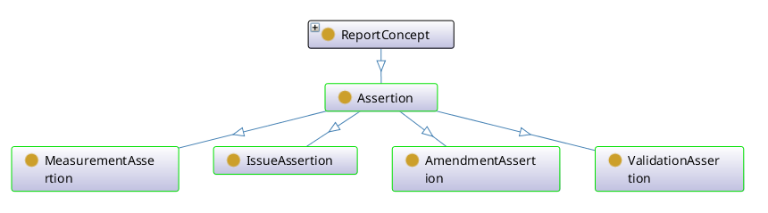

<!--- This file is generated from templates by code, DO NOT EDIT by hand --->

# Fitness For Use Framework Ontology Guide

Title
: Fitness For Use Framework Ontology Guide

Date version issued
: 2025-03-26

Date created
: 2025-03-26

Part of TDWG Standard
: <http://example.org/to_be_determined>

Abstract
: This document is a user's guide for the BDQ Core Standard, describing the organization and use of the bdqffdq: ontology.  The BDQ Conceptual Framework ontology formally describes the terms and relationships between them for evaluating the quality of biodiversity data. Due to the comprehensiveness of the conceptual framework, it allows different interpretations and manners of using it according to different stakeholders. The Framework also provides a base for the bdq: and bdqcore: namespace vocabularies.

Authors:
: [Lee Belbin](https://orcid.org/0000-0001-8900-6203) ([Blatant Fabrications](https://www.wikidata.org/wiki/Q130304884)), [Arthur D. Chapman](https://orcid.org/0000-0003-1700-6962) ([Australian Biodiversity Information Services](http://www.wikidata.org/entity/Q100600913)), [Paul J. Morris](https://orcid.org/0000-0002-3673-444X) ([Museum of Comparative Zoology, Harvard University](http://www.wikidata.org/entity/Q1420782)), [John Wieczorek](https://orcid.org/0000-0003-1144-0290) ([Rauthiflor LLC](http://www.wikidata.org/entity/Q98382028))

Creator
: TDWG Biodiversity Data Quality Interest Group Task Group 2: Data Quality Tests and Assertions

Bibliographic citation
: TDWG Biodiversity Data Quality Interest Group Task Group 2: Data Quality Tests and Assertions. 2025. Fitness For Use Framework Ontology Guide. Biodiversity Information Standards (TDWG). <http://rs.tdwg.org/bdq/terms/2025-03-26>

Draft Standard for Submission

### Table of Contents ###

- [1 Introduction](#1-introduction)
- [1.1 Purpose](#11-purpose)
- [1.2 Audience](#12-audience)
- [1.3 Documents about the bdqffdq: ontology](#13-documents-about-the-bdqffdq-ontology)
- [1.4 Status of the content of this document](#14-status-of-the-content-of-this-document)
- [1.5 RFC 2119 key words](#15-rfc-2119-key-words)
- [1.6 Namespace abbreviations](#16-namespace-abbreviations)
- [2 Use of Terms (normative)](#2-use-of-terms-normative)
- [3 Framework for describing data quality](#3-framework-for-describing-data-quality)
- [3.1 Introduction and Context](#31-introduction-and-context)
- [3.2 Description of the bdqffdq ontology](#32-description-of-the-bdqffdq-ontology)
- [3.2.1 Data Quality Control and Data Quality Assurance](#321-data-quality-control-and-data-quality-assurance)
- [3.2.2 Information Elements](#322-information-elements)
- [3.2.3 Concepts in the framework, Test Types: Validation, Issue, Measure, Amendment](#323-concepts-in-the-framework-test-types-validation-issue-measure-amendment)
- [3.4 Data Quality Needs, Data Quality Mechanisms, Data Quality Reports](#34-data-quality-needs-data-quality-mechanisms-data-quality-reports)
- [3.5 Responses](#35-responses)
- [3.6 Organization of the bdqcore classes](#36-organization-of-the-bdqcore-classes)
- [3.7 Example representation of a BDQ Core Test](#37-example-representation-of-a-bdq-core-test)
- [3.8 Cardinality of bdqffdq terms](#38-cardinality-of-bdqffdq-terms)
- [4 Term index](#4-term-index)
- [4.1 Alphabetical Index of classes](#41-alphabetical-index-of-classes)
- [4.2 Alphabetical Index of object properties](#42-alphabetical-index-of-object-properties)
- [4.3 Alphabetical Index of data properties](#43-alphabetical-index-of-data-properties)
- [4.4 Alphabetical Index of named individuals](#44-alphabetical-index-of-named-individuals)
- [5 List of Terms with axioms in the bdqffdq ontology (portions normative, see 1.4)](#5-list-of-terms-with-axioms-in-the-bdqffdq-ontology-portions-normative-see-14)
- [5.1 Class terms](#51-class-terms)
- [5.2 ObjectProperty terms](#52-objectproperty-terms)
- [5.3 DataProperty terms](#53-dataproperty-terms)
- [5.4 NamedIndividual terms](#54-namedindividual-terms)

## 1 Introduction

The bdqffdq: vocabulary is a specification of a framework for describing data quality. Each of the Tests in the bdqcore: vocabulary has been designed using this framework and is framed in the terms and concepts from the framework.

The framework defines data quality in relation to a specified use. It enables formal description of a use case (bdqffdq:UseCase) and the requirements for a dataset to be fit for that purpose. By explicitly linking data quality to use, the framework supports assurance that data meet the needs of a given application.

This document describes a set of terms used to describe 'data quality' and 'fitness for use' in the context of biodiversity data. These terms are based on Veiga (2016) and Veiga et al. (2017), with a few changes for increased clarity.

### 1.1 Purpose

This is a guide to the use of the Framework Ontology (bdqffdq: vocabulary).

### 1.2 Audience

This document is for those needing a technical understanding of the Framework Ontology.

### 1.3 Documents about the bdqffdq: ontology

This document provides an illustrated guide to the use of the bdqffdq: vocabulary, which includes: 

- The [Fitness for Use Ontology](../../bdqffdq/index.md) landing page with normative guidance on the use of this ontology.
- The [Fitness For Use Framework Ontology List of Terms](../../list/bdqffdq/index.md) document listing just the vocabulary terms in the ontology.
- Additional axioms that can be found in the [Fitness For Use Framework Ontology Vocabulary Extension](../../extension/bdqffdq/index.md) 
- The bdqffdq framework ontology is best technically understood from its [Owl Ontology Distribution](../../../vocabulary/bdqffdq.owl) 

### 1.4 Status of the content of this document

<!--- TODO: Review these normative/non-normative statements, not all sections are covered --->

Sections 1 and 3 are non-normative.

Section 2 is normative.

In Section 5, the values of following terms are normative: Term IRI, Name, Type, Superclass, Definition.

Figures are non-normative.

Any sentence or phrase beginning with "For example" or "e.g." is non-normative.

### 1.5 RFC 2119 key words

The key words "MUST", "MUST NOT", "REQUIRED", "SHALL", "SHALL NOT", "SHOULD", "SHOULD NOT", "RECOMMENDED", "MAY", and "OPTIONAL" in this document are to be interpreted as described in RFC 2119.

### 1.6 Namespace abbreviations

The following namespace abbreviations are used in this document:

| **Abbreviation** | **Namespace** |
| ------------ | -------------                               |
| bdq:         | https://rs.tdwg.org/bdq/terms/              |
| bdqcore:     | https://rs.tdwg.org/bdqcore/terms/          |
| bdqcrit:     | https://rs.tdwg.org/bdqcrit/terms/          |
| bdqdim:      | https://rs.tdwg.org/bdqdim/terms/           |
| bdqffdq:     | https://rs.tdwg.org/bdqffdq/terms           |
| dcterms:     | http://purl.org/dc/terms/                   |
| dwc:         | http://rs.tdwg.org/dwc/terms/               |
| owl:         | http://www.w3.org/2002/07/owl#              |
| rdfs:        | http://www.w3.org/2000/01/rdf-schema        |
| skos:        | http://www.w3.org/2004/02/skos/core#        |
| xsd:         | http://www.w3.org/2001/XMLSchema#           |

## 2 Use of Terms (normative)

When not represented as objects, controlled value strings MUST be used as values of bdqffdq:ResponseStatus, and bdqffdq:ResponseResult.

IRIs MUST be used as values for all individual class instances and object properties when using bdqffdq: terms.

### 3 Framework for describing data quality 

#### 3.1 Introduction and Context

The bdqffdq: portion of BDQ Core is a specification for a framework for describing data quality. This bdqffdq: framework is based on a mathematical formulation, using set theory (Veiga, 2016), and is represented as an OWL ontology. This document describes the organization and use of the OWL ontology.

This document provides a background for understanding the bdqcore: Test descriptions. Each of the Tests in the bdqcore: namespace have been designed and described within this framework and are framed using the terms and concepts from the framework. The bdqffdq: framework provides the context for each Test, and has shaped decisions made about each Test.

See the [Fitness for Use Ontology](../../bdqffdq/index.md) landing page for a concise description and normative information about the bdqffdq: ontology and a summary of the mathematical formalization. See the [Fitness For Use Framework Ontology List of Terms](../../list/bdqffdq/index.md) document for the list of terms in the bdqffdq: vocabulary. See the [Fitness For Use Framework Ontology Vocabulary Extension](../../extension/bdqffdq/index.md) for documentation on additional axioms. See the [Owl Ontology Distribution](../../../vocabulary/bdqffdq.owl) for the formal representation of the vocabulary as an OWL ontology. The mathematical formalization provides a description of inferences and reasoning that may be made with the terms in the vocabulary.

#### 3.2 Description of the bdqffdq ontology

The bdqffdq framework defines data quality in relation to a specified use, emphasizing that data quality is not abstract but purpose-dependent. It provides a formal way to describe a use case (UseCase) and the criteria for evaluating whether a dataset is fit for that purpose. By linking data quality explicitly to use, the framework enables consistent assessment and assurance of fitness for a given purpose.

The framework can be conceptually divided into three horizontal layers: Data Quality Needs, Data Quality Solutions, and Data Quality Reports. Needs describe what it means for data to have quality for some use, Solutions describe tools to evaluate quality, and Reports are produced by Solutions to describe the evaluation of quality in particular datasets.

The framework can also be conceptually divided into four vertical themes, four sets of related concepts that carry through the Needs, Solutions, and Reports layers. These concepts are Validation, Issue, Measure, and Amendment. 

We use the informal term "Test" to describe these four vertical themes, a Test involves terms in both Needs and Solutions, and Tests produce particular reporting elements.

### 3.2.1 Data Quality Control and Data Quality Assurance

The framework draws a distinction between Quality Control and Quality Assurance. Quality Control processes seek to assess the quality of data for some purpose, then identify changes to the data or to processes around the data to improve their quality. Quality Assurance processes seek to filter some set of data to a subset that is fit for some purpose, that is, to assure that data used for some purpose are fit for that purpose.

### 3.2.2 Information Elements

The framework has an abstract concept of Information Elements. To frame Tests on Darwin Core terms in a usable way, we list specific Darwin Core terms as the Information Elements in each Test.

### 3.2.3 Concepts in the framework, Test Types: Validation, Issue, Measure, Amendment

The framework defines four central concepts for describing and evaluating data quality Needs: Validation, Issue, Measure, and Amendment.

A Validation assesses compliance with a need. Data have quality if they are compliant with the requirements of the Validation Test. A Validation relates Information Elements and ResourceTypes with a specification of exactly how to assess fitness of the data under some narrow criterion, and themselves are assembled into validations policies, which are linked to other policies to cover a description of the data quality needs of a UseCase.

Issues are the converse of Validations. Data lack quality if an issue identifies a potential problem in the data that would require further human review to determine if the data have quality for some purpose.

Measures make an aggregate summary of some specific aspect of data quality.

Amendments propose changes to data or processes that, if accepted, may improve the fitness of data for a specific use.

Formally, in the Data Quality Needs level, the framework starts with a UseCase, a framing of some use to which data may be put. UseCases are related to the formal description of data quality Needs through Policies and Contexts. Contexts (ContextualizedCriterion, ContextualizedDimension, ContextualizedEnhancement, ContextualizedIssue) relate the specification of a need, such as a Validation, to the Information Elements that need to be examined, and to the ResourceType that is operated on. Each of the Tests described in this standard has a formal Specification that includes each of these elements. A UseCase includes a set of Policies, Policies relate the UseCase to Contexts, Contexts link Information Elements to Needs and to ResourceTypes, a Need specifies what properties data must have to have quality. 

Data quality Needs can relate to the data quality of single records (bdqffdq:SingleRecord) or of datasets (bdqffdq:MultiRecord).

### 3.4 Data Quality Needs, Data Quality Mechanisms, Data Quality Reports

The *bdqffdq* framework organizes data quality concepts into three core areas—**Needs**, **Mechanisms**, and **Reports**—which can be viewed as horizontal slices through the framework (Veiga et al., 2017).

**Data Quality Needs** begin with a *UseCase*, a formal description of a purpose for which data may be used. Each UseCase includes a set of *Policies*, which in turn relate to *Contexts*. Contexts (e.g., `ContextualizedCriterion`, `ContextualizedDimension`, `ContextualizedEnhancement`, `ContextualizedIssue`) specify the data quality requirement (*Need*), the relevant *Information Elements* (such as specific Darwin Core terms), and the *ResourceType* the requirement applies to. A Need defines the properties data must have to be considered fit for use and may include ways to improve unfit data. The *Tests* described in this standard are formal specifications of such Needs for BDQ Core purposes.

**Data Quality Mechanisms** are formal descriptions of software or other tools that implement these Tests. They execute the specifications defined in the Needs layer.

**Data Quality Reports** are the outputs generated when Mechanisms are applied to data. The Tests include formal *Specifications of Assertions* that are expected to appear in these Reports.

The framework includes an abstract concept of *Information Elements*, which are concretely represented by specific Darwin Core terms within each Test to make evaluations practical.

For **Quality Assurance**, the framework defines *Measures* that operate on *MultiRecords* and return a `Response.result` of `COMPLETE` or `NOT_COMPLETE`. A MultiRecord Measure may be `COMPLETE` if all instances of a related *SingleRecord Validation* are `COMPLIANT`.

For **Quality Control**, MultiRecord Measures can return a count of `COMPLIANT` results for validations, thereby indicating how fit a dataset is for its intended purpose and what adjustments are needed to make it fully fit.

Diagram of the composition of Validation, ValidationMethod, and ValidationAssertion illustrating the Data Quality Needs, Solutions, and Reports layers of bdqffdq, with responsibilities of bdqcore (solid lines), and implementations (dashed lines).

A useful way to think of the framework is to divide it horizontally into Needs, Solutions, and Reports layers, and then track the Test concepts vertically through each layer (see [Figure 3](https://journals.plos.org/plosone/article?id=10.1371/journal.pone.0178731#pone-0178731-g003) in Veiga et al., 2017). Below is a diagram that brings together the horizontal Needs, Solutions, and Reports layers with the vertical Test concepts (Validations, Issues, Measures and Amendments), with validation related concepts expanded to show all related entities in bdqffdq.

### 3.5 Responses

The content of this section is non-normative, related normative guidance is in section [5.1 The Response Object (normative)](../../implementers/index.md#51-the-response-object-normative) of the [BDQ Core Implementer's Guide](../../implementers/index.md).

Assertions are expected to assert Response objects. These will involve, in RDF, a combination of object properties and data properties.

| Concept | bdqffdq Term(s) | Description |
| ------- | ------- | ----------- |
| Response | bdqffdq:Assertion | The report from a single execution of a single Test, consisting of a bdq:Response.status, a bdq:Response.result, a bdq:Response.comment, and optionally, a bdq:Response.qualifier.| 
| Response.status | bdqffdq:ResponseStatus, bdqffdq:hasResponseStatus | A metadata element in a bdq:Response indicating whether a particular Test (bdqffdq:Validation, bdqffdq:Issue, bdqffdq:Measure, or bdqffdq:Amendment) was able to be performed or not. |
| Response.result | bdqffdq:ResponseResult, bdqffdq:hasResponseResult, bdqffdq:hasResponseResultValue | The element in a bdq:Response containing the value returned by a Test (bdqffdq:Validation, bdqffdq:Issue, bdqffdq:Measure, or bdqffdq:Amendment)|
| Response.comment | bdqffdq:hasResponseComment | A human readable interpretation of the results of the Test.|
| Response.qualifier | bdqffdq:ResponseQualifier, bdqffdq:hasResponseQualifier | Additional structured information that qualifies the bdq:Response, intended as an extension point for uncertainty.|

See the section [Structure of a Response (normative)](../../bdqcore/index.md#31-Structure-of-Response-normative) of the [BDQ Core Tests and Assertions](../../bdqcore/index.md) for further normative guidance on Responses as RDF or as data structures in non-RDF settings.

### 3.6 Organization of the bdqcore classes 

Following is a knowledge graph showing the is-a relationships between the classes in bdqffdq:

### 3.7 Example representation of a BDQ Core Test

Below is a fragment in Turtle describing VALIDATION_COUNTRY_FOUND, composed of a Validation, linking an ActedUpon Information Element, a Criterion, and the ResourceType SingleRecord, with the Validation linked to a ValidationMethod, and from there a Specification. Also shown is a ValidationPolicy linking this Validation to a UseCase. 

     <bdqcore:69b2efdc-6269-45a4-aecb-4cb99c2ae134> a <bdqffdq:Validation> ;
         rdfs:comment "Does the value of dwc:country occur in the bdq:sourceAuthority?" ;
         rdfs:label "Does the value of dwc:country occur in the bdq:sourceAuthority? Validation for SingleRecord" ;
         skos:prefLabel "VALIDATION_COUNTRY_FOUND" ;
         <bdqffdq:hasActedUponInformationElement> <urn:uuid:8a2bbe0d-7218-4861-8d70-e4f2108a6dc4> ;
         <bdqffdq:hasCriterion> <bdqcrit:Found> ;
         <bdqffdq:hasDataQualityDimension> <bdqdim:Conformance> ;
         <bdqffdq:hasResourceType> <bdqffdq:SingleRecord> .
     
     <urn:uuid:8a2bbe0d-7218-4861-8d70-e4f2108a6dc4> a <bdqffdq:ActedUpon> ;
         rdfs:label "Information Element ActedUpon dwc:country" ;
         <bdqffdq:composedOf> dwc:country ;
         <skos:prefLabel> "Information Element ActedUpon dwc:country" .
     
     <bdqcrit:Found> a <bdqffdq:Criterion> ;
         rdfs:label "Found" .

     <bdqdim:Conformance> a <bdqffdq:DataQualityDimension> ;
         rdfs:label "Conformance" .     

     <urn:uuid:04cee4e0-0c83-40cc-8de2-e7391f0a97a9> a <bdqffdq:ValidationMethod> ;
         rdfs:label "ValidationMethod: Does the value of dwc:country occur in the bdq:sourceAuthority? Validation for SingleRecord with Specification for: VALIDATION_COUNTRY_FOUND" ;
         skos:prefLabel "ValidationMethod: Does the value of dwc:country occur in the bdq:sourceAuthority? Validation for SingleRecord with Specification for: VALIDATION_COUNTRY_FOUND" ;
         <bdqffdq:forValidation> <bdqcore:69b2efdc-6269-45a4-aecb-4cb99c2ae134> ;
         <bdqffdq:hasSpecification> <urn:uuid:051f6ad7-1a4b-4e6c-8a1d-2af76de24848> .
     
     <urn:uuid:051f6ad7-1a4b-4e6c-8a1d-2af76de24848> a <bdqffdq:Specification> ;
         rdfs:comment "EXTERNAL_PREREQUISITES_NOT_MET if the bdq:sourceAuthority is not available; INTERNAL_PREREQUISITES_NOT_MET if dwc:country is bdq:Empty; COMPLIANT if value of dwc:country is a place type equivalent to administrative entity of \"nation\" in the bdq:sourceAuthority; otherwise NOT_COMPLIANT bdq:sourceAuthority default = \"The Getty Thesaurus of Geographic Names (TGN)\" {[https://www.getty.edu/research/tools/vocabularies/tgn/index.html]}" ;
         rdfs:label "Specification for: VALIDATION_COUNTRY_FOUND" ;
         <bdqffdq:hasAuthoritiesDefaults> "bdq:sourceAuthority default = \"The Getty Thesaurus of Geographic Names (TGN)\" {[https://www.getty.edu/research/tools/vocabularies/tgn/index.html]}" ;
         <bdqffdq:hasExpectedResponse> "EXTERNAL_PREREQUISITES_NOT_MET if the bdq:sourceAuthority is not available; INTERNAL_PREREQUISITES_NOT_MET if dwc:country is bdq:Empty; COMPLIANT if value of dwc:country is a place type equivalent to administrative entity of \"nation\" in the bdq:sourceAuthority; otherwise NOT_COMPLIANT" .
     
     <urn:uuid:0053ca4f-7d45-41ea-912e-c8847bb70142> a <bdqffdq:ValidationPolicy> ;
     	rdfs:label "ValidationPolicy: (65) validations  in UseCase bdq:Record-Management" ;
     	<http://www.w3.org/2004/02/skos/core#prefLabel> "ValidationPolicy: (65) validations  in UseCase bdq:Record-Management" ;
     	<bdqffdq:hasUseCase> <bdqffdq:Record-Management> ;
     	<bdqffdq:includesInPolicy> <bdqcore:01c6dafa-0886-4b7e-9881-2c3018c98bdc> , <bdqcore:0493bcfb-652e-4d17-815b-b0cce0742fbe> , <bdqcore:04b2c8f3-c71b-4e95-8e43-f70374c5fb92> , <bdqcore:06851339-843f-4a43-8422-4e61b9a00e75> , <bdqcore:0949110d-c06b-450e-9649-7c1374d940d1> , <bdqcore:0bb8297d-8f8a-42d2-80c1-558f29efe798> , <bdqcore:125b5493-052d-4a0d-a3e1-ed5bf792689e> , <bdqcore:14da5b87-8304-4b2b-911d-117e3c29e890> , <bdqcore:15f78619-811a-4c6f-997a-a4c7888ad849> , <bdqcore:17f03f1f-f74d-40c0-8071-2927cfc9487b> , <bdqcore:239ec40e-a729-4a8e-ba69-e0bf03ac1c44> , <bdqcore:2750c040-1d4a-4149-99fe-0512785f2d5f> , <bdqcore:2cd6884e-3d14-4476-94f7-1191cfff309b> , <bdqcore:3136236e-04b6-49ea-8b34-a65f25e3aba1> , <bdqcore:3667556d-d8f5-454c-922b-af8af38f613c> , <bdqcore:36ed36c9-b1a7-40b2-b5e2-0d012e772098> , <bdqcore:374b091a-fc90-4791-91e5-c1557c649169> , <bdqcore:3cff4dc4-72e9-4abe-9bf3-8a30f1618432> , <bdqcore:3f1db29a-bfa5-40db-9fd1-fde020d81939> , <bdqcore:3f335517-f442-4b98-b149-1e87ff16de45> , <bdqcore:401bf207-9a55-4dff-88a5-abcd58ad97fa> , <bdqcore:42408a00-bf71-4892-a399-4325e2bc1fb8> , <bdqcore:47ff73ba-0028-4f79-9ce1-ee7008d66498> , <bdqcore:4833a522-12eb-4fe0-b4cf-7f7a337a6048> , <bdqcore:49f1d386-5bed-43ae-bd43-deabf7df64fc> , <bdqcore:4c09f127-737b-4686-82a0-7c8e30841590> , <bdqcore:4daa7986-d9b0-4dd5-ad17-2d7a771ea71a> , <bdqcore:4eb48fdf-7299-4d63-9d08-246902e2857f> , <bdqcore:4f2bf8fd-fc5c-493f-a44c-e7b16153c803> , <bdqcore:5424e933-bee7-4125-839e-d8743ea69f93> , <bdqcore:5618f083-d55a-4ac2-92b5-b9fb227b832f> , <bdqcore:58486cb6-1114-4a8a-ba1e-bd89cfe887e9> , <bdqcore:66269bdd-9271-4e76-b25c-7ab81eebe1d8> , <bdqcore:69b2efdc-6269-45a4-aecb-4cb99c2ae134> , <bdqcore:6ce2b2b4-6afe-4d13-82a0-390d31ade01c> , <bdqcore:6eeac3ed-f691-457f-a42e-eaa9c8a71ce8> , <bdqcore:7af25f1e-a4e2-4ff4-b161-d1f25a5c3e47> , <bdqcore:7bdb13a4-8a51-4ee5-be7f-20693fdb183e> , <bdqcore:7c4b9498-a8d9-4ebb-85f1-9f200c788595> , <bdqcore:7d2485d5-1ba7-4f25-90cb-f4480ff1a275> , <bdqcore:7e0c0418-fe16-4a39-98bd-80e19d95b9d1> , <bdqcore:81cc974d-43cc-4c0f-a5e0-afa23b455aa3> , <bdqcore:853b79a2-b314-44a2-ae46-34a1e7ed85e4> , <bdqcore:85803c7e-2a5a-42e1-b8d3-299a44cafc46> , <bdqcore:88d8598b-3318-483d-9475-a5acf9887404> , <bdqcore:8d787cb5-73e2-4c39-9cd1-67c7361dc02e> , <bdqcore:8f1e6e58-544b-4365-a569-fb781341644e> , <bdqcore:9a39d88c-7eee-46df-b32a-c109f9f81fb8> , <bdqcore:9beb9442-d942-4f42-8b6a-fcea01ee086a> , <bdqcore:ac2b7648-d5f9-48ca-9b07-8ad5879a2536> , <bdqcore:ad0c8855-de69-4843-a80c-a5387d20fbc8> , <bdqcore:b6ecda2a-ce36-437a-b515-3ae94948fe83> , <bdqcore:c09ecbf9-34e3-4f3e-b74a-8796af15e59f> , <bdqcore:c486546c-e6e5-48a7-b286-eba7f5ca56c4> , <bdqcore:c6adf2ea-3051-4498-97f4-4b2f8a105f57> , <bdqcore:c971fe3f-84c1-4636-9f44-b1ec31fd63c7> , <bdqcore:cdaabb0d-a863-49d0-bc0f-738d771acba5> , <bdqcore:d257eb98-27cb-48e5-8d3c-ab9fca4edd11> , <bdqcore:d708526b-6561-438e-aa1a-82cd80b06396> , <bdqcore:dc8aae4b-134f-4d75-8a71-c4186239178e> , <bdqcore:eaad41c5-1d46-4917-a08b-4fd1d7ff5c0f> , <bdqcore:eb4a17f6-6bea-4cdd-93dd-d5a7e9d1eccf> , <bdqcore:f2ce7d55-5b1d-426a-b00e-6d4efe3058ec> , <bdqcore:f51e15a6-a67d-4729-9c28-3766299d2985> , <bdqcore:ff59f77d-71e9-4eb1-aac9-8bd05c50ff70> .

### 3.8 Cardinality of bdqffdq terms

The content of this section is non-normative, see the [Fitness for Use Ontology](../../bdqffdq/index.md) document for related normative guidance. 

The expected relationships between classes in bdqffdq can be expressed as cardinality statements. Selected cardinality statements are given here to provide additional explanatory guidance on how class instances in bdqffdq are expected to be related to each other through object properties. Examples here are given for terms related to Validations.

A Policy is an associative entity relating a UseCase to a DataQualityNeed.

Each UseCase has one to many ValidationPolicies.
Each ValidationPolicy is for one and only one UseCase.
Each ValidationPolicy has one and only one Validation included in the Policy.
Each Validation has one to many related ValidationPolicies.

Each Validation has one and only one DataQualityDimension.
Each Validation has one and only one Criterion.
Each Validation has one and only one ActedUpon InformationElement.
Each ActedUpon Information Element is composedOf one to many concrete Information Element terms.
Each Validation has zero or one Consulted Information Elements.
Each Consulted Information Element is composedOf one to many concrete Information Element terms.
Each Validation has one and only one Resource Type.

A Method looks like, but is not, an associative entity relating a DataQualityNeed to a Specification.

Each Validation has one and only one ValidationMethod.
Each ValidationMethod is for one and only one Validation.
Each ValidationMethod is for one and only one Specification.
Each Specification has one and only one related ValidationMethod.

Each Specification has one and only one hasExpectedResponse.
Each Specification has zero or one hasAuthoritiesDefaults.
Each Specification has zero to many Arguments.
Each Argument has one and only one Parameter.
Each Argument has one and only one hasArgumentValue.

An Implementations loosk like, but is not, an associative entitiy relating Specifications, Mechanisms, and Assertions.

Each Specification is used in zero to many Implementations.
Each Mechanism implements one to many Implementations.
Each Assertion is produced by one and only one Implementation.
Each Implementation uses one and only one Specification.
Each Implementation is implemented by one and only one Mechansism.
Each Implementation produces one to many Assertions.

It is important that the chain of relationships from an instance of an Assertion to a DataQualityNeed (e.g., an instance of a bdqffdq:Validation) be a chain of one to one relationships. To identify what Test with what Parameters made an Assertion, it must be possible to follow the chain of relationships from an Assertion to a single Implementation to a single Specification (with zero to many Parameters) to a single method to a single DataQualityNeed (e.g., a Validation, with one to many Information Elements). Multiplicity should only be possible following on through Policy to UseCases (an Assertion may pertain to multiple UseCases), or when going from a DataQualityNeed to Assertions. It is expected that an instance of a Validation would produce many instances of ValidationAssertions, each of those ValidationAssertions must be able to be related to the sole Validation that produced it.

## 4 Term index

- [Classes](#51-Class-terms)
- [Object Properties](#52-ObjectProperty-terms)
- [Data Properties](#53-DataProperty-terms)
- [Named Individuals](#54-NamedIndividual-terms)

### 4.1 Alphabetical Index of classes

[AbstractInformationElement](#AbstractInformationElement)
[ActedUpon](#ActedUpon)
[Amendment](#Amendment)
[AmendmentAssertion](#AmendmentAssertion)
[AmendmentConcept](#AmendmentConcept)
[AmendmentMethod](#AmendmentMethod)
[AmendmentPolicy](#AmendmentPolicy)
[Argument](#Argument)
[Assertion](#Assertion)
[Consulted](#Consulted)
[Criterion](#Criterion)
[DataQualityDimension](#DataQualityDimension)
[DataQualityMethod](#DataQualityMethod)
[DataQualityNeed](#DataQualityNeed)
[DataQualityProfile](#DataQualityProfile)
[DataQualityReport](#DataQualityReport)
[DataResource](#DataResource)
[Enhancement](#Enhancement)
[FundamentalConcept](#FundamentalConcept)
[Implementation](#Implementation)
[ImprovementTarget](#ImprovementTarget)
[InformationElement](#InformationElement)
[Issue](#Issue)
[IssueAssertion](#IssueAssertion)
[IssueConcept](#IssueConcept)
[IssueMethod](#IssueMethod)
[IssuePolicy](#IssuePolicy)
[Measure](#Measure)
[MeasurementAssertion](#MeasurementAssertion)
[MeasurementMethod](#MeasurementMethod)
[MeasurementPolicy](#MeasurementPolicy)
[MeasurementConcept](#MeasurementConcept)
[Mechanism](#Mechanism)
[NeedConcept](#NeedConcept)
[Parameter](#Parameter)
[Policy](#Policy)
[ReportConcept](#ReportConcept)
[ResourceType](#ResourceType)
[ResponseQualifier](#ResponseQualifier)
[ResponseResult](#ResponseResult)
[ResponseStatus](#ResponseStatus)
[SolutionsConcept](#SolutionsConcept)
[Specification](#Specification)
[UseCase](#UseCase)
[Validation](#Validation)
[ValidationAssertion](#ValidationAssertion)
[ValidationConcept](#ValidationConcept)
[ValidationMethod](#ValidationMethod)
[ValidationPolicy](#ValidationPolicy)

### 4.2 Alphabetical Index of object properties

[amendmentProperty](#amendmentProperty)
[appliesTo](#appliesTo)
[composedOf](#composedOf)
[containsAssertion](#containsAssertion)
[forAmendment](#forAmendment)
[forDataQualityNeed](#forDataQualityNeed)
[forIssue](#forIssue)
[forMeasure](#forMeasure)
[forValidation](#forValidation)
[hasActedUponInformationElement](#hasActedUponInformationElement)
[hasArgument](#hasArgument)
[hasConsultedInformationElement](#hasConsultedInformationElement)
[hasCriterion](#hasCriterion)
[hasDataQualityDimension](#hasDataQualityDimension)
[hasEnhancement](#hasEnhancement)
[hasInformationElement](#hasInformationElement)
[hasParameter](#hasParameter)
[hasResourceType](#hasResourceType)
[hasResponseQualifier](#hasResponseQualifier)
[hasResponseResult](#hasResponseResult)
[hasResponseStatus](#hasResponseStatus)
[hasSpecification](#hasSpecification)
[hasUseCase](#hasUseCase)
[implementedBy](#implementedBy)
[improvedBy](#improvedBy)
[includedInPolicy](#includedInPolicy)
[issueProperty](#issueProperty)
[measurementProperty](#measurementProperty)
[producesAssertion](#producesAssertion)
[reportProperty](#reportProperty)
[targetedIssue](#targetedIssue)
[targetedMeasure](#targetedMeasure)
[targetedValidation](#targetedValidation)
[usesSpecification](#usesSpecification)
[validationProperty](#validationProperty)

### 4.3 Alphabetical Index of data properties

[hasArgumentValue](#hasArgumentValue)
[hasAuthoritiesDefaults](#hasAuthoritiesDefaults)
[hasDateLastUpdated](#hasDateLastUpdated)
[hasExpectedResponse](#hasExpectedResponse)
[hasResponseComment](#hasResponseComment)
[hasResponseResultValue](#hasResponseResultValue)

### 4.4 Alphabetical Index of named individuals

[AMENDED](#AMENDED)
[COMPLETE](#COMPLETE)
[COMPLIANT](#COMPLIANT)
[EXTERNAL_PREREQUISITES_NOT_MET](#EXTERNAL_PREREQUISITES_NOT_MET)
[FILLED_IN](#FILLED_IN)
[INTERNAL_PREREQUISITES_NOT_MET](#INTERNAL_PREREQUISITES_NOT_MET)
[IS_ISSUE](#IS_ISSUE)
[MultiRecord](#MultiRecord)
[NOT_AMENDED](#NOT_AMENDED)
[NOT_COMPLETE](#NOT_COMPLETE)
[NOT_COMPLIANT](#NOT_COMPLIANT)
[NOT_ISSUE](#NOT_ISSUE)
[POTENTIAL_ISSUE](#POTENTIAL_ISSUE)
[RUN_HAS_RESULT](#RUN_HAS_RESULT)
[SingleRecord](#SingleRecord)

## 5 List of Terms with axioms in the bdqffdq ontology (portions normative, see 1.4)

### 5.1 Class terms
### AbstractInformationElement

- Name: bdqffdq:AbstractInformationElement
- Definition: An InformationElement described in abstract terms and not linked with one or more concrete terms.
- SubClass Of: InformationElement

********************

### ActedUpon

- Name: bdqffdq:ActedUpon
- Definition: An information element, expressed in concrete terms, about which a data quality need expresses assertions about the data quality in that element.
- SubClass Of: InformationElement

********************

### Amendment

- Name: bdqffdq:Amendment
- Definition: A data quality need that expresses how proposals may be made to improve the fitness for use of data.
- SubClass Of: AmendmentConcept; DataQualityNeed

********************

### AmendmentAssertion

- Name: bdqffdq:AmendmentAssertion
- Definition: An assertion expressing the result of an implementation evaluating an amendment supporting a particular data quality need to improve a particular data resource.
- SubClass Of: AmendmentConcept; Assertion

********************

### AmendmentMethod

- Name: bdqffdq:AmendmentMethod
- Definition: A data quality solution concept that relates an Amendment to its Specifications.
- SubClass Of: AmendmentConcept; DataQualityMethod

********************

### AmendmentPolicy

- Name: bdqffdq:AmendmentPolicy
- Definition: A need concept that relates a UseCase to a set of supporting Amendments.
- SubClass Of: AmendmentConcept; Policy

********************

### Argument

- Name: bdqffdq:Argument
- Definition: A value that, when provided to a test Specification to replace a Parameter changes the behavior of the test in a defined manner.
- SubClass Of: SolutionsConcept

********************

### Assertion

- Name: bdqffdq:Assertion
- Definition: A report concept expressing a statement about data quality assertion following some Specification produced by some implementation pertaining to some data resource.
- SubClass Of: ReportConcept

********************

### Consulted

- Name: bdqffdq:Consulted
- Definition: An information element, expressed in concrete terms, about which a data quality need examines in order to expresses assertions about the data quality in another InformationElement.
- SubClass Of: InformationElement

********************

### Criterion

- Name: bdqffdq:Criterion
- Definition: Rule against which data are evaluated for conformance to quality criteria.
- SubClass Of: FundamentalConcept; NeedConcept

********************

### DataQualityDimension

- Name: bdqffdq:DataQualityDimension
- Definition: An aspect of data quality.
- SubClass Of: FundamentalConcept; NeedConcept

********************

### DataQualityMethod

- Name: bdqffdq:DataQualityMethod
- Definition: A solutions concept that relates a data quality need to a Specification.
- SubClass Of: SolutionsConcept

********************

### DataQualityNeed

- Name: bdqffdq:DataQualityNeed
- Definition: A data quality need concept that expresses what assertions may be made about data with respect to fitness for use.
- SubClass Of: NeedConcept

********************

### DataQualityProfile

- Name: bdqffdq:DataQualityProfile
- Definition: A needs concept expressing the composition of Policies to satisfy a UseCase.
- SubClass Of: NeedConcept

********************

### DataQualityReport

- Name: bdqffdq:DataQualityReport
- Definition: A report concept comprising a set of data quality assertions.
- SubClass Of: ReportConcept

********************

### DataResource

- Name: bdqffdq:DataResource
- Definition: A thing to whch a data quality assertion applies.
- SubClass Of: ReportConcept

********************

### Enhancement

- Name: bdqffdq:Enhancement
- Definition: Description of a means by which data could be improved.
- SubClass Of: AmendmentConcept; FundamentalConcept; NeedConcept

********************

### FundamentalConcept

- Name: bdqffdq:FundamentalConcept
- Definition: Category of fitness for use concepts that are not derived by composition with other concepts.

********************

### Implementation

- Name: bdqffdq:Implementation
- Definition: A solutions concept that describes the portion of a Mechanism that carries out the proccess described in a particular Specification.
- SubClass Of: SolutionsConcept

********************

### ImprovementTarget

- Name: bdqffdq:ImprovementTarget
- Definition: A specific data quality need for which a specific Amendment is intended to improve.
- SubClass Of: NeedConcept

********************

### InformationElement

- Name: bdqffdq:InformationElement
- Definition: A portion of data with which a Data Quality Need is concerned.
- SubClass Of: FundamentalConcept

********************

### Issue

- Name: bdqffdq:Issue
- Definition: A data quality need that expresses how quality problems may be identified in data.
- SubClass Of: DataQualityNeed; IssueConcept

********************

### IssueAssertion

- Name: bdqffdq:IssueAssertion
- Definition: An assertion expressing the result of an implementation evaluating an issue for a particular data quality need in a particular data resource.
- SubClass Of: Assertion; IssueConcept

********************

### IssueConcept

- Name: bdqffdq:IssueConcept
- Definition: A term involved in flagging problems or potential problems in assessment of data quality that would or might prevent the data from meeting expressed data quality needs.

********************

### IssueMethod

- Name: bdqffdq:IssueMethod
- Definition: A data quality solution concept that relates an Issue to its Specifications.
- SubClass Of: DataQualityMethod; IssueConcept

********************

### IssuePolicy

- Name: bdqffdq:IssuePolicy
- Definition: A need concept that relates a UseCase to a set of supporting Issues.
- SubClass Of: IssueConcept; Policy

********************

### Measure

- Name: bdqffdq:Measure
- Definition: A data quality need that expresses how the fitness of data for some use may be measured.
- SubClass Of: DataQualityNeed; MeasurementConcept

********************

### MeasurementAssertion

- Name: bdqffdq:MeasurementAssertion
- Definition: An assertion expressing the result of an implementation measuring a particular data quality need in a particular data resource.
- SubClass Of: Assertion; MeasurementConcept

********************

### MeasurementMethod

- Name: bdqffdq:MeasurementMethod
- Definition: A data quality solution concept that relates a Measure to its Specifications.
- SubClass Of: DataQualityMethod; MeasurementConcept

********************

### MeasurementPolicy

- Name: bdqffdq:MeasurementPolicy
- Definition: A need concept that relates a UseCase to a set of supporting Measures.
- SubClass Of: MeasurementConcept; Policy

********************

### Mechanism

- Name: bdqffdq:Mechanism
- Definition: An entity that can execute data quality methods.
- SubClass Of: FundamentalConcept; SolutionsConcept

********************

### NeedConcept

- Name: bdqffdq:NeedConcept
- Definition: A concept that expresses an aspect of a data quality need.

********************

### Parameter

- Name: bdqffdq:Parameter
- Definition: A placeholder for a value that, when provided to a test Specification changes the behavior of the test in a defined manner.
- SubClass Of: SolutionsConcept

********************

### Policy

- Name: bdqffdq:Policy
- Definition: The set of data quality Needs for a UseCase
- SubClass Of: NeedConcept

********************

### ReportConcept

- Name: bdqffdq:ReportConcept
- Definition: A concept concerning data quality expressed in a data quality report.

********************

### ResourceType

- Name: bdqffdq:ResourceType
- Definition: Category of things that are data objects about which data quality assertions may be made.
- SubClass Of: FundamentalConcept

********************

### ResponseQualifier

- Name: bdqffdq:ResponseQualifier
- Definition: A report concept to which additional assertions providing additional information beyond that of ResponseResult from the result of the execution of the Specification of a data quality need are attached.
- SubClass Of: ReportConcept

********************

### ResponseResult

- Name: bdqffdq:ResponseResult
- Definition: A report concept to which a controlled vocabulary assertions about the result of the execution of the Specification of a data quality need are attached.
- SubClass Of: ReportConcept

********************

### ResponseStatus

- Name: bdqffdq:ResponseStatus
- Definition: A report concept expressing controlled vocabulary values about the exit state of an execution process of a data quality Specification by an implementation.
- SubClass Of: ReportConcept

********************

### SolutionsConcept

- Name: bdqffdq:SolutionsConcept
- Definition: A concept that expresses an aspect of a data quality solution.

********************

### Specification

- Name: bdqffdq:Specification
- Definition: A specific statement about how to evaluate a data quality need.
- SubClass Of: FundamentalConcept; SolutionsConcept

********************

### UseCase

- Name: bdqffdq:UseCase
- Definition: A needs concept expressing a purpose to which data are put for which the data must have quality for the result to have meaning and reliability.
- SubClass Of: FundamentalConcept; NeedConcept

********************

### Validation

- Name: bdqffdq:Validation
- Definition: A data quality need that expreses how data may be evaluated for fitness for use.
- SubClass Of: DataQualityNeed; ValidationConcept

********************

### ValidationAssertion

- Name: bdqffdq:ValidationAssertion
- Definition: An assertion expressing the result of an implementation validating compliance with a a particular data quality need in a particular data resource.
- SubClass Of: Assertion; ValidationConcept

********************

### ValidationConcept

- Name: bdqffdq:ValidationConcept
- Definition: A term involved in statements about the conformance of data to expressed quality needs.

********************

### ValidationMethod

- Name: bdqffdq:ValidationMethod
- Definition: A data quality solution concept that relates an Validation to its Specifications.
- SubClass Of: DataQualityMethod; ValidationConcept

********************

### ValidationPolicy

- Name: bdqffdq:ValidationPolicy
- Definition: A need concept that relates a UseCase to a set of supporting Validations.
- SubClass Of: Policy; ValidationConcept

********************

### 5.2 ObjectProperty terms
### amendmentProperty

- Name: bdqffdq:amendmentProperty
- Definition: Category of object properties that apply to Amendmentts

********************

### appliesTo

- Name: bdqffdq:appliesTo
- Definition: Describes the DataResource about which an Assertion is made.

********************

### composedOf

- Name: bdqffdq:composedOf
- Definition: Specific vocabulary term that comprises a non-abstract InformationElement.

********************

### containsAssertion

- Name: bdqffdq:containsAssertion
- Definition: Connects a Data Quality Report with Assertions that comprise that report.

********************

### forAmendment

- Name: bdqffdq:forAmendment
- Definition: Relates an AmendmentMethod to an Amendment.
- SubClass Of: amendmentProperty; forDataQualityNeed
- Range [ owl:someValuesFrom bdqffdq:forAmendment ]

********************

### forDataQualityNeed

- Name: bdqffdq:forDataQualityNeed
- Definition: Category of properties that relates specific Data Quality Needs to specific Methods.

********************

### forIssue

- Name: bdqffdq:forIssue
- Definition: Relates an IssuetMethod to an Issue.
- SubClass Of: forDataQualityNeed; issueProperty
- Range [ owl:someValuesFrom bdqffdq:forIssue ]

********************

### forMeasure

- Name: bdqffdq:forMeasure
- Definition: Relates an MeasurementMethod to a Measure.
- SubClass Of: forDataQualityNeed; measurementProperty
- Range [ owl:someValuesFrom bdqffdq:forMeasure ]

********************

### forValidation

- Name: bdqffdq:forValidation
- Definition: Relates an ValidationMethod to a Validation.
- SubClass Of: forDataQualityNeed; validationProperty
- Range [ owl:someValuesFrom bdqffdq:forValidation ]

********************

### hasActedUponInformationElement

- Name: bdqffdq:hasActedUponInformationElement
- Definition: Describes the ActedUpon InformationElements assessed by a DataQualityNeed about which Assertions arising from the DataQualityNeed would apply.
- SubClass Of: hasInformationElement

********************

### hasArgument

- Name: bdqffdq:hasArgument
- Definition: Relates a Specification to an Argument
- Range bdqffdq:Argument

********************

### hasConsultedInformationElement

- Name: bdqffdq:hasConsultedInformationElement
- Definition: Describes the InformationElements assessed by a DataQualityNeed in order to make Assertions concerning ActedUpon InformationElements.
- SubClass Of: hasInformationElement

********************

### hasCriterion

- Name: bdqffdq:hasCriterion
- Definition: The Criterion under which a Validation or Issue assesses for data quality.
- SubClass Of: issueProperty; validationProperty
- Range [ owl:someValuesFrom bdqffdq:hasCriterion ]

********************

### hasDataQualityDimension

- Name: bdqffdq:hasDataQualityDimension
- Definition: The DataQualityDimension to which a DataQualityNeed Applies.
- SubClass Of: amendmentProperty; issueProperty; measurementProperty; validationProperty
- Range [ owl:someValuesFrom bdqffdq:hasDataQualityDimension ]

********************

### hasEnhancement

- Name: bdqffdq:hasEnhancement
- Definition: The Enhancement that describes how an Amendment may propose changes to improve data quality.
- SubClass Of: amendmentProperty
- Range [ owl:someValuesFrom bdqffdq:hasEnhancement ]

********************

### hasInformationElement

- Name: bdqffdq:hasInformationElement
- Definition: Describes the InformationElements assessed by a DataQualityNeed.
- SubClass Of: amendmentProperty; issueProperty; measurementProperty; validationProperty
- Range bdqffdq:InformationElement

********************

### hasParameter

- Name: bdqffdq:hasParameter
- Definition: Relates an Argument to a Parameter.
- Range bdqffdq:Parameter

********************

### hasResourceType

- Name: bdqffdq:hasResourceType
- Definition: Resource Type to which a DataQualityNeed applies.

********************

### hasResponseQualifier

- Name: bdqffdq:hasResponseQualifier
- Definition: ResponseQualifier object asserted by an Assertion.
- SubClass Of: reportProperty

********************

### hasResponseResult

- Name: bdqffdq:hasResponseResult
- Definition: ResponseResult object asserted by an Assertion.
- SubClass Of: reportProperty

********************

### hasResponseStatus

- Name: bdqffdq:hasResponseStatus
- Definition: ResponseStatus object asserted by an Assertion.
- SubClass Of: reportProperty

********************

### hasSpecification

- Name: bdqffdq:hasSpecification
- Definition: Relates a Method to a Specification.
- Range [ owl:someValuesFrom bdqffdq:hasSpecification ]

********************

### hasUseCase

- Name: bdqffdq:hasUseCase
- Definition: Relates a Policy to a UseCase.
- Range [ owl:someValuesFrom bdqffdq:hasUseCase ]

********************

### implementedBy

- Name: bdqffdq:implementedBy
- Definition: Mechanism that provides an Implementation
- Range [ owl:someValuesFrom bdqffdq:implementedBy ]

********************

### improvedBy

- Name: bdqffdq:improvedBy
- Definition: ImprovementTarget that would have data quality improved by assertions resulting from an Amendment.
- Range [ owl:someValuesFrom bdqffdq:improvedBy ]

********************

### includedInPolicy

- Name: bdqffdq:includedInPolicy
- Definition: Assserts that a Data Quality Need is part of a Policy

********************

### issueProperty

- Name: bdqffdq:issueProperty
- Definition: Category of object properties that apply to Issues.

********************

### measurementProperty

- Name: bdqffdq:measurementProperty
- Definition: Category of object properties that apply to Measures.

********************

### producesAssertion

- Name: bdqffdq:producesAssertion
- Definition: Connects an entity with an assertion that the entity created.

********************

### reportProperty

- Name: bdqffdq:reportProperty
- Definition: Category of object properties that apply to Assertions.

********************

### targetedIssue

- Name: bdqffdq:targetedIssue
- Definition: Issue where the data conformance with needs may be improved by accepting proposals from an Amendment via an ImprovementTarget.
- Range [ owl:someValuesFrom bdqffdq:targetedIssue ]

********************

### targetedMeasure

- Name: bdqffdq:targetedMeasure
- Definition: Measure where the data conformance with needs may be improved by accepting proposals from an Amendment via an ImprovementTarget.
- Range [ owl:someValuesFrom bdqffdq:targetedMeasure ]

********************

### targetedValidation

- Name: bdqffdq:targetedValidation
- Definition: Validation where the data conformance with needs may be improved by accepting proposals from an Amendment via an ImprovementTarget.
- SubClass Of: http://www.w3.org/2002/07/owl#topObjectProperty
- Range [ owl:someValuesFrom bdqffdq:targetedValidation ]

********************

### usesSpecification

- Name: bdqffdq:usesSpecification
- Definition: Specification that an Implementation implements.
- Range [ owl:someValuesFrom bdqffdq:usesSpecification ]

********************

### validationProperty

- Name: bdqffdq:validationProperty
- Definition: Category of object properties that apply to Validations.

********************

### 5.3 DataProperty terms
### hasAuthoritiesDefaults

- Name: bdqffdq:hasAuthoritiesDefaults
- Definition: Text describing source authorities and parameters with their default values to attach to a Specification to further specify the behavior described in the expected response.
- Range xsd:string

********************

### hasDateLastUpdated

- Name: bdqffdq:hasDateLastUpdated
- Definition: Date of the most recent dcterms:Issued for this class with a change that would be pertenent to implementation.
- Range xsd:date

********************

### hasExpectedResponse

- Name: bdqffdq:hasExpectedResponse
- Definition: Text describing the logic to be followed by an implementation of a Specification specifying the values of ResponseStatus and ResponseResults that should be produced from the evaluation of input InformationElements.
- Range xsd:string

********************

### hasResponseComment

- Name: bdqffdq:hasResponseComment
- Definition: Free text describing the assertion made in the response and why that conclusion was reached.
- Range xsd:string

********************

### hasResponseResultValue

- Name: bdqffdq:hasResponseResultValue
- Definition: Data property carrying the value of an Assertion when not an object.

********************

### 5.4 NamedIndividual terms
### MultiRecord

- Name: bdqffdq:MultiRecord
- Type: bdqffdq:ResourceType
- Definition: A set of one or more Single Records.

********************

### SingleRecord

- Name: bdqffdq:SingleRecord
- Type: bdqffdq:ResourceType
- Definition: A single entity comprised of encoded data with a defined structure that contains one instance of a core concept from the perspective of information elements assessed for a data quality need.

********************

### COMPLETE

- Name: bdqffdq:COMPLETE
- Type: bdqffdq:ResponseResult
- DifferentFrom: bdqffdq:NOT_COMPLETE
- Definition: A bdqffdq:ResponseResult of a bdqffdq:Measure which asserts that data are present and sufficiently comprehensive for use.

********************

### IS_ISSUE

- Name: bdqffdq:IS_ISSUE
- Type: bdqffdq:ResponseResult
- DifferentFrom: bdqffdq:NOT_ISSUE
- Definition: A bdqffdq:ResponseResult of a bdqffdq:Issue that flags where the data do not have sufficient quality for a use.

********************

### IS_ISSUE

- Name: bdqffdq:IS_ISSUE
- Type: bdqffdq:ResponseResult
- DifferentFrom: bdqffdq:POTENTIAL_ISSUE
- Definition: A bdqffdq:ResponseResult of a bdqffdq:Issue that flags where the data do not have sufficient quality for a use.

********************

### NOT_COMPLETE

- Name: bdqffdq:NOT_COMPLETE
- Type: bdqffdq:ResponseResult
- Definition: A bdqffdq:ResponseResult of a bdqffdq:Measure which asserts that data are not present or are not sufficiently comprehensive for use.

********************

### NOT_ISSUE

- Name: bdqffdq:NOT_ISSUE
- Type: bdqffdq:ResponseResult
- DifferentFrom: bdqffdq:POTENTIAL_ISSUE
- Definition: A bdqffdq:ResponseResult of a bdqffdq:Issue where no potential problems were detected.

********************

### POTENTIAL_ISSUE

- Name: bdqffdq:POTENTIAL_ISSUE
- Type: bdqffdq:ResponseResult
- Definition: A bdqffdq:ResponseResult of a bdqffdq:Issue that flags where the data may not have sufficient quality for a use.  The user will need to evaluate if the data is fit for their particular use or not.

********************

### AMENDED

- Name: bdqffdq:AMENDED
- Type: bdqffdq:ResponseStatus
- DifferentFrom: bdqffdq:NOT_AMENDED
- Definition: A bdqffdq:ResponseStatus used to indicate that a bdqffdq:hasResponseResultValue from a bdqffdq:Amendment contains a proposed change.

********************

### NOT_AMENDED

- Name: bdqffdq:NOT_AMENDED
- Type: bdqffdq:ResponseStatus
- Definition: A bdqffdq:ResponseStatus used to indicate that a bdqffdq:Amendment proposed no change.

********************

### RUN_HAS_RESULT

- Name: bdqffdq:RUN_HAS_RESULT
- Type: bdqffdq:ResponseStatus
- Definition: A bdqffdq:ResponseStatus used to indicate that that a result was correctly generated.

********************

## Acronyms

For a list of Acronyms see [Acronyms](../../intro/index.md#5-acronyms) in the Introduction document.

## Glossary

A glossary of terms additional to those in the various namespaces can be found at [Glossary](../../intro/index.md#6-glossary) in the Introduction document.

## References

The bibliography for BDQ Core is in the [References](../../references/index.md#2-references) document.

## Cite BDQ Core

**To cite BDQ Core in general, use the peer-reviewed article:**

Chapman AD, Belbin L, Zermoglio PF, Wieczorek J, Morris PJ, Nicholls
M, Rees ER, Veiga AK, Thompson A, Saraiva AM, James SA, Gendreau C,
Benson A, Schigel D (2020). Developing Standards for Improved Data
Quality and for Selecting Fit for Use Biodiversity Data.
Biodiversity Information Science and Standards 4: e50889.
https://doi.org/10.3897/biss.4.50889

**To cite the standard document upon which this page is built, use
the following:**

BDQ Core Maintenance Group 2024. Biodiversity Information Standards (TDWG). http://rs.tdwg.org/bdq/doc/list/

**To cite this document specifically, use the following:**

TDWG Biodiversity Data Quality Interest Group Task Group 2: Data Quality Tests and Assertions. 2025. Fitness For Use Framework Ontology Guide. Biodiversity Information Standards (TDWG). <http://rs.tdwg.org/bdq/terms/2025-03-26>

**Biodiversity Information Standards (TDWG)**

This content made open by Biodiversity Information Standards (TDWG) is licensed under a [Licensed under a Creative Commons Attribution 4.0 International (CC BY) License.](http://creativecommons.org/licenses/by/4.0/)

