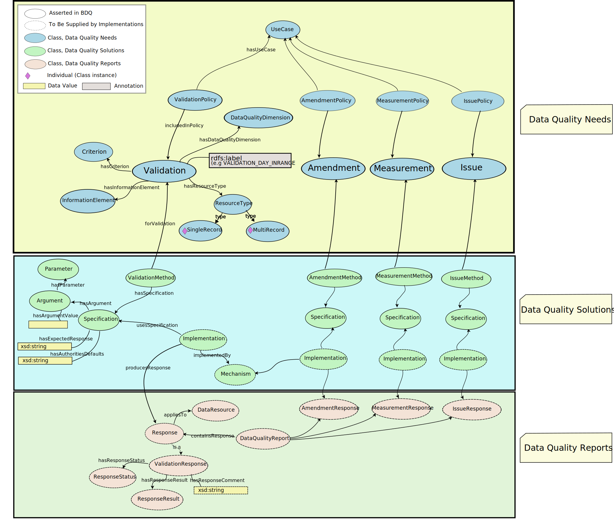
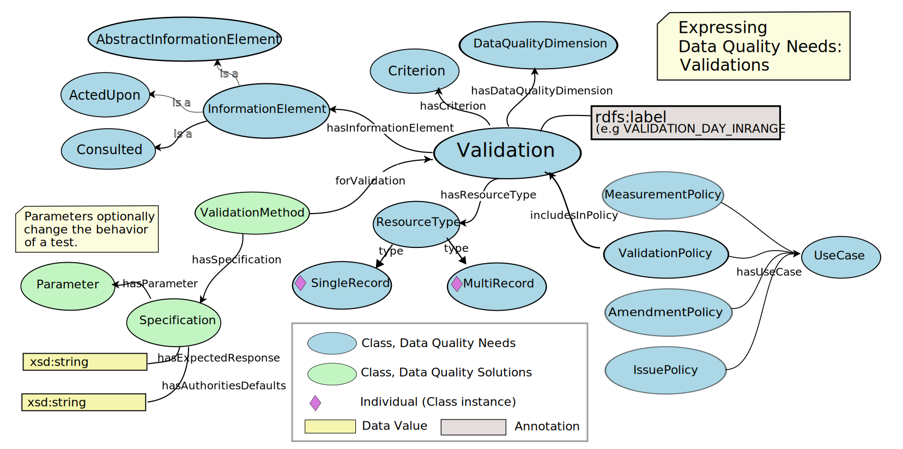
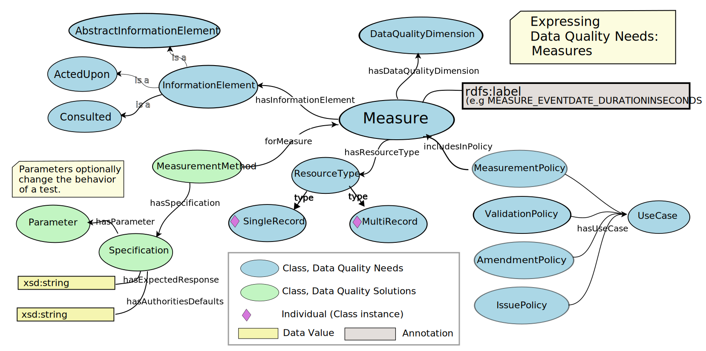
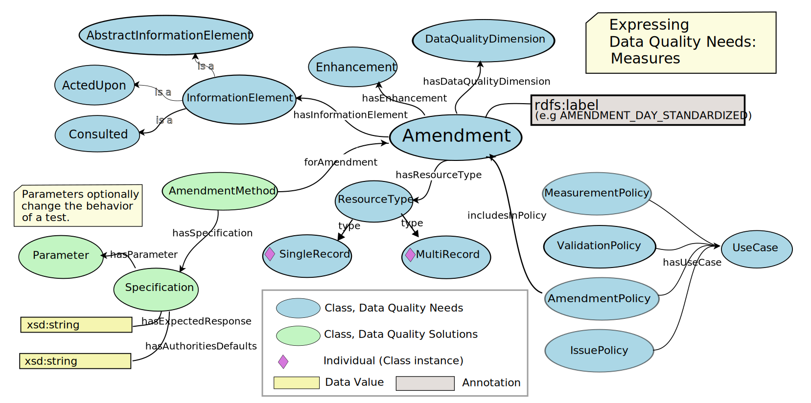
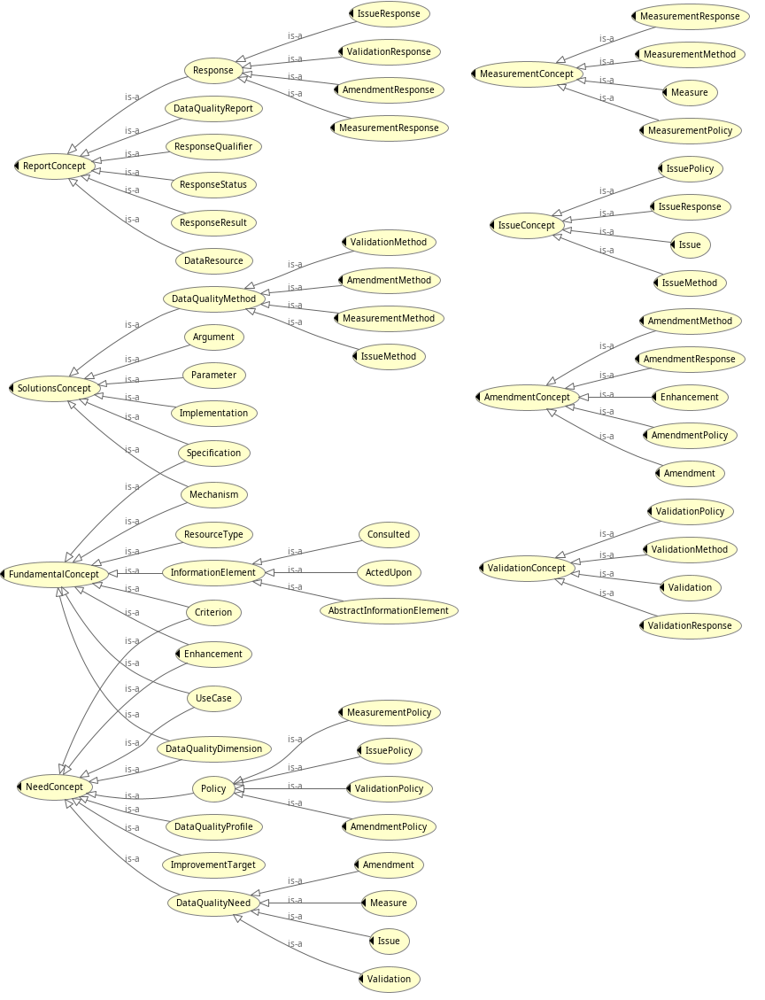

<!-- glossary and vocabulary links autogenerated -->

<!--- This file is generated from templates by code, DO NOT EDIT by hand --->

# Fitness For Use Framework Ontology: Concepts and Use

**Title**<br>
Fitness For Use Framework Ontology: Concepts and Use

**Date version issued**<br>
2025-05-10

**Date created**<br>
2025-05-10

**Part of TDWG Standard**<br>
<http://example.org/to_be_determined>

<!--
**Preferred namespace abbreviation**<br>
{pref_namespace_prefix}
-->

**This version**<br>
<https://rs.tdwg.org/bdq/doc/bdqffdq2025-05-10>

**Latest version**<br>
<https://rs.tdwg.org/bdq/doc/bdqffdq>

**Previous version**<br>

**Abstract**<br>
This document is a guide for the BDQ standard, describing the organization of the bdqffdq: ontology and providing normative guidance on its use. The Fitness For Use Framework ontology formally describes the terms and relationships between them for evaluating the quality of biodiversity data. Because of its comprehensive nature, the Fitness For Use Framework supports varied interpretations and uses by different stakeholders. The Framework also provides a base for the bdqval: and bdqtest: namespace vocabularies.

**Authors**<br>
[Lee Belbin](https://orcid.org/0000-0001-8900-6203) ([Blatant Fabrications](https://www.wikidata.org/wiki/Q130304884)), [Arthur D. Chapman](https://orcid.org/0000-0003-1700-6962) ([Australian Biodiversity Information Services](http://www.wikidata.org/entity/Q100600913)), [Paul J. Morris](https://orcid.org/0000-0002-3673-444X) ([Museum of Comparative Zoology, Harvard University](http://www.wikidata.org/entity/Q1420782)), [John Wieczorek](https://orcid.org/0000-0003-1144-0290) (Rauthiflor LLC)

**Creator**<br>
TDWG Biodiversity Data Quality Interest Group Task Group 2: Data Quality Tests and Assertions

**Bibliographic citation**<br>
TDWG Biodiversity Data Quality Interest Group Task Group 2: Data Quality Tests and Assertions. 2025. Fitness For Use Framework Ontology: Concepts and Use. Biodiversity Information Standards (TDWG). <https://rs.tdwg.org/bdq/doc/bdqffdq2025-05-10>

**Status**<br>
Draft Standard for Review

## Table of Contents ##
[1 Introduction (non-normative)](#1-introduction-non-normative)
  - [1.1 Purpose (non-normative)](#11-purpose-non-normative)
  - [1.2 Audience (non-normative)](#12-audience-non-normative)
  - [1.3 Associated Documents (non-normative)](#13-associated-documents-non-normative)
  - [1.4 Status of the Content of this Document (normative)](#14-status-of-the-content-of-this-document-normative)
  - [1.5 RFC 2119 key words (normative)](#15-rfc-2119-key-words-normative)
  - [1.6 Namespace abbreviations (non-normative)](#16-namespace-abbreviations-non-normative)
  - [1.7 Referring to Terms (normative)](#17-referring-to-terms-normative)

[2 Framework for describing data quality (non-normative)](#2-framework-for-describing-data-quality-non-normative)
  - [2.1 Introduction and Context (non-normative)](#21-introduction-and-context-non-normative)
  - [2.2 Description of the Fitness For Use Framework ontology (non-normative)](#22-description-of-the-fitness-for-use-framework-ontology-non-normative)
    - [2.2.1 Data Quality Control and Data Quality Assurance (non-normative)](#221-data-quality-control-and-data-quality-assurance-non-normative)
    - [2.2.2 Information Elements (non-normative)](#222-information-elements-non-normative)
    - [2.2.3 Concepts in the Framework, Test Types: Validation, Issue, Measure, Amendment (non-normative)](#223-concepts-in-the-framework-test-types-validation-issue-measure-amendment-non-normative)
  - [2.3 Extending to Data Quality Mechanisms and Data Quality Reports (non-normative)](#23-extending-to-data-quality-mechanisms-and-data-quality-reports-non-normative)
  - [2.4 Responses (non-normative)](#24-responses-non-normative)
  - [2.4.1 Properties of Responses (normative)](#241-properties-of-responses-normative)
    - [2.4.1.1 Table of Representations of Response Properties (non-normative)](#2411-table-of-representations-of-response-properties-non-normative)
  - [2.5 Organization of the bdqffdq: classes  (non-normative)](#25-organization-of-the-bdqffdq-classes--non-normative)
  - [2.6 Example representation of a BDQ Test (non-normative)](#26-example-representation-of-a-bdq-test-non-normative)
  - [2.7 Some Other Related Standards (non-normative)](#27-some-other-related-standards-non-normative)
    - [2.7.1 The W3C Web Annotation Data Model (non-normative)](#271-the-w3c-web-annotation-data-model-non-normative)
    - [2.7.2 Relating BDQ Test Results with the PROV Ontology (non-normative)](#272-relating-bdq-test-results-with-the-prov-ontology-non-normative)
    - [2.7.3 The W3C Data Quality Vocabulary (non-normative)](#273-the-w3c-data-quality-vocabulary-non-normative)
    - [2.7.4 Publishing dataset metadata with DCAT (non-normative)](#274-publishing-dataset-metadata-with-dcat-non-normative)
    - [2.7.5 Validating RDF graphs with SHACL (non-normative)](#275-validating-rdf-graphs-with-shacl-non-normative)
    - [2.7.6 Other TDWG vocabularies as sources of Information Elements (non-normative)](#276-other-tdwg-vocabularies-as-sources-of-information-elements-non-normative)

[3 Use of Ontology Terms (normative)](#3-use-of-ontology-terms-normative)
  - [3.1 Use of Properties (normative)](#31-use-of-properties-normative)
    - [3.1.1 Relating Classes and Properties (non-normative)](#311-relating-classes-and-properties-non-normative)
    - [3.1.2 Properties Relating to Data Quality Needs (normative)](#312-properties-relating-to-data-quality-needs-normative)
      - [3.1.2.1 Properties For MultiRecord Measures (normative)](#3121-properties-for-multirecord-measures-normative)
      - [3.1.2.2 MultiRecord Measure Example (non-normative)](#3122-multirecord-measure-example-non-normative)
    - [3.1.3 Properties Relating Data Quality Needs to Data Quality Solutions (normative)](#313-properties-relating-data-quality-needs-to-data-quality-solutions-normative)
    - [3.1.4 Properties Relating to Data Quality Solutions Provided in a Test Description (normative)](#314-properties-relating-to-data-quality-solutions-provided-in-a-test-description-normative)
    - [3.1.5 Properties relating to data quality solutions provided by an implementation (normative)](#315-properties-relating-to-data-quality-solutions-provided-by-an-implementation-normative)
    - [3.1.6 Properties relating Data Quality Reports (normative)](#316-properties-relating-data-quality-reports-normative)
    - [3.2 Identifying the Test that produced a Response (normative)](#32-identifying-the-test-that-produced-a-response-normative)
  - [3.3 Properties that should be one-to-one (normative)](#33-properties-that-should-be-one-to-one-normative)
  - [3.3.1 Cardinality of bdqffdq: terms (non-normative)](#331-cardinality-of-bdqffdq-terms-non-normative)

[4 Fitness For Use Framework Summary of Mathematical Formalization (normative)](#4-fitness-for-use-framework-summary-of-mathematical-formalization-normative)
  - [4.1 Fundamental Concepts (normative)](#41-fundamental-concepts-normative)
  - [4.2 Properties (normative)](#42-properties-normative)
  - [4.3 Notation (normative)](#43-notation-normative)
  - [4.4 Derived Concepts (normative)](#44-derived-concepts-normative)
    - [4.4.1 General (normative)](#441-general-normative)
      - [4.4.1.1 Validation (normative)](#4411-validation-normative)
      - [4.4.1.2 Issue (normative)](#4412-issue-normative)
      - [4.4.1.3 Measure (normative)](#4413-measure-normative)
      - [4.4.1.4 Amendment (normative)](#4414-amendment-normative)
    - [4.4.2 Data Quality Needs (normative)](#442-data-quality-needs-normative)
      - [4.4.2.1 Validation Policy (normative)](#4421-validation-policy-normative)
      - [4.4.2.2 Measurement Policy (normative)](#4422-measurement-policy-normative)
      - [4.4.2.3 Enhancement Policy (normative)](#4423-enhancement-policy-normative)
      - [4.4.2.4 Data Quality Profile (normative)](#4424-data-quality-profile-normative)
      - [4.4.2.5 Use Case Coverage (normative)](#4425-use-case-coverage-normative)
      - [4.4.2.6 Valuable Information Elements (normative)](#4426-valuable-information-elements-normative)
      - [4.4.2.7 Acceptable Data Quality Measure (normative)](#4427-acceptable-data-quality-measure-normative)
      - [4.4.2.8 Improvement Target (normative)](#4428-improvement-target-normative)
    - [4.4.3 Data Quality Solutions (normative)](#443-data-quality-solutions-normative)
      - [4.4.3.1 Validation Method (normative)](#4431-validation-method-normative)
      - [4.4.3.2 Measurement Method (normative)](#4432-measurement-method-normative)
      - [4.4.3.3 Enhancement Method (normative)](#4433-enhancement-method-normative)
      - [4.4.3.4 Implementation  (normative)](#4434-implementation--normative)
      - [4.4.3.5 Mechanism Coverage (normative)](#4435-mechanism-coverage-normative)
    - [4.4.4 Data Quality Reports (normative)](#444-data-quality-reports-normative)
      - [4.4.4.1 Data Resource (normative)](#4441-data-resource-normative)
      - [4.4.4.2 ValidationResponse (normative)](#4442-validationresponse-normative)
      - [4.4.4.3 MeasurementResponse (normative)](#4443-measurementresponse-normative)
      - [4.4.4.4 AmendmentResponse (normative)](#4444-amendmentresponse-normative)
      - [4.4.4.5 Data Quality Assessment (normative)](#4445-data-quality-assessment-normative)
      - [4.4.4.6 Quality Control (normative)](#4446-quality-control-normative)
      - [4.4.4.7 Quality Assurance (normative)](#4447-quality-assurance-normative)

[5 Term index (non-normative)](#5-term-index-non-normative)
  - [5.1 Alphabetical Index of classes (non-normative)](#51-alphabetical-index-of-classes-non-normative)
  - [5.2 Alphabetical Index of object properties (non-normative)](#52-alphabetical-index-of-object-properties-non-normative)
  - [5.3 Alphabetical Index of data properties (non-normative)](#53-alphabetical-index-of-data-properties-non-normative)
  - [5.4 Alphabetical Index of named individuals (non-normative)](#54-alphabetical-index-of-named-individuals-non-normative)

[6 List of Terms with axioms in the Fitness For Use Framework ontology (normative)](#6-list-of-terms-with-axioms-in-the-fitness-for-use-framework-ontology-normative)
  - [6.1 Class terms (normative)](#61-class-terms-normative)
  - [6.2 ObjectProperty terms (normative)](#62-objectproperty-terms-normative)
  - [6.3 DataProperty terms (normative)](#63-dataproperty-terms-normative)
  - [6.4 NamedIndividual terms (normative)](#64-namedindividual-terms-normative)

[Glossary (non-normative)](#glossary-non-normative)

[References (non-normative)](#references-non-normative)

[Cite BDQ (non-normative)](#cite-bdq-non-normative)

## 1 Introduction (non-normative)

### 1.1 Purpose (non-normative)

The purpose of this document is to present the formal ontology of the Biodiversity Data Quality Fitness For Use Framework (the Framework), represented by the `bdqffdq:` vocabulary. This ontology defines the classes, properties, and relationships used to express data quality concepts in a structured and interoperable way, emphasizing that data quality is always relative to a particular purpose (`Use Case`) and the specific `Information Elements` and expectations that apply to that use.

This document combines two complementary roles. First, it provides a practical, explanatory guide to understanding the Framework concepts and how they support the structure and semantics of BDQ Tests, with context and illustrative examples for interpretation and implementation. Second, it serves as the normative companion for use of the ontology: it consolidates the normative guidance on how `bdqffdq:` terms are intended to be used together in RDF/OWL (and, where relevant, in non-RDF representations), including guidance that reflects the open world assumptions of RDF/OWL modeling.

Normative statements in this document specify expected patterns for relating key concepts such as `Use Case`, `Specification`, `Criterion`, `Data Quality Dimension`, `Enhancement`, `Mechanism`, and `Response` in consistent ways that support interoperable `Data Quality Reports` and workflows. The normative definitions of individual terms (e.g., labels, definitions, and axioms for each class or property) are provided in the `bdqffdq:` term-list document, vocabulary extension document, and the OWL ontology itself; this document focuses instead on the normative rules and explanatory rationale for using those terms together coherently.

### 1.2 Audience (non-normative)

This guide is intended for users who need a technical understanding of the Fitness For Use Framework and its ontology. It will be particularly useful for:

- Ontology engineers and information modelers incorporating the BDQ standard into semantic systems.
- Standards developers seeking to align other vocabularies with the BDQ standard.
- Implementers generating or consuming RDF data that describes BDQ Tests or their results.
- Implementers needing to understand how BDQ Tests are formally structured and classified.
- Researchers modeling `Use Cases` for biodiversity data quality assessments.
- Advanced users exploring the logical foundation behind BDQ Test design.

Readers should be familiar with ontology concepts, RDF/OWL syntax, and open world reasoning.

### 1.3 Associated Documents (non-normative)

For the list and links to all associated documents see [The Biodiversity Data Quality (BDQ) Standard](../../../index.md).

Information about the Fitness For Use Framework ontology, its usage, and its extensions can be found in the following subset of BDQ resources:

- **Fitness For Use Framework Ontology: Concepts and Use** - Provides a visual and narrative introduction to the concepts and application of the ontology along with normative guidance *(this document)*.
- [**Fitness For Use Framework Ontology List of Terms**](../../list/bdqffdq/index.md) - The term list document, which enumerates and describes the vocabulary terms.
- [**Fitness For Use Framework Ontology Vocabulary Extension**](../../extension/bdqffdq/index.md) - Defines additional axioms extending the core vocabulary.
- [**Biodiversity Data Quality Fitness For Use Framework (Ontology)**](../../../vocabulary/bdqffdq.owl) - The ontology, which provides the formal RDF/OWL representation of the vocabulary.

### 1.4 Status of the Content of this Document (normative)

Sections may be either normative (defines what is required to comply with the standard) or non-normative (supports understanding but is not binding) and are marked as such. 

Any sentence or phrase beginning with "For example" or "e.g.", whether in a normative section or a non-normative section, is non-normative.

Figures are non-normative.

### 1.5 RFC 2119 key words (normative)

The key words "MUST", "MUST NOT", "REQUIRED", "SHALL", "SHALL NOT", "SHOULD", "SHOULD NOT", "RECOMMENDED", "MAY", and "OPTIONAL" in this document are to be interpreted as described in RFC 2119.

### 1.6 Namespace abbreviations (non-normative)

The following namespace abbreviations are used in this document:

| **Abbreviation** | **Namespace** |
| ------------ | -------------                               |
| bdqval:      | https://rs.tdwg.org/bdqval/terms/           |
| bdqtest:     | https://rs.tdwg.org/bdqtest/terms/          |
| bdqcrit:     | https://rs.tdwg.org/bdqcrit/terms/          |
| bdqdim:      | https://rs.tdwg.org/bdqdim/terms/           |
| bdqffdq:     | https://rs.tdwg.org/bdqffdq/terms/          |
| dcterms:     | http://purl.org/dc/terms/                   |
| dwc:         | http://rs.tdwg.org/dwc/terms/               |
| owl:         | http://www.w3.org/2002/07/owl#              |
| rdfs:        | http://www.w3.org/2000/01/rdf-schema#       |
| skos:        | http://www.w3.org/2004/02/skos/core#        |
| prov:        | http://www.w3.org/ns/prov#                  |
| dqv:         | http://www.w3.org/ns/dqv#                  |
| ldqd:        | http://www.w3.org/2016/05/ldqd#             |
| xsd:         | http://www.w3.org/2001/XMLSchema#           |

### 1.7 Referring to Terms (normative)

In any technical treatment of the BDQ standard, a precise reference to a class or property term SHOULD be made using its qualified name (the namespace prefix followed by the term local name; e.g., `bdqffdq:InformationElement`) and the namespace IRI corresponding to the namespace prefix (e.g., `https://rs.tdwg.org/bdqffdq/terms/` for `bdqffdq:`) MUST be provided. In less formal descriptions where the technical precision is not needed, the preferred label (`skos:prefLabel`, e.g., `Information Element`) or the term local name (e.g., `InformationElement`) MAY be used. The BDQ documents use all these methods.

## 2 Framework for describing data quality (non-normative)

### 2.1 Introduction and Context (non-normative)

The `bdqffdq:` portion of the BDQ standard is a specification for a framework for describing data quality. This Fitness For Use Framework (often referred to simply as "The Framework") is based on a mathematical formulation, using set theory (Veiga, 2016), and is represented as an [OWL](<../../../index.md#glossary_OWL> "[Web Ontology Language](https://www.w3.org/OWL/). A Semantic Web language designed to represent rich and complex knowledge about things. Hosts the namespace [owl:](http://www.w3.org/2002/07/owl#)") ontology. This document describes the organization and use of the OWL ontology.  While the Fitness For Use Framework is described within a Biodiversity Data Quality context, the concepts and structure of the Framework are applicable to data quality in any domain. 

This document provides a background for understanding the `bdqtest:` [Test](<../../../index.md#glossary_Test> "A composition of a `bdqffdq:DataQualityNeed` with a `bdqffdq:DataQualityMethod` that links it to an instance of a `bdqffdq:Specification`, these instances being composed of `InformationElements`, `Arguments`, and `Param…") descriptions. Each of the Tests in the `bdqtest:` namespace have been designed and described within this Framework and are framed using the terms and concepts from the Framework. The Fitness For Use Framework provides the context for each Test, and has shaped decisions made about each Test.

This document provides a concise description and normative information about the `bdqffdq:` ontology and a summary of the mathematical formalization. See the [Fitness For Use Framework Ontology List of Terms](../../list/bdqffdq/index.md) document for the list of terms in the `bdqffdq:` vocabulary. See the [Fitness For Use Framework Ontology Vocabulary Extension](../../extension/bdqffdq/index.md) for documentation on additional axioms. See the [Biodiversity Data Quality Fitness For Use Framework (Ontology)](../../../vocabulary/bdqffdq.owl) for the formal representation of the vocabulary as an OWL ontology. The mathematical formalization provides a description of inferences and reasoning that may be made with the terms in the vocabulary.

### 2.2 Description of the Fitness For Use Framework ontology (non-normative)

The Fitness For Use Framework defines data quality in relation to a specified use, emphasizing that data quality is not abstract but purpose-dependent. It provides a formal way to describe a `Use Case` ([bdqffdq:UseCase](<../../list/bdqffdq/index.md#UseCase> "A bdqffdq:NeedConcept expressing a purpose to which data are put for which the data must have quality for the result to have meaning and reliability.")) and the criteria for evaluating whether a dataset is fit for that purpose. By linking data quality explicitly to use, the Framework enables consistent assessment and assurance of fitness for a given purpose.

The Framework can be conceptually divided into three horizontal layers: `Data Quality Needs`, `Data Quality Solutions`, and `Data Quality Reports`. Needs describe what it means for data to have quality for some use, Solutions describe tools to evaluate quality, and Reports are produced by Solutions to describe the evaluation of quality in particular datasets. `Data Quality Solutions` (the Solutions layer) are realized by `Mechanisms` via `Implementations`.

The Framework can also be conceptually divided into four vertical themes, four sets of related concepts that carry through the Needs, Solutions, and Reports layers. These concepts are `Validation`, `Issue`, `Measure`, and `Amendment`. 

In BDQ, "Test" is used as an informal umbrella term to describe these four vertical concept families (`Validation`, `Issue`, `Measure`, `Amendment`), as they connect and involve terms in both the `Data Quality Needs` and `Data Quality Solutions` layers.  See the diagram in [BDQ Tests: An Operational Perspective](../bdqtest/index.md#51-bdq-tests-an-operational-perspective-non-normative).

**Data Quality Needs** begin with a `Use Case`, a formal description of a purpose for which data may be used. Each `Use Case` includes a set of `Policies`, which in turn relate to `Data Quality Needs`.  The `Data Quality Needs` (i.e., `Validation`, `Measure`, `Amendment`, `Issue`) specify the data quality requirement (Need), the relevant `Information Elements` (such as specific [Darwin Core](<../../../index.md#glossary_Darwin_Core> "[Darwin Core](https://dwc.tdwg.org/). A Standard intended to facilitate the sharing of information about biological diversity. Host of the dwc:namespace [dwc:](http://rs.tdwg.org/dwc/terms/)") terms), and the `Resource Type` the requirement applies to. A 'Data Quality Need` defines the properties data must have to be considered fit for use and may include ways to improve unfit data. The Tests described in this standard are formal specifications of such `Data Quality Needs` for BDQ purposes.

**Data Quality Mechanisms** are formal descriptions of software or other tools that implement the Tests. They execute the `Specifications` defined in the Needs layer.

**Data Quality Reports** are the outputs generated when `Mechanisms` are applied to data. The Tests include formal specifications of `Responses` that are expected to appear in these Reports.

We can visualize the Framework's Needs, Solutions, and Reports layers, and then follow the Test concepts vertically through each layer (see [Figure 3](https://journals.plos.org/plosone/article?id=10.1371/journal.pone.0178731#pone-0178731-g003) in Veiga et al., 2017). Below is a diagram that brings together the horizontal Needs, Solutions, and Reports layers with the vertical Test concepts (`Validations`, `Issues`, `Measures` and `Amendments`), with `Validation`-related concepts expanded to show all related entities in the Fitness For Use Framework.



*All four Tests concepts in the Needs Solutions, and Reports levels.*

#### 2.2.1 Data Quality Control and Data Quality Assurance (non-normative)

The Framework draws a distinction between **Quality Control** and **Quality Assurance**. Quality Control processes seek to assess the quality of data for some purpose, then identify changes to the data or to processes around the data to improve their quality. Quality Assurance processes seek to filter some set of data to a subset that is fit for some purpose, that is, to assure that data used for some purpose are fit for that purpose.

For **Quality Assurance**, the Framework defines `Measures` that operate on `Multi Records` and return a `Response.result` of `COMPLETE` or `NOT_COMPLETE`. A `Multi Record` `Measure` may be `COMPLETE` if all aggregated instances of a related `Single Record` `Validation` are `COMPLIANT`.

For **Quality Control**, `Multi Record` `Measures` can return numeric summaries of the results of other Tests (e.g. count of `COMPLIANT` results for a `Validation`), thereby indicating how fit a dataset is for its intended purpose and how many adjustments are needed to make it fully fit.

It is important to recognize that BDQ does not standardize complete `Quality Control` or `Quality Assurance` workflows (e.g., user roles, review and remediation procedures, pipelines, thresholds, or reporting formats). Instead, BDQ standardizes the semantics of Tests and their `Responses` and provides `Measure` patterns that can be used to support `Quality Control` and `Quality Assurance` workflows in a consistent way.

#### 2.2.2 Information Elements (non-normative)

`Information Elements` are the inputs to a Test, they identify the specific data elements that are evaluated in a Test. `Information Elements` are the properties of data that are examined to determine if the data meet the quality requirements for a given `Use Case`.

The Framework has both an abstract and concrete concept of `Information Elements`. To frame Tests on Darwin Core terms in a usable way, we list specific Darwin Core terms as the concrete `Information Elements` in each Test.

#### 2.2.3 Concepts in the Framework, Test Types: Validation, Issue, Measure, Amendment (non-normative)

The Framework defines four central concepts for describing and evaluating `Data Quality Needs`: `Validation`, `Issue`, `Measure`, and `Amendment`.  


*The 4 central DataQualityNeed types in the Framework - Validation, Issue, Measure, and Amendment.*

A `Validation` assesses compliance with a need. Data have quality if they are compliant with the requirements of the `Validation` Test. A `Validation` relates `Information Elements` and `Resource Types` with a `Specification` of exactly how to assess fitness of the data under some narrow `Criteria`, and themselves are assembled into `Validation Policies`, which are linked to other `Policies` to cover a description of the `Data Quality Needs` of a `Use Case`.  Data have quality only with respect to some use, so `Validations` must be composed with `Use Cases` to be able to assess fitness for use.



*Expressing `Data Quality Needs`: Validations.*

`Issues` are the converse of `Validations`. Data lack quality if an `Issue` identifies a potential problem in the data that would require further human review to determine if the data have quality for some purpose.  Like `Validations`, `Issues` relate `Information Elements` and `Resource Types` with a `Specification` of exactly how to assess fitness of the data under some `Use Case`.  No illustration is provided here, as the `Issue` concept is very similar to the `Validation` concept, but with a different focus on identifying potential problems rather than confirming compliance.  

`Validations`, `Measures`, `Amendments`, and `Issues` all share a similar set of relationships to other classes in the Framework.  The following diagrams for `Measures` and `Amendments` highlight these similarities, with classes and relationships that differ called out with thicker line weights.

`Measures` make an aggregate summary of some specific aspect of data quality.



*Expressing Data Quality Needs: Measures.*

`Amendments` propose changes to data or processes that, if accepted, may improve the fitness of data for a specific use.



*Expressing Data Quality Needs: Amendments.*

Formally, in the `Data Quality Needs` level, the Framework starts with a `Use Case`, a framing of some use to which data may be put. `Use Cases` are related to the formal description of `Data Quality Needs` through `Policies`. `Data Quality Needs`, such as a `Validation` are related to the `Information Elements` that need to be examined, and to the `Resource Type` that is operated on.  `Methods` such as `ValidationMethod` relate the `Data Quality Needs` to `Specifications` for the evaluation of those needs.  The `Data Quality Need` specifies in general terms what properties data must have to have quality, and the related `Specification` provides a formal description of how to evaluate that aspect of quality.

Each of the Tests described in the BDQ standard has a formal specification that includes each of these elements. 

`Data Quality Needs` can relate to the data quality of single records ([bdqffdq:SingleRecord](<../../list/bdqffdq/index.md#SingleRecord> "A single entity comprised of encoded data with a defined structure that contains one instance of a core concept from the perspective of bdqffdq:InformationElements assessed for a bdqffdq:DataQualityNeed.")) or of datasets ([bdqffdq:MultiRecord](<../../list/bdqffdq/index.md#MultiRecord> "A set of one or more bdqffdq:SingleRecords.")).


*Representation of Single Record and Multi Record as named individual instances of the Resource class.*

### 2.3 Extending to Data Quality Mechanisms and Data Quality Reports (non-normative)

Software that implements one or more tests is a `Mechanism`. A `Mechanism` is a formal description of a software tool that implements one or more Tests.  Each of those Tests has an `Implementation` in that `Mechanism`, which is a formal description of how the `Mechanism` implements the Test.  An `Implementation` is linked via [bdqffdq:usesSpecification](<../../list/bdqffdq/index.md#usesSpecification> "The bdqffdq:Specification that a bdqffdq:Implementation implements.") to the specification of a Test.  An `Implementation` also produces `Responses` that are linked to the `Implementation` via [bdqffdq:producesResponse](<../../list/bdqffdq/index.md#producesResponse> "Connects an entity with a bdqffdq:Response that the entity created.") and may be assembled into `Data Quality Reports`.

The property `bdqffdq:usesSpecification` draws a separation between the specification of how a Test is defined and an actual concrete implementation of that Test in software. This separation allows for multiple implementations of the same Test, and for implementations to evolve independently of the Test specifications.

A Test, conceptually, is a set of classes and properties that provide a formal description of what outputs a software implementation should produce for given inputs.  The classes are a `Specification` linked through a `Data Quality Method` (`Validation Method`, `Issue Method`, `Measure Method`, and `Amendment Method`) to a `Data Quality Need` (`Validation`, `Issue`, `Measure`, or `Amendment`).  The properties associated with the `Data Quality Need` provide a general description of what aspect of data quality the Test assesses (and what its inputs are), while the properties associated with the `Specification` provide the specific details of the expected behavior of the Test needed for a developer to implement the Test.  The `bdqtest:` vocabulary provides these specific details for each Test, independent of any particular software implementation.

On the other side of `bdqffdq:usesSpecification`, a software implementation of a Test produces `Responses`.  These are the outputs of Test execution, and provide an assessment of the fitness of some data for some use.  Thus The Fitness For Use Framework divides responsibilities between the specification of what is needed for data to have quality (`Use Cases` and Tests)  and the software implementations of those Tests with the actual assertions about data quality in `Responses` produced by those implementations.

Below is a diagram of the composition of `Validation`, `Validation Method`, and `Validation Response` illustrating the `Data Quality Needs`, `Solutions`, and `Reports` layers of the Fitness For Use Framework, identifying the responsibilities of `bdqtest:` (shown with solid lines), and implementations (shown with dashed lines).


*Validation concepts in the Needs, Solutions, and Reports levels.*

### 2.4 Responses (non-normative)

The content of this section is non-normative, related normative guidance is in section [5.1 The Response Object (normative)](../implementers/index.md#51-the-response-object-normative) of the [BDQ Implementer's Guide](../implementers/index.md).

A `Response` is a formal description of the output of a Test, including the status of the Test execution, the result of the Test, and any comments or qualifiers that provide additional information about the result.  `Responses` can be assembled into `Data Quality Reports` that summarize the results of applying one or more Tests to a dataset.  

`Responses` are typed as `Validation Response`, `Issue Response`, `Measure Response`, or `Amendment Response` depending on the type of Test that produced them.


*The 4 `Response` types in the Framework - `ValidationResponse`, `IssueResponse`, `MeasureResponse` and `AmendmentResponse`.*

`Response` objects may be represented in an [RDF](<../../../index.md#glossary_RDF> "Resource Description Framework - a W3C standard for modeling, interchanging, and linking structured data on the web. Hosts the namespace [rdf:](http://www.w3.org/1999/02/22-rdf-syntax-ns#)") context as a combination of object properties and data properties on a `Response` resource.  In a non-RDF context, such as JSON or a tabular format, a `Response` might be represented as an object with properties or as a row with columns for each of the properties.  The key properties of a `Response` are `Response.status`, `Response.result`, `Response.comment`, and optionally, `Response.qualifier`.  In a non-RDF context, these may be simple fields in a structured data format, while in an RDF context, these would be represented using the appropriate properties from the `bdqffdq:` vocabulary (e.g., [bdqffdq:hasResponseStatus](<../../list/bdqffdq/index.md#hasResponseStatus> "The bdqffdq:ResponseStatus object asserted by a bdqffdq:Response."), [bdqffdq:hasResponseResult](<../../list/bdqffdq/index.md#hasResponseResult> "The bdqffdq:ResponseResult object asserted by a bdqffdq:Response."), [bdqffdq:hasResponseComment](<../../list/bdqffdq/index.md#hasResponseComment> "Free text describing the bdqffdq:Response made in the response and why that conclusion was reached."), and [bdqffdq:hasResponseQualifier](<../../list/bdqffdq/index.md#hasResponseQualifier> "ResponseQualifier object asserted by an Response.")) where the distinction between categorical values (e.g. using `bdqffdq:hasResponseResult`) and literal values (e.g. using [bdqffdq:hasResponseResultValue](<../../list/bdqffdq/index.md#hasResponseResultValue> "Data property carrying the value of a bdqffdq:Response when the value is not an object.")) is important.

It is expected that instances of `Response` objects will involve, in RDF, a combination of object properties and data properties on a `Response`.  In an object oriented language like [Java](<../../../index.md#glossary_Java> "Java is a registered trademark of Oracle and/or its affiliates."), a `Response` might be an object with properties, and in a tabular format, a `Response` might be a row with columns for each of the properties. The following table gives an overview of the expected properties of a `Response` object, and the corresponding terms in the `bdqffdq:` vocabulary.

| Shorthand Concept | bdqffdq: Term(s) | Description |
| ----------------- | ---------------- | ----------- |
| Response | bdqffdq:Response | The report from a single execution of a single Test, consisting of a Response.status, a Response.result, a Response.comment, and optionally, a Response.qualifier.| 
| Response.status | bdqffdq:ResponseStatus, bdqffdq:hasResponseStatus | A metadata element in a `Response` indicating whether a particular Test (bdqffdq:Validation, bdqffdq:Issue, bdqffdq:Measure, or bdqffdq:Amendment) was able to be performed or not. |
| Response.result | bdqffdq:ResponseResult, bdqffdq:hasResponseResult, bdqffdq:hasResponseResultValue | The element in a `Response` containing the value returned by a Test (bdqffdq:Validation, bdqffdq:Issue, bdqffdq:Measure, or bdqffdq:Amendment)|
| Response.comment | bdqffdq:hasResponseComment | A human readable interpretation of the results of the Test.|
| Response.qualifier | bdqffdq:ResponseQualifier, bdqffdq:hasResponseQualifier | Additional structured information that qualifies the `Response`, intended as an extension point for uncertainty.|

See [4.1 Structure of a Response (normative)](../../guide/bdqtest/index.md#41-structure-of-response-normative) in [BDQ Tests: Concepts and Use](../../guide/bdqtest/index.md) for further normative guidance on Responses as RDF or as data structures in non-RDF settings.

### 2.4.1 Properties of Responses (normative) 

In an RDF context, the status property of a `Response` MUST be represented using an [IRI](<../../../index.md#glossary_IRI> "Internationalized Resource Identifier is an internet protocol standard which builds on the Uniform Resource Identifier (URI) protocol by greatly expanding the set of permitted characters.") (e.g., [bdqffdq:RUN_HAS_RESULT](<../../list/bdqffdq/index.md#RUN_HAS_RESULT> "A bdqffdq:ResponseStatus used to indicate that that a result was correctly generated.")) as the object of `bdqffdq:hasResponseStatus`.

In an RDF context, the result property of a `Response` MUST be represented using:
- `bdqffdq:hasResponseResult` when the result is categorical and comes from the controlled set of [bdqffdq:ResponseResult](<../../list/bdqffdq/index.md#ResponseResult> "A bdqffdq:ReportConcept to which controlled vocabulary bdqffdq:Responses about the result of the execution of the bdqffdq:Specification of a bdqffdq:DataQualityNeed are attached.") named individuals (e.g., [bdqffdq:COMPLIANT](<../../list/bdqffdq/index.md#COMPLIANT> "A bdqffdq:ResponseResult of a bdqffdq:Validation where the data conforms to the bdqffdq:Criteria for quality in the Test bdqffdq:Specification."), [bdqffdq:NOT_COMPLIANT](<../../list/bdqffdq/index.md#NOT_COMPLIANT> "A bdqffdq:ResponseResult of a bdqffdq:Validation where the data do not conform to the bdqffdq:Criteria for quality in the Test bdqffdq:Specification."), [bdqffdq:COMPLETE](<../../list/bdqffdq/index.md#COMPLETE> "A bdqffdq:ResponseResult of a bdqffdq:Measure that asserts that data are present and sufficiently comprehensive for use."), [bdqffdq:NOT_COMPLETE](<../../list/bdqffdq/index.md#NOT_COMPLETE> "A bdqffdq:ResponseResult of a bdqffdq:Measure which asserts that data are not present or are not sufficiently comprehensive for a use."), [bdqffdq:POTENTIAL_ISSUE](<../../list/bdqffdq/index.md#POTENTIAL_ISSUE> "A bdqffdq:ResponseResult of a bdqffdq:Issue that indicates that the data may not have sufficient quality for a use. The user will need to evaluate if the data are fit for their particular use or not."), [bdqffdq:NOT_ISSUE](<../../list/bdqffdq/index.md#NOT_ISSUE> "A bdqffdq:ResponseResult of a bdqffdq:Issue where no potential problems were detected.")); or
- `bdqffdq:hasResponseResultValue` when the result is a literal payload (e.g., a numeric measurement, a string, or structured text such as JSON for an `Amendment` proposal). The value of `bdqffdq:hasResponseResultValue` MUST be a literal and SHOULD use an appropriate datatype (e.g., `xsd:integer`, `rdf:JSON`).

In a non-RDF structured-data context (JSON, database, CSV), where [bdqffdq:ResponseStatus](<../../list/bdqffdq/index.md#ResponseStatus> "A bdqffdq:ReportConcept expressing controlled vocabulary values about the exit state of an execution process of a data quality bdqffdq:Specification by a bdqffdq:Implementation.") and `bdqffdq:ResponseResult` are represented as strings, controlled values MUST be used and the values MUST be the local names (e.g., `RUN_HAS_RESULT`, `COMPLIANT`), unless the result is a literal value (corresponding to use of `bdqffdq:hasResponseResultValue` in RDF), in which case the value MUST be that literal.

Labels MAY be used purely for display.

This section summarizes representation choices. Full normative constraints on the response structure of `Responses` is found in [4.1 Structure of Response (normative)](../bdqtest/index.md#41-structure-of-response-normative) of the [BDQ Tests: Concepts and Use](../bdqtest/index.md) document.

#### 2.4.1.1 Table of Representations of Response Properties (non-normative)

Summary of the expected properties of a `Response` object, and the corresponding terms in the `bdqffdq:` vocabulary, with examples of RDF and non-RDF representations.

| Context | Informal Response property | RDF predicate / field | Required representation | Example |
|---------|-----------------------------|-----------------------|-------------------------|---------|
| RDF | `Response.status` (categorical) | `bdqffdq:hasResponseStatus` | IRI of a named individual | `bdqffdq:RUN_HAS_RESULT` |
| RDF | `Response.result` (categorical) | `bdqffdq:hasResponseResult` | IRI of a named individual | `bdqffdq:COMPLIANT` |
| RDF | `Response.result` (literal) | `bdqffdq:hasResponseResultValue` | Literal (SHOULD use an appropriate datatype) | `"17"^^xsd:integer` |
| RDF | `Response.comment` (literal) | `bdqffdq:hasResponseComment` | Literal (string; MAY be language-tagged) | `"Provided value 11 is a valid dwc:day."@en` |
| Non-RDF structured data (categorical) | `Response.status` | string corresponding to `bdqffdq:ResponseStatus` | controlled value local name string | `RUN_HAS_RESULT` |
| Non-RDF structured data (categorical) | `Response.result` | string corresponding to `bdqffdq:ResponseResult` | controlled value local name string | `COMPLIANT` |
| Non-RDF structured data (literal) | `Response.result` | field corresponding to `bdqffdq:hasResponseResultValue` | literal | `17` |
| Non-RDF structured data (literal) | `Response.comment` | field corresponding to `bdqffdq:hasResponseComment` | literal (string) | `Provided value 11 is a valid dwc:day.` |

A `bdqffdq:hasResponseStatus` is always categorical, a `bdqffdq:hasResponseComment` is always literal, a `Response.result` may be either a categorical `bdqffdq:hasResponseResult` or a literal `bdqffdq:hasResponseResultValue`.  

It is precisely because of this potential for results to be represented as RDF or as non-RDF structured data that the `Named Individuals` such as `bdqffdq:COMPLIANT` used in results are given labels in all upper case with underscores to facilitate their use and recognition as string constant values in non-RDF contexts.

### 2.5 Organization of the bdqffdq: classes  (non-normative)

Following is a knowledge graph showing the is-a relationships between the classes in the Fitness For Use Framework:


*Diagram showing the relationships among the bdqffdq: classes.*

### 2.6 Example representation of a BDQ Test (non-normative)

Below is a fragment in Turtle describing VALIDATION_COUNTRY_FOUND, composed of a `Validation`, linking an `Acted Upon` `Information Element`, a `Criterion`, and the `Resource Type` `Single Record`, with the `Validation` linked to a `Validation Method`, and from there a `Specification`. Also shown is a `Validation Policy` linking this `Validation` to a `Use Case`.

```turtle
    bdqtest:69b2efdc-6269-45a4-aecb-4cb99c2ae134-2025-03-07 a bdqffdq:Validation;
      bdqffdq:hasResourceType bdqffdq:SingleRecord;
      skos:note "Non-country information such as \"high seas\" will fail this Test (high seas should use dwc:countryCode = \"XZ\" and have dwc:country empty). Getty Place Types for administrative level \"nation\" are 81010 nation, 81011 independent sovereign nation, and 81012 independent nation. Multiple values in the dwc:country field (whether to signify on a border or in a list of possibilities) will fail this Test. Locations outside of a jurisdiction covered by a country code should not have a value in the field dwc:countryCode. This Test should find any matches at the Getty \"nation\" level including internationalized names and historical representations of that nation (where boundaries are same). This Test must return NOT_COMPLIANT if there is leading or trailing whitespace or there are leading or trailing non-printing characters.";
      bdqffdq:hasDataQualityDimension bdqdim:Conformance;
      bdqffdq:hasCriterion bdqcrit:Found;
      bdqffdq:hasActedUponInformationElement <urn:uuid:30db5994-81fa-4684-ac54-cfc226209d27>;
      dcterms:issued "2025-03-07"^^xsd:date;
      dcterms:bibliographicCitation "Getty Research Institute (2017) Getty Thesaurus of Geographic Names Online. https://www.getty.edu/research/tools/vocabularies/tgn/index.html; Chapman AD and Wieczorek JR (2020) Georeferencing Best Practices. Copenhagen: GBIF Secretariat. https://doi.org/10.15468/doc-gg7h-s853";
      rdfs:comment "Does the value of dwc:country occur in the bdqval:sourceAuthority?";
      skos:historyNote "https://github.com/tdwg/bdq/issues/21";
      rdfs:label "VALIDATION_COUNTRY_FOUND";
      dcterms:isVersionOf bdqtest:69b2efdc-6269-45a4-aecb-4cb99c2ae134;
      skos:prefLabel "Validation dwc:country Found for SingleRecord" .
    
    bdqcrit:Found a bdqffdq:Criterion;
      rdfs:label "Found" . 
    
    bdqdim:Conformance a bdqffdq:DataQualityDimension;
      rdfs:label "Conformance" .
    
    <urn:uuid:30db5994-81fa-4684-ac54-cfc226209d27> a bdqffdq:ActedUpon;
      bdqffdq:composedOf dwc:country;
      rdfs:label "Information Element ActedUpon dwc:country";
      skos:prefLabel "Information Element ActedUpon dwc:country" .
    
    <urn:uuid:04cee4e0-0c83-40cc-8de2-e7391f0a97a9> a bdqffdq:ValidationMethod;
      skos:note "Example Implementations: Kurator/FilteredPush geo_ref_qc Library (Morris & Lowery 2025b)",
        "Example Implementations Source Code: https://github.com/FilteredPush/geo_ref_qc/blob/v2.0.1/src/main/java/org/filteredpush/qc/georeference/DwCGeoRefDQ.java#L158",
        "TG2 Validation SPACE CODED Test VOCABULARY Conformance Parameterized CORE";
      bdqffdq:hasSpecification <urn:uuid:051f6ad7-1a4b-4e6c-8a1d-2af76de24848>;
      skos:historyNote "Source: ALA, GBIF";
      rdfs:label "ValidationMethod: VALIDATION_COUNTRY_FOUND with Specification for: VALIDATION_COUNTRY_FOUND";
      skos:prefLabel "ValidationMethod: VALIDATION_COUNTRY_FOUND with Specification for: VALIDATION_COUNTRY_FOUND";
      bdqffdq:forValidation bdqtest:69b2efdc-6269-45a4-aecb-4cb99c2ae134-2025-03-07 .
    
    <urn:uuid:051f6ad7-1a4b-4e6c-8a1d-2af76de24848> a bdqffdq:Specification;
      skos:example "dwc:country=\"Eswatini\": Response.status=RUN_HAS_RESULT, Response.result=COMPLIANT, Response.comment=\"dwc:country is a valid country name in the bdqval:sourceAuthority\"",
        "dwc:country=\"Tasmania\": Response.status=RUN_HAS_RESULT, Response.result=NOT_COMPLIANT, Response.comment=\"Tasmania is not found at the level of national in the bdqval:sourceAuthority\"";
      bdqffdq:hasAuthoritiesDefaults "bdqval:sourceAuthority default = \"The Getty Thesaurus of Geographic Names (TGN)\" {[https://www.getty.edu/research/tools/vocabularies/tgn/index.html]}";
      rdfs:comment "EXTERNAL_PREREQUISITES_NOT_MET if the bdqval:sourceAuthority is not available; INTERNAL_PREREQUISITES_NOT_MET if dwc:country is bdqval:Empty; COMPLIANT if value of dwc:country is a place type equivalent to administrative entity of \"nation\" in the bdqval:sourceAuthority; otherwise NOT_COMPLIANT bdqval:sourceAuthority default = \"The Getty Thesaurus of Geographic Names (TGN)\" {[https://www.getty.edu/research/tools/vocabularies/tgn/index.html]}";
      bdqffdq:hasExpectedResponse "EXTERNAL_PREREQUISITES_NOT_MET if the bdqval:sourceAuthority is not available; INTERNAL_PREREQUISITES_NOT_MET if dwc:country is bdqval:Empty; COMPLIANT if value of dwc:country is a place type equivalent to administrative entity of \"nation\" in the bdqval:sourceAuthority; otherwise NOT_COMPLIANT";
      rdfs:label "Specification for: VALIDATION_COUNTRY_FOUND";
      bdqffdq:hasArgument <urn:uuid:3e00109a-13d3-416d-9a91-127c99b47473> .
    
    <urn:uuid:3e00109a-13d3-416d-9a91-127c99b47473> a bdqffdq:Argument;
      bdqffdq:hasArgumentValue "The Getty Thesaurus of Geographic Names (TGN)";
      rdfs:label "Default value for bdqval:sourceAuthority:\"The Getty Thesaurus of Geographic Names (TGN)\"";
      bdqffdq:hasParameter bdqval:sourceAuthority .
  
    bdqval:sourceAuthority a bdqffdq:Parameter .     
    
    <urn:uuid:0053ca4f-7d45-41ea-912e-c8847bb70142> a bdqffdq:ValidationPolicy;
      rdfs:label "ValidationPolicy: (49) validations  in UseCase bdqval:Spatial-Temporal_Patterns";
      bdqffdq:hasUseCase bdqval:Spatial-Temporal_Patterns;
      bdqffdq:includedInPolicy bdqtest:0493bcfb-652e-4d17-815b-b0cce0742fbe-2025-03-07,
        bdqtest:69b2efdc-6269-45a4-aecb-4cb99c2ae134-2025-03-07, bdqtest:8f1e6e58-544b-4365-a569-fb781341644e-2025-03-07,
        bdqtest:0949110d-c06b-450e-9649-7c1374d940d1-2025-03-07, bdqtest:f51e15a6-a67d-4729-9c28-3766299d2985-2025-03-07,
        bdqtest:3cff4dc4-72e9-4abe-9bf3-8a30f1618432-2025-03-06, bdqtest:0bb8297d-8f8a-42d2-80c1-558f29efe798-2025-03-07,
        bdqtest:58486cb6-1114-4a8a-ba1e-bd89cfe887e9-2025-03-07, bdqtest:6ce2b2b4-6afe-4d13-82a0-390d31ade01c-2025-03-07,
        bdqtest:3f335517-f442-4b98-b149-1e87ff16de45-2025-03-06, bdqtest:c09ecbf9-34e3-4f3e-b74a-8796af15e59f-2025-03-06,
        bdqtest:adb27d29-9f0d-4d52-b760-a77ba57a69c9-2025-03-07, bdqtest:b9c184ce-a859-410c-9d12-71a338200380-2025-03-07,
        bdqtest:f18a470b-3fe1-4aae-9c65-a6d3db6b550c-2025-03-07, bdqtest:ac2b7648-d5f9-48ca-9b07-8ad5879a2536-2025-03-07,
        bdqtest:7e0c0418-fe16-4a39-98bd-80e19d95b9d1-2025-03-07, bdqtest:b23110e7-1be7-444a-a677-cdee0cf4330c-2025-03-07,
        bdqtest:4f2bf8fd-fc5c-493f-a44c-e7b16153c803-2025-03-06, bdqtest:66269bdd-9271-4e76-b25c-7ab81eebe1d8-2025-03-07,
        bdqtest:4c09f127-737b-4686-82a0-7c8e30841590-2025-03-06, bdqtest:dc8aae4b-134f-4d75-8a71-c4186239178e-2025-03-07,
        bdqtest:239ec40e-a729-4a8e-ba69-e0bf03ac1c44-2025-03-07, bdqtest:b6ecda2a-ce36-437a-b515-3ae94948fe83-2025-03-07,
        bdqtest:7c4b9498-a8d9-4ebb-85f1-9f200c788595-2025-03-06, bdqtest:ad0c8855-de69-4843-a80c-a5387d20fbc8-2025-03-06,
        bdqtest:1bf0e210-6792-4128-b8cc-ab6828aa4871-2025-03-07, bdqtest:41267642-60ff-4116-90eb-499fee2cd83f-2025-03-06,
        bdqtest:cdaabb0d-a863-49d0-bc0f-738d771acba5-2025-03-07, bdqtest:9beb9442-d942-4f42-8b6a-fcea01ee086a-2025-03-07,
        bdqtest:853b79a2-b314-44a2-ae46-34a1e7ed85e4-2025-03-07, bdqtest:374b091a-fc90-4791-91e5-c1557c649169-2025-03-07,
        bdqtest:42408a00-bf71-4892-a399-4325e2bc1fb8-2025-03-07, bdqtest:06851339-843f-4a43-8422-4e61b9a00e75-2025-03-06,
        bdqtest:04b2c8f3-c71b-4e95-8e43-f70374c5fb92-2025-03-07, bdqtest:d708526b-6561-438e-aa1a-82cd80b06396-2025-03-07,
        bdqtest:c6adf2ea-3051-4498-97f4-4b2f8a105f57-2025-03-07, bdqtest:c971fe3f-84c1-4636-9f44-b1ec31fd63c7-2025-03-07,
        bdqtest:7af25f1e-a4e2-4ff4-b161-d1f25a5c3e47-2025-03-07, bdqtest:eb4a17f6-6bea-4cdd-93dd-d5a7e9d1eccf-2025-03-07,
        bdqtest:7d2485d5-1ba7-4f25-90cb-f4480ff1a275-2025-03-07, bdqtest:8d787cb5-73e2-4c39-9cd1-67c7361dc02e-2025-03-06,
        bdqtest:01c6dafa-0886-4b7e-9881-2c3018c98bdc-2025-03-06, bdqtest:85803c7e-2a5a-42e1-b8d3-299a44cafc46-2025-03-06,
        bdqtest:9a39d88c-7eee-46df-b32a-c109f9f81fb8-2025-03-06, bdqtest:47ff73ba-0028-4f79-9ce1-ee7008d66498-2025-03-06,
        bdqtest:3f1db29a-bfa5-40db-9fd1-fde020d81939-2025-03-07, bdqtest:4daa7986-d9b0-4dd5-ad17-2d7a771ea71a-2025-03-07,
        bdqtest:d257eb98-27cb-48e5-8d3c-ab9fca4edd11-2025-03-07, bdqtest:4eb48fdf-7299-4d63-9d08-246902e2857f-2025-03-07;
      skos:prefLabel "ValidationPolicy: (49) validations  in UseCase bdqval:Spatial-Temporal_Patterns" .
```

### 2.7 Some Other Related Standards (non-normative)

This section is non-normative and is intended only to highlight standards that can be used alongside the Fitness For Use Framework ontology and the other BDQ vocabularies to support interoperable representation, publication, and validation of BDQ Tests and their results in RDF.

#### 2.7.1 The W3C Web Annotation Data Model (non-normative)

The `bdqffdq:` OWL representation of the Fitness For Use Framework and the framing of the BDQ Tests in RDF using that ontology make Test results particularly amenable to being wrapped in `oa:Annotation` instances following the [W3C Web Annotation Data Model](https://www.w3.org/TR/annotation-model/) (Sanderson et al. 2017).

See [7.2 Annotations](../implementers/index.md#72-annotations-normative) in the [Implementers Guide](../implementers/index.md) for an example and normative guidance on how to represent Test results as Web Annotations.

#### 2.7.2 Relating BDQ Test Results with the PROV Ontology (non-normative)

[PROV-O: The PROV Ontology](https://www.w3.org/TR/prov-o/) (W3C 2013) is a W3C recommendation that provides a framework for representing provenance information in RDF. PROV-O defines a set of classes and properties for representing the entities, activities, and agents involved in the production of data and other resources, as well as the relationships between them.

A [bdqffdq:DataQualityReport](<../../list/bdqffdq/index.md#DataQualityReport> "A bdqffdq:ReportConcept comprising a set of data quality bdqffdq:Responses.") is a formal description of the results produced by a [bdqffdq:Implementation](<../../list/bdqffdq/index.md#Implementation> "A bdqffdq:SolutionsConcept that describes the portion of a bdqffdq:Mechanism that carries out the proccess described in a particular bdqffdq:Specification.") implemented by a [bdqffdq:Mechanism](<../../list/bdqffdq/index.md#Mechanism> "An entity that can execute bdqffdq:DataQualityMethods.") applying one or more Tests to a [bdqffdq:DataResource](<../../list/bdqffdq/index.md#DataResource> "An owl:Thing to which a data quality bdqffdq:Response applies.").

In PROV-O, a `bdqffdq:DataQualityReport` and a `bdqffdq:DataResource` may be represented as `prov:Entity` instances. An execution of a Test implementation may be represented as a `prov:Activity`, and a `bdqffdq:Mechanism` (or an agent operating a mechanism) may be represented as a `prov:Agent`. The relationships between these entities can be represented using PROV properties such as `prov:wasGeneratedBy`, `prov:used`, and `prov:wasAssociatedWith`.

A [bdqffdq:Response](<../../list/bdqffdq/index.md#Response> "A bdqffdq:ReportConcept produced by a bdqffdq:Implementation expressing a statement about data quality resulting from the application of the logic of a bdqffdq:Specification to a bdqffdq:DataResource.") produced by a Test can be related to PROV-O through the use of `prov:wasGeneratedBy` to relate a `bdqffdq:Response` to the `prov:Activity` that produced it, and through the use of `prov:used` to relate that `prov:Activity` to the [bdqffdq:Specification](<../../list/bdqffdq/index.md#Specification> "A specific statement about how to evaluate a bdqffdq:DataQualityNeed.") that it used. This allows the provenance of a `bdqffdq:Response` to be traced back to the particular Test specification that was executed and the software mechanism that executed it, with the ability to add additional metadata about the provenance beyond the scope of the Fitness For Use Framework ontology.

The above is intended only as a simple exploration of how some of the core concepts of the Fitness For Use Framework could be related to PROV-O.

#### 2.7.3 The W3C Data Quality Vocabulary (non-normative)

The W3C [Data Quality Vocabulary](https://www.w3.org/TR/vocab-dq/) (DQV) (Albertoni and Isaac, 2016; Albertoni and Isaac 2020) provides a metadata model for describing data quality information in RDF. DQV defines (and reuses) a set of classes and properties for representing the quality of datasets and their distributions. DQV is deliberately designed as a high-level, cross-domain interoperable vocabulary. DQV representations of metrics and dimensions can be used to report on data quality, where quality is understood to depend on the needs of the data consumer.

The W3C Data Quality Vocabulary can be used in conjunction with the `bdqffdq:` and `bdqtest:` vocabularies to provide metadata describing the quality of some `bdqffdq:DataResource` as asserted in a `bdqffdq:DataQualityReport`.

The W3C Data Quality Vocabulary defines (mostly by reuse of `ldqd:` terms) a set of data quality dimensions. The `dqv:Dimension` class is [defined](https://www.w3.org/TR/vocab-dqv/#dqv:Dimension), in part, as "Represents criteria relevant for assessing quality". This concept is similar to (skos:broader than) [bdqffdq:DataQualityDimension](<../../list/bdqffdq/index.md#DataQualityDimension> "An aspect of data quality."). See Section [2.1 Mapping to DQV Dimension (non-normative)](../../list/bdqdim/index.md#21-mapping-to-dqv-dimension-non-normative) in the [bdqdim: term list](../../list/bdqdim/index.md) document for potential mappings.

There are at least three ways in which `bdqffdq:Responses` could be related to DQV data quality metadata representations.

Supported by the generality and flexibility of DQV and its extension of the Web Annotation Data Model, any `bdqffdq:Response` could be wrapped in an `oa:Annotation`, and that annotation subclassed as a `dqv:QualityAnnotation`.

At a high level, a `bdqffdq:DataQualityReport` containing `bdqffdq:Responses` from (specific, `bdqtest:`) `bdqffdq:MultiRecord` `bdqffdq:Measures` that reported COMPLIANT results could produce a DQV `dqv:QualityCertificate` related to a `bdqffdq:DataResource` modeled as a `dcat:Dataset` through a `dqv:QualityAnnotation` that also asserts that the `dcat:Dataset` `dcterms:conformsTo` a `dcterms:Standard` modeling a `bdqffdq:UseCase`.

At a lower level, `bdqffdq:MultiRecord` `bdqffdq:Measures` that produce numeric results could be modeled as a DQV quality metric (`dqv:Metric`). A `bdqffdq:MeasureResponse` resulting from such a `bdqffdq:MultiRecord` [bdqffdq:Measure](<../../list/bdqffdq/index.md#Measure> "A bdqffdq:DataQualityNeed that expresses how the fitness of data for some use may be measured.") could be modeled as a `dqv:QualityMeasurement`.

As the definition of `dqv:Metric` includes the phrase "a value in a given unit", it is not clear whether [bdqffdq:Validation](<../../list/bdqffdq/index.md#Validation> "A bdqffdq:DataQualityNeed that expresses how data may be evaluated for fitness for use.") and [bdqffdq:Issue](<../../list/bdqffdq/index.md#Issue> "A bdqffdq:DataQualityNeed that expresses how quality problems may be identified in data.") Tests that produce categorical results, or [bdqffdq:Amendment](<../../list/bdqffdq/index.md#Amendment> "A bdqffdq:DataQualityNeed that expresses how proposals may be made to improve the fitness for use of data.") Tests that propose changes to data, can be modeled as DQV `dqv:Metric`.

#### 2.7.4 Publishing dataset metadata with DCAT (non-normative)

The [Data Catalog Vocabulary (DCAT)](https://www.w3.org/TR/vocab-dcat-3/) (W3C 2024) is a W3C recommendation for describing datasets and distributions. Where `bdqffdq:DataQualityReports` are published as resources associated with datasets, DCAT can be used to describe the dataset being assessed (e.g., `dcat:Dataset`) and to relate the dataset to related distributions, documentation, and quality metadata. In combination with DQV, this can support discovery and reuse of published data quality information.

#### 2.7.5 Validating RDF graphs with SHACL (non-normative)

The [Shapes Constraint Language (SHACL)](https://www.w3.org/TR/shacl/) (W3C 2017) is a W3C recommendation for expressing constraints and validation rules over RDF graphs. SHACL can be used alongside the open-world design of the `bdqffdq:` ontology to validate that RDF data representing BDQ Tests, `bdqffdq:Responses`, and `bdqffdq:DataQualityReports` follows expected structural patterns (e.g., expected cardinalities and required relationships).

This could be useful for validating RDF data produced by `bdqffdq:Mechanisms`, and for testing conformance of RDF representations to the normative guidance in this standard.  We have not yet developed SHACL shapes for validating RDF representations of BDQ concepts, but this is a potential area for future work.

#### 2.7.6 Other TDWG vocabularies as sources of Information Elements (non-normative)

Future BDQ Tests are expected to apply to `bdqffdq:Information Elements` drawn from additional [TDWG](<../../../index.md#glossary_TDWG> "[Biodiversity Information Standards](https://www.tdwg.org/standards/sds/)") vocabularies beyond Darwin Core. In particular, terms from Latimer Core and Audiovisual Core are likely to provide `bdqffdq:Information Elements` for future Tests as the BDQ standard expands to cover additional kinds of biodiversity data and collection objects.

## 3 Use of Ontology Terms (normative) 

This guidance describes the use of the Framework Ontology (the Fitness for Use `bdqffdq:` vocabulary terms) in an RDF context. This guidance MAY be used to develop models of the Fitness For Use Framework in more constrained forms, including UML object models, information models, classes in a programming language, or database schemas.

See also the [Use of Terms (normative)](../../list/bdqffdq/index.md#2-use-of-terms-normative) in the `bdqffdq:` term-list document.

### 3.1 Use of Properties (normative) 

#### 3.1.1 Relating Classes and Properties (non-normative)

The (non-normative) diagram below illustrating `Validation` related concepts across needs, solutions, and reports areas of the framework is intended to help understand the normative statements in [3 Use of Ontology Terms (normative)](#3-use-of-ontology-terms-normative).  The diagram shows the expected relationships among `Validation`, `ValidationMethod`, and `Specification` classes, as well as their expected connections to other subclasses of `Data Quality Need`, `Data Quality Solution`, and `Data Quality Report`.  Section [3 Use of Ontology Terms (normative)](#3-use-of-ontology-terms-normative) provides normative guidance on how properties are expected to be used to relate instances of these classes in a consistent way, as expectations limiting the open world assumptions of the RDF/OWL modeling of the `bdqffdq:` vocabulary.


The use of classes and properties in the `bdqtest:` vocabulary (see [BDQ Tests as RDF](../../../dist/bdqtest.ttl)) follow the guidance provided in this section.  The `Data Quality Needs` (blue here; `Need Concept`) and Data Quality Solutions (green here; `Solutions Concept`) concepts in this diagram illustrate how this guidance is used in `bdqtest:` to relate the set of terms used to define a `Validation`.  The `Data Quality Reports` (tan here; `Report Concept`) concepts in the diagram illustrate how a `Validation Response` in a `Data Quality Report` can be related to a `Validation` and its `Specification`.  The minimal use of `rdfs:range` and other global axioms in `bdqffdq:` aligns with best practices for ontologies intended for reuse, integration, and extension.  This approach trades strict, machine-enforceable validation and inference for flexibility, extensibility, and a low barrier to adoption.  The normative guidance in this document mitigates the risk of inconsistent usage that is allowed by the open world design of `bdqffdq:`.


This section describes normative expectations for the use of object and datatype properties to related instances of `bdqffdq:` classes in their intended ways given the open world limited use of domains, ranges, and other axioms in the [Biodiversity Data Quality Fitness For Use Framework (Ontology)](../../../vocabulary/bdqffdq.owl) ontology. This guidance builds on the normative definitions of `bdqffdq:` object properties and datatype properties to describe how `bdqffdq:` terms can be composed in a useful and consistent way.

Section [3.2 Identifying the Test that produced a Response (normative)](#32-identifying-the-test-that-produced-a-response-normative) highlights the importance of using the object properties with the correct cardinality to preserve the relationship between a `Response` produced by a Test and the particular Test that produced it.

#### 3.1.2 Properties Relating to Data Quality Needs (normative)

Each description of a data quality Test SHOULD include the properties and related instances described in the following paragraphs.

Each instance of `bdqffdq:UseCase` SHOULD have one [bdqffdq:hasFitnessRequirements](<../../list/bdqffdq/index.md#hasFitnessRequirements> "The property of a bdqffdq:UseCase that provides text listing the qualities that data must have to be fit for a given use.") datatype property enumerating the general fitness requirements of data for that use.

The [bdqffdq:hasUseCase](<../../list/bdqffdq/index.md#hasUseCase> "Relates a bdqffdq:Policy to a bdqffdq:UseCase.") object property SHOULD have an individual with a type that is a subclass of [bdqffdq:Policy](<../../list/bdqffdq/index.md#Policy> "The set of bdqffdq:DataQualityNeeds for a bdqffdq:UseCase.") as its subject. 

The `bdqffdq:hasUseCase` object property MAY have an individual from the `bdqval:` vocabulary that represents a `bdqffdq:UseCase` as its object. 

An axiom types the range of `bdqffdq:hasUseCase` as a `bdqffdq:UseCase`. 

The [bdqffdq:includedInPolicy](<../../list/bdqffdq/index.md#includedInPolicy> "Assserts that a bdqffdq:DataQualityNeed is part of a bdqffdq:Policy.") object property SHOULD have an individual that is a subclass of `bdqffdq:Policy` as its subject.

The `bdqffdq:includedInPolicy` object property SHOULD have an individual that is a subclass of [bdqffdq:DataQualityNeed](<../../list/bdqffdq/index.md#DataQualityNeed> "A bdqffdq:NeedConcept that expresses what bdqffdq:Responses may be made about data with respect to fitness for use.") as its object.

The four subclasses of `bdqffdq:DataQualityNeed` are `bdqffdq:Validation`, `bdqffdq:Issue`, `bdqffdq:Measure` and `bdqffdq:Amendment`.

Each individual that is a subclass of `bdqffdq:DataQualityNeed` SHOULD have at least one `bdqffdq:includedInPolicy` relationship to an instance of a subclass of `bdqffdq:Policy`, which is in turn related to an instance of a `bdqffdq:UseCase`. 

User communities MAY provide new Use Cases and MAY compose instances that are subtypes of `bdqffdq:DataQualityNeed` with instances of `bdqffdq:Policy` subclasses and instances of `bdqffdq:UseCase` with the object properties `bdqffdq:includedInPolicy` and `bdqffdq:hasUseCase` in new ways. 

Each instance of a subclass of a `bdqffdq:DataQualityNeed` SHOULD have an `rdfs:label` in all upper case, with underscores separating components. 

The `rdfs:label` of the instance of the subclass of `bdqffdq:DataQualityNeed` SHOULD be used by humans to identify Tests.

Labels of instances of subclasses of `bdqffdq:DataQualityNeed` SHOULD follow the following naming conventions:
* Tests that have a [bdqffdq:hasResourceType](<../../list/bdqffdq/index.md#hasResourceType> "The bdqffdq:ResourceType to which a bdqffdq:DataQualityNeed applies.") of `bdqffdq:SingleRecord` SHOULD have an `rdfs:label` in all upper case as the first word, and a representation of the [bdqffdq:AbstractInformationElement](<../../list/bdqffdq/index.md#AbstractInformationElement> "A bdqffdq:InformationElement described in abstract terms and not linked with any concrete terms.") as a single word in all upper case as the second word, in the form TESTTYPE_INFORMATIONELEMENT_EVALUATION or TESTTYPE_INFORMATIONELEMENT_ACTION_INFORMATIONELEMENT. 
* Tests that have a `bdqffdq:hasResourceType` of `bdqffdq:MultiRecord` SHOULD have "MULTIRECORD_" as the first element in their `rdfs:label`, and MAY follow the pattern MULTIRECORD_TESTTYPE_COUNT_RESULT_INFORMATIONELEMENT_EVALUATION, or MULTIRECORD_TESTTYPE_QA_INFORMATIONELEMENT_EVALUATION. 


Each instance of a subclass of `bdqffdq:DataQualityNeed` MUST have exactly one `bdqffdq:hasResourceType` object property linking it to a `bdqffdq:SingleRecord` or a `bdqffdq:MultiRecord`.

The [bdqffdq:hasCriterion](<../../list/bdqffdq/index.md#hasCriterion> "The bdqffdq:Criterion under which a bdqffdq:Validation or bdqffdq:Issue assesses for data quality.") object property SHOULD have an individual with a type that is a `bdqffdq:Validation` or a `bdqffdq:Issue` as its subject.

The `bdqffdq:hasCriterion` object property MAY have an individual from the `bdqcrit:` vocabulary as its object.

An axiom types the range of `bdqffdq:hasCriterion` as a [bdqffdq:Criterion](<../../list/bdqffdq/index.md#Criterion> "Rule against which data are evaluated for conformance to quality bdqffdq:Criteria.").

The [bdqffdq:hasEnhancement](<../../list/bdqffdq/index.md#hasEnhancement> "The bdqffdq:Enhancement that describes how a bdqffdq:Amendment may propose changes to improve data quality.") object property SHOULD have an individual with a type that is a `bdqffdq:Amendment` as its subject.

The `bdqffdq:hasEnhancement` object property MAY have an individual from the `bdqenh:` vocabulary as its object.

An axiom types the range of `bdqffdq:hasEnhancement` as a [bdqffdq:Enhancement](<../../list/bdqffdq/index.md#Enhancement> "Description of a means by which data could be improved.").

The [bdqffdq:hasDataQualityDimension](<../../list/bdqffdq/index.md#hasDataQualityDimension> "The bdqffdq:DataQualityDimension to which a bdqffdq:DataQualityNeed applies.") object property SHOULD have an individual with a type that is a subclass of `bdqffdq:DataQualityNeed` as its subject.

The `bdqffdq:hasDataQualityDimension` object property MAY have an individual in the `bdqdim:` vocabulary is its object. 

An axiom types the range of `bdqffdq:hasDataQualityDimension` as a `bdqffdq:DataQualityDimension`.

Each individual instance of a `bdqffdq:Validation` SHOULD have exactly one `bdqffdq:hasDataQualityDimension` property and exactly one `bdqffdq:Criterion` property.

Each individual instance of a `bdqffdq:Issue` SHOULD have exactly one `bdqffdq:hasDataQualityDimension` property and exactly one `bdqffdq:Criterion` property.

Each individual instance of a `bdqffdq:Measure` SHOULD have exactly one `bdqffdq:hasDataQualityDimension` property.

Each individual instance of a `bdqffdq:Amendment` SHOULD have exactly one `bdqffdq:hasDataQualityDimension` property and exactly one `bdqffdq:Enhancement` property.

A subproperty of the [bdqffdq:hasInformationElement](<../../list/bdqffdq/index.md#hasInformationElement> "Describes the bdqffdq:InformationElements assessed by a bdqffdq:DataQualityNeed.") object property SHOULD have an individual that is a subclass of [bdqffdq:InformationElement](<../../list/bdqffdq/index.md#InformationElement> "A portion of data with which a bdqffdq:DataQualityNeed is concerned.") as its object.

A subproperty of the `bdqffdq:hasInformationElement` object property SHOULD have an individual that is a subclass of `bdqffdq:DataQualityNeed` as its subject.

Each instance of a subclass of `bdqffdq:DataQualityNeed` SHOULD have exactly one [bdqffdq:hasActedUponInformationElement](<../../list/bdqffdq/index.md#hasActedUponInformationElement> "Describes the bdqffdq:ActedUpon bdqffdq:InformationElements assessed by a bdqffdq:DataQualityNeed about which bdqffdq:Responses arising from the bdqffdq:DataQualityNeed would apply.") property linking it to a [bdqffdq:ActedUpon](<../../list/bdqffdq/index.md#ActedUpon> "A bdqffdq:InformationElement, expressed in concrete terms, about which a bdqffdq:DataQualityNeed expresses bdqffdq:Responses about the data quality in that bdqffdq:InformationElement."). 

Each instance of `bdqffdq:ActedUpon` SHOULD have one to many [bdqffdq:composedOf](<../../list/bdqffdq/index.md#composedOf> "Specific vocabulary term that comprises a bdqffdq:InformationElement that is not a bdqffdq:AbstractInformationElement.") object properties linking it to specific `Information Elements`.

Each instance of a subclass of `bdqffdq:DataQualityNeed` MAY have exactly one [bdqffdq:hasConsultedInformationElement](<../../list/bdqffdq/index.md#hasConsultedInformationElement> "Describes the bdqffdq:InformationElements assessed by a bdqffdq:DataQualityNeed in order to make bdqffdq:Responses concerning bdqffdq:ActedUpon bdqffdq:InformationElements.") property linking it to a [bdqffdq:Consulted](<../../list/bdqffdq/index.md#Consulted> "A bdqffdq:InformationElement, expressed in concrete terms, about which a bdqffdq:DataQualityNeed examines in order to expresses bdqffdq:Responses about the data quality in another bdqffdq:InformationElement.").

Each instance of `bdqffdq:Consulted` SHOULD have one to many `bdqffdq:composedOf` object properties linking it to specific `Information Elements`.

Each instance of a subclass of `bdqffdq:DataQualityNeed` MAY have a `bdqffdq:hasInformationElement` property linking it to a `bdqffdq:AbstractInformationElement`.

Each instance of `bdqffdq:AbstractInformationElement` SHOULD have `rdfs:label` and `rdfs:comment` properties describing the scope of the `Information Element` with the `rdfs:label` corresponding to the INFORMATIONELEMENT portion of the `rdfs:label` for an instance of a subclass of `bdqffdq:DataQualityNeed` following the convention described above in this section. 

##### 3.1.2.1 Properties For MultiRecord Measures (normative)

Each instance of `bdqffdq:Measure` with a `bdqffdq:hasResourceType` of `bdqffdq:MultiRecord` that aggregates the `Responses` produced by one or more other Tests (e.g., to return `COMPLETE`/`NOT_COMPLETE` for `Quality Assurance`, or to return a numeric count or other metric for `Quality Control`) SHOULD have a `bdqffdq:hasActedUponInformationElement` relationship to an instance of `bdqffdq:ActedUpon` that represents the aggregated report inputs to that `Measure`.

When a `Multi Record` `Measure` acts on aggregated `Responses` from other Tests, the associated `bdqffdq:ActedUpon` instance SHOULD include `bdqffdq:composedOf` with [bdqval:AggregatedTestResponseOutcomes](<../../list/bdqval/index.md#bdqval_AggregatedTestResponseOutcomes> "An abstract InformationElement representing the set of outcomes (Response instances with their Response.status and Response.result values) produced by running a particular SingleRecord Test across the members of a Multi…") to indicate that the acted-upon data are aggregated `Response` outcomes in a `Data Quality Report`, rather than raw source-data terms.

In this usage pattern, the associated `bdqffdq:ActedUpon` instance SHOULD include one to many [bdqffdq:aggregatesResponsesFrom](<../../list/bdqffdq/index.md#aggregatesResponsesFrom> "Relates an ActedUpon Information Element (typically used by a MultiRecord Measure) to the DataQualityNeed (Validation, Issue, Measure, or Amendment) whose Responses in a DataQualityReport are aggregated as inputs to tha…") object properties linking it to the instance(s) of `bdqffdq:DataQualityNeed` whose `Responses` are aggregated as inputs to that `Multi Record` `Measure`.

The `bdqffdq:aggregatesResponsesFrom` property is intended to be used in the context of `Multi Record` `Measures` that aggregate `Responses`; however, consistent with the open world design of the `bdqffdq:` ontology and the limited use of global axioms, the ontology does not constrain the subject of `bdqffdq:aggregatesResponsesFrom` to be only a `bdqffdq:Measure` or only an `bdqffdq:ActedUpon`, and this document provides the normative pattern for its intended use.

For human readability, when an `ActedUpon` instance uses `bdqffdq:aggregatesResponsesFrom`, the `rdfs:label` and `skos:prefLabel` of that `bdqffdq:ActedUpon` instance MAY include the `rdfs:label` of the `bdqffdq:DataQualityNeed` instance identified by `bdqffdq:aggregatesResponsesFrom` (e.g., `VALIDATION_COUNTRY_FOUND`) to make explicit which Test’s aggregated `Responses` are being acted upon.

##### 3.1.2.2 MultiRecord Measure Example (non-normative)

The following is an example of a `bdqffdq:Measure` with a `bdqffdq:hasResourceType` of `bdqffdq:MultiRecord` that aggregates the `Responses` produced by the `Validation` `bdqtest:69b2efdc-6269-45a4-aecb-4cb99c2ae134` (`VALIDATION_COUNTRY_FOUND`) to produce a `Quality Assurance` result for a record set. The `bdqffdq:hasActedUponInformationElement` for this `Measure` links to an `ActedUpon` instance with `bdqffdq:composedOf` including `bdqval:AggregatedTestResponseOutcomes`, indicating that the acted-upon data are aggregated `Response` outcomes in a `Data Quality Report` rather than raw source-data terms. The `ActedUpon` instance includes `bdqffdq:aggregatesResponsesFrom` linking it to the `Data Quality Need` whose `Responses` are aggregated, and the `rdfs:label` and `skos:prefLabel` of the `ActedUpon` instance include the label of that upstream `Data Quality Need` for human readability.

```
bdqtest:388e74b3-2e18-4d78-8112-3142d1177e25-2025-03-07 a bdqffdq:Measure ;
  bdqffdq:hasResourceType bdqffdq:MultiRecord ;
  skos:note "For Quality Assurance, filter record set until this measure is COMPLETE." ;
  bdqffdq:hasDataQualityDimension bdqdim:Conformance ;
  dcterms:description "Measure if all VALIDATION_COUNTRY_FOUND in a record set are COMPLIANT." ;
  bdqffdq:hasActedUponInformationElement <urn:uuid:4d7d45ed-da78-44b0-8e93-e8c0423aa4a9> ;
  dcterms:issued "2025-03-07"^^xsd:date ;
  dcterms:references <https://doi.org/10.1371/journal.pone.0178731> ;
  skos:historyNote "https://github.com/tdwg/bdq/issues/295" ;
  rdfs:label "MULTIRECORD_MEASURE_QA_COUNTRY_FOUND" ;
  dcterms:isVersionOf bdqtest:388e74b3-2e18-4d78-8112-3142d1177e25 ;
  skos:prefLabel "Measurement over MultiRecord for QualityAssurance of Validation dwc:country Found for MultiRecord" .

<urn:uuid:4d7d45ed-da78-44b0-8e93-e8c0423aa4a9> a bdqffdq:ActedUpon ;
  bdqffdq:composedOf bdqval:AggregatedTestResponseOutcomes ;
  bdqffdq:aggregatesResponsesFrom bdqtest:69b2efdc-6269-45a4-aecb-4cb99c2ae134 ;
  rdfs:label "Information Element ActedUpon bdqval:AggregatedTestResponseOutcomes for bdqtest:VALIDATION_COUNTRY_FOUND.Response" ;
  skos:prefLabel "Information Element ActedUpon bdqval:AggregatedTestResponseOutcomes for bdqtest:VALIDATION_COUNTRY_FOUND.Response" ;
  skos:note "Aggregated Response outcomes produced by VALIDATION_COUNTRY_FOUND across a MultiRecord." .
```

#### 3.1.3 Properties Relating Data Quality Needs to Data Quality Solutions (normative)

Each description of a data quality Test SHOULD include the properties and related instances given below.

The [bdqffdq:forValidation](<../../list/bdqffdq/index.md#forValidation> "Relates a bdqffdq:ValidationMethod to a bdqffdq:Validation.") object property SHOULD have an individual with a type that is a subclass of [bdqffdq:ValidationMethod](<../../list/bdqffdq/index.md#ValidationMethod> "A data quality bdqffdq:SolutionsConcept that relates a bdqffdq:Validation to its bdqffdq:Specifications.") as its subject.

An axiom places an `owl:restriction` on the object of the `bdqffdq:forValidation` object property as a `bdqffdq:Validation`.

Each `bdqffdq:Validation` method SHOULD have exactly one `bdqffdq:forValidation` object property.

The [bdqffdq:forAmendment](<../../list/bdqffdq/index.md#forAmendment> "Relates a bdqffdq:AmendmentMethod to a bdqffdq:Amendment.") object property SHOULD have an individual with a type that is a subclass of [bdqffdq:AmendmentMethod](<../../list/bdqffdq/index.md#AmendmentMethod> "A data quality bdqffdq:SolutionsConcept that relates a bdqffdq:Amendment to its bdqffdq:Specifications.") as its subject.

An axiom places an `owl:restriction` on the object of the `bdqffdq:forAmendment` object property as a `bdqffdq:Amendment`.

Each `bdqffdq:Amendment` method SHOULD have exactly one `bdqffdq:forAmendment` object property.

The [bdqffdq:forMeasure](<../../list/bdqffdq/index.md#forMeasure> "Relates a bdqffdq:MeasurementMethod to a bdqffdq:Measure.") object property SHOULD have an individual with a type that is a subclass of `bdqffdq:MeasureMethod` as its subject.

An axiom places an `owl:restriction` on the object of the `bdqffdq:forMeasure` object property as a `bdqffdq:Measure`.

Each `bdqffdq:Measure` method SHOULD have exactly one `bdqffdq:forMeasure` object property.

The [bdqffdq:forIssue](<../../list/bdqffdq/index.md#forIssue> "Relates a bdqffdq:IssueMethod to a bdqffdq:Issue.") object property SHOULD have an individual with a type that is a subclass of [bdqffdq:IssueMethod](<../../list/bdqffdq/index.md#IssueMethod> "A data quality bdqffdq:SolutionsConcept that relates a bdqffdq:Issue to its bdqffdq:Specifications.") as its subject.

An axiom places an `owl:restriction` on the object of the `bdqffdq:forIssue` object property as a `bdqffdq:Issue`.

Each `bdqffdq:Issue` method SHOULD have exactly one `bdqffdq:forIssue` object property.

#### 3.1.4 Properties Relating to Data Quality Solutions Provided in a Test Description (normative)

Each description of a data quality Test SHOULD include the following properties and related instances.

The [bdqffdq:hasSpecification](<../../list/bdqffdq/index.md#hasSpecification> "Relates a bdqffdq:Method to a bdqffdq:Specification.") object property SHOULD have an instance of a subclass of [bdqffdq:DataQualityMethod](<../../list/bdqffdq/index.md#DataQualityMethod> "A bdqffdq:SolutionsConcept that relates a bdqffdq:DataQualityNeed to a bdqffdq:Specification.") as its subject.

An axiom places an `owl:restriction` on the object of the `bdqffdq:hasSpecification` object property as a `bdqffdq:Specification`.

An instance of `bdqffdq:Specification` SHOULD be the object of exactly one `bdqffdq:hasSpecification` property linking it to an instance of a subclass of `bdqffdq:DataQualityMethod`, which SHOULD be the subject of exactly one subproperty of a [bdqffdq:forDataQualityNeed](<../../list/bdqffdq/index.md#forDataQualityNeed> "Category of properties that relates a bdqffdq:DataQualityNeed to specific bdqffdq:Methods.") property linking it to a subclass of `bdqffdq:DataQualityNeed`.

The [bdqffdq:hasArgument](<../../list/bdqffdq/index.md#hasArgument> "Relates a bdqffdq:Specification to a bdqffdq:Argument") object property SHOULD have a `bdqffdq:Specification` as its subject.

An axiom types the object of the `bdqffdq:hasArgument` object as a [bdqffdq:Argument](<../../list/bdqffdq/index.md#Argument> "A value that, when provided to a Test bdqffdq:Specification to replace a bdqffdq:Parameter changes the behavior of the Test in a defined manner.").

Each instance of `bdqffdq:Argument` SHOULD have exactly one [bdqffdq:hasArgumentValue](<../../list/bdqffdq/index.md#hasArgumentValue> "The value of a bdqffdq:Argument that is used in a bdqffdq:Specification to replace a Formal Parameter to determine the behavior of the bdqffdq:Specification.") literal providing the value of the argument that replaces the [bdqffdq:Parameter](<../../list/bdqffdq/index.md#Parameter> "A placeholder for a value that, when provided to a Test bdqffdq:Specification changes the behavior of the Test in a defined manner.") in the [bdqffdq:hasExpectedResponse](<../../list/bdqffdq/index.md#hasExpectedResponse> "Text describing the logic to be followed by a bdqffdq:Implementation of a bdqffdq:Specification specifying the values of bdqffdq:ResponseStatus and bdqffdq:ResponseResults that should be produced from the evaluation of…") of the `bdqffdq:Specification`. 

Each instance of `bdqffdq:Argument` SHOULD have exactly one [bdqffdq:hasParameter](<../../list/bdqffdq/index.md#hasParameter> "Relates a bdqffdq:Argument to a bdqffdq:Parameter.") object property that denotes the parameter within the `bdqffdq:hasExpectedResponse` that is to be replaced by the value of the `bdqffdq:hasArgumentValue`. 

Each instance of `bdqffdq:Argument` SHOULD be related to exactly one instance of a `bdqffdq:Specification` with the `bdqffdq:hasArgument` object property.

Each instance of a `bdqffdq:Specification` MAY have zero to many `bdqffdq:hasArgument` object properties relating it to zero to many `bdqffdq:Argument` instances.

Each instance of a `bdqffdq:Specification` with a [bdqffdq:hasAuthoritiesDefaults](<../../list/bdqffdq/index.md#hasAuthoritiesDefaults> "Text describing bdqval:sourceAuthorities and bdqffdq:Parameters with their default values to attach to a bdqffdq:Specification to further specify the behavior described in the bdqffdq:hasExpectedResponse.") value that references at least one parameter MUST have a corresponding `bdqffdq:hasArgument` object property. The instances of `bdqffdq:Argument` related through these `bdqffdq:hasArgument` object properties SHOULD have appropriate `bdqffdq:hasArgumentValue` and `bdqffdq:hasParameter` triples to express the actual and formal parameters for the `bdqffdq:Specification` instance.

The `bdqffdq:hasParameter` object property SHOULD have a `bdqffdq:Argument` as its subject.

An axiom types the object of the `bdqffdq:hasParameter` object property as a `bdqffdq:Parameter`.

#### 3.1.5 Properties relating to data quality solutions provided by an implementation (normative)

Each data quality `Mechanism` that produces `Data Quality Reports` using the `bdqffdq:` vocabulary SHOULD include the following properties and related instances.

The `bdqffdq:usesSpecification` object property SHOULD have a `bdqffdq:Implementation` as its subject.

An axiom places an `owl:restriction` on the object of the `bdqffdq:usesSpecification` object property as a `bdqffdq:Specification`.

Each `bdqffdq:Implementation` SHOULD have one and only one `bdqffdq:usesSpecification` object property.

The [bdqffdq:implementedBy](<../../list/bdqffdq/index.md#implementedBy> "The bdqffdq:Mechanism that provides a bdqffdq:Implementation") object property SHOULD have a `bdqffdq:Implementation` as its subject.

An axiom places an `owl:restriction` on the object of the `bdqffdq:implementedBy` object property as a `bdqffdq:Mechanism`.

Each `bdqffdq:Implementation` SHOULD have a `bdqffdq:implementedBy` object property.

A `bdqffdq:Implementation` SHOULD have one and only one `bdqffdq:implementedBy` object property.

#### 3.1.6 Properties relating Data Quality Reports (normative)

Each data quality `Mechanism` that produces `Data Quality Reports` using the `bdqffdq:` vocabulary SHOULD include the following properties and related instances.

Nothing in this section is to be construed as relaxing the normative statements in the [User's Guide](../users/index.md) and [Implementer's Guide](../implementers/index.md) concerning the expression of data quality responses in forms other than RDF. Each data quality `Mechanism` MUST produce results corresponding to `bdqffdq:Responses` with `bdqffdq:hasResponseStatus`, `bdqffdq:hasResponseResult`, and `bdqffdq:hasResponseComment` as specified in those guides. 

The `bdqffdq:producesResponse` object property SHOULD have an instance of `bdqffdq:Implementation` as its subject.

The `bdqffdq:producesResponse` object property SHOULD have an instance of a subclass of `bdqffdq:Response` as its object.

Each instance of a `bdqffdq:Implementation` MAY have zero to many `bdqffdq:producesResponse` object properties.

Each instance of a `bdqffdq:Response` SHOULD be the object of exactly one `bdqffdq:producesResponse` object property. 

#### 3.2 Identifying the Test that produced a Response (normative)

Following the object properties from an instance of a `bdqffdq:Response` to an instance of a subclass of a `bdqffdq:DataQualityNeed` SHOULD identify one and only one instance of a subclass of a `bdqffdq:DataQualityNeed` for a single instance of a `bdqffdq:Response`. If this condition is not met, it is not possible to tell which Test with which `Parameter` argument values produced the `Response`.

For a [bdqffdq:ValidationResponse](<../../list/bdqffdq/index.md#ValidationResponse> "A bdqffdq:Response expressing the result of a bdqffdq:Implementation validating compliance with a particular bdqffdq:DataQualityNeed in a particular bdqffdq:DataResource."), it SHOULD be possible to trace a single path to the `bdqffdq:Validation` that produced it, via one-to-one links:
- Each `bdqffdq:ValidationResponse`
  - SHOULD be the object of exactly one `bdqffdq:producesResponse` triple from an `bdqffdq:Implementation`.
- That `bdqffdq:Implementation`
  - SHOULD have exactly one `bdqffdq:usesSpecification` triple to a `bdqffdq:Specification`.
- That `bdqffdq:Specification`
  - SHOULD be the object of exactly one `bdqffdq:hasSpecification` triple from a `bdqffdq:ValidationMethod`.
- That `bdqffdq:ValidationMethod`
  - SHOULD have exactly one `bdqffdq:forValidation` triple to a `bdqffdq:Validation`.

For a [bdqffdq:IssueResponse](<../../list/bdqffdq/index.md#IssueResponse> "A bdqffdq:Response expressing the result of a bdqffdq:Implementation evaluating a bdqffdq:Issue for a particular bdqffdq:DataQualityNeed in a particular bdqffdq:DataResource."), it SHOULD be possible to trace a single path to the `bdqffdq:Issue` that produced it, via one-to-one links:
- Each `bdqffdq:IssueResponse`
  - SHOULD be the object of exactly one `bdqffdq:producesResponse` triple from an `bdqffdq:Implementation`.
- That `bdqffdq:Implementation`
  - SHOULD have exactly one `bdqffdq:usesSpecification` triple to a `bdqffdq:Specification`.
- That `bdqffdq:Specification`
  - SHOULD be the object of exactly one `bdqffdq:hasSpecification` triple from a `bdqffdq:IssueMethod`.
- That `bdqffdq:IssueMethod`
  - SHOULD have exactly one `bdqffdq:forIssue` triple to a `bdqffdq:Issue`.

For a [bdqffdq:MeasurementResponse](<../../list/bdqffdq/index.md#MeasurementResponse> "A bdqffdq:Response expressing the result of a bdqffdq:Implementation measuring a particular bdqffdq:DataQualityNeed in a particular bdqffdq:DataResource."), it SHOULD be possible to trace a single path to the `bdqffdq:Measurement` that produced it, via one-to-one links:
- Each `bdqffdq:MeasurementResponse`
  - SHOULD be the object of exactly one `bdqffdq:producesResponse` triple from an `bdqffdq:Implementation`.
- That `bdqffdq:Implementation`
  - SHOULD have exactly one `bdqffdq:usesSpecification` triple to a `bdqffdq:Specification`.
- That `bdqffdq:Specification`
  - SHOULD be the object of exactly one `bdqffdq:hasSpecification` triple from a [bdqffdq:MeasurementMethod](<../../list/bdqffdq/index.md#MeasurementMethod> "A data quality bdqffdq:SolutionsConcept that relates a bdqffdq:Measure to its bdqffdq:Specifications.").
- That `bdqffdq:MeasurementMethod`
  - SHOULD have exactly one `bdqffdq:forMeasure` triple to a `bdqffdq:Measurement`.

For a [bdqffdq:AmendmentResponse](<../../list/bdqffdq/index.md#AmendmentResponse> "A bdqffdq:Response expressing the result of a bdqffdq:Implementation evaluating a bdqffdq:Amendment supporting a particular bdqffdq:DataQualityNeed to improve a particular bdqffdq:DataResource."), it SHOULD be possible to trace a single path to the `bdqffdq:Amendment` that produced it, via one-to-one links:
- Each `bdqffdq:AmendmentResponse`
  - SHOULD be the object of exactly one `bdqffdq:producesResponse` triple from an `bdqffdq:Implementation`.
- That `bdqffdq:Implementation`
  - SHOULD have exactly one `bdqffdq:usesSpecification` triple to a `bdqffdq:Specification`.
- That `bdqffdq:Specification`
  - SHOULD be the object of exactly one `bdqffdq:hasSpecification` triple from a `bdqffdq:AmendmentMethod`.
- That `bdqffdq:AmendmentMethod`
  - SHOULD have exactly one `bdqffdq:forAmendment` triple to a `bdqffdq:Amendment`.

Given a `Response`, the following query returns which Test was run with which argument values for which parameters by which mechanism to produce it. This query SHOULD only return a single row. 

<!-- skip when testing -->
```sparql
    PREFIX rdf: <http://www.w3.org/1999/02/22-rdf-syntax-ns#>
    PREFIX owl: <http://www.w3.org/2002/07/owl#>
    PREFIX rdfs: <http://www.w3.org/2000/01/rdf-schema#>
    PREFIX xsd: <http://www.w3.org/2001/XMLSchema#>
    PREFIX bdqffdq: <https://rs.tdwg.org/bdqffdq/terms/>
    SELECT ?test ?label ?description  (GROUP_CONCAT(DISTINCT ?params; separator='; ') as ?parameters) ?mechanism
    WHERE {
      ?test rdf:type bdqffdq:Validation . ?test rdfs:label ?label . ?method bdqffdq:forValidation ?test .
      ?method bdqffdq:hasSpecification ?specification . ?specification rdfs:comment ?description .
      OPTIONAL {
         ?specification bdqffdq:hasArgument ?argument . ?argument bdqffdq:hasArgumentValue ?argumentValue . ?argument bdqffdq:hasParameter ?parameter .
         BIND (CONCAT(STR(?parameter), "=" , ?argumentValue ) as ?params )
      } .
      ?implementation bdqffdq:usesSpecification ?specification . ?implementation bdqffdq:producesResponse ?assertion .
      ?implementation bdqffdq:implementedBy ?mechanism .
      FILTER (STR(?assertion) = "{id of assertion to look up}")
    }
    GROUP BY ?test ?label ?description ?mechanism
```

Where, in this query, the text {id of assertion to look up} is a placeholder to replace with the id of the instance of the `bdqffdq:Response` to look up.

### 3.3 Properties that should be one-to-one (normative)

**Validation**

- Each instance of a `bdqffdq:Validation` SHOULD be the object of one and only one `bdqffdq:forValidation` property.
- Each instance of a `bdqffdq:ValidationMethod` SHOULD be the subject of one and only one `bdqffdq:forValidation` property.
- Each instance of a `bdqffdq:Specification` SHOULD be the object of one and only one `bdqffdq:hasSpecification` property.
- Each instance of a `bdqffdq:Implementation` SHOULD be the subject of one and only one `bdqffdq:usesSpecification` property.
- Each instance of a `bdqffdq:Implementation` MAY be the subject of zero to many `bdqffdq:producesResponse` properties.
- Each instance of a `bdqffdq:ValidationResponse` SHOULD be the object of one and only one `bdqffdq:producesResponse` property.

**Issue**

- Each instance of a `bdqffdq:Issue` SHOULD be the object of one and only one `bdqffdq:forIssue` property.
- Each instance of a `bdqffdq:IssueMethod` SHOULD be the subject of one and only one `bdqffdq:forIssue` property.
- Each instance of a `bdqffdq:Specification` SHOULD be the object of one and only one `bdqffdq:hasSpecification` property.
- Each instance of a `bdqffdq:Implementation` SHOULD be the subject of one and only one bdqffdq:usesSpecification property.
- Each instance of a bdqffdq:Specification SHOULD be the object of one and only one bdqffdq:usesSpecification property.
- Each instance of a `bdqffdq:Implementation` MAY be the subject of zero to many `bdqffdq:producesResponse` properties.
- Each instance of a `bdqffdq:IssueResponse` SHOULD be the object of one and only one `bdqffdq:producesResponse` property.

**Measure**

- Each instance of a `bdqffdq:Measure` SHOULD be the object of one and only one `bdqffdq:forMeasure` property.
- Each instance of a `bdqffdq:MeasurementMethod` SHOULD be the subject of one and only one `bdqffdq:forMeasure` property.
- Each instance of a `bdqffdq:Specification` SHOULD be the object of one and only one `bdqffdq:hasSpecification` property.
- Each instance of a `bdqffdq:Implementation` SHOULD be the subject of one and only one `bdqffdq:usesSpecification` property.
- Each instance of a `bdqffdq:Specification` SHOULD be the object of one and only one `bdqffdq:usesSpecification` property.
- Each instance of a `bdqffdq:Implementation` MAY be the subject of zero to many `bdqffdq:producesResponse` properties.
- Each instance of a `bdqffdq:MeasurementResponse` SHOULD be the object of one and only one `bdqffdq:producesResponse` property.

**Amendment**

- Each instance of a `bdqffdq:Amendment` SHOULD be the object of one and only one `bdqffdq:forAmendment` property.
- Each instance of a `bdqffdq:AmendmentMethod` SHOULD be the subject of one and only one `bdqffdq:forAmendment` property.
- Each instance of a `bdqffdq:Specification` SHOULD be the object of one and only one `bdqffdq:hasSpecification` property.
- Each instance of a `bdqffdq:Implementation` SHOULD be the subject of one and only one `bdqffdq:usesSpecification` property.
- Each instance of a `bdqffdq:Specification` SHOULD be the object of one and only one `bdqffdq:usesSpecification` property.
- Each instance of a `bdqffdq:Implementation` MAY be the subject of zero to many `bdqffdq:producesResponse` properties.
- Each instance of a `bdqffdq:AmendmentResponse` SHOULD be the object of one and only one `bdqffdq:producesResponse` property.

### 3.3.1 Cardinality of bdqffdq: terms (non-normative)

The non-normative expectations expressed in this section are based on the mathematical formalization of the Fitness For Use Framework, and are intended to expand upon the normative statements above to provide additional explanatory guidance on how class instances in `bdqffdq:` are expected to be related to each other through properties, failure to follow these expectations may result in an inability to use the Framework effectively.

The expected relationships between classes in the Fitness For Use Framework can be expressed as cardinality statements. Selected cardinality statements are given here to provide additional explanatory guidance on how class instances in `bdqffdq:` are expected to be related to each other through object properties. Examples here are given for terms related to `Validations`.

A `Policy` is an associative entity relating a `Use Case` to a `Data Quality Need`.

Each `Use Case` has one-to-many `Validation Policies`.
Each `Validation Policy` is for one and only one `Use Case`.
Each `Validation Policy` has one and only one `Validation` included in the `Policy`.
Each `Validation` has one-to-many related `Validation Policies`.

Each `Validation` has one and only one `Data Quality Dimension`.
Each `Validation` has one and only one `Criterion`.
Each `Validation` has one and only one `Acted Upon` `Information Element`.
Each `Acted Upon` `Information Element` is `composedOf` one-to-many concrete `Information Element` terms.
Each `Validation` has zero or one `Consulted` `Information Elements`.
Each `Consulted` `Information Element` is `composedOf` one-to-many concrete `Information Element` terms.
Each `Validation` has one and only one `Resource Type`.

A `Data Quality Method` looks like, but is not, an associative entity relating a `Data Quality Need` to a `Specification`.

Each `Validation` has one and only one `ValidationMethod`.
Each `ValidationMethod` is for one and only one `Validation`.
Each `ValidationMethod` is for one and only one `Specification`.
Each `Specification` has one and only one related `ValidationMethod`.

Each `Specification` has one and only one `hasExpectedResponse`.
Each `Specification` has zero or one `hasAuthoritiesDefaults`.
Each `Specification` has zero-to-many `Arguments`.
Each `Argument` has one and only one `Parameter`.
Each `Argument` has one and only one `hasArgumentValue`.

An `Implementation` looks like, but is not, an associative entity relating `Specifications`, `Mechanisms`, and `Responses`.

Each `Specification` is used in zero-to-many `Implementations`.
Each `Mechanism` implements one-to-many `Implementations`.
Each `Response` is produced by one and only one `Implementation`.
Each `Implementation` uses one and only one `Specification`.
Each `Implementation` is implemented by one and only one `Mechanism`.
Each `Implementation` produces one-to-many `Responses`.

It is important that the chain of relationships from an instance of a `Response` to a `Data Quality Need` (e.g., an instance of a `bdqffdq:Validation`) be a chain of one-to-one relationships. To identify what Test with what `Parameters` made a `Response`, it must be possible to follow the chain of relationships from a `Response` to a single `Implementation` to a single `Specification` (with zero-to-many `Parameters`) to a single method to a single `Data Quality Need` (e.g., a `Validation`, with one-to-many `Information Elements`). Multiplicity should only be possible following on through `Policy` to `Use Cases` (a `Response` may pertain to multiple `Use Cases`), or when going from a `Data Quality Need` to `Responses`. It is expected that an instance of a `Validation` would produce many instances of `Validation Responses`, each of those `Validation Responses` must be able to be related to the sole `Validation` that produced it.

## 4 Fitness For Use Framework Summary of Mathematical Formalization (normative) 

This is a Summary of pp.89-108 in: Veiga, A.K. 2016. A conceptual framework on biodiversity data quality. Tese (Doutorado) [Doctoral Thesis] Escola Politécnica da Universidade de São Paulo. Departamento de Engenharia de Computação e Sistemas Digitais.156p. 

The following changes have been made to the original formulation: 

- `dcmitype:Dataset` replaced with `Multi Record`.
- `Dimension` replaced with `Data Quality Dimension`.
- `Data Quality Dimension` can apply to classes other than `Measure`, that is `Validation`, `Issue`, and `Amendment` can have `Data Quality Dimensions`.
- `Improvement Method` changed to `Enhancement Method`.
- `Improvement Policy` changed to `Enhancement Policy`.
- `Data Quality Improvement` changed to `Data Quality Amendment`.
- `Issue`, `IssuePolicy`, `IssueMethod`, and `IssueResponse` added as converse of `Validation`.
- `Dimension in Context` renamed `Measure`.
- `Criterion in Context` renamed `Validation`.
- `Enhancement in Context` renamed `Amendment`.
- `Assertion` renamed `Response`.

The Fitness For Use Framework ontology is framed with limited constraints and no `rdfs:range` axioms. Under open world principles, it could be used in ways other than the constraints framed by this mathematical formulation, but this formulation SHOULD be treated as a guide for how to phrase `Responses` using `bdqffdq:` terms, and how a set of `Responses` made with those terms SHOULD be queried.

### 4.1 Fundamental Concepts (normative)
* U = `Use Case`
* D = `Dimension` (e.g., `Completeness`)  
* IE = `Information Element` (e.g., `dwc:countryCode`)
* M = `Mechanism`
* C = `Criterion` (e.g., "in controlled vocabulary")
* E = `Enhancement` (description of a means by which data could be improved, e.g., recommend replacement value from a controlled vocabulary).
* S = `Specification` (specification of how a `Criterion` is to be evaluated, e.g., "Iterate records and calculate the proportion of records with scientific name different from null").

### 4.2 Properties (normative)
* US = Usages 
* ID = Identifier for a resource
* RT = `Resource Type` {`Single Record`, `Multi Record`}
* sr = instance of `Single Record` 
* ds = instance of `Multi Record` (dataset)
* V = Data Resource Value
* R = `Response` (result from a `Mechanism`, of `Validation`, `Measurement`, `Improvement` on a Resource).

### 4.3 Notation (normative)
* X: Domain (Uppercase symbols) 
* x: instance (lowercase symbols)
* { } set
* < > tuple	
* ⋃ union
* ∁ complement
* ⋀ and (logical conjunction)
* ∈ is a member of

### 4.4 Derived Concepts (normative)
#### 4.4.1 General (normative)
##### 4.4.1.1 Validation (normative)
     VA = { va | va = < ie, c, rt >, ie ∈ IE, c ∈ C ⋀ rt ∈ RT }   

     va1 = < ie1, c1, rt1 >

* "The value of dwc:basisOfRecord of single records must be in the controlled vocabulary"

##### 4.4.1.2 Issue (normative)

    IS = { is | is = < ie, c, rt >, ie ∈ IE, c ∈ ∁C ⋀ rt ∈ RT }

    is1 = { < ie1, c1, rt1 >}

* "Potential issue if geographic coordinate is at 0,0"

Note: `Issue` concepts would parallel `Validation` concepts, but are not shown further here.

##### 4.4.1.3 Measure (normative)
    ME = { me | me =< ie, d, rt >, ie ∈ IE, d ∈ D ⋀ rt ∈ RT }

    me1 = < ie1, d1, rt1 >

* "coordinate precision of single records"

##### 4.4.1.4 Amendment (normative)

    AM = { am | am = < ie, e, rt >, ie ∈ IE, e ∈ E ⋀ rt ∈ RT }

    am1 = { < ie1, e1, rt1 >}

* "Recommend valid value for taxon name in single record"

#### 4.4.2 Data Quality Needs (normative)
##### 4.4.2.1 Validation Policy (normative)

    VP (u) = {va | va ⊂ VA ⋀ u ∈ U }

    vp(u1) = {va1, va2}
    vp(u1) = {< ie1, c1, rt1>, < ie2, c2, rt2> }

##### 4.4.2.2 Measurement Policy (normative)

    MP(u) = {me | me ⊂ ME ⋀ u ∈ U }

    mp(u1) = {me1, me2, me3, me4}
    mp(u1) = {< ie1, d1, rt2 >, < ie1, d1, rt1 >, < ie2, d1, rt1 >, < ie2, d2, rt2 >}

##### 4.4.2.3 Enhancement Policy (normative)

     EP(u) = {am | am ⊂ AM ⋀ u ∈ U }

     ep(u1) = {am1, am2}

##### 4.4.2.4 Data Quality Profile (normative)

      DQP (u) = {dqp | dqp = mp(u) ⋃ vp(u) ⋃ ep(u), mp ∈ MP , vp ∈ VP , ep ∈ EP ⋀ u ∈ U }

      dqp(u1) = {mp(u1), vp(u1), ep(u1)}

##### 4.4.2.5 Use Case Coverage (normative)
   
     UC(u) = { us | u ∈ U ⋀ us ⊂ US}

     uc(u1) = {us1, us2}

* "A Use Case for Niche Modeling covers MAXENT and GARP modeling"

##### 4.4.2.6 Valuable Information Elements (normative)

     VIE(u) = {ie | ie ⊂ I E ⋀ u ∈ U }

* For a `Use Case`, what `Information Elements` are valuable.

##### 4.4.2.7 Acceptable Data Quality Measure (normative)

     MEaq(me) = {va | me ∈ VA ⋀ va ⊂ ME}

     meaq(me1) = {va1, va2}

* For the `Measure` coordinate completeness in a dataset, acceptable quality is met by all records having coordinates COMPLETE.

Note: This is a representation of the `Multi Record` `Measures` that return COMPLETE/NOT_COMPLETE.

##### 4.4.2.8 Improvement Target (normative)

    IT(am) = {me ⋃ va | me ∈ ME, va ∈ VA ⋀ am ∈ AM}

    it(am1) = {me1, va2}

* Recommending coordinates based on textual locality improves the coordinate completeness of `Single Records` and may result in compliance with the `Criterion` dataset must have all records with coordinates.

#### 4.4.3 Data Quality Solutions (normative)
##### 4.4.3.1 Validation Method (normative)
    VM(va) = {s | s ⊂ S ⋀ va ∈ VA}

##### 4.4.3.2 Measurement Method (normative)
    MM(me) = {s | s ⊂ S ⋀ me ∈ ME}

##### 4.4.3.3 Enhancement Method (normative)
    EM(am) = {s | s ⊂ S ⋀ am ∈ AM}

##### 4.4.3.4 Implementation  (normative)
     I (s) = {m | m ⊂ M ⋀ s ∈ S}

     i(s1) = {m1, m2}

##### 4.4.3.5 Mechanism Coverage (normative)
    MC(m) = {s | s ⊂ S ⋀ m ∈ M }

    mc(m1) = {s1, s2}

#### 4.4.4 Data Quality Reports (normative)
##### 4.4.4.1 Data Resource (normative)
    DR = { dr | dr = < id, rt, v >, id ∈ I D, rt ∈ RT , (rt = sr ⋁ rt = ds) ⋀ v ∈ V }

    dr1 =< id1, rt1, v1 >

* "dr1 is a Data Resource which represents the Dataset "3cc6171e-8c52-4f65-ad7a-32c74e395f29" which contains 251,744 records"

##### 4.4.4.2 ValidationResponse (normative)

     DQV(dr) = {dqv | dqv = < va, s, m, r >, va ∈ VA, s ∈ S, m ∈ M , r ∈ R ⋀ dr ∈ DR}

     dqv(dr1) = {< va1, s1, m1, r1 >}

* A DQ `Validation` asserts that the `Validation` "Geodetic Datum must be supplied" is COMPLIANT for a specific species `dwc:Occurrence` and this `Validation` was performed by the software Darwin Test by checking if the field `dwc:geodeticDatum` of the record was `bdqval:NotEmpty`.

##### 4.4.4.3 MeasurementResponse (normative)
     DQM(dr) = {dqm | dqm =< me, s, m, r >, me ∈ ME, s ∈ S, m ∈ M , r ∈ R ⋀ dr ∈ DR}
     
     dqm(dr1) = {< me1, s1, m1, r1 >}

* Coordinate numerical precision of the dataset 3cc6171e-8c52-4f65-ad7a-32c74e395f29 is 6.16 and this value was assigned by the software DwC-A Validator 2.0 which calculated the value by the average of significant digits of each record of the dataset.

##### 4.4.4.4 AmendmentResponse (normative)
     DQA(dr) = {dqa | dqa = < am, s, m, r >, am ∈ AM, s ∈ S, m ∈ M , r ∈ R ⋀ dr ∈ DR}

     dqa(dr1) = {< am1, s1, m1, r1 >}

* An `Amendment` is proposed to replace the current value of the `dwc:scientificName` by the value "Apis" because Apis is the most similar valid name based on the Levenshtein distance in the Catalog of Life database using the software DwC-A Validator 2.0.

##### 4.4.4.5 Data Quality Assessment (normative)
     A(dr) = {dqm(dr) ⋃ dqv(dr) ⋃ dqa(dr) | dqm ∈ DQM, dqv ∈ DQV , dqa ∈ DQA ⋀ dr ∈ DR}

     a(dr1) = {dqm1, dqm2, dqm3, dqv1, dqa1}

##### 4.4.4.6 Quality Control (normative)
     QC(dr) = {dqv(dr) ⋃ dqa(dr) | dqv ∈ DQV , dqa ∈ DQA ⋀ dr ∈ DR}

     qc(dr1) = {dqv1, dqa1}

##### 4.4.4.7 Quality Assurance (normative)
     QA(dr) = {dqv(dr) | dqv ∈ DQV ⋀ dr ∈ DR}

     qa(dr1) = {dqv1, dqv2}

## 5 Term index (non-normative)


- [Classes](#51-class-terms-normative)
- [Object Properties](#52-objectproperty-terms-normative)
- [Data Properties](#53-dataproperty-terms-normative)
- [Named Individuals](#54-namedindividual-terms-normative)

### 5.1 Alphabetical Index of classes (non-normative)

[AbstractInformationElement](#AbstractInformationElement)
[ActedUpon](#ActedUpon)
[Amendment](#Amendment)
[AmendmentConcept](#AmendmentConcept)
[AmendmentMethod](#AmendmentMethod)
[AmendmentPolicy](#AmendmentPolicy)
[AmendmentResponse](#AmendmentResponse)
[Argument](#Argument)
[Consulted](#Consulted)
[Criterion](#Criterion)
[DataQualityDimension](#DataQualityDimension)
[DataQualityMethod](#DataQualityMethod)
[DataQualityNeed](#DataQualityNeed)
[DataQualityProfile](#DataQualityProfile)
[DataQualityReport](#DataQualityReport)
[DataResource](#DataResource)
[Enhancement](#Enhancement)
[FundamentalConcept](#FundamentalConcept)
[Implementation](#Implementation)
[ImprovementTarget](#ImprovementTarget)
[InformationElement](#InformationElement)
[Issue](#Issue)
[IssueConcept](#IssueConcept)
[IssueMethod](#IssueMethod)
[IssuePolicy](#IssuePolicy)
[IssueResponse](#IssueResponse)
[Measure](#Measure)
[MeasurementConcept](#MeasurementConcept)
[MeasurementMethod](#MeasurementMethod)
[MeasurementPolicy](#MeasurementPolicy)
[MeasurementResponse](#MeasurementResponse)
[Mechanism](#Mechanism)
[NeedConcept](#NeedConcept)
[Parameter](#Parameter)
[Policy](#Policy)
[ReportConcept](#ReportConcept)
[ResourceType](#ResourceType)
[Response](#Response)
[ResponseQualifier](#ResponseQualifier)
[ResponseResult](#ResponseResult)
[ResponseStatus](#ResponseStatus)
[SolutionsConcept](#SolutionsConcept)
[Specification](#Specification)
[UseCase](#UseCase)
[Validation](#Validation)
[ValidationConcept](#ValidationConcept)
[ValidationMethod](#ValidationMethod)
[ValidationPolicy](#ValidationPolicy)
[ValidationResponse](#ValidationResponse)

### 5.2 Alphabetical Index of object properties (non-normative)

[aggregatesResponsesFrom](#aggregatesResponsesFrom)
[amendmentProperty](#amendmentProperty)
[appliesTo](#appliesTo)
[composedOf](#composedOf)
[containsResponse](#containsResponse)
[forAmendment](#forAmendment)
[forDataQualityNeed](#forDataQualityNeed)
[forIssue](#forIssue)
[forMeasure](#forMeasure)
[forValidation](#forValidation)
[hasActedUponInformationElement](#hasActedUponInformationElement)
[hasArgument](#hasArgument)
[hasConsultedInformationElement](#hasConsultedInformationElement)
[hasCriterion](#hasCriterion)
[hasDataQualityDimension](#hasDataQualityDimension)
[hasEnhancement](#hasEnhancement)
[hasInformationElement](#hasInformationElement)
[hasParameter](#hasParameter)
[hasResourceType](#hasResourceType)
[hasResponseQualifier](#hasResponseQualifier)
[hasResponseResult](#hasResponseResult)
[hasResponseStatus](#hasResponseStatus)
[hasSpecification](#hasSpecification)
[hasUseCase](#hasUseCase)
[implementedBy](#implementedBy)
[improvedBy](#improvedBy)
[includedInPolicy](#includedInPolicy)
[issueProperty](#issueProperty)
[measurementProperty](#measurementProperty)
[producesResponse](#producesResponse)
[reportProperty](#reportProperty)
[targetedIssue](#targetedIssue)
[targetedMeasure](#targetedMeasure)
[targetedValidation](#targetedValidation)
[usesSpecification](#usesSpecification)
[validationProperty](#validationProperty)

### 5.3 Alphabetical Index of data properties (non-normative)

[hasArgumentValue](#hasArgumentValue)
[hasAuthoritiesDefaults](#hasAuthoritiesDefaults)
[hasDateLastUpdated](#hasDateLastUpdated)
[hasExpectedResponse](#hasExpectedResponse)
[hasFitnessRequirements](#hasFitnessRequirements)
[hasResponseComment](#hasResponseComment)
[hasResponseResultValue](#hasResponseResultValue)

### 5.4 Alphabetical Index of named individuals (non-normative)

[AMENDED](#AMENDED)
[COMPLETE](#COMPLETE)
[COMPLIANT](#COMPLIANT)
[EXTERNAL_PREREQUISITES_NOT_MET](#EXTERNAL_PREREQUISITES_NOT_MET)
[FILLED_IN](#FILLED_IN)
[INTERNAL_PREREQUISITES_NOT_MET](#INTERNAL_PREREQUISITES_NOT_MET)
[IS_ISSUE](#IS_ISSUE)
[MultiRecord](#MultiRecord)
[NOT_AMENDED](#NOT_AMENDED)
[NOT_COMPLETE](#NOT_COMPLETE)
[NOT_COMPLIANT](#NOT_COMPLIANT)
[NOT_ISSUE](#NOT_ISSUE)
[POTENTIAL_ISSUE](#POTENTIAL_ISSUE)
[RUN_HAS_RESULT](#RUN_HAS_RESULT)
[SingleRecord](#SingleRecord)


## 6 List of Terms with axioms in the Fitness For Use Framework ontology (normative)

This list brings together definitions of terms in the Fitness For Use Framework vocabulary, listed in more detail in [Fitness For Use Framework Ontology List of Terms](../../list/bdqffdq/index.md). with the additional axioms in the [Fitness For Use Framework Ontology Vocabulary Extension](../../extension/bdqffdq/index.md). 


### 6.1 Class terms (normative)
#### AbstractInformationElement

- Name: [bdqffdq:AbstractInformationElement](../../list/bdqffdq/index.md#AbstractInformationElement)
- Definition: A bdqffdq:InformationElement described in abstract terms and not linked with any concrete terms.
- SubClass Of: [InformationElement](../../list/bdqffdq/index.md#InformationElement)
- [Disjoint With](../../extension/bdqffdq/index.md#432-alldisjointclasses-normative): ActedUpon, Consulted

********************

#### ActedUpon

- Name: [bdqffdq:ActedUpon](../../list/bdqffdq/index.md#ActedUpon)
- Definition: A bdqffdq:InformationElement, expressed in concrete terms, about which a bdqffdq:DataQualityNeed expresses bdqffdq:Responses about the data quality in that bdqffdq:InformationElement.
- SubClass Of: [InformationElement](../../list/bdqffdq/index.md#InformationElement)
- [Disjoint With](../../extension/bdqffdq/index.md#432-alldisjointclasses-normative): AbstractInformationElement, Consulted

********************

#### Amendment

- Name: [bdqffdq:Amendment](../../list/bdqffdq/index.md#Amendment)
- Definition: A bdqffdq:DataQualityNeed that expresses how proposals may be made to improve the fitness for use of data.
- SubClass Of: [AmendmentConcept](../../list/bdqffdq/index.md#AmendmentConcept); [DataQualityNeed](../../list/bdqffdq/index.md#DataQualityNeed)
- [Disjoint With](../../extension/bdqffdq/index.md#432-alldisjointclasses-normative): Issue, Measure, Validation

********************

#### AmendmentConcept

- Name: [bdqffdq:AmendmentConcept](../../list/bdqffdq/index.md#AmendmentConcept)
- Definition: A term involved in proposals of changes to data or process to improve data quality to fit an expressed bdqffdq:DataQualityNeed.

********************

#### AmendmentMethod

- Name: [bdqffdq:AmendmentMethod](../../list/bdqffdq/index.md#AmendmentMethod)
- Definition: A data quality bdqffdq:SolutionsConcept that relates a bdqffdq:Amendment to its bdqffdq:Specifications.
- SubClass Of: [AmendmentConcept](../../list/bdqffdq/index.md#AmendmentConcept); [DataQualityMethod](../../list/bdqffdq/index.md#DataQualityMethod)

********************

#### AmendmentPolicy

- Name: [bdqffdq:AmendmentPolicy](../../list/bdqffdq/index.md#AmendmentPolicy)
- Definition: A bdqffdq:NeedConcept that relates a bdqffdq:UseCase to a set of supporting bdqffdq:Amendments.
- SubClass Of: [AmendmentConcept](../../list/bdqffdq/index.md#AmendmentConcept); [Policy](../../list/bdqffdq/index.md#Policy)

********************

#### AmendmentResponse

- Name: [bdqffdq:AmendmentResponse](../../list/bdqffdq/index.md#AmendmentResponse)
- Definition: A bdqffdq:Response expressing the result of a bdqffdq:Implementation evaluating a bdqffdq:Amendment supporting a particular bdqffdq:DataQualityNeed to improve a particular bdqffdq:DataResource.
- SubClass Of: [AmendmentConcept](../../list/bdqffdq/index.md#AmendmentConcept); [Response](../../list/bdqffdq/index.md#Response)

********************

#### Argument

- Name: [bdqffdq:Argument](../../list/bdqffdq/index.md#Argument)
- Definition: A value that, when provided to a Test bdqffdq:Specification to replace a bdqffdq:Parameter changes the behavior of the Test in a defined manner.
- SubClass Of: [SolutionsConcept](../../list/bdqffdq/index.md#SolutionsConcept)

********************

#### Consulted

- Name: [bdqffdq:Consulted](../../list/bdqffdq/index.md#Consulted)
- Definition: A bdqffdq:InformationElement, expressed in concrete terms, about which a bdqffdq:DataQualityNeed examines in order to expresses bdqffdq:Responses about the data quality in another bdqffdq:InformationElement.
- SubClass Of: [InformationElement](../../list/bdqffdq/index.md#InformationElement)
- [Disjoint With](../../extension/bdqffdq/index.md#432-alldisjointclasses-normative): AbstractInformationElement, ActedUpon

********************

#### Criterion

- Name: [bdqffdq:Criterion](../../list/bdqffdq/index.md#Criterion)
- Definition: Rule against which data are evaluated for conformance to quality bdqffdq:Criteria.
- SubClass Of: [FundamentalConcept](../../list/bdqffdq/index.md#FundamentalConcept); [NeedConcept](../../list/bdqffdq/index.md#NeedConcept)

********************

#### DataQualityDimension

- Name: [bdqffdq:DataQualityDimension](../../list/bdqffdq/index.md#DataQualityDimension)
- Definition: An aspect of data quality.
- SubClass Of: [FundamentalConcept](../../list/bdqffdq/index.md#FundamentalConcept); [NeedConcept](../../list/bdqffdq/index.md#NeedConcept)

********************

#### DataQualityMethod

- Name: [bdqffdq:DataQualityMethod](../../list/bdqffdq/index.md#DataQualityMethod)
- Definition: A bdqffdq:SolutionsConcept that relates a bdqffdq:DataQualityNeed to a bdqffdq:Specification.
- SubClass Of: [SolutionsConcept](../../list/bdqffdq/index.md#SolutionsConcept)

********************

#### DataQualityNeed

- Name: [bdqffdq:DataQualityNeed](../../list/bdqffdq/index.md#DataQualityNeed)
- Definition: A bdqffdq:NeedConcept that expresses what bdqffdq:Responses may be made about data with respect to fitness for use.
- SubClass Of: [NeedConcept](../../list/bdqffdq/index.md#NeedConcept)

********************

#### DataQualityProfile

- Name: [bdqffdq:DataQualityProfile](../../list/bdqffdq/index.md#DataQualityProfile)
- Definition: A bdqffdq:NeedConcept expressing the composition of bdqffdq:Policies to satisfy a bdqffdq:UseCase.
- SubClass Of: [NeedConcept](../../list/bdqffdq/index.md#NeedConcept)

********************

#### DataQualityReport

- Name: [bdqffdq:DataQualityReport](../../list/bdqffdq/index.md#DataQualityReport)
- Definition: A bdqffdq:ReportConcept comprising a set of data quality bdqffdq:Responses.
- SubClass Of: [ReportConcept](../../list/bdqffdq/index.md#ReportConcept)

********************

#### DataResource

- Name: [bdqffdq:DataResource](../../list/bdqffdq/index.md#DataResource)
- Definition: An owl:Thing to which a data quality bdqffdq:Response applies.
- SubClass Of: [ReportConcept](../../list/bdqffdq/index.md#ReportConcept)

********************

#### Enhancement

- Name: [bdqffdq:Enhancement](../../list/bdqffdq/index.md#Enhancement)
- Definition: Description of a means by which data could be improved.
- SubClass Of: [AmendmentConcept](../../list/bdqffdq/index.md#AmendmentConcept); [FundamentalConcept](../../list/bdqffdq/index.md#FundamentalConcept); [NeedConcept](../../list/bdqffdq/index.md#NeedConcept)

********************

#### FundamentalConcept

- Name: [bdqffdq:FundamentalConcept](../../list/bdqffdq/index.md#FundamentalConcept)
- Definition: Category of fitness for use concepts that are not derived by composition with other concepts.

********************

#### Implementation

- Name: [bdqffdq:Implementation](../../list/bdqffdq/index.md#Implementation)
- Definition: A bdqffdq:SolutionsConcept that describes the portion of a bdqffdq:Mechanism that carries out the proccess described in a particular bdqffdq:Specification.
- SubClass Of: [SolutionsConcept](../../list/bdqffdq/index.md#SolutionsConcept)

********************

#### ImprovementTarget

- Name: [bdqffdq:ImprovementTarget](../../list/bdqffdq/index.md#ImprovementTarget)
- Definition: A specific bdqffdq:DataQualityNeed that a specific bdqffdq:Amendment is intended to improve.
- SubClass Of: [NeedConcept](../../list/bdqffdq/index.md#NeedConcept)

********************

#### InformationElement

- Name: [bdqffdq:InformationElement](../../list/bdqffdq/index.md#InformationElement)
- Definition: A portion of data with which a bdqffdq:DataQualityNeed is concerned.
- SubClass Of: [FundamentalConcept](../../list/bdqffdq/index.md#FundamentalConcept)

********************

#### Issue

- Name: [bdqffdq:Issue](../../list/bdqffdq/index.md#Issue)
- Definition: A bdqffdq:DataQualityNeed that expresses how quality problems may be identified in data.
- SubClass Of: [DataQualityNeed](../../list/bdqffdq/index.md#DataQualityNeed); [IssueConcept](../../list/bdqffdq/index.md#IssueConcept)
- [Disjoint With](../../extension/bdqffdq/index.md#432-alldisjointclasses-normative): Amendment, Measure, Validation

********************

#### IssueConcept

- Name: [bdqffdq:IssueConcept](../../list/bdqffdq/index.md#IssueConcept)
- Definition: A term involved in flagging problems or potential problems in assessment of data quality that would or might prevent the data from meeting an expressed bdqffdq:DataQualityNeed.

********************

#### IssueMethod

- Name: [bdqffdq:IssueMethod](../../list/bdqffdq/index.md#IssueMethod)
- Definition: A data quality bdqffdq:SolutionsConcept that relates a bdqffdq:Issue to its bdqffdq:Specifications.
- SubClass Of: [DataQualityMethod](../../list/bdqffdq/index.md#DataQualityMethod); [IssueConcept](../../list/bdqffdq/index.md#IssueConcept)

********************

#### IssuePolicy

- Name: [bdqffdq:IssuePolicy](../../list/bdqffdq/index.md#IssuePolicy)
- Definition: A bdqffdq:NeedConcept that relates a bdqffdq:UseCase to a set of supporting bdqffdq:Issues.
- SubClass Of: [IssueConcept](../../list/bdqffdq/index.md#IssueConcept); [Policy](../../list/bdqffdq/index.md#Policy)

********************

#### IssueResponse

- Name: [bdqffdq:IssueResponse](../../list/bdqffdq/index.md#IssueResponse)
- Definition: A bdqffdq:Response expressing the result of a bdqffdq:Implementation evaluating a bdqffdq:Issue for a particular bdqffdq:DataQualityNeed in a particular bdqffdq:DataResource.
- SubClass Of: [IssueConcept](../../list/bdqffdq/index.md#IssueConcept); [Response](../../list/bdqffdq/index.md#Response)

********************

#### Measure

- Name: [bdqffdq:Measure](../../list/bdqffdq/index.md#Measure)
- Definition: A bdqffdq:DataQualityNeed that expresses how the fitness of data for some use may be measured.
- SubClass Of: [DataQualityNeed](../../list/bdqffdq/index.md#DataQualityNeed); [MeasurementConcept](../../list/bdqffdq/index.md#MeasurementConcept)
- [Disjoint With](../../extension/bdqffdq/index.md#432-alldisjointclasses-normative): Amendment, Issue, Validation

********************

#### MeasurementConcept

- Name: [bdqffdq:MeasurementConcept](../../list/bdqffdq/index.md#MeasurementConcept)
- Definition: A term involved in measurement of data quality with regards to expressed bdqffdq:DataQualityNeed.

********************

#### MeasurementMethod

- Name: [bdqffdq:MeasurementMethod](../../list/bdqffdq/index.md#MeasurementMethod)
- Definition: A data quality bdqffdq:SolutionsConcept that relates a bdqffdq:Measure to its bdqffdq:Specifications.
- SubClass Of: [DataQualityMethod](../../list/bdqffdq/index.md#DataQualityMethod); [MeasurementConcept](../../list/bdqffdq/index.md#MeasurementConcept)

********************

#### MeasurementPolicy

- Name: [bdqffdq:MeasurementPolicy](../../list/bdqffdq/index.md#MeasurementPolicy)
- Definition: A bdqffdq:NeedConcept that relates a bdqffdq:UseCase to a set of supporting bdqffdq:Measures.
- SubClass Of: [MeasurementConcept](../../list/bdqffdq/index.md#MeasurementConcept); [Policy](../../list/bdqffdq/index.md#Policy)

********************

#### MeasurementResponse

- Name: [bdqffdq:MeasurementResponse](../../list/bdqffdq/index.md#MeasurementResponse)
- Definition: A bdqffdq:Response expressing the result of a bdqffdq:Implementation measuring a particular bdqffdq:DataQualityNeed in a particular bdqffdq:DataResource.
- SubClass Of: [MeasurementConcept](../../list/bdqffdq/index.md#MeasurementConcept); [Response](../../list/bdqffdq/index.md#Response)

********************

#### Mechanism

- Name: [bdqffdq:Mechanism](../../list/bdqffdq/index.md#Mechanism)
- Definition: An entity that can execute bdqffdq:DataQualityMethods.
- SubClass Of: [FundamentalConcept](../../list/bdqffdq/index.md#FundamentalConcept); [SolutionsConcept](../../list/bdqffdq/index.md#SolutionsConcept)

********************

#### NeedConcept

- Name: [bdqffdq:NeedConcept](../../list/bdqffdq/index.md#NeedConcept)
- Definition: A concept that expresses an aspect of a bdqffdq:DataQualityNeed.

********************

#### Parameter

- Name: [bdqffdq:Parameter](../../list/bdqffdq/index.md#Parameter)
- Definition: A placeholder for a value that, when provided to a Test bdqffdq:Specification changes the behavior of the Test in a defined manner.
- SubClass Of: [SolutionsConcept](../../list/bdqffdq/index.md#SolutionsConcept)

********************

#### Policy

- Name: [bdqffdq:Policy](../../list/bdqffdq/index.md#Policy)
- Definition: The set of bdqffdq:DataQualityNeeds for a bdqffdq:UseCase.
- SubClass Of: [NeedConcept](../../list/bdqffdq/index.md#NeedConcept)

********************

#### ReportConcept

- Name: [bdqffdq:ReportConcept](../../list/bdqffdq/index.md#ReportConcept)
- Definition: A concept concerning data quality expressed in a bdqffdq:DataQualityReport.

********************

#### ResourceType

- Name: [bdqffdq:ResourceType](../../list/bdqffdq/index.md#ResourceType)
- Definition: Category of things that are data objects about which data quality bdqffdq:Responses may be made.
- SubClass Of: [FundamentalConcept](../../list/bdqffdq/index.md#FundamentalConcept)

********************

#### Response

- Name: [bdqffdq:Response](../../list/bdqffdq/index.md#Response)
- Definition: A bdqffdq:ReportConcept produced by a bdqffdq:Implementation expressing a statement about data quality resulting from the application of the logic of a bdqffdq:Specification to a bdqffdq:DataResource.
- SubClass Of: [ReportConcept](../../list/bdqffdq/index.md#ReportConcept)

********************

#### ResponseQualifier

- Name: [bdqffdq:ResponseQualifier](../../list/bdqffdq/index.md#ResponseQualifier)
- Definition: A bdqffdq:ReportConcept to which additional bdqffdq:Responses providing additional information beyond that of bdqffdq:ResponseResult from the execution of the bdqffdq:Specification of a bdqffdq:DataQualityNeed are attached.
- SubClass Of: [ReportConcept](../../list/bdqffdq/index.md#ReportConcept)

********************

#### ResponseResult

- Name: [bdqffdq:ResponseResult](../../list/bdqffdq/index.md#ResponseResult)
- Definition: A bdqffdq:ReportConcept to which controlled vocabulary bdqffdq:Responses about the result of the execution of the bdqffdq:Specification of a bdqffdq:DataQualityNeed are attached.
- SubClass Of: [ReportConcept](../../list/bdqffdq/index.md#ReportConcept)

********************

#### ResponseStatus

- Name: [bdqffdq:ResponseStatus](../../list/bdqffdq/index.md#ResponseStatus)
- Definition: A bdqffdq:ReportConcept expressing controlled vocabulary values about the exit state of an execution process of a data quality bdqffdq:Specification by a bdqffdq:Implementation.
- SubClass Of: [ReportConcept](../../list/bdqffdq/index.md#ReportConcept)

********************

#### SolutionsConcept

- Name: [bdqffdq:SolutionsConcept](../../list/bdqffdq/index.md#SolutionsConcept)
- Definition: A concept that expresses an aspect of a data quality solution.

********************

#### Specification

- Name: [bdqffdq:Specification](../../list/bdqffdq/index.md#Specification)
- Definition: A specific statement about how to evaluate a bdqffdq:DataQualityNeed.
- SubClass Of: [FundamentalConcept](../../list/bdqffdq/index.md#FundamentalConcept); [SolutionsConcept](../../list/bdqffdq/index.md#SolutionsConcept)

********************

#### UseCase

- Name: [bdqffdq:UseCase](../../list/bdqffdq/index.md#UseCase)
- Definition: A bdqffdq:NeedConcept expressing a purpose to which data are put for which the data must have quality for the result to have meaning and reliability.
- SubClass Of: [FundamentalConcept](../../list/bdqffdq/index.md#FundamentalConcept); [NeedConcept](../../list/bdqffdq/index.md#NeedConcept)

********************

#### Validation

- Name: [bdqffdq:Validation](../../list/bdqffdq/index.md#Validation)
- Definition: A bdqffdq:DataQualityNeed that expresses how data may be evaluated for fitness for use.
- SubClass Of: [DataQualityNeed](../../list/bdqffdq/index.md#DataQualityNeed); [ValidationConcept](../../list/bdqffdq/index.md#ValidationConcept)
- [Disjoint With](../../extension/bdqffdq/index.md#432-alldisjointclasses-normative): Amendment, Issue, Measure

********************

#### ValidationConcept

- Name: [bdqffdq:ValidationConcept](../../list/bdqffdq/index.md#ValidationConcept)
- Definition: A term involved in statements about the conformance of data to expressed bdqffdq:DataQualityNeeds.

********************

#### ValidationMethod

- Name: [bdqffdq:ValidationMethod](../../list/bdqffdq/index.md#ValidationMethod)
- Definition: A data quality bdqffdq:SolutionsConcept that relates a bdqffdq:Validation to its bdqffdq:Specifications.
- SubClass Of: [DataQualityMethod](../../list/bdqffdq/index.md#DataQualityMethod); [ValidationConcept](../../list/bdqffdq/index.md#ValidationConcept)

********************

#### ValidationPolicy

- Name: [bdqffdq:ValidationPolicy](../../list/bdqffdq/index.md#ValidationPolicy)
- Definition: A bdqffdq:NeedConcept that relates a bdqffdq:UseCase to a set of supporting bdqffdq:Validations.
- SubClass Of: [Policy](../../list/bdqffdq/index.md#Policy); [ValidationConcept](../../list/bdqffdq/index.md#ValidationConcept)

********************

#### ValidationResponse

- Name: [bdqffdq:ValidationResponse](../../list/bdqffdq/index.md#ValidationResponse)
- Definition: A bdqffdq:Response expressing the result of a bdqffdq:Implementation validating compliance with a particular bdqffdq:DataQualityNeed in a particular bdqffdq:DataResource.
- SubClass Of: [Response](../../list/bdqffdq/index.md#Response); [ValidationConcept](../../list/bdqffdq/index.md#ValidationConcept)

********************

### 6.2 ObjectProperty terms (normative)
#### aggregatesResponsesFrom

- Name: [bdqffdq:aggregatesResponsesFrom](../../list/bdqffdq/index.md#aggregatesResponsesFrom)
- Definition: Relates an ActedUpon Information Element (typically used by a MultiRecord Measure) to the DataQualityNeed (Validation, Issue, Measure, or Amendment) whose Responses in a DataQualityReport are aggregated as inputs to that Measure.
- [Range](../../extension/bdqffdq/index.mdaggregatesResponsesFrom) bdqffdq:DataQualityNeed

********************

#### amendmentProperty

- Name: [bdqffdq:amendmentProperty](../../list/bdqffdq/index.md#amendmentProperty)
- Definition: Category of object properties that apply to bdqffdq:Amendments

********************

#### appliesTo

- Name: [bdqffdq:appliesTo](../../list/bdqffdq/index.md#appliesTo)
- Definition: Describes the bdqffdq:DataResource about which a bdqffdq:Response is made.

********************

#### composedOf

- Name: [bdqffdq:composedOf](../../list/bdqffdq/index.md#composedOf)
- Definition: Specific vocabulary term that comprises a bdqffdq:InformationElement that is not a bdqffdq:AbstractInformationElement.

********************

#### containsResponse

- Name: [bdqffdq:containsResponse](../../list/bdqffdq/index.md#containsResponse)
- Definition: Connects a bdqffdq:DataQualityReport with bdqffdq:Responses that comprise that bdqffdq:DataQualityReport.

********************

#### forAmendment

- Name: [bdqffdq:forAmendment](../../list/bdqffdq/index.md#forAmendment)
- Definition: Relates a bdqffdq:AmendmentMethod to a bdqffdq:Amendment.
- SubClass Of: [amendmentProperty](../../list/bdqffdq/index.md#amendmentProperty); [forDataQualityNeed](../../list/bdqffdq/index.md#forDataQualityNeed)
- [Range](../../extension/bdqffdq/index.md#forAmendment) [ owl:someValuesFrom bdqffdq:forAmendment ]

********************

#### forDataQualityNeed

- Name: [bdqffdq:forDataQualityNeed](../../list/bdqffdq/index.md#forDataQualityNeed)
- Definition: Category of properties that relates a bdqffdq:DataQualityNeed to specific bdqffdq:Methods.

********************

#### forIssue

- Name: [bdqffdq:forIssue](../../list/bdqffdq/index.md#forIssue)
- Definition: Relates a bdqffdq:IssueMethod to a bdqffdq:Issue.
- SubClass Of: [forDataQualityNeed](../../list/bdqffdq/index.md#forDataQualityNeed); [issueProperty](../../list/bdqffdq/index.md#issueProperty)
- [Range](../../extension/bdqffdq/index.md#forIssue) [ owl:someValuesFrom bdqffdq:forIssue ]

********************

#### forMeasure

- Name: [bdqffdq:forMeasure](../../list/bdqffdq/index.md#forMeasure)
- Definition: Relates a bdqffdq:MeasurementMethod to a bdqffdq:Measure.
- SubClass Of: [forDataQualityNeed](../../list/bdqffdq/index.md#forDataQualityNeed); [measurementProperty](../../list/bdqffdq/index.md#measurementProperty)
- [Range](../../extension/bdqffdq/index.md#forMeasure) [ owl:someValuesFrom bdqffdq:forMeasure ]

********************

#### forValidation

- Name: [bdqffdq:forValidation](../../list/bdqffdq/index.md#forValidation)
- Definition: Relates a bdqffdq:ValidationMethod to a bdqffdq:Validation.
- SubClass Of: [forDataQualityNeed](../../list/bdqffdq/index.md#forDataQualityNeed); [validationProperty](../../list/bdqffdq/index.md#validationProperty)
- [Range](../../extension/bdqffdq/index.md#forValidation) [ owl:someValuesFrom bdqffdq:forValidation ]

********************

#### hasActedUponInformationElement

- Name: [bdqffdq:hasActedUponInformationElement](../../list/bdqffdq/index.md#hasActedUponInformationElement)
- Definition: Describes the bdqffdq:ActedUpon bdqffdq:InformationElements assessed by a bdqffdq:DataQualityNeed about which bdqffdq:Responses arising from the bdqffdq:DataQualityNeed would apply.
- SubClass Of: [hasInformationElement](../../list/bdqffdq/index.md#hasInformationElement)

********************

#### hasArgument

- Name: [bdqffdq:hasArgument](../../list/bdqffdq/index.md#hasArgument)
- Definition: Relates a bdqffdq:Specification to a bdqffdq:Argument
- [Range](../../extension/bdqffdq/index.mdhasArgument) bdqffdq:Argument

********************

#### hasConsultedInformationElement

- Name: [bdqffdq:hasConsultedInformationElement](../../list/bdqffdq/index.md#hasConsultedInformationElement)
- Definition: Describes the bdqffdq:InformationElements assessed by a bdqffdq:DataQualityNeed in order to make bdqffdq:Responses concerning bdqffdq:ActedUpon bdqffdq:InformationElements.
- SubClass Of: [hasInformationElement](../../list/bdqffdq/index.md#hasInformationElement)

********************

#### hasCriterion

- Name: [bdqffdq:hasCriterion](../../list/bdqffdq/index.md#hasCriterion)
- Definition: The bdqffdq:Criterion under which a bdqffdq:Validation or bdqffdq:Issue assesses for data quality.
- SubClass Of: [issueProperty](../../list/bdqffdq/index.md#issueProperty); [validationProperty](../../list/bdqffdq/index.md#validationProperty)
- [Range](../../extension/bdqffdq/index.md#hasCriterion) [ owl:someValuesFrom bdqffdq:hasCriterion ]

********************

#### hasDataQualityDimension

- Name: [bdqffdq:hasDataQualityDimension](../../list/bdqffdq/index.md#hasDataQualityDimension)
- Definition: The bdqffdq:DataQualityDimension to which a bdqffdq:DataQualityNeed applies.
- SubClass Of: [amendmentProperty](../../list/bdqffdq/index.md#amendmentProperty); [issueProperty](../../list/bdqffdq/index.md#issueProperty); [measurementProperty](../../list/bdqffdq/index.md#measurementProperty); [validationProperty](../../list/bdqffdq/index.md#validationProperty)
- [Range](../../extension/bdqffdq/index.md#hasDataQualityDimension) [ owl:someValuesFrom bdqffdq:hasDataQualityDimension ]

********************

#### hasEnhancement

- Name: [bdqffdq:hasEnhancement](../../list/bdqffdq/index.md#hasEnhancement)
- Definition: The bdqffdq:Enhancement that describes how a bdqffdq:Amendment may propose changes to improve data quality.
- SubClass Of: [amendmentProperty](../../list/bdqffdq/index.md#amendmentProperty)
- [Range](../../extension/bdqffdq/index.md#hasEnhancement) [ owl:someValuesFrom bdqffdq:hasEnhancement ]

********************

#### hasInformationElement

- Name: [bdqffdq:hasInformationElement](../../list/bdqffdq/index.md#hasInformationElement)
- Definition: Describes the bdqffdq:InformationElements assessed by a bdqffdq:DataQualityNeed.
- SubClass Of: [amendmentProperty](../../list/bdqffdq/index.md#amendmentProperty); [issueProperty](../../list/bdqffdq/index.md#issueProperty); [measurementProperty](../../list/bdqffdq/index.md#measurementProperty); [validationProperty](../../list/bdqffdq/index.md#validationProperty)
- [Range](../../extension/bdqffdq/index.mdhasInformationElement) bdqffdq:InformationElement

********************

#### hasParameter

- Name: [bdqffdq:hasParameter](../../list/bdqffdq/index.md#hasParameter)
- Definition: Relates a bdqffdq:Argument to a bdqffdq:Parameter.
- [Range](../../extension/bdqffdq/index.mdhasParameter) bdqffdq:Parameter

********************

#### hasResourceType

- Name: [bdqffdq:hasResourceType](../../list/bdqffdq/index.md#hasResourceType)
- Definition: The bdqffdq:ResourceType to which a bdqffdq:DataQualityNeed applies.

********************

#### hasResponseQualifier

- Name: [bdqffdq:hasResponseQualifier](../../list/bdqffdq/index.md#hasResponseQualifier)
- Definition: ResponseQualifier object asserted by an Response.
- SubClass Of: [reportProperty](../../list/bdqffdq/index.md#reportProperty)

********************

#### hasResponseResult

- Name: [bdqffdq:hasResponseResult](../../list/bdqffdq/index.md#hasResponseResult)
- Definition: The bdqffdq:ResponseResult object asserted by a bdqffdq:Response.
- SubClass Of: [reportProperty](../../list/bdqffdq/index.md#reportProperty)

********************

#### hasResponseStatus

- Name: [bdqffdq:hasResponseStatus](../../list/bdqffdq/index.md#hasResponseStatus)
- Definition: The bdqffdq:ResponseStatus object asserted by a bdqffdq:Response.
- SubClass Of: [reportProperty](../../list/bdqffdq/index.md#reportProperty)

********************

#### hasSpecification

- Name: [bdqffdq:hasSpecification](../../list/bdqffdq/index.md#hasSpecification)
- Definition: Relates a bdqffdq:Method to a bdqffdq:Specification.
- [Range](../../extension/bdqffdq/index.md#hasSpecification) [ owl:someValuesFrom bdqffdq:hasSpecification ]

********************

#### hasUseCase

- Name: [bdqffdq:hasUseCase](../../list/bdqffdq/index.md#hasUseCase)
- Definition: Relates a bdqffdq:Policy to a bdqffdq:UseCase.
- [Range](../../extension/bdqffdq/index.md#hasUseCase) [ owl:someValuesFrom bdqffdq:hasUseCase ]

********************

#### implementedBy

- Name: [bdqffdq:implementedBy](../../list/bdqffdq/index.md#implementedBy)
- Definition: The bdqffdq:Mechanism that provides a bdqffdq:Implementation
- [Range](../../extension/bdqffdq/index.md#implementedBy) [ owl:someValuesFrom bdqffdq:implementedBy ]

********************

#### improvedBy

- Name: [bdqffdq:improvedBy](../../list/bdqffdq/index.md#improvedBy)
- Definition: The bdqffdq:ImprovementTarget that would have data quality improved by bdqffdq:Responses resulting from a bdqffdq:Amendment.
- [Range](../../extension/bdqffdq/index.md#improvedBy) [ owl:someValuesFrom bdqffdq:improvedBy ]

********************

#### includedInPolicy

- Name: [bdqffdq:includedInPolicy](../../list/bdqffdq/index.md#includedInPolicy)
- Definition: Assserts that a bdqffdq:DataQualityNeed is part of a bdqffdq:Policy.

********************

#### issueProperty

- Name: [bdqffdq:issueProperty](../../list/bdqffdq/index.md#issueProperty)
- Definition: Category of object properties that apply to bdqffdq:Issues.

********************

#### measurementProperty

- Name: [bdqffdq:measurementProperty](../../list/bdqffdq/index.md#measurementProperty)
- Definition: Category of object properties that apply to bdqffdq:Measures.

********************

#### producesResponse

- Name: [bdqffdq:producesResponse](../../list/bdqffdq/index.md#producesResponse)
- Definition: Connects an entity with a bdqffdq:Response that the entity created.

********************

#### reportProperty

- Name: [bdqffdq:reportProperty](../../list/bdqffdq/index.md#reportProperty)
- Definition: Category of object properties that apply to bdqffdq:Responses.

********************

#### targetedIssue

- Name: [bdqffdq:targetedIssue](../../list/bdqffdq/index.md#targetedIssue)
- Definition: A bdqffdq:Issue for which the data conformance with a bdqffdq:NeedConcept may be improved by accepting proposals from a bdqffdq:Amendment via a bdqffdq:ImprovementTarget.
- [Range](../../extension/bdqffdq/index.md#targetedIssue) [ owl:someValuesFrom bdqffdq:targetedIssue ]

********************

#### targetedMeasure

- Name: [bdqffdq:targetedMeasure](../../list/bdqffdq/index.md#targetedMeasure)
- Definition: A bdqffdq:Measure for which the data conformance with a bdqffdq:NeedConcept may be improved by accepting proposals from a bdqffdq:Amendment via a bdqffdq:ImprovementTarget.
- [Range](../../extension/bdqffdq/index.md#targetedMeasure) [ owl:someValuesFrom bdqffdq:targetedMeasure ]

********************

#### targetedValidation

- Name: [bdqffdq:targetedValidation](../../list/bdqffdq/index.md#targetedValidation)
- Definition: A bdqffdq:Validation for which the data conformance with a bdqffdq:NeedConcept may be improved by accepting proposals from a bdqffdq:Amendment via a bdqffdq:ImprovementTarget.
- SubClass Of: owl:topObjectProperty
- [Range](../../extension/bdqffdq/index.md#targetedValidation) [ owl:someValuesFrom bdqffdq:targetedValidation ]

********************

#### usesSpecification

- Name: [bdqffdq:usesSpecification](../../list/bdqffdq/index.md#usesSpecification)
- Definition: The bdqffdq:Specification that a bdqffdq:Implementation implements.
- [Range](../../extension/bdqffdq/index.md#usesSpecification) [ owl:someValuesFrom bdqffdq:usesSpecification ]

********************

#### validationProperty

- Name: [bdqffdq:validationProperty](../../list/bdqffdq/index.md#validationProperty)
- Definition: Category of object properties that apply to bdqffdq:Validations.

********************

### 6.3 DataProperty terms (normative)
#### hasArgumentValue

- Name: [bdqffdq:hasArgumentValue](../../list/bdqffdq/index.md#hasArgumentValue)
- Definition: The value of a bdqffdq:Argument that is used in a bdqffdq:Specification to replace a [Formal Parameter](<../../../index.md#glossary_Formal_Parameter> "A placeholder defined in the function or method signature. It represents the input that the function expects. In the function f(x) = x^2, x is a formal parameter of the function f. In 'VALIDATION_GENUS_FOUND', `bdqval:s…") to determine the behavior of the bdqffdq:Specification.

********************

#### hasAuthoritiesDefaults

- Name: [bdqffdq:hasAuthoritiesDefaults](../../list/bdqffdq/index.md#hasAuthoritiesDefaults)
- Definition: Text describing bdqval:sourceAuthorities and bdqffdq:Parameters with their default values to attach to a bdqffdq:Specification to further specify the behavior described in the bdqffdq:hasExpectedResponse.
- [Range](../../extension/bdqffdq/index.md#hasAuthoritiesDefaults) xsd:string

********************

#### hasDateLastUpdated

- Name: [bdqffdq:hasDateLastUpdated](../../list/bdqffdq/index.md#hasDateLastUpdated)
- Definition: Date of the most recent dcterms:issued for this class with a change that would be pertinent to a bdqffdq:Implementation.
- [Range](../../extension/bdqffdq/index.md#hasDateLastUpdated) xsd:date

********************

#### hasExpectedResponse

- Name: [bdqffdq:hasExpectedResponse](../../list/bdqffdq/index.md#hasExpectedResponse)
- Definition: Text describing the logic to be followed by a bdqffdq:Implementation of a bdqffdq:Specification specifying the values of bdqffdq:ResponseStatus and bdqffdq:ResponseResults that should be produced from the evaluation of input bdqffdq:InformationElements.
- [Range](../../extension/bdqffdq/index.md#hasExpectedResponse) xsd:string

********************

#### hasFitnessRequirements

- Name: [bdqffdq:hasFitnessRequirements](../../list/bdqffdq/index.md#hasFitnessRequirements)
- Definition: The property of a bdqffdq:UseCase that provides text listing the qualities that data must have to be fit for a given use.

********************

#### hasResponseComment

- Name: [bdqffdq:hasResponseComment](../../list/bdqffdq/index.md#hasResponseComment)
- Definition: Free text describing the bdqffdq:Response made in the response and why that conclusion was reached.
- [Range](../../extension/bdqffdq/index.md#hasResponseComment) xsd:string

********************

#### hasResponseResultValue

- Name: [bdqffdq:hasResponseResultValue](../../list/bdqffdq/index.md#hasResponseResultValue)
- Definition: Data property carrying the value of a bdqffdq:Response when the value is not an object.

********************

### 6.4 NamedIndividual terms (normative)
#### MultiRecord

- Name: [bdqffdq:MultiRecord](../../list/bdqffdq/index.md#MultiRecord)
- Type: bdqffdq:ResourceType
- Definition: A set of one or more bdqffdq:SingleRecords.

********************

#### SingleRecord

- Name: [bdqffdq:SingleRecord](../../list/bdqffdq/index.md#SingleRecord)
- Type: bdqffdq:ResourceType
- Definition: A single entity comprised of encoded data with a defined structure that contains one instance of a core concept from the perspective of bdqffdq:InformationElements assessed for a bdqffdq:DataQualityNeed.

********************

#### COMPLETE

- Name: [bdqffdq:COMPLETE](../../list/bdqffdq/index.md#COMPLETE)
- Type: bdqffdq:ResponseResult
- [DifferentFrom](../../extension/bdqffdq/index.md#COMPLETE): bdqffdq:NOT_COMPLETE
- Definition: A bdqffdq:ResponseResult of a bdqffdq:Measure that asserts that data are present and sufficiently comprehensive for use.

********************

#### COMPLIANT

- Name: [bdqffdq:COMPLIANT](../../list/bdqffdq/index.md#COMPLIANT)
- Type: bdqffdq:ResponseResult
- [DifferentFrom](../../extension/bdqffdq/index.md#COMPLIANT): bdqffdq:NOT_COMPLIANT
- Definition: A bdqffdq:ResponseResult of a bdqffdq:Validation where the data conforms to the bdqffdq:Criteria for quality in the Test bdqffdq:Specification.

********************

#### IS_ISSUE

- Name: [bdqffdq:IS_ISSUE](../../list/bdqffdq/index.md#IS_ISSUE)
- Type: bdqffdq:ResponseResult
- [DifferentFrom](../../extension/bdqffdq/index.md#IS_ISSUE): bdqffdq:NOT_ISSUE
- Definition: A bdqffdq:ResponseResult of a bdqffdq:Issue indicating that the data do not have sufficient quality for a use.

********************

#### IS_ISSUE

- Name: [bdqffdq:IS_ISSUE](../../list/bdqffdq/index.md#IS_ISSUE)
- Type: bdqffdq:ResponseResult
- [DifferentFrom](../../extension/bdqffdq/index.md#IS_ISSUE): bdqffdq:POTENTIAL_ISSUE
- Definition: A bdqffdq:ResponseResult of a bdqffdq:Issue indicating that the data do not have sufficient quality for a use.

********************

#### NOT_COMPLETE

- Name: [bdqffdq:NOT_COMPLETE](../../list/bdqffdq/index.md#NOT_COMPLETE)
- Type: bdqffdq:ResponseResult
- Definition: A bdqffdq:ResponseResult of a bdqffdq:Measure which asserts that data are not present or are not sufficiently comprehensive for a use.

********************

#### NOT_COMPLIANT

- Name: [bdqffdq:NOT_COMPLIANT](../../list/bdqffdq/index.md#NOT_COMPLIANT)
- Type: bdqffdq:ResponseResult
- Definition: A bdqffdq:ResponseResult of a bdqffdq:Validation where the data do not conform to the bdqffdq:Criteria for quality in the Test bdqffdq:Specification.

********************

#### NOT_ISSUE

- Name: [bdqffdq:NOT_ISSUE](../../list/bdqffdq/index.md#NOT_ISSUE)
- Type: bdqffdq:ResponseResult
- [DifferentFrom](../../extension/bdqffdq/index.md#NOT_ISSUE): bdqffdq:POTENTIAL_ISSUE
- Definition: A bdqffdq:ResponseResult of a bdqffdq:Issue where no potential problems were detected.

********************

#### POTENTIAL_ISSUE

- Name: [bdqffdq:POTENTIAL_ISSUE](../../list/bdqffdq/index.md#POTENTIAL_ISSUE)
- Type: bdqffdq:ResponseResult
- Definition: A bdqffdq:ResponseResult of a bdqffdq:Issue that indicates that the data may not have sufficient quality for a use. The user will need to evaluate if the data are fit for their particular use or not.

********************

#### AMENDED

- Name: [bdqffdq:AMENDED](../../list/bdqffdq/index.md#AMENDED)
- Type: bdqffdq:ResponseStatus
- [DifferentFrom](../../extension/bdqffdq/index.md#AMENDED): bdqffdq:NOT_AMENDED
- Definition: A bdqffdq:ResponseStatus used to indicate that a bdqffdq:hasResponseResultValue from a bdqffdq:Amendment contains a proposed change.

********************

#### EXTERNAL_PREREQUISITES_NOT_MET

- Name: [bdqffdq:EXTERNAL_PREREQUISITES_NOT_MET](../../list/bdqffdq/index.md#EXTERNAL_PREREQUISITES_NOT_MET)
- Type: bdqffdq:ResponseStatus
- [DifferentFrom](../../extension/bdqffdq/index.md#EXTERNAL_PREREQUISITES_NOT_MET): bdqffdq:INTERNAL_PREREQUISITES_NOT_MET
- Definition: A bdqffdq:ResponseStatus used to indicate that a bdqffdq:ResponseResult was not generated because a bdqval:sourceAuthority was not accessible. If the Test is run at a later time, it may produce a different bdqffdq:ResponseStatus.

********************

#### FILLED_IN

- Name: [bdqffdq:FILLED_IN](../../list/bdqffdq/index.md#FILLED_IN)
- Type: bdqffdq:ResponseStatus
- [DifferentFrom](../../extension/bdqffdq/index.md#FILLED_IN): bdqffdq:NOT_AMENDED
- Definition: A bdqffdq:ResponseStatus used to indicate that a bdqffdq:Amendment contains a proposed change to a record in a bdqffdq:hasResponseResultValue where the bdqffdq:InformationElement was bdqval:Empty.

********************

#### INTERNAL_PREREQUISITES_NOT_MET

- Name: [bdqffdq:INTERNAL_PREREQUISITES_NOT_MET](../../list/bdqffdq/index.md#INTERNAL_PREREQUISITES_NOT_MET)
- Type: bdqffdq:ResponseStatus
- Definition: A bdqffdq:ResponseStatus used to indicate that a bdqffdq:ResponseResult was not generated because values of the bdqffdq:InformationElement were insufficient to run the Test. If the Test is run at a later time on unmodified data, it should produce the same bdqffdq:ResponseStatus.

********************

#### NOT_AMENDED

- Name: [bdqffdq:NOT_AMENDED](../../list/bdqffdq/index.md#NOT_AMENDED)
- Type: bdqffdq:ResponseStatus
- Definition: A bdqffdq:ResponseStatus used to indicate that a bdqffdq:Amendment proposed no change.

********************

#### RUN_HAS_RESULT

- Name: [bdqffdq:RUN_HAS_RESULT](../../list/bdqffdq/index.md#RUN_HAS_RESULT)
- Type: bdqffdq:ResponseStatus
- Definition: A bdqffdq:ResponseStatus used to indicate that that a result was correctly generated.

********************


## Glossary (non-normative)

A glossary of acronyms and terms additional to those in the various namespaces can be found in the [Glossary (non-normative)](../../../index.md#6-glossary-non-normative) section of the Biodiversity Data Quality (BDQ) landing page.

## References (non-normative)

The references for the BDQ standard can be found in the [References (non-normative)](../../../index.md#7-references-non-normative) section of the Biodiversity Data Quality (BDQ) landing page.

## Cite BDQ (non-normative)

**To cite BDQ in general, use the peer-reviewed article:**

Chapman AD, Belbin L, Zermoglio PF, Wieczorek J, Morris PJ, Nicholls
M, Rees ER, Veiga AK, Thompson A, Saraiva AM, James SA, Gendreau C,
Benson A, Schigel D (2020). Developing Standards for Improved Data
Quality and for Selecting Fit for Use Biodiversity Data.
Biodiversity Information Science and Standards 4: e50889.
https://doi.org/10.3897/biss.4.50889

**To cite this document specifically, use the following:**

TDWG Biodiversity Data Quality Interest Group Task Group 2: Data Quality Tests and Assertions. 2025. Fitness For Use Framework Ontology: Concepts and Use. Biodiversity Information Standards (TDWG). <https://rs.tdwg.org/bdq/doc/bdqffdq2025-05-10>

**Biodiversity Information Standards (TDWG)**

This content made open by Biodiversity Information Standards (TDWG) is licensed under a [Licensed under a Creative Commons Attribution 4.0 International (CC BY) License.](http://creativecommons.org/licenses/by/4.0/)
