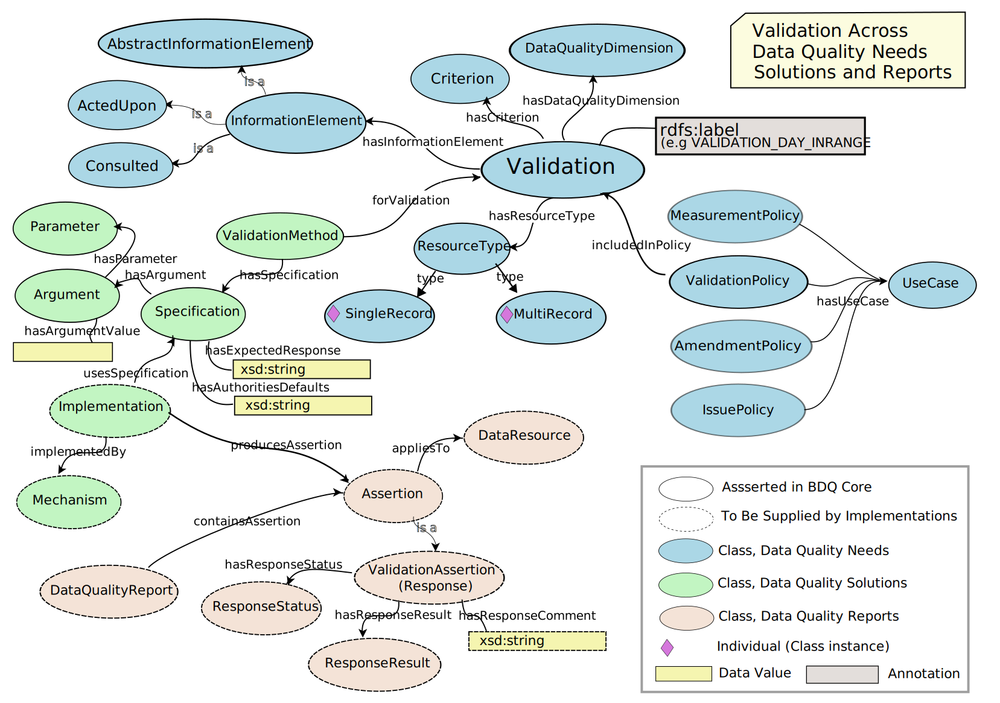

<!--- This file is generated from templates by code, DO NOT EDIT by hand --->
<!--- Template for header, values provided from yaml configuration --->
# Fitness For Use Framework Ontology Guide

Title
: Fitness For Use Framework Ontology Guide

Date version issued
: 2024-09-10

Date created
: 2024-09-10

Part of TDWG Standard
: <http://example.org/to_be_determined>

Abstract
: This document is a users guide for the (Draft) BDQ Core Standard, describing the organization and use of the bdqffdq: ontology.  The BDQ Conceptual Framework ontology formally describes the terms and relationships between them for evaluating the quality of biodiversity data. Due to the comprehensiveness of the conceptual framework, it allows different interpretations and manners of using it according to different stakeholders. The Framework also provides a base for the bdq: and bdqcore: namespace vocabularies.

Authors
: [Lee Belbin](https://orcid.org/0000-0001-8900-6203) ([Blatant Fabrications](https://www.wikidata.org/wiki/Q130304884)), [Arthur D. Chapman](https://orcid.org/0000-0003-1700-6962) ([Australian Biodiversity Information Services](http://www.wikidata.org/entity/Q100600913)), [Paul J. Morris](https://orcid.org/0000-0002-3673-444X) ([Museum of Comparative Zoology, Harvard University](http://www.wikidata.org/entity/Q1420782)), [John Wieczorek](https://orcid.org/0000-0003-1144-0290) ([VertNet](http://www.wikidata.org/entity/Q98382028))

Contributors
: [Yi-Ming Gan](https://orcid.org/0000-0001-7087-2646) ([Royal Belgian Institute of Natural Sciences](http://www.wikidata.org/entity/Q16665660)), [António Mauro Saraiva](https://orcid.org/0000-0003-2283-1123) ([Universidade de São Paulo](https://www.wikidata.org/wiki/Q835960)), [Alan Koch Veiga](http://orcid.org/0000-0003-2672-8115) ([Universidade de São Paulo](https://www.wikidata.org/wiki/Q835960)), [Paula F Zermoglio](https://orcid.org/0000-0002-6056-5084) ([Instituto de Investigaciones en Recursos Naturales, Agroecología y Desarrollo Rural (IRNAD, CONICET-UNRN): San Carlos de Bariloche](https://www.irnad.com/)), [Alexander Thompson](https://orcid.org/0000-0002-8981-4048) ([Google](https://www.wikidata.org/wiki/Q95)), [David Lowery](https://github.com/lowery) , [Christian Gendreau](https://orcid.org/0000-0003-4898-4291) ([Agriculture and Agri-Food Canada](http://www.wikidata.org/entity/Q1046164)), [Tim Roberston](https://orcid.org/0000-0001-6215-3617) ([Global Biodiversity Information Facility](https://www.wikidata.org/wiki/Q1531570)), [Dmitry Schigel](https://orcid.org/0000-0002-2919-1168) ([Global Biodiversity Information Facility](https://www.wikidata.org/wiki/Q1531570)), [Robert A. Morris](https://orcid.org/0000-0002-6992-9446) , [Miles Nicholls](https://orcid.org/0000-0002-3302-0070) ([Atlas of Living Australia](https://www.wikidata.org/wiki/Q16335177)), Emily Rose Rees ([Atlas of Living Australia](https://www.wikidata.org/wiki/Q16335177)), [Abigail Benson](https://orcid.org/0000-0002-4391-107X) ([U.S. Geological Survey](https://www.wikidata.org/wiki/Q193755))

Creator
: TDWG Biodiversity Data Quality Interest Group Task Group 2: Data Quality Tests and Assertions

Bibliographic citation
: TDWG Biodiversity Data Quality Interest Group Task Group 2: Data Quality Tests and Assertions. 2024. Fitness For Use Framework Ontology Guide. Biodiversity Information Standards (TDWG). <http://rs.tdwg.org/bdq/terms/2024-09-10>

Draft Standard for Submission

### Table of Contents ###

- [ 1 Introduction](#1-introduction)
- [ 1.1 Namespace abbreviations](#11-namespace-abbreviations)
- [ 1.1 Status of the content of this document](#11-status-of-the-content-of-this-document)
- [ 1.2 RFC 2119 key words (normative)](#12-rfc-2119-key-words-(normative))
- [ 2 Use of Terms (normative) ](#2-use-of-terms-(normative)-)
- [ 3 Framework for describing data quality ](#3-framework-for-describing-data-quality-)
- [ 3.1 Introduction and Context (non-normative)](#31-introduction-and-context-(non-normative))
- [ 3.2 Description of the bdqffdq ontology (non-normative) ](#32-description-of-the-bdqffdq-ontology-(non-normative)-)
- [ 3.2.1 Data Quality Control, Data Quality Assurance](#321-data-quality-control,-data-quality-assurance)
- [ 3.2.2 Information Elements](#322-information-elements)
- [ 3.2.3 Concepts in the framework, Test Types: Measure, Validation, Amendment, Issue.](#323-concepts-in-the-framework,-test-types:-measure,-validation,-amendment,-issue)
- [ 3.4 Data Quality Needs, Data Quality Mechanisms, Data Quality Reports](#34-data-quality-needs,-data-quality-mechanisms,-data-quality-reports)
- [ 3.5 Responses](#35-responses)
- [ 3.6 Organization of the bdqcore classes ](#36-organization-of-the-bdqcore-classes-)
- [ 3.7 Example representation of a bdqcore test (non-normative)](#37-example-representation-of-a-bdqcore-test-(non-normative))
- [ 4 Term index](#4-term-index)
- [ 5 List of Terms with axioms in the bdqffdq ontology (portions normative, see 2.1)](#5-list-of-terms-with-axioms-in-the-bdqffdq-ontology-(portions-normative,-see-21))
- [ 6 Fitness For Use Framework Summary of Mathematical Formalization (normative) ](#6-fitness-for-use-framework-summary-of-mathematical-formalization-(normative)-)

## 1 Introduction
[!--- JRW finished first draft to here ---]

The bdqffdq: vocabulary is a specification of a framework for describing data quality.   Each of the tests in the bdqcore: vocabulary has been designed using this framework and is framed in the terms and concepts from the framework.  

The framework considers data to have quality with respect to some specified use.   It provides a means to describe a use of data (bdqffdq:UseCase), and what is needed for some data set to have quality for that use, that is for some data set to be fit for a specified purpose.  The framework explicitly links data quality to use, and allows formal description of means to assure that data are fit for some specified purpose.  

This document describes the use of a set of terms used to describe 'data quality' / 'fitness for use' in the context of biodiversity data.  These terms are based on Veiga AK, Saraiva AM, Chapman AD, Morris PJ, Gendreau C, Schigel D, & Robertson TJ (2017). A conceptual framework for quality assessment and management of biodiversity data. PLOS ONE 12 (6): https://doi.org/10.1371/journal.pone.0178731>, with a few changes for increased clarity.

### 1.1 Namespace abbreviations

The following namespace abbreviations are used in this document:

| **Prefix**   | **Namespace**                                    |
|--------------|--------------------------------------------------|
| bdq          | https://rs.tdwg.org/bdq/terms/                   |
| bdqcore      | https://rs.tdwg.org/bdqcore/terms                |
| bdqdim       | https://rs.tdwg.org/bdqdim/terms                 |
| bdqffdq      | https://rs.tdwg.org/bdqffdq/terms                |
| dc           | https://purl.org/dc/elements/1.1/                |
| dcterms      | https://purl.org/dc/elements/1.1/                |
| dwc          | http://rs.tdwg.org/dwc/terms/                    |
| dwciri       | http://rs.tdwg.org/dwc/iri/                      |
| oa           | https://www.w3.org/TR/annotation-vocab/          |
| skos         | http://www.w3.org/2004/02/skos/core#             |
| owl          | http://www.w3.org/2002/07/owl#                   |

### 1.1 Status of the content of this document

In Section 4, the values of following terms are normative: Term IRI, Name, rdfs:label, skos:prefLabel, Type, Superclass, Definition.

In Section 4, the values of the following term are non-normative: Comment.

Figures are non-normative.

Other sections of this document are marked as normative or non-normative.

### 1.2 RFC 2119 key words (normative)

The key words "MUST", "MUST NOT", "REQUIRED", "SHALL", "SHALL NOT", "SHOULD", "SHOULD NOT", "RECOMMENDED", "MAY", and "OPTIONAL" in this document are to be interpreted as described in RFC 2119.

## 2 Use of Terms (normative) 

When not represented as objects, controlled value strings MUST be used as values of bdqffdq:ResponseStatus, and bdqffdq:ResponseResult.

IRIs MUST be use for values for all individual class instances and object properties when using bdqffdq: terms.

### 3 Framework for describing data quality 

#### 3.1 Introduction and Context (non-normative)

The bdqffdq: portion of BDQ Core is a specification for a framework for describing data quality.  This bdqffdq: framework is based on a mathematical formulation, using set theory (Veiga, 2016), and is represented as an owl ontology.  This document describes the organization and use of the owl ontology, and gives a summary of the mathematical formulation.

This document provides a background for understanding the bdqcore: test descriptions.  Each of the tests in the bdqcore: namespace have been designed and described within this framework and are framed using the terms and concepts from the framework.  The bdqffdq: framework provides the context for each test, and has shaped decisions made about each test.  

See the [bdqffdq: Term List](../bdqffdq/index.md) for the list of terms in the bdqffdq: vocabulary, and the [owl ontology](../../vocabluary/bdqffdq.owl) for the vocabulary and additional axioms (extension term list).

#### 3.2 Description of the bdqffdq ontology (non-normative) 

The bdqffdq framework describes data quality with respect to some specified use.  It provides a means to describe a use of data, and what is needed for some data set to have quality for that use.  That is, bdqffdq lets users describe how to evaluate if some data set is fit for a specified purpose.  The framework explicitly links data quality to use, and allows formal description of means to assure that data are fit for some specified purpose.  Under the framework, data do not have quality in the abstract, but only can be evaluated for quality with respect to a specified purpose.  The term that purposes and uses of data in bdqffdq is UseCase.  

The framework can be conceptually divided into three horizontal layers or slices: Data Quality Needs, Data Quality Solutions, and Data Quality Reports.  Needs describe what it means for data to have quality for some use, Solutions describe tools to evaluate quality, and Reports are produced by Solutions to describe the evaluation of quality in particular data sets. 

The framework can also be conceptually divided into four vertical themes, four sets of related concepts that carry through the Needs, Solutions, and Reports layers.  These concepts are Measures, Validations, Amendments, and Issues.   

We use the informal term "Test" to describe these four vertical themes, a test involves terms in both Needs and Solutions, and tests produce particular reporting elements.

### 3.2.1 Data Quality Control, Data Quality Assurance

The framework draws a distinction between Quality Control and Quality Assurance.  Quality Control processes seek to assess the quality of data for some purpose, then identify changes to the data or to processes around the data for improving the quality of the data. Quality Assurance processes seek to filter some set of data to a subset that is fit for some purpose, that is to assure that data used for some purpose are fit for that purpose.

### 3.2.2 Information Elements

The framework has an abstract concept of Information Elements. To frame tests on Darwin Core terms in a usable way, we list specific Darwin Core terms as the information elements in each test.

### 3.2.3 Concepts in the framework, Test Types: Measure, Validation, Amendment, Issue.

Vertical slices by concept.

<!--- Ming: Test types: Validation, Amendment, Measure, Issue, repeated in 1.5 --->

The framework defines four central concepts for describing and evaluating data quality needs: Amendments, Measures, Validations, and Issues.  

Validations assess compliance with a need.  Data have quality if they are compliant with the requirements of the validation test.  Validations relate information elements and resource types with a specification of specifically how to assess fitness of the data under some narrow criterion, and themselves are assembled into validations policies, which are linked to other policies to cover a description of the data quality needs of a UseCase.

Issues are the converse of Validations.  Data lack quality if an issue identifies a potential problem in the data that would require further human review to identify if the data have quality for some purpose.  

Measures measure some specific aspect of data quality.

Amendments propose changes to data or processes that, if accepted, may improve the fitness of data for a specific use.

Formally, in the Data Quality Needs level, the framework starts with a Use Case, a framing of some use to which data may be put.  Use cases are related to the formal description of data quality needs through policies and contexts.  Contexts (ContextualizedCriterion, ContextualizedDimension, ContextualizedEnhancement, ContextualizedIssue) relate the specification of a need, such as a Validation, to the information elements that need to be examined, and to the resource type that is operated on.  Each of the tests described in this standard has a formal specification that includes each of these elements.   A Use Case includes a set of policies, policies relate the use case to contexts, contexts link information elements to needs and to resource types, a need specify what properties data must have to have quality.   

Data quality needs can relate to the data quality of single records (bdqffdq:SingleRecord) or of data sets (bdqffdq:MultiRecord).

### 3.4 Data Quality Needs, Data Quality Mechanisms, Data Quality Reports

Horizontal slices through the framework.

The framework organizes data quality concepts into three areas: Needs, Mechanisms, and Reports.  Data Quality Needs identify a use to which data may be put, and frame a set of requirements that data needs to meet to be fit for that use, and means by which data not fit for that use may be improved.  The tests described in this standard are formal descriptions of data quality needs for CORE purposes.  Data Quality Mechanisms in the framework are formal descriptions of software and other mechanisms that implement tests described in the Needs area.  Data Quality Reports are the results produced by Mechanisms on some set of data.  The tests described in this standard include specifications of assertions to be made in Data Quality Reports.

The framework has an abstract concept of Information Elements. To frame tests on Darwin Core terms in a usable way, we list specific Darwin Core terms as the information elements in each test.

Formally, in the Data Quality Needs level, the framework starts with a Use Case, a framing of some use to which data may be put.  Use cases are related to the formal description of data quality needs through policies and contexts.  Contexts (ContextualizedCriterion, ContextualizedDimension, ContextualizedEnhancement, ContextualizedIssue) relate the specification of a need, such as a Validation, to the information elements that need to be examined, and to the resource type that is operated on.  Each of the tests described in this standard has a formal specification that includes each of these elements.   A Use Case includes a set of policies, policies relate the use case to contexts, contexts link information elements to needs and to resource types, a need specifies what properties data must have to have quality.   

The framework expects that Quality Assurance is provided for through specification of a set of Measures defined to operate on a MultiRecord, and which specify a Response.result of COMPLETE or NOT_COMPLETE.  A MultiRecord Measure may specify that it is COMPLETE if all instances of a SingleRecord Validation are COMPLIANT.  

For Quality Control, MultiRecord Measures may be defined to return a count of Response.value of COMPLIANT for validations, and thus can provide a measure of how fit a data set is for some purpose, and what sort of work would be required to make it fit for that purpose.   

Diagram of the composition of Validation, ValidationMethod, and ValidationAssertion illustrating the Data Quality Needs, Solutions, and Reports layers of bdqffdq, with responsibilities of bdqcore (solid lines), and implementations (dashed lines).

A useful way to think of the framework is to divide it horizontally into Needs, Solutions, and Reports layers, and then track the test concepts verticaly through each layer (see [Figure 3](https://journals.plos.org/plosone/article?id=10.1371/journal.pone.0178731#pone-0178731-g003) in Viega et al., 2017)  Below is a diagram that brings together the horizonal Needs, Solutions, and Reports layers with the vertical test concepts (Validations, Amendments, Measures, Issues), with validation related concepts expanded to show all related entities in bdqffdq.

### 3.5 Responses

Assertions are expected to assert Response objects, these will involve, in RDF, a combination of object properties and data properties.

| Concept | bdqffdq Term(s) | Description |
| ------- | ------- | ----------- |
| Response | bdqffdq:Assertion | The report from a single execution of a single test, consisting of a bdq:Response.status, a bdq:Response.result, a bdq:Response.comment, and optionally, a bdq:Response.qualifier.| 
| Response.status | bdqffdq:ResponseStatus, bdqffdq:hasResponseStatus | A metadata element in a bdq:Response indicating whether a particular test (bdqffdq:Validation, bdqffdq:Amendment, bdqffdq:Measure, or bdqffdq:Issue) was able to be performed or not.| 
| Response.result | bdqffdq:ResponseResult, bdqffdq:hasResponseResult, bdqffdq:hasResponseResultValue | The element in a bdq:Response containing the value returned by a test (bdqffdq:Validation, bdqffdq:Amendment, bdqffdq:Measure, or bdqffdq:Issue)|
| Response.comment | bdqffdq:hasResponseComment | A human readable interpretation of the results of the test.|
| Response.qualifier | bdqffdq:ResponseQualifier, bdqffdq:hasResponseQualifier | Additional structured information that qualifies the bdq:Response, intended as an extension point for uncertainty.|

### 3.6 Organization of the bdqcore classes 

Class diagram 

### 3.7 Example representation of a bdqcore test (non-normative)

Fragment in Turtle describing VALIDATION_COUNTRY_FOUND, composed of a Validation, linking an ActedUpon InformationElement, a Criterion, and the ResourceType SingleRecord, with the Validation linked to a ValidationMethod, and from there a Specification.  Also shown is a ValidationPolicy linking this Validation to a UseCase. 

     <bdqcore:69b2efdc-6269-45a4-aecb-4cb99c2ae134> a <bdqffdq:Validation> ;
         rdfs:comment "Does the value of dwc:country occur in the bdq:sourceAuthority?" ;
         rdfs:label "Does the value of dwc:country occur in the bdq:sourceAuthority? Validation for SingleRecord" ;
         skos:prefLabel "VALIDATION_COUNTRY_FOUND" ;
         <bdqffdq:hasActedUponInformationElement> <urn:uuid:8a2bbe0d-7218-4861-8d70-e4f2108a6dc4> ;
         <bdqffdq:hasCriterion> <bdqcrit:Found> ;
         <bdqffdq:hasDataQualityDimension> <bdqdim:Conformance> ;
         <bdqffdq:hasResourceType> <bdqffdq:SingleRecord> .
     
     <urn:uuid:8a2bbe0d-7218-4861-8d70-e4f2108a6dc4> a <bdqffdq:ActedUpon> ;
         rdfs:label "Information Element ActedUpon dwc:country" ;
         <bdqffdq:composedOf> dwc:country ;
         <skos:prefLabel> "Information Element ActedUpon dwc:country" .
     
     <bdqcrit:Found> a <bdqffdq:Criterion> ;
         rdfs:label "Found" .

     <bdqdim:Conformance> a <bdqffdq:DataQualityDimension> ;
         rdfs:label "Conformance" .     

     <urn:uuid:04cee4e0-0c83-40cc-8de2-e7391f0a97a9> a <bdqffdq:ValidationMethod> ;
         rdfs:label "ValidationMethod: Does the value of dwc:country occur in the bdq:sourceAuthority? Validation for SingleRecord with Specification for: VALIDATION_COUNTRY_FOUND" ;
         skos:prefLabel "ValidationMethod: Does the value of dwc:country occur in the bdq:sourceAuthority? Validation for SingleRecord with Specification for: VALIDATION_COUNTRY_FOUND" ;
         <bdqffdq:forValidation> <bdqcore:69b2efdc-6269-45a4-aecb-4cb99c2ae134> ;
         <bdqffdq:hasSpecification> <urn:uuid:051f6ad7-1a4b-4e6c-8a1d-2af76de24848> .
     
     <urn:uuid:051f6ad7-1a4b-4e6c-8a1d-2af76de24848> a <bdqffdq:Specification> ;
         rdfs:comment "EXTERNAL_PREREQUISITES_NOT_MET if the bdq:sourceAuthority is not available; INTERNAL_PREREQUISITES_NOT_MET if dwc:country is bdq:Empty; COMPLIANT if value of dwc:country is a place type equivalent to administrative entity of \"nation\" in the bdq:sourceAuthority; otherwise NOT_COMPLIANT bdq:sourceAuthority default = \"The Getty Thesaurus of Geographic Names (TGN)\" {[https://www.getty.edu/research/tools/vocabularies/tgn/index.html]}" ;
         rdfs:label "Specification for: VALIDATION_COUNTRY_FOUND" ;
         <bdqffdq:hasAuthoritiesDefaults> "bdq:sourceAuthority default = \"The Getty Thesaurus of Geographic Names (TGN)\" {[https://www.getty.edu/research/tools/vocabularies/tgn/index.html]}" ;
         <bdqffdq:hasExpectedResponse> "EXTERNAL_PREREQUISITES_NOT_MET if the bdq:sourceAuthority is not available; INTERNAL_PREREQUISITES_NOT_MET if dwc:country is bdq:Empty; COMPLIANT if value of dwc:country is a place type equivalent to administrative entity of \"nation\" in the bdq:sourceAuthority; otherwise NOT_COMPLIANT" .
     
     <urn:uuid:0053ca4f-7d45-41ea-912e-c8847bb70142> a <bdqffdq:ValidationPolicy> ;
     	rdfs:label "ValidationPolicy: (65) validations  in UseCase bdq:Record-Management" ;
     	<http://www.w3.org/2004/02/skos/core#prefLabel> "ValidationPolicy: (65) validations  in UseCase bdq:Record-Management" ;
     	<bdqffdq:hasUseCase> <bdqffdq:Record-Management> ;
     	<bdqffdq:includesInPolicy> <bdqcore:01c6dafa-0886-4b7e-9881-2c3018c98bdc> , <bdqcore:0493bcfb-652e-4d17-815b-b0cce0742fbe> , <bdqcore:04b2c8f3-c71b-4e95-8e43-f70374c5fb92> , <bdqcore:06851339-843f-4a43-8422-4e61b9a00e75> , <bdqcore:0949110d-c06b-450e-9649-7c1374d940d1> , <bdqcore:0bb8297d-8f8a-42d2-80c1-558f29efe798> , <bdqcore:125b5493-052d-4a0d-a3e1-ed5bf792689e> , <bdqcore:14da5b87-8304-4b2b-911d-117e3c29e890> , <bdqcore:15f78619-811a-4c6f-997a-a4c7888ad849> , <bdqcore:17f03f1f-f74d-40c0-8071-2927cfc9487b> , <bdqcore:239ec40e-a729-4a8e-ba69-e0bf03ac1c44> , <bdqcore:2750c040-1d4a-4149-99fe-0512785f2d5f> , <bdqcore:2cd6884e-3d14-4476-94f7-1191cfff309b> , <bdqcore:3136236e-04b6-49ea-8b34-a65f25e3aba1> , <bdqcore:3667556d-d8f5-454c-922b-af8af38f613c> , <bdqcore:36ed36c9-b1a7-40b2-b5e2-0d012e772098> , <bdqcore:374b091a-fc90-4791-91e5-c1557c649169> , <bdqcore:3cff4dc4-72e9-4abe-9bf3-8a30f1618432> , <bdqcore:3f1db29a-bfa5-40db-9fd1-fde020d81939> , <bdqcore:3f335517-f442-4b98-b149-1e87ff16de45> , <bdqcore:401bf207-9a55-4dff-88a5-abcd58ad97fa> , <bdqcore:42408a00-bf71-4892-a399-4325e2bc1fb8> , <bdqcore:47ff73ba-0028-4f79-9ce1-ee7008d66498> , <bdqcore:4833a522-12eb-4fe0-b4cf-7f7a337a6048> , <bdqcore:49f1d386-5bed-43ae-bd43-deabf7df64fc> , <bdqcore:4c09f127-737b-4686-82a0-7c8e30841590> , <bdqcore:4daa7986-d9b0-4dd5-ad17-2d7a771ea71a> , <bdqcore:4eb48fdf-7299-4d63-9d08-246902e2857f> , <bdqcore:4f2bf8fd-fc5c-493f-a44c-e7b16153c803> , <bdqcore:5424e933-bee7-4125-839e-d8743ea69f93> , <bdqcore:5618f083-d55a-4ac2-92b5-b9fb227b832f> , <bdqcore:58486cb6-1114-4a8a-ba1e-bd89cfe887e9> , <bdqcore:66269bdd-9271-4e76-b25c-7ab81eebe1d8> , <bdqcore:69b2efdc-6269-45a4-aecb-4cb99c2ae134> , <bdqcore:6ce2b2b4-6afe-4d13-82a0-390d31ade01c> , <bdqcore:6eeac3ed-f691-457f-a42e-eaa9c8a71ce8> , <bdqcore:7af25f1e-a4e2-4ff4-b161-d1f25a5c3e47> , <bdqcore:7bdb13a4-8a51-4ee5-be7f-20693fdb183e> , <bdqcore:7c4b9498-a8d9-4ebb-85f1-9f200c788595> , <bdqcore:7d2485d5-1ba7-4f25-90cb-f4480ff1a275> , <bdqcore:7e0c0418-fe16-4a39-98bd-80e19d95b9d1> , <bdqcore:81cc974d-43cc-4c0f-a5e0-afa23b455aa3> , <bdqcore:853b79a2-b314-44a2-ae46-34a1e7ed85e4> , <bdqcore:85803c7e-2a5a-42e1-b8d3-299a44cafc46> , <bdqcore:88d8598b-3318-483d-9475-a5acf9887404> , <bdqcore:8d787cb5-73e2-4c39-9cd1-67c7361dc02e> , <bdqcore:8f1e6e58-544b-4365-a569-fb781341644e> , <bdqcore:9a39d88c-7eee-46df-b32a-c109f9f81fb8> , <bdqcore:9beb9442-d942-4f42-8b6a-fcea01ee086a> , <bdqcore:ac2b7648-d5f9-48ca-9b07-8ad5879a2536> , <bdqcore:ad0c8855-de69-4843-a80c-a5387d20fbc8> , <bdqcore:b6ecda2a-ce36-437a-b515-3ae94948fe83> , <bdqcore:c09ecbf9-34e3-4f3e-b74a-8796af15e59f> , <bdqcore:c486546c-e6e5-48a7-b286-eba7f5ca56c4> , <bdqcore:c6adf2ea-3051-4498-97f4-4b2f8a105f57> , <bdqcore:c971fe3f-84c1-4636-9f44-b1ec31fd63c7> , <bdqcore:cdaabb0d-a863-49d0-bc0f-738d771acba5> , <bdqcore:d257eb98-27cb-48e5-8d3c-ab9fca4edd11> , <bdqcore:d708526b-6561-438e-aa1a-82cd80b06396> , <bdqcore:dc8aae4b-134f-4d75-8a71-c4186239178e> , <bdqcore:eaad41c5-1d46-4917-a08b-4fd1d7ff5c0f> , <bdqcore:eb4a17f6-6bea-4cdd-93dd-d5a7e9d1eccf> , <bdqcore:f2ce7d55-5b1d-426a-b00e-6d4efe3058ec> , <bdqcore:f51e15a6-a67d-4729-9c28-3766299d2985> , <bdqcore:ff59f77d-71e9-4eb1-aac9-8bd05c50ff70> .
     
     TODO: Add diagram

## 4 Term index

- [Classes](#51-Class-terms)
- [Object Properties](#52-ObjectProperty-terms)
- [Data Properties](#53-DataProperty-terms)
- [Named Individuals](#54-NamedIndividual-terms)

### 4.1 Alphabetical Index of classes

[AbstractInformationElement](#AbstractInformationElement)
[ActedUpon](#ActedUpon)
[Amendment](#Amendment)
[AmendmentAssertion](#AmendmentAssertion)
[AmendmentConcept](#AmendmentConcept)
[AmendmentMethod](#AmendmentMethod)
[AmendmentPolicy](#AmendmentPolicy)
[Assertion](#Assertion)
[Consulted](#Consulted)
[Criterion](#Criterion)
[DataQualityDimension](#DataQualityDimension)
[DataQualityMethod](#DataQualityMethod)
[DataQualityNeed](#DataQualityNeed)
[DataQualityProfile](#DataQualityProfile)
[DataQualityReport](#DataQualityReport)
[DataResource](#DataResource)
[Enhancement](#Enhancement)
[FundamentalConcept](#FundamentalConcept)
[Implementation](#Implementation)
[ImprovementTarget](#ImprovementTarget)
[InformationElement](#InformationElement)
[Issue](#Issue)
[IssueAssertion](#IssueAssertion)
[IssueConcept](#IssueConcept)
[IssueMethod](#IssueMethod)
[IssuePolicy](#IssuePolicy)
[Measure](#Measure)
[MeasurementAssertion](#MeasurementAssertion)
[MeasurementMethod](#MeasurementMethod)
[MeasurementPolicy](#MeasurementPolicy)
[MeaurementConcept](#MeaurementConcept)
[Mechanism](#Mechanism)
[NeedConcept](#NeedConcept)
[Parameter](#Parameter)
[Policy](#Policy)
[ReportConcept](#ReportConcept)
[ResourceType](#ResourceType)
[ResponseQualifier](#ResponseQualifier)
[ResponseResult](#ResponseResult)
[ResponseStatus](#ResponseStatus)
[SolutionsConcept](#SolutionsConcept)
[Specification](#Specification)
[UseCase](#UseCase)
[Validation](#Validation)
[ValidationAssertion](#ValidationAssertion)
[ValidationConcept](#ValidationConcept)
[ValidationMethod](#ValidationMethod)
[ValidationPolicy](#ValidationPolicy)

### 4.2 Alphabetical Index of object properties

[amendmentProperty](#amendmentProperty)
[appliesTo](#appliesTo)
[composedOf](#composedOf)
[containsAssertion](#containsAssertion)
[forAmendment](#forAmendment)
[forDataQualityNeed](#forDataQualityNeed)
[forIssue](#forIssue)
[forMeasure](#forMeasure)
[forValidation](#forValidation)
[hasActedUponInformationElement](#hasActedUponInformationElement)
[hasConsultedInformationElement](#hasConsultedInformationElement)
[hasCriterion](#hasCriterion)
[hasDataQualityDimension](#hasDataQualityDimension)
[hasEnhancement](#hasEnhancement)
[hasInformationElement](#hasInformationElement)
[hasParameter](#hasParameter)
[hasResourceType](#hasResourceType)
[hasResponseQualifier](#hasResponseQualifier)
[hasResponseResult](#hasResponseResult)
[hasResponseStatus](#hasResponseStatus)
[hasSpecification](#hasSpecification)
[hasUseCase](#hasUseCase)
[implementedBy](#implementedBy)
[improvedBy](#improvedBy)
[includedInPolicy](#includedInPolicy)
[issueProperty](#issueProperty)
[measurementProperty](#measurementProperty)
[producesAssertion](#producesAssertion)
[reportProperty](#reportProperty)
[targetedIssue](#targetedIssue)
[targetedMeasure](#targetedMeasure)
[targetedValidation](#targetedValidation)
[usesSpecification](#usesSpecification)
[validationProperty](#validationProperty)

### 4.3 Alphabetical Index of data properties

[hasAuthoritiesDefaults](#hasAuthoritiesDefaults)
[hasExpectedResponse](#hasExpectedResponse)
[hasResponseComment](#hasResponseComment)
[hasResponseResultValue](#hasResponseResultValue)

### 4.4 Alphabetical Index of named individuals

[AMENDED](#AMENDED)
[COMPLETE](#COMPLETE)
[COMPLIANT](#COMPLIANT)
[EXTERNAL_PREREQUISITES_NOT_MET](#EXTERNAL_PREREQUISITES_NOT_MET)
[FILLED_IN](#FILLED_IN)
[INTERNAL_PREREQUISITES_NOT_MET](#INTERNAL_PREREQUISITES_NOT_MET)
[IS_ISSUE](#IS_ISSUE)
[MultiRecord](#MultiRecord)
[NOT_AMENDED](#NOT_AMENDED)
[NOT_COMPLETE](#NOT_COMPLETE)
[NOT_COMPLIANT](#NOT_COMPLIANT)
[NOT_ISSUE](#NOT_ISSUE)
[POTENTIAL_ISSUE](#POTENTIAL_ISSUE)
[RUN_HAS_RESULT](#RUN_HAS_RESULT)
[SingleRecord](#SingleRecord)

## 5 List of Terms with axioms in the bdqffdq ontology (portions normative, see 2.1)

### 5.1 Class terms
### AbstractInformationElement

- Name: bdqffdq:AbstractInformationElement
- Preferred Label: Abstract Information Element
- Definition: An InformationElement described in abstract terms and not linked with one or more concrete terms.
- SubClass Of: InformationElement
- Notes: Information elements such as DATE and DAY are abstract, they could reference any representation of those concepts.  In contrast, dwc:eventDate and dwc:day can be linked to concrete Acted Upon or Consulted information elements.

********************

### ActedUpon

- Name: bdqffdq:ActedUpon
- Preferred Label: Acted Upon
- Definition: An information element, expressed in concrete terms, about which a data quality need expresses assertions about the data quality in that element.
- SubClass Of: InformationElement
- Notes: An information element to which a Result applies.

********************

### Amendment

- Name: bdqffdq:Amendment
- Preferred Label: Amendment
- Definition: A data quality need that expresses how proposals may be made to improve the fitness for use of data.
- SubClass Of: AmendmentConcept; DataQualityNeed
- Notes: ContextualizedEnhacement in the original framework.   Describes an instance of the enhancement concept in the context of the associated information elements from some controlled vocabulary (fields ActedUpon or Consulted), and a ResourceType of SingleRecord or MultiRecord.    
Describes a proposal for enhancement of original data, which if accepted, would improve the quality of the data for some use. For example: Recommends valid value for taxon name in a single record.    
Amendments may describe proposed changes to data values, or proposed changes to processes for the production and manipulation of data, for example an Amendment on a SingleRecord may provide criteria for proposing that latitude and longitude are transposed in that record, or a similar Amendment on a MultiRecord may provide critera for proposing that all latitudes and longitudes from some data source have been transposed, and the mapping of data values to transport terms should be changed.    
An Amendment is the data quality needs concept that parallels an AmendmentMethod at the solutions level, and an AmendmentAssertion at the report level.     
AM = { am | am = < ie, e, rt >, ie ∈ IE, e ∈ E ⋀ rt ∈ RT }

********************

### AmendmentAssertion

- Name: bdqffdq:AmendmentAssertion
- Preferred Label: Amendment Assertion
- Definition: An assertion expressing the result of an implementation evaluating an amendment supporting a particular data quality need to improve a particular data resource.
- SubClass Of: AmendmentConcept; Assertion
- Notes: The Amendment assertion type is a report level concept that describes the results of the execution of of a test that performs an AmendmentMethod following some Specification to propose changes based on some Amendment.   
An Amendment concept in bdqffdq is expected to carry a ResponseStatus result that includes a status FILLED_IN, AMENDED, as well as a ResponseResult that asserts proposed changes to values from the original data.  
DQA(dr) = {dqa | dqa = < am, s, m, r >, am ∈ AM, s ∈ S, m ∈ M , r ∈ R ⋀ dr ∈ DR}

********************

### AmendmentMethod

- Name: bdqffdq:AmendmentMethod
- Preferred Label: Amendment Method
- Definition: A data quality solution concept that relates an Amendment to its Specifications.
- SubClass Of: AmendmentConcept; DataQualityMethod
- Notes: The AmendmentMethod in bdqffdq is a DQ Solutions level concept describing the relationship between a Specification (technical description of a test) and an Amendment (an enhancement in the context of resource type (SingleRecord or MultiRecord) and associated information elements).  
EM(am) = {s | s ⊂ S ⋀ am ∈ AM}

********************

### AmendmentPolicy

- Name: bdqffdq:AmendmentPolicy
- Preferred Label: Amendment Policy
- Definition: A need concept that relates a UseCase to a set of supporting Amendments.
- SubClass Of: AmendmentConcept; Policy
- Notes: A Data Quality needs level concept that describes how some Amendment relates to a UseCase. This relationship defines which amendments are supported by a given UseCase.  
EP(u) = {am | am ⊂ AM ⋀ u ∈ U }

********************

### Assertion

- Name: bdqffdq:Assertion
- Preferred Label: Assertion
- Definition: A report concept expressing a statement about data quality assertion following some Specification produced by some implementation pertaining to some data resource.
- SubClass Of: ReportConcept
- Notes: The Assertion type in bdqffdq is the fundamental concept that makes up a data quality report. Assertion can be any one of four types (represented as subClasses), Measure, Validation, Issue, and Amendement.  The assertion concept consists of a Specification (the technical description of a performed test), a data resource (initial values of input data expressed in terms of some controlled vocabulary), the mechanism (external service, actor, or code that performs the test), and some form of result.

********************

### Consulted

- Name: bdqffdq:Consulted
- Preferred Label: Acted Upon
- Definition: An information element, expressed in concrete terms, about which a data quality need examines in order to expresses assertions about the data quality in another Information Element.
- SubClass Of: InformationElement
- Notes: An Information Element the content of which is examined to assert a result on one or more other Information Elements.

********************

### Criterion

- Name: bdqffdq:Criterion
- Preferred Label: Criterion
- Definition: Rule against which data are evaluated for conformance to quality criteria.
- SubClass Of: FundamentalConcept; NeedConcept
- Notes: General statement, for example: In a controlled vocabulary.  Composed with both Validations and Issues.

********************

### DataQualityDimension

- Name: bdqffdq:DataQualityDimension
- Preferred Label: Data Quality Dimension
- Definition: An aspect of data quality.
- SubClass Of: FundamentalConcept; NeedConcept
- Notes: Describes the aspect of data quality (accuracy, precision, completeness, etc.) that a test examines. For example, [precision] in [coordinate precision of single records].  In the original framework only related to Measures, here may be related to any DataQualityNeed.

********************

### DataQualityMethod

- Name: bdqffdq:DataQualityMethod
- Preferred Label: Data Quality Method
- Definition: A solutions concept that relates a data quality need to a Specification.
- SubClass Of: SolutionsConcept
- Notes: DataQualityMethods are associative entities that allow Specifications or data quality tests to be reused by supporting a many to many relationship between the two.

********************

### DataQualityNeed

- Name: bdqffdq:DataQualityNeed
- Preferred Label: Data Quality Need
- Definition: A data quality need concept that expresses what assertions may be made about data with respect to fitness for use.
- SubClass Of: NeedConcept
- Notes: Subtypes of DataQualityNeed are the Test Types.  Data Quality Need appoximates the informal concept of Test as used in BDQ Core.

********************

### DataQualityProfile

- Name: bdqffdq:DataQualityProfile
- Preferred Label: Data Quality Profile
- Definition: A needs concept expressing the composition of Policies to satisfy a UseCase.
- SubClass Of: NeedConcept
- Notes: Profile in bdqffdq is a data quality Needs level concept describing the UseCases that make up some data quality operation such as the behavior of a single actor or workflow producing the relevant assertions.    
DQP (u) = {dqp | dqp = mp(u) ⋃ vp(u) ⋃ ep(u), mp ∈ MP , vp ∈ VP , ep ∈ EP ⋀ u ∈ U }

********************

### DataQualityReport

- Name: bdqffdq:DataQualityReport
- Preferred Label: Data Quality Report
- Definition: A report concept comprising a set of data quality assertions.
- SubClass Of: ReportConcept
- Notes: The DataQualityReport concept consists of a set of assertions (MeasureAssertions, ValidationAssertions, IssueAssertions and AmendmentAssertions) that represent the output of a workflow/actor run.  These assertions form an account of the fitness for use of a tested data set for a specified use, as produced by a Mechanism.

********************

### DataResource

- Name: bdqffdq:DataResource
- Preferred Label: Data Resource
- Definition: A thing to whch a data quality assertion applies.
- SubClass Of: ReportConcept
- Notes: Describes a data resource containing terms from a controlled vocabulary such as (dwc) that can be related to information elements and represents the original values of the data operated on by an assertion test (i.e. an instance of dwc:Occurrence).  Ideally, DataResources have persistent GUIDs.  
A data resource could be the oa:target of a oa:Annotation of which an Assertion is the oa:body.  
DR = { dr | dr = < id, rt, v >, id ∈ I D, rt ∈ RT , (rt = sr ⋁ rt = ds) ⋀ v ∈ V }

********************

### Enhancement

- Name: bdqffdq:Enhancement
- Preferred Label: Enhancement
- Definition: Description of a means by which data could be improved.
- SubClass Of: AmendmentConcept; FundamentalConcept; NeedConcept
- Notes: General statement, for example: Recommend replacement value from a controlled vocabulary.

********************

### FundamentalConcept

- Name: bdqffdq:FundamentalConcept
- Preferred Label: Fundamental Concept
- Definition: Category of fitness for use concepts that are not derived by composition with other concepts.
- Notes: Contrast with derived concepts, which are compositions of two or more fundamental concepts.  See Veiga et al., 2017.   Derived concepts can be organized by test type into AmendmentConcept, ValidationConcept, MeasurementConcept or IssueConcept.  Derived concepts can also be organized by framework layer into NeedsConcept, SolutionsConcept, and ReportConcept.

********************

### Implementation

- Name: bdqffdq:Implementation
- Preferred Label: Implementation
- Definition: A solutions concept that describes the portion of a Mechanism that carries out the proccess described in a particular Specification.
- SubClass Of: SolutionsConcept
- Notes: The bdqffdq derived concept of an Implementation describes the relationship between a Specification (technical description of a test) and the mechanism that implements it.  
I (s) = {m | m ⊂ M ⋀ s ∈ S}

********************

### ImprovementTarget

- Name: bdqffdq:ImprovementTarget
- Preferred Label: Improvement Target
- Definition: A specific data quality need for which a specific Amendment is intended to improve.
- SubClass Of: NeedConcept
- Notes: The ImprovementTarget concept in bdqffdq describes which measures, issues, and validations are improved by some amendment. ImprovementTarget includes relationships between an Amendment and one or more Validations or Measures.  
IT(am) = {me ⋃ va | me ∈ ME, va ∈ VA ⋀ am ∈ AM}

********************

### InformationElement

- Name: bdqffdq:InformationElement
- Preferred Label: Information Element
- Definition: A portion of data with which a Data Quality Need is concerned.
- SubClass Of: FundamentalConcept
- Notes: An information element identifies a portion of data to which a test pertains.  The information element in bdqffdq can be represented as a single or composite element that consists of one or more terms from a controlled vocabulary (fields actedUpon or consulted by an assertion test) that identifies concepts in data relevant to a UseCase.  An abstraction or a concrete term that represents relevant content (e.g., coordinates; dwc.decimalLatitude, dwc:decimalLongitude).

********************

### Issue

- Name: bdqffdq:Issue
- Preferred Label: Issue
- Definition: A data quality need that expresses how quality problems may be identified in data.
- SubClass Of: DataQualityNeed; IssueConcept
- Notes: Added to the original framework.  Inverse of Contextualized Criterion in the original framework.  Describes an instance of the issue concept in terms of the associated information elements from some controlled vocabulary (fields actedUpon or consulted), and a resource type of SingleRecord or MultiRecord.  Describes criteria by which data which lack quality for some purpose may be identified.  An issue is phrased in a negative sense, and approximates an inverse of a Validation.  An Issue identifies data that lack or may lack quality.  An Issue may flag a POTENTIAL_ISSUE that would need further review to determine if the data have quality for some purpose,  If the conditions described by an issue are identified by a test, the Problem Assertion result will be either IS_ISSUE or POTENTIAL_ISSUE, if no issue is found with the data the result will be NOT_ISSUE.  NOT_ISSUE, unlike COMPLIANT for a Validation, does not assert that data are fit for some purpose.    An Issue is the data quality needs concept that parallels a IssueMethod at the solutions level, and a IssueAssertion at the report level.     
IS = { is | is = < ie, c, rt >, ie ∈ IE, c ∈ ∁C ⋀ rt ∈ RT }

********************

### IssueAssertion

- Name: bdqffdq:IssueAssertion
- Preferred Label: Issue Assertion
- Definition: An assertion expressing the result of an implementation evaluating an issue for a particular data quality need in a particular data resource.
- SubClass Of: Assertion; IssueConcept
- Notes: The data quality report concept describing a the result of a test in the negative, that is identifying the potential absence of data quality.   
If a problem was found the ResponseResult is expected to carry a a value of IS_ISSUE, if a potential problem was found that needs human review the ResponseResult is expected to be of POTENTIAL_ISSUE, otherwise if the ResponseStatus is RUN_HAS_RESULT,  the ResponseResult is expected to be NOT_ISSUE.

********************

### IssueConcept

- Name: bdqffdq:IssueConcept
- Preferred Label: Issue Concept
- Definition: A term involved in flagging problems or potential problems in assessment of data quality that would or might prevent the data from meeting expressed data quality needs.
- Notes: Issue terms are expressed in a negative sense, they identify data that do not or may not conform to quality needs.

********************

### IssueMethod

- Name: bdqffdq:IssueMethod
- Preferred Label: Issue Method
- Definition: A data quality solution concept that relates an Issue to its Specifications.
- SubClass Of: DataQualityMethod; IssueConcept
- Notes: The IssueMethod in bdqffdq is a data quality Solutions level concept describing the relationship between a Specification (technical description of a test) and an Issue (a Criterion in the context of resource type (SingleRecord or MultiRecord) and associated information elements).

********************

### IssuePolicy

- Name: bdqffdq:IssuePolicy
- Preferred Label: Issue Policy
- Definition: A need concept that relates a UseCase to a set of supporting Issues.
- SubClass Of: IssueConcept; Policy
- Notes: The IssuePolicy in bdqffdq is a data quality Needs level concept that describes how some Issue relates to a UseCase. This relationship defines which Issues are supported by a given UseCase.

********************

### Measure

- Name: bdqffdq:Measure
- Preferred Label: Measure
- Definition: A data quality need that expresses how the fitness of data for some use may be measured.
- SubClass Of: DataQualityNeed; MeaurementConcept
- Notes: Contextualized Dimension in the original framework Describes an instance of the measure concept in terms of the associated information elements from some controlled vocabulary (fields ActedUpon or Consulted), and a ResourceType of SingleRecord or MultiRecord.   
Describes the criteria for measuring an aspect of data quality related to some data quality need.   May be criteria for determining that data are COMPLETE or NOT_COMPLETE, or may be criteria for asserting a numeric measurement.  COMPLETE or NOT_COMPLETE measures are fundamental to data quality control, as set of data are filtered to the subset of data that have quality for some need if all records are COMPLETE for all pertenent Measures.   
A Measure is the data quality needs concept that parallels a MeasurementMethod at the solutions level, and a MeasurementAssertion at the report level.  
ME = { me | me =< ie, d, rt >, ie ∈ IE, d ∈ D ⋀ rt ∈ RT }  
also acceptable measure  
AM(me) = {va | me ∈ C D ⋀ va ⊂ C C}

********************

### MeasurementAssertion

- Name: bdqffdq:MeasurementAssertion
- Preferred Label: Measurement Assertion
- Definition: An assertion expressing the result of an implementation measuring a particular data quality need in a particular data resource.
- SubClass Of: Assertion; MeaurementConcept
- Notes: The MeasurementAssertion is a report level concept that describes the results of the execution of of a test that performs a MeasurementMethod following some Specification to assess some data quality Measurement.   
In bdqffdq, the MeasurementAssertion is expected to carry a ResponseResult of COMPLETE or NOT_COMPLETE or a numeric measured value value (e.g. a measure of dwc:eventDate duration in seconds).  
DQM(dr) = {dqm | dqm =< me, s, m, r >, me ∈ ME, s ∈ S, m ∈ M , r ∈ R ⋀ dr ∈ DR}

********************

### MeasurementMethod

- Name: bdqffdq:MeasurementMethod
- Preferred Label: Measurement Method
- Definition: A data quality solution concept that relates a Measure to its Specifications.
- SubClass Of: DataQualityMethod; MeaurementConcept
- Notes: The MeasurementMethod in bdqffdq is a data quality Solutions level concept describing the relationship between a Specification (technical description of a test) and a Measurement (a dimension in the context of resource type (SingleRecord or MultiRecord) and associated information elements).  
MM(me) = {s | s ⊂ S ⋀ me ∈ ME}

********************

### MeasurementPolicy

- Name: bdqffdq:MeasurementPolicy
- Preferred Label: Measurement Policy
- Definition: A need concept that relates a UseCase to a set of supporting Measures.
- SubClass Of: MeaurementConcept; Policy
- Notes: The MeasurementPolicy in bdqffdq is a data quality Needs level concept that describes how some Measurement relates to a UseCase. This relationship defines which measures are supported by a given UseCase.  
MP(u) = {me | me ⊂ ME ⋀ u ∈ U }

********************

### Mechanism

- Name: bdqffdq:Mechanism
- Preferred Label: Mechanism
- Definition: An entity that can execute data quality methods.
- SubClass Of: FundamentalConcept; SolutionsConcept
- Notes: Mechanisms may produce data quality reports as products.      
The bdqffdq concept of mechanism describes the entity that performs an assertion test (code, external service, actor, etc.). Tied to a Specification via the concept of an Implementation.

********************

### NeedConcept

- Name: bdqffdq:NeedConcept
- Preferred Label: Need Concept
- Definition: A concept that expresses an aspect of a data quality need.
- Notes: Category of concepts forming the Needs layer of the fitness for use framework.

********************

### Parameter

- Name: bdqffdq:Parameter
- Preferred Label: Parameter
- Definition: A value that, when provided to a test Specification changes the behavior of the test in a defined manner.
- SubClass Of: SolutionsConcept
- Notes: An extension to the original fitness for use framework as described in Veiga et al., 2017.

********************

### Policy

- Name: bdqffdq:Policy
- Preferred Label: Policy
- Definition: The set of data quality Needs for a UseCase
- SubClass Of: NeedConcept
- Notes: Composition of data quality Needs into UseCases.

********************

### ReportConcept

- Name: bdqffdq:ReportConcept
- Preferred Label: Report Concept
- Definition: A concept concerning data quality expressed in a data quality report.
- Notes: Category of concepts forming the Report layer of the fitness for use framework.

********************

### ResourceType

- Name: bdqffdq:ResourceType
- Preferred Label: Resource Type
- Definition: Category of things that are data objects about which data quality assertions may be made.
- SubClass Of: FundamentalConcept
- Notes: In bdqffdq the concept of ResourceType has instances for SingleRecord or MultiRecord.

********************

### ResponseQualifier

- Name: bdqffdq:ResponseQualifier
- Preferred Label: Response Qualifier
- Definition: A report concept to which additional assertions providing additional information beyond that of ResponseResult from the result of the execution of the Specification of a data quality need are attached.
- SubClass Of: ReportConcept
- Notes: Intended as an extension point for qualifying information about uncertainty or ambiguity.

********************

### ResponseResult

- Name: bdqffdq:ResponseResult
- Preferred Label: Response.result
- Definition: A report concept to which a controlled vocabulary assertions about the result of the execution of the Specification of a data quality need are attached.
- SubClass Of: ReportConcept
- Notes: For Validations, response results may be COMPLIANT, or NOT_COMPLIANT.  For Measures, response result objects may be COMPLETE or NOT_COMPLETE.  For Issues, Response results may be IS_ISSUE, POTENTIAL_ISSUE, or NOT_ISSUE.  See the bdq: vocabulary.  Measures may also use a numeric data property.  Amendments assert a string data property.  
The report ResponseResult in bdqffdq is represented as a value or a result object for MeasureAsssertions, just a result object for ValidationAssertions and values for changes propsed in AmendmentAssertions.

********************

### ResponseStatus

- Name: bdqffdq:ResponseStatus
- Preferred Label: Response.status
- Definition: A report concept expressing controlled vocabulary values about the exit state of an execution process of a data quality Specification by an implementation.
- SubClass Of: ReportConcept
- Notes: The ResponseStatus is metadata, indicating if data should be present in a ResponseResult.   Any assertion may have the values INTERNAL_PREREQUISITES_NOT_MET of EXTERNAL_PREREQUISITES_NOT_MET, indicating that no value would be present in the accompanying ResponseResult.  Other values depend on the Assertion type.  Thes would be RUN_HAS_RESULT for a Validation, Measure, or Isssue, and, FILLED_IN, AMENDED, or NOT_AMENDED for an Amendment.  Additional metadata qualifying the assertion in a ReqponseResult, such as statements of uncertainy or ambiguity may be placed in the ResponseQualifier.

********************

### SolutionsConcept

- Name: bdqffdq:SolutionsConcept
- Preferred Label: Solutions Concept
- Definition: A concept that expresses an aspect of a data quality solution.
- Notes: Category of concepts forming the Solutions layer of the fitness for use framework.  Solutions are tools that evaluate data against needs and express conclusions in data quality reports.

********************

### Specification

- Name: bdqffdq:Specification
- Preferred Label: Specification
- Definition: A specific statement about how to evaluate a data quality need.
- SubClass Of: FundamentalConcept; SolutionsConcept
- Notes: A Specification is a technical desription of an assertion test.  A Specification is expected to have the following properies:  (1) Expected Response, (2) Authorities and Parameters.

********************

### UseCase

- Name: bdqffdq:UseCase
- Preferred Label: Use Case
- Definition: A needs concept expressing a purpose to which data are put for which the data must have quality for the result to have meaning and reliability.
- SubClass Of: FundamentalConcept; NeedConcept
- Notes: The UseCase concept in bdqffdq describes some data quality control UseCase. The Amendment, Measurement and Validation policies that make up a UseCase define which assertions cover a given UseCase.  An example of a UseCase could be "Check for internal consistency of dates", with validation policies for checking consistency between atomic date fields and an Amendment such as "eventDate filled in from verbatim".  UseCases in bdqffdq are not the same as UseCases in the software engineering sense, but are similar bdqffdq formal statements derived from analyis of user stories.

********************

### Validation

- Name: bdqffdq:Validation
- Preferred Label: Validation
- Definition: A data quality need that expreses how data may be evaluated for fitness for use.
- SubClass Of: DataQualityNeed; ValidationConcept
- Notes: ContextualizedCriterion in the original framework.  Describes the criteria for determining compliance of data to fill some data quality need.  A description of a criterion applied to an information element for some resource type.   Describes an instance of the criterion concept in terms of the associated information elements from some controlled vocabulary (fields actedUpon or consulted), and a resource type of SingleRecord or MultiRecord.    
Validations are phrased in a positive sense, they identify data which has quality for some need.  For example: The value of basisOfRecord of single records must be in the controlled vocabulary.     
A Validation is the data quality needs concept that parallels a ValidationMethod at the solutions level, and a ValidationAssertion at the report level.  ValidationAssertions may specify a result that is COMPLIANT, where the data has quality, or NOT_COMPLIANT, where the data lacks quality for some use.    
VA = { va | va = < ie, c, rt >, ie ∈ IE, c ∈ C ⋀ rt ∈ RT }

********************

### ValidationAssertion

- Name: bdqffdq:ValidationAssertion
- Preferred Label: Validation Assertion
- Definition: An assertion expressing the result of an implementation validating compliance with a a particular data quality need in a particular data resource.
- SubClass Of: Assertion; ValidationConcept
- Notes: The ValidationAssertion is a report level concept that describes the results of the execution of of a test that performs a ValidationMethod following some Specification to assess the validity of some data with respect to the Criteria of some Validation.   
The ValidationAssertion concept in bdqffdq is expected to carry a a ResponseResult of COMPLIANT or NON_COMPLIANT.  
DQV(dr) = {dqv | dqv = < va, s, m, r >, va ∈ VA, s ∈ S, m ∈ M , r ∈ R ⋀ dr ∈ DR}

********************

### ValidationConcept

- Name: bdqffdq:ValidationConcept
- Preferred Label: Validation Concept
- Definition: A term involved in statements about the conformance of data to expressed quality needs.
- Notes: Validation terms are expressed in a positive sense, they identify data that conform to needs.

********************

### ValidationMethod

- Name: bdqffdq:ValidationMethod
- Preferred Label: Validation Method
- Definition: A data quality solution concept that relates an Validation to its Specifications.
- SubClass Of: DataQualityMethod; ValidationConcept
- Notes: The ValidationMethod in bdqffdq is a data quality Solutions level concept describing the relationship between a Specification (technical description of a test) and a Validation (a Criterion in the context of resource type (SingleRecord or MultiRecord) and associated information elements).  
VM(va) = {s | s ⊂ S ⋀ va ∈ VA}

********************

### ValidationPolicy

- Name: bdqffdq:ValidationPolicy
- Preferred Label: Validation Policy
- Definition: A need concept that relates a UseCase to a set of supporting Validations.
- SubClass Of: Policy; ValidationConcept
- Notes: The ValidationPolicy in bdqffdq is a data quality Needs level concept that describes how some Validation relates to a UseCase. This relationship defines which Validations are needed to identify quality in a given UseCase.  
VP (u) = {va | va ⊂ VA ⋀ u ∈ U }

********************

### 5.2 ObjectProperty terms
### amendmentProperty

- Name: bdqffdq:amendmentProperty
- Preferred Label: amendment Property
- Definition: Category of object properties that apply to Amendmentts
- Notes: Sub properties of this type group object properties that apply to amendment concepts such as AmendmentPolicy (DQ Needs), AmendmentMethod (DQ Solutions) and Amendment (DQ Reports).

********************

### appliesTo

- Name: bdqffdq:appliesTo
- Preferred Label: applies To
- Definition: Describes the DataResource about which an Assertion is made.
- Notes: If an Assertion forms the oa:body of an oa:Annotation, the appliesTo DataResource would be the oa:target of the Annotation.  If Assertions are composed in DataQualityReports, the appliesTo DataResource is an item examined as part of the report.  Expectation for SingleRecord test Assertions on Darwin Core data in BDQ Core is that appliesTo would point at an Occurrence.

********************

### composedOf

- Name: bdqffdq:composedOf
- Preferred Label: composed Of
- Definition: Specific vocabulary term that comprises a non-abstract Information Element.
- Notes: Describes the properties from a controlled vocabulary that compose an InformationElement. For example, an InformationElement may be composedOf properties such as dwc:day, dwc:month and dwc:year.

********************

### containsAssertion

- Name: bdqffdq:containsAssertion
- Preferred Label: contains Assertion
- Definition: Connects a Data Quality Report with Assertions that comprise that report.
- Notes: Connects Assertions together into Data Quality Reports.  Alterntatively, Assertions can be contained in oa:Annotations, in which case this property is not used.

********************

### forAmendment

- Name: bdqffdq:forAmendment
- Preferred Label: for Amendment
- Definition: Relates an AmendmentMethod to an Amendment.
- SubClass Of: amendmentProperty; forDataQualityNeed
- Range [ owl:someValuesFrom bdqffdq:forAmendment ]
- Notes: Use to link AmendmentMethods to Amendments.  Describes the relationship between an AmendmentMethod (solutions) and an Amendment (needs).

********************

### forDataQualityNeed

- Name: bdqffdq:forDataQualityNeed
- Preferred Label: for Data Quality Need
- Definition: Category of properties that relates specific Data Quality Needs to specific Methods.
- Notes: Category of properties that link tests to their Methods.

********************

### forIssue

- Name: bdqffdq:forIssue
- Preferred Label: for Issue
- Definition: Relates an IssuetMethod to an Issue.
- SubClass Of: forDataQualityNeed; issueProperty
- Range [ owl:someValuesFrom bdqffdq:forIssue ]
- Notes: Use to link IssueMethods to Issues.  Describes the relationship between a IssueMethod (solutions) in bdqffdq and an Issue (needs).  Paralell concepts are forAmendment, forValidation, forMeasure.

********************

### forMeasure

- Name: bdqffdq:forMeasure
- Preferred Label: for Measure
- Definition: Relates an MeasurementMethod to a Measure.
- SubClass Of: forDataQualityNeed; measurementProperty
- Range [ owl:someValuesFrom bdqffdq:forMeasure ]
- Notes: Use to link MeasurementMethods (solutions) to Measures (needs).   Paralell concepts are forAmendment, forValidation, forIssue.

********************

### forValidation

- Name: bdqffdq:forValidation
- Preferred Label: for Validation
- Definition: Relates an ValidationMethod to a Validation.
- SubClass Of: forDataQualityNeed; validationProperty
- Range [ owl:someValuesFrom bdqffdq:forValidation ]
- Notes: Use to link ValidationMethods to Validations.  Describes the relationship between a ValidationMethod (solutions) and a Validation (needs).   Paralell concepts are forAmendment, forMeasure, and forIssue.

********************

### hasActedUponInformationElement

- Name: bdqffdq:hasActedUponInformationElement
- Preferred Label: has Acted Upon Information Element
- Definition: Describes the ActedUpon InformationElements assessed by a DataQualityNeed about which Assertions arising from the DataQualityNeed would apply.
- SubClass Of: hasInformationElement
- Notes: Provides a relationship between bdqffdq concepts and the information elements that are ActedUpon in a test.

********************

### hasConsultedInformationElement

- Name: bdqffdq:hasConsultedInformationElement
- Preferred Label: has Consulted Information Element
- Definition: Describes the InformationElements assessed by a DataQualityNeed in order to make Assertions concerning ActedUpon InformationElements.
- SubClass Of: hasInformationElement
- Notes: Provides a relationship between bdqffdq concepts and the information elements that are Consulted, but not ActedUpon in a test.

********************

### hasCriterion

- Name: bdqffdq:hasCriterion
- Preferred Label: has Criterion
- Definition: The Criterion under which a Validation or Issue assesses for data quality.
- SubClass Of: issueProperty; validationProperty
- Range [ owl:someValuesFrom bdqffdq:hasCriterion ]
- Notes: Used to link the derived concept of a Validation to the fundamental concept of a Criterion.

********************

### hasDataQualityDimension

- Name: bdqffdq:hasDataQualityDimension
- Preferred Label: has Data Quality Dimension
- Definition: The DataQualityDimension to which a DataQualityNeed Applies.
- SubClass Of: amendmentProperty; issueProperty; measurementProperty; validationProperty
- Range [ owl:someValuesFrom bdqffdq:hasDataQualityDimension ]
- Notes: Used to link a derived concept of a DataQualityNeed (a test, that is a Measure, Validation, Amendment, or Issue) to the fundamental concept of a DataQualityDimension.  For a Measure, the dimension of data quality measured.   For a Validation or Issue, the dimension of data quality assessed.  For an Amendment, the dimension of data quality to be improved.    
Under the original formulation of the Framework, only Measures have Dimensions.

********************

### hasEnhancement

- Name: bdqffdq:hasEnhancement
- Preferred Label: has Enhancement
- Definition: The Enhancement that describes how an Amendment may propose changes to improve data quality.
- SubClass Of: amendmentProperty
- Range [ owl:someValuesFrom bdqffdq:hasEnhancement ]
- Notes: Used to link the derived property of an Amendment to the Fundamental property of an Enhancement.

********************

### hasInformationElement

- Name: bdqffdq:hasInformationElement
- Preferred Label: has Information Element
- Definition: Describes the InformationElements assessed by a DataQualityNeed.
- SubClass Of: amendmentProperty; issueProperty; measurementProperty; validationProperty
- Range bdqffdq:InformationElement
- Notes: Provides a relationship between DataQualityNeeds concepts and Information elements. For example, Validation uses this property along with hasResourceType to define a criterion in the context of related information elements.  
Subtypes hasActedUponInformationElement and hasConsultedInformationElement allow data quality needs to be related to specific information element terms in a way that allows data quality reports to distinguish for consumers which information elements a test makes assertions about (and which only informed that assertion).

********************

### hasParameter

- Name: bdqffdq:hasParameter
- Preferred Label: has Parameter
- Definition: Parameter that can alter the behavior of a Specification.
- Range bdqffdq:Parameter
- Notes: Expected to be a relationship between a Specification and a Parameter, where the Parameter defines the term for the parameter (e.g. bdq:sourceAuthority), and a hasAuthoritiesDefaults for the Specification provides a default value for the Parameter under that specification.

********************

### hasResourceType

- Name: bdqffdq:hasResourceType
- Preferred Label: has Resource Type
- Definition: Resource Type to which a DataQualityNeed applies.
- Notes: Provides additional metadata, along with the information elements, that describe the nature of the data  (SingleRecord or MultiRecord) on which the bdqffdq concept operates. For example, an Amendment with resource type of MultiRecord defines that Amendment as operating on a data set.

********************

### hasResponseQualifier

- Name: bdqffdq:hasResponseQualifier
- Preferred Label: has Response Qualifier
- Definition: ResponseQualifier object asserted by an Assertion.
- SubClass Of: reportProperty
- Notes: Optional extension point, could be used to add structured information about uncertainty.

********************

### hasResponseResult

- Name: bdqffdq:hasResponseResult
- Preferred Label: has Response Result
- Definition: ResponseResult object asserted by an Assertion.
- SubClass Of: reportProperty
- Notes: Used in the DQ Report concept to describe response result objects. For example, values could be bdqffdq:COMPLIANT or bdqffdq:NOT_COMPLIANT for ValidationAssertions.   ValidationAssertions and IssueAssertions have ResponseResults as objects.  AmendmentAssertions have ResponseResults that are data properties, so they are not expected to use this object property.  MeasurementAssertion ResponseResults may be objects or data.    
 If Response.results are not objects, use the datatype property hasResponseResultValue

********************

### hasResponseStatus

- Name: bdqffdq:hasResponseStatus
- Preferred Label: has Response Status
- Definition: ResponseStatus object asserted by an Assertion.
- SubClass Of: reportProperty
- Notes: Used in the DQ Report concept to describe response status.  For example, in the case of a ValidationAssertion ResponseStatus values could be bdqffdq:RUN_HAS_RESULT or bdqffdq:INTERNAL_PREREQUISITES_NOT_MET, or bdqffdq:EXTERNAL_PREREQISITES_NOT_MET.   Similarly, AmendmentAssertions can assert ResponesStatus objects including bdqffdq:AMENDED or bdqffdq:FILLED_IN.    
ResponseStatus is always an object, unlike ResponseResult, where either the object property hasResponseResult or the data property hasResponseResultValue may apply.

********************

### hasSpecification

- Name: bdqffdq:hasSpecification
- Preferred Label: has Specification
- Definition: Relates a Method to a Specification.
- Range [ owl:someValuesFrom bdqffdq:hasSpecification ]
- Notes: Describes the relationship between a derived bdqffdq concept that is a Method and the fundamental concept of a Specification (technical description of a test).

********************

### hasUseCase

- Name: bdqffdq:hasUseCase
- Preferred Label: has Use Case
- Definition: Relates a Policy to a UseCase.
- Range [ owl:someValuesFrom bdqffdq:hasUseCase ]
- Notes: Used by concepts in the DQ Needs category to describe the relationship between DQ Policies (ValidationPolicy, AmendmentPolicy, MeasurementPolicy) and an instance of a UseCase.

********************

### implementedBy

- Name: bdqffdq:implementedBy
- Preferred Label: implemented By
- Definition: Mechanism that provides an Implementation
- Range [ owl:someValuesFrom bdqffdq:implementedBy ]
- Notes: Describes the link between the Implementation concept in bdqffdq and a Mechanism.

********************

### improvedBy

- Name: bdqffdq:improvedBy
- Preferred Label: improved By
- Definition: ImprovementTarget that would have data quality improved by assertions resulting from an Amendment.
- Range [ owl:someValuesFrom bdqffdq:improvedBy ]
- Notes: Origially had Domain: Amendment and Range: ImprovementTarget.   Asserts that an improvement target could be improved by the Amendment.    
Object property that describes an Amenement, as part of the ImprovementTarget, that would improve data acted upon by some set of Measures or Validations.  This can be used to determine which Measures and Validations are improved upon by a given Amendment.

********************

### includedInPolicy

- Name: bdqffdq:includedInPolicy
- Preferred Label: included In Policy
- Definition: Assserts that a Data Quality Need is part of a Policy
- Notes: Relates Policies to tests (DataQualityNeeds) .

********************

### issueProperty

- Name: bdqffdq:issueProperty
- Preferred Label: issue Property
- Definition: Category of object properties that apply to Issues.
- Notes: Properties that relate Issues to IssueMethods, Criteria, and dataQualityDimensions.

********************

### measurementProperty

- Name: bdqffdq:measurementProperty
- Preferred Label: measurement Property
- Definition: Category of object properties that apply to Measures.
- Notes: Sub properties of this type group object properties that apply to measurement concepts such as MeasurementPolicy (DQ Needs), MeasurementMethod (DQ Solutions) and Measure (DQ Reports).

********************

### producesAssertion

- Name: bdqffdq:producesAssertion
- Preferred Label: produces Assertion
- Definition: Connects an entity with an assertion that the entity created.
- Notes: Connects Implementations (solutions) with the Assertions (reports) that they produce from the execution of a Specification.

********************

### reportProperty

- Name: bdqffdq:reportProperty
- Preferred Label: report Property
- Definition: Category of object properties that apply to Assertions.
- Notes: Category of properties used in reports (object properties associated with Response objects (bdqffdq:Assertions)).  See also the data properties bdqffdq:hasResponseComment and bdqffdq:hasResponseResultValue.

********************

### targetedIssue

- Name: bdqffdq:targetedIssue
- Preferred Label: targeted Issue
- Definition: Issue where the data conformance with needs may be improved by accepting proposals from an Amendment via an ImprovementTarget.
- Range [ owl:someValuesFrom bdqffdq:targetedIssue ]
- Notes: The issue targeted by some problem via the ImprovementTarget object.  Describes the relationship between an improvement target and an Issue.

********************

### targetedMeasure

- Name: bdqffdq:targetedMeasure
- Preferred Label: targeted Measure
- Definition: Measure where the data conformance with needs may be improved by accepting proposals from an Amendment via an ImprovementTarget.
- Range [ owl:someValuesFrom bdqffdq:targetedMeasure ]
- Notes: Describes the relationship between an improvement target and a Measure.

********************

### targetedValidation

- Name: bdqffdq:targetedValidation
- Preferred Label: targeted Validation
- Definition: Validation where the data conformance with needs may be improved by accepting proposals from an Amendment via an ImprovementTarget.
- SubClass Of: http://www.w3.org/2002/07/owl#topObjectProperty
- Range [ owl:someValuesFrom bdqffdq:targetedValidation ]
- Notes: Relates an improvement target to a Validation.  Describes the relationship between an improvement target and a Validation.

********************

### usesSpecification

- Name: bdqffdq:usesSpecification
- Preferred Label: uses Specification
- Definition: Specification that an Implementation implements.
- Range [ owl:someValuesFrom bdqffdq:usesSpecification ]
- Notes: Relates an Implementation to the Specification that the Implementation implements.

********************

### validationProperty

- Name: bdqffdq:validationProperty
- Preferred Label: validation Property
- Definition: Category of object properties that apply to Validations.
- Notes: Sub properties of this type group object properties that apply to validation concepts such as ValidationPolicy (DQ Needs), ValidationMethod (DQ Solutions) and Validation (DQ Reports).

********************

### 5.3 DataProperty terms
### hasAuthoritiesDefaults

- Name: bdqffdq:hasAuthoritiesDefaults
- Preferred Label: has Authorities and Defaults
- Definition: Text describing source authorities and parameters with their default values to attach to a Specification to further specify the behavior described in the expected response.
- Range xsd:string
- Notes: Details of the bdq:sourceAuthority listed in a Specification, along with Parameters that may be provided to the expected response along with their default values.

********************

### hasExpectedResponse

- Name: bdqffdq:hasExpectedResponse
- Preferred Label: has Expected Response
- Definition: Text describing the logic to be followed by an implementation of a Specification specifying the values of ResponseStatus and ResponseResults that should be produced from the evaluation of input InformationElements.
- Range xsd:string
- Notes: The description of the logic of a test Specification.  An expected response is expected to be a data property of a Specification.

********************

### hasResponseComment

- Name: bdqffdq:hasResponseComment
- Preferred Label: has Response Comment
- Definition: Free text describing the assertion made in the response and why that conclusion was reached.
- Range xsd:string
- Notes: Intended for consumption by human readers of data quality reports to understand why particular assertions were made.  Referenced in some documentation as Response.comment.

********************

### hasResponseResultValue

- Name: bdqffdq:hasResponseResultValue
- Preferred Label: has response result value
- Definition: Data property carrying the value of an Assertion when not an object.
- Notes: Applies to AmendmentAssertions.   To support bdqcore: tests, is expected to carry a key:value list where the keys are the names of ActedUpon Information Elements, and the values are the proposed new values (filling in or replacing the values of those terms in the input).  Applies to MeasureAssertions that assert a numeric value.

********************

### 5.4 NamedIndividual terms
### MultiRecord

- Name: bdqffdq:MultiRecord
- Type: bdqffdq:ResourceType
- Preferred Label: Multi Record
- Definition: A set of one or more Single Records.
- Notes: A data set.  Encoded data with a defined structure that can be described as dcmitype:Dataset.

********************

### SingleRecord

- Name: bdqffdq:SingleRecord
- Type: bdqffdq:ResourceType
- Preferred Label: Single Record
- Definition: A single entity comprised of encoded data with a defined structure that contains one instance of a core concept from the perspective of information elements assessed for a data quality need.
- Notes: A record from a dataset.  May be a a database tuple in the strict sense, that is a single row in a table, or may be rows related across several tables, or a graph of data.   A SingleRecord is Single in that it has one instance of a core concept from the perspective of information elements assessed for a UseCase.  For example, in a use case where occurences are central, a SingleRecord would represent a single occurrence, but could have multiple identifications and multiple taxa related to it in a graph or data structure.  However, in a UseCase where taxa are central, a SingleRecord would represent a single Taxon entity (and might have multiple occurrences related to it as part of the SingleRecord, so long as the graph was limited before reaching other Taxon entities).  
A SingleRecord, like a MultiRecord, is Encoded data with a defined structure that can be described as dcmitype:Dataset

********************

### COMPLETE

- Name: bdqffdq:COMPLETE
- Type: bdqffdq:ResponseResult
- Preferred Label: COMPLETE
- DifferentFrom: bdqffdq:NOT_COMPLETE
- Definition: A bdqffdq:ResponseResult of a bdqffdq:Measure which asserts that data are present and sufficiently comprehensive for use.
- Notes: These can be used to include data for Quality Assurance.  These can be asserted, for example by bdqffdq:Measures of bdqffdq:MultiRecords where all the bdqffdq:Validation bdqffdq:ResponseResult from all included records in the dataset are bdqffdq:COMPLIANT.

********************

### IS_ISSUE

- Name: bdqffdq:IS_ISSUE
- Type: bdqffdq:ResponseResult
- Preferred Label: IS_ISSUE
- DifferentFrom: bdqffdq:NOT_ISSUE
- Definition: A bdqffdq:ResponseResult of a bdqffdq:Issue that flags where the data do not have sufficient quality for a use.
- Notes: This is a parallel assertion to NOT_COMPLIANT

********************

### IS_ISSUE

- Name: bdqffdq:IS_ISSUE
- Type: bdqffdq:ResponseResult
- Preferred Label: IS_ISSUE
- DifferentFrom: bdqffdq:POTENTIAL_ISSUE
- Definition: A bdqffdq:ResponseResult of a bdqffdq:Issue that flags where the data do not have sufficient quality for a use.
- Notes: This is a parallel assertion to NOT_COMPLIANT

********************

### NOT_COMPLETE

- Name: bdqffdq:NOT_COMPLETE
- Type: bdqffdq:ResponseResult
- Preferred Label: NOT_COMPLETE
- Definition: A bdqffdq:ResponseResult of a bdqffdq:Measure which asserts that data are not present or are not sufficiently comprehensive for use.
- Notes: These can be used to exclude data for Quality Assurance.  These can be asserted, for example by bdqffdq:Measures of bdqffdq:MultiRecords where not all the bdqffdq:Validation bdqffdq:ResponseResult from all included records in the dataset are bdqffdq:COMPLIANT.

********************

### NOT_ISSUE

- Name: bdqffdq:NOT_ISSUE
- Type: bdqffdq:ResponseResult
- Preferred Label: NOT_ISSUE
- DifferentFrom: bdqffdq:POTENTIAL_ISSUE
- Definition: A bdqffdq:ResponseResult of a bdqffdq:Issue where no potential problems were detected.
- Notes: This is similar to, but has different semantics to, bdqffdq:COMPLIANT for a bdqffdq:Validation.  COMPLIANT means that the data were evaluated as having quality according to some Criterion.  NOT_ISSUE means that no issue with data quality was found under some criterion for identifying the absence of quality.

********************

### POTENTIAL_ISSUE

- Name: bdqffdq:POTENTIAL_ISSUE
- Type: bdqffdq:ResponseResult
- Preferred Label: POTENTIAL_ISSUE
- Definition: A bdqffdq:ResponseResult of a bdqffdq:Issue that flags where the data may not have sufficient quality for a use.  The user will need to evaluate if the data is fit for their particular use or not.
- Notes: See also bdqffdq:IS_ISSUE and bdqffdq:NOT_ISSUE.  POTENTIAL_ISSUE has no analog in a bdqffdq:Validation.

********************

### AMENDED

- Name: bdqffdq:AMENDED
- Type: bdqffdq:ResponseStatus
- Preferred Label: AMENDED
- DifferentFrom: bdqffdq:NOT_AMENDED
- Definition: A bdqffdq:ResponseStatus used to indicate that a bdqffdq:hasResponseResultValue from a bdqffdq:Amendment contains a proposed change.
- Notes: AMENDED implies that a change is being proposed to some existing non-empty value.  Amendments do not provide bdqffdq:hasResponseResult object properties.  Proposed changes will be in a bdqffdq:hasResponseResultValue data property.

********************

### NOT_AMENDED

- Name: bdqffdq:NOT_AMENDED
- Type: bdqffdq:ResponseStatus
- Preferred Label: NOT_AMENDED
- Definition: A bdqffdq:ResponseStatus used to indicate that a bdqffdq:Amendment proposed no change.
- Notes: No assertion will be provided in a bdqfdq:hasResponseResultValue.  Amendments do not provide bdqffdq:hasResponseResult object properties.

********************

### RUN_HAS_RESULT

- Name: bdqffdq:RUN_HAS_RESULT
- Type: bdqffdq:ResponseStatus
- Preferred Label: RUN_HAS_RESULT
- Definition: A bdqffdq:ResponseStatus used to indicate that that a result was correctly generated.
- Notes: Applies to bdqffdq:Validations, bdqfdfq:Measures, and bdqffdq:Issues, but not bdqffdq:Amendments.   For Validations and Issues, the value will be found as a bdqffdq:ResponseResult object by following bdqffdq:hasResponseResult.  For Measures, the value could be either in the data property bdqffdq:hasResponseResultValue or could be a ResponseResult object.

********************

## 6 Fitness For Use Framework Summary of Mathematical Formalization (normative) 

This is a Summary of pp.89-108 in: Veiga, A.K. 2016. A conceptual framework on biodiversity data quality. Tese (Doutorado) [Doctoral Thesis] Escola Politécnica da Universidade de São Paulo.  Departamento de Engenharia de Computação e Sistemas Digitais.156p. 

The following changes have been made to the original formulation: 

- dcmitype:Dataset replaced with MultiRecord.  
- Improvement Method changed to Enhancement Method.
- Improvement Policy changed to Enhancement Policy.
- Data Quality Improvement changed to Data QualityAmendment.
- Issue, IssuePolicy, IssueMethod, and IssueAssertion added as converse of Validation.
- Dimension in Context renamed Measure.
- Criterion in Context renamed Validation.
- Enhancement in Context renamed Amendment.

The bdqffdq ontology is framed with limited constraints and no rdfs:range axioms.  Under open world principles, it could be use in ways other than the constraints framed by this mathematical formulation, but this formulation SHOULD be treated as a guide for how to phrase assertions using bdqffdq: terms, and how a set of assertions made with those terms SHOULD be queried.  

## Fundamental Concepts
* U = Use Case
* D = Dimension (e.g. Completeness)  
* IE = Information Element (e.g. coordinates)
* M = Mechanism 
* C = Criterion (e.g. “in controlled vocabulary”)
* E = Enhancement (description of a means by which data could be improved e.g. recommend replacement value from a controlled vocabulary).
* S = Specification (specification of how a criterion is to be evaluated e.g. “Iterate records and calculate the proportion of records with scientific name different from null”)

## Properties
* US = Usages 
* ID = Identifier for a resource
* RT = Resource Type {SingleRecord, MultiRecord}
* sr = instance of Single Records 
* ds = instance of Dataset.
* V = Data Resource Value
* R = Assertion (result from a mechanism, of Validation, Measurement, Improvement on Resource)

## Notation
* X: Domain (Upper case symbols) 
* x: instance (lower case symbols)
* { } set
* < > tuple	
* ⋃ union
* ∁ complement
* ⋀ and (logical conjunction)
* ∈ is a member of

TODO: Update Domain/instance letters to reflect class name changes.

## Derived Concepts
### General
#### Measure
    ME = { me | me =< ie, d, rt >, ie ∈ IE, d ∈ D ⋀ rt ∈ RT }

    me1 = < ie1, d1, rt1 >

* “coordinate precision of single records”

#### Validation
     VA = { va | va = < ie, c, rt >, ie ∈ IE, c ∈ C ⋀ rt ∈ RT }   

     va1 = < ie1, c1, rt1 >

* “The value of Basis of Records of single records must be in the controlled vocabulary”

#### Amendment

    AM = { am | am = < ie, e, rt >, ie ∈ IE, e ∈ E ⋀ rt ∈ RT }

    am1 = { < ie1, e1, rt1 >}

*“Recommend valid value for taxon name in single record”

#### Issue

    IS = { is | is = < ie, c, rt >, ie ∈ IE, c ∈ ∁C ⋀ rt ∈ RT }

    is1 = { < ie1, c1, rt1 >}

* “Potential issue if geographic coordinate is at 0,0”

Note: Issue concepts would parallel Validation concepts, but are not shown further here.

### Data Quality Needs
#### Measurement Policy

    MP(u) = {me | me ⊂ ME ⋀ u ∈ U }

    mp(u1) = {me1, me2, me3, me4}
    mp(u1) = {< ie1, d1, rt2 >, < ie1, d1, rt1 >, < ie2, d1, rt1 >, < ie2, d2, rt2 >}

#### Validation Policy

    VP (u) = {va | va ⊂ VA ⋀ u ∈ U }

    vp(u1) = {va1, va2}
    vp(u1) = {< ie1, c1, rt1>, < ie2, c2, rt2> }

#### Enhancement Policy

     EP(u) = {am | am ⊂ AM ⋀ u ∈ U }

     ep(u1) = {am1, am2}

#### Data Quality Profile

      DQP (u) = {dqp | dqp = mp(u) ⋃ vp(u) ⋃ ep(u), mp ∈ MP , vp ∈ VP , ep ∈ EP ⋀ u ∈ U }

      dqp(u1) = {mp(u1), vp(u1), ep(u1)}

#### Use Case Coverage 
   
     UC(u) = { us | u ∈ U ⋀ us ⊂ US}

     uc(u1) = {us1, us2}

* “A Use Case for Niche Modeling covers MAXENT and GARP modeling”

#### Valuable Information Elements

     VIE(u) = {ie | ie ⊂ I E ⋀ u ∈ U }

* For a Use Case, what information elements are valuable.

#### Acceptable Data Quality Measure 

     MEaq(me) = {va | me ∈ C D ⋀ va ⊂ C C}

     meaq(me1) = {va1, va2}

* For the dimension in context coordinate completeness in a dataset, acceptable quality is met by all records having coordinates complete.

Note: This is a representation of the MultiRecord Measures that return COMPLETE/NOT_COMPLETE

#### Improvement Target

    IT(am) = {me ⋃ va | me ∈ ME, va ∈ VA ⋀ am ∈ AM}

    it(am1) = {me1, va2}

* Recommending coordinates based on textual locality improves the coordinate completeness of single records and may result in compliance with the criterion data set must have all records with coordinates.

### Data Quality Solutions

#### Measurement Method
    MM(me) = {s | s ⊂ S ⋀ me ∈ ME}

#### Validation Method
    VM(va) = {s | s ⊂ S ⋀ va ∈ VA}

#### Enhancement Method
    EM(am) = {s | s ⊂ S ⋀ am ∈ AM}

#### Implementation 
     I (s) = {m | m ⊂ M ⋀ s ∈ S}

     i(s1) = {m1, m2}

#### Mechanism Coverage
    MC(m) = {s | s ⊂ S ⋀ m ∈ M }

    mc(m1) = {s1, s2}

### Data Quality Reports

#### Data Resource
    DR = { dr | dr = < id, rt, v >, id ∈ I D, rt ∈ RT , (rt = sr ⋁ rt = ds) ⋀ v ∈ V }

    dr1 =< id1, rt1, v1 >

* “dr1 is a Data Resource which represents the Dataset "3cc6171e-8c52-4f65-ad7a-32c74e395f29" which contains 251,744 records” 

#### MeasurementAssertion 
     DQM(dr) = {dqm | dqm =< me, s, m, r >, me ∈ ME, s ∈ S, m ∈ M , r ∈ R ⋀ dr ∈ DR}
     
     dqm(dr1) = {< me1, s1, m1, r1 >}

* Coordinate numerical precision of the dataset 3cc6171e-8c52-4f65-ad7a-32c74e395f29 is 6.16 and this value was assigned by the software DwC-A Validator 2.0 which calculated the value by the average of significant digits of each record of the dataset.

#### ValidationAssertion 

     DQV(dr) = {dqv | dqv = < va, s, m, r >, va ∈ VA, s ∈ S, m ∈ M , r ∈ R ⋀ dr ∈ DR}

     dqv(dr1) = {< va1, s1, m1, r1 >}

* A DQ Validation asserts that the Contextualized Criterion “Geodetic Datum must be supplied” is COMPLIANT for a specific species occurrence and this validation was performed by the software Darwin Test by checking if the field Geodetic Datum of the record was not empty.

#### AmendmentAssertion
     DQA(dr) = {dqa | dqa = < am, s, m, r >, am ∈ AM, s ∈ S, m ∈ M , r ∈ R ⋀ dr ∈ DR}

     dqa(dr1) = {< am1, s1, m1, r1 >}

* An amendment is proposed to replace the current value of the scientific name by the value “Apis” because Apis is the most similar valid name based on the Levenshtein distance in the Catalog of Life database using the software DwC-A Validator 2.0.

#### Data Quality Assessment
     A(dr) = {dqm(dr) ⋃ dqv(dr) ⋃ dqa(dr) | dqm ∈ DQM, dqv ∈ DQV , dqa ∈ DQA ⋀ dr ∈ DR}

     a(dr1) = {dqm1, dqm2, dqm3, dqv1, dqa1}

#### Quality Control
     QC(dr) = {dqv(dr) ⋃ dqa(dr) | dqv ∈ DQV , dqa ∈ DQI ⋀ dr ∈ DR}

     qc(dr1) = {dqv1, dqa1}

#### Quality Assurance
     QA(dr) = {dqv(dr) | dqv ∈ DQV ⋀ dr ∈ DR}

     qa(dr1) = {dqv1, dqv2}
### 5.1 Class terms
### AbstractInformationElement

- Name: bdqffdq:AbstractInformationElement
- Preferred Label: Abstract Information Element
- Definition: An InformationElement described in abstract terms and not linked with one or more concrete terms.
- SubClass Of: InformationElement
- Notes: Information elements such as DATE and DAY are abstract, they could reference any representation of those concepts.  In contrast, dwc:eventDate and dwc:day can be linked to concrete Acted Upon or Consulted information elements.

********************

### ActedUpon

- Name: bdqffdq:ActedUpon
- Preferred Label: Acted Upon
- Definition: An information element, expressed in concrete terms, about which a data quality need expresses assertions about the data quality in that element.
- SubClass Of: InformationElement
- Notes: An information element to which a Result applies.

********************

### Amendment

- Name: bdqffdq:Amendment
- Preferred Label: Amendment
- Definition: A data quality need that expresses how proposals may be made to improve the fitness for use of data.
- SubClass Of: AmendmentConcept; DataQualityNeed
- Notes: ContextualizedEnhacement in the original framework.   Describes an instance of the enhancement concept in the context of the associated information elements from some controlled vocabulary (fields ActedUpon or Consulted), and a ResourceType of SingleRecord or MultiRecord.    
Describes a proposal for enhancement of original data, which if accepted, would improve the quality of the data for some use. For example: Recommends valid value for taxon name in a single record.    
Amendments may describe proposed changes to data values, or proposed changes to processes for the production and manipulation of data, for example an Amendment on a SingleRecord may provide criteria for proposing that latitude and longitude are transposed in that record, or a similar Amendment on a MultiRecord may provide critera for proposing that all latitudes and longitudes from some data source have been transposed, and the mapping of data values to transport terms should be changed.    
An Amendment is the data quality needs concept that parallels an AmendmentMethod at the solutions level, and an AmendmentAssertion at the report level.     
AM = { am | am = < ie, e, rt >, ie ∈ IE, e ∈ E ⋀ rt ∈ RT }

********************

### AmendmentAssertion

- Name: bdqffdq:AmendmentAssertion
- Preferred Label: Amendment Assertion
- Definition: An assertion expressing the result of an implementation evaluating an amendment supporting a particular data quality need to improve a particular data resource.
- SubClass Of: AmendmentConcept; Assertion
- Notes: The Amendment assertion type is a report level concept that describes the results of the execution of of a test that performs an AmendmentMethod following some Specification to propose changes based on some Amendment.   
An Amendment concept in bdqffdq is expected to carry a ResponseStatus result that includes a status FILLED_IN, AMENDED, as well as a ResponseResult that asserts proposed changes to values from the original data.  
DQA(dr) = {dqa | dqa = < am, s, m, r >, am ∈ AM, s ∈ S, m ∈ M , r ∈ R ⋀ dr ∈ DR}

********************

### AmendmentMethod

- Name: bdqffdq:AmendmentMethod
- Preferred Label: Amendment Method
- Definition: A data quality solution concept that relates an Amendment to its Specifications.
- SubClass Of: AmendmentConcept; DataQualityMethod
- Notes: The AmendmentMethod in bdqffdq is a DQ Solutions level concept describing the relationship between a Specification (technical description of a test) and an Amendment (an enhancement in the context of resource type (SingleRecord or MultiRecord) and associated information elements).  
EM(am) = {s | s ⊂ S ⋀ am ∈ AM}

********************

### AmendmentPolicy

- Name: bdqffdq:AmendmentPolicy
- Preferred Label: Amendment Policy
- Definition: A need concept that relates a UseCase to a set of supporting Amendments.
- SubClass Of: AmendmentConcept; Policy
- Notes: A Data Quality needs level concept that describes how some Amendment relates to a UseCase. This relationship defines which amendments are supported by a given UseCase.  
EP(u) = {am | am ⊂ AM ⋀ u ∈ U }

********************

### Assertion

- Name: bdqffdq:Assertion
- Preferred Label: Assertion
- Definition: A report concept expressing a statement about data quality assertion following some Specification produced by some implementation pertaining to some data resource.
- SubClass Of: ReportConcept
- Notes: The Assertion type in bdqffdq is the fundamental concept that makes up a data quality report. Assertion can be any one of four types (represented as subClasses), Measure, Validation, Issue, and Amendement.  The assertion concept consists of a Specification (the technical description of a performed test), a data resource (initial values of input data expressed in terms of some controlled vocabulary), the mechanism (external service, actor, or code that performs the test), and some form of result.

********************

### Consulted

- Name: bdqffdq:Consulted
- Preferred Label: Acted Upon
- Definition: An information element, expressed in concrete terms, about which a data quality need examines in order to expresses assertions about the data quality in another Information Element.
- SubClass Of: InformationElement
- Notes: An Information Element the content of which is examined to assert a result on one or more other Information Elements.

********************

### Criterion

- Name: bdqffdq:Criterion
- Preferred Label: Criterion
- Definition: Rule against which data are evaluated for conformance to quality criteria.
- SubClass Of: FundamentalConcept; NeedConcept
- Notes: General statement, for example: In a controlled vocabulary.  Composed with both Validations and Issues.

********************

### DataQualityDimension

- Name: bdqffdq:DataQualityDimension
- Preferred Label: Data Quality Dimension
- Definition: An aspect of data quality.
- SubClass Of: FundamentalConcept; NeedConcept
- Notes: Describes the aspect of data quality (accuracy, precision, completeness, etc.) that a test examines. For example, [precision] in [coordinate precision of single records].  In the original framework only related to Measures, here may be related to any DataQualityNeed.

********************

### DataQualityMethod

- Name: bdqffdq:DataQualityMethod
- Preferred Label: Data Quality Method
- Definition: A solutions concept that relates a data quality need to a Specification.
- SubClass Of: SolutionsConcept
- Notes: DataQualityMethods are associative entities that allow Specifications or data quality tests to be reused by supporting a many to many relationship between the two.

********************

### DataQualityNeed

- Name: bdqffdq:DataQualityNeed
- Preferred Label: Data Quality Need
- Definition: A data quality need concept that expresses what assertions may be made about data with respect to fitness for use.
- SubClass Of: NeedConcept
- Notes: Subtypes of DataQualityNeed are the Test Types.  Data Quality Need appoximates the informal concept of Test as used in BDQ Core.

********************

### DataQualityProfile

- Name: bdqffdq:DataQualityProfile
- Preferred Label: Data Quality Profile
- Definition: A needs concept expressing the composition of Policies to satisfy a UseCase.
- SubClass Of: NeedConcept
- Notes: Profile in bdqffdq is a data quality Needs level concept describing the UseCases that make up some data quality operation such as the behavior of a single actor or workflow producing the relevant assertions.    
DQP (u) = {dqp | dqp = mp(u) ⋃ vp(u) ⋃ ep(u), mp ∈ MP , vp ∈ VP , ep ∈ EP ⋀ u ∈ U }

********************

### DataQualityReport

- Name: bdqffdq:DataQualityReport
- Preferred Label: Data Quality Report
- Definition: A report concept comprising a set of data quality assertions.
- SubClass Of: ReportConcept
- Notes: The DataQualityReport concept consists of a set of assertions (MeasureAssertions, ValidationAssertions, IssueAssertions and AmendmentAssertions) that represent the output of a workflow/actor run.  These assertions form an account of the fitness for use of a tested data set for a specified use, as produced by a Mechanism.

********************

### DataResource

- Name: bdqffdq:DataResource
- Preferred Label: Data Resource
- Definition: A thing to whch a data quality assertion applies.
- SubClass Of: ReportConcept
- Notes: Describes a data resource containing terms from a controlled vocabulary such as (dwc) that can be related to information elements and represents the original values of the data operated on by an assertion test (i.e. an instance of dwc:Occurrence).  Ideally, DataResources have persistent GUIDs.  
A data resource could be the oa:target of a oa:Annotation of which an Assertion is the oa:body.  
DR = { dr | dr = < id, rt, v >, id ∈ I D, rt ∈ RT , (rt = sr ⋁ rt = ds) ⋀ v ∈ V }

********************

### Enhancement

- Name: bdqffdq:Enhancement
- Preferred Label: Enhancement
- Definition: Description of a means by which data could be improved.
- SubClass Of: AmendmentConcept; FundamentalConcept; NeedConcept
- Notes: General statement, for example: Recommend replacement value from a controlled vocabulary.

********************

### FundamentalConcept

- Name: bdqffdq:FundamentalConcept
- Preferred Label: Fundamental Concept
- Definition: Category of fitness for use concepts that are not derived by composition with other concepts.
- Notes: Contrast with derived concepts, which are compositions of two or more fundamental concepts.  See Veiga et al., 2017.   Derived concepts can be organized by test type into AmendmentConcept, ValidationConcept, MeasurementConcept or IssueConcept.  Derived concepts can also be organized by framework layer into NeedsConcept, SolutionsConcept, and ReportConcept.

********************

### Implementation

- Name: bdqffdq:Implementation
- Preferred Label: Implementation
- Definition: A solutions concept that describes the portion of a Mechanism that carries out the proccess described in a particular Specification.
- SubClass Of: SolutionsConcept
- Notes: The bdqffdq derived concept of an Implementation describes the relationship between a Specification (technical description of a test) and the mechanism that implements it.  
I (s) = {m | m ⊂ M ⋀ s ∈ S}

********************

### ImprovementTarget

- Name: bdqffdq:ImprovementTarget
- Preferred Label: Improvement Target
- Definition: A specific data quality need for which a specific Amendment is intended to improve.
- SubClass Of: NeedConcept
- Notes: The ImprovementTarget concept in bdqffdq describes which measures, issues, and validations are improved by some amendment. ImprovementTarget includes relationships between an Amendment and one or more Validations or Measures.  
IT(am) = {me ⋃ va | me ∈ ME, va ∈ VA ⋀ am ∈ AM}

********************

### InformationElement

- Name: bdqffdq:InformationElement
- Preferred Label: Information Element
- Definition: A portion of data with which a Data Quality Need is concerned.
- SubClass Of: FundamentalConcept
- Notes: An information element identifies a portion of data to which a test pertains.  The information element in bdqffdq can be represented as a single or composite element that consists of one or more terms from a controlled vocabulary (fields actedUpon or consulted by an assertion test) that identifies concepts in data relevant to a UseCase.  An abstraction or a concrete term that represents relevant content (e.g., coordinates; dwc.decimalLatitude, dwc:decimalLongitude).

********************

### Issue

- Name: bdqffdq:Issue
- Preferred Label: Issue
- Definition: A data quality need that expresses how quality problems may be identified in data.
- SubClass Of: DataQualityNeed; IssueConcept
- Notes: Added to the original framework.  Inverse of Contextualized Criterion in the original framework.  Describes an instance of the issue concept in terms of the associated information elements from some controlled vocabulary (fields actedUpon or consulted), and a resource type of SingleRecord or MultiRecord.  Describes criteria by which data which lack quality for some purpose may be identified.  An issue is phrased in a negative sense, and approximates an inverse of a Validation.  An Issue identifies data that lack or may lack quality.  An Issue may flag a POTENTIAL_ISSUE that would need further review to determine if the data have quality for some purpose,  If the conditions described by an issue are identified by a test, the Problem Assertion result will be either IS_ISSUE or POTENTIAL_ISSUE, if no issue is found with the data the result will be NOT_ISSUE.  NOT_ISSUE, unlike COMPLIANT for a Validation, does not assert that data are fit for some purpose.    An Issue is the data quality needs concept that parallels a IssueMethod at the solutions level, and a IssueAssertion at the report level.     
IS = { is | is = < ie, c, rt >, ie ∈ IE, c ∈ ∁C ⋀ rt ∈ RT }

********************

### IssueAssertion

- Name: bdqffdq:IssueAssertion
- Preferred Label: Issue Assertion
- Definition: An assertion expressing the result of an implementation evaluating an issue for a particular data quality need in a particular data resource.
- SubClass Of: Assertion; IssueConcept
- Notes: The data quality report concept describing a the result of a test in the negative, that is identifying the potential absence of data quality.   
If a problem was found the ResponseResult is expected to carry a a value of IS_ISSUE, if a potential problem was found that needs human review the ResponseResult is expected to be of POTENTIAL_ISSUE, otherwise if the ResponseStatus is RUN_HAS_RESULT,  the ResponseResult is expected to be NOT_ISSUE.

********************

### IssueConcept

- Name: bdqffdq:IssueConcept
- Preferred Label: Issue Concept
- Definition: A term involved in flagging problems or potential problems in assessment of data quality that would or might prevent the data from meeting expressed data quality needs.
- Notes: Issue terms are expressed in a negative sense, they identify data that do not or may not conform to quality needs.

********************

### IssueMethod

- Name: bdqffdq:IssueMethod
- Preferred Label: Issue Method
- Definition: A data quality solution concept that relates an Issue to its Specifications.
- SubClass Of: DataQualityMethod; IssueConcept
- Notes: The IssueMethod in bdqffdq is a data quality Solutions level concept describing the relationship between a Specification (technical description of a test) and an Issue (a Criterion in the context of resource type (SingleRecord or MultiRecord) and associated information elements).

********************

### IssuePolicy

- Name: bdqffdq:IssuePolicy
- Preferred Label: Issue Policy
- Definition: A need concept that relates a UseCase to a set of supporting Issues.
- SubClass Of: IssueConcept; Policy
- Notes: The IssuePolicy in bdqffdq is a data quality Needs level concept that describes how some Issue relates to a UseCase. This relationship defines which Issues are supported by a given UseCase.

********************

### Measure

- Name: bdqffdq:Measure
- Preferred Label: Measure
- Definition: A data quality need that expresses how the fitness of data for some use may be measured.
- SubClass Of: DataQualityNeed; MeaurementConcept
- Notes: Contextualized Dimension in the original framework Describes an instance of the measure concept in terms of the associated information elements from some controlled vocabulary (fields ActedUpon or Consulted), and a ResourceType of SingleRecord or MultiRecord.   
Describes the criteria for measuring an aspect of data quality related to some data quality need.   May be criteria for determining that data are COMPLETE or NOT_COMPLETE, or may be criteria for asserting a numeric measurement.  COMPLETE or NOT_COMPLETE measures are fundamental to data quality control, as set of data are filtered to the subset of data that have quality for some need if all records are COMPLETE for all pertenent Measures.   
A Measure is the data quality needs concept that parallels a MeasurementMethod at the solutions level, and a MeasurementAssertion at the report level.  
ME = { me | me =< ie, d, rt >, ie ∈ IE, d ∈ D ⋀ rt ∈ RT }  
also acceptable measure  
AM(me) = {va | me ∈ C D ⋀ va ⊂ C C}

********************

### MeasurementAssertion

- Name: bdqffdq:MeasurementAssertion
- Preferred Label: Measurement Assertion
- Definition: An assertion expressing the result of an implementation measuring a particular data quality need in a particular data resource.
- SubClass Of: Assertion; MeaurementConcept
- Notes: The MeasurementAssertion is a report level concept that describes the results of the execution of of a test that performs a MeasurementMethod following some Specification to assess some data quality Measurement.   
In bdqffdq, the MeasurementAssertion is expected to carry a ResponseResult of COMPLETE or NOT_COMPLETE or a numeric measured value value (e.g. a measure of dwc:eventDate duration in seconds).  
DQM(dr) = {dqm | dqm =< me, s, m, r >, me ∈ ME, s ∈ S, m ∈ M , r ∈ R ⋀ dr ∈ DR}

********************

### MeasurementMethod

- Name: bdqffdq:MeasurementMethod
- Preferred Label: Measurement Method
- Definition: A data quality solution concept that relates a Measure to its Specifications.
- SubClass Of: DataQualityMethod; MeaurementConcept
- Notes: The MeasurementMethod in bdqffdq is a data quality Solutions level concept describing the relationship between a Specification (technical description of a test) and a Measurement (a dimension in the context of resource type (SingleRecord or MultiRecord) and associated information elements).  
MM(me) = {s | s ⊂ S ⋀ me ∈ ME}

********************

### MeasurementPolicy

- Name: bdqffdq:MeasurementPolicy
- Preferred Label: Measurement Policy
- Definition: A need concept that relates a UseCase to a set of supporting Measures.
- SubClass Of: MeaurementConcept; Policy
- Notes: The MeasurementPolicy in bdqffdq is a data quality Needs level concept that describes how some Measurement relates to a UseCase. This relationship defines which measures are supported by a given UseCase.  
MP(u) = {me | me ⊂ ME ⋀ u ∈ U }

********************

### Mechanism

- Name: bdqffdq:Mechanism
- Preferred Label: Mechanism
- Definition: An entity that can execute data quality methods.
- SubClass Of: FundamentalConcept; SolutionsConcept
- Notes: Mechanisms may produce data quality reports as products.      
The bdqffdq concept of mechanism describes the entity that performs an assertion test (code, external service, actor, etc.). Tied to a Specification via the concept of an Implementation.

********************

### NeedConcept

- Name: bdqffdq:NeedConcept
- Preferred Label: Need Concept
- Definition: A concept that expresses an aspect of a data quality need.
- Notes: Category of concepts forming the Needs layer of the fitness for use framework.

********************

### Parameter

- Name: bdqffdq:Parameter
- Preferred Label: Parameter
- Definition: A value that, when provided to a test Specification changes the behavior of the test in a defined manner.
- SubClass Of: SolutionsConcept
- Notes: An extension to the original fitness for use framework as described in Veiga et al., 2017.

********************

### Policy

- Name: bdqffdq:Policy
- Preferred Label: Policy
- Definition: The set of data quality Needs for a UseCase
- SubClass Of: NeedConcept
- Notes: Composition of data quality Needs into UseCases.

********************

### ReportConcept

- Name: bdqffdq:ReportConcept
- Preferred Label: Report Concept
- Definition: A concept concerning data quality expressed in a data quality report.
- Notes: Category of concepts forming the Report layer of the fitness for use framework.

********************

### ResourceType

- Name: bdqffdq:ResourceType
- Preferred Label: Resource Type
- Definition: Category of things that are data objects about which data quality assertions may be made.
- SubClass Of: FundamentalConcept
- Notes: In bdqffdq the concept of ResourceType has instances for SingleRecord or MultiRecord.

********************

### ResponseQualifier

- Name: bdqffdq:ResponseQualifier
- Preferred Label: Response Qualifier
- Definition: A report concept to which additional assertions providing additional information beyond that of ResponseResult from the result of the execution of the Specification of a data quality need are attached.
- SubClass Of: ReportConcept
- Notes: Intended as an extension point for qualifying information about uncertainty or ambiguity.

********************

### ResponseResult

- Name: bdqffdq:ResponseResult
- Preferred Label: Response.result
- Definition: A report concept to which a controlled vocabulary assertions about the result of the execution of the Specification of a data quality need are attached.
- SubClass Of: ReportConcept
- Notes: For Validations, response results may be COMPLIANT, or NOT_COMPLIANT.  For Measures, response result objects may be COMPLETE or NOT_COMPLETE.  For Issues, Response results may be IS_ISSUE, POTENTIAL_ISSUE, or NOT_ISSUE.  See the bdq: vocabulary.  Measures may also use a numeric data property.  Amendments assert a string data property.  
The report ResponseResult in bdqffdq is represented as a value or a result object for MeasureAsssertions, just a result object for ValidationAssertions and values for changes propsed in AmendmentAssertions.

********************

### ResponseStatus

- Name: bdqffdq:ResponseStatus
- Preferred Label: Response.status
- Definition: A report concept expressing controlled vocabulary values about the exit state of an execution process of a data quality Specification by an implementation.
- SubClass Of: ReportConcept
- Notes: The ResponseStatus is metadata, indicating if data should be present in a ResponseResult.   Any assertion may have the values INTERNAL_PREREQUISITES_NOT_MET of EXTERNAL_PREREQUISITES_NOT_MET, indicating that no value would be present in the accompanying ResponseResult.  Other values depend on the Assertion type.  Thes would be RUN_HAS_RESULT for a Validation, Measure, or Isssue, and, FILLED_IN, AMENDED, or NOT_AMENDED for an Amendment.  Additional metadata qualifying the assertion in a ReqponseResult, such as statements of uncertainy or ambiguity may be placed in the ResponseQualifier.

********************

### SolutionsConcept

- Name: bdqffdq:SolutionsConcept
- Preferred Label: Solutions Concept
- Definition: A concept that expresses an aspect of a data quality solution.
- Notes: Category of concepts forming the Solutions layer of the fitness for use framework.  Solutions are tools that evaluate data against needs and express conclusions in data quality reports.

********************

### Specification

- Name: bdqffdq:Specification
- Preferred Label: Specification
- Definition: A specific statement about how to evaluate a data quality need.
- SubClass Of: FundamentalConcept; SolutionsConcept
- Notes: A Specification is a technical desription of an assertion test.  A Specification is expected to have the following properies:  (1) Expected Response, (2) Authorities and Parameters.

********************

### UseCase

- Name: bdqffdq:UseCase
- Preferred Label: Use Case
- Definition: A needs concept expressing a purpose to which data are put for which the data must have quality for the result to have meaning and reliability.
- SubClass Of: FundamentalConcept; NeedConcept
- Notes: The UseCase concept in bdqffdq describes some data quality control UseCase. The Amendment, Measurement and Validation policies that make up a UseCase define which assertions cover a given UseCase.  An example of a UseCase could be "Check for internal consistency of dates", with validation policies for checking consistency between atomic date fields and an Amendment such as "eventDate filled in from verbatim".  UseCases in bdqffdq are not the same as UseCases in the software engineering sense, but are similar bdqffdq formal statements derived from analyis of user stories.

********************

### Validation

- Name: bdqffdq:Validation
- Preferred Label: Validation
- Definition: A data quality need that expreses how data may be evaluated for fitness for use.
- SubClass Of: DataQualityNeed; ValidationConcept
- Notes: ContextualizedCriterion in the original framework.  Describes the criteria for determining compliance of data to fill some data quality need.  A description of a criterion applied to an information element for some resource type.   Describes an instance of the criterion concept in terms of the associated information elements from some controlled vocabulary (fields actedUpon or consulted), and a resource type of SingleRecord or MultiRecord.    
Validations are phrased in a positive sense, they identify data which has quality for some need.  For example: The value of basisOfRecord of single records must be in the controlled vocabulary.     
A Validation is the data quality needs concept that parallels a ValidationMethod at the solutions level, and a ValidationAssertion at the report level.  ValidationAssertions may specify a result that is COMPLIANT, where the data has quality, or NOT_COMPLIANT, where the data lacks quality for some use.    
VA = { va | va = < ie, c, rt >, ie ∈ IE, c ∈ C ⋀ rt ∈ RT }

********************

### ValidationAssertion

- Name: bdqffdq:ValidationAssertion
- Preferred Label: Validation Assertion
- Definition: An assertion expressing the result of an implementation validating compliance with a a particular data quality need in a particular data resource.
- SubClass Of: Assertion; ValidationConcept
- Notes: The ValidationAssertion is a report level concept that describes the results of the execution of of a test that performs a ValidationMethod following some Specification to assess the validity of some data with respect to the Criteria of some Validation.   
The ValidationAssertion concept in bdqffdq is expected to carry a a ResponseResult of COMPLIANT or NON_COMPLIANT.  
DQV(dr) = {dqv | dqv = < va, s, m, r >, va ∈ VA, s ∈ S, m ∈ M , r ∈ R ⋀ dr ∈ DR}

********************

### ValidationConcept

- Name: bdqffdq:ValidationConcept
- Preferred Label: Validation Concept
- Definition: A term involved in statements about the conformance of data to expressed quality needs.
- Notes: Validation terms are expressed in a positive sense, they identify data that conform to needs.

********************

### ValidationMethod

- Name: bdqffdq:ValidationMethod
- Preferred Label: Validation Method
- Definition: A data quality solution concept that relates an Validation to its Specifications.
- SubClass Of: DataQualityMethod; ValidationConcept
- Notes: The ValidationMethod in bdqffdq is a data quality Solutions level concept describing the relationship between a Specification (technical description of a test) and a Validation (a Criterion in the context of resource type (SingleRecord or MultiRecord) and associated information elements).  
VM(va) = {s | s ⊂ S ⋀ va ∈ VA}

********************

### ValidationPolicy

- Name: bdqffdq:ValidationPolicy
- Preferred Label: Validation Policy
- Definition: A need concept that relates a UseCase to a set of supporting Validations.
- SubClass Of: Policy; ValidationConcept
- Notes: The ValidationPolicy in bdqffdq is a data quality Needs level concept that describes how some Validation relates to a UseCase. This relationship defines which Validations are needed to identify quality in a given UseCase.  
VP (u) = {va | va ⊂ VA ⋀ u ∈ U }

********************

### 5.2 ObjectProperty terms
### amendmentProperty

- Name: bdqffdq:amendmentProperty
- Preferred Label: amendment Property
- Definition: Category of object properties that apply to Amendmentts
- Notes: Sub properties of this type group object properties that apply to amendment concepts such as AmendmentPolicy (DQ Needs), AmendmentMethod (DQ Solutions) and Amendment (DQ Reports).

********************

### appliesTo

- Name: bdqffdq:appliesTo
- Preferred Label: applies To
- Definition: Describes the DataResource about which an Assertion is made.
- Notes: If an Assertion forms the oa:body of an oa:Annotation, the appliesTo DataResource would be the oa:target of the Annotation.  If Assertions are composed in DataQualityReports, the appliesTo DataResource is an item examined as part of the report.  Expectation for SingleRecord test Assertions on Darwin Core data in BDQ Core is that appliesTo would point at an Occurrence.

********************

### composedOf

- Name: bdqffdq:composedOf
- Preferred Label: composed Of
- Definition: Specific vocabulary term that comprises a non-abstract Information Element.
- Notes: Describes the properties from a controlled vocabulary that compose an InformationElement. For example, an InformationElement may be composedOf properties such as dwc:day, dwc:month and dwc:year.

********************

### containsAssertion

- Name: bdqffdq:containsAssertion
- Preferred Label: contains Assertion
- Definition: Connects a Data Quality Report with Assertions that comprise that report.
- Notes: Connects Assertions together into Data Quality Reports.  Alterntatively, Assertions can be contained in oa:Annotations, in which case this property is not used.

********************

### forAmendment

- Name: bdqffdq:forAmendment
- Preferred Label: for Amendment
- Definition: Relates an AmendmentMethod to an Amendment.
- SubClass Of: amendmentProperty; forDataQualityNeed
- Range [ owl:someValuesFrom bdqffdq:forAmendment ]
- Notes: Use to link AmendmentMethods to Amendments.  Describes the relationship between an AmendmentMethod (solutions) and an Amendment (needs).

********************

### forDataQualityNeed

- Name: bdqffdq:forDataQualityNeed
- Preferred Label: for Data Quality Need
- Definition: Category of properties that relates specific Data Quality Needs to specific Methods.
- Notes: Category of properties that link tests to their Methods.

********************

### forIssue

- Name: bdqffdq:forIssue
- Preferred Label: for Issue
- Definition: Relates an IssuetMethod to an Issue.
- SubClass Of: forDataQualityNeed; issueProperty
- Range [ owl:someValuesFrom bdqffdq:forIssue ]
- Notes: Use to link IssueMethods to Issues.  Describes the relationship between a IssueMethod (solutions) in bdqffdq and an Issue (needs).  Paralell concepts are forAmendment, forValidation, forMeasure.

********************

### forMeasure

- Name: bdqffdq:forMeasure
- Preferred Label: for Measure
- Definition: Relates an MeasurementMethod to a Measure.
- SubClass Of: forDataQualityNeed; measurementProperty
- Range [ owl:someValuesFrom bdqffdq:forMeasure ]
- Notes: Use to link MeasurementMethods (solutions) to Measures (needs).   Paralell concepts are forAmendment, forValidation, forIssue.

********************

### forValidation

- Name: bdqffdq:forValidation
- Preferred Label: for Validation
- Definition: Relates an ValidationMethod to a Validation.
- SubClass Of: forDataQualityNeed; validationProperty
- Range [ owl:someValuesFrom bdqffdq:forValidation ]
- Notes: Use to link ValidationMethods to Validations.  Describes the relationship between a ValidationMethod (solutions) and a Validation (needs).   Paralell concepts are forAmendment, forMeasure, and forIssue.

********************

### hasActedUponInformationElement

- Name: bdqffdq:hasActedUponInformationElement
- Preferred Label: has Acted Upon Information Element
- Definition: Describes the ActedUpon InformationElements assessed by a DataQualityNeed about which Assertions arising from the DataQualityNeed would apply.
- SubClass Of: hasInformationElement
- Notes: Provides a relationship between bdqffdq concepts and the information elements that are ActedUpon in a test.

********************

### hasConsultedInformationElement

- Name: bdqffdq:hasConsultedInformationElement
- Preferred Label: has Consulted Information Element
- Definition: Describes the InformationElements assessed by a DataQualityNeed in order to make Assertions concerning ActedUpon InformationElements.
- SubClass Of: hasInformationElement
- Notes: Provides a relationship between bdqffdq concepts and the information elements that are Consulted, but not ActedUpon in a test.

********************

### hasCriterion

- Name: bdqffdq:hasCriterion
- Preferred Label: has Criterion
- Definition: The Criterion under which a Validation or Issue assesses for data quality.
- SubClass Of: issueProperty; validationProperty
- Range [ owl:someValuesFrom bdqffdq:hasCriterion ]
- Notes: Used to link the derived concept of a Validation to the fundamental concept of a Criterion.

********************

### hasDataQualityDimension

- Name: bdqffdq:hasDataQualityDimension
- Preferred Label: has Data Quality Dimension
- Definition: The DataQualityDimension to which a DataQualityNeed Applies.
- SubClass Of: amendmentProperty; issueProperty; measurementProperty; validationProperty
- Range [ owl:someValuesFrom bdqffdq:hasDataQualityDimension ]
- Notes: Used to link a derived concept of a DataQualityNeed (a test, that is a Measure, Validation, Amendment, or Issue) to the fundamental concept of a DataQualityDimension.  For a Measure, the dimension of data quality measured.   For a Validation or Issue, the dimension of data quality assessed.  For an Amendment, the dimension of data quality to be improved.    
Under the original formulation of the Framework, only Measures have Dimensions.

********************

### hasEnhancement

- Name: bdqffdq:hasEnhancement
- Preferred Label: has Enhancement
- Definition: The Enhancement that describes how an Amendment may propose changes to improve data quality.
- SubClass Of: amendmentProperty
- Range [ owl:someValuesFrom bdqffdq:hasEnhancement ]
- Notes: Used to link the derived property of an Amendment to the Fundamental property of an Enhancement.

********************

### hasInformationElement

- Name: bdqffdq:hasInformationElement
- Preferred Label: has Information Element
- Definition: Describes the InformationElements assessed by a DataQualityNeed.
- SubClass Of: amendmentProperty; issueProperty; measurementProperty; validationProperty
- Range bdqffdq:InformationElement
- Notes: Provides a relationship between DataQualityNeeds concepts and Information elements. For example, Validation uses this property along with hasResourceType to define a criterion in the context of related information elements.  
Subtypes hasActedUponInformationElement and hasConsultedInformationElement allow data quality needs to be related to specific information element terms in a way that allows data quality reports to distinguish for consumers which information elements a test makes assertions about (and which only informed that assertion).

********************

### hasParameter

- Name: bdqffdq:hasParameter
- Preferred Label: has Parameter
- Definition: Parameter that can alter the behavior of a Specification.
- Range bdqffdq:Parameter
- Notes: Expected to be a relationship between a Specification and a Parameter, where the Parameter defines the term for the parameter (e.g. bdq:sourceAuthority), and a hasAuthoritiesDefaults for the Specification provides a default value for the Parameter under that specification.

********************

### hasResourceType

- Name: bdqffdq:hasResourceType
- Preferred Label: has Resource Type
- Definition: Resource Type to which a DataQualityNeed applies.
- Notes: Provides additional metadata, along with the information elements, that describe the nature of the data  (SingleRecord or MultiRecord) on which the bdqffdq concept operates. For example, an Amendment with resource type of MultiRecord defines that Amendment as operating on a data set.

********************

### hasResponseQualifier

- Name: bdqffdq:hasResponseQualifier
- Preferred Label: has Response Qualifier
- Definition: ResponseQualifier object asserted by an Assertion.
- SubClass Of: reportProperty
- Notes: Optional extension point, could be used to add structured information about uncertainty.

********************

### hasResponseResult

- Name: bdqffdq:hasResponseResult
- Preferred Label: has Response Result
- Definition: ResponseResult object asserted by an Assertion.
- SubClass Of: reportProperty
- Notes: Used in the DQ Report concept to describe response result objects. For example, values could be bdqffdq:COMPLIANT or bdqffdq:NOT_COMPLIANT for ValidationAssertions.   ValidationAssertions and IssueAssertions have ResponseResults as objects.  AmendmentAssertions have ResponseResults that are data properties, so they are not expected to use this object property.  MeasurementAssertion ResponseResults may be objects or data.    
 If Response.results are not objects, use the datatype property hasResponseResultValue

********************

### hasResponseStatus

- Name: bdqffdq:hasResponseStatus
- Preferred Label: has Response Status
- Definition: ResponseStatus object asserted by an Assertion.
- SubClass Of: reportProperty
- Notes: Used in the DQ Report concept to describe response status.  For example, in the case of a ValidationAssertion ResponseStatus values could be bdqffdq:RUN_HAS_RESULT or bdqffdq:INTERNAL_PREREQUISITES_NOT_MET, or bdqffdq:EXTERNAL_PREREQISITES_NOT_MET.   Similarly, AmendmentAssertions can assert ResponesStatus objects including bdqffdq:AMENDED or bdqffdq:FILLED_IN.    
ResponseStatus is always an object, unlike ResponseResult, where either the object property hasResponseResult or the data property hasResponseResultValue may apply.

********************

### hasSpecification

- Name: bdqffdq:hasSpecification
- Preferred Label: has Specification
- Definition: Relates a Method to a Specification.
- Range [ owl:someValuesFrom bdqffdq:hasSpecification ]
- Notes: Describes the relationship between a derived bdqffdq concept that is a Method and the fundamental concept of a Specification (technical description of a test).

********************

### hasUseCase

- Name: bdqffdq:hasUseCase
- Preferred Label: has Use Case
- Definition: Relates a Policy to a UseCase.
- Range [ owl:someValuesFrom bdqffdq:hasUseCase ]
- Notes: Used by concepts in the DQ Needs category to describe the relationship between DQ Policies (ValidationPolicy, AmendmentPolicy, MeasurementPolicy) and an instance of a UseCase.

********************

### implementedBy

- Name: bdqffdq:implementedBy
- Preferred Label: implemented By
- Definition: Mechanism that provides an Implementation
- Range [ owl:someValuesFrom bdqffdq:implementedBy ]
- Notes: Describes the link between the Implementation concept in bdqffdq and a Mechanism.

********************

### improvedBy

- Name: bdqffdq:improvedBy
- Preferred Label: improved By
- Definition: ImprovementTarget that would have data quality improved by assertions resulting from an Amendment.
- Range [ owl:someValuesFrom bdqffdq:improvedBy ]
- Notes: Origially had Domain: Amendment and Range: ImprovementTarget.   Asserts that an improvement target could be improved by the Amendment.    
Object property that describes an Amenement, as part of the ImprovementTarget, that would improve data acted upon by some set of Measures or Validations.  This can be used to determine which Measures and Validations are improved upon by a given Amendment.

********************

### includedInPolicy

- Name: bdqffdq:includedInPolicy
- Preferred Label: included In Policy
- Definition: Assserts that a Data Quality Need is part of a Policy
- Notes: Relates Policies to tests (DataQualityNeeds) .

********************

### issueProperty

- Name: bdqffdq:issueProperty
- Preferred Label: issue Property
- Definition: Category of object properties that apply to Issues.
- Notes: Properties that relate Issues to IssueMethods, Criteria, and dataQualityDimensions.

********************

### measurementProperty

- Name: bdqffdq:measurementProperty
- Preferred Label: measurement Property
- Definition: Category of object properties that apply to Measures.
- Notes: Sub properties of this type group object properties that apply to measurement concepts such as MeasurementPolicy (DQ Needs), MeasurementMethod (DQ Solutions) and Measure (DQ Reports).

********************

### producesAssertion

- Name: bdqffdq:producesAssertion
- Preferred Label: produces Assertion
- Definition: Connects an entity with an assertion that the entity created.
- Notes: Connects Implementations (solutions) with the Assertions (reports) that they produce from the execution of a Specification.

********************

### reportProperty

- Name: bdqffdq:reportProperty
- Preferred Label: report Property
- Definition: Category of object properties that apply to Assertions.
- Notes: Category of properties used in reports (object properties associated with Response objects (bdqffdq:Assertions)).  See also the data properties bdqffdq:hasResponseComment and bdqffdq:hasResponseResultValue.

********************

### targetedIssue

- Name: bdqffdq:targetedIssue
- Preferred Label: targeted Issue
- Definition: Issue where the data conformance with needs may be improved by accepting proposals from an Amendment via an ImprovementTarget.
- Range [ owl:someValuesFrom bdqffdq:targetedIssue ]
- Notes: The issue targeted by some problem via the ImprovementTarget object.  Describes the relationship between an improvement target and an Issue.

********************

### targetedMeasure

- Name: bdqffdq:targetedMeasure
- Preferred Label: targeted Measure
- Definition: Measure where the data conformance with needs may be improved by accepting proposals from an Amendment via an ImprovementTarget.
- Range [ owl:someValuesFrom bdqffdq:targetedMeasure ]
- Notes: Describes the relationship between an improvement target and a Measure.

********************

### targetedValidation

- Name: bdqffdq:targetedValidation
- Preferred Label: targeted Validation
- Definition: Validation where the data conformance with needs may be improved by accepting proposals from an Amendment via an ImprovementTarget.
- SubClass Of: http://www.w3.org/2002/07/owl#topObjectProperty
- Range [ owl:someValuesFrom bdqffdq:targetedValidation ]
- Notes: Relates an improvement target to a Validation.  Describes the relationship between an improvement target and a Validation.

********************

### usesSpecification

- Name: bdqffdq:usesSpecification
- Preferred Label: uses Specification
- Definition: Specification that an Implementation implements.
- Range [ owl:someValuesFrom bdqffdq:usesSpecification ]
- Notes: Relates an Implementation to the Specification that the Implementation implements.

********************

### validationProperty

- Name: bdqffdq:validationProperty
- Preferred Label: validation Property
- Definition: Category of object properties that apply to Validations.
- Notes: Sub properties of this type group object properties that apply to validation concepts such as ValidationPolicy (DQ Needs), ValidationMethod (DQ Solutions) and Validation (DQ Reports).

********************

### 5.3 DataProperty terms
### hasAuthoritiesDefaults

- Name: bdqffdq:hasAuthoritiesDefaults
- Preferred Label: has Authorities and Defaults
- Definition: Text describing source authorities and parameters with their default values to attach to a Specification to further specify the behavior described in the expected response.
- Range xsd:string
- Notes: Details of the bdq:sourceAuthority listed in a Specification, along with Parameters that may be provided to the expected response along with their default values.

********************

### hasExpectedResponse

- Name: bdqffdq:hasExpectedResponse
- Preferred Label: has Expected Response
- Definition: Text describing the logic to be followed by an implementation of a Specification specifying the values of ResponseStatus and ResponseResults that should be produced from the evaluation of input InformationElements.
- Range xsd:string
- Notes: The description of the logic of a test Specification.  An expected response is expected to be a data property of a Specification.

********************

### hasResponseComment

- Name: bdqffdq:hasResponseComment
- Preferred Label: has Response Comment
- Definition: Free text describing the assertion made in the response and why that conclusion was reached.
- Range xsd:string
- Notes: Intended for consumption by human readers of data quality reports to understand why particular assertions were made.  Referenced in some documentation as Response.comment.

********************

### hasResponseResultValue

- Name: bdqffdq:hasResponseResultValue
- Preferred Label: has response result value
- Definition: Data property carrying the value of an Assertion when not an object.
- Notes: Applies to AmendmentAssertions.   To support bdqcore: tests, is expected to carry a key:value list where the keys are the names of ActedUpon Information Elements, and the values are the proposed new values (filling in or replacing the values of those terms in the input).  Applies to MeasureAssertions that assert a numeric value.

********************

### 5.4 NamedIndividual terms
### MultiRecord

- Name: bdqffdq:MultiRecord
- Type: bdqffdq:ResourceType
- Preferred Label: Multi Record
- Definition: A set of one or more Single Records.
- Notes: A data set.  Encoded data with a defined structure that can be described as dcmitype:Dataset.

********************

### SingleRecord

- Name: bdqffdq:SingleRecord
- Type: bdqffdq:ResourceType
- Preferred Label: Single Record
- Definition: A single entity comprised of encoded data with a defined structure that contains one instance of a core concept from the perspective of information elements assessed for a data quality need.
- Notes: A record from a dataset.  May be a a database tuple in the strict sense, that is a single row in a table, or may be rows related across several tables, or a graph of data.   A SingleRecord is Single in that it has one instance of a core concept from the perspective of information elements assessed for a UseCase.  For example, in a use case where occurences are central, a SingleRecord would represent a single occurrence, but could have multiple identifications and multiple taxa related to it in a graph or data structure.  However, in a UseCase where taxa are central, a SingleRecord would represent a single Taxon entity (and might have multiple occurrences related to it as part of the SingleRecord, so long as the graph was limited before reaching other Taxon entities).  
A SingleRecord, like a MultiRecord, is Encoded data with a defined structure that can be described as dcmitype:Dataset

********************

### COMPLETE

- Name: bdqffdq:COMPLETE
- Type: bdqffdq:ResponseResult
- Preferred Label: COMPLETE
- DifferentFrom: bdqffdq:NOT_COMPLETE
- Definition: A bdqffdq:ResponseResult of a bdqffdq:Measure which asserts that data are present and sufficiently comprehensive for use.
- Notes: These can be used to include data for Quality Assurance.  These can be asserted, for example by bdqffdq:Measures of bdqffdq:MultiRecords where all the bdqffdq:Validation bdqffdq:ResponseResult from all included records in the dataset are bdqffdq:COMPLIANT.

********************

### IS_ISSUE

- Name: bdqffdq:IS_ISSUE
- Type: bdqffdq:ResponseResult
- Preferred Label: IS_ISSUE
- DifferentFrom: bdqffdq:NOT_ISSUE
- Definition: A bdqffdq:ResponseResult of a bdqffdq:Issue that flags where the data do not have sufficient quality for a use.
- Notes: This is a parallel assertion to NOT_COMPLIANT

********************

### IS_ISSUE

- Name: bdqffdq:IS_ISSUE
- Type: bdqffdq:ResponseResult
- Preferred Label: IS_ISSUE
- DifferentFrom: bdqffdq:POTENTIAL_ISSUE
- Definition: A bdqffdq:ResponseResult of a bdqffdq:Issue that flags where the data do not have sufficient quality for a use.
- Notes: This is a parallel assertion to NOT_COMPLIANT

********************

### NOT_COMPLETE

- Name: bdqffdq:NOT_COMPLETE
- Type: bdqffdq:ResponseResult
- Preferred Label: NOT_COMPLETE
- Definition: A bdqffdq:ResponseResult of a bdqffdq:Measure which asserts that data are not present or are not sufficiently comprehensive for use.
- Notes: These can be used to exclude data for Quality Assurance.  These can be asserted, for example by bdqffdq:Measures of bdqffdq:MultiRecords where not all the bdqffdq:Validation bdqffdq:ResponseResult from all included records in the dataset are bdqffdq:COMPLIANT.

********************

### NOT_ISSUE

- Name: bdqffdq:NOT_ISSUE
- Type: bdqffdq:ResponseResult
- Preferred Label: NOT_ISSUE
- DifferentFrom: bdqffdq:POTENTIAL_ISSUE
- Definition: A bdqffdq:ResponseResult of a bdqffdq:Issue where no potential problems were detected.
- Notes: This is similar to, but has different semantics to, bdqffdq:COMPLIANT for a bdqffdq:Validation.  COMPLIANT means that the data were evaluated as having quality according to some Criterion.  NOT_ISSUE means that no issue with data quality was found under some criterion for identifying the absence of quality.

********************

### POTENTIAL_ISSUE

- Name: bdqffdq:POTENTIAL_ISSUE
- Type: bdqffdq:ResponseResult
- Preferred Label: POTENTIAL_ISSUE
- Definition: A bdqffdq:ResponseResult of a bdqffdq:Issue that flags where the data may not have sufficient quality for a use.  The user will need to evaluate if the data is fit for their particular use or not.
- Notes: See also bdqffdq:IS_ISSUE and bdqffdq:NOT_ISSUE.  POTENTIAL_ISSUE has no analog in a bdqffdq:Validation.

********************

### AMENDED

- Name: bdqffdq:AMENDED
- Type: bdqffdq:ResponseStatus
- Preferred Label: AMENDED
- DifferentFrom: bdqffdq:NOT_AMENDED
- Definition: A bdqffdq:ResponseStatus used to indicate that a bdqffdq:hasResponseResultValue from a bdqffdq:Amendment contains a proposed change.
- Notes: AMENDED implies that a change is being proposed to some existing non-empty value.  Amendments do not provide bdqffdq:hasResponseResult object properties.  Proposed changes will be in a bdqffdq:hasResponseResultValue data property.

********************

### NOT_AMENDED

- Name: bdqffdq:NOT_AMENDED
- Type: bdqffdq:ResponseStatus
- Preferred Label: NOT_AMENDED
- Definition: A bdqffdq:ResponseStatus used to indicate that a bdqffdq:Amendment proposed no change.
- Notes: No assertion will be provided in a bdqfdq:hasResponseResultValue.  Amendments do not provide bdqffdq:hasResponseResult object properties.

********************

### RUN_HAS_RESULT

- Name: bdqffdq:RUN_HAS_RESULT
- Type: bdqffdq:ResponseStatus
- Preferred Label: RUN_HAS_RESULT
- Definition: A bdqffdq:ResponseStatus used to indicate that that a result was correctly generated.
- Notes: Applies to bdqffdq:Validations, bdqfdfq:Measures, and bdqffdq:Issues, but not bdqffdq:Amendments.   For Validations and Issues, the value will be found as a bdqffdq:ResponseResult object by following bdqffdq:hasResponseResult.  For Measures, the value could be either in the data property bdqffdq:hasResponseResultValue or could be a ResponseResult object.

********************

## Cite BDQ Core

**To cite BDQ Core in general, use the peer-reviewed article:**

Chapman AD, Belbin L, Zermoglio PF, Wieczorek J, Morris PJ, Nicholls
M, Rees ER, Veiga AK, Thompson A, Saraiva AM, James SA, Gendreau C,
Benson A, Schigel D (2020). Developing Standards for Improved Data
Quality and for Selecting Fit for Use Biodiversity Data.
Biodiversity Information Science and Standards 4: e50889.
https://doi.org/10.3897/biss.4.50889

**To cite the standard document upon which this page is built, use
the following:**

BDQ Core Maintenance Group 2024. Biodiversity Information Standards (TDWG). http://rs.tdwg.org/bdq/doc/list/

**To cite this document specifically, use the following:**

TDWG Biodiversity Data Quality Interest Group Task Group 2: Data Quality Tests and Assertions. 2024. Fitness For Use Framework Ontology Guide. Biodiversity Information Standards (TDWG). <http://rs.tdwg.org/bdq/terms/2024-09-10>

**Biodiversity Information Standards (TDWG)**

This content made open by Biodiversity Information Standards (TDWG) is licensed under a [Licensed under a Creative Commons Attribution 4.0 International (CC BY) License.](http://creativecommons.org/licenses/by/4.0/)

