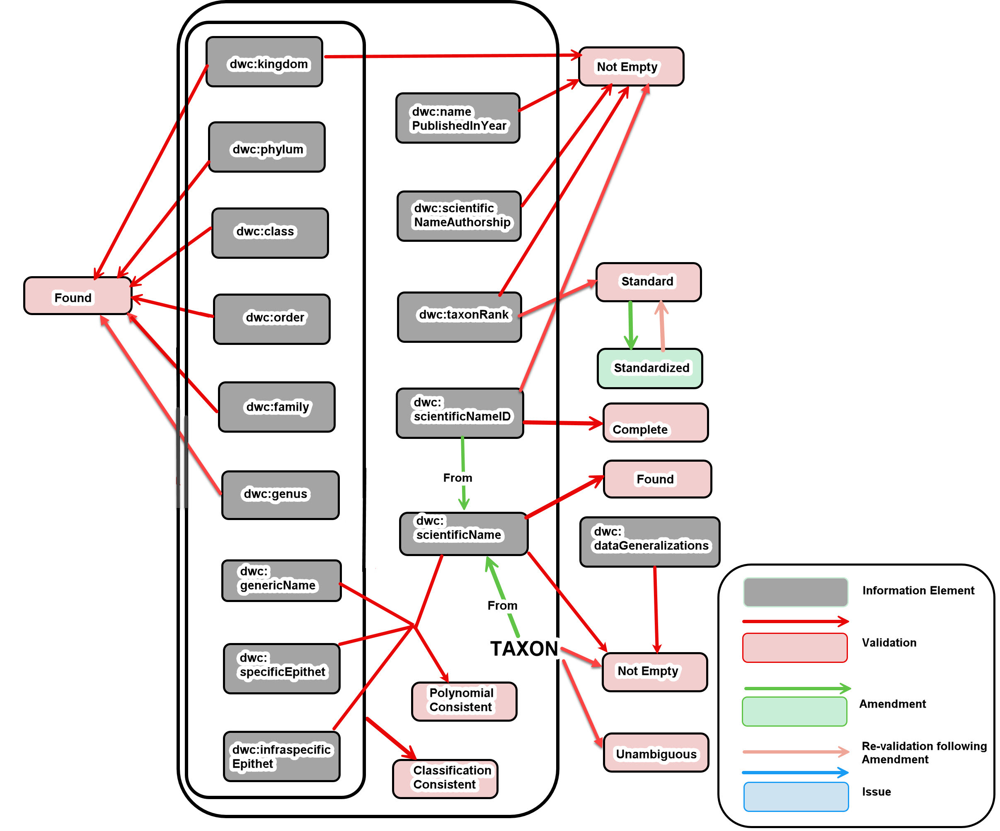
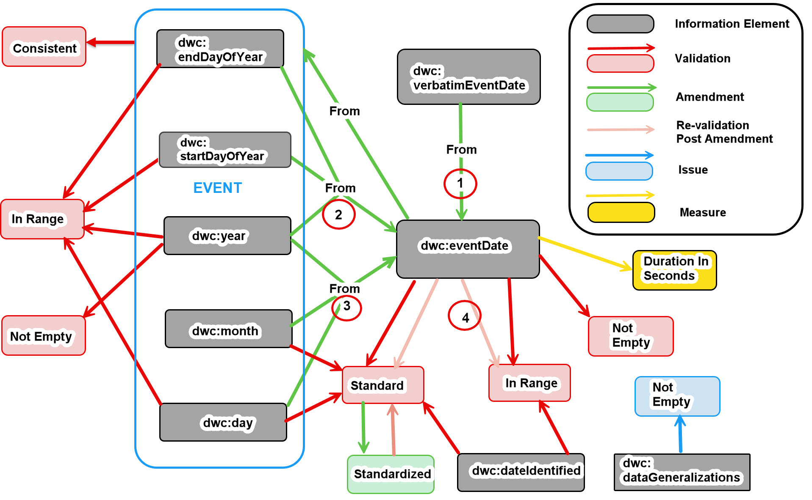
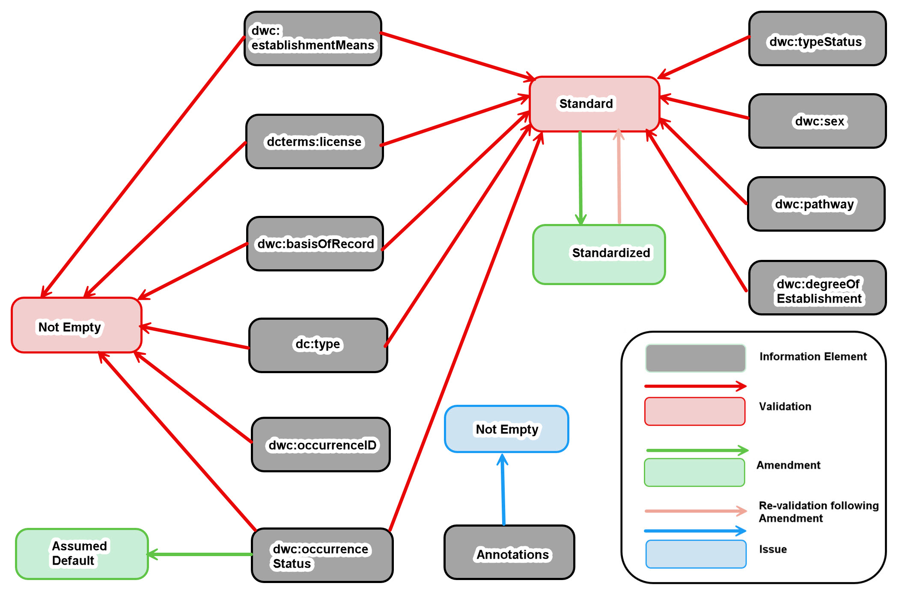

<!--- This file is generated from templates by code, DO NOT EDIT by hand --->
<!--- Template for header, values provided from yaml configuration --->
# BDQ Core Supplemental Information

Title
: BDQ Core Supplemental Information

Date version issued
: 2024-09-10

Date created
: 2024-09-10

Part of TDWG Standard
: <http://example.org/to_be_determined>

Abstract
: This document provides information supplementary to the (Draft) BDQ Core Standard, describing some of the history of the development of the standard, and rationale management  for decisions made while describing the tests..

Authors:
: [Lee Belbin](https://orcid.org/0000-0001-8900-6203) ([Blatant Fabrications](https://www.wikidata.org/wiki/Q130304884)), [Arthur D. Chapman](https://orcid.org/0000-0003-1700-6962) ([Australian Biodiversity Information Services](http://www.wikidata.org/entity/Q100600913)), [Paul J. Morris](https://orcid.org/0000-0002-3673-444X) ([Museum of Comparative Zoology, Harvard University](http://www.wikidata.org/entity/Q1420782)), [John Wieczorek](https://orcid.org/0000-0003-1144-0290) ([VertNet](http://www.wikidata.org/entity/Q98382028))

Creator
: TDWG Biodiversity Data Quality Interest Group Task Group 2: Data Quality Tests and Assertions

Bibliographic citation
: TDWG Biodiversity Data Quality Interest Group Task Group 2: Data Quality Tests and Assertions. 2024. BDQ Core Supplemental Information. Biodiversity Information Standards (TDWG). <https://bdq.tdwg/org/vocabularies/2024-09-10>

Draft Standard for Submission

### Table of Contents ###

- [1 Introduction](#1-introduction)
- [1.1 Audience](#11-audience)
- [1.2. Status of the content of this document](#12-status-of-the-content-of-this-document)
- [1.3 RFC 2119 keywords](#13-rfc-2119-keywords)
- [1.4 Namespace abbreviations](#14-namespace-abbreviations)
- [2 Historical Context](#2-historical-context)
- [2.1 Definition of CORE](#21-definition-of-core)
- [2.2 Use Case Development](#22-use-case-development)
- [2.3 Data Quality Control and Data Quality Assurance](#23-data-quality-control-and-data-quality-assurance)
- [2.4 Framework Competency Questions](#24-framework-competency-questions)
- [3 Developing the Tests](#3-developing-the-tests)
- [3.1 Types of Test](#31-types-of-test)
- [3.2 MultiRecord Tests](#32-multirecord-tests)
- [3.2.1 MultiRecord Validations, Amendments, Issues](#321-multirecord-validations,-amendments,-issues)
- [3.2.2 MultiRecord Measures](#322-multirecord-measures)
- [3.2.3 Considerations for use of MultiRecord Measures](#323-considerations-for-use-of-multirecord-measures)
- [3.3 Data Quality Dimension and 'Warning Types'](#33-data-quality-dimension-and-'warning-types')
- [3.4 Domain Scope of Tests](#34-domain-scope-of-tests)
- [3.5 Parameterising the tests](#35-parameterising-the-tests)
- [3.6 Independence and Paired tests](#36-independence-and-paired-tests)
- [3.7 Vocabularies and Synonyms](#37-vocabularies-and-synonyms)
- [3.8 Amendments and Annotations](#38-amendments-and-annotations)
- [3.9 Aspirational Aspects of Some CORE Tests](#39-aspirational-aspects-of-some-core-tests)
- [3.10 Tests and Vocabularies](#310-tests-and-vocabularies)
- [4 Date and Time Issues](#4-date-and-time-issues)
- [4.1 Dates and Calendars](#41-dates-and-calendars)
- [4.2 Time](#42-time)
- [5 Rationale Management Documentation](#5-rationale-management-documentation)
- [5.1 Developing tests with Github Issues](#51-developing-tests-with-github-issues)
- [5.2 Github Tags and Categorizing Issues](#52-github-tags-and-categorizing-issues)
- [5.3 Using Markdown Tables in Github Issues to Develop Test Descriptors](#53-using-markdown-tables-in-github-issues-to-develop-test-descriptors)

## 1 Introduction

This document contains information that is considered supplemental to the normative and non-normative BDQ Core standard documentation. 

### 1.1 Audience

Supplemental information is included those seeking further historical context, or the technical details of components of the BDQ Core standard. This information may be relevant for curators, aggregators, data publishers, data analysts, programmers/developers and other practitioners that wish to evaluate and/or improve the quality of the biodiversity data within their domain. 

This document also provides practical information to those who wish to implement BDQ Core. 

This document also provides some guidelines based on the knowledge of the authors, for those who may wish to maintain BDQ Core.

### 1.2. Status of the content of this document

This document is non-normative.

### 1.3 RFC 2119 keywords

The key words “MUST”, “MUST NOT”, “REQUIRED”, “SHALL”, “SHALL NOT”, “SHOULD”, “SHOULD NOT”, “RECOMMENDED”, “MAY”, and “OPTIONAL” in this document are to be interpreted as described in RFC 2119.

## 1.4 Namespace abbreviations

The following namespace abbreviations are used in this document:

| **Prefix**   | **Namespace**                                    |
|--------------|--------------------------------------------------|
| bdq          | https://rs.tdwg.org/bdq/terms/                   |
| bdqcore      | https://rs.tdwg.org/bdqcore/terms                |
| bdqcrit      | https://rs.tdwg.org/bdqcrit/terms                |
| bdqdim       | https://rs.tdwg.org/bdqdim/terms                 |
| bdqenh       | https://rs.tdwg.org/bdqenh/terms                 |
| bdqffdq      | https://rs.tdwg.org/bdqffdq/terms                |
| dc           | https://purl.org/dc/elements/1.1/                |
| dcterms      | https://purl.org/dc/elements/1.1/                |
| dwc          | http://rs.tdwg.org/dwc/terms/                    |
| dwciri       | http://rs.tdwg.org/dwc/iri/                      |
| oa           | https://www.w3.org/TR/annotation-vocab/          |
| owl          | http://www.w3.org/2002/07/owl#                   |

## 2 Historical Context

An internationally agreed standard suite of core tests and resulting assertions can be used by all data providers, data collectors and data users to improve the quality of biodiversity data. This will facillitate more appropriate and more accurate use of biodiversity data. Other than data availability, ‘Data Quality’ is probably the most significant issue for users of biodiversity data and this is especially so for the research community. The tests defined by BDQ Core will not correct all issues that exist with the data, but reports from the tests will hopefully identify issues that need to be addressed by users of the data. Such issues will require the user to make decisions on the data - i.e., data that may need to be excluded, data that may need improvement before use, and data that can be used as is. It is always the purview of the user to decide what data is of suitable quality for their use.

### 2.1 Definition of CORE

'CORE' in the context of BDQ Core implies that the tests are 

- Informative,
- Simple to implement,
- Mandatory for enhancements/amendments
- Have ‘power’ in that they will not likely result in 0% or 100% of all records failing or passing,
- Widely applicable across sub-disciplines within the biodiversity domain,
- Capable of elevating the significance of an issue (e.g., no value for dcterms:license) or
- Aspirational in the sense of encouraging priority developments in the biodiversity informatics domain (e.g., testing for any annotations against a record). 

The scope of CORE was also developed from the user needs analysis of BDQ Task Group 3, (Data Quality Use Cases: Rees & Nicholls 2020). The CORE tests largely cover data quality with regards to what organism has occurred where, at what place and time, and a subset of Darwin Core terms that we considered to be critical metadata about occurrence records.

A number of tests were framed, but considered out of scope for CORE data quality needs and were tagged as "Supplementary" in GitHub. These tests are likely to have a role in specific use cases. Implementers are free to implement a subset of the CORE tests or Supplementary or new tests when there is a particular data quality need within their domain. For example, the testing for a value of sub-genus against a taxonomic name authority or testing for a valid depth against maximum depth around the location of an observation. Over the period of this project, many tests were removed from CORE on the basis that they could not be currently implemented in a manner that would result in predictable results. 

Some tests were deemed not CORE because they would currently result in the majority of data not having 'quality', but designated the tests as GitHub tag "Immature/Incomplete" because we thought that the test may have value in the future. An example of such a test is VALIDATION_REPRODUCTIVECONDITION_NOTEMPTY where we would expect most records to have bdq:Empty for dwc:reproductiveCondition.

Some test were deemed not CORE because there was a perceived danger in their implementation, even though they appeared superficially implementable. In such cases, we applied the GitHub tag "DO NOT IMPLEMENT" to warn future implementers about the dangers. An example of such as test is VALIDATION_GEOGRAPHY_CONSISTENT because of the current complexities in matching terms in the geographic names hierarchy.

### 2.2 Use Case Development

Biodiversity Data Quality Task Group 3: Data Quality Use Cases (Rees & Nicholls 2020), was established to review what use cases were in common use. This group identified several fundamental use cases, including "bdq:Spatial-Temporal Patterns", "bdq:Record-Management", and "bdq:Taxon-Management". We later added "bdq:Alien-Species" and "bdq:Biotic-Relationships". 

These are only a sample of the many possible use cases used in the biological sciences, but they provide an initial set to which all the tests have been linked. Note that the relationship between Use Cases and Tests is a many to many relationship - with most tests being relatable to many use cases and vice versa.

Note that the evaluation of a test can only take place within the context of a specific use case, even if that use is broad. For example, the test VALIDATION_COUNTRY_FOUND could test the value of dwc:country against a source authority for the use case bdq:Record-Management, but this test may not be applicable to a use case related to marine ecology.

### 2.3 Data Quality Control and Data Quality Assurance

The Framework (bdqffdq: namespace) draws a distinction between Quality Control and Quality Assurance.  Quality Control processes seek to assess the quality of data for some purpose, then identify changes to the data or to processes around the data for improving the quality of the data.  Quality Assurance processes seek to filter some set of data to a subset that is fit for some purpose/use case, that is to assure that data used for some purpose are fit for that purpose.

The specification of the tests within the Framework allows the same set of tests to apply to both Data Quality Control (detecting and correcting errors) and Data Quality Assurance (filtering out problematic records to limit data to that with quality for meeting a particular need). The design of the test types Validations and Measures are intended to be agnostic as to whether their use is for Data Quality Control (finding problematic data), or Data Quality Assurance (filtering out NOT_COMPLIANT records).

### 2.4 Framework Competency Questions

The development of the representation of the Fittness for Use Framework as an owl ontology (bdqffdq:) was influenced by competency questions, shaped by the late Robert A. Morris, and originally written by David Lowery (within in the kurator-ffdq codebase).  The development of our test descriptors (the terms used to describe our tests) led to changes in the ontology (largely adopting a consistent naming pattern).  Changes to the specifics of competency questions follow on that.  

Example comptency questions that can be asked of the RDF representation of bdqcore: 

    # Given a use case find validation tests and their specifications

    PREFIX bdqffdq: <https://rs.tdwg.org/bdqffdq/terms/>
    PREFIX rdfs: <http://www.w3.org/2000/01/rdf-schema#>
    PREFIX skos: <http://www.w3.org/2004/02/skos/core#>
    
    SELECT DISTINCT ?useCase ?test ?specification
    
    WHERE {
    
        # Find Validations from the ValidationPolicy
        # for a given use case
    
        ?policy a bdqffdq:ValidationPolicy .
        ?policy bdqffdq:hasUseCase ?uc .
        ?policy bdqffdq:includesInPolicy ?cc .
        ?uc rdfs:label ?useCase .
    
        # Find the specification from the validation method
        # referencing the Validation
    
        ?cc skos:prefLabel ?test .
    
        ?vm a bdqffdq:ValidationMethod .
        ?vm bdqffdq:forValidation ?cc .
        ?vm bdqffdq:hasSpecification ?testSpec .
        ?testSpec bdqffdq:hasExpectedResponse ?specification .

        # Filter by a specific use case
    
         FILTER( ?uc = <https://rs.tdwg.org/bdqffdq/terms/Taxon-Management> )
    }

And another that lists the valuable information elements for a use case: 

    # Given a use case find the ActedUpon
    # information elements 
    
    PREFIX bdqffdq: <https://rs.tdwg.org/bdqffdq/terms/>
    PREFIX dwc: <http://rs.tdwg.org/dwc/terms/>
    PREFIX rdfs: <http://www.w3.org/2000/01/rdf-schema#>
    PREFIX dcterms: <http://purl.org/dc/terms/>
    
    SELECT DISTINCT ?useCase ?ie
    
    WHERE {
    
       # Find Validations from the ValidationPolicy
       # for a given use case
    
       ?policy a bdqffdq:ValidationPolicy .
       ?policy bdqffdq:hasUseCase ?uc .
       ?policy bdqffdq:includesInPolicy ?cc .
       ?uc rdfs:label ?useCase .
    
       # Find ActedUpon InformationElements 
       # for the Validations
     
       ?cc bdqffdq:hasActedUponInformationElement ?ieClass .
       ?ieClass bdqffdq:composedOf ?ie
    
       # Filter by a specific use case

       FILTER( ?uc = <https://rs.tdwg.org/bdqffdq/terms/Taxon-Management> )
    
    }

Summary of the distribution of tests by Data Quality Dimension and specific Darwin Core Terms in InformationElements ActedUpon: 

    PREFIX rdf: <http://www.w3.org/1999/02/22-rdf-syntax-ns#>
    PREFIX owl: <http://www.w3.org/2002/07/owl#>
    PREFIX rdfs: <http://www.w3.org/2000/01/rdf-schema#>
    PREFIX xsd: <http://www.w3.org/2001/XMLSchema#>
    PREFIX bdqffdq: <https://rs.tdwg.org/bdqffdq/terms/>
    PREFIX bdqcore: <https://rs.tdwg.org/bdqcore/terms/>
    SELECT (count(?test) as ?ct) ?dimension ?sie
    WHERE {
       ?ie bdqffdq:composedOf ?sie .
       ?test bdqffdq:hasActedUponInformationElement ?ie .
       ?test bdqffdq:hasDataQualityDimension ?dimension .
       ?test rdf:type ?testType .
       FILTER (?testType != owl:NamedIndividual)
    }
    GROUP BY ?sie ?dimension
    ORDER BY ?sie ?dimension

Summary of the distribution of tests by test Type and specific Darwin Core Terms in InformationElements ActedUpon: 

    PREFIX rdf: <http://www.w3.org/1999/02/22-rdf-syntax-ns#>
    PREFIX owl: <http://www.w3.org/2002/07/owl#>
    PREFIX rdfs: <http://www.w3.org/2000/01/rdf-schema#>
    PREFIX xsd: <http://www.w3.org/2001/XMLSchema#>
    PREFIX bdqffdq: <https://rs.tdwg.org/bdqffdq/terms/>
    PREFIX bdqcore: <https://rs.tdwg.org/bdqcore/terms/>
    SELECT (count(?test) as ?ct) ?testType ?sie
    WHERE {
        ?ie bdqffdq:composedOf ?sie .
        ?test bdqffdq:hasActedUponInformationElement ?ie .
        ?test rdf:type ?testType .
        FILTER (?testType != owl:NamedIndividual)
    }
    GROUP BY ?sie ?testType
    ORDER BY ?sie ?testType

## 3 Developing the Tests

Originally, TDWG Data Quality Task Group 2: Data Quality Tests and Assertions was tasked with finding a fundamental suite of tests and identifying any relevant software asociated with testing for 'Data Quality'/'Fitness for Use'. It was quickly realized however, that any software was likely to be far less stable than defining a CORE suite of tests and an associated framework, so the software component was quickly dropped. We also limitied the scope of the tests to apply only to data encoded using the Darwin Core standard (Weiczorek et al. 2012). This gave us a specific target, but also associated problems noted below.

Finding out what tests were being used by a range of biodiversity data aggregators was our first step in identifying candidate tests. We identified, aggregated and described 152 unique tests from GBIF, ALA, iDigBio, CRIA, BISON into a consisent structure.  Descriptors at this time included Information Elements (the Darwin Core terms used by the tests), Specification (a technical description aimed at implementation), Darwin Core Class, Source of the test and References. We peformed a full evaluation of each candidate test using the seven citeria noted in Section 2.1. Tests had to be informative in being able to evaluate or enhance the quality of a data record. Tests had to be relatively simple/straight forward to implement with existing tools. Tests were mandatory for any potential enhancements to record values in that a VALIDATION was required before any AMENDMENT. Tests required power in that they will not likely result in 0% or 100% of all record pasig or failing the test. 

The suite of tests were designed to provide an adequate coverage of basic information dimensions of Darwin Core: dwc:Taxon (GitHub tag NAME); dwc:Event (GitHub tag TIME) and dcterms:Location (GitHub tag SPACE), and a category that we called "Other" (GitHub tag OTHER) to cover tests on dwc terms such as dc:license (see Section 3.1). Tests also had to be widely applicable across a range of use cases. Tests that were identified as useful in a limited context were documented were (GitHub) tagged as "Supplementary" in that they could be implemented by a community of usage.

We originally rendered the tests in the form that flagged a **FAIL**, for example a dwc:eventDate that did not conform to ISO 8601-1 date. Our reasoning was this strategy aligned with all of the sources of the tests in that we all sought to identify **issues** with values in the record that would reduce its quality. However, the Data Quality Framework (Veiga et al. 2017) worked in the opposite direction: Identifying values in a record that **PASSED** a test; increased 'quality'. To align with the Framework, we renamed all tests from FAIL to PASS type, for example, COUNTRYCODE_NOTSTANDARD became COUNTRYCODE_STANDARD. This reversal of 'fail' to 'pass' was also reflected in the comparison of the Framework's 'Data Quality Dimension' versus our early concept of 'Warning Type' (see Section 3.2).

Second and subsequent evaluations of the candidate core tests reduced the number to about 100 that seemed to fulfil the criteria above. The Tests came and went as we provided more consistent and compehensive documentation against what we called the test Descriptors. The tests also changed as we began to implement them. We modified a Test Specification to then find that we would not be able to implement it due to potential ambiguous responses from the test or that a test response may be misleading. By far the greatest changes to the candidate tests came about when we implemented them and ran them against the Test Data (https://github.com/tdwg/bdq/blob/master/tg2/_review/build/templates/synthetic/synthetic-header.md).

At one point, we aligned the documetation for over sixty tests that were tagged in GitHub as Supplementary, Immature/Incomplete and DO NOT IMPLEMENT. In doing so, we realized that the consistent documentation now provided a more nuanced evaluation and subsequently moved a number of these tests back into the core set. The opposite was also true: The implementation of the tests and running against the test data clearly demonstrated that some tests were moved out of CORE. Where there were recognized nuances with the tests that may not be obvious from the Specification, we documented the issues in the test Notes.

The team identified a fundamental problem early in the development of the tests: Darwin Core lacked a comprehensive suite of controlled vocabularies. Testing for 'quality' or 'fitness for use' was made difficult at best and impossible at worst, when controlled vocabularies were unavailable. We recognized the key issue of openness of the Darwin Core standard, yet the need for controlled vocabularies to evaluate and improve the 'quality' of Darwin Core encoded data was also important. This conclusion effectively initiated Data Quality Task Group 4: Best Practices for Development of Vocabularies of Value (https://www.tdwg.org/community/bdq/tg-4/) to provide a framework for how these vocabularies could be developed for a priority set of Darwin Core Terms. This in turn has resulted in GBIF initiating https://github.com/gbif/vocabulary, and see also https://docs.google.com/viewer?url=https%3A%2F%2Fdev.gbif.org%2Fissues%2Fbrowse%2FGBIF-121%2Fgbif-vocabularies-review_v01.docx.

Over the course of the development of the tests, we encountered significant difficulties with choices of words.  In the original formulation of the framework (Viega 2016 - Thesis), different words were used to describe parallel concepts at the levels of data quality needs, solutions, and reports, and the words used for fundamental concepts overlapped with those for derived concepts.  We have settled on Dimension, Criterion, and Enhancement as the words for fundamental concepts, and variations on Validation (Validation, ValidationMethod, ValidationAssertion), Measure, Amendment, and Issue for derived concepts.  It was very late in development of the test specifications that we realised that the heart of what we were terming Validation mapped to the derived concept of CriterionInContext/ContextualizedCriterion in the Framework (Veiga et al. 2017), so we have renamed Framework concepts for clarity.

### 3.1 Types of Test

The types of test in BDQ Core are identified by the bdqffdq namespace classes of Validation, Issue, Amendment and Measure. Each of these types of tests can be composed with a ResourceType to apply to a single record (bdqffdq:SingleRecord), or to multiple records in a data set (bdqffdq:MultiRecords).  In BDQ Core, we have described as set of SingleRecord Validations, Issues, Ammendments, and Measures, and in addition, a set of MultiRecord Measures. 

**Validation** tests are phrased as positive statements, consistent with the Framework.  Validations evaluate values or in some cases, presence or lack of a value to see if input data have quality for some purpose. For example, VALIDATION_TAXONRANK_NOTEMPTY will return Response.status RUN_HAS_RESULT and Response.result COMPLIANT if a record under test contains a value in dwc:taxonRank, rather being phrased in the negative (i.e. VALIDATION_TAXONRANK_EMPTY) and flagging a problem.  Data are found to be fit for some use if all Validations comprising that Use have a Response.result of COMPLIANT. The formal response of Validations can take one of four forms. A Response.status of "EXTERNAL_PRREQUISITES_NOT_MET" when an external authority service is unavailable (bdq:sourceAuthority), a Response.status of "INTERNAL_PREREQUISITES_NOT_MET" when the values of one or more of the Information Elements are such that the test cannot be meaningfully run, a Response.status of "RUN_HAS_RESULT" when the prerequisites for running the test have been met, and in this situation, a Response.result of either "COMPLIANT" if the values of the Information Elements meet the criteria, or "NOT_COMPLIANT" when they do not. 

During the development of the tests, there were significant discussions about how tests were to be phrased, for several contributors (and all tests implemented by agencies such as th ALA and GBIF), the most natural form seemed to be to describe assertions in the negative sense, identifying problems. The bdqffdq Framework, however, focused entirely on positive statements, identifying data that have quality and are fit for purpose.  Over the evolution of the description of the tests we conformed the language to the positive sense of the Framework in almost all cases.  Validations are thus phrased in the Framework sense of being COMPLIANT if the data have quality with respect to the test evaluation criteria.  There were, however, a set of cases that didn't fit well into this positive sense, in particular, those where the conclusion of the test was that the data might or might not be fit for purpose and a human would have to evaluate more closely.  In order to accomodate this "there might be a problem" case, we expanded the framework to include the concept of bdqffdq:Issue, where Issues are the converse of Validations and are phrased in a negative sense, identifying problems, see below. 

**Issues** are a form of warning flag where the test is drawing attention to potential problem with the value of a Darwin Core term for at least one use case. Issues can result in a Response.status of "RUN_HAS_RESULT" accompanied by a Response.result of either "POTENTIAL_ISSUE" or "NOT_ISSUE".  An ISSUE is the equivalent to NOT_COMPLIANT from a Validation.  NOT_ISSUE is similar to COMPLIANT from a Validation, but with slightly different semantics, COMPLIANT means that the data is fit for some use, NOT_ISSUE means that no reason was found for the data not to be fit for use.  POTENTIAL_ISSUE is the reason we incorporated Issues tyype tests into bdqffdq.  POTENTIAL_ISSUE means that the Issue found a concern in the data that might make it unfit for some use, but that human evaluation of the details of the data and the use are needed. Data flagged with potential issues require a human review.  For example, ISSUE_DATAGENERALIZATIONS_NOTEMPTY will return a Response.result of POTENTIAL_ISSUE if dwc:dataGeneralizations contains a value, as the actual value in dwc:dataGeneralizations and the assertions it makes about what changes have been made to generalize other Darwin Core terms will require human review in the context of a particular use of the data to determine whether the data are fit for purpose or not.

**Amendments** may propose a change to one or more Darwin Core values or fill in missing values. Amendments are intended to improve one or more components of the quality of the record.  The Response.result from an Amendment is a proposal for a change, not to be blindly applied to a database or record when a data quality report is used for Quality Control of an existing record.  Consumers of Data Quality Reports under Quality Assurance uses may choose to (blindly - not recommended, or after analysis) accept all proposed amendments as part of a pipeline in preparing data for an analysis. We urge that Amendments not overwrite existing information within a database but to preserve the old information as well as the new.

The Framework also supports Amendments where the Response.result is a proposal to changes in procedures, such as suggesting that a constraint should be placed on a database field to restrict allowed values, or that a mapping of a data set onto Darwin Core terms has transposed a set of fields, or some other process related change.   We have not framed any such tests in this form, nor have we considered how such assertions should be represented in a Response.result. 

When carrying out Amendments where numeric vales are concerned (e.g. feet to meters, etc.) the principle of reversability is paramount, and thus rounding up or down or using approximations should be avoided and only exact values used. In BDQ Core, we have taken an expedient approach in relation to making AMENDMENTs. We have used code in our tests to try and parse out likely, unambiguous matches. This is far from an ideal solution, but it does provide the potential of our AMENDMENTs to 'value add' to Darwin Core data records.

**Measures** 
 A Measure returns a numeric value of COMPLETE or NOT_COMPLETE as the Response.result. Most SingleRecord Measures defined here count the number of Validation or Amendment tests with a specifified Response.Result in a SingleRecord. Measures defined in bdqcore: may apply to a single record (bdqffdq:SingleRecord), or can be accumulated across multiple records (bdqffdq:MultiRecords).  See [3.3.2 MultiRecord Measures](#332-MultiRecord-Measures) for further discussion of MultiRecord Measures.

SingleRecord MEASUREs within the bdqcore: namespace are MEASURE_VALIDATIONTESTS_COMPLIANT, MEASURE_VALIDATIONTESTS_NOTCOMPLIANT, MEASURE_VALIDATIONTESTS_PREREQUISITESNOTMET, MEASURE_AMENDMENTS_PROPOSED and MEASURE_EVENTDATE_DURATIONINSECONDS.  Of these, MEASURE_EVENTDATE_DURATIONINSECONDS is intended to provide an estimator for the duration of an event date that can be used as a criterion for Quality Assurance for some use cases, for example, a phenology use may need temporal resolution of records to within about a day, while a use involving long term patterns of spatial change may be satisfied by temporal resolution of a year or better.  Rather than providing specific measures for each possible duration, we chose to provide just this one generic measure that could be used as a filter criterion for any Use Case.  The other SingleRecord measures in BDQ Core take the Responses from other tests as their input and are intended for Quality Control uses to group records by number of data quality concerns present.   

### 3.2 MultiRecord Tests

When defining a test, the test Type (Validation, Amendment, Measure, Issue) is composed with a ResourceType (SingleRecord or MultiRecord).  This determines if the test results in assertions about a single record or a dataset as a whole.

#### 3.2.1 MultiRecord Validations, Amendments, Issues

We do not define MultiRecord Validations, Amendments or Issues in BDQ Core, though these are allowed within the namepsace bdqffdq.  A MultiRecord Validation, for example, could evaluate all instances of dwc:occurrenceID in a data set and assert COMPLIANT if they are unique.  A MultiRecord Amendment, could, for example, evaluate all values of dwc:decimalLatitude and dwc:decimalLongitude in a dataset, assert that they are probably transposed, and that the consumer of the data quality report should check that the two terms do not have their values transposed, and if that is the error, switch their values.  

#### 3.2.2 MultiRecord Measures

MultiRecord tests examine data across multiple records, a dataset.

The BDQ Core MultiRecord Measures all take the output of other tests as their input rather than from the data records. The inputs (Information Elements) for these Measures in bdqcore: are the outputs of SingleRecord Validations. We have defined two sets of MultiRecord Measures in BDQ Core.  One of these sets consists of Measures that return COMPLETE or NOT_COMPLETE, the other set consists of Measures that return numeric values.  These are intended for Quality Control and Quality Assurance (sensu Viega, et al.  2017).  

In the BDQ Core suite of tests, for each bdqffdq:SingleRecord Validation, there is defined a bdqffdq:MultiRecord Measure that returns COMPLETE when all records in the bdqffdq:MultiRecord have a Response.result of COMPLIANT, and NOT_COMPLETE when they are not.  Under QualityAssurance, these measures serve as the key criterion for identifying data which have quality for the relevant UseCase.  Data are found to be fit for some Use if all Validations comprising that Use have a Response.result of COMPLIANT, and if such are included, all (non-numeric) Measures comprising that Use have a Response.result of COMPLETE.  A MultiRecord dataset is fit for use for a given UseCase if each of the MultiRecord Quality Aassurance Measures on that MultiRecord returns COMPLETE.  If this is not the case, SingleRecords where the Validations are other than COMPLIANT are filtered out until all of the MultiRecord Quality Assurance measures return COMPLETE. The MultiRecord Quality Assurance Measures are the formal means the Fitness for Use Framework provides for ensuring that a dataset is fit for use for a given Use Case.  Thus, under QualityAssurance, a bdqffdq:MultiRecord is filtered to remove records that do not fit the criteria of bdqffdq:MultiRecord Measures for Completeness, such that a filtered bdqffdq:MultiRecord has Response.result values of COMPLETE for all bdqffdq:MultiRecord Measures. 

We have also defined MultiRecord Measures that count the number of instances of some state for the Response objects from some SingleRecord Validation run over all the records in a dataset.  For example, to return a count of Response.value of COMPLIANT for a particular Validation across a data set, thus providing a numeric measure of how fit a dataset is for some purpose.  This subset of measures in BDQ Core simply counts the Responses from a given Validation that have Response.result of COMPLIANT.  For Quality Control, these numbers identify where (and how much) work is needed to make more of a dataset fit for use for a given Use Case.  These MultiRecord Measures that return counts can also be run before an amendment step in a data processing pipeline, and then run again after applying all of the proposed changes to the data from the Amendments to the data in the pipeline.  A comparison of these pre-amendment and post-amendment phases will identify how much accepting all of the proposed changes from the amendments will improve the quality of the data for a given Use Case.  We have chosen to phrase these as returning a count of COMPLIANT (but see note in [3.2.3](#333-considerations-for-use-of-multirecord-measures) below), and let consumers calculate percentages of compliant from the number of records in the dataset.  Other statistics are possbile, but under the constraint of the Framework (bdqffdq:), a Measure may only return a single numeric value or COMPLETE/NOT_COMPLETE.

MultiRecord measures can also operate directly on the data, that is, to use data terms as the input InformationElements. For example, a MultiRecord Measure could be framed to measure the average number of individuals reported in dwc:individualCount in a dataset, or could be framed to report another statistic on that or another term.  We have defined no Measures of this form in BDQ Core.

#### 3.2.3 Considerations for use of MultiRecord Measures

Some Validations return Response.status="INTERNAL_PREREQUISITES_NOT_MET" when one or more of the input InformationElements contain empty values.  For some UseCases, empty values in some fields make the data not fit for use (these are usually tested directly for with VALIDATION...NOTEMPTY tests), however, some Validations operate on sparse data or other cases where the data is fit for use even without values, but when values are present, they must comply with some restriction.  For example, dwc:minimumDepthInMeters and dwc:maximumDepthInMeters are not expected to be populated for terrestrial data, but are expected to be within range when values are supplied for freshwater and marine data.  A subset of the MultiRecord Quality Assurance Measures accomodate such cases by returning a Response.result="COMPLETE" for Validations that are either Response.result="COMPLIANT" or Response.status="INTERNAL_PREREQUISITES_NOT_MET". Thus, they can measure that all of the SingleRecords in a MultiRecord either have, for example, no value in dwc:minimumDepthInMeters or have an in-range value for dwc:minimumDepthInMeters.   

It is possible, but less flexible, to frame Validations to return Result.response="COMPLIANT" for either empty values (bdq:Empty) or non-empty values (bdq:NotEmpty) that satisfy other Validation criteria.  Concerns are better separated, and individual tests are better composed to fit particular user needs, by having the Validations treat empty data with a Response.status="INTERNAL_PREREQUISITES_NOT_MET", and then framing MultiRecord Quality Assurance Measures as appropriate for a given Use Case.

### 3.3 Data Quality Dimension and 'Warning Types'

A "Warning Type" for each test was envisioned to provide insight into the nature of the issues associated the original 'negative-oriented' results of the tests. Initially, we had a concept of 'severity' where a failed test could be considered either a "Warning" or an "Error". We subsequently elaborated the warnings into "Warning Types" that had a value of "Ambiguous", "Amended", "Incomplete", "Inconsistent", "Invalid", "Issue", "Report" or "Unlikely". In 2023, a cross tabulation of 'Data Quality Dimension' from the Framework (Veiga et al. 2017) against 'Warning Type' demonstrated that they were highly correlated (see table below). Subsequently, 'Warning Type' was removed as a test Descriptor.

| Data Quality Dimension/Warning Type | Ambiguous | Amended | Incomplete | Inconsistent | Invalid | Issue | Report | Unlikely | Total |
|-------------------------------------|-----------|---------|------------|--------------|---------|-------|--------|----------|-------|
| Completeness                        |           |   11    |    22      |              |         |   1   |    5   |          |  39   |
| Conformance                         |     2     |   17    |            |              |    40   |       |        |          |  59   |
| Consistency                         |           |    1    |            |       7      |         |       |        |          |   8   |
| Likeliness                          |           |         |            |              |         |       |        |     2    |   2   |
| Reliability                         |           |         |            |              |         |   1   |    2   |          |   3   |
| Resolution                          |           |         |            |              |         |   1   |    1   |          |   2   |
| Total                               |     2     |   28    |    22      |       7      |    40   |   3   |    8   |     2    | 113   |

Caption: Data Quality Dimension vs Warning Type (as of 2023) with the number of tests as cell values. 

The following sparql query to count tests by type and data quality dimension: 
<pre>
PREFIX rdf: <http://www.w3.org/1999/02/22-rdf-syntax-ns#>
PREFIX owl: <http://www.w3.org/2002/07/owl#>
PREFIX rdfs: <http://www.w3.org/2000/01/rdf-schema#>
PREFIX xsd: <http://www.w3.org/2001/XMLSchema#>
PREFIX bdqffdq: <https://rs.tdwg.org/bdqffdq/terms/>
PREFIX bdqcore: <https://rs.tdwg.org/bdqcore/terms/>
SELECT (count(?test) as ?ct) ?dimension ?testType
WHERE {
?test bdqffdq:hasDataQualityDimension ?dimension .
?test rdf:type ?testType .
FILTER (?testType != owl:NamedIndividual)
}
GROUP BY ?dimension ?testType
</pre>

Gives the following distribution of test types by Dimension:

| Data Quality Dimension | Validation | Amendment | Issue | Measure | 
| ---------------------- | ---------- | --------- | ----- | ------- | 
| Conformance   | 41 | 17 | 1 |   | 
| Consistency   | 7  | 1  |   |   | 
| Completeness  | 22 | 11 | 1 | 1 | 
| Likeliness    | 2  |    |   |   | 
| Resolution    |    |    | 1 | 1 | 
| Reliability    |    |    |   | 2 | 

### 3.4 Domain Scope of Tests

The domain scope of each test is largely provided by the value of the term bdqffdq:DataQualityNeed. The Darwin Core terms evaluated by each test are expressed as specific bdqffdq:InformationElements. The bdqffdq:Specification provides details of how to evaluate values of the information elements, but also includes references to external authorities (to the Darwin Core standard) that are required to implement the test. For example, an external references to an ISO standard. Such authoritative references are listed under "Source Authority" with a link to the authority and where available, a link to a specific online resource such as an API required for the implementation of the test.

### 3.5 Parameterising the tests

Parameterized tests are those for which we detected a likelihood of different data quality needs within the community of CORE users and CORE needs. For example, the existence of national requirements for spatial data to be represented with a particular datum. When we identified that within Core data quality needs, different portions of the community have different authorities that they are required to adopt for particular terms, we defined Parameters for the tests. The Parameter values allow a particular test to behave differently when given different parameter values.  This allowed the development of generic tests that provide support for non functional requirements that vary within the community. An example of such a test is AMENDMENT_GEODETICDATUM_ASSUMEDDEFAULT, which takes the Parameter bdq:defaultGeodeticDatum, with a default value that fills most users’ needs of “EPSG:4326”. But we recognized that some users may have requirements that for data to have quality, they must associate dwc:decimalLatitude and dwc:decimalLongitude with a different spatial reference system in dwc:geodeticDatum. Other tests related to georeferences are similarly parameterized, with a similar default, understanding that most CORE users will be working with dwc:geodeticDatum="EPSG:4326", but others will have requirements for a different spatial reference system. Similarly, parameters are specified for depth and elevation information based on global maximum values, while user communities may have data falls entirely within some smaller geographic region may want to impose tighter constraints on depth and elevation for their data to have quality. For example for quality control, to identify records needing evaluation where the specified elevation is larger than any elevation within the region.

Where there are options available for a resource that supports the test, the test will be designated as "Parameterized" and a default provided, along with a link to an appropriate authority if relevant. For example, the "GBIF taxonomic backbone" is suggested as a default for most of the tests relating to taxonomic names, but the BDQ Core recognizes that other Source Authorities may be required within other communitites, for example, The World Register of Marine Organisms (WORMS: https://www.marinespecies.org/) or a national taxonomic authority.  When a test has a single source authority Parameter, bdq:sourceAuthority is used for that parameter, but if a test takes more than one source authority Parameter, each is given distinct names, for example, bdq:taxonIsMarine and bdq:geospatialLand are two source authority Parameters for the test VALIDATION_COORDINATESTERRESTRIALMARINE_CONSISTENT. 

Parameters, within the namespace bdqffdq: have been modeled as falling within the realm of data quality solutions, they are not attributes of the data, nor are they attributes of data quality needs.

Since value supplied for a parameter for the test is an attribute of the Mechanism (of the system assessing the data quality), the Specification of a test cannot evaluate the validity of Parameter values as a part of the test logic. Consequences from problems with the validity of values of Parameters (e.g. an incorrect IRI for a source authority API endpoint) may only result in Response.status="EXTERNAL_PREREQUISITES_NOT_MET" values, as Parameters are assertions about externalities to the data and may change if the same data are applied to the same test with a different Parameter configuration.

Parameters are not intended to relax the definition of data having quality for Core needs. The specifications deliberately do not include Parameters that would relax tests on secondary terms for downstream research users or tighten them for upstream data capture. Some tests which would serve the needs of users engaged in data capture or preparing data for aggregation, but not of downstream aggregators or research users were considered, but deemed not CORE. We have similarly resisted the temptation to Parameterize tests to meet the needs of different portions of the data life cycle.

### 3.6 Independence and Paired tests

To the best of our abilities, we have designed each test to stand alone.  This design supports the mixing and matching of these and other tests to meet particular data quality needs. We do not impose any particular model of test execution on implementation frameworks. The specification of any interdependencies among tests would immediately impose constraints upon test execution frameworks.  Implementations of test execution frameworks may execute tests on data records in parallel, on data records in sequence, as queries on datasets, or on unique values. For a subset of amendments, we do provide guidance on execution order to produce deterministic results.

BDQ Core tests are paired in that Amendments have a corresponding Validation that assesses the same aspect of data quality. An Amendment may be able to improve the quality of data with respect to that Validation. The Framework contains terms for expressing such formal relationships among tests, we have chosen not to specify these to allow users to more flexibly to address their data quality needs. What we would however recommend, is that the data evaluation process generally run all Validation Type tests, then Amendment Type tests, then re-run the Validations a second time.

### 3.7 Vocabularies and Synonyms

As noted above, one early conclusion to this project was the need for controlled vocabularies and led to an early spin-off of the Data Qality Task Group 4: Best Practice for Development of Vocabularies of Value (https://github.com/tdwg/bdq/tree/master/tg4). Testing the 'quality' or 'fitness for use' of Darwin Core encoded data is made more difficult due to the lack of a comprehensive suite of controlled vocabularies.

Testing Darwin Core values against a known Source Authority using a VALIDATION type test is straight forward: A test is either COMPLIANT or NOT COMPLIANT. The BDQ Core standard also includes tests of type AMENDMENT, and the mapping of input Darwin Core values to known Vocabulary values is poorly developed. If a VALIDATION returns COMPLIANT, no AMENDMENT is necessary. For example, if the input value to a test evaluating sex is dwc:sex="Female", then no AMENDMENT is required. If however, the input value is dwc:sex="f.", this can likely be interpreted as "Female"? The same is not true for dwc:sex="M" This value could be interpreted as "Male" or "Mixed" according to https://api.gbif.org/v1/vocabularies/Sex/concepts. GBIF currently treats this as "Male" but without a comprehensive synonymy within the vocabularies, one cannot be certain that this is the case. A key phrase within this standard that particularly relates to many of the Expected Responses of tests is "dwc:term can be unambiguously interpreted as ...". In the case of dwc:sex="M", the determination is that the value is ambiguous and no AMENDMENT can be made.

**We see an urgent need for a comprehensive, internationally agreed list of Darwin Core (https://dwc.tdwg.org/) term values that are mapped to standard values**. GBIF has implemented some of unique values for some Darwin Core terms, for example https://api.gbif.org/v1/vocabularies/Sex/concepts/Female/hiddenLabels, but such lists are not currently comprehensive, and we see this is a severe limitation to the evaluation of 'data quality'/'fitness for use'. While there has been a survey of Darwin Core 'distinct values' for GBIF, ALA, iDigBio and VertNet, these are dated, and have not been mapped to standard values, if they exist.

### 3.8 Amendments and Annotations

The BDQ Core Standard supports the W3C Annotation Data Model (W3C 2017) for reporting the results from tests, including Amendment Type Tests. The bdqffdq:Assertion, with its Response.status, Response.result, and a Response.comment can form the body of an annotation, that is be related to an oa:Annotation through oa:hasBody.

The AMENDMENT tests in the BDQ Core only propose changes, and it becomes the responsibility of the consumer of the data quality report under Quality Control to assert when and what changes are made to records. The most consistent path is to allow consumers of data quality reports to extract the metadata about the reasoning for a change from the Response.comment in an Amendment, and add that to their representation of the data.

### 3.9 Aspirational Aspects of Some CORE Tests

**Vocabularies.** Darwin Core Standard is deliberately permissive, and the BDQ Core tests impose additional expectations on data expressed in Darwin Core terms in the interest of data quality.  Some tests assert that data must be in the form described in the normative definition of a Darwin Core term (for example, tests of dwc:day that evaluate compliance with "The integer day of the month ..." - https://dwc.tdwg.org/terms/#dwc:day).  Some tests evaluate compliance with expectations imposed by non-normative notes/comments or examples in Darwin Core, often working from the phrase in the comments "Recommended best practice is to use a controlled vocabulary".  In BDQ Core we aspire for the community to adopt common controlled vocabularies to improve the quality of biodiversity data.

The flexibility of Darwin Core (on which BDQ Core is based) in relation to vocabularies, is a problem when 'data quality'/'fitness for use' of Darwin Core records is attempted. Controlled vocabularies seemed a wise aspirational goal and for this reason, as noted elsewhere, the TDWG Biodiversity Data Quality Task Group 4: Best Practice for Development of Vocabularies of Value was created (https://github.com/tdwg/bdq/tree/master/tg4). Subsequently, GBIFs vocabulary services supporting Darwin Core and other namespaces (see https://rs.gbif.org/vocabulary/dwc/) were developed and are gradually expanding to cover more Darwin Core terms. We look forward to the uptake of a far more comprehensive suite of controlled vocabularies a synonym list that will greatly improve the quality of biodiversity-related data and its evaluation and we have been working with GBIF on this.

**Georeferencing.** Some tests are aspirational about ways in which the community should express things in order for there to be quality, for example, bringing in an understanding of georeferencing best practices (Chapman & Wieczorek 2020) of the set of metadata concepts that need to have values for there for quality georeferences, for example VALIDATION_GEODETICDATUM_NOTEMPTY. Similarly, we have encouraged the use of controlled vocabularies that the community should aspire to using, such as the EPSG codes for datums (https://epsg.org)

**Annotations.** The authors reeconized the significance of an annotation standard to BDQ Core and one test specifically targets record annoations: ISSUE_ANNOTATION_NOTEMPTY, even though no Biodiversity Information Standards/TDWG standard exists. We do however acknowledge the TDWG Annotations Interest Group (https://github.com/tdwg/annotations) has identified the W3C Web Annotation Data Model (W3C 2017) as the obvious way forward.  We understood that the annotation test will be difficult, if not impossible for many to implement, but we considered this issue of such significance, that we have included it to promote the use of the W3C web annotation data model by the community. We also acknowledge that data aggregators such as the Atlas of Living Australia (https://ala.org.au) have had an operational annotation service for many years (see https://support.ala.org.au/support/solutions/articles/6000262125-flagging-an-issue-with-a-record) but like other current implementations, this service is a subset of what is required for a comprehensive service (e.g., annotations on annoations for one).

**High Seas.** A number of BDQ Core tests assert a 'lack of quality' for records representing events on the high seas/international waters (outside national jurisdictions) where tests will return 'NOT_COMPLIANT' as there is no currently agreed standard for designating 'high seas' records using Darwin Core (https://dwc.tdwg.org/). Examples of such tests include VALIDATION_COUNTRY_NOTEMPTY and VALIDATION_COUNTRYCODE_NOTEMPTY. The authors recognize the significance of this issue to the marine community, and we have retained these tests to promote an agreement on an international standard. We acknowledge a current user-assigned ISO 3166-alpha-2 country code (dwc:countryCode - https://dwc.tdwg.org/terms/#dwc:countryCode) of "XZ" to infer "international waters" (see https://en.wikipedia.org/wiki/ISO_3166-1_alpha-2#XZ and https://en.wikipedia.org/wiki/UN/LOCODE). While country code "XZ" looks like a much-needed advance, its use has not be standardized. The situation with populating a country value (dwc:country - https://dwc.tdwg.org/terms/#dwc:country) with "high seas" or "international waters" or something else is less advanced, but we have retained the country test, aspirationally. Related tests such as VALIDATION_COUNTRY_FOUND, VALIDATION_COORDINATESTERRESTRIALMARINE_CONSISTENT and VALIDATION_COUNTRYCOUNTRYCODE_CONSISTENT don't present as much an issue, due to the Specifications including the phrase "INTERNAL_PREREQUISITES_NOT_MET" if dwc:countryCode or dwc:country are bdq:Empty, as would be currently expected for records in international waters. The Specification in effect says "This test can't be done because a vital piece of information to run this test is absent". While currently acceptable, once a standard for international waters/high seas is established, the tests will need to be revisited.

### 3.10 Tests and Vocabularies

The development of the tests and assertions from the tests was the core business for Task Group 2. To achieve that outcome, we needed to describe the tests in a comprehensive and consistent manner and hence a unified vocabulary was developed (https://github.com/tdwg/bdq/issues/152).  While the Data Quality Framework (Veiga et al. 2017) developed a formal model for describing data quality and fittness for use ontology for 'data quality'/'fitness for use', it would be fair to say that while Task Group 2 committed to representing tests using this model, it initially took an independent, and 'bottom-up'approach.  As noted above, Task Group 2 first examined what tests agencies and others in the community were using to assess data quality and then filled gaps, establishing criteria for test inclusion or exclusion. We then started framing each of the included tests in a common format, which meant the formation of useful descriptive terms.  Both the tests and the vocabulary evolved: The Tests refined our vocabulary and our vocabulary refined our tests.  The single resulting vocabulary, represented as a markdown table in GitHub (https://github.com/tdwg/bdq/issues/152) became a single central place for evaluating and refining terms, scope and definitions.  

After some years of work, our vocabulary and tests were effectively merged with the Framework ontology. A good example of this evolution was reformulating Tests from 'negative' (having issues) to 'Positive' (having quality). Tests like VALIDATION_COUNTRY_NOTFOUND became VALIDATION_COUNTRT_FOUND. The independence of development of the tests lead to improvements and clarifications in the Framework ontology.  The test development process identified very clear needs for tests to be able to be parameterized and for tests to be able to identify elements of the data that might be problematic for some use case.  This lead to the introduction of the concepts of bdqffdq:Parameter and bdqffdq:Issue. The names of some terms in the ontology was very opaque, and names were not entirely consistent, so elements were renamed for clarity (e.g. ContextualizedEnhancement became bdqffdq:Amendment) and to follow consistent naming patterns.  

Once the vocabulary terms and their definitions had become stable, they were assigned (or ported back into) to specific namespaces: 

- bdqffdq	https://rs.tdwg.org/bdqffdq/terms for the ontology that forms the Framework for defining data quality. 
- bdqdim	https://rs.tdwg.org/bdqdim/terms/ for the Data Quality Dimension of (Measures and all) the tests
- bdqcrit	https://rs.tdwh.org/bdqcrit/terms/ for the Criteria of the Validation and Issue tests
- bdqenh	https://rs.tdwg.org/bdqenh/terms/ for the Enhancements of the Amendment tests
- bdq	https://rs.tdwg.org/bdq/terms/ for terms used to construct Specifications: source authorities, parameters, information elements, and the concepts bdq:Empty and bdq:NotEmpty

These vocabularies all fed into a formal description of the tests as terms in the bdqcore: namespace (bdqcore: https://rs.tdwg.org/bdqcore/terms/) where the Tests with their descriptions were framed using the other vocabularies.

A few terms in the vocabulary table were seen as glossary terms (e.g. "geodetic datum") for which a formal vocabulary is not required.  These are presented in tables as a glossary in relevant descriptive documents. 

## 4 Date and Time Issues

BDQ Core avoids analysis of two time and date issues, time zones and geographic and temporal variation in the change from Julian to Gregorian calendars.  

### 4.1 Dates and Calendars

Different calendars have been used at different times in different places, and the transcription of an original date in one calendar into dwc:eventDate, where a Gregorian Calendar is assumed, may or may not have been done with the correct translation of the date. Metadata may or not be present to even identify such records.

Countries and researchers have changed from the Julian calendar to the Gregorian calendar at different times. For example, Russia adopted the Gregorian Calendar on the ISO date 1918-02-14, the British Empire in 1752-09-14, different regions in France between 1582 and 1760, with France also adopting the French Republican Calendar 1793-1805. The difference between the Gregorian and Julian calendar has typically been around 10 days, but the day that is considered the first day of the year has also changed at different times in different countries. This means that the difference can be as great as 1 year and 10 days. 

Given the complexity and ongoing nature of transitions between calendars, we do not advocate using VALIDATION_EVENTDATE_INRANGE for quality assurance by selecting a transition date and using it as a threshold. This test can't assess if a date is actually within a Gregorian date interval, except in special cases where the Julian and Gregorian calendars coincide, and even that is ignoring all other possible calendars. Instead, this test is able to evaluate a date following the ISO 8601-1 date specification is within a range specified in that context. 

In general, assessing whether a date in biodiversity data was Julian or Gregorian is treated here as an intractable problem, and the problem of correctly determining the gregorian value for dwc:eventDate is left in the hands of data providers who may have additional knowledge of collectors and their practices to assess how to interpret verbatim date values found in their historical records. For data consumers, this means that historical dates, even into recent times, may have systematic errors in subsets of the data where the date was Julian but has been treated as Gregorian.  This can, in some cases, introduce errors on the scale of one year differences between reported and correct eventDate values. 

### 4.2 Time

If a time zone is not included as a component of date and time, the date and time information is expected to be consistent throughout the event terms

Time is treated as out of scope for BDQ Core Use Cases.  In cases where time zone data is important, dates within a MultiRecord from multiple sources may have multiple plus or minus one day errors introduced. For example, the event_date_qc implementation of AMENDMENT_EVENT_FROM_EVENTDATE contains the commented out block of code below that is pertinent to time zone issues.   It would populate eventTime from eventDate, converting a local time in eventDate to UTC, where other blocks in the Amendment should, but may not have, taken account of a local time zone in populating dwc:day, dwc:month, dwc:year, dwc:startDayOfYear and dwc:endDayOfYear. dwc:day, dwc:month, dwc:year, dwc:startDayOfYear, dwc:endDayOfYear and dwc:eventTime should all be consistent, but there aren't unit tests in place to confirm this).

// Time could also be populated, but it isn't in scope for this issue.
// Here is a minimal implementation,
// which illustrates some issues in implementation (using zulu time or not, dealing with time in ranges...)
if (DateUtils.isEmpty(eventTime)) {
        if (DateUtils.containsTime(eventDate)) {
                String newTime = DateUtils.extractZuluTime(eventDate);
                result.addResult("dwc:eventTime", newTime );
                result.setResultState(ResultState.FILLED_IN);
            result.addComment("Added eventTime ["+ newTime +"] from eventDate ["+eventDate+"].");
        }
}

From xkcd (https://xkcd.com/2867/)

## 5 Rationale Management Documentation

### 5.1 Developing tests with Github Issues

The BDQ Core tests were developed as issues in the tdwg/bdq GitHub environment. The reasoning was that GitHub provided a comprehensive and consistent environment in which to develop, expose, discuss and manage all aspects of the development of BDQ Core. We used a standard template as the first Comment on github Issues pages for documenting all Tests. This immediately exposed all proposed tests to anyone following the work. GitHub then enabled anyone to comment on the Test issues, facilitating discussion. When there was general agreement among the Authors, the values within the template could be easily modified and documented.

GitHub's API also provided ample latitude to 'scrape' and filter Issues uisng GitHub tags (see below) to extract any subset of Tests by Descriptors to CSV files that would be used in the submission and proposed maintenance of the BDQ Core standard.

### 5.2 Github Tags and Categorizing Issues

The development of each Test, with documentation of why particular decisions were made with regard to that test, has been documented in issues in the tdwg/bdq GitHub repository. Each Test issue was tagged with the following GitHub issue tags to assist in finding, evaluating, and asserting conclusions about each Test. 

| tag | definition | comment |
| --- | ---------- | ------- |
| Amendment | A label to indicate a test of type AMENDMENT which may propose a change or addition to at least one Darwin Core term that is intended to improve one or more components of the quality of the record. | See bdqffdq:Amendment |
| CORE | Conclusion that a test belongs in the set of tests for evaluating biodiversity data quality as represented by the values of Darwin Core terms. CORE tests address identified user needs, are widely applicable, informative, unambiguous, well defined, and straight forward to implement. |  |
| DO NOT IMPLEMENT | Conclusion that a test is not recommended to be implemented with the current level of understanding for one or more reasons: Available vocabularies are ambiguous; the test is too complex to implement concisely; implementation is expected to lead to ambiguous or inaccurate results. |  |
| Immature/Incomplete | Conclusion that a test requires substantial work needed to develop the specification to the point where the test can be reliably and usefully implemented. This may indicate work that is wholly internal to the test specification such as developing a consistent Expected Response, or may indicate that external work is needed to develop an agreed vocabulary for values of the tested term. An immature/incomplete test may be made CORE, Supplementary, or DO NOT IMPLEMENT when relevant criteria are satisfied. |  |
| ISO/DCMI STANDARD | A reference to either an ISO (International Organization for Standardization) Standard or a DCMI (Dublin Core Metadata Initiative) Standard |  |
| Issue | A label to indicate a test of type ISSUE, where potential problems are flagged and may need examination by the user to determine if data have quality for their use. | see bdqffdq:Issue |
| Measure | A label to indicate a test of type MEASURE that performs a measurement according to some data quality dimension. | See bdqffdq:Measure |
| NAME | A label to indicate that the test is related to Darwin Core terms in the dwc:Taxon Class. |  |
| NEEDS WORK | A label that indicates that an issue (Test) requires more work before finalising. | Supports a workflow of contributors identifying tests needing work with this tag, and review of issues with this tag in task group meetings.  |
| OTHER | A label to indicate that the test is related to Darwin Core terms other than Classes dwc:Taxon, dwc:Location or dwc:Event. |  |
| Parameterized | A label for a test that requires a bdq:Parameter to be set prior to a bdq:parameterizedTest being run. |  |
| SPACE | A label to indicate that the test is related to Darwin Core terms in the dwc:Location Class. |  |
| Supplementary | Conclusion that a test is regarded as not CORE (cf. the tag CORE) because of one or more reasons: Not widely applicable; not clearly matched to an identified data quality need; not informative concerning the 'quality' or lack of quality of the data; likely to return a high percentage of either bdq:NOT_COMPLIANT or bdq:POTENTIAL_ISSUE records. A Supplementary test MAY be implemented in a local implementation if a suitable use case exists. | A Supplementary test may be made CORE at a later time. |
| Test | Tests descriptions created by TG2, either CORE, Immature/Incomplete, Supplementary, or DO NOT IMPLEMENT. | Supports workflows for exporting tests from issues to process the markdown into csv files for review.  |
| TG1 | Issues pertinent to Task Group 1 ([Framework on Data Quality](https://tdwg.github.io/bdq/tg1/site)) of the TDWG Data Quality Interest Group. |  |
| TG2 | Issues including Tests, developed by, or pertinent to Task Group 2 ([Data Quality Tests and Assertions](https://github.com/tdwg/bdq/blob/master/tg2/README.md)) of the TDWG Data Quality Interest Group. |  |
| TG3 | Issues pertinent to Task Group 3 ([Data Quality Use Cases](https://github.com/tdwg/bdq/blob/master/tg3/README.md)) of the TDWG Data Quality Interest Group. |  |
| TG4 | Issues pertinent to Task Group 4 ([Best Practices for Development of Vocabularies of Value](https://github.com/tdwg/bdq/blob/master/tg4/README.md)) of the TDWG Data Quality Interest Group. |  |
| TIME | A label to indicate that the test is related to Darwin Core terms in the dwc:Event Class. |  |
| Validation | A label to indicate a test of type VALIDATION that describes a run of a test for validity against a set of criteria. | See bdqffdq:Validation |
| VOCABULARY | A label to indicate that a Test requires a controlled Vocabulary |  |

The CORE, DO NOT IMPLEMENT, Immature/Incomplete, and Supplementary tags mark conclusions made about each proposed Test.

The tag NEEDS WORK was repeatedly added and removed to issues and was a valuable support for the evaluation of tests in repeated feedback loops of: Frame the description of a test, idependently produce validation data and an implementation, run the implementation against the validation data, evaluate cases where the expectations in the validation data differ from the test results (which could be a defect in the implementation, in the validation data, or a problem in the test specification), discuss as a group, make changes as needed, and repeat.

Diagram of the 'NAME'-oriented tests and InformationElementsActedUpon

Diagram of the 'SPACE'-oriented tests and InformationElementsActedUpon

Diagram of the 'TIME'-oriented tests and InformationElementsActedUpon.

Diagram of the 'OTHER'- oriented tests and InformationElementsActedUpon

### 5.3 Using Markdown Tables in Github Issues to Develop Test Descriptors

Each Test issue in GitHub begins with a table in markdown format describing the Test.  The terminology of the Test Descriptors in this markdown table documented below differs slightly from the terms used in the Framework but represent all key aspects of each test. Some Descriptors such as the GUID are intended for machine consumption, some such as the "Description" are designed to be human-readable for consumers of biodiversity data quality reports while Descriptors such as the "Specification" ensure that implementers have no ambiguity about how the test should be coded. 

**Title** [non-normative]: A standardised, human readable name of the Test-assertion based roughly on the template TG2-TESTTYPE_INFORMATIONELEMENT_CRITERIA, for example VALIDATION_BASISOFRECORD_STANDARD. These names were considered helpful for human-human communication and assisted with code implementation, maintenance and searches. A number of the Tests did however, only loosely conform to this template due to the difficulty of rendering them otherwise, for example "VALIDATION_MINELEVATION_LESSTHAN_MAXELEVATION", but the titles remained obvious and therefore useful.

**GUID** [normative]: A globally unique identifier which allows software to uniquely identify each Test, for example 8f1e6e58-544b-4365-a569-fb781341644e. The GUID in the markdown table becomes the local part of the IRI for the test (for example https://rs.tdwg.org/bdqcore/terms/8f1e6e58-544b-4365-a569-fb781341644e) when translated to RDF.

**Label** [normative]: A human readable label identifying the Test. The labels are TESTTYPE_INFORMATIONELEMENT_CRITERIA part of the Title, for example "VALIDATION_COUNTRYCODE_STANDARD"  The Label becomes the rdfs:label when translated to RDF.
 
**Description** [non-normative]: A brief English language description of what the Test does, for example "Does the value of dwc:basisOfRecord occur in bdq:sourceAuthority?"  

**Test Type** [non-normative]: Tests have been classified into four Fitness for Use Framework classes. VALIDATION validates values in one or more Darwin Core terms, for example VALIDATION_SCIENTIFICNAME_FOUND. ISSUE flags a potential problem that requires human interpretation, for example ISSUE_DATAGENERALIZATION_NOTEMPTY. AMENDMENT suggests an improvement that will result in a change or addition to at least one Darwin Core term, for example AMENDMENT_COORDINATES_FROM_VERBATIM. MEASURE returns a numeric value, for example MASURE_VALIDATIONSTESTS_COMPLIANT.

**Darwin Core Class** [non-normative]: The Darwin Core class that contains the Information Elements, for example: dwc:Taxon.

**Information Elements Consulted** [normative]: The Darwin Core terms that the Test takes as input, for example: dwc:countryCode for the Test VALIDATION_COUNTRYCODE_STANDARD

**Information Elements ActedUpon** [normative]: The Darwin Core terms that is the focus of the Test, for example:dwc:verbatimCoordinates, dwc:verbatimLatitude, dwc:verbatimLongitude, dwc:verbatimCoordinateSystem, dwc:verbatimSRS for the Test AMENDMENT_COORDINATES_FROM_VERBATIM.

**Expected Response (Specification)** [normative]: A concise description of the logic of the Test to clarify its implementation. The Expected Response takes the form (for a VALIDATION) of: EXTERNAL_PREREQUISITES_NOT_MET if <condition>; INTERNAL_PREREQUESITES_NOT_MET if <condition>; COMPLIANT if <condition>; otherwise NOT_COMPLIANT. Example: "EXTERNAL_PREREQUISITES_NOT_MET if the bdq:sourceAuthority is not available; INTERNAL_PREREQUISITES_NOT_MET if dwc:basisOfRecord is EMPTY; AMENDED the value of dwc:basisOfRecord if it could be unambiguously interpreted as a value in bdq:sourceAuthority; otherwise NOT_AMENDED".

**Data Quality Dimension** [normative]: A test will focus on one of the following scenarios based on the Data Quality Framework: "Completeness" (extent to which data elements are present and sufficient); "Conformance" (conforms to a format, syntax, type, range, standard or to the own nature of the information element); "Consistency" (agreement among related information elements in the data); "Likeliness" (probability that values are real); "Resolution" (is sufficient detail present in the value/s - a measure the granularity of the data). The [data quality dimension](https://github.com/tdwg/bdq/blob/master/tg2/vocabularies/data_quality_dimensions.csv) for this test. Example: "Conformance"

**Term_Actions** [non-normative]: The last two components of the Title, useful in filtering Tests in CSV files, for example: "COUNTRYCODE_STANDARD"

**Parameter(s)** [normative]: Parameters that modify the behaviour of the Test, along with default values or links to Source Authorities (see below). A parameter value exists only where there are a number of alternate options for a Source Authority. For example, "bdq:sourceAuthority default = "GBIF Backbone Taxonomy"" is parameterised as it allows for regional taxonomic authorities; whereas "bdq:sourceAuthority is "EPSG:" [https://epsg.io]"" is not parameterised as there is a single Source Authority. Example: bdq:defaultGeodeticDatum.

**Source Authority** [normative]: A reference to an authority required by the test along with a default value where Tests may require reference to an external reference such as standard vocabularies of terms or names. The structure of the information in Source Authority ideally has two components. The first component refers to the standard itself, which may include a vocabulary of accepted values. The second component will, wherever possible (and if available), refer to an API that will assist implementers of the tests.  For example, bdq:sourceAuthority="Normative String Identifier" {"normative resource"} {informative list of api endponts or other resources}. The "Normative String Identifer" is critical when the bdq:sourceAuthority is a parameter, this would be the string that would be the parameter value. In some cases, the API component will refer to a 'third party' site which will hopefully remain in sync with the standard, for example, a GBIF vocabulary API site would ideally be synced with a Darwin Core site. When a test uses more than one sourceAuthority at the same time, these are given separate names, for example, "bdq:taxonIsMarine" and "bdq:geospatialLand" are the two sourceAuthority Parameters for VALIDATION_COORDINATESTERRESTRIALMARINE_CONSISTENT. 

While applying to a single record, the test results may be accumulated across multiple records (bdqffdq:MultiRecord), for example reporting that 75% of the records do not have a valid value for dwc:basisOfRecord. Only a subset of the values of all Darwin Core terms are referenced in the core Tests. Each Test focuses on a single aspect of data quality, usually a single dimension of a single Darwin Core term or small set of related Darwin Core terms; the Information Elements which form the input data to the tests. Example: "bdq:sourceAuthority default = "GBIF Backbone Taxonomy" {[https://doi.org/10.15468/39omei]} {API endpoint [https://api.gbif.org/v1/species?datasetKey=d7dddbf4-2cf0-4f39-9b2a-bb099caae36c&name=]}". 

**Specification Last Updated**: Date of last change to a Normative part of the Test, for example to the wording of an Expected Response/Specification., for example "2023-06-23".

**"Examples"** [non-normative]: Example of inputs and the expected output from an implementation of the Test given those outputs.  ‘Pass’ and ‘Fail’ type examples are provided for clarity of each Test.  All examples listed are also present in the the validation data suite. Example: "[dwc:phylum="Tracheophyta": Response.status=RUN_HAS_RESULT, Response.result=COMPLIANT, Response.comment="dwc:phylum has an equivalent at the rank of Phylum in the bdq:sourceAuthority. GBIF.org uses Trachyophyta for the Phylum including ferns"]"

**Source** [non-normative]: The origin of the concept of the test, for example "The Atlas of Living Australia".

**"References"** [non-normative]: A list of references that will assist in a thorough understanding of the test, for example: "GBIF Secretariat (2019). GBIF Backbone Taxonomy. Checklist dataset (https://doi.org/10.15468/39omei)"

**Example Implementations (Mechanisms)** [non-normative]: A link to one or more agencies that have an implementation of the test, for example "https://github.com/FilteredPush/event_date_qc".

**Link to Specification Source Code** [non-normative]: A link to code that implements the test, for example "https://github.com/FilteredPush/ event_date_qc/blob/5f2e7b30f8a8076977b2a609e0318068db80599a/src/main/java/org/filteredpush/qc/date/DwCEventDQ.java#L169".

**Notes** [non-normative]: Additional comments that the Authors believed necessary for an accurate understanding of the test or issues that implementers needed to be aware of. Example: For TAXONID_FROM_TAXON, “This is the taxonID inferred from the Darwin Core Taxon class, not from any other sense of Taxon. Return a result with no value and a Result.status of NOT_AMENDED with a Response.comment of ambiguous if the information provided does not resolve to a unique result (e.g. if homonyms exist and there is insufficient information in the provided data, for example using the lowest ranking taxa in conjunction with dwc:dwc:scientificNameAuthorship, to resolve them).  When referencing a GBIF taxon by GBIF's identifier for that taxon, use the the pseudo-namespace "gbif:" and the form "gbif:{integer}" as the value for dwc:taxonID.”.

## Cite BDQ Core

**To cite BDQ Core in general, use the peer-reviewed article:**

Chapman AD, Belbin L, Zermoglio PF, Wieczorek J, Morris PJ, Nicholls
M, Rees ER, Veiga AK, Thompson A, Saraiva AM, James SA, Gendreau C,
Benson A, Schigel D (2020). Developing Standards for Improved Data
Quality and for Selecting Fit for Use Biodiversity Data.
Biodiversity Information Science and Standards 4: e50889.
https://doi.org/10.3897/biss.4.50889

**To cite the standard document upon which this page is built, use
the following:**

BDQ Core Maintenance Group 2024. Biodiversity Information Standards (TDWG). http://rs.tdwg.org/bdq/doc/list/

**To cite this document specifically, use the following:**

TDWG Biodiversity Data Quality Interest Group Task Group 2: Data Quality Tests and Assertions. 2024. BDQ Core Supplemental Information. Biodiversity Information Standards (TDWG). <https://bdq.tdwg/org/vocabularies/2024-09-10>

**Biodiversity Information Standards (TDWG)**

This content made open by Biodiversity Information Standards (TDWG) is licensed under a [Licensed under a Creative Commons Attribution 4.0 International (CC BY) License.](http://creativecommons.org/licenses/by/4.0/)

