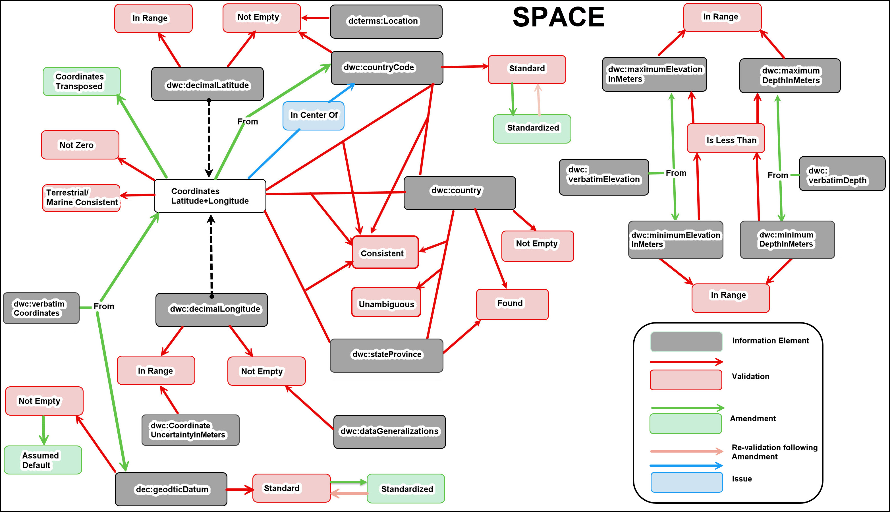

<!--- This file is generated from templates by code, DO NOT EDIT by hand --->

# BDQ Supplemental Information

**Title**<br>
BDQ Supplemental Information

**Date version issued**<br>
2025-04-11

**Date created**<br>
2025-04-11

**Part of TDWG Standard**<br>
<http://example.org/to_be_determined>

<!--
**Preferred namespace abbreviation**<br>
{pref_namespace_prefix}
-->

**This version**<br>
<https://bdq.tdwg/org/vocabularies/2025-04-11>

**Latest version**<br>
<https://bdq.tdwg/org/vocabularies/>

**Previous version**<br>

**Abstract**<br>
This document provides information supplementary to the BDQ standard, describing some of the history of its development, and rationale management for decisions made while describing the tests.

**Authors**<br>
[Lee Belbin](https://orcid.org/0000-0001-8900-6203) ([Blatant Fabrications](https://www.wikidata.org/wiki/Q130304884)), [Arthur D. Chapman](https://orcid.org/0000-0003-1700-6962) ([Australian Biodiversity Information Services](http://www.wikidata.org/entity/Q100600913)), [Paul J. Morris](https://orcid.org/0000-0002-3673-444X) ([Museum of Comparative Zoology, Harvard University](http://www.wikidata.org/entity/Q1420782)), [John Wieczorek](https://orcid.org/0000-0003-1144-0290) ([Rauthiflor LLC](http://www.wikidata.org/entity/Q98382028))

**Creator**<br>
TDWG Biodiversity Data Quality Interest Group Task Group 2: Data Quality Tests and Assertions

**Bibliographic citation**<br>
TDWG Biodiversity Data Quality Interest Group Task Group 2: Data Quality Tests and Assertions. 2025. BDQ Supplemental Information. Biodiversity Information Standards (TDWG). <https://bdq.tdwg/org/vocabularies/2025-04-11>

**Status**<br>
Draft Standard for Review

## Table of Contents ##
[1. Introduction](#1-introduction)
  - [1.1 Purpose](#11-purpose)
  - [1.2 Audience](#12-audience)
  - [1.3 Associated Documents](#13-associated-documents)
  - [1.4 Status of the content of this document](#14-status-of-the-content-of-this-document)
  - [1.5 Namespace abbreviations](#15-namespace-abbreviations)

[2 Historical Context](#2-historical-context)
  - [2.1 Definition of CORE](#21-definition-of-core)
    - [2.1.1 Tests tagged as DO NOT IMPLEMENT](#211-tests-tagged-as-do-not-implement)
  - [2.2 Use Case Development](#22-use-case-development)
  - [2.3 Data Quality Control and Data Quality Assurance](#23-data-quality-control-and-data-quality-assurance)
  - [2.4 Framework Competency Questions](#24-framework-competency-questions)
    - [2.4.1 Listing Identifiers for Tests](#241-listing-identifiers-for-tests)
    - [2.4.2 Framework Competency Question including an oa:annotation](#242-framework-competency-question-including-an-oaannotation)

[3 Developing the Tests](#3-developing-the-tests)
  - [3.1 Test Types](#31-test-types)
    - [3.1.1 Validation](#311-validation)
    - [3.1.2 Issues](#312-issues)
    - [3.1.3 Measures](#313-measures)
    - [3.1.4 Amendments](#314-amendments)
  - [3.2 MultiRecord Tests](#32-multirecord-tests)
    - [3.2.1 MultiRecord Validations, Issues, Amendments](#321-multirecord-validations-issues-amendments)
    - [3.2.2 MultiRecord Measures](#322-multirecord-measures)
    - [3.2.3 Considerations for use of MultiRecord Measures](#323-considerations-for-use-of-multirecord-measures)
  - [3.3 Data Quality Dimension and "Warning Types"](#33-data-quality-dimension-and-warning-types)
  - [3.4 Domain Scope of Tests](#34-domain-scope-of-tests)
  - [3.5 Parameterizing the Tests](#35-parameterizing-the-tests)
  - [3.6 Independence and Paired Tests](#36-independence-and-paired-tests)
  - [3.7 Vocabularies and Synonyms](#37-vocabularies-and-synonyms)
  - [3.8 Amendments and Annotations](#38-amendments-and-annotations)
  - [3.9 Aspirational Aspects of Some CORE Tests](#39-aspirational-aspects-of-some-core-tests)
    - [3.9.1 Vocabularies](#391-vocabularies)
    - [3.9.2 Georeferencing](#392-georeferencing)
    - [3.9.3 Annotations](#393-annotations)
    - [3.9.4 "High Seas"](#394-high-seas)
  - [3.10 Tests and Test Vocabularies](#310-tests-and-test-vocabularies)
  - [3.11 Principles of Test Design](#311-principles-of-test-design)
    - [3.11.1 General concepts for specifications](#3111-general-concepts-for-specifications)
    - [3.11.2 Principles](#3112-principles)
    - [3.11.3 Consistent behaviors](#3113-consistent-behaviors)
    - [3.11.4 Avoid Test interdependencies](#3114-avoid-test-interdependencies)

[4 Date and Time Issues](#4-date-and-time-issues)
  - [4.1 Dates and Calendars](#41-dates-and-calendars)
  - [4.2 Time](#42-time)

[5 Rationale Management Documentation](#5-rationale-management-documentation)
  - [5.1 Developing BDQ Tests Using GitHub Issues](#51-developing-bdq-tests-using-github-issues)
  - [5.2 GitHub Tags and Categorizing Issues](#52-github-tags-and-categorizing-issues)
    - [5.2.1 Diagram of the NAME-oriented Tests and Information Elements ActedUpon](#521-diagram-of-the-name-oriented-tests-and-information-elements-actedupon)
    - [5.2.2 Diagram of the SPACE-oriented Tests and Information Elements ActedUpon](#522-diagram-of-the-space-oriented-tests-and-information-elements-actedupon)
    - [5.2.3 Diagram of the TIME-oriented Tests and InformationElementsActedUpon.](#523-diagram-of-the-time-oriented-tests-and-informationelementsactedupon)
    - [5.2.4 Diagram of the OTHER-oriented Tests and Information Elements ActedUpon](#524-diagram-of-the-other-oriented-tests-and-information-elements-actedupon)
  - [5.3 Using Markdown Tables in GitHub Issues to Develop Test Descriptors](#53-using-markdown-tables-in-github-issues-to-develop-test-descriptors)

[6 Code for BDQ Components](#6-code-for-bdq-components)

[Acronyms](#acronyms)

[Glossary](#glossary)

[References](#references)

[Cite BDQ](#cite-bdq)

## 1. Introduction

### 1.1 Purpose

The purpose of this document is to provide supplemental information that supports the interpretation, development, and long-term maintenance of the BDQ standard. It offers historical context, rationale, and informal guidance gathered during the development of BDQ, with the aim of helping users extend, adapt, or evaluate the Fitness For Use Framework in their own domains.

This document includes lessons learned, design considerations, Test development principles, and reflections on the structure of the BDQ standard. It serves both as a record of how the BDQ standard evolved and as a practical reference for those planning to create additional Tests or Profiles.

### 1.2 Audience

This document is intended for practitioners who wish to deepen their understanding of the BDQ standard beyond the formal specifications. It will be useful for:

- Data curators, aggregators, and publishers working to evaluate or improve data quality
- Developers and analysts designing new Tests or adapting existing ones to domain-specific needs
- Standards maintainers and contributors seeking insight into the design motivations and history of the BDQ standard.

The document also provides some informal guidance for those tasked with maintaining or evolving the standard over time.

### 1.3 Associated Documents

For the list and links to all associated documents see [The Biodiversity Data Quality (BDQ) Standard](../../index.md).

### 1.4 Status of the content of this document

This document is non-normative.

### 1.5 Namespace abbreviations

The following namespace abbreviations are used in this document:

| **Abbreviation** | **Namespace** |
| ------------ | -------------                               |
| bdq:         | https://rs.tdwg.org/bdq/terms/              |
| bdqtest:     | https://rs.tdwg.org/bdqtest/terms/          |
| bdqffdq:     | https://rs.tdwg.org/bdqffdq/terms           |
| dc:          | https://purl.org/dc/elements/1.1/           |
| dcterms:     | http://purl.org/dc/terms/                   |
| dwc:         | http://rs.tdwg.org/dwc/terms/               |
| oa:          | https://www.w3.org/TR/annotation-vocab/     |
| owl:         | http://www.w3.org/2002/07/owl#              |
| rdf:         | http://www.w3.org/1999/02/22-rdf-syntax-ns# |
| rdfs:        | http://www.w3.org/2000/01/rdf-schema        |
| skos:        | http://www.w3.org/2004/02/skos/core#        |
| tdwgutility: | http://rs.tdwg.org/dwc/terms/attributes/    |
| xsd:         | http://www.w3.org/2001/XMLSchema#           |

## 2 Historical Context

An internationally agreed standard suite of Tests and resulting assertions can be used by all data providers, data collectors and data users to improve the quality of biodiversity data. This will facilitate more appropriate and more accurate use of biodiversity data. Other than data availability, ‘Data Quality’ is probably the most significant issue for users of biodiversity data and this is especially so for the research community. The BDQ Tests will not correct all issues that exist with the data, but reports from the Tests will hopefully identify issues that need to be addressed by users of the data. Such issues will require the user to make decisions - i.e., data that may need to be excluded, data that may need improvement before use, and data that can be used as they are. It is always the responsibility of the user to decide what data are of suitable quality for their use.

### 2.1 Definition of CORE

'CORE' in the context of BDQ Tests implies that the Tests are 

- informative,
- simple to implement,
- mandatory for enhancements/amendments,
- have ‘power’ in that they will not likely result in 0% or 100% of all records failing or passing
- widely applicable across sub-disciplines within the biodiversity domain
- capable of elevating the significance of an issue (e.g., not having a value for dcterms:license), or
- aspirational in the sense of encouraging priority developments in the biodiversity informatics domain (e.g., testing for any suggested amendments against a record)

These can be considered as the basic principles in the development of the Tests, and are elaborated in [Section 3.11](#311-principles-of-test-design).

The scope of CORE was also developed from the user needs analysis of BDQ Task Group 3, (Data Quality Use Cases: Rees & Nicholls 2020). The CORE Tests largely cover data quality with regards to what organisms have occurred where and when, and test a subset of [Darwin Core Terms](http://rs.tdwg.org/dwc/doc/list/) (Darwin Core Maintenance Group 2021) that we considered to be critical metadata about dwc:Occurrence records.

A number of additional Tests were framed, but considered out of scope for CORE data quality needs and were tagged as "Supplementary" in GitHub. These Tests are likely to have a role in specific Use Cases. Implementers are free to implement a subset of the CORE Tests or Supplementary or new Tests when there is a particular data quality need within their domain - e.g., testing for a value of sub-genus against a taxonomic name authority or testing for a valid depth against maximum depth around the location of an observation. Over the period of this project, many Tests were removed from CORE on the basis that they could not be currently implemented in a manner that would result in predictable results. Be aware, however, that these Tests have not gone through the rigorous implementation testing carried out on the "CORE" Tests.

Some Tests were deemed not CORE because they would currently result in the majority of data not having 'quality'. They have been given the GitHub tag "Immature/Incomplete", because it is thought that the Test may have value in the future. An example of such a Test is VALIDATION_REPRODUCTIVECONDITION_NOTEMPTY, where we would expect most records to have bdq:Empty for dwc:reproductiveCondition.

#### 2.1.1 Tests tagged as DO NOT IMPLEMENT

Some Tests were deemed not CORE because there was a perceived danger in their implementation, even though they appeared superficially implementable. In such cases, we applied the GitHub tag "DO NOT IMPLEMENT" to warn future implementers about the dangers. An example of such as Test is VALIDATION_GEOGRAPHY_CONSISTENT, because of the current complexities in matching terms in the geographic names hierarchy.

The following issues describing potential Tests were tagged as [DO NOT IMPLEMENT](https://github.com/tdwg/bdq/issues?q=+label%3A%22DO+NOT+IMPLEMENT%22). The discussion in each issue provides rationale management for why they were tagged as such.

| Issue | Name | Description |
| ----- | ---- | ----------- |
| [274](https://github.com/tdwg/bdq/issues/274) | VALIDATION_MODIFIED_INRANGE | Is the value of dcterms:modified entirely with the Parameter Range? |
| [141](https://github.com/tdwg/bdq/issues/141) | VALIDATION_YEAR_STANDARD | Can the value for year be interpreted as a valid year? |
| [95](https://github.com/tdwg/bdq/issues/95)   | VALIDATION_GEOGRAPHY_CONSISTENT | Is the combination of the values of the terms dwc:continent, dwc:country, dwc:countryCode, dwc:stateProvince, dwc:county, dwc:municipality consistent with the bdq:sourceAuthority? |
| [139](https://github.com/tdwg/bdq/issues/139) | VALIDATION_GEOGRAPHY_STANDARD | Can the individual values of the terms dwc:continent, dwc:country, dwc:countryCode, dwc:stateProvince, dwc:county, dwc:municipality be unambiguously resolved from bdq:sourceAuthority? |
| [266](https://github.com/tdwg/bdq/issues/266) | VALIDATION_WATERBODY_NOTEMPTY | Is there a value in dwc:waterbody? |
| [231](https://github.com/tdwg/bdq/issues/231) | VALIDATION_IDENTIFICATIONQUALIFIER_NOTEMPTY | Is there a value in dwc:identificationQualifier? |
| [37](https://github.com/tdwg/bdq/issues/37)   | ISSUE_DAYMONTH_SWAPPED | Is it likely that the day and month have been swapped? |
| [89](https://github.com/tdwg/bdq/issues/89)   | ISSUE_DECIMALLATITUDEDECIMALLONGITUDE_CONVERSIONFAILED | Latitude and longitude could not be converted using the default geodetic datum |
| [35](https://github.com/tdwg/bdq/issues/35)   | MEASURE_VALIDATIONTESTS_RUN | Total number of Tests of output type Validation that have been attempted to have been run against the record |
| [129](https://github.com/tdwg/bdq/issues/129) | AMENDMENT_YEAR_STANDARDIZED | Attempt to amend the year |
| [34](https://github.com/tdwg/bdq/issues/34)   | AMENDMENT_DAYMONTH_TRANSPOSED | Swap dwc:month and dwc:day if dwc:month is greater than 12 and dwc:day is less than 12. |
| [90](https://github.com/tdwg/bdq/issues/90)   | AMENDMENT_KINGDOM_STANDARDIZED | Can the value for kingdom be standardized against the Source Authority? |
| [80](https://github.com/tdwg/bdq/issues/80)   | AMENDMENT_PHYLUM_STANDARDIZED | Can the value of dwc:phylum be standardized using the Source Authority? |
| [53](https://github.com/tdwg/bdq/issues/53)   | AMENDMENT_CLASS_STANDARDIZED | Can the value of dwc:class be standardized using the Source Authority? |
| [27](https://github.com/tdwg/bdq/issues/27)   | AMENDMENT_FAMILY_STANDARDIZED | Can the value of dwc:family be standardized using the Source Authority? |
| [25](https://github.com/tdwg/bdq/issues/25)   | AMENDMENT_ORDER_STANDARDIZED | Can the value of dwc:order be standardized using the Source Authority? |
| [118](https://github.com/tdwg/bdq/issues/118) | AMENDMENT_GEOGRAPHY_STANDARDIZED | Can the value of one or more of the values dwc:continent, dwc:country, dwc:countryCode, dwc:stateProvince, dwc:county, dwc:municipality be standardized using bdq:sourceAuthority? |
| [100](https://github.com/tdwg/bdq/issues/100) | AMENDMENT_MINDEPTHMAXDEPTH_TRANSPOSED | Attempt to transpose minimum and maximum depth if minimum depth is greater than maximum depth. |
| [44](https://github.com/tdwg/bdq/issues/44)   | AMENDMENT_MINELEVATIONMAXELEVATION_TRANSPOSED | If dwc:minimumElevationInMeters is greater than dwc:maximumElevationInMeters, can they be meaningfully swapped? |

### 2.2 Use Case Development

Biodiversity Data Quality Task Group 3: Data Quality Use Cases (Rees & Nicholls 2020) was established to review what Use Cases were prevalent. This group identified several fundamental Use Cases, including "bdq:Spatial-Temporal Patterns", "bdq:Record-Management", and "bdq:Taxon-Management". We later added "bdq:Alien-Species" and "bdq:Biotic-Relationships".

These are only a sample of the many possible Use Cases used in the biological sciences, but they provide an initial set to which all the BDQ Tests have been linked. Note that the relationship between Use Cases and Tests is a many to many relationship - with most Tests being relatable to many Use Cases and vice versa.

Note that the evaluation of a Test can only take place within the context of a specific Use Case, even if that use is particularly broad or particularly narrow. For example, the Test [VALIDATION_COUNTRY_FOUND](../terms/bdqtest/index.md#VALIDATION_COUNTRY_FOUND) could assess the value of dwc:country against a Source Authority for the Use Case bdq:Record-Management, but this Test may not be applicable to a Use Case related to marine ecology.

### 2.3 Data Quality Control and Data Quality Assurance

The Fitness for Use Framework (Veiga 2016, Veiga et al. 2017) draws a distinction between Quality Control and Quality Assurance. Quality Control processes seek to assess the quality of data for some purpose, then identify changes to the data or to processes around the data to improve the quality of the data. Quality Assurance processes seek to filter some set of data to a subset that is fit for some purpose/Use case.

The specification of the BDQ Tests within the Framework allows the same set of Tests to apply to both Data Quality Control and Data Quality Assurance. The design of the Test Types "Validations" and "Measures" are intended to be agnostic as to whether their use is for finding problematic data (Data Quality Control), or for filtering out NOT_COMPLIANT records (Data Quality Assurance).

### 2.4 Framework Competency Questions

The development of the representation of the Fitness for Use Framework as an OWL ontology (bdqffdq:) was influenced by competency questions, shaped by the late Robert A. Morris, and originally written by David Lowery within the kurator-ffdq codebase (Lowery et al. 2025); see [kurator-ffdq competency questions](https://github.com/kurator-org/kurator-ffdq/tree/53ce808117d83cbe84e6820636c90e404a4c6886/competencyquestions) as part of the Kurator project (Morris et al. 2018). The development of the BDQ Test descriptors (the terms used to describe our Tests) led to changes in the ontology (largely adopting a consistent naming pattern). Changes to the specifics of competency questions followed.

Following are example competency questions that can be asked of the RDF representation of bdqtest:

Given a Use Case, can one find Validation Tests and their Specifications?

    # Given a Use Case find Validation Tests and their specifications

    PREFIX bdqffdq: <https://rs.tdwg.org/bdqffdq/terms/>
    PREFIX rdfs: <http://www.w3.org/2000/01/rdf-schema#>
    PREFIX skos: <http://www.w3.org/2004/02/skos/core#>
    
    SELECT DISTINCT ?useCase ?test ?specification
    
    WHERE {
    
        # Find Validations from the ValidationPolicy
        # for a given Use Case
    
        ?policy a bdqffdq:ValidationPolicy .
        ?policy bdqffdq:hasUseCase ?uc .
        ?policy bdqffdq:includesInPolicy ?cc .
        ?uc rdfs:label ?useCase .
    
        # Find the specification from the validation method
        # referencing the Validation
    
        ?cc skos:prefLabel ?test .
    
        ?vm a bdqffdq:ValidationMethod .
        ?vm bdqffdq:forValidation ?cc .
        ?vm bdqffdq:hasSpecification ?testSpec .
        ?testSpec bdqffdq:hasExpectedResponse ?specification .

        # Filter by a specific Use Case
    
         FILTER( ?uc = <https://rs.tdwg.org/bdqffdq/terms/Taxon-Management> )
    }

Given a Use Case, can one find the Information Elements that were ActedUpon?

    # Given a Use Case find the ActedUpon Information Elements 
    
    PREFIX bdqffdq: <https://rs.tdwg.org/bdqffdq/terms/>
    PREFIX dwc: <http://rs.tdwg.org/dwc/terms/>
    PREFIX rdfs: <http://www.w3.org/2000/01/rdf-schema#>
    PREFIX dcterms: <http://purl.org/dc/terms/>
    
    SELECT DISTINCT ?useCase ?ie
    
    WHERE {
    
       # Find Validations from the ValidationPolicy
       # for a given Use Case
    
       ?policy a bdqffdq:ValidationPolicy .
       ?policy bdqffdq:hasUseCase ?uc .
       ?policy bdqffdq:includesInPolicy ?cc .
       ?uc rdfs:label ?useCase .
    
       # Find ActedUpon InformationElements 
       # for the Validations
     
       ?cc bdqffdq:hasActedUponInformationElement ?ieClass .
       ?ieClass bdqffdq:composedOf ?ie
    
       # Filter by a specific Use Case

       FILTER( ?uc = <https://rs.tdwg.org/bdqffdq/terms/Taxon-Management> )
    
    }

Can one find a summary of Tests by Data Quality Dimension with specific Darwin Core Terms in Information Elements ActedUpon? 

    PREFIX rdf: <http://www.w3.org/1999/02/22-rdf-syntax-ns#>
    PREFIX owl: <http://www.w3.org/2002/07/owl#>
    PREFIX rdfs: <http://www.w3.org/2000/01/rdf-schema#>
    PREFIX xsd: <http://www.w3.org/2001/XMLSchema#>
    PREFIX bdqffdq: <https://rs.tdwg.org/bdqffdq/terms/>
    PREFIX bdqtest: <https://rs.tdwg.org/bdqtest/terms/>
    SELECT (count(?test) as ?ct) ?dimension ?sie
    WHERE {
       ?ie bdqffdq:composedOf ?sie .
       ?test bdqffdq:hasActedUponInformationElement ?ie .
       ?test bdqffdq:hasDataQualityDimension ?dimension .
       ?test rdf:type ?testType .
       FILTER (?testType != owl:NamedIndividual)
    }
    GROUP BY ?sie ?dimension
    ORDER BY ?sie ?dimension

Can one find a summary of Tests by Test Type with specific Darwin Core Terms in Information Elements ActedUpon?

    PREFIX rdf: <http://www.w3.org/1999/02/22-rdf-syntax-ns#>
    PREFIX owl: <http://www.w3.org/2002/07/owl#>
    PREFIX rdfs: <http://www.w3.org/2000/01/rdf-schema#>
    PREFIX xsd: <http://www.w3.org/2001/XMLSchema#>
    PREFIX bdqffdq: <https://rs.tdwg.org/bdqffdq/terms/>
    PREFIX bdqtest: <https://rs.tdwg.org/bdqtest/terms/>
    SELECT (count(?test) as ?ct) ?testType ?sie
    WHERE {
        ?ie bdqffdq:composedOf ?sie .
        ?test bdqffdq:hasActedUponInformationElement ?ie .
        ?test rdf:type ?testType .
        FILTER (?testType != owl:NamedIndividual)
    }
    GROUP BY ?sie ?testType
    ORDER BY ?sie ?testType

Given a Specification (as would be known when starting with a bdqffdq:Assertion and following bdqffdq:producesAssertion to a bdqffdq:Implementation then bdqffdq:usesSpecification), which Test was run with which argument values for which Parameters?

    PREFIX rdf: <http://www.w3.org/1999/02/22-rdf-syntax-ns#>
    PREFIX owl: <http://www.w3.org/2002/07/owl#>
    PREFIX rdfs: <http://www.w3.org/2000/01/rdf-schema#>
    PREFIX xsd: <http://www.w3.org/2001/XMLSchema#>
    PREFIX bdqffdq: <https://rs.tdwg.org/bdqffdq/terms/>
    SELECT ?test ?label ?description  (GROUP_CONCAT(DISTINCT ?params; separator='; ') as ?parameters) 
    WHERE { 
      ?test rdf:type bdqffdq:Validation . ?test rdfs:label ?label . ?method bdqffdq:forValidation ?test .
      ?method bdqffdq:hasSpecification ?specification . ?specification rdfs:comment ?description .
      OPTIONAL { 
         ?specification bdqffdq:hasArgument ?argument . ?argument bdqffdq:hasArgumentValue ?argumentValue . ?argument bdqffdq:hasParameter ?parameter .
         BIND (CONCAT(STR(?parameter), "=" , ?argumentValue ) as ?params )
      } .
      FILTER (STR(?specification) = "urn:uuid:f3e03531-7ee5-4721-aae2-f554389e0544")
    }
    GROUP BY ?test ?label ?description

Given an Assertion, which Test was run with which argument values for which Parameters by which Mechanism to produce it: 

    PREFIX rdf: <http://www.w3.org/1999/02/22-rdf-syntax-ns#>
    PREFIX owl: <http://www.w3.org/2002/07/owl#>
    PREFIX rdfs: <http://www.w3.org/2000/01/rdf-schema#>
    PREFIX xsd: <http://www.w3.org/2001/XMLSchema#>
    PREFIX bdqffdq: <https://rs.tdwg.org/bdqffdq/terms/>
    SELECT ?test ?label ?description  (GROUP_CONCAT(DISTINCT ?params; separator='; ') as ?parameters) ?mechanism
    WHERE { 
      ?test rdf:type bdqffdq:Validation . ?test rdfs:label ?label . ?method bdqffdq:forValidation ?test .
      ?method bdqffdq:hasSpecification ?specification . ?specification rdfs:comment ?description .
      OPTIONAL { 
         ?specification bdqffdq:hasArgument ?argument . ?argument bdqffdq:hasArgumentValue ?argumentValue . ?argument bdqffdq:hasParameter ?parameter .
         BIND (CONCAT(STR(?parameter), "=" , ?argumentValue ) as ?params )
      } .
      ?implementation bdqffdq:usesSpecification ?specification . ?implementation bdqffdq:producesAssertion ?assertion .
      ?implementation bdqffdq:implementedBy ?mechanism .
      FILTER (STR(?assertion) = "{id of assertion to look up}")
    }
    GROUP BY ?test ?label ?description ?mechanism

What Validations and Amendments share Information Elements ActedUpon?

    PREFIX rdf: <http://www.w3.org/1999/02/22-rdf-syntax-ns#>
    PREFIX owl: <http://www.w3.org/2002/07/owl#>
    PREFIX rdfs: <http://www.w3.org/2000/01/rdf-schema#>
    PREFIX xsd: <http://www.w3.org/2001/XMLSchema#>
    PREFIX bdqffdq: <https://rs.tdwg.org/bdqffdq/terms/>
    SELECT distinct ?vlabel ?term ?alabel
 	WHERE { 
       ?validation a bdqffdq:Validation . ?validation rdfs:label ?vlabel . ?validation bdqffdq:hasActedUponInformationElement ?ie .
       ?ie bdqffdq:composedOf ?term . ?iea bdqffdq:composedOf ?term . ?amendment bdqffdq:hasActedUponInformationElement ?iea .
        ?amendment a bdqffdq:Amendment . ?amendment rdfs:label ?alabel .
    }
    ORDER BY ?term

What Information Elements are ActedUpon by more that one Annotation?

    PREFIX rdf: <http://www.w3.org/1999/02/22-rdf-syntax-ns#>
    PREFIX owl: <http://www.w3.org/2002/07/owl#>
    PREFIX rdfs: <http://www.w3.org/2000/01/rdf-schema#>
    PREFIX xsd: <http://www.w3.org/2001/XMLSchema#>
    PREFIX bdqffdq: <https://rs.tdwg.org/bdqffdq/terms/>
    SELECT ?term ( count( distinct ?alabel) as ?ct )
    WHERE {
       ?validation a bdqffdq:Validation . ?validation rdfs:label ?vlabel . ?validation bdqffdq:hasActedUponInformationElement ?ie .
       ?ie bdqffdq:composedOf ?term . ?iea bdqffdq:composedOf ?term . ?amendment bdqffdq:hasActedUponInformationElement ?iea .
        ?amendment a bdqffdq:Amendment . ?amendment rdfs:label ?alabel .
    }
    GROUP BY ?term 
    HAVING ( ?ct > 1 )
    ORDER BY ?term

What Amendments have Information Elements ActedUpon that are ActedUpon by more than one Amendment:

    PREFIX rdf: <http://www.w3.org/1999/02/22-rdf-syntax-ns#>
    PREFIX owl: <http://www.w3.org/2002/07/owl#>
    PREFIX rdfs: <http://www.w3.org/2000/01/rdf-schema#>
    PREFIX xsd: <http://www.w3.org/2001/XMLSchema#>
    PREFIX bdqffdq: <https://rs.tdwg.org/bdqffdq/terms/>
    SELECT distinct ?amend ?amendName
    WHERE { 
       ?amend bdqffdq:hasActedUponInformationElement ?iec . ?iec bdqffdq:composedOf ?term .  ?amend a bdqffdq:Amendment . ?amend rdfs:label ?amendName .
       { SELECT ?term (COUNT (distinct ?amendment) as ?ct ) 
            WHERE { 
             ?validation a bdqffdq:Validation . ?validation rdfs:label ?vlabel . ?validation bdqffdq:hasActedUponInformationElement ?ie .
             ?ie bdqffdq:composedOf ?term . ?iea bdqffdq:composedOf ?term . ?amendment bdqffdq:hasActedUponInformationElement ?iea .
             ?amendment a bdqffdq:Amendment . ?amendment rdfs:label ?alabel .
           }
           GROUP BY ?term 
           HAVING ( ?ct > 1 )
       } 
    } 

#### 2.4.1 Listing Identifiers for Tests

The BDQ Framework organizes data quality Tests as ontology individuals, each with associated human-readable labels and persistent identifiers. To support automated processing and reference, it is often necessary to retrieve a list of these Validation Tests, along with their identifiers and version-specific IRIs. The following competency question demonstrates how to query the ontology to obtain this information using SPARQL.

    PREFIX owl: <http://www.w3.org/2002/07/owl#>
    PREFIX rdf: <http://www.w3.org/1999/02/22-rdf-syntax-ns#>
    PREFIX rdfs: <http://www.w3.org/2000/01/rdf-schema#>
    PREFIX bdqffdq: <https://rs.tdwg.org/bdqffdq/terms/>
    PREFIX dcterms: <http://purl.org/dc/terms/>
    SELECT ?label ?term_localName ?iri ?term_iri
    WHERE { 
      ?iri a bdqffdq:Validation .
      ?iri rdfs:label ?label .
      ?iri dcterms:isVersionOf ?term_iri .
      BIND (REPLACE(STR(?term_iri),"https://rs.tdwg.org/bdqtest/terms/","") as ?term_localName )
    }

Example results: 

| Label | Term Name | Term Version IRI | Term IRI |
| ----  | --------- | ---------------- | -------- | 
| VALIDATION_MINELEVATION_INRANGE | 0bb8297d-8f8a-42d2-80c1-558f29efe798 | <https://rs.tdwg.org/bdqtest/terms/0bb8297d-8f8a-42d2-80c1-558f29efe798-2024-09-04> | <https://rs.tdwg.org/bdqtest/terms/0bb8297d-8f8a-42d2-80c1-558f29efe798> |
| VALIDATION_MONTH_STANDARD | 01c6dafa-0886-4b7e-9881-2c3018c98bdc | <https://rs.tdwg.org/bdqtest/terms/01c6dafa-0886-4b7e-9881-2c3018c98bdc-2024-09-05> | <https://rs.tdwg.org/bdqtest/terms/01c6dafa-0886-4b7e-9881-2c3018c98bdc> |

The label is intended as the identifier of a Test for humans, the Term Name as a machine readable identifier.

#### 2.4.2 Framework Competency Question including an oa:annotation

The BDQ Framework represents the results of Validation Tests as assertions, which can be linked to biodiversity records through annotations following the W3C Web Annotation model. This structure allows detailed provenance and context to be recorded alongside each assertion. The following competency question demonstrates how to retrieve all assertions generated for a specific dwc:Occurrence record, including metadata such as the associated Validation Test, annotation motivation, date of generation, and relevant Parameters.

    PREFIX rdf: <http://www.w3.org/1999/02/22-rdf-syntax-ns#>
    PREFIX owl: <http://www.w3.org/2002/07/owl#>
    PREFIX oa: <https://www.w3.org/TR/annotation-vocab/>
    PREFIX rdfs: <http://www.w3.org/2000/01/rdf-schema#>
    PREFIX xsd: <http://www.w3.org/2001/XMLSchema#>
    PREFIX bdqffdq: <https://rs.tdwg.org/bdqffdq/terms/>
    SELECT ?responsestatus ?responseresult ?responsecomment ?test ?label ?description (GROUP_CONCAT(DISTINCT ?params; separator='; ') as ?parameters) ?mechanism ?motivation ?annotationdate 
    WHERE {
      ?test rdf:type bdqffdq:Validation . ?test rdfs:label ?label . ?method bdqffdq:forValidation ?test .
      ?method bdqffdq:hasSpecification ?specification . ?specification rdfs:comment ?description .
      OPTIONAL {
         ?specification bdqffdq:hasArgument ?argument . ?argument bdqffdq:hasArgumentValue ?argumentValue . ?argument bdqffdq:hasParameter ?parameter .
         BIND (CONCAT(STR(?parameter), "=" , ?argumentValue ) as ?params )
      } .
      ?implementation bdqffdq:usesSpecification ?specification . ?implementation bdqffdq:producesAssertion ?assertion .
      ?assertion bdqffdq:hasResponseStatus ?responsestatus .
      ?assertion bdqffdq:hasResponseResult ?responseResult .
      ?assertion bdqffdq:hasResponseComment ?responsecomment .
      ?implementation bdqffdq:implementedBy ?mechanism .
      ?annotation oa:body ?assertion .
      ?annotation oa:target ?target .
      OPTIONAL { ?annotation oa:motivation ?motivation . } .
      OPTIONAL { ?annotation oa:generated ?annotationdate . } .
      FILTER (STR(?target) = "https//mczbase.mcz.harvard.edu/guid/MCZ:Mala:280832")
    }
    GROUP BY ?responsestatus ?responseresult ?responsecomment ?test ?label ?description ?mechanism ?motivation ?annotationdate

## 3 Developing the Tests

Originally, **Biodiversity Information Standards (TDWG) Data Quality Task Group 2: Data Quality Tests and Assertions** sought to find a fundamental suite of Tests and identify any relevant software associated with testing for 'Data Quality'/'Fitness for Use'. It was quickly realized however, that any software was likely to be far less stable than defining a CORE suite of Tests and an associated Framework, so the software component was quickly dropped. We also limited the scope of BDQ Tests to apply only to data encoded using the Darwin Core standard (Wieczorek et al. 2012). This gave us a specific target, but also imposed associated problems, noted below.

Finding out what Tests were being used by a range of biodiversity data aggregators was our first step in identifying likely candidates. We identified, aggregated and described 152 unique Tests from GBIF, ALA, iDigBio, VertNet, CRIA and BISON into a consistent structure for comparison and evaluation. Descriptors at this time included Information Elements (the [Darwin Core Terms](http://rs.tdwg.org/dwc/doc/list/) (Darwin Core Maintenance Group 2021) used by the Tests), Specification (a technical description aimed at implementation), Darwin Core Class, Source of the Test and References. We performed a full evaluation of each candidate Test using the seven criteria noted in Section 2.1. Tests were expected to be informative by contributing to the evaluation or enhancement of data record quality. Tests had to be relatively straightforward to implement with existing tools. Tests were mandatory for any potential enhancements to record values in that a Validation Test was required before any Amendment Test. Tests required power in that they would not likely result in 0% or 100% of all record passing or failing the Test.

BDQ Tests were designed to provide an adequate coverage of basic information dimensions of Darwin Core: dwc:Taxon (GitHub tag `NAME`), dwc:Event (GitHub tag `TIME`), dcterms:Location (GitHub tag `SPACE`), and a category that we called "Other" (GitHub tag `OTHER`) to cover Tests on terms such as dc:license (see Section 3.1). Tests also had to be widely applicable across a range of Use Cases. A Test that were identified as useful in a limited context was documented and (GitHub) tagged as `Supplementary`, indicating that it could be potentially be implemented in the future if a Use Case requiring it was developed.

We originally rendered the Tests in the form that flagged a **FAIL**, for example a dwc:eventDate that did not conform to ISO 8601-1 date. Our reasoning was that this strategy aligned with the pattern of expression of the Tests from their sources. It was universal to identify **issues** with values in the record that would reduce its quality. However, the Data Quality Framework (Veiga 2016, Veiga et al. 2017) worked in the opposite direction, identifying values in a record that **PASSED** a Test, indicating increased potential for 'quality' across Use Cases. To align with the Framework, we renamed all BDQ Tests Types to indicate the positive assessment (e.g., COUNTRYCODE_NOTSTANDARD became COUNTRYCODE_STANDARD). This reversal of 'fail' to 'pass' was also reflected in the comparison of the Framework's 'Data Quality Dimension' versus our early concept of 'Warning Type' (see Section 3.2).

Second and subsequent evaluations of the candidate BDQ Tests reduced the number to about 100 that seemed to fulfill the criteria above. Tests came and went as we provided more consistent and comprehensive documentation against what we called the Test Descriptors. The Tests also changed as we began to implement them. We modified a Test Specification to then find that we would not be able to implement it due to potential ambiguous responses from the Test or that a Test response may be misleading. By far the greatest changes to the candidate Tests came about when we implemented them and ran them against the Test Validation Data (see the [Implementer's Guide](../guide/implementers/index.md#81-introduction-non-normative)) (using bdq_issue_to_csv (Morris 2024b) to extract a CSV file of validation data from a working spreadsheet to execute implementations with 'bdqcoretestrunner' (Morris 2024)).

At one point, we aligned the documentation for over sixty Tests that were tagged in GitHub as Supplementary, Immature/Incomplete or "DO NOT IMPLEMENT". In doing so, we realized that the consistent documentation now provided a more nuanced evaluation and subsequently moved a number of these Tests back into the set of CORE Tests. The opposite was also true, trying to implement some Tests and run them against the Validation Test data clearly demonstrated that some Tests did not meet the principles set forth for BDQ "Core". Where there were recognized nuances with the Tests that may not be obvious from the Specification, we documented the issues in the Test Notes for these non-Core Tests.

The team identified a fundamental problem early in the development of the Tests: Darwin Core lacked a comprehensive suite of controlled vocabularies. Testing for 'quality' or 'fitness for use' was made difficult at best and impossible at worst, when controlled vocabularies were unavailable. We recognized the key issue of the lack of constraints on terms in the Darwin Core standard, yet the need for controlled vocabularies to evaluate and improve the 'quality' of Darwin Core-encoded data was also important. This conclusion effectively initiated Data Quality Task Group 4: Best Practices for Development of Vocabularies of Values (https://www.tdwg.org/community/bdq/tg-4/) to provide a framework for how these vocabularies could be developed for a priority set of Darwin Core Terms. This in turn has resulted in GBIF initiating https://github.com/gbif/vocabulary, and see also https://docs.google.com/viewer?url=https%3A%2F%2Fdev.gbif.org%2Fissues%2Fbrowse%2FGBIF-121%2Fgbif-vocabularies-review_v01.docx.

Over the course of the development of the Tests, we encountered significant difficulties with choices of words. In the original formulation of the Framework (Veiga 2016), different words were used to describe parallel concepts at the levels of data quality needs, solutions, and reports, and the words used for fundamental concepts overlapped with those for derived concepts. We have settled on Criterion, Dimension, and Enhancement as the words for fundamental concepts, and variations on Validation (Validation, ValidationMethod, ValidationAssertion), Issue, Measure, and Amendment for derived concepts. It was very late in development of the Test Specifications that we realized that the heart of what we were calling 'Validation' mapped to the derived concept of CriterionInContext/ContextualizedCriterion in the Framework (Veiga et al. 2017), so we have renamed Framework concepts for clarity.

Early on we recognized that the Data Quality Framework required us to frame MultiRecord Measures in order to support the formal requirements in the Fitness For Use Framework for Quality Control and Quality Assurance, which are defined as only involving Measures. We recognized that these would be simple, repetitive, formal statements about the results of Validations, so we put off defining these until very late in the process. They proved straightforward to frame and then generate from the set of adopted SingleRecord Tests.

### 3.1 Test Types

Tests are identified by the bdqffdq: namespace classes of Validation, Issue, Measure, and Amendment. Each of these types of Tests can be composed with a ResourceType to apply to a single record (bdqffdq:SingleRecord), or to multiple records comprising a dataset (bdqffdq:MultiRecord). In the BDQ standard, we have described a set of SingleRecord Validations, Issues, Measures, and Amendments plus a set of MultiRecord Measures. The formal statement of each of these is complex, being a composition of an instance of a subclass of a bdqffdq:DataQualityNeed with an instance of a subclass of a bdqffdq:Method with an instance of a bdqffdq:Specification, but we subsume this complexity with the phrases Validation Test, Issue Test, Measure Test, and Amendment Test.

#### 3.1.1 Validation

Validation Tests evaluate values in one or more [Darwin Core Terms](http://rs.tdwg.org/dwc/doc/list/) (Darwin Core Maintenance Group 2021) for fitness for a particular data quality need. In some cases, Validation Tests check for the presence or the lack of a value. Validation Tests are phrased as positive statements consistent with the Fitness For Use Framework (Veiga 2016, Veiga et al. 2017). For example, [VALIDATION_TAXONRANK_NOTEMPTY](../terms/bdqtest/index.md#VALIDATION_TAXONRANK_NOTEMPTY) will return a Response.status="RUN_HAS_RESULT" and Response.result="COMPLIANT" if a record being tested contains a value in dwc:taxonRank, rather being phrased in the negative (i.e., VALIDATION_TAXONRANK_EMPTY) and flagging a potential problem. Data are found to be fit for some Use Case if all Validations comprising that Use Case have a Response.result="COMPLIANT". The formal response of Validation Tests take one of three forms.

1. A Response.status of "EXTERNAL_PREQUISITES_NOT_MET" when an external resource (e.g., a Source Authority, bdq:sourceAuthority) is unavailable, and running the same Test on the same data at a different time may result in a different result.
2. A Response.status of "INTERNAL_PREREQUISITES_NOT_MET" when the values of one or more of the Information Elements are such that the Test cannot be meaningfully run.
3. A Response.status of "RUN_HAS_RESULT" when the prerequisites for running the Test have been met, and in this situation:
  - A Response.result of either "COMPLIANT" if the values of the Information Elements meet the criteria, or "NOT_COMPLIANT" when they do not.

During the development of the BDQ standard, there were significant discussions about how Tests were to be phrased. For several contributors (and all Tests implemented by agencies such as the ALA and GBIF), the most natural form seemed to be to describe assertions in the negative sense, identifying problems. The BDQ [Fitness for Use Framework](../bdqffdq/index.md), however, focused entirely on positive statements, identifying data that have quality and are fit for purpose. Over the evolution of the description of the Tests, we conformed the language to the positive sense of the Framework in almost all cases. Validations are thus phrased in the Framework sense of being COMPLIANT if the data have quality with respect to the Test evaluation criteria. There were, however, a set of cases that didn't fit well into this positive sense, see [3.1.2 Issues](#312-issues).

#### 3.1.2 Issues

Issue Tests are a form of warning flag where the Test is drawing attention to potential problem with the value of a [Darwin Core Term](http://rs.tdwg.org/dwc/doc/list/) (Darwin Core Maintenance Group 2021) for at least one Use Case. As discussed above, Validations are phrased in the Framework sense of being COMPLIANT if the data have quality with respect to the Test evaluation criteria. There were, however, a set of cases that didn't fit well into this positive sense, in particular, those where the conclusion of the Test was that the data might or might not be fit for purpose and a human would have to evaluate the results. In order to accommodate this "there might be a problem" case, we expanded the Framework to include the concept of bdqffdq:Issue, where Issues are the converse of Validations and are phrased in a negative sense of identifying potential problems.

Issues can result in a Response.status="RUN_HAS_RESULT" accompanied by a Response.result="POTENTIAL_ISSUE" or "NOT_ISSUE".

An Issue is the equivalent to a Response.status="NOT_COMPLIANT" from a Validation Test. A Response.result="NOT_ISSUE" is similar to a Response.result="COMPLIANT" from a Validation Test, but with slightly different semantics, "COMPLIANT" means that the data are fit for some use. A Response.result="NOT_ISSUE" means that there was no detected reason for the data not to be fit for use. A Response.result="POTENTIAL_ISSUE" is the reason we incorporated Issue type Tests into the BDQ standard. "POTENTIAL_ISSUE" means that the Issue Test revealed a concern in the data that might make it unfit for some use. Data flagged with potential issues require a human review. For example, [ISSUE_DATAGENERALIZATIONS_NOTEMPTY](../terms/bdqtest/index.md#ISSUE_DATAGENERALIZATIONS_NOTEMPTY) will return a Response.result="POTENTIAL_ISSUE" if dwc:dataGeneralizations contains a value. Any value in dwc:dataGeneralizations asserts changes have been made to generalize other [Darwin Core Terms](http://rs.tdwg.org/dwc/doc/list/) (Darwin Core Maintenance Group 2021) and requires a human review to determine whether the data are fit for purpose.

#### 3.1.3 Measures

Measures return a Response.result that is either a numeric value or "COMPLETE" or "NOT_COMPLETE".

Most SingleRecord Measure Tests defined in the BDQ standard count the number of Validation or Amendment Tests with a specified Response.Result in a bdqffdq:SingleRecord. Measure Tests can also be accumulated across multiple records (bdqffdq:MultiRecord). See section [3.2.2 MultiRecord Measures](#322-multirecord-measures).

bdqffdq:SingleRecord MEASUREs within the BDQ standard are [MEASURE_VALIDATIONTESTS_COMPLIANT](../terms/bdqtest/index.md#MEASURE_VALIDATIONTESTS_COMPLIANT), [MEASURE_VALIDATIONTESTS_NOTCOMPLIANT](../terms/bdqtest/index.md#MEASURE_VALIDATIONTESTS_NOTCOMPLIANT), [MEASURE_VALIDATIONTESTS_PREREQUISITESNOTMET](../terms/bdqtest/index.md#MEASURE_VALIDATIONTESTS_PREREQUISITESNOTMET), [MEASURE_AMENDMENTS_PROPOSED](../terms/bdqtest/index.md#MEASURE_AMENDMENTS_PROPOSED) and [MEASURE_EVENTDATE_DURATIONINSECONDS](../terms/bdqtest/index.md#MEASURE_EVENTDATE_DURATIONINSECONDS). Of these, MEASURE_EVENTDATE_DURATIONINSECONDS returns a Response.result measuring the amount of time represented by the value in dwc:eventDate and is the only numeric response Test. This Test is intended to provide an estimator for the duration of an event date that can be used as a criterion for Quality Assurance for some Use Cases. For example, a phenology use may need temporal resolution of records to within about a day, while a use involving long term patterns of spatial change may be satisfied by temporal resolution of a year or better. Rather than providing specific Measures for each possible duration, we chose to provide just this one generic Measure that could be used as a filter criterion for any Use Case.

#### 3.1.4 Amendments

Amendment Tests may propose a change to one or more [Darwin Core Term](http://rs.tdwg.org/dwc/doc/list/) (Darwin Core Maintenance Group 2021) values or fill in missing values. Amendments are intended to improve one or more components of the quality of the record. The Response.result from an Amendment is a proposal for a change, not to be blindly applied to a database or record when a data quality report is used for Quality Control of an existing record. Consumers of Data Quality Reports under Quality Assurance may choose to (blindly - not recommended, or after review) accept all proposed Amendments as part of a pipeline in preparing data for an analysis. We urge that Amendments do not overwrite existing information within a database; that existing information is preserved, as well as the potential changes.

The Framework also supports Amendments where the Response.result is a proposal to a change in procedure, such as suggesting that a constraint should be placed on a database field to restrict allowed values, or that a mapping of a dataset onto [Darwin Core Terms](http://rs.tdwg.org/dwc/doc/list/) (Darwin Core Maintenance Group 2021) has transposed a set of fields. We have not framed any such Tests of this form in the BDQ standard, nor have we considered how such assertions should be represented in a Response.result.

In the BDQ standard, we have taken a pragmatic approach to implementing Amendments by incorporating code in our Tests that attempts to identify likely unambiguous matches. While this is not an ideal solution, it enables Amendments to add potential value to Darwin Core data records.

### 3.2 MultiRecord Tests

When defining a Test, the Test Type (Validation, Issue, Measure, Amendment) is composed with a ResourceType (bdqffdq:SingleRecord or bdqffdq:MultiRecord). This determines if the Test results in assertions about a single record or a dataset as a whole.

#### 3.2.1 MultiRecord Validations, Issues, Amendments

We do not define MultiRecord Validations, Issues or Amendments in BDQ, though these are allowed within the namespace bdqffdq. A MultiRecord Validation could, for example, evaluate all instances of dwc:occurrenceID in a dataset and assert COMPLIANT if they are distinct. A MultiRecord Amendment could, for example, evaluate all values of dwc:decimalLatitude and dwc:decimalLongitude in a dataset, assert that they are probably transposed, and that the consumer of the data quality report should check that the two terms do not have their values transposed, and if that is the error, switch their values.

#### 3.2.2 MultiRecord Measures

MultiRecord Tests examine data across multiple records - a dataset.

The BDQ MultiRecord Measures all take the output of other Tests, rather than from the data records, as their input. The inputs (Information Elements) for these Measures in bdqtest: are the outputs of SingleRecord Validations. We have defined two sets of MultiRecord Measures in the BDQ standard. One of these sets consists of Measures that return COMPLETE or NOT_COMPLETE, the other set consists of Measures that return numeric values. These are intended for Quality Control and Quality Assurance (sensu Veiga, et al. 2017).

For each SingleRecord Validation Test, there is defined a MultiRecord Measure that returns COMPLETE when all records in the bdqffdq:MultiRecord have a Response.result of COMPLIANT, and NOT_COMPLETE when they do not. Under Quality Assurance, these Measures serve as the key Criterion for identifying data that have quality for the relevant Use Case. Data are found to be fit for some Use Case if all Validations comprising that Use Case have a Response.result of COMPLIANT, and if such are included, all (non-numeric) Measures comprising that Use Case have a Response.result of COMPLETE. A MultiRecord dataset is fit for use for a given Use Case if each of the MultiRecord Quality Assurance Measures on that MultiRecord returns COMPLETE. If this is not the case, SingleRecords where the Validations are other than COMPLIANT should be filtered out until all of the MultiRecord Quality Assurance Measures return COMPLETE.

The BDQ standard also defines MultiRecord Measures that count occurrences of specific states, such as the value of Response.result, across the set of Response objects produced by running a SingleRecord Validation over an entire dataset. For example, a Measure may return the number of records with a Response.result of COMPLIANT for a given Validation Test. This provides a numeric indicator of how fit a dataset is for a particular purpose.

These count-based Measures simply tally how many Responses from a specific Validation are COMPLIANT. In the context of Quality Control, such counts help identify where and to what extent work is needed to increase the proportion of data fit for a given Use Case.

These Measures can also be used in data processing pipelines:

First, run the count-based Measure before any Amendments are applied.

Then, rerun the Measure after applying the Amendments.

By comparing the pre- and post-Amendment counts, one can quantify how much the proposed changes improve the quality of the data for the intended Use Case.

In the BDQ standard, we define these Measures to return counts of COMPLIANT records (see [3.2.3 Considerations for use of MultiRecord Measures](#323-considerations-for-use-of-multirecord-measures) for important notes). Consumers of the data may calculate percentages or other derived statistics based on these counts. While other summary statistics are theoretically possible, the BDQ Framework (bdqffdq:) restricts a Measure to return either a single numeric value or a COMPLETE/NOT_COMPLETE result.

MultiRecord Measures can also operate directly on the data, that is, to use data terms as the input Information Elements. For example, a MultiRecord Measure could be framed to measure the average number of individuals reported in dwc:individualCount in a dataset, or could be framed to report another statistic on that or another term. We have defined no Measures of this form in the BDQ standard.

#### 3.2.3 Considerations for use of MultiRecord Measures

Some Validations return Response.status="INTERNAL_PREREQUISITES_NOT_MET" when one or more of the input Information Elements contain bdq:Empty values. For some Use Cases, Empty values in some fields make the data not fit for use (these are usually tested directly with VALIDATION...NOTEMPTY Tests), however, some Validations operate on sparse data or other cases where the data are fit for use even without values, but when values are present, they must comply with some restriction. For example, dwc:minimumElevationInMeters and dwc:maximumElevationInMeters are not expected to be populated for marine data, but are expected to be within range when values are supplied for terrestrial data. A subset of the MultiRecord Quality Assurance Measures accommodate such cases by returning a Response.result="COMPLETE" for Validations that are either Response.result="COMPLIANT" or Response.status="INTERNAL_PREREQUISITES_NOT_MET". Thus, they can measure that all of the SingleRecords in a MultiRecord either have, for example, no value in dwc:minimumElevationInMeters or have an in-range value for dwc:minimumElevationInMeters.

It is possible, but less flexible, to frame Validations to return Result.response="COMPLIANT" for either bdq:Empty values or bdq:NotEmpty values that satisfy other Validation criteria. Concerns are better separated, and individual Tests are better composed to fit particular user needs, by having the Validations treat Empty data with a Response.status="INTERNAL_PREREQUISITES_NOT_MET", and then framing MultiRecord Quality Assurance Measures as appropriate for a given Use Case.

### 3.3 Data Quality Dimension and "Warning Types"

A "Warning Type" for each BDQ Test was envisioned to provide insight into the nature of the issues associated the original 'negative-oriented' results of the Tests (see discussion under [3 Developing the Tests](#3-developing-the-tests). Initially, we had a concept of 'severity', where a failed Test could be considered either a "Warning" or an "Error". We subsequently elaborated the warnings into "Warning Types" that had a value of "Ambiguous", "Amended", "Incomplete", "Inconsistent", "Invalid", "Issue", "Report" or "Unlikely". In 2023, a cross tabulation of 'Data Quality Dimension' from the Framework (Veiga 2016, Veiga et al. 2017) against 'Warning Type' demonstrated that they were highly correlated (see Table 1, below). Subsequently, 'Warning Type' was removed as a Test Descriptor.

| Data Quality Dimension/Warning Type | Ambiguous | Amended | Incomplete | Inconsistent | Invalid | Issue | Report | Unlikely | Total |
|:----------------------------------:|:---------:|:-------:|:----------:|:------------:|:-------:|:-----:|:------:|:--------:|:-----:|
| Completeness                        |           |   11    |    22      |              |         |   1   |    5   |          |  39   |
| Conformance                         |     2     |   17    |            |              |    40   |       |        |          |  59   |
| Consistency                         |           |    1    |            |       7      |         |       |        |          |   8   |
| Likeliness                          |           |         |            |              |         |       |        |     2    |   2   |
| Reliability                         |           |         |            |              |         |   1   |    2   |          |   3   |
| Resolution                          |           |         |            |              |         |   1   |    1   |          |   2   |
| Total                               |     2     |   28    |    22      |       7      |    40   |   3   |    8   |     2    | 113   |

**Table 1**: Data Quality Dimension vs Warning Type (as of 2023) with the number of Tests as cell values.

The following SPARQL query to count Tests by Type and data quality Dimension: 
<pre>
PREFIX rdf: <http://www.w3.org/1999/02/22-rdf-syntax-ns#>
PREFIX owl: <http://www.w3.org/2002/07/owl#>
PREFIX rdfs: <http://www.w3.org/2000/01/rdf-schema#>
PREFIX xsd: <http://www.w3.org/2001/XMLSchema#>
PREFIX bdqffdq: <https://rs.tdwg.org/bdqffdq/terms/>
PREFIX bdqtest: <https://rs.tdwg.org/bdqtest/terms/>
SELECT (count(?test) as ?ct) ?dimension ?testType
WHERE {
?test bdqffdq:hasDataQualityDimension ?dimension .
?test rdf:type ?testType .
FILTER (?testType != owl:NamedIndividual)
}
GROUP BY ?dimension ?testType
</pre>

gives the following distribution of Test Types by Dimension:

| Data Quality Dimension | Validation | Amendment | Issue | Measure |
|:----------------------:|:----------:|:---------:|:-----:|:-------:|
| Conformance            |     41     |    17     |   1   |         |
| Consistency            |      7     |     1     |       |         |
| Completeness           |     22     |    11     |   1   |    1    |
| Likeliness             |      2     |           |       |         |
| Resolution             |            |           |   1   |    1    |
| Reliability            |            |           |       |    2    |

### 3.4 Domain Scope of Tests

The domain scope of each Test is largely provided by the values of the properties associated with the instance of the subclass of bdqffdq:DataQualityNeed. The [Darwin Core Terms](http://rs.tdwg.org/dwc/doc/list/) (Darwin Core Maintenance Group 2021) evaluated by each Test are expressed as specific bdqffdq:InformationElements. The bdqffdq:Specification provides details of how to evaluate values of the Information Elements, but also includes references to authorities external to the Darwin Core standard that are required to implement the Test (e.g., an external references to an ISO standard). Such authoritative references are listed under "Source Authority" with a link to the authority and, where available, a link to a specific online resource such as an API required for the implementation of the Test.

BDQ Tests are agnostic about the form in which the data are stored or transported. The Test Specifications all assume that data are presented to the Tests in structured form such as CSV or tab-delimited text files, with data elements identifiable as [Darwin Core Terms](http://rs.tdwg.org/dwc/doc/list/) (Darwin Core Maintenance Group 2021). Here, cells contain non-typed data values, possibly aggregated from and serialized from multiple sources such as relational databases where Boolean nulls and non-string data types may exist, but the data have been exported into a string serialization that supports neither null nor typed data.

The Tests are also agnostic about uses for Quality Assurance, where output data are filtered down to those for which (in effect) all Validations are COMPLIANT, or for quality control where the results of Validations, Issues, Measures, and Amendments can be used to improve the quality of the data.

### 3.5 Parameterizing the Tests

Parameterized Tests are those for which we detected a likelihood of different data quality needs within the community of CORE users and CORE needs, e.g., the existence of national requirements for spatial data to be represented with a particular geodetic datum. When we identified that, within Core data quality needs, different portions of the community have different authorities that they are required to adopt for the values of particular terms, we defined Parameters for the Tests. The Parameter values allow a particular Test to behave differently when given different Parameter values. This allowed the development of generic Tests that provide support for non-functional requirements that vary within the community. An example of such a Test is [AMENDMENT_GEODETICDATUM_ASSUMEDDEFAULT](../terms/bdqtest/index.md#AMENDMENT_GEODETICDATUM_ASSUMEDDEFAULT), which takes the Parameter bdq:defaultGeodeticDatum, with a default value that fills most users’ needs (i.e., “EPSG:4326” for "WGS84"). But we recognized that some users may have requirements that for data to have quality, they must associate dwc:decimalLatitude and dwc:decimalLongitude with a different spatial reference system in dwc:geodeticDatum. Other Tests related to georeferences are similarly parameterized, with a similar default. Similarly, Parameters are specified for depth and elevation information based on global maximum values, while user communities may have data that fall entirely within some smaller geographic region and may want to impose tighter constraints on depth and elevation for their data to have quality. For example, for quality control, to identify records needing evaluation where the specified elevation is larger than any elevation within the region.

Where there are options available for a resource that supports the Test, the Test will be designated as "Parameterized" and a default provided, along with a link to an appropriate authority, if relevant. For example, the "GBIF taxonomic backbone" is suggested as a default for most of the Tests relating to taxonomic names, but the BDQ standard recognizes that other Source Authorities may be required within other communities, for example, The World Register of Marine Organisms [WORMS](https://www.marinespecies.org/) or a national taxonomic authority. When a Test has a single Source Authority Parameter, bdq:sourceAuthority is used for that Parameter, but if a Test takes more than one Source Authority Parameter, each is given a distinct name (e.g., bdq:taxonIsMarine and bdq:geospatialLand are two Source Authority Parameters for the Test [VALIDATION_COORDINATESTERRESTRIALMARINE_CONSISTENT](../terms/bdqtest/index.md#VALIDATION_COORDINATESTERRESTRIALMARINE_CONSISTENT)).

Parameters within the namespace bdqffdq: have been modeled as falling within the realm of data quality solutions, they are not attributes of the data, nor are they attributes of data quality needs.

Since a value supplied for a Parameter for the Test is an attribute of the Mechanism (of the system assessing the data quality), the Specification of a Test cannot evaluate the validity of Parameter values as a part of the Test logic. Consequences from problems with the validity of values of Parameters (e.g., an incorrect IRI for a Source Authority API endpoint) may only result in Response.status="EXTERNAL_PREREQUISITES_NOT_MET" values, as Parameters are assertions about externalities to the data and may change if the same data are applied to the same Test with a different Parameter configuration.

Parameters are not intended to relax the definition of data having quality for Core needs. The specifications deliberately do not include Parameters that would relax Tests on secondary terms for downstream research users or tighten them for upstream data capture. Tests serving the needs of users engaged in data capture or preparing data for aggregation, but not downstream aggregators or research users were considered, but deemed not CORE. We have similarly resisted the temptation to Parameterize Tests to meet the needs of different portions of the data life cycle.

### 3.6 Independence and Paired Tests

To the best of our abilities, we have designed each BDQ Test to stand alone. This design supports the mixing and matching of Tests to meet particular data quality needs. We do not impose any particular model of Test execution on implementation frameworks. The specification of any interdependencies among Tests would immediately impose constraints upon Test execution frameworks. Implementations of Test execution frameworks may execute Tests on data records in parallel, on data records in sequence, as queries on datasets, or on distinct values. For a subset of Amendments, we do provide guidance on execution order to produce deterministic results.

BDQ Amendment Tests are paired with a corresponding Validation Test that assesses the same aspect of data quality. An Amendment Test may be able to improve the quality of data with respect to that Validation. The Framework contains terms for expressing such formal relationships among Tests, we have chosen not to specify these to allow users to address their data quality needs more flexibly. What we would recommend, however, is that the data evaluation process generally runs all the relevant Validation Type Tests, then any relevant Amendment Type Tests, then re-run the Validation Tests a second time on amended records.

### 3.7 Vocabularies and Synonyms

As noted above, one conclusion early in this project was the need for controlled vocabularies and that led to an early spin-off of the Data Quality Task Group 4: Best Practice for Development of Vocabularies of Values (https://github.com/tdwg/bdq/tree/master/tg4). Testing the 'quality' or 'fitness for use' of Darwin Core-encoded data are made more difficult due to the lack of a comprehensive suite of controlled vocabularies.

Testing Darwin Core values against a known Source Authority using a Validation Type Test is straightforward: A Test is either COMPLIANT or NOT COMPLIANT. The BDQ standard also includes Tests of type Amendment, and the mapping of input Darwin Core values to known Vocabulary values is poorly developed. If a Validation Test returns COMPLIANT, no Amendment is necessary. For example, if the input value to a Test evaluating sex is dwc:sex="Female", then no Amendment is required. If however, the input value is dwc:sex="f.", this can likely be interpreted as "Female"? The same is not true for dwc:sex="M" This value could be interpreted as "Male" or "Mixed" according to https://api.gbif.org/v1/vocabularies/Sex/concepts. GBIF currently treats this as "Male", but without a comprehensive synonymy within the vocabularies, one cannot be certain that this is the case. A key phrase within this standard that particularly relates to many of the Expected Responses of Tests is "dwc:term can be unambiguously interpreted as ...". In the case of dwc:sex="M", the determination is that the value is ambiguous and no amendment should be made.

**We see an urgent need for a comprehensive, internationally vetted vocabularies of values for [Darwin Core Terms](http://rs.tdwg.org/dwc/doc/list/) (Darwin Core Maintenance Group 2021) that are mapped to standard controlled values**. GBIF has implemented some of the distinct values for some Darwin Core terms, for example https://api.gbif.org/v1/vocabularies/Sex/concepts/Female/hiddenLabels, but such lists are not currently comprehensive, and we see this is a severe limitation to the evaluation of 'data quality'/'fitness for use'. While there has been a survey of Darwin Core 'distinct values' for GBIF, ALA, iDigBio and VertNet, these are dated, and have not been mapped to standard values, if they exist.

### 3.8 Amendments and Annotations

BDQ Amendment Type Tests **propose** changes. It is the responsibility of the consumer of the data quality report under Quality Control to assert when and what changes are made to records. The most consistent path is to allow consumers of data quality reports to extract the metadata about the reasoning for a change from the Response.comment in an Amendment Test, and add that to their representation of the data.

The Biodiversity Information Standards (TDWG) Annotations Interest Group (https://github.com/tdwg/annotations) has identified the W3C Web Annotation Data Model (W3C 2017) as a viable model for Annotations. The BDQ standard supports the W3C Annotation Data Model (W3C 2017) for reporting the results from Tests, including Amendment Type Tests. 

A bdqffdq:Assertion, with its Response.status, Response.result, and a Response.comment can form the body of an annotation, which can be related to an oa:Annotation through oa:body. A competency question in [Section 2.4 Framework Competency Questions](#24-framework-competency-questions) illustrates how Assertions made by BDQ Tests that are wrapped in oa:Annotations could be retrieved. One Test, [ISSUE_ANNOTATION_NOTEMPTY](../terms/bdqtest/index.md#ISSUE_ANNOTATION_NOTEMPTY), specifically targets record annotations.

We understood that the annotation Test may be difficult for many to implement, but we considered this issue of such significance that we have included it to promote the use of the W3C Web Annotation Data Model by the community. We also acknowledge that data aggregators such as the Atlas of Living Australia (https://ala.org.au) have had an operational annotation service for many years (see https://support.ala.org.au/support/solutions/articles/6000262125-flagging-an-issue-with-a-record), but, like other current implementations, this service is a subset of what is required for a comprehensive service (e.g., annotations on annotations).

Below is an example of a bdqffdq:Assertion forming the body of an oa:Annotation, with triples indicating the implementation that produced the Assertion and relating it back to a bdqtest:Specification (from which the metadata about the Test that was run can be identified).

    <https://example.org/bdq/assertion/51967574-7be9-4e38-938c-5dfec2d4d61d> a bdqffdq:ValidationAssertion ;
        oa:hasResponseStatus bdqffdq:RUN_HAS_RESULT ;
        oa:hasResponseResult bdqffdq:COMPLIANT ;
        oa:hasResponseComment "Exact Match found for [Chicoreus palmarosae (Lamarck, 1822)] to [https://www.gbif.org/species/4365662] running VALIDATION_SCIENTIFICNAME_FOUND." ;
        bdqffdq:appliesTo <https://mczbase.mcz.harvard.edu/guid/MCZ:Mala:280832>

    <https://example.org/annotation/519ab16d-6c00-4a94-a3bd-5418ad391717> a oa:Annotation ;
        oa:body <https://example.org/bdq/assertion/51967574-7be9-4e38-938c-5dfec2d4d61d> ;
        oa:target <https://mczbase.mcz.harvard.edu/guid/MCZ:Mala:280832> ;
        oa:created "2015-01-28T12:00:00Z" ;
        oa:creator <urn:uuid:90516df7-838c-4d53-81d9-8131be6ac713> ;
        oa:motivation oa:assessing .

    <urn:uuid:90516df7-838c-4d53-81d9-8131be6ac713> a bdqffd:Mechanism ;
        a oa:Software ;
        rdfs:label "Kurator: Scientific Name Validator - DwCSciNameDQ:v1.1.1-SNAPSHOT" .

	<urn:uuid:f3a41284-093c-4b7e-8054-a32456a7a427> a bdqffdq:Implementation ;
        bdqffdq:implementedBy <urn:uuid:90516df7-838c-4d53-81d9-8131be6ac713> ;
        bdqffdq:usesSpecification <urn:uuid:3c2fe7e9-186f-4ceb-8274-8bbcb4a62de4> .

### 3.9 Aspirational Aspects of Some CORE Tests

#### 3.9.1 Vocabularies
The Darwin Core Standard (Wieczorek et al. 2012) is deliberately permissive. The BDQ Tests impose additional expectations on data expressed in [Darwin Core Terms](http://rs.tdwg.org/dwc/doc/list/) (Darwin Core Maintenance Group 2021) in the interest of data quality. Some Tests assert that data must be in the form described in the normative definition of a Darwin Core term (for example, Tests of [dwc:day](https://dwc.tdwg.org/terms/#dwc:day)) that evaluate compliance with "The integer day of the month ...". Some Tests evaluate compliance with expectations imposed by non-normative notes/comments or examples in Darwin Core, often working from the phrase in the comments "Recommended best practice is to use a controlled vocabulary". In the BDQ standard we aspire for the community to adopt common controlled vocabularies to improve the quality of biodiversity data.

#### 3.9.2 Georeferencing

Some BDQ Tests are aspirational, promoting community best practices for expressing data in ways that support high quality. For example, several Tests reflect guidance from Georeferencing Best Practices (Chapman & Wieczorek 2020), emphasizing the importance of populating specific metadata elements required for high-quality georeferences (e.g., [VALIDATION_GEODETICDATUM_NOTEMPTY](../terms/bdqtest/index.md#VALIDATION_GEODETICDATUM_NOTEMPTY)). Similarly, the Fitness For Use Framework encourages the use of controlled vocabularies that the community is encouraged to adopt, such as EPSG codes for geodetic datums (https://epsg.org).

#### 3.9.3 Annotations

#### 3.9.4 "High Seas"

A number of BDQ Tests assert a 'lack of quality' for records representing events on the high seas/international waters (outside national jurisdictions) where Tests will return 'NOT_COMPLIANT' as there is no currently agreed standard for designating 'high seas' records using Darwin Core (https://dwc.tdwg.org/). Examples of such Tests include [VALIDATION_COUNTRY_NOTEMPTY](../terms/bdqtest/index.md#VALIDATION_COUNTRY_NOTEMPTY) and [VALIDATION_COUNTRYCODE_NOTEMPTY](../terms/bdqtest/index.md#VALIDATION_COUNTRYCODE_NOTEMPTY). The authors recognize the significance of this issue to the marine community, and we have retained these Tests to promote an agreement on an international standard. We acknowledge a current user-assigned ISO 3166-alpha-2 country code "XZ" for [dwc:countryCode](https://dwc.tdwg.org/terms/#dwc:countryCode) to express "international waters" (see https://en.wikipedia.org/wiki/ISO_3166-1_alpha-2#XZ and https://en.wikipedia.org/wiki/UN/LOCODE). While country code "XZ" looks like a much-needed advance, its use has not be standardized. The situation with populating a country value ([dwc:country](https://dwc.tdwg.org/terms/#dwc:country)) with "high seas" or "international waters" or something else is less advanced, but we have retained the country Test, aspirational. Related BDQ Tests such as [VALIDATION_COUNTRY_FOUND](../terms/bdqtest/index.md#VALIDATION_COUNTRY_FOUND), [VALIDATION_COORDINATESTERRESTRIALMARINE_CONSISTENT](../terms/bdqtest/index.md#VALIDATION_COORDINATESTERRESTRIALMARINE_CONSISTENT) and [VALIDATION_COUNTRYCOUNTRYCODE_CONSISTENT](../terms/bdqtest/index.md#VALIDATION_COUNTRYCOUNTRYCODE_CONSISTENT) don't present as much of an issue, due to the Specifications including the phrase "INTERNAL_PREREQUISITES_NOT_MET" if dwc:countryCode or dwc:country are bdq:Empty, as would be currently expected for records in international waters. The Specification in effect says "This Test can't be run because required information is absent". While currently acceptable, once a standard for international waters/high seas is established, the Tests will need to be revisited.

NOTE: As a result of the BDQ activities, at the time of writing, there is an [active proposal](https://github.com/tdwg/dwc/issues/520) to formally include 'XZ' as an accepted controlled vocabulary value for dwc:countryCode.

### 3.10 Tests and Test Vocabularies

The BDQ Tests and their associated assertions were the central focus of our work. To produce those outputs, we needed to describe each Test in a way that was both comprehensive and consistent. Although the Data Quality Framework (Veiga 2016; Veiga et al. 2017) had already developed a formal model for representing data quality concepts, along with an ontology for describing 'data quality' and 'fitness for use', our initial approach to modeling Tests was largely independent and bottom-up in nature.

As described earlier, we began by surveying the types of data quality Tests already in use by agencies and other community stakeholders. We identified gaps, then developed inclusion and exclusion criteria to determine which Tests should be part of the BDQ standard. From there, we began standardizing how each included Test was described, which led to the creation of a shared set of descriptive terms.

The development of the Tests and the vocabulary proceeded in parallel and informed one another. The Tests helped shape the vocabulary, and the evolving vocabulary, in turn, refined the Tests. Ultimately, this co-development process resulted in a unified vocabulary. A table in GitHub (see [issue #152](https://github.com/tdwg/bdq/issues/152)) became the central reference for defining, evaluating, and refining the scope, structure, and semantics of both the Tests and their associated terms.

After some years of work, our vocabularies and Tests were effectively merged with the Framework ontology. A good example of this evolution was the reformulation of Tests from 'negative' (having issues) to 'positive' (having quality). Tests such as VALIDATION_COUNTRY_NOTFOUND became [VALIDATION_COUNTRY_FOUND](../terms/bdqtest/index.md#VALIDATION_COUNTRY_FOUND). The independence of development of the Tests lead to improvements and clarifications in the Framework ontology. The BDQ Test development process identified very clear needs for Tests to be able to be parameterized and for Tests to be able to identify elements of the data that might be problematic for some Use Case. This lead to the introduction of the concepts of bdqffdq:Parameter and bdqffdq:Issue. The names of some terms in the ontology were very opaque, and names were not entirely consistent, so elements were renamed for clarity (e.g., ContextualizedEnhancement became bdqffdq:Amendment) and to follow consistent naming patterns.

Once the vocabulary terms and their definitions had become stable, they were assigned to (or ported back into) specific namespaces: 

- [bdqffdq](https://rs.tdwg.org/bdqffdq/terms) for the ontology that forms the Framework for defining data quality
- [bdqdim](https://rs.tdwg.org/bdqdim/terms/) for the Data Quality Dimension ofthe Tests
- [bdqcrit](https://rs.tdwg.org/bdqcrit/terms/) for the Criteria of the Validation and Issue Tests
- [bdqenh](https://rs.tdwg.org/bdqenh/terms/) for the Enhancements of the Amendment Tests
- [bdq](https://rs.tdwg.org/bdq/terms/) for terms used to construct Specifications: Source Authorities, Parameters, Information Elements, and the concepts bdq:Empty and bdq:NotEmpty.

These vocabularies all fed into a formal description of the Tests as terms in the bdqtest: namespace (bdqtest: https://rs.tdwg.org/bdqtest/terms/), where the Tests with their descriptions were framed using the other vocabularies.

A few terms in the vocabulary table were seen as glossary terms (e.g., "geodetic datum") for which a formal vocabulary was not required. These are presented in the [References](../../index.md#7-references) section of [The Biodiversity Data Quality (BDQ) Standard](../../index.md).

### 3.11 Principles of Test Design

This section provides an elaboration of the summary of the key criteria of the BDQ Tests in [2.1 Definition of CORE](#21-definition-of-core).

The principles of data quality Test design emphasize simplicity, clarity, and atomicity in Test specifications. Tests should be deterministic, reversible when applicable, and avoid false precision while using realistic benchmarks. They should refrain from validating verbatim terms, and be designed to produce consistent, meaningful results across different implementations and datasets.

#### 3.11.1 General concepts for specifications

The [**Biodiversity Data Quality Fitness for Use Framework (OWL Ontology)**](../../vocabulary/bdqffdq.owl) provides a description of the specifications for a Test, a standard interface for Test invocation, and a description of the content of Test results. Tests are thus all specified following the Framework ontology. All Tests require both a concise description of the Specification and a pair of examples, one each for pass and fail scenarios. The Specification has been designed to communicate concisely about the nature of the Tests to implementers, where any ambiguity will invalidate a Test. Each Test Specification follows a standard form. A consistent concept and definition of bdq:Empty is used across all Tests. Tests must reference this concept rather than Test various other concepts of empty values.

Tests should be informative when applied to data found in the wild. Each Test provides information about some aspect of the 'quality'/'fitness for use' of the data for some specified purpose. While the Tests have been developed to address a wide variety of needs, we accept that some Tests may not be applicable in some domains or contexts. A suite of Tests assembled for some Use Case should all be informative for that Use Case. Tests are widely applicable, address quality needs, and must be tied to at least one identified Use Case. Test development should not start with "here's a term, these are sane values it could hold", but rather with "here is an identified need for quality in the values in this term".

Given that the Tests are based on Darwin Core terms, we 'piggy-back' on the community acceptance and understanding of Darwin Core. Tests evaluate values based on the normative definition of terms, and against non-normative guidance provided with each term (the Comments and Examples), and may bring in other concepts from the real world (e.g., practical limits on elevation and depth) or vocabularies. In general, Tests are only possible for terms where the value is bounded by real world extents, or by an agreed vocabulary.

#### 3.11.2 Principles

**Informative**. In general, Tests have power when they are likely to yield a mix of outcomes rather than a single outcome for 0% or 100% of all records, (e.g, a Validation Test should be expected to return neither COMPLIANT nor NOT_COMPLIANT for almost all data that are expected to be found. Tests may, however, identify non-compliant data in a large portion of cases where we highlight an important point about quality that should be, but is not currently met by the community (e.g., where dcterms:license is Empty). In other words, where a large portion of the community is not providing values for a term important for data quality, or consistently providing values for a term that are inconsistent with best practices.

**Simple**. Each Test specification must be as simple as possible. The more complex a Test, the more difficult it will be to implement and to evaluate against real-world data. While the human-readable description of the Test may be open to interpretation, Test Specifications were written to allow for no ambiguity. In some cases, this has meant that some Specifications are lengthy, but required if implementation and interpretation are to be accurate. For example, [VALIDATION_GEOGRAPHY_STANDARD](https://github.com/tdwg/bdq/issues/139) was proposed, but abandoned after discussion and tagged as "DO NOT IMPLEMENT" because it would be too complex to be capture in a clean and simple Specification. Conversely, [VALIDATION_DAY_STANDARD](../terms/bdqtest/index.md#VALIDATION_DAY_STANDARD) asks one simple question: is the value of dwc:day an integer in the range 1 to 31.

**Atomic**. Specification should be as atomic as possible, dealing with only a single evaluation. For example, evaluating dwc:minimumDepthInMeters should involve separate Tests to evaluate if a value is present, if the value is numeric, if the value is within a reasonable range, or if the minimumDepthInMeters is smaller (shallower) or equal to the maximumDepthInMeters. These should not be combined into a single Test. Tests that rely upon an interpretable value may build on a logic that evaluates as INTERNAL_PREREQUISITES_NOT_MET if no value is present or if it is not interpretable before proceeding to the central assertion of the Test. Each Test should be designed to completely independent of other Tests. For example, the Test [ISSUE_DAYMONTH_SWAPPED](https://github.com/tdwg/bdq/issues/37) was proposed, but abandoned and tagged as "DO NOT IMPLEMENT", in part because of the comment identifying potentially entangled causes and a lack of atomicity: "It would seem this Test assumes that there is a transposition as opposed to just an error in the month field. It is risky to assume that, and could lead to other or greater issues." [comment by Paula Zermoglio](https://github.com/tdwg/bdq/issues/37#issuecomment-357280140). Conversely, [VALIDATION_DAY_STANDARD](../terms/bdqtest/index.md#VALIDATION_DAY_STANDARD) and [VALIDATION_DAY_INRANGE](../terms/bdqtest/index.md#VALIDATION_DAY_INRANGE) are related in terms of their target, dwc:day, but different in terms of questions about the value of that term, each separating out a distinct element of quality.

**Deterministic**. Tests should be deterministic. When presented with the same input and the same configuration, different Test implementations and different runs of the same Test should produce the same results. Each Test that references a controlled vocabulary must do so with an explicit statement of what the Source Authority for that vocabulary is.

**Reversible**. Amendments that propose conversions or transformations of values should do so in a way that is reversible. For example, in [MINDEPTHMAXDEPTH_FROM_VERBATIM](../terms/bdqtest/index.md#MINDEPTHMAXDEPTH_FROM_VERBATIM) a verbatim depth of "10 feet" should be converted to 3.048 
(not 3.05) to fill in the minimum and maximum depths in meters.

**Account for uncertainty**. Except where required for reversibility, Tests must not ascribe certainty where it is unwarranted. For example, in [AMENDMENT_GEODETICDATUM_ASSUMEDDEFAULT](../terms/bdqtest/index.md#AMENDMENT_GEODETICDATUM_ASSUMEDDEFAULT), when the value "EPSG:4326" is assumed to be the dwc:geodeticDatum, the value of dwc:coordinateUncertaintyInMeters should be increased to reflect the added uncertainty, not left unchanged. Similarly, spatial buffering is explicitly REQUIRED in the Specification for spatial intersections Tests (e.g., point in polygon, e.g., in [AMENDMENT_COUNTRYCODE_FROM_COORDINATES](../terms/bdqtest/index.md#AMENDMENT_COUNTRYCODE_FROM_COORDINATES)) to account for coordinate and boundary inaccuracies.
In general, we decided, in the context of Darwin Core with limited ability to represent uncertainty, to favor reversibility in the Tests.

**Realistic**. If testing the value of a term that has practical range (e.g., dwc:maximumElevationInMeters), a real-world value should be used as a limit. For example, the height of Mount Everest, 8848m, provides an appropriate upper limit for any elevation value.

**Compare data with data**. When testing consistency between or among terms, a value in one term that is bdq:NotEmpty is not held to be inconsistent with a value in another corresponding term that is bdq:Empty. For example, in the Test [VALIDATION_EVENT_CONSISTENT](../terms/bdqtest/index.md#VALIDATION_EVENT_CONSISTENT), if dwc:eventDate is '2016-12-04' and dwc:day is '4', these are consistent. The other dwc:Event terms can be Empty and the absence of values in dwc:year and dwc:month does not make the values that are present inconsistent.

**Avoid validation of verbatim terms**. Tests should not attempt to validate the content of verbatim terms that contain original data (e.g., dwc:verbatimLocality), though such terms may be informative for the validation or amendment of other terms. Note: the term [dwc:verbatimCoordinateSystem](https://dwc.tdwg.org/terms/#dwc:verbatimCoordinateSystem) does not fall into this category. Indeed, the recommendation for this term is to use a controlled vocabulary.

**Proven by implementation, validated with data**. We repeatedly found that an initial phrasing of the Specification of a Test did not survive implementation, and subsequent phrasings did not survive exposure to multiple Test values. Test Specifications that are written without being implemented or validated against real-world data often conceal hidden assumptions, gaps in logic, or incorrect expectations about how an implementation will behave. Actually producing a Test implementation, and testing the implementation against input data values and expected response values (with cases provided by more than one person) have proved essential for Test Specification development.

**Conflicts between these principles can be expected**. For example, [AMENDMENT_GEODETICDATUM_ASSUMEDDEFAULT](../terms/bdqtest/index.md#AMENDMENT_GEODETICDATUM_ASSUMEDDEFAULT) and its related Validation proved difficult to develop, with conflicts between simplicity and the power of the Test, and conflicts between the guidance in the non-normative Darwin Core Comments for the term and best practices. Spatial data quality requirements expect dwc:geodeticDatum to clearly define the reference system for dwc:decimalLatitude and dwc:decimalLongitude, ideally using an EPSG code (e.g., EPSG:4326). However, much real-world data uses ambiguous text strings (e.g., 'WGS84', which is the label for a coordinate reference system, a geodetic datum, and an ellipsoid). These Tests are therefore aspirational, aiming to encourage the adoption of clearer, standards-based practices. A simple Validation could ask if dwc:geodeticDatum matches any EPSG code in the form Authority:Number, but the definition of dwc:geodeticDatum explicitly limits values to those that represent the Coordinate Reference System for the geographic coordinate expressed by dwc:decimalLatitude and dwc:decimalLongitude, or for a datum or ellipsoid appropriate for a geographic coordinate reference system. This means that only a subset of EPSG codes have quality, adding complexity to the Test definition and implementation (with the GBIF vocabulary for dwc:geodeticDatum not helping, as it does not assert the authority for the numeric values (with both ESRI and EPSG authorities in use by consumers of spatial data), and it does not provide a means to identify which values are appropriate for dwc:geodeticDatum, given the limitations of the definition to geographic coordinate reference systems). Furthermore, the [Georeferencing Best Practices](https://docs.gbif.org/georeferencing-best-practices/1.0/en/) guide (Chapman and Wieczorek 2020), specifies the use of "not recorded" for unknown values (under specified conditions), while the Comments on dwc:geodeticDatum recommend the use of "unknown" (at the time of writing), here we support the best practice guide, but need to include the explicit value "not recorded" as valid for dwc:geodeticDatum, as well as a specified subset of EPSG codes. Thus, each Test Specification must be "as simple as possible", with tradeoffs from other principles likely increasing the complexity.

#### 3.11.3 Consistent behaviors

Amendments must be explicit about whether they propose to fill in Empty values, or propose changes to existing values.

Tests may be parameterized to accommodate national requirements or use case-specific variations in quality needs. For example, “minimum depth in meters is greater than indicated on GEBCO chart”. Defaults in different Use Cases will need to be accommodated. For example, 'EPSG:4326' is assumed as a geodetic datum in many cases, but not all, and such cases should be addressed by parameterizing Tests to allow for different behaviors of the same Test for different data quality needs.

Leading/trailing whitespace or non-printing characters in values should cause Validations against controlled vocabularies to be NOT_COMPLIANT, and should be proposed to be removed by amendments, and may be ignored when evaluating numeric values.

#### 3.11.4 Avoid Test interdependencies

Each Test should be able to run without dependencies on other Tests. Sequence of Test executions is left to workflows and Test execution environments.

Validations are typically paired with Amendments: the Validation assesses the quality of a term’s value, and the Amendment proposes a way to improve it. A common workflow runs the Validation first, then applies the related Amendment, and finally re-runs the Validation to assess the impact. Repeating the Validation afterward allows a comparison of results before and after the Amendment, providing a measure of the Amendment’s effectiveness. This VALIDATE–AMEND–VALIDATE sequence is considered best practice, and Test specifications may assume Tests will be composed in this way.

Because Darwin Core is intentionally permissive, multiple terms can share in the expression of the same concept (e.g., eventDate, day, month, year, startDayOfYear, endDayOfYear). To manage this, canonical terms (e.g., eventDate) need to be designated and Tests should be structured to improve those terms. For example, an Amendment should not populate a NotEmpty eventDate from day, month, and year, but should populate it from day month and year if it is Empty. The order of operations matters, and related Amendments must avoid overwriting existing values in canonical terms with those from other terms. Amendments are defined to improve canonical terms using supporting terms, assuming consumers will rely on the canonical term for the highest-quality data.

## 4 Date and Time Issues

The BDQ standard avoids analysis of two 'time' and 'date' issues, time zones and geographic and temporal variation in the change from Julian to Gregorian calendars.

### 4.1 Dates and Calendars

Different calendars have been used at different times in different places, and the transcription of an original date in one calendar into dwc:eventDate, where a Gregorian Calendar is assumed, may or may not have been done with the correct translation of the date. Metadata may or not be present to even identify such records.

Countries and researchers have changed from the Julian calendar to the Gregorian calendar at different times. For example, Russia adopted the Gregorian Calendar on the ISO date 1918-02-14, the British Empire in 1752-09-14, different regions in France between 1582 and 1760, with France also adopting the French Republican Calendar 1793-1805. The difference between the Gregorian and Julian calendar has typically been around 10 days, but the day that is considered the first day of the year has also changed at different times in different countries. This means that the difference between a verbatim-recorded date and the same date in the expected Gregorian calendar can be as great as 1 year and 10 days.

Given the complexity and ongoing nature of transitions between calendars, we do not advocate using the Test [VALIDATION_EVENTDATE_INRANGE](../terms/bdqtest/index.md#VALIDATION_EVENTDATE_INRANGE) for quality assurance by selecting a transition date and using it as a threshold. This Test can not assess if a date is actually within a Gregorian date interval, except in special cases where the Julian and Gregorian calendars coincide, and even that is ignoring all other possible calendars. Instead, this Test is able to evaluate a date following the ISO 8601-1 date specification is within a range specified in that context.

In general, assessing whether a date in biodiversity data was Julian or Gregorian is treated here as an intractable problem, and the problem of correctly determining the Gregorian value for dwc:eventDate is left in the hands of data providers who may have additional knowledge of collectors and their practices to assess how to interpret verbatim date values found in their historical records. For data consumers, this means that historical dates, even into recent times, may have systematic errors in subsets of the data where the date was Julian but has been treated as Gregorian.

### 4.2 Time

If a time zone is not included as a component of date and time, the date and time information is expected to be consistent throughout the dwc:Event terms.

Time is treated as out of scope for BDQ Use Cases. In cases where time zone data are important, dates within a MultiRecord from multiple sources may have multiple plus or minus one day errors introduced. For example, the event_date_qc (Morris & Lowery 2024) implementation of [AMENDMENT_EVENT_FROM_EVENTDATE](../terms/bdqtest/index.md#AMENDMENT_EVENT_FROM_EVENTDATE) contains the commented out block of code below that is pertinent to time zone issues. It would populate eventTime from eventDate, converting a local time in dwc:eventDate to UTC, where other blocks in the Amendment should, but may not have, taken account of a local time zone in populating dwc:day, dwc:month, dwc:year, dwc:startDayOfYear and dwc:endDayOfYear. The terms dwc:day, dwc:month, dwc:year, dwc:startDayOfYear, dwc:endDayOfYear and dwc:eventTime should all be consistent, but there aren't unit tests in place to confirm this.

// Time could also be populated, but it isn't in scope for this issue.
// Here is a minimal implementation,
// which illustrates some issues in implementation (using Zulu Time or not, dealing with time in ranges...)
if (DateUtils.isEmpty(eventTime)) {
        if (DateUtils.containsTime(eventDate)) {
                String newTime = DateUtils.extractZuluTime(eventDate);
                result.addResult("dwc:eventTime", newTime );
                result.setResultState(ResultState.FILLED_IN);
            result.addComment("Added eventTime ["+ newTime +"] from eventDate ["+eventDate+"].");
        }
}


From [xkcd.com/2867](https://xkcd.com/2867/), by Randall Munroe, xkcd.com. Licensed under a [Creative Commons Attribution-NonCommercial 2.5 License](https://creativecommons.org/licenses/by-nc/2.5/)

## 5 Rationale Management Documentation

### 5.1 Developing BDQ Tests Using GitHub Issues

The Tests were developed as issues in the tdwg/bdq GitHub environment. The reasoning was that GitHub provided a comprehensive and consistent environment in which to develop, expose, discuss and manage all aspects of the development of the BDQ standard. We used a standard template as the first Comment on GitHub Issues pages for documenting all Tests. This immediately exposed all proposed Tests to anyone following the work. GitHub then enabled anyone to comment on the Test issues, facilitating discussion. When there was general agreement among the Authors, the values within the template could be easily modified and documented. The comments in the issues served as a tool for rationale management as well as activity notifications, documenting why particular decisions were made about the Tests during their development. Note that the Tests as defined in GitHub issues are historical documentation, and should not be treated as the standard versions of the Tests. For that, use [BDQ Tests and Assertions List of Terms (bdqtest:)](../list/bdqtest/index.md).

GitHub's API also provided ample latitude to 'scrape' and filter Issues using GitHub tags (see below) to extract any subset of Tests by Descriptors to CSV files that would be used in the submission and proposed maintenance of the BDQ standard. The [bdq_issue_to_csv](https://github.com/kurator-org/bdq_issue_to_csv) library (Morris 2024) uses GitHub's API to obtain a JSON representation of the GitHub issues, then parses the agreed-upon format for Markdown tables for describing issues into a CSV file (destined to become the [term-version CSV](../../vocabulary/bdqtest_term_versions.csv) file for the bdqtest: vocabulary).

The [kurator-ffdq](https://github.com/kurator-org/kurator-ffdq) library (Lowery et al. 2025) provides a Java representation of bdqffdq: classes and is used to process the term-version file into RDF representations of the Tests (e.g., bdqtest.xml). It can also query combined bdqffdq: and bdqtest: RDF, generate stub Python and Java methods for Test implementations, and execute appropriately annotated Java Test implementations to produce data quality reports.

### 5.2 GitHub Tags and Categorizing Issues

The development of each Test, with documentation of why particular decisions were made with regard to that Test, has been documented in issues in the [tdwg/bdq GitHub repository](https://github.com/tdwg/bdq). Each Test issue was tagged with the following GitHub issue labels to assist in finding, evaluating, and asserting conclusions about each Test.

These tags are retained as the "GitHub Issue Labels" (a skos:note on each Method instance) in the BDQ standard.

| **Tag** | **Definition** | **Comment** |
| --- | ---------- | ------- |
| Amendment | A label to indicate a Test of Type Amendment that may propose a change or addition to at least one [Darwin Core Term](https://dwc.tdwg.org/list/) (Darwin Core Maintenance Group 2021) that is intended to improve one or more components of the quality of the record. | See [bdqffdq:Amendment](../list/bdqffdq/index.md#amendment) |
| CORE | A conclusion that a Test is useful for evaluating biodiversity data quality as represented by the values of Darwin Core terms. CORE Tests address identified user needs, are widely applicable, informative, unambiguous, well defined, and straightforward to implement. The CORE Tests have become the Tests defined in the BDQ standard. | |
| DO NOT IMPLEMENT | A conclusion that a Test is not recommended to be implemented with the current level of understanding for one or more reasons: available vocabularies are ambiguous, the Test is too complex to implement concisely, or implementation is expected to lead to ambiguous or inaccurate results. | See [Section 2.1.1](#211-tests-tagged-as-do-not-implement) |
| Immature/Incomplete | A conclusion that a Test requires substantial work to develop the Specification to the point where the Test can be reliably and usefully implemented. This may indicate work that is wholly internal to the Test specification such as developing a consistent Expected Response, or may indicate that external work is needed to develop an agreed vocabulary for values of the tested term. An immature/incomplete Test may be made CORE, Supplementary, or DO NOT IMPLEMENT when relevant criteria are satisfied. | |
| ISO/DCMI STANDARD | A reference to either an ISO (International Organization for Standardization) Standard or a DCMI (Dublin Core Metadata Initiative) Standard | |
| Issue | A label to indicate a Test of type ISSUE, where potential problems are flagged and may need examination by the user to determine if data have quality for their use. | see [bdqffdq:Issue](../list/bdqffdq/index.md#issue) |
| Measure | A label to indicate a Test of Type Measure that performs a measurement according to some data quality dimension. | See [bdqffdq:Measure](../list/bdqffdq/index.md#measure) |
| NAME | A label to indicate that the Test is related to Darwin Core terms in the dwc:Taxon Class. | |
| NEEDS WORK | A label that indicates that an issue (Test) requires more work before finalizing. | A label to support a workflow of contributors identifying Tests needing work, and review of issues with this tag in Task Group meetings. |
| OTHER | A label to indicate that the Test is related to Darwin Core terms other than the classes dwc:Taxon, dwc:Location or dwc:Event. | |
| Parameterized | A label for a Test that a bdq:Parameter may be set prior to a Parameterized Test being run. | |
| SPACE | A label to indicate that the Test is related to Darwin Core terms in the dwc:Location Class. | |
| Supplementary | A conclusion that a Test is regarded as not CORE (cf. the tag CORE) because of one or more reasons: not widely applicable, not clearly matched to an identified data quality need, not informative concerning the 'quality' or lack of quality of the data, or likely to return a high percentage of either bdq:NOT_COMPLIANT or bdq:POTENTIAL_ISSUE records. A Supplementary Test MAY be implemented in a local implementation if a suitable Use Case exists. | A Supplementary Test may be made CORE at a later time. |
| Test | A label to indicate Test descriptions created by TG2, either CORE, Immature/Incomplete, Supplementary, or DO NOT IMPLEMENT. | Supports workflows for exporting Tests from issues to process the Markdown into CSV files for review. |
| TG1 | A label to indicate Issues pertinent to Task Group 1 ([Framework on Data Quality](https://tdwg.github.io/bdq/tg1/site)) of the Biodiversity Information Standards (TDWG) Data Quality Interest Group. | |
| TG2 | A label to indicate Issues including Tests, developed by, or pertinent to Task Group 2 ([Data Quality Tests and Assertions](https://github.com/tdwg/bdq/blob/master/tg2/README.md)) of the Biodiversity Information Standards (TDWG) Data Quality Interest Group. | |
| TG3 | A label to indicate Issues pertinent to Task Group 3 ([Data Quality Use Cases](https://github.com/tdwg/bdq/blob/master/tg3/README.md)) of the Biodiversity Information Standards (TDWG) Data Quality Interest Group. | |
| TG4 | A label to indicate Issues pertinent to Task Group 4 ([Best Practices for Development of Vocabularies of Values](https://github.com/tdwg/bdq/blob/master/tg4/README.md)) of the Biodiversity Information Standards (TDWG) Data Quality Interest Group. | |
| TIME | A label to indicate that the Test is related to Darwin Core terms in the dwc:Event class. | |
| Validation | A label to indicate a Test of Type Validation that describes a run of a Test for validity against a set of Criteria. | See [bdqffdq:Validation](../list/bdqffdq/index.md#validation) |
| VOCABULARY | A label to indicate that a Test requires a controlled Vocabulary. | |

Supplementary Tests have been exported to a CSV list and have RDF representations have been generated with the same tools as the BDQ Tests, these files are in the [tg2/supplementary/](../../../supplementary) directory.

The tag 'NEEDS WORK' was repeatedly added and removed to issues and was a valuable support for the evaluation of Tests in repeated feedback loops of: Frame the description of a Test, independently produce validation data and an implementation, run the implementation against the validation data, evaluate cases where the expectations in the validation data differ from the Test results (which could be a defect in the implementation, in the validation data, or a problem in the Test Specification), discuss as a group, make changes as needed, and repeat.

#### 5.2.1 Diagram of the NAME-oriented Tests and Information Elements ActedUpon


#### 5.2.2 Diagram of the SPACE-oriented Tests and Information Elements ActedUpon


#### 5.2.3 Diagram of the TIME-oriented Tests and InformationElementsActedUpon.


#### 5.2.4 Diagram of the OTHER-oriented Tests and Information Elements ActedUpon


### 5.3 Using Markdown Tables in GitHub Issues to Develop Test Descriptors

Each Test issue in GitHub begins with a table in Markdown format describing the Test. The terminology of the Test Descriptors in this Markdown table documented below differs slightly from the terms used in the Framework, but represent all key aspects of each Test. Some Descriptors such as the GUID are intended for machine consumption. Others, such as the "Description" are designed to be human-readable for consumers of biodiversity data quality reports while Descriptors such as the "Specification" ensure that implementers have no ambiguity about how the Test should behave.

**Title** [non-normative]: A standardized, human readable name of the Test-assertion based roughly on the template TG2-TESTTYPE_INFORMATIONELEMENT_CRITERIA, for example [TG2-VALIDATION_BASISOFRECORD_STANDARD](../terms/bdqtest/index.md#VALIDATION_BASISOFRECORD_STANDARD). These names were considered helpful for human-human communication and assisted with code implementation, maintenance and searches. A number of the Tests did however, only loosely conform to this template due to the difficulty of rendering them otherwise, for example [TG2-VALIDATION_MINELEVATION_LESSTHAN_MAXELEVATION](../terms/bdqtest/index.md#VALIDATION_MINELEVATION_LESSTHAN_MAXELEVATION), but the titles remained obvious and therefore useful.

**GUID** [normative]: A globally unique identifier (e.g., 8f1e6e58-544b-4365-a569-fb781341644e) that allows software to uniquely identify each Test. The GUID in the Markdown table becomes the local part of the IRI for the Test (e.g., https://rs.tdwg.org/bdqtest/terms/8f1e6e58-544b-4365-a569-fb781341644e) when translated to RDF.

**Label** [normative]: A human-readable label identifying the Test. The labels are TESTTYPE_INFORMATIONELEMENT_CRITERIA part of the Title (e.g., [VALIDATION_COUNTRYCODE_STANDARD](../terms/bdqtest/index.md#VALIDATION_COUNTRYCODE_STANDARD)). The Label becomes the rdfs:label when translated into RDF.
 
**Description** [non-normative]: A brief English language description of what the Test does (e.g., "Does the value of dwc:basisOfRecord occur in bdq:sourceAuthority?").

**Test Type** [non-normative]: Tests have been classified into four Fitness for Use Framework classes. Validation Tests validate values in one or more [Darwin Core Terms](http://rs.tdwg.org/dwc/doc/list/) (Darwin Core Maintenance Group 2021) (e.g., [VALIDATION_SCIENTIFICNAME_FOUND](../terms/bdqtest/index.md#VALIDATION_SCIENTIFICNAME_FOUND)). Issue Tests flag potential problems that require human interpretation (e.g., [ISSUE_DATAGENERALIZATION_NOTEMPTY](../terms/bdqtest/index.md#ISSUE_DATAGENERALIZATION_NOTEMPTY)). Measure Tests return a numeric value (e.g., [MEASURE_VALIDATIONSTESTS_COMPLIANT](../terms/bdqtest/index.md#MEASURE_VALIDATIONSTESTS_COMPLIANT)). Amendment Tests suggest an improvement that will result in a change or addition to at least one Darwin Core term (e.g., [AMENDMENT_COORDINATES_FROM_VERBATIM](../terms/bdqtest/index.md#AMENDMENT_COORDINATES_FROM_VERBATIM)).

**Darwin Core Class** [non-normative]: The Darwin Core class that contains the Information Elements (e.g., dwc:Taxon).

**Information Elements Consulted** [normative]: The [Darwin Core Terms](http://rs.tdwg.org/dwc/doc/list/) (Darwin Core Maintenance Group 2021) that the Test takes as input (e.g., dwc:countryCode for the Test [VALIDATION_COUNTRYCODE_STANDARD](../terms/bdqtest/index.md#VALIDATION_COUNTRYCODE_STANDARD)).

**Information Elements ActedUpon** [normative]: The [Darwin Core Terms](http://rs.tdwg.org/dwc/doc/list/) (Darwin Core Maintenance Group 2021) that are the focus of the Test (e.g., dwc:verbatimCoordinates, dwc:verbatimLatitude, dwc:verbatimLongitude, dwc:verbatimCoordinateSystem, and dwc:verbatimSRS for the Test [AMENDMENT_COORDINATES_FROM_VERBATIM](../terms/bdqtest/index.md#AMENDMENT_COORDINATES_FROM_VERBATIM)).

**Expected Response (Specification)** [normative]: A concise description of the logic of the Test to clarify its implementation. The Expected Response takes the form (for a VALIDATION) of: EXTERNAL_PREREQUISITES_NOT_MET if \<condition\>; INTERNAL_PREREQUESITES_NOT_MET if \<condition\>; COMPLIANT if \<condition\>; otherwise NOT_COMPLIANT. 

Example: <br>
```EXTERNAL_PREREQUISITES_NOT_MET if the bdq:sourceAuthority is not available; INTERNAL_PREREQUISITES_NOT_MET if dwc:basisOfRecord is EMPTY; AMENDED the value of dwc:basisOfRecord if it could be unambiguously interpreted as a value in bdq:sourceAuthority; otherwise NOT_AMENDED```

**Data Quality Dimension** [normative]: A Test will focus on one of the following scenarios based on the Data Quality Framework: "Completeness" (extent to which data elements are present and sufficient); "Conformance" (conforms to a format, syntax, type, range, standard or to the own nature of the Information Element); "Consistency" (agreement among related Information Elements in the data); "Likeliness" (probability that values are real); "Resolution" (is sufficient detail present in the value/s - a measure the granularity of the data). The [data quality Dimension](../list/bdqdim/index.md) for this Test. Example: ```Conformance```

**Term_Actions** [non-normative]: The last two components of the Label, useful in filtering Tests in CSV files. Example: ```COUNTRYCODE_STANDARD```

**Parameter(s)** [normative]: Parameters that modify the behavior of the Test, along with default values or links to Source Authorities (see [3.5 Parameterizing the Tests](#35-parameterizing-the-tests)). A Parameter value exists only where there are a number of alternate options for a Source Authority. For example, "bdq:sourceAuthority default = "GBIF Backbone Taxonomy"" is parameterized as it allows for regional taxonomic authorities; whereas "bdq:sourceAuthority is "EPSG:" [https://epsg.io]"" is not parameterized as there is a single Source Authority. Example: ```bdq:defaultGeodeticDatum```

**Source Authority** [normative]: A reference to an authority required by the Test along with a default value such as standard vocabularies of terms or names. The structure of the information in Source Authority ideally has two components. The first component refers to the standard itself, which may include a vocabulary of accepted values. The second component will, wherever possible (and if available), refer to an API that will assist implementers of Tests. For example, bdq:sourceAuthority="Normative String Identifier" {"normative resource"} {informative list of API endpoints or other resources}. The "Normative String Identifier" is critical when the bdq:sourceAuthority is a Parameter, this would be the string that would be the Parameter value. In some cases, the API component will refer to a 'third party' site, which will hopefully remain in sync with the standard. For example, a GBIF vocabulary API site would ideally be synced with a Darwin Core site. When a Test uses more than one sourceAuthority at the same time, these are given separate names, for example, "bdq:taxonIsMarine" and "bdq:geospatialLand" are the two bdq:sourceAuthority Parameters for [VALIDATION_COORDINATESTERRESTRIALMARINE_CONSISTENT](../terms/bdqtest/index.md#VALIDATION_COORDINATESTERRESTRIALMARINE_CONSISTENT).

While applying to a single record (bdqffdq:SingleRecord), the Test results may be accumulated across multiple records (bdqffdq:MultiRecord), for example reporting that 75% of the records do not have a valid value for dwc:basisOfRecord.

Only a subset of all [Darwin Core Terms](http://rs.tdwg.org/dwc/doc/list/) (Darwin Core Maintenance Group 2021) are referenced in the CORE (or Supplementary) Tests. Each Test focuses on a single aspect of data quality, usually a single Dimension of a single Darwin Core term or small set of related Darwin Core terms; the Information Elements that form the input data to the Tests. Example: "bdq:sourceAuthority default = "GBIF Backbone Taxonomy" {[https://doi.org/10.15468/39omei]} {API endpoint [https://api.gbif.org/v1/species?datasetKey=d7dddbf4-2cf0-4f39-9b2a-bb099caae36c&name=]}".

**Specification Last Updated**: The date of the most recent change to a normative part of the Test, such as to the wording of an Expected Response/Specification (e.g.,"2023-06-23").

**"Examples"** [non-normative]: Example of inputs and the expected output from an implementation of the Test given those outputs. ‘Pass’ and ‘Fail’ type examples are provided for clarity of each Test. All examples listed are also present in the the validation data suite. Example: "[dwc:phylum="Tracheophyta": Response.status=RUN_HAS_RESULT, Response.result=COMPLIANT, Response.comment="dwc:phylum has an equivalent at the rank of Phylum in the bdq:sourceAuthority. GBIF.org uses Trachyophyta for the Phylum including ferns"]".

**Source** [non-normative]: The origin of the concept of the Test (e.g., "The Atlas of Living Australia").

**"References"** [non-normative]: A list of references that will assist in a thorough understanding of the Test (e.g., "GBIF Secretariat (2019). GBIF Backbone Taxonomy. Checklist dataset (https://doi.org/10.15468/39omei)").

**Example Implementations (Mechanisms)** [non-normative]: One or more entities that have an implementation of the Test (e.g., "Kurator/Filtered Push event_date_qc library").

**Link to Specification Source Code** [non-normative]: A link to code that implements the Test (e.g., "https://github.com/FilteredPush/ event_date_qc/blob/5f2e7b30f8a8076977b2a609e0318068db80599a/src/main/java/org/filteredpush/qc/date/DwCEventDQ.java#L169").

**Notes** [non-normative]: Additional comments that the Authors believed necessary for an accurate understanding of the Test or issues that implementers needed to be aware of. 

Example: For [TAXONID_FROM_TAXON](../terms/bdqtest/index.md#TAXONID_FROM_TAXON), “This is the taxonID inferred from the Darwin Core Taxon class, not from any other sense of Taxon. Return a result with no value and a Result.status of NOT_AMENDED with a Response.comment of ambiguous if the information provided does not resolve to a unique result (e.g., if homonyms exist and there is insufficient information in the provided data, for example using the lowest ranking taxa in conjunction with dwc:scientificNameAuthorship, to resolve them). When referencing a GBIF taxon by GBIF's identifier for that taxon, use the pseudo-namespace "gbif:" and the form "gbif:{integer}" as the value for dwc:taxonID.”.

## 6 Code for BDQ Components

The specifications for the BDQ Tests were developed in Markdown Tables in GitHub issues (initially created by Alex Thompson by using the GitHub API from a spreadsheet of Tests developed in the BDQ TG2 Gainesville meeting). It was recognised early on that these would also need to be serialized to CSV (and later that this CSV would need to become a term-version file), so code was written (Python by Lee Belbin, and Java (bdq_issue_to_csv (Morris 2024))) to extract the Markdown tables to CSV lists of Tests. The descriptors in the issue Markdown tables changed over time, and the columns in the CSV also changed over time (most markedly in late 2024 while preparing the BDQ standard for submission). The kurator-ffdq (Lowery et al. 2025) code developed by David Lowery is capable of loading a CSV list of Test descriptors into a set of Java classes that can be serialized as RDF. This code was maintained and the configuration changed over time to accomodate changes in the Test CSV file. Kurator-ffdq was regularly used to produce RDF representations of the Tests. Kurator-ffdq is also able to generate stub Java (and Python) methods, and this functionality was used to add Tests to and maintain four FilteredPush/Kurator libraries of Test implementations.

The preparation for public review of the BDQ standard was built with the following three sets of shell scripts:

- bdq_issue_to_csv [make_test_csv.sh](https://github.com/kurator-org/bdq_issue_to_csv/blob/v1.0.0/make_test_csv.sh)
- [bdq/tg2/\_make_review/copy_files.sh](../../../_make_review/copy_files.sh)
- [bdq/tg2/\_make_review/do_build.sh](../../../_make_review/do_build.sh)

For details on the Test Validation Data see: 

- bdqtestrunner [README](https://github.com/FilteredPush/bdqtestrunner/blob/master/README.md)
- [bdq/tg2/core/squish_validation_data.py](../../../core/squish_validation_data.py)

For more information see the following README files: 

- bdq_issue_to_csv [README](https://github.com/kurator-org/bdq_issue_to_csv/blob/master/README.md)
- kurator-ffdq [README](https://github.com/kurator-org/kurator-ffdq/blob/master/README.md)
- event_date_qc/generation [README](https://github.com/FilteredPush/event_date_qc/blob/master/generation/README.md)
- sci_name_qc/generation [README](https://github.com/FilteredPush/sci_name_qc/blob/master/generation/README.md)
- geo_ref_qc/generation [README](https://github.com/FilteredPush/geo_ref_qc/blob/master/generation/README.md)
- rec_occur_qc/generation [README](https://github.com/FilteredPush/rec_occur_qc/blob/master/generation/README.md)
## Acronyms

A list of Acronyms can be found in the [Acronyms](../../index.md#5-acronyms) section of the Biodiversity Data Quality (BDQ) landing page.

## Glossary

A glossary of terms additional to those in the various namespaces can be found in the [Glossary](../../index.md#6-glossary) section of the Biodiversity Data Quality (BDQ) landing page.

## References

The references for the BDQ standard can be found in the [References](../../index.md#7-references) section of the Biodiversity Data Quality (BDQ) landing page.

## Cite BDQ

**To cite BDQ in general, use the peer-reviewed article:**

Chapman AD, Belbin L, Zermoglio PF, Wieczorek J, Morris PJ, Nicholls
M, Rees ER, Veiga AK, Thompson A, Saraiva AM, James SA, Gendreau C,
Benson A, Schigel D (2020). Developing Standards for Improved Data
Quality and for Selecting Fit for Use Biodiversity Data.
Biodiversity Information Science and Standards 4: e50889.
https://doi.org/10.3897/biss.4.50889

**To cite this document specifically, use the following:**

TDWG Biodiversity Data Quality Interest Group Task Group 2: Data Quality Tests and Assertions. 2025. BDQ Supplemental Information. Biodiversity Information Standards (TDWG). <https://bdq.tdwg/org/vocabularies/2025-04-11>

**Biodiversity Information Standards (TDWG)**

This content made open by Biodiversity Information Standards (TDWG) is licensed under a [Licensed under a Creative Commons Attribution 4.0 International (CC BY) License.](http://creativecommons.org/licenses/by/4.0/)
